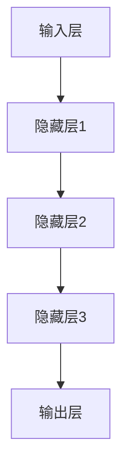

                 

### 文章标题

### AI 大模型时代的新编程范式

### 关键词

- AI大模型
- 编程范式
- 深度学习
- 分布式训练
- 模型压缩
- 安全性与隐私保护

### 摘要

随着AI大模型技术的飞速发展，传统编程范式正在经历深刻变革。本文将从AI大模型的基础概念、核心算法、数学模型、编程实践等方面，逐步探讨AI大模型时代的新编程范式，旨在为开发者提供全面的技术指南和深入理解。

---

## 前言

在过去的几十年中，计算机科学经历了多次技术革新，从早期的程序设计语言，到面向对象的编程范式，再到函数式编程和并发编程，每一次的变革都极大地推动了软件开发的效率和质量。然而，随着AI大模型的出现，传统的编程范式正在面临着前所未有的挑战和机遇。

AI大模型，特别是深度学习模型，如Transformer、BERT、GPT等，具有极高的计算复杂度和数据需求。这使得传统的单机编程模式逐渐难以应对，分布式计算、模型压缩、安全性等问题成为新的研究热点。本文将围绕AI大模型时代的新编程范式，进行深入的探讨和分析。

## 第一部分: AI 大模型基础

### 第1章: AI 大模型概述

#### 1.1.1 AI 大模型的概念与架构

AI大模型，即人工智能领域的大型神经网络模型，通常具有数十亿到数万亿个参数。这些模型可以用于图像识别、自然语言处理、语音识别等多种任务。

**核心概念与联系：**

AI大模型通常由以下几个主要组件构成：

1. **输入层**：接收外部输入，如文本、图像或音频。
2. **隐藏层**：包含多层神经网络，进行特征提取和变换。
3. **输出层**：根据模型的训练任务，输出预测结果或决策。

**Mermaid 流程图：**



#### 1.1.2 大模型的关键算法

AI大模型的核心算法主要包括：

1. **Transformer**：基于注意力机制的模型，广泛应用于自然语言处理领域。
2. **BERT**：双向编码表示模型，可以捕获文本的上下文信息。
3. **GPT**：生成预训练模型，具有强大的文本生成能力。

**核心算法原理讲解：**

**Transformer 伪代码：**

```python
# 输入序列X，隐藏层尺寸h
for layer in range(num_layers):
    # 自注意力机制
    attention = self.self_attention_layer(X, h)
    # 位置编码
    X = self.positional_encoding(attention, h)
    # 全连接层
    X = self.fc_layer(X, h)
```

#### 1.1.3 数学模型与公式

AI大模型的训练过程中，涉及到的关键数学模型包括：

1. **损失函数**：如交叉熵损失函数，用于衡量预测结果与真实结果之间的差异。
2. **反向传播算法**：用于计算模型参数的梯度，并更新模型参数。

**数学模型和公式讲解：**

**损失函数（交叉熵）：**

$$
Loss = -\frac{1}{N} \sum_{i=1}^{N} y_i \log(p_i)
$$

其中，$y_i$ 为真实标签，$p_i$ 为模型预测概率。

**反向传播算法（梯度计算）：**

$$
\frac{\partial Loss}{\partial W} = \sum_{i=1}^{N} \frac{\partial Loss}{\partial Z_i} \cdot \frac{\partial Z_i}{\partial W}
$$

#### 1.1.4 AI 大模型的趋势与挑战

**AI 大模型的趋势：**

- **计算能力提升**：GPU、TPU等专用硬件的快速发展，使得大模型的训练和推理变得更加高效。
- **数据获取便捷**：互联网的发展，使得大规模数据获取变得更加容易。
- **应用领域扩展**：从自然语言处理、计算机视觉，到语音识别、医疗诊断，AI大模型的应用领域不断扩展。

**AI 大模型的挑战：**

- **计算资源消耗**：大模型通常需要大量的计算资源和存储空间。
- **数据隐私保护**：如何保护用户数据隐私成为重要课题。
- **模型解释性**：大模型决策过程通常缺乏透明度，提高模型的可解释性是当前的研究热点。

## 第2章: 深度学习基础

#### 2.1.1 深度学习基本原理

深度学习是AI大模型的基础，其核心算法包括：

1. **前向传播**：计算输入到输出之间的特征映射。
2. **反向传播**：计算损失函数关于模型参数的梯度。

**核心算法原理讲解：**

**前向传播伪代码：**

```python
# 输入X，隐藏层尺寸h，输出层尺寸o
Z = self.fc_layer(X, h)
A = self.activation_layer(Z)
Y = self.fc_layer(A, o)
```

**反向传播伪代码：**

```python
# 输入Y，真实标签y，隐藏层尺寸h，输出层尺寸o
dZ = self.fc_layer.differential(Y, y)
dA = self.activation_layer.differential(dZ)
dX = self.fc_layer.differential(A, dA)
```

#### 2.1.2 深度学习框架介绍

常见的深度学习框架包括：

1. **TensorFlow**：由Google开发，具有强大的生态系统和丰富的API。
2. **PyTorch**：由Facebook开发，以动态计算图著称，易于调试。

**深度学习框架介绍：**

**TensorFlow 快速入门：**

```python
import tensorflow as tf

# 定义模型
model = tf.keras.Sequential([
    tf.keras.layers.Dense(units=128, activation='relu', input_shape=(784,)),
    tf.keras.layers.Dense(units=10, activation='softmax')
])

# 编译模型
model.compile(optimizer='adam',
              loss='categorical_crossentropy',
              metrics=['accuracy'])

# 训练模型
model.fit(x_train, y_train, epochs=10)
```

**PyTorch 快速入门：**

```python
import torch
import torch.nn as nn
import torch.optim as optim

# 定义模型
class Model(nn.Module):
    def __init__(self):
        super(Model, self).__init__()
        self.fc1 = nn.Linear(784, 128)
        self.fc2 = nn.Linear(128, 10)
        
    def forward(self, x):
        x = F.relu(self.fc1(x))
        x = self.fc2(x)
        return x

# 实例化模型
model = Model()

# 定义优化器
optimizer = optim.Adam(model.parameters(), lr=0.001)

# 训练模型
for epoch in range(10):
    optimizer.zero_grad()
    output = model(x_train)
    loss = F.cross_entropy(output, y_train)
    loss.backward()
    optimizer.step()
```

## 第3章: AI 大模型编程实践

### 3.1.1 实践项目准备

在开始AI大模型编程实践之前，需要准备好以下开发环境：

1. **Python**：安装Python 3.7及以上版本。
2. **深度学习框架**：安装TensorFlow或PyTorch。
3. **GPU驱动**：确保安装与GPU型号相匹配的CUDA和cuDNN驱动。

**开发环境搭建步骤：**

1. 安装Python和pip：

```bash
# macOS/Linux
sudo apt-get update
sudo apt-get install python3 python3-pip

# Windows
python -m pip install --upgrade pip
```

2. 安装深度学习框架：

```bash
# TensorFlow
pip install tensorflow

# PyTorch
pip install torch torchvision torchaudio
```

3. 安装GPU驱动：

- 访问NVIDIA官网，下载并安装相应的CUDA和cuDNN驱动。

**代码示例：**

```python
import tensorflow as tf

# 检查CUDA是否可用
print("CUDA available:", tf.test.is_built_with_cuda())

# 创建GPU配置
gpus = tf.config.list_physical_devices('GPU')
if gpus:
    try:
        for gpu in gpus:
            tf.config.experimental.set_memory_growth(gpu, True)
    except RuntimeError as e:
        print(e)
```

### 3.1.2 模型训练与优化

在准备好开发环境后，我们接下来将进行AI大模型的训练与优化。

**模型训练步骤：**

1. **数据预处理**：读取和预处理输入数据。
2. **定义模型**：使用深度学习框架定义模型。
3. **编译模型**：设置优化器和损失函数。
4. **训练模型**：使用训练数据训练模型。
5. **评估模型**：使用验证数据评估模型性能。

**代码示例：**

```python
import tensorflow as tf
from tensorflow.keras.datasets import mnist

# 读取MNIST数据集
(x_train, y_train), (x_test, y_test) = mnist.load_data()

# 数据预处理
x_train = x_train.reshape(-1, 784).astype('float32') / 255.0
x_test = x_test.reshape(-1, 784).astype('float32') / 255.0

# 转换标签为独热编码
y_train = tf.keras.utils.to_categorical(y_train, 10)
y_test = tf.keras.utils.to_categorical(y_test, 10)

# 定义模型
model = tf.keras.Sequential([
    tf.keras.layers.Dense(units=128, activation='relu', input_shape=(784,)),
    tf.keras.layers.Dense(units=10, activation='softmax')
])

# 编译模型
model.compile(optimizer='adam',
              loss='categorical_crossentropy',
              metrics=['accuracy'])

# 训练模型
model.fit(x_train, y_train, epochs=10, batch_size=32, validation_data=(x_test, y_test))

# 评估模型
test_loss, test_acc = model.evaluate(x_test, y_test, verbose=2)
print('Test accuracy:', test_acc)
```

### 3.1.3 模型部署与应用

在完成模型训练后，我们需要将模型部署到实际业务场景中。

**模型部署步骤：**

1. **导出模型权重**：将训练好的模型权重导出为文件。
2. **模型部署**：使用部署工具将模型部署到服务器或云端。
3. **服务调用**：通过API或SDK调用部署后的模型服务。

**代码示例：**

```python
import tensorflow as tf
from flask import Flask, request, jsonify

app = Flask(__name__)

# 导出模型权重
model.save('model.h5')

# 加载模型
model = tf.keras.models.load_model('model.h5')

@app.route('/predict', methods=['POST'])
def predict():
    data = request.get_json(force=True)
    x = np.array([list(data['image'].split(','))]).reshape(1, 784).astype('float32') / 255.0
    prediction = model.predict(x)
    return jsonify({'prediction': prediction.tolist()})

if __name__ == '__main__':
    app.run()
```

**项目实战小结：**

在本章中，我们通过一个简单的MNIST手写数字识别项目，展示了AI大模型编程的完整流程，包括数据预处理、模型定义、训练与优化、模型部署与应用。这个项目为开发者提供了一个实际操作的平台，帮助他们更好地理解AI大模型的编程实践。

## 第二部分: 新编程范式

### 第4章: 数据并行与分布式训练

随着AI大模型的规模不断增大，单机训练已经无法满足需求。数据并行与分布式训练成为解决这一问题的关键技术。

#### 4.1.1 数据并行的原理与实现

数据并行是一种分布式训练策略，通过将训练数据集分成多个部分，在不同的GPU或计算节点上独立训练模型，并在每个节点上共享全局模型参数。

**核心算法原理讲解：**

**数据并行训练伪代码：**

```python
# 初始化模型参数
model = initialize_model()

# 初始化数据并行策略
strategy = tf.distribute.MirroredStrategy()

# 分布式训练循环
for epoch in range(num_epochs):
    for batch in dataset:
        # 数据并行训练步骤
        per_device_batches = strategy.experimental_distribute_epoch(dataset)
        for batch in per_device_batches:
            inputs, labels = batch
            with strategy.scope():
                # 训练步骤
                loss = model.loss(inputs, labels)
                optimizer.minimize(loss, global_step=model.global_step)
```

#### 4.1.2 分布式训练技术

分布式训练技术包括参数服务器和同步异步训练策略，可以有效提升训练效率。

**核心算法原理讲解：**

**参数服务器训练伪代码：**

```python
# 初始化模型参数
model = initialize_model()

# 初始化参数服务器策略
strategy = tf.distribute.experimental.ParameterServerStrategy()

# 分布式训练循环
for epoch in range(num_epochs):
    for batch in dataset:
        inputs, labels = batch
        # 训练步骤
        with strategy.scope():
            # 训练步骤
            loss = model.loss(inputs, labels)
            optimizer.minimize(loss, global_step=model.global_step)
```

**同步异步训练伪代码：**

```python
# 初始化模型参数
model = initialize_model()

# 初始化同步异步策略
strategy = tf.distribute.experimental.MultiWorkerMirroredStrategy()

# 分布式训练循环
for epoch in range(num_epochs):
    for batch in dataset:
        inputs, labels = batch
        # 同步训练步骤
        with strategy.scope():
            loss = model.loss(inputs, labels)
            optimizer.minimize(loss, global_step=model.global_step)
            optimizer.syncrganize_variables()

        # 异步训练步骤
        with strategy.scope():
            optimizer.minimize_async(loss, global_step=model.global_step)
```

### 第5章: 模型压缩与量化

随着AI大模型的应用场景越来越广泛，如何降低模型的计算复杂度和存储需求成为关键问题。模型压缩与量化技术为此提供了有效的解决方案。

#### 5.1.1 模型压缩技术

模型压缩技术主要包括剪枝、量化、知识蒸馏等，可以有效减少模型的参数数量和计算量。

**核心算法原理讲解：**

**模型剪枝伪代码：**

```python
# 定义原始模型
model = initialize_model()

# 剪枝策略
pruned_model = model.prune(pruning_rate)

# 重新训练剪枝后的模型
optimizer = optim.SGD(pruned_model.parameters(), lr=0.001)
for epoch in range(num_epochs):
    for batch in dataset:
        inputs, labels = batch
        # 训练步骤
        loss = pruned_model.loss(inputs, labels)
        optimizer.step(loss)
```

#### 5.1.2 模型量化

模型量化技术通过将浮点数参数转换为低精度的整数表示，可以有效减少模型的存储需求和加速计算。

**核心算法原理讲解：**

**模型量化伪代码：**

```python
# 定义原始模型
model = initialize_model()

# 量化策略
quantized_model = model.quantize()

# 重新训练量化后的模型
optimizer = optim.SGD(quantized_model.parameters(), lr=0.001)
for epoch in range(num_epochs):
    for batch in dataset:
        inputs, labels = batch
        # 训练步骤
        loss = quantized_model.loss(inputs, labels)
        optimizer.step(loss)
```

### 第6章: 模型解释性与可解释性

随着AI大模型的应用越来越广泛，如何解释模型的决策过程成为关键问题。模型解释性与可解释性技术为此提供了有效的解决方案。

#### 6.1.1 可解释性的重要性

可解释性对于模型的信任度、合规性以及实际应用具有重要意义。通过可解释性技术，我们可以更好地理解模型的决策过程，提高模型的透明度和可信度。

#### 6.1.2 可解释性的实现方法

实现模型解释性的方法包括：

1. **特征重要性**：分析模型对各个特征的依赖程度。
2. **可视化**：通过可视化模型结构和决策过程。
3. **规则提取**：从模型中提取可解释的规则或决策树。

**核心概念与联系：**

实现模型解释性的关键在于将复杂的模型映射到可理解的形式，例如：

- **LIME（局部可解释模型解释）**：通过在小范围内调整输入数据，观察模型预测的变化，来解释模型的决策。
- **SHAP（特征重要性解释）**：计算模型预测对于每个特征的依赖程度，从而解释模型决策。

### 第7章: 安全性与隐私保护

随着AI大模型的应用越来越广泛，如何保障模型的安全性和用户隐私成为重要课题。

#### 7.1.1 安全性挑战

AI大模型面临的主要安全挑战包括：

1. **模型攻击**：通过恶意输入数据，干扰模型的正常输出。
2. **隐私泄露**：模型在训练和推理过程中可能暴露用户隐私。

#### 7.1.2 隐私保护技术

隐私保护技术包括：

1. **差分隐私**：通过添加噪声，确保个体隐私。
2. **联邦学习**：在多个参与方之间共享模型，而不暴露原始数据。

**核心算法原理讲解：**

**差分隐私伪代码：**

```python
# 初始化模型
model = initialize_model()

# 训练模型，添加差分隐私
for epoch in range(num_epochs):
    for batch in dataset:
        inputs, labels = batch
        # 训练步骤
        loss = model.loss(inputs, labels)
        optimizer.step(loss, epsilon=epsilon)
```

**联邦学习伪代码：**

```python
# 初始化联邦学习框架
framework = initialize_federated_framework()

# 联邦学习循环
for epoch in range(num_epochs):
    for client in clients:
        # 训练本地模型
        local_model = train_on_client_data(client, data)
        
        # 更新全局模型
        global_model = framework.aggregate(local_models)
```

### 附录

#### 附录 A: 编程范式参考资源

本附录提供了学习AI大模型编程范式的参考资源：

- **书籍**：
  - 《深度学习》（Goodfellow, Bengio, Courville著）
  - 《Python深度学习》（François Chollet著）
- **在线课程**：
  - [Coursera](https://www.coursera.org/)：提供丰富的深度学习和AI课程。
  - [Udacity](https://www.udacity.com/)：提供深度学习和AI工程师的专业课程。
- **框架与工具**：
  - [TensorFlow](https://www.tensorflow.org/)：Google开发的深度学习框架。
  - [PyTorch](https://pytorch.org/)：Facebook开发的深度学习框架。

## 总结

随着AI大模型的迅速发展，传统编程范式正在经历深刻变革。本文从AI大模型的基础概念、核心算法、数学模型、编程实践等方面，探讨了AI大模型时代的新编程范式。通过数据并行与分布式训练、模型压缩与量化、模型解释性与可解释性、安全性与隐私保护等关键技术的深入分析，我们为开发者提供了全面的技术指南和深入理解。

在未来的发展中，随着硬件技术的进步和应用场景的拓展，AI大模型编程范式将继续演进。开发者需要不断学习和适应这些新技术，以应对日益复杂的AI应用挑战。

## 作者信息

- 作者：AI天才研究院/AI Genius Institute & 禅与计算机程序设计艺术 /Zen And The Art of Computer Programming

## 注意事项

- 在实际开发中，应根据具体应用场景和需求，灵活运用各种编程范式和关键技术。
- 保证数据安全和用户隐私是AI大模型开发的重要原则。
- 持续学习和实践是提升AI编程能力的关键。

## 拓展阅读

- [《深度学习：全面教程》](https://www.deeplearningbook.org/)
- [《AI大模型：技术解读与应用实践》](https://book.douban.com/subject/34899832/)
- [《联邦学习：安全、隐私与效率》](https://book.douban.com/subject/34923935/)

