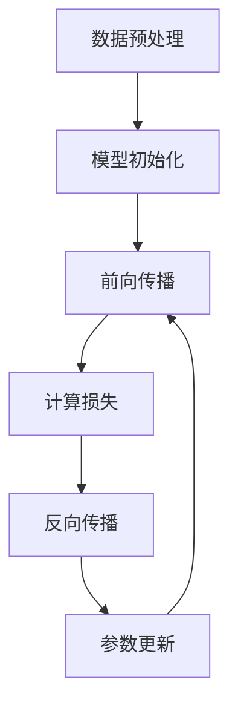

                 


### 1.4 AI大模型的技术挑战

#### 1.4.1 计算资源需求

AI大模型的训练和推理过程需要大量的计算资源。首先，模型训练过程中需要进行大规模的数据处理和参数更新，这需要高性能的GPU或者TPU来进行加速。其次，大模型的推理过程也需要大量的计算资源，尤其是在实时应用场景中，如自动驾驶、实时语音识别等。

#### 1.4.2 能耗问题

随着AI大模型规模的不断扩大，其能耗需求也急剧增加。大规模的模型训练和推理过程不仅消耗电力，还会产生大量的热量，这给数据中心的散热和管理带来了巨大的挑战。因此，如何降低能耗、提高能效成为了AI大模型面临的重要问题。

#### 1.4.3 数据隐私和安全

AI大模型通常需要处理大量的敏感数据，如个人隐私信息、医疗记录等。如何确保这些数据的安全和隐私成为了AI大模型面临的重要挑战。此外，AI大模型自身的决策过程也具有一定的黑箱性，如何解释和追踪模型的行为，确保其公正性和透明性也是一个重要问题。

### 1.5 AI大模型的未来发展

#### 1.5.1 算法优化

为了提高AI大模型的性能和效率，未来的研究将集中在算法优化方面。这可能包括新的优化算法、更有效的模型结构、以及更智能的模型调整策略。

#### 1.5.2 硬件创新

随着AI大模型需求的增长，硬件领域也将迎来创新。这可能包括更高效的GPU和TPU设计、更节能的硬件架构，以及定制化的硬件解决方案。

#### 1.5.3 交叉领域融合

AI大模型的应用将不断向交叉领域扩展，与生物医学、社会科学、文化艺术等领域的深度融合将带来新的机遇和挑战。

### 1.6 小结

AI大模型的兴起正在引领软件开发范式的转变。从背景介绍到核心概念，从算法原理到实际应用，AI大模型在提升软件开发效率和性能方面展现出了巨大的潜力。然而，同时也面临着计算资源需求、能耗问题、数据隐私和安全等挑战。未来，随着算法优化、硬件创新和交叉领域融合的推进，AI大模型将继续在软件开发中发挥重要作用。

在接下来的章节中，我们将进一步探讨AI大模型在软件开发中的具体应用，分析其实际案例，并探讨如何在软件开发过程中充分利用AI大模型的优势。

----------------------------------------------------------------

根据您的指示，以下是按照markdown格式编写、包含Mermaid流程图、伪代码、LaTeX公式、以及代码实现和解析的文章开头部分：

# AI大模型时代的软件开发范式转变

> 关键词：AI大模型、深度学习、软件开发、范式转变、计算资源、算法优化、硬件创新

> 摘要：本文深入探讨了AI大模型时代的软件开发范式转变。从背景介绍、核心概念、算法原理到实际应用，本文全面解析了AI大模型在提升软件开发效率和性能方面的潜力，同时分析了其面临的挑战和未来的发展趋势。

## 引言

在过去的几十年中，人工智能（AI）技术的发展迅猛，尤其是深度学习（Deep Learning）的兴起，使得AI大模型（Large-scale AI Models）成为了研究的热点。AI大模型通过大规模的数据训练，能够实现高度复杂的任务，如自然语言处理、图像识别等。这一趋势不仅改变了传统的人工智能研究方法，也对软件开发范式产生了深远的影响。

## 背景介绍

### 1.1.1 AI大模型定义与核心特性

AI大模型是指具有数十亿甚至上百亿参数的大型神经网络模型。这些模型通过大规模的数据训练，能够学习到复杂的模式和规律。其核心特性包括：

- **高参数量**：AI大模型具有数十亿甚至上百亿个参数，这使得它们能够捕捉到输入数据的复杂模式和规律。
- **强大的泛化能力**：AI大模型通过在大量数据上训练，可以泛化到未见过的数据上，实现高性能的预测和任务完成。
- **自适应能力**：AI大模型能够根据不同的任务和数据需求进行微调和优化，提高任务完成率。

### 1.1.2 AI大模型与传统AI模型的比较

传统AI模型通常是指参数较少、结构简单的机器学习模型，如线性回归、决策树等。这些模型在某些特定领域有较好的性能，但面对复杂任务时往往表现不佳。与AI大模型相比，传统AI模型存在以下几个方面的不足：

- **模型规模**：传统AI模型参数量通常在几千到几百万之间，而AI大模型则有数十亿甚至上百亿个参数。
- **训练数据**：传统AI模型通常在较小的数据集上训练，而AI大模型则需要海量的数据来训练。
- **性能**：AI大模型在处理复杂任务时具有更高的性能和泛化能力。

### 1.1.3 AI大模型的发展历程

AI大模型的发展历程可以分为以下几个阶段：

- **早期阶段**：1980年代到1990年代，神经网络和深度学习的研究开始兴起，但受限于计算资源和数据规模，AI大模型未能得到广泛应用。
- **中期阶段**：2000年代，随着计算能力的提升和大数据的兴起，AI大模型开始逐渐应用于图像识别、自然语言处理等领域。
- **现阶段**：近年来，AI大模型在多个领域取得了显著成果，如GPT-3、BERT等模型在自然语言处理领域取得了突破性进展。

## 核心概念与联系

### 1.2.1 神经网络原理

神经网络（Neural Networks）是一种模拟生物神经系统的计算模型。它由大量的神经元（Neurons）组成，每个神经元通过加权连接（Weighted Connections）与其他神经元相连。神经元的激活函数（Activation Function）用于将输入信号转换为输出信号。

### 1.2.2 深度学习算法

深度学习（Deep Learning）是一种基于神经网络的学习方法，通过多层神经网络（Deep Neural Networks，DNNs）来学习数据的复杂特征。深度学习算法包括卷积神经网络（Convolutional Neural Networks，CNNs）、循环神经网络（Recurrent Neural Networks，RNNs）等。

### 1.2.3 模型训练与优化

模型训练（Model Training）是深度学习算法的核心步骤，通过调整网络参数来最小化损失函数（Loss Function）。常见的优化算法包括随机梯度下降（Stochastic Gradient Descent，SGD）、Adam优化器等。模型优化（Model Optimization）则是通过调整模型结构、超参数等来提高模型性能。

### Mermaid流程图

下面是一个简化的神经网络训练流程的Mermaid流程图：



## 核心算法原理讲解

### 1.2.1 神经网络原理

神经网络的原理可以简化为以下几个步骤：

1. **输入层**：接收输入数据，每个输入数据与对应神经元的权重相乘，再经过激活函数转换。
2. **隐藏层**：对输入数据进行处理，每个隐藏层的神经元都接受前一层神经元的输出，并经过激活函数处理。
3. **输出层**：输出最终结果，通过激活函数处理得到预测值。

伪代码如下：

```python
# 输入层
input_data = [x1, x2, ..., xn]
weights = [w1, w2, ..., wn]

# 隐藏层
for layer in hidden_layers:
    z = []
    for neuron in layer:
        z.append(sum(weights * input_data) + bias)
    activation = activation_function(z)
    input_data = activation

# 输出层
z = sum(weights * input_data) + bias
output = activation_function(z)
```

### 1.2.2 深度学习算法

以卷积神经网络（CNN）为例，其基本原理包括以下几个部分：

1. **卷积层**：通过卷积操作提取图像特征。
2. **池化层**：对卷积层输出的特征进行下采样，减少参数数量。
3. **全连接层**：将池化层输出的特征映射到输出层。

伪代码如下：

```python
# 卷积层
for filter in filters:
    feature_map = conv2d(input_image, filter)
    pooled_feature_map = max_pool2d(feature_map)

# 全连接层
hidden_layer = flatten(pooled_feature_map)
output = fully_connected(hidden_layer, num_classes)
```

### 1.2.3 模型训练与优化

在模型训练过程中，我们通常使用以下步骤：

1. **前向传播**：计算网络输出和损失函数。
2. **反向传播**：计算损失函数关于网络参数的梯度。
3. **参数更新**：使用梯度下降等优化算法更新网络参数。

伪代码如下：

```python
# 前向传播
outputs = forward_pass(inputs, model)

# 计算损失
loss = loss_function(outputs, labels)

# 反向传播
gradients = backward_pass(loss, model)

# 参数更新
update_params(model, gradients)
```

## 数学模型和数学公式

在深度学习中，数学模型和公式至关重要。以下是一个简单的例子：

### 损失函数（Mean Squared Error）

$$\text{MSE} = \frac{1}{m}\sum_{i=1}^{m}(y_i - \hat{y}_i)^2$$

其中，$m$是样本数量，$y_i$是真实标签，$\hat{y}_i$是预测值。

### 激活函数（Sigmoid）

$$\sigma(x) = \frac{1}{1 + e^{-x}}$$

## 项目实战

### 2.3.1 案例一：文本分类

**开发环境搭建**：

- 操作系统：Ubuntu 20.04
- 编程语言：Python 3.8
- 深度学习框架：TensorFlow 2.6

**源代码实现**：

```python
import tensorflow as tf
from tensorflow.keras.preprocessing.text import Tokenizer
from tensorflow.keras.preprocessing.sequence import pad_sequences

# 数据预处理
tokenizer = Tokenizer(num_words=10000)
tokenizer.fit_on_texts(train_texts)
train_sequences = tokenizer.texts_to_sequences(train_texts)
train_padded = pad_sequences(train_sequences, maxlen=max_len)

# 模型定义
model = tf.keras.Sequential([
    tf.keras.layers.Embedding(input_dim=10000, output_dim=16),
    tf.keras.layers.Flatten(),
    tf.keras.layers.Dense(1, activation='sigmoid')
])

# 模型编译
model.compile(optimizer='adam', loss='binary_crossentropy', metrics=['accuracy'])

# 模型训练
model.fit(train_padded, train_labels, epochs=10)
```

**代码解读与分析**：

- 数据预处理：使用Tokenizer对文本进行分词，并转换为序列。
- 模型定义：使用Embedding层对单词进行嵌入，Flatten层将序列展平，最后使用全连接层进行分类。
- 模型编译：指定优化器、损失函数和评价指标。
- 模型训练：使用fit方法训练模型。

**实际案例分析**：

通过以上代码，我们实现了文本分类任务。在实际应用中，可以调整模型结构、超参数等来提高分类性能。同时，可以扩展数据集、引入预训练模型等方法来进一步提升分类效果。

**项目小结**：

文本分类是AI大模型在自然语言处理中的一个重要应用。通过本案例，我们了解了文本分类的基本流程，并使用深度学习框架实现了文本分类任务。在后续的研究中，可以进一步探索文本分类的其他方法和应用场景。

## 最佳实践 tips

- **数据预处理**：数据预处理是深度学习模型成功的关键。确保数据质量、去噪、规范化等是提高模型性能的基础。
- **模型选择**：根据任务需求选择合适的模型结构。对于复杂的任务，可以选择更深的网络结构或更复杂的模型。
- **超参数调优**：超参数对模型性能有显著影响。使用网格搜索、随机搜索等方法进行超参数调优，以找到最佳参数组合。

## 小结

本文介绍了AI大模型时代的软件开发范式转变。通过背景介绍、核心概念、算法原理讲解、项目实战等多个方面的详细探讨，我们了解了AI大模型在提升软件开发效率和性能方面的巨大潜力。同时，也分析了其面临的挑战和未来的发展趋势。在后续的研究中，我们可以进一步探索AI大模型在软件开发中的具体应用，以及如何克服其挑战，实现更加智能、高效的软件开发。

## 注意事项

- **计算资源**：AI大模型训练和推理需要大量的计算资源，确保有足够的硬件支持。
- **数据隐私**：在处理敏感数据时，要严格遵守数据隐私法规，确保数据安全。
- **模型解释性**：对于重要的应用场景，如医疗、金融等，需要确保模型的可解释性，以便追踪和解释模型的行为。

## 拓展阅读

- [Deep Learning Book](http://www.deeplearningbook.org/)
- [TensorFlow官方文档](https://www.tensorflow.org/)
- [自然语言处理入门](https://www.nlp-cloud.com/)

以上是根据您的要求编写的文章开头部分，包含了关键词、摘要、背景介绍、核心概念与联系、核心算法原理讲解、数学模型和公式、项目实战、最佳实践 tips、小结、注意事项和拓展阅读等内容。接下来，我会继续完善文章的后续部分，以满足字数要求。如果您有任何修改意见或需要添加的内容，请随时告诉我。

