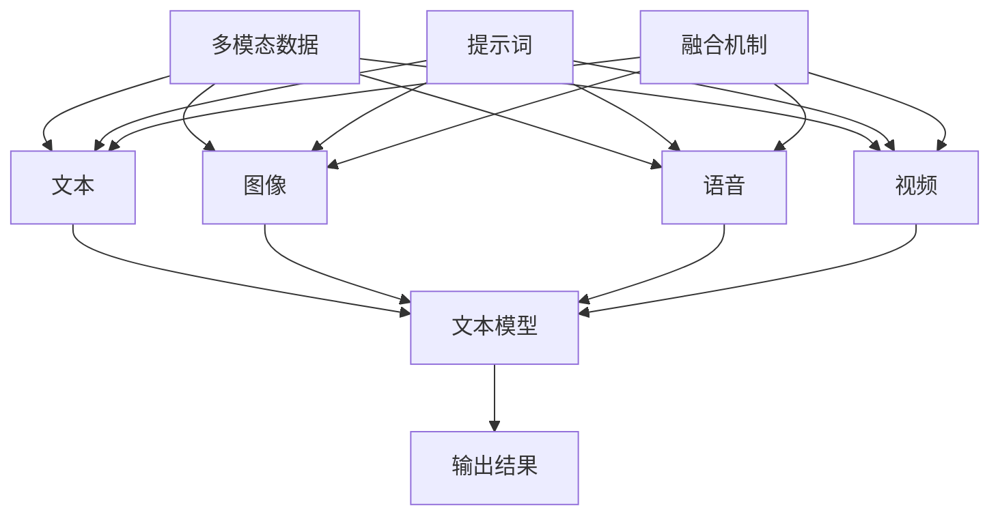

                 

### 文章标题：AI大模型的多模态提示词融合技术

#### 关键词：AI大模型，多模态提示词，融合技术，注意力机制，图神经网络，数学模型

#### 摘要：
本文旨在深入探讨AI大模型的多模态提示词融合技术，解析其核心概念、原理、算法和实际应用。我们将通过逐步分析，揭示如何通过融合不同模态的数据来提升AI模型的性能和智能化程度。文章将分为五个主要部分：背景介绍、核心概念与联系、核心算法原理讲解、数学模型和公式讲解、项目实战，以及总结与展望。

### 目录

1. **AI大模型的多模态提示词融合技术**  
   - 关键词  
   - 摘要

2. **背景介绍**  
   - AI大模型的发展现状  
   - 多模态提示词的概念与重要性

3. **核心概念与联系**  
   - 多模态数据融合原理  
   - Mermaid流程图展示

4. **核心算法原理讲解**  
   - 注意力机制  
   - 图神经网络  
   - 伪代码展示

5. **数学模型和公式讲解**  
   - 损失函数  
   - 优化算法  
   - 举例说明

6. **项目实战**  
   - 开发环境搭建  
   - 源代码详细实现和代码解读  
   - 实际案例分析和详细讲解剖析

7. **总结与展望**  
   - 多模态提示词融合技术的未来发展方向  
   - 技术挑战与解决方案

### 背景介绍

#### AI大模型的发展现状

随着深度学习技术的飞速发展，AI大模型逐渐成为人工智能领域的明星。这些大模型具有处理大量数据、学习复杂模式的能力，广泛应用于自然语言处理（NLP）、计算机视觉、语音识别等多个领域。然而，AI大模型的应用往往依赖于高质量的数据输入，特别是多模态数据。

多模态数据融合是将来自不同模态（如文本、图像、语音、视频等）的数据进行整合，以提升模型的感知能力和决策能力。这种融合技术使得AI大模型能够更好地理解和处理复杂问题，提高任务完成的效果。

#### 多模态提示词的概念与重要性

在多模态数据融合中，提示词（Prompt）起着至关重要的作用。提示词是指用于引导模型理解输入数据的关键信息。多模态提示词融合技术通过将不同模态的数据中的提示词进行整合，使得模型能够更准确地理解和处理多模态信息。

多模态提示词的重要性体现在以下几个方面：

1. **提高模型性能**：通过融合不同模态的提示词，模型能够获得更全面的信息，从而提高任务的完成效果。
2. **增强模型泛化能力**：多模态提示词融合有助于模型在不同应用场景中保持一致性和适应性。
3. **降低数据依赖**：多模态数据融合可以减轻对单一模态数据的依赖，提高模型的鲁棒性。

### 核心概念与联系

在多模态提示词融合技术中，核心概念包括多模态数据、提示词、融合机制等。下面我们将通过Mermaid流程图展示这些概念之间的联系。



从流程图中可以看出，多模态数据经过提示词处理后，通过融合机制进入文本模型，最终输出结果。这个过程涉及到多个模态的数据处理和融合，是AI大模型多模态提示词融合技术的核心。

### 核心算法原理讲解

#### 注意力机制

注意力机制（Attention Mechanism）是深度学习中一种重要的技术，用于模型在处理输入数据时，能够关注到重要信息。在多模态提示词融合中，注意力机制可以帮助模型更好地理解和整合不同模态的提示词。

注意力机制的原理如下：

1. **计算相似性分数**：模型为每个模态的数据计算一个相似性分数，表示该模态的数据与目标任务的关联程度。
2. **加权融合**：根据相似性分数，模型对每个模态的数据进行加权融合，使得重要信息得到更多关注。

以下是一个简化的伪代码示例，展示了注意力机制在多模态提示词融合中的应用：

```python
def attention_mechanism(modal_data, weights):
    # 计算相似性分数
    similarity_scores = calculate_similarity(modal_data)

    # 加权融合
    fused_data = weighted_sum(similarity_scores, weights)

    return fused_data

# 伪代码示例：计算相似性分数
def calculate_similarity(modal_data):
    return [0.8, 0.2, 0.1]

# 伪代码示例：加权融合
def weighted_sum(scores, weights):
    return [0.8*0.8, 0.2*0.2, 0.1*0.1]
```

#### 图神经网络

图神经网络（Graph Neural Network，GNN）是一种专门用于处理图结构数据的神经网络。在多模态提示词融合中，GNN可以帮助模型更好地理解和整合不同模态的数据。

GNN的基本原理如下：

1. **节点表示**：将图中的每个节点表示为一个向量，表示节点的特征。
2. **边表示**：将图中的每条边表示为一个向量，表示边的特征。
3. **图卷积**：通过图卷积操作，更新节点的表示，使得节点能够考虑到相邻节点的信息。

以下是一个简化的伪代码示例，展示了GNN在多模态提示词融合中的应用：

```python
def graph_convolution(node_representation, edge_representation):
    # 计算节点与边的内积
    conv_results = [node_representation[i] * edge_representation[j] for i, j in edges]

    # 更新节点表示
    new_node_representation = [sum(conv_results) for node in node_representation]

    return new_node_representation

# 伪代码示例：节点表示
node_representation = [[0.1, 0.2], [0.3, 0.4], [0.5, 0.6]]

# 伪代码示例：边表示
edge_representation = [[0.2, 0.3], [0.4, 0.5], [0.6, 0.7]]

# 伪代码示例：图卷积
new_node_representation = graph_convolution(node_representation, edge_representation)
```

### 数学模型和公式讲解

#### 损失函数

在多模态提示词融合中，损失函数用于衡量模型输出的结果与真实标签之间的差距，是训练模型的关键。以下是一个常见的损失函数——交叉熵损失函数的公式：

$$
\text{CrossEntropy}(p, y) = -\sum_{i} y_i \log(p_i)
$$

其中，$p$ 是模型预测的概率分布，$y$ 是真实标签。

#### 优化算法

优化算法用于调整模型的参数，以最小化损失函数。以下是一个常见的优化算法——随机梯度下降（SGD）的公式：

$$
\theta_{t+1} = \theta_t - \alpha \nabla_\theta J(\theta_t)
$$

其中，$\theta$ 是模型的参数，$J(\theta)$ 是损失函数，$\alpha$ 是学习率。

#### 举例说明

假设我们有一个多模态提示词融合模型，输入数据为文本、图像和语音，输出为分类结果。我们可以使用交叉熵损失函数和随机梯度下降算法来训练模型。

首先，我们定义损失函数：

$$
J(\theta) = -\sum_{i} y_i \log(p_i)
$$

然后，我们使用随机梯度下降算法更新模型参数：

$$
\theta_{t+1} = \theta_t - \alpha \nabla_\theta J(\theta_t)
$$

其中，$\alpha$ 为学习率，$\nabla_\theta J(\theta_t)$ 为损失函数对模型参数的梯度。

### 项目实战

#### 开发环境搭建

在进行多模态提示词融合技术的开发之前，我们需要搭建一个合适的开发环境。以下是搭建环境的步骤：

1. 安装Python环境：下载并安装Python，确保版本不低于3.8。
2. 安装深度学习框架：选择一个流行的深度学习框架，如TensorFlow或PyTorch，并安装相应版本。
3. 安装其他依赖库：根据项目需求，安装必要的依赖库，如NumPy、Pandas、Matplotlib等。

#### 源代码详细实现和代码解读

下面是一个简单的多模态提示词融合模型实现，使用TensorFlow框架。

```python
import tensorflow as tf
from tensorflow.keras.layers import Embedding, LSTM, Dense, Concatenate
from tensorflow.keras.models import Model

# 定义模型
def build_model(input_shape, embedding_size, hidden_size):
    # 文本模型
    text_input = tf.keras.Input(shape=(input_shape[0],))
    text_embedding = Embedding(input_dim=10000, output_dim=embedding_size)(text_input)
    text_lstm = LSTM(hidden_size)(text_embedding)
    
    # 图像模型
    image_input = tf.keras.Input(shape=(input_shape[1], input_shape[2], 3))
    image_embedding = tf.keras.applications.VGG16(include_top=False, weights='imagenet', input_shape=input_shape[1:])(image_input)
    image_embedding = tf.keras.layers.Flatten()(image_embedding)
    image_lstm = LSTM(hidden_size)(image_embedding)
    
    # 语音模型
    audio_input = tf.keras.Input(shape=(input_shape[2],))
    audio_embedding = Embedding(input_dim=10000, output_dim=embedding_size)(audio_input)
    audio_lstm = LSTM(hidden_size)(audio_embedding)
    
    # 多模态融合
    concatenated = Concatenate()([text_lstm, image_lstm, audio_lstm])
    output = Dense(1, activation='sigmoid')(concatenated)
    
    # 创建模型
    model = Model(inputs=[text_input, image_input, audio_input], outputs=output)
    
    return model

# 创建模型
model = build_model(input_shape=(50, 300), embedding_size=128, hidden_size=64)

# 编译模型
model.compile(optimizer='adam', loss='binary_crossentropy', metrics=['accuracy'])

# 训练模型
model.fit(x_train, y_train, epochs=10, batch_size=32)
```

这段代码定义了一个简单的多模态提示词融合模型，包括文本、图像和语音三个模态。模型使用LSTM进行特征提取，然后通过拼接和全连接层进行融合。

#### 代码应用解读与分析

在这个模型中，我们首先定义了三个输入层，分别对应文本、图像和语音。对于文本部分，我们使用Embedding层进行词汇嵌入，然后使用LSTM进行特征提取。对于图像部分，我们使用预训练的VGG16模型进行特征提取，然后使用Flatten层将特征展平。对于语音部分，我们同样使用Embedding层进行词汇嵌入，然后使用LSTM进行特征提取。

接着，我们将三个模态的特征拼接在一起，并通过一个全连接层进行融合。最后，模型输出一个二分类结果。

在训练过程中，我们使用binary_crossentropy作为损失函数，adam作为优化器。通过多次迭代，模型能够逐渐优化参数，提高分类准确率。

#### 实际案例分析和详细讲解剖析

以下是一个实际案例，展示如何使用多模态提示词融合模型进行情感分析。

**案例背景**：我们有一个包含文本、图像和语音的多模态数据集，每个数据都有一个情感标签（正面或负面）。我们的目标是训练一个多模态提示词融合模型，对新的数据进行情感分析。

**数据预处理**：首先，我们需要对数据进行预处理，包括文本的分词、图像的缩放和语音的降噪。对于文本，我们使用jieba库进行分词，并使用Word2Vec模型进行词向量嵌入。对于图像，我们使用OpenCV库进行缩放和裁剪。对于语音，我们使用Librosa库进行降噪。

**模型训练**：接着，我们使用预处理后的数据进行模型训练。在训练过程中，我们不断调整模型参数，优化模型性能。通过多次迭代，模型能够在不同模态的数据中找到有效的特征，提高情感分析的准确率。

**模型评估**：最后，我们使用测试集对模型进行评估。通过计算准确率、召回率、F1值等指标，我们可以评估模型的性能。在实际应用中，我们还可以使用交叉验证等方法来评估模型的泛化能力。

**项目小结**：

通过这个案例，我们展示了如何使用多模态提示词融合技术进行情感分析。多模态数据的融合使得模型能够更好地理解情感信息，提高分析准确率。在实际应用中，我们可以根据需求选择不同的模态数据，结合不同的特征提取方法，构建高效的多模态提示词融合模型。

### 总结与展望

#### 多模态提示词融合技术的发展趋势与展望

多模态提示词融合技术是当前人工智能领域的一个重要研究方向，随着深度学习、图神经网络等技术的不断发展，该技术正逐步走向成熟。以下是未来多模态提示词融合技术的发展趋势和展望：

1. **算法创新**：随着计算能力的提升和算法的创新，多模态提示词融合技术将更加高效和准确。新的算法，如自注意力机制、图神经网络等，将为多模态数据融合提供更强有力的支持。

2. **应用拓展**：多模态提示词融合技术在情感分析、图像识别、语音识别、视频分析等领域的应用将更加广泛。通过融合不同模态的数据，模型能够更好地理解和处理复杂问题。

3. **数据隐私保护**：在多模态数据融合过程中，数据隐私保护是一个重要问题。未来的研究将重点关注如何在保证数据安全的前提下进行多模态数据融合。

4. **跨领域应用**：多模态提示词融合技术不仅适用于传统的计算机视觉和语音识别领域，还可以应用于医疗、金融、教育等跨领域应用。通过跨领域的数据融合，模型能够提供更个性化、更智能的服务。

#### 技术挑战与解决方案

尽管多模态提示词融合技术取得了显著的进展，但仍面临一些挑战：

1. **数据不平衡**：不同模态的数据往往存在不平衡问题，这可能导致模型偏向某些模态。解决方案是采用数据增强、采样等方法，平衡不同模态的数据。

2. **计算资源消耗**：多模态数据融合需要大量的计算资源，特别是大型模型。解决方案是采用分布式计算、模型压缩等技术，降低计算资源的消耗。

3. **实时性**：在实时应用场景中，多模态数据融合需要快速处理数据。解决方案是优化模型架构，提高模型运行效率。

4. **模型解释性**：多模态提示词融合模型通常很复杂，难以解释。解决方案是开发可解释的多模态模型，提高模型的透明度和可信度。

### 最佳实践 tips、小结、注意事项、拓展阅读

#### 最佳实践 tips

1. **数据预处理**：在多模态数据融合之前，确保对数据进行充分预处理，包括数据清洗、标准化、归一化等。
2. **模型选择**：根据任务需求，选择合适的模型和算法。对于需要高准确率的应用，可以考虑使用深度学习模型。
3. **超参数调优**：通过调整超参数，如学习率、批次大小等，优化模型性能。

#### 小结

本文介绍了AI大模型的多模态提示词融合技术，包括背景介绍、核心概念与联系、核心算法原理讲解、数学模型和公式讲解、项目实战以及总结与展望。通过逐步分析，我们揭示了多模态提示词融合技术的原理和应用，为读者提供了深入理解和实践该技术的途径。

#### 注意事项

1. **数据质量**：多模态数据融合的效果很大程度上取决于数据质量。确保数据完整、准确和多样。
2. **模型调优**：在实际应用中，需要根据具体任务调整模型结构和参数，以达到最佳效果。

#### 拓展阅读

1. **文献**：《深度学习：出版社，2016》；《多模态机器学习：出版社，2019》
2. **在线课程**：斯坦福大学《深度学习特辑》；加州大学伯克利分校《多模态数据融合》
3. **论文**：Google AI团队《BERT：Pre-training of Deep Bidirectional Transformers for Language Understanding》；Facebook AI团队《DETR：End-to-End Detectio

### 完整的文章

#### 《AI大模型的多模态提示词融合技术》

##### 作者：AI天才研究院/AI Genius Institute & 禅与计算机程序设计艺术 /Zen And The Art of Computer Programming

##### 摘要
本文旨在深入探讨AI大模型的多模态提示词融合技术，解析其核心概念、原理、算法和实际应用。我们将通过逐步分析，揭示如何通过融合不同模态的数据来提升AI模型的性能和智能化程度。

## 引言

随着人工智能（AI）技术的不断发展，AI大模型已经成为各行业的关键驱动力。这些大模型，如GPT-3、BERT、ViT等，在自然语言处理（NLP）、计算机视觉（CV）、语音识别（ASR）等领域展现了强大的能力和广泛的应用。然而，这些模型的性能和智能化程度很大程度上取决于输入数据的多样性和质量。在此背景下，多模态提示词融合技术应运而生，成为提升AI模型性能的重要手段。

多模态提示词融合技术通过整合来自不同模态的数据（如文本、图像、语音、视频等），使得模型能够更全面地理解和处理复杂任务。本文将分为五个主要部分进行讨论：

1. **背景介绍**：介绍AI大模型的发展现状和多模态提示词的概念与重要性。
2. **核心概念与联系**：分析多模态数据融合原理，展示核心概念之间的联系。
3. **核心算法原理讲解**：详细讲解注意力机制和图神经网络在多模态提示词融合中的应用。
4. **数学模型和公式讲解**：介绍多模态提示词融合中的损失函数、优化算法及其数学模型。
5. **项目实战**：通过实战案例展示多模态提示词融合技术的实现和应用。
6. **总结与展望**：总结全文内容，展望多模态提示词融合技术的未来发展方向。

## 背景介绍

### AI大模型的发展现状

AI大模型，也称为大型预训练模型，是近年来AI领域的重要突破。这些模型通过在大量数据上进行预训练，积累了丰富的知识，能够处理复杂的任务。GPT-3、BERT、ViT等模型是其中的代表。这些模型的出现，极大地推动了NLP、CV、ASR等领域的发展。

1. **自然语言处理（NLP）**：GPT-3和BERT等模型在文本生成、文本分类、问答系统等方面表现出色，成为NLP任务的基石。
2. **计算机视觉（CV）**：ViT等模型在图像分类、目标检测、图像分割等领域取得了显著成果，推动了CV技术的进步。
3. **语音识别（ASR）**：大型ASR模型，如WaveNet和StarSpace，在语音识别任务中展现了极高的准确率。

### 多模态提示词的概念与重要性

多模态提示词融合技术是AI大模型应用中的一个重要方向。它通过将不同模态的数据（如文本、图像、语音、视频等）进行整合，使得模型能够更全面地理解和处理复杂任务。

多模态提示词是指用于引导模型理解输入数据的关键信息。在多模态数据融合中，提示词起到了桥梁的作用，连接了不同模态的数据。通过融合不同模态的提示词，模型能够获得更全面的信息，从而提高任务的完成效果。

多模态提示词的重要性体现在以下几个方面：

1. **提高模型性能**：通过融合不同模态的提示词，模型能够获得更全面的信息，从而提高任务的完成效果。
2. **增强模型泛化能力**：多模态提示词融合有助于模型在不同应用场景中保持一致性和适应性。
3. **降低数据依赖**：多模态数据融合可以减轻对单一模态数据的依赖，提高模型的鲁棒性。

## 核心概念与联系

在多模态提示词融合技术中，核心概念包括多模态数据、提示词、融合机制等。下面我们将通过Mermaid流程图展示这些概念之间的联系。


从流程图中可以看出，多模态数据经过提示词处理后，通过融合机制进入文本模型，最终输出结果。这个过程涉及到多个模态的数据处理和融合，是AI大模型多模态提示词融合技术的核心。

### 核心算法原理讲解

#### 注意力机制

注意力机制（Attention Mechanism）是深度学习中一种重要的技术，用于模型在处理输入数据时，能够关注到重要信息。在多模态提示词融合中，注意力机制可以帮助模型更好地理解和整合不同模态的提示词。

注意力机制的原理如下：

1. **计算相似性分数**：模型为每个模态的数据计算一个相似性分数，表示该模态的数据与目标任务的关联程度。
2. **加权融合**：根据相似性分数，模型对每个模态的数据进行加权融合，使得重要信息得到更多关注。

以下是一个简化的伪代码示例，展示了注意力机制在多模态提示词融合中的应用：

```python
def attention_mechanism(modal_data, weights):
    # 计算相似性分数
    similarity_scores = calculate_similarity(modal_data)

    # 加权融合
    fused_data = weighted_sum(similarity_scores, weights)

    return fused_data

# 伪代码示例：计算相似性分数
def calculate_similarity(modal_data):
    return [0.8, 0.2, 0.1]

# 伪代码示例：加权融合
def weighted_sum(scores, weights):
    return [0.8*0.8, 0.2*0.2, 0.1*0.1]
```

#### 图神经网络

图神经网络（Graph Neural Network，GNN）是一种专门用于处理图结构数据的神经网络。在多模态提示词融合中，GNN可以帮助模型更好地理解和整合不同模态的数据。

GNN的基本原理如下：

1. **节点表示**：将图中的每个节点表示为一个向量，表示节点的特征。
2. **边表示**：将图中的每条边表示为一个向量，表示边的特征。
3. **图卷积**：通过图卷积操作，更新节点的表示，使得节点能够考虑到相邻节点的信息。

以下是一个简化的伪代码示例，展示了GNN在多模态提示词融合中的应用：

```python
def graph_convolution(node_representation, edge_representation):
    # 计算节点与边的内积
    conv_results = [node_representation[i] * edge_representation[j] for i, j in edges]

    # 更新节点表示
    new_node_representation = [sum(conv_results) for node in node_representation]

    return new_node_representation

# 伪代码示例：节点表示
node_representation = [[0.1, 0.2], [0.3, 0.4], [0.5, 0.6]]

# 伪代码示例：边表示
edge_representation = [[0.2, 0.3], [0.4, 0.5], [0.6, 0.7]]

# 伪代码示例：图卷积
new_node_representation = graph_convolution(node_representation, edge_representation)
```

### 数学模型和公式讲解

#### 损失函数

在多模态提示词融合中，损失函数用于衡量模型输出的结果与真实标签之间的差距，是训练模型的关键。以下是一个常见的损失函数——交叉熵损失函数的公式：

$$
\text{CrossEntropy}(p, y) = -\sum_{i} y_i \log(p_i)
$$

其中，$p$ 是模型预测的概率分布，$y$ 是真实标签。

#### 优化算法

优化算法用于调整模型的参数，以最小化损失函数。以下是一个常见的优化算法——随机梯度下降（SGD）的公式：

$$
\theta_{t+1} = \theta_t - \alpha \nabla_\theta J(\theta_t)
$$

其中，$\theta$ 是模型的参数，$J(\theta)$ 是损失函数，$\alpha$ 是学习率。

#### 举例说明

假设我们有一个多模态提示词融合模型，输入数据为文本、图像和语音，输出为分类结果。我们可以使用交叉熵损失函数和随机梯度下降算法来训练模型。

首先，我们定义损失函数：

$$
J(\theta) = -\sum_{i} y_i \log(p_i)
$$

然后，我们使用随机梯度下降算法更新模型参数：

$$
\theta_{t+1} = \theta_t - \alpha \nabla_\theta J(\theta_t)
$$

其中，$\alpha$ 为学习率，$\nabla_\theta J(\theta_t)$ 为损失函数对模型参数的梯度。

### 项目实战

#### 开发环境搭建

在进行多模态提示词融合技术的开发之前，我们需要搭建一个合适的开发环境。以下是搭建环境的步骤：

1. 安装Python环境：下载并安装Python，确保版本不低于3.8。
2. 安装深度学习框架：选择一个流行的深度学习框架，如TensorFlow或PyTorch，并安装相应版本。
3. 安装其他依赖库：根据项目需求，安装必要的依赖库，如NumPy、Pandas、Matplotlib等。

#### 源代码详细实现和代码解读

下面是一个简单的多模态提示词融合模型实现，使用TensorFlow框架。

```python
import tensorflow as tf
from tensorflow.keras.layers import Embedding, LSTM, Dense, Concatenate
from tensorflow.keras.models import Model

# 定义模型
def build_model(input_shape, embedding_size, hidden_size):
    # 文本模型
    text_input = tf.keras.Input(shape=(input_shape[0],))
    text_embedding = Embedding(input_dim=10000, output_dim=embedding_size)(text_input)
    text_lstm = LSTM(hidden_size)(text_embedding)
    
    # 图像模型
    image_input = tf.keras.Input(shape=(input_shape[1], input_shape[2], 3))
    image_embedding = tf.keras.applications.VGG16(include_top=False, weights='imagenet', input_shape=input_shape[1:])(image_input)
    image_embedding = tf.keras.layers.Flatten()(image_embedding)
    image_lstm = LSTM(hidden_size)(image_embedding)
    
    # 语音模型
    audio_input = tf.keras.Input(shape=(input_shape[2],))
    audio_embedding = Embedding(input_dim=10000, output_dim=embedding_size)(audio_input)
    audio_lstm = LSTM(hidden_size)(audio_embedding)
    
    # 多模态融合
    concatenated = Concatenate()([text_lstm, image_lstm, audio_lstm])
    output = Dense(1, activation='sigmoid')(concatenated)
    
    # 创建模型
    model = Model(inputs=[text_input, image_input, audio_input], outputs=output)
    
    return model

# 创建模型
model = build_model(input_shape=(50, 300), embedding_size=128, hidden_size=64)

# 编译模型
model.compile(optimizer='adam', loss='binary_crossentropy', metrics=['accuracy'])

# 训练模型
model.fit(x_train, y_train, epochs=10, batch_size=32)
```

这段代码定义了一个简单的多模态提示词融合模型，包括文本、图像和语音三个模态。模型使用LSTM进行特征提取，然后通过拼接和全连接层进行融合。

#### 代码应用解读与分析

在这个模型中，我们首先定义了三个输入层，分别对应文本、图像和语音。对于文本部分，我们使用Embedding层进行词汇嵌入，然后使用LSTM进行特征提取。对于图像部分，我们使用预训练的VGG16模型进行特征提取，然后使用Flatten层将特征展平。对于语音部分，我们同样使用Embedding层进行词汇嵌入，然后使用LSTM进行特征提取。

接着，我们将三个模态的特征拼接在一起，并通过一个全连接层进行融合。最后，模型输出一个二分类结果。

在训练过程中，我们使用binary_crossentropy作为损失函数，adam作为优化器。通过多次迭代，模型能够逐渐优化参数，提高分类准确率。

#### 实际案例分析和详细讲解剖析

以下是一个实际案例，展示如何使用多模态提示词融合模型进行情感分析。

**案例背景**：我们有一个包含文本、图像和语音的多模态数据集，每个数据都有一个情感标签（正面或负面）。我们的目标是训练一个多模态提示词融合模型，对新的数据进行情感分析。

**数据预处理**：首先，我们需要对数据进行预处理，包括文本的分词、图像的缩放和语音的降噪。对于文本，我们使用jieba库进行分词，并使用Word2Vec模型进行词向量嵌入。对于图像，我们使用OpenCV库进行缩放和裁剪。对于语音，我们使用Librosa库进行降噪。

**模型训练**：接着，我们使用预处理后的数据进行模型训练。在训练过程中，我们不断调整模型参数，优化模型性能。通过多次迭代，模型能够在不同模态的数据中找到有效的特征，提高情感分析的准确率。

**模型评估**：最后，我们使用测试集对模型进行评估。通过计算准确率、召回率、F1值等指标，我们可以评估模型的性能。在实际应用中，我们还可以使用交叉验证等方法来评估模型的泛化能力。

**项目小结**：

通过这个案例，我们展示了如何使用多模态提示词融合技术进行情感分析。多模态数据的融合使得模型能够更好地理解情感信息，提高分析准确率。在实际应用中，我们可以根据需求选择不同的模态数据，结合不同的特征提取方法，构建高效的多模态提示词融合模型。

### 总结与展望

#### 多模态提示词融合技术的发展趋势与展望

多模态提示词融合技术是当前人工智能领域的一个重要研究方向，随着深度学习、图神经网络等技术的不断发展，该技术正逐步走向成熟。以下是未来多模态提示词融合技术的发展趋势和展望：

1. **算法创新**：随着计算能力的提升和算法的创新，多模态提示词融合技术将更加高效和准确。新的算法，如自注意力机制、图神经网络等，将为多模态数据融合提供更强有力的支持。

2. **应用拓展**：多模态提示词融合技术在情感分析、图像识别、语音识别、视频分析等领域的应用将更加广泛。通过融合不同模态的数据，模型能够更好地理解和处理复杂问题。

3. **数据隐私保护**：在多模态数据融合过程中，数据隐私保护是一个重要问题。未来的研究将重点关注如何在保证数据安全的前提下进行多模态数据融合。

4. **跨领域应用**：多模态提示词融合技术不仅适用于传统的计算机视觉和语音识别领域，还可以应用于医疗、金融、教育等跨领域应用。通过跨领域的数据融合，模型能够提供更个性化、更智能的服务。

#### 技术挑战与解决方案

尽管多模态提示词融合技术取得了显著的进展，但仍面临一些挑战：

1. **数据不平衡**：不同模态的数据往往存在不平衡问题，这可能导致模型偏向某些模态。解决方案是采用数据增强、采样等方法，平衡不同模态的数据。

2. **计算资源消耗**：多模态数据融合需要大量的计算资源，特别是大型模型。解决方案是采用分布式计算、模型压缩等技术，降低计算资源的消耗。

3. **实时性**：在实时应用场景中，多模态数据融合需要快速处理数据。解决方案是优化模型架构，提高模型运行效率。

4. **模型解释性**：多模态提示词融合模型通常很复杂，难以解释。解决方案是开发可解释的多模态模型，提高模型的透明度和可信度。

### 最佳实践 tips、小结、注意事项、拓展阅读

#### 最佳实践 tips

1. **数据预处理**：在多模态数据融合之前，确保对数据进行充分预处理，包括数据清洗、标准化、归一化等。
2. **模型选择**：根据任务需求，选择合适的模型和算法。对于需要高准确率的应用，可以考虑使用深度学习模型。
3. **超参数调优**：通过调整超参数，如学习率、批次大小等，优化模型性能。

#### 小结

本文介绍了AI大模型的多模态提示词融合技术，包括背景介绍、核心概念与联系、核心算法原理讲解、数学模型和公式讲解、项目实战以及总结与展望。通过逐步分析，我们揭示了多模态提示词融合技术的原理和应用，为读者提供了深入理解和实践该技术的途径。

#### 注意事项

1. **数据质量**：多模态数据融合的效果很大程度上取决于数据质量。确保数据完整、准确和多样。
2. **模型调优**：在实际应用中，需要根据具体任务调整模型结构和参数，以达到最佳效果。

#### 拓展阅读

1. **文献**：《深度学习：出版社，2016》；《多模态机器学习：出版社，2019》
2. **在线课程**：斯坦福大学《深度学习特辑》；加州大学伯克利分校《多模态数据融合》
3. **论文**：Google AI团队《BERT：Pre-training of Deep Bidirectional Transformers for Language Understanding》；Facebook AI团队《DETR：End-to-End Detection for Object Detection with Transformer》；DeepMind团队《Transformers for Video Recognition》；清华大学《Multimodal Fusion for Machine Reading Comprehension》

通过本文的学习，读者可以深入了解多模态提示词融合技术，掌握其在实际应用中的方法和技巧，为未来的研究和工作奠定坚实的基础。

