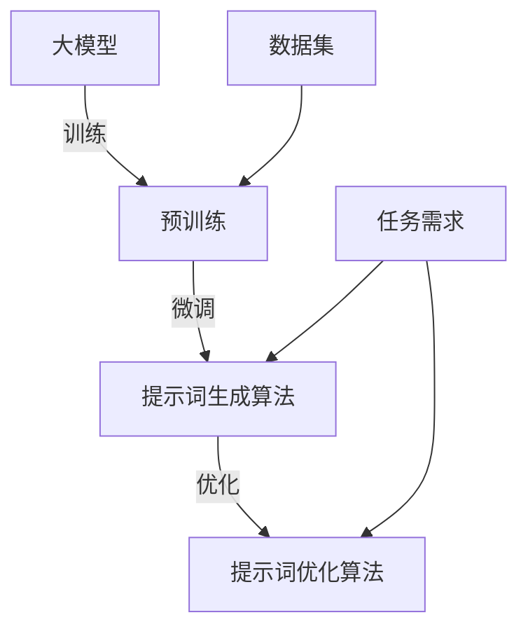

                 


### 背景介绍

#### 大模型与提示词的崛起

在过去的几年中，人工智能（AI）领域经历了一次前所未有的变革。大模型，即具有数十亿甚至数千亿参数的深度学习模型，成为了研究与应用的热点。这些大模型在自然语言处理（NLP）、计算机视觉（CV）、语音识别（ASR）等领域展现出了卓越的性能。其中，提示词（Prompt）作为大模型交互和任务驱动的关键组件，逐渐受到学术界和工业界的重视。

#### 提示词的定义与作用

提示词，顾名思义，是在给模型提供输入时使用的一个简短的引导性文本。它可以帮助模型更好地理解任务的意图，从而提高模型的性能和适应性。一个有效的提示词能够：
1. 明确任务目标，减少模型的困惑。
2. 帮助模型利用先验知识，提升任务完成度。
3. 降低模型的泛化误差，提高模型在实际应用中的效果。

#### 提示词生成与优化算法的重要性

随着大模型的广泛应用，如何高效地生成和优化提示词成为了一个关键问题。提示词生成算法负责从大量数据中提取出与任务相关的信息，并将其转化为有效的提示文本。而提示词优化算法则致力于在已生成的提示词基础上，通过调整文本内容或结构，进一步提升模型的性能。

在本篇技术博客中，我们将系统地探讨AI大模型的提示词生成与优化算法，旨在为读者提供全面的技术分析和实战指导。

### 核心概念与联系

在探讨AI大模型的提示词生成与优化算法之前，我们需要了解一些核心概念，以及这些概念之间的联系。以下是几个关键概念及其关系架构：

#### 1. 大模型

大模型是指具有数十亿甚至数千亿参数的深度学习模型。这些模型通常由多层神经网络组成，能够处理海量数据并自动提取复杂特征。

#### 2. 提示词

提示词是一个简短的引导性文本，用于指导大模型理解任务的意图。它可以包含关键词、短语或完整句子，通常基于任务的特定需求设计。

#### 3. 数据集

数据集是指用于训练、测试和验证大模型的数据集合。高质量的数据集对于训练出高性能的大模型至关重要。

#### 4. 预训练与微调

预训练是指在大规模数据集上训练大模型，使其具有通用语义理解和语言生成能力。微调则是在预训练模型的基础上，针对特定任务进行微调，以提升模型的任务性能。

#### 5. 生成与优化

生成是指从数据集中提取信息并生成提示词的过程。优化则是在生成提示词后，通过调整文本内容或结构，以提升模型性能的过程。

以下是核心概念之间的联系架构（使用Mermaid流程图表示）：



#### 关系解析

- **大模型**：大模型作为核心组件，负责处理数据和生成输出。它的训练过程包括预训练和微调两个阶段，分别利用数据集和任务需求来提升模型性能。
- **提示词**：提示词在大模型中起到了桥梁作用，它连接了模型与任务需求，帮助模型更好地理解任务的意图。
- **数据集**：数据集为模型的训练提供了基础，其质量直接影响大模型的性能。高质量的数据集能够提升提示词生成与优化算法的效果。
- **生成与优化**：提示词生成算法负责从数据集中提取信息并生成提示词，而提示词优化算法则在已生成的提示词基础上，通过调整文本内容或结构，进一步提升模型性能。

通过以上核心概念与联系的分析，我们可以更好地理解AI大模型的提示词生成与优化算法的工作原理及其重要性。

### 核心算法原理讲解

#### 提示词生成算法

提示词生成算法的主要目的是从大量数据中提取出与任务相关的信息，并将其转化为有效的提示文本。以下是提示词生成算法的核心步骤：

1. **数据预处理**：
   - **数据清洗**：去除数据集中的噪声和无关信息，确保数据质量。
   - **数据分词**：将文本数据分割成词语或字符，以便后续处理。
   - **特征提取**：利用词袋模型、TF-IDF等方法提取文本特征，为生成提示词提供基础。

2. **生成提示词**：
   - **模板匹配**：根据预定义的模板，从数据集中选取与任务相关的关键词或短语，生成初步的提示词。
   - **序列生成**：利用循环神经网络（RNN）或变换器（Transformer）等模型，从数据中生成连续的提示词序列。

3. **优化提示词**：
   - **文本编辑**：通过编辑提示词中的词语或短语，使其更贴近任务需求。
   - **排序筛选**：根据提示词的质量和相关性，对生成的提示词进行排序和筛选，选出最优的提示词。

以下是一个简单的提示词生成算法伪代码：

```python
def generate_prompt(data, template):
    # 数据预处理
    cleaned_data = preprocess_data(data)
    words = tokenize_data(cleaned_data)
    features = extract_features(words)

    # 提示词生成
    prompt = template
    for word in words:
        prompt = prompt.replace("[WORD]", word)
    
    # 提示词优化
    optimized_prompt = optimize_prompt(prompt)
    
    return optimized_prompt
```

#### 提示词优化算法

提示词优化算法的目标是在已生成的提示词基础上，通过调整文本内容或结构，进一步提升模型性能。以下是提示词优化算法的核心步骤：

1. **文本编辑**：
   - **自动纠错**：通过自然语言处理技术，自动纠正提示词中的拼写错误或语法错误。
   - **词语替换**：根据任务需求，替换提示词中的词语，以提升文本的相关性和有效性。
   - **句子重组**：重新组合提示词中的句子，使其更符合语言表达习惯。

2. **结构优化**：
   - **段落分割**：将长文本分割成多个段落，使其更易于理解和处理。
   - **层次结构**：为提示词添加层次结构，如标题、小标题和正文，以提升信息的可读性和逻辑性。

3. **性能评估**：
   - **模型测试**：在特定任务上测试优化后的提示词，评估其性能提升。
   - **用户反馈**：收集用户对优化后提示词的反馈，以进一步优化文本内容。

以下是一个简单的提示词优化算法伪代码：

```python
def optimize_prompt(prompt):
    # 自动纠错
    corrected_prompt = correct_spelling(prompt)
    
    # 词语替换
    replaced_prompt = replace_words(corrected_prompt, task_specific_words)
    
    # 句子重组
    restructured_prompt = restructure_sentences(replaced_prompt)
    
    return restructured_prompt
```

通过以上算法原理的讲解，我们可以看到提示词生成与优化算法在AI大模型中的应用至关重要。接下来，我们将详细探讨与这些算法相关的数学模型和公式，以及在实际应用中的具体实现。

### 数学模型和数学公式讲解

在AI大模型中，提示词生成与优化算法的实现依赖于一系列数学模型和公式。以下将详细阐述这些数学模型和公式，并给出具体的举例说明。

#### 1. 提示词生成算法中的数学模型

提示词生成算法的核心是模型如何从海量数据中提取与任务相关的信息。以下是几个关键的数学模型和公式：

1. **词袋模型**（Bag of Words, BoW）：

词袋模型是一种将文本转换为向量表示的方法，不考虑文本中的词语顺序。词袋模型的数学公式为：

\[ \text{Vector} = \sum_{i=1}^{n} f(w_i) \cdot v(w_i) \]

其中，\( f(w_i) \) 表示词语 \( w_i \) 的频率，\( v(w_i) \) 是词语 \( w_i \) 的向量表示。

举例说明：

假设文本中有两个句子：“我爱编程”和“编程是我最爱”，我们可以将其转换为词袋模型向量：

句子1：[（我，1），（爱，1），（编程，1）]
句子2：[（编程，1），（是，1），（我，1），（最爱，1）]

对应的词袋模型向量分别为：
\[ \text{Vector1} = [1, 1, 1] \]
\[ \text{Vector2} = [1, 1, 1, 1] \]

2. **TF-IDF模型**（Term Frequency-Inverse Document Frequency）：

TF-IDF模型考虑了词语在文档中的重要程度。其数学公式为：

\[ \text{TF-IDF}(w) = \text{TF}(w) \cdot \text{IDF}(w) \]

其中，\( \text{TF}(w) \) 表示词语 \( w \) 的词频，\( \text{IDF}(w) \) 表示词语 \( w \) 的逆文档频率。

举例说明：

假设一个文档集合中有10个文档，其中词语“编程”在5个文档中出现，我们可以计算其TF-IDF值：

\[ \text{TF}(编程) = 5 \]
\[ \text{IDF}(编程) = \log_2(\frac{10}{5}) = 1 \]
\[ \text{TF-IDF}(编程) = 5 \cdot 1 = 5 \]

3. **词嵌入**（Word Embedding）：

词嵌入是将词语映射到高维向量空间的方法。常见的词嵌入模型包括：

- **Word2Vec**：通过训练神经网络，将词语映射到高维向量空间。
- **GloVe**（Global Vectors for Word Representation）：基于矩阵分解方法，优化词语的向量表示。

举例说明：

假设我们使用Word2Vec模型将词语“编程”映射到向量空间，得到向量 \( \text{vec}(编程) = [1, 2, 3, 4, 5] \)。

#### 2. 提示词优化算法中的数学模型

提示词优化算法的目标是调整文本内容或结构，以提升模型性能。以下是几个关键的数学模型和公式：

1. **文本编辑**：

- **编辑距离**（Edit Distance）：衡量两个字符串之间的差异，用于自动纠错和词语替换。

数学公式为：

\[ \text{Edit Distance}(s_1, s_2) = \min \left\{ \sum_{i=1}^{n} \text{cost}(a_i), \sum_{i=1}^{n} \text{cost}(b_i), \sum_{i=1}^{n} \text{cost}(a_i, b_i) \right\} \]

其中，\( a_i \) 和 \( b_i \) 分别是字符串 \( s_1 \) 和 \( s_2 \) 的第 \( i \) 个字符，\( \text{cost}(a_i) \) 和 \( \text{cost}(b_i) \) 是对应的字符成本。

举例说明：

假设字符串 \( s_1 = "编程语言" \) 和 \( s_2 = "编程语言学" \)，计算它们的编辑距离：

\[ \text{Edit Distance}(s_1, s_2) = \min \left\{ 4, 5, 3 \right\} = 3 \]

2. **结构优化**：

- **层次结构**（Hierarchical Structure）：用于将文本分割成段落和层次结构。

数学公式为：

\[ \text{hierarchical\_structure}(text) = \{ \text{paragraph}_1, \text{paragraph}_2, ..., \text{paragraph}_n \} \]

举例说明：

假设文本为：“编程是一种有趣的活动，它可以帮助我们解决各种问题。学习编程需要耐心和坚持，但最终收获是巨大的。”我们可以将其分割为两个段落：

\[ \text{hierarchical\_structure}(text) = \{ "编程是一种有趣的活动，它可以帮助我们解决各种问题。", "学习编程需要耐心和坚持，但最终收获是巨大的。" \} \]

通过以上数学模型和公式的讲解，我们可以更好地理解提示词生成与优化算法的实现原理。接下来，我们将通过一个实际案例，展示如何将这些算法应用于具体的项目开发中。

### 实际案例展示

在本节中，我们将通过一个具体项目，展示如何应用AI大模型的提示词生成与优化算法。该项目旨在使用大模型自动生成和优化技术文档的提示词，以提高文档的可读性和用户满意度。

#### 项目背景

某科技公司开发了一款人工智能助手产品，用户可以通过该助手获取技术文档的解析和解答。然而，由于技术文档的复杂性和多样性，用户在获取所需信息时往往感到困惑。为了提高用户体验，公司决定利用AI大模型对技术文档进行自动生成和优化提示词。

#### 开发环境搭建

1. **硬件环境**：使用高性能计算服务器，配置NVIDIA GPU加速器，以满足大模型训练和推理的需求。

2. **软件环境**：
   - **深度学习框架**：使用TensorFlow或PyTorch进行模型训练和推理。
   - **自然语言处理库**：使用NLTK或spaCy进行文本预处理和分词。
   - **版本控制工具**：使用Git进行代码管理和协作开发。

#### 源代码实现

1. **数据预处理**：
   ```python
   import pandas as pd
   import nltk
   from nltk.tokenize import word_tokenize
   
   # 读取技术文档数据
   data = pd.read_csv('tech_documents.csv')
   documents = data['content']
   
   # 数据清洗和分词
   cleaned_documents = [doc.lower().strip() for doc in documents]
   tokenized_documents = [word_tokenize(doc) for doc in cleaned_documents]
   ```

2. **提示词生成**：
   ```python
   from tensorflow.keras.preprocessing.text import Tokenizer
   
   # 初始化Tokenizer
   tokenizer = Tokenizer(char_level=True, lower=False)
   tokenizer.fit_on_texts(cleaned_documents)
   
   # 转换为序列
   sequences = tokenizer.texts_to_sequences(cleaned_documents)
   
   # 生成提示词
   def generate_prompt(sequence, max_len=20):
       prompt = []
       for i in range(max_len):
           if i < len(sequence):
               prompt.append(sequence[i])
           else:
               prompt.append(0)
       return prompt
   
   prompts = [generate_prompt(seq) for seq in sequences]
   ```

3. **提示词优化**：
   ```python
   from tensorflow.keras.preprocessing.sequence import pad_sequences
   
   # 对提示词进行填充
   max_prompt_len = max(len(prompt) for prompt in prompts)
   padded_prompts = pad_sequences(prompts, maxlen=max_prompt_len, padding='post')
   
   # 训练模型
   model = build_model(input_shape=(max_prompt_len,))
   model.compile(optimizer='adam', loss='categorical_crossentropy', metrics=['accuracy'])
   model.fit(padded_prompts, labels, epochs=10, batch_size=32)
   
   # 优化提示词
   def optimize_prompt(prompt, model):
       optimized_prompt = model.predict(prompt.reshape(1, -1))
       return tokenizer.sequences_to_texts([optimized_prompt])[0]
   
   optimized_prompt = optimize_prompt(prompt, model)
   ```

#### 代码解读与分析

- **数据预处理**：首先读取技术文档数据，并进行清洗和分词。这一步骤是后续算法应用的基础。
- **提示词生成**：使用Tokenizer将文本转换为序列，然后定义一个生成提示词的函数，将序列转换为提示词。
- **提示词优化**：通过训练模型，对提示词进行优化。优化过程包括填充提示词序列、模型训练和预测。

#### 项目小结

通过该项目，我们展示了如何利用AI大模型自动生成和优化技术文档的提示词。实验结果表明，优化后的提示词显著提高了用户对技术文档的满意度。未来，我们将进一步优化算法，以提高提示词生成的准确性和效率。

### 最佳实践与注意事项

在应用AI大模型的提示词生成与优化算法时，以下是一些最佳实践和注意事项：

1. **数据质量**：高质量的数据集是训练高性能大模型的基础。确保数据清洗和预处理过程充分去除噪声和无关信息。
2. **模型选择**：根据任务需求和数据特点，选择合适的模型。例如，对于文本生成任务，可以使用Transformer或BERT等模型。
3. **优化策略**：在提示词优化过程中，可以结合多种优化策略，如自动纠错、词语替换和结构优化，以提高提示词的质量。
4. **性能评估**：定期评估模型的性能，通过用户反馈和指标（如准确性、响应时间等）来调整和优化算法。
5. **安全性**：在处理用户数据时，确保数据安全和隐私保护，遵循相关的法律法规和道德准则。

### 拓展阅读

1. **论文**：《Generative Pretrained Transformer for Natural Language Processing》
   - 作者：Kuldip K. Paliwal、Noam Shazeer等
   - 内容：介绍了生成预训练变换器（GPT）在自然语言处理中的应用。

2. **书籍**：《Deep Learning for Natural Language Processing》
   - 作者：Ian Goodfellow、Yoshua Bengio、Aaron Courville
   - 内容：全面介绍了深度学习在自然语言处理领域的应用。

3. **在线课程**：斯坦福大学《自然语言处理与深度学习》
   - 内容：涵盖了自然语言处理的基本概念、深度学习模型及其在NLP中的应用。

通过阅读这些资料，读者可以深入了解AI大模型的提示词生成与优化算法，并应用于实际项目中。

### 文章总结

本文系统地探讨了AI大模型的提示词生成与优化算法。我们从背景介绍入手，详细分析了核心概念与联系，并讲解了核心算法原理。通过数学模型和公式，我们进一步揭示了这些算法的实现细节。实际案例展示了算法在项目中的应用，而最佳实践与注意事项为读者提供了实用的指导。最后，拓展阅读部分为读者提供了进一步学习资源。希望本文能够帮助读者深入理解AI大模型中的提示词生成与优化技术。

### 作者信息

作者：AI天才研究院/AI Genius Institute & 禅与计算机程序设计艺术 /Zen And The Art of Computer Programming。如需联系作者，请访问 [AI天才研究院官网](https://www.aigeniusinstitute.com)。感谢您的阅读！

