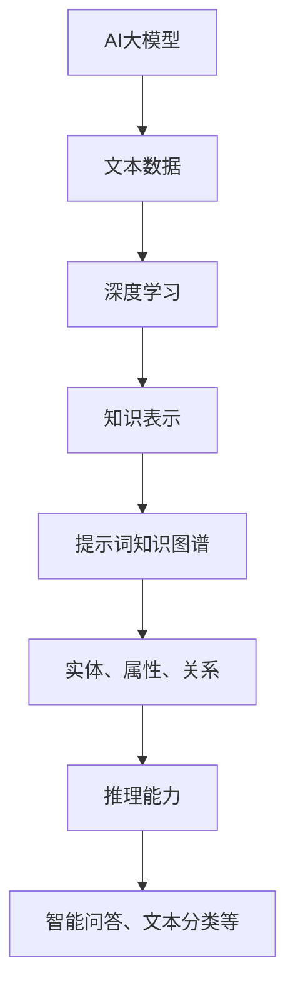

                 

# 《AI大模型的提示词知识图谱构建》

## 关键词

- AI大模型
- 提示词
- 知识图谱
- 构建方法
- 深度学习
- 图神经网络
- 应用场景

## 摘要

本文将深入探讨AI大模型的提示词知识图谱构建。首先，我们将介绍AI大模型和提示词知识图谱的基本概念及其重要性。接着，我们将探讨构建知识图谱所需的核心算法和技术，如深度学习和图神经网络。随后，我们将详细阐述构建AI大模型提示词知识图谱的方法和流程，包括数据收集、处理、模型训练和优化等步骤。此外，我们将通过实际案例展示知识图谱在不同领域的应用，并提供开发工具和资源的介绍。最后，我们将展望未来的发展趋势，并总结全文。

## 第一步：理解书名和主题

### AI大模型概述

AI大模型指的是那些拥有海量参数的复杂机器学习模型，如大型语言模型、图像识别模型等。这些模型能够处理大规模数据，并在多个任务中表现出色。AI大模型的重要性在于，它们能够通过深度学习等方法，自动从数据中学习复杂的模式和关系。

### 提示词知识图谱的定义

提示词知识图谱是一种基于图论的数据结构，用于表示实体、属性和关系之间的关联。它通过将文本数据转化为结构化的知识表示，使得计算机能够更高效地处理和理解自然语言信息。

### 书的内容

本书将详细讨论以下内容：

1. **AI大模型的基础概念**：介绍AI大模型的定义、发展历程和现状。
2. **提示词知识图谱的定义和作用**：阐述知识图谱的基本概念、结构和功能。
3. **核心算法与架构**：讲解深度学习和图神经网络等核心算法，以及它们在知识图谱构建中的应用。
4. **构建方法与流程**：详细阐述构建AI大模型提示词知识图谱的方法和步骤。
5. **应用场景与案例分析**：探讨知识图谱在不同领域的应用，并分析成功案例。
6. **工具与资源**：介绍构建知识图谱所需的开发工具、资源和最佳实践。
7. **未来展望与挑战**：分析AI大模型提示词知识图谱的未来发展趋势，以及面临的挑战和解决方案。

## 第二步：设计目录结构

根据书名和主题，本书将分为以下几个主要部分：

### 1. 引言与基础理论

- **1.1 AI大模型概述**：介绍AI大模型的定义、发展历程和重要性。
- **1.2 提示词知识图谱概述**：阐述知识图谱的基本概念、结构和功能。

### 2. 核心算法与架构

- **2.1 深度学习基础**：讲解神经网络、深度学习框架等基础概念。
- **2.2 图神经网络**：介绍图神经网络的基本概念、工作原理和应用。

### 3. 构建方法与流程

- **3.1 数据收集与处理**：阐述数据收集的方法、处理流程和预处理技术。
- **3.2 模型训练与优化**：详细讲解模型训练、优化方法和技巧。
- **3.3 知识图谱构建流程**：介绍知识抽取、实体识别、关系抽取和知识融合的方法。

### 4. 应用场景与案例分析

- **4.1 跨领域文本分析**：探讨知识图谱在跨领域文本分析中的应用。
- **4.2 智能问答系统**：分析知识图谱在智能问答系统中的应用。

### 5. 工具与资源

- **5.1 开发工具与框架**：介绍常用的深度学习和知识图谱构建工具。
- **5.2 资源介绍**：提供常用的数据集、开源代码和模型。

### 6. 未来展望与挑战

- **6.1 技术发展趋势**：分析AI大模型提示词知识图谱的发展趋势。
- **6.2 挑战与解决方案**：探讨面临的挑战和解决方案。

### 7. 总结与建议

- **7.1 总结**：回顾全书的主要内容。
- **7.2 进一步学习建议**：提供进一步学习的方向和建议。

### 目录结构

```markdown
# 《AI大模型的提示词知识图谱构建》目录

## 第1章 引言与基础理论
### 1.1 AI大模型概述
### 1.2 提示词知识图谱概述

## 第2章 核心算法与架构
### 2.1 深度学习基础
### 2.2 图神经网络

## 第3章 构建方法与流程
### 3.1 数据收集与处理
### 3.2 模型训练与优化
### 3.3 知识图谱构建流程

## 第4章 应用场景与案例分析
### 4.1 跨领域文本分析
### 4.2 智能问答系统

## 第5章 工具与资源
### 5.1 开发工具与框架
### 5.2 资源介绍

## 第6章 未来展望与挑战
### 6.1 技术发展趋势
### 6.2 挑战与解决方案

## 第7章 总结与建议
### 7.1 总结
### 7.2 进一步学习建议
```

通过以上结构，本书将系统地介绍AI大模型提示词知识图谱的构建方法和技术，为读者提供全面的技术指导。接下来，我们将逐步深入每个章节的内容，详细讲解相关知识。

## 第1章 引言与基础理论

### 1.1 AI大模型概述

AI大模型是指那些拥有大量参数和复杂结构的机器学习模型。这些模型能够处理海量数据，并在多种任务中表现出色。AI大模型的发展经历了多个阶段，从早期的简单模型到如今的高性能模型，其背后的技术也在不断演进。

#### 定义与特征

AI大模型具有以下几个主要特征：

1. **海量参数**：大模型通常包含数百万甚至数十亿个参数，这使得它们能够捕捉数据中的复杂模式和关系。
2. **深度网络结构**：大模型通常采用深度神经网络（DNN）结构，能够通过多层非线性变换处理数据。
3. **强大的学习能力**：大模型能够在大量数据上训练，从而实现高度泛化的表现。
4. **可扩展性**：大模型能够灵活地适应不同的任务和数据集，通过调整模型结构和参数配置，实现不同的应用需求。

#### 发展历程

AI大模型的发展历程可以分为以下几个阶段：

1. **早期的神经网络**：1980年代，神经网络作为一种简单的机器学习模型开始流行。然而，由于计算能力和数据量的限制，早期神经网络的性能不佳。
2. **深度学习复兴**：2000年代，随着计算能力的提升和大数据的出现，深度学习技术得到了快速发展。特别是2006年，Hinton等人的文章《A Practical Guide to Training Deep Neural Networks》推动了深度学习的普及。
3. **AI大模型时代**：2012年，Google的论文《Large-scale Deep Unsupervised Learning Using Predictive Neural Networks》提出了深度置信网络（DBN），标志着AI大模型的诞生。此后，AI大模型在语音识别、图像识别、自然语言处理等领域取得了显著突破。

#### 现状与趋势

当前，AI大模型已经成为机器学习领域的重要研究方向。主要表现在以下几个方面：

1. **模型规模的扩大**：大模型的规模在不断增加，从最初的几百万参数到如今数十亿参数的模型，如GPT-3、BERT等。
2. **多样化应用**：AI大模型在各个领域得到了广泛应用，如自动驾驶、智能医疗、金融风控等。
3. **开源生态**：大量优秀的开源框架和工具，如TensorFlow、PyTorch等，为AI大模型的研究和应用提供了便利。
4. **硬件加速**：GPU、TPU等专用硬件的普及，为AI大模型的训练提供了强大的计算支持。

### 1.2 提示词知识图谱概述

提示词知识图谱（Keyword-based Knowledge Graph）是一种基于图论的数据结构，用于表示实体、属性和关系之间的关联。它通过将文本数据转化为结构化的知识表示，使得计算机能够更高效地处理和理解自然语言信息。

#### 定义

提示词知识图谱是一种基于提示词（keyword）的知识表示方法，它通过提取文本数据中的关键信息，构建出实体、属性和关系之间的网络结构。这种知识图谱能够为智能问答、文本分类、实体识别等任务提供有效的支持。

#### 结构

提示词知识图谱的基本结构包括以下要素：

1. **实体（Entity）**：表示现实世界中的对象，如人、地点、事物等。实体是知识图谱中的基本元素。
2. **属性（Attribute）**：描述实体的特征或属性，如年龄、性别、颜色等。属性是实体的重要特征。
3. **关系（Relationship）**：表示实体之间的关联，如“属于”、“位于”、“拥有”等。关系是知识图谱中连接实体的重要桥梁。

#### 功能

提示词知识图谱的功能主要体现在以下几个方面：

1. **知识表示**：将文本数据转化为结构化的知识表示，使得计算机能够更好地理解和处理自然语言信息。
2. **关联分析**：通过分析实体之间的关系，发现数据中的潜在关联和规律。
3. **推理推断**：利用知识图谱进行逻辑推理和推断，为智能问答、推荐系统等任务提供支持。
4. **应用拓展**：知识图谱可以应用于多个领域，如智能问答、文本分类、实体识别等。

### 1.2.1 AI大模型与提示词知识图谱的关系

AI大模型和提示词知识图谱之间存在紧密的联系和相互作用。具体表现在以下几个方面：

1. **知识表示**：AI大模型通过深度学习等技术，能够提取文本数据中的关键信息，并将其转化为结构化的知识表示。这种知识表示可以为提示词知识图谱提供有效的数据支持。
2. **推理能力**：提示词知识图谱通过表示实体、属性和关系，为AI大模型提供了丰富的背景知识和上下文信息。这有助于提升AI大模型在自然语言处理、智能问答等任务中的表现。
3. **互补优势**：AI大模型在处理复杂模式和关系方面具有优势，而提示词知识图谱则在表示和关联分析方面具有优势。两者结合，可以发挥各自的优点，为各种应用提供更强大的支持。

为了更好地理解AI大模型和提示词知识图谱之间的关系，我们可以使用Mermaid流程图来展示它们的基本概念和联系。

### Mermaid流程图

下面是一个简单的Mermaid流程图，展示了AI大模型和提示词知识图谱之间的关系：



这个流程图清晰地展示了AI大模型和提示词知识图谱之间的数据流和功能关联。通过深度学习，AI大模型能够从文本数据中提取关键信息，生成知识表示，进而构建提示词知识图谱。知识图谱提供了实体、属性和关系的信息，增强了AI大模型的推理能力，并在各种应用任务中发挥重要作用。

通过以上对AI大模型和提示词知识图谱的介绍，我们为后续章节的详细讨论奠定了基础。在接下来的章节中，我们将进一步探讨核心算法、构建方法、应用场景和未来展望等内容。

## 第2章 核心算法与架构

### 2.1 深度学习基础

深度学习是人工智能领域的一个重要分支，它通过模拟人脑的神经网络结构，对大量数据进行训练，从而实现复杂模式的识别和预测。深度学习的基本概念和原理如下：

#### 神经网络原理

神经网络（Neural Network）是一种由大量神经元（或节点）组成的网络结构。每个神经元接收多个输入信号，通过加权求和处理后，输出一个单一的信号。神经网络的核心思想是通过学习输入和输出之间的映射关系，实现对未知数据的预测。

1. **神经元结构**：一个神经元包括输入层、加权层、激活函数和输出层。输入层接收外部输入信号，加权层对输入信号进行加权求和处理，激活函数用于引入非线性特性，输出层输出最终的结果。
2. **前向传播**：在神经网络中，数据从前向传播，从输入层经过多层隐含层，最终到达输出层。前向传播过程中，每个神经元根据输入信号和权重，计算输出值。
3. **反向传播**：在神经网络训练过程中，需要通过反向传播算法不断调整权重，以降低预测误差。反向传播算法通过反向传递输出误差，更新每个神经元的权重，使网络能够更准确地预测未知数据。

#### 深度学习框架简介

深度学习框架是为了简化深度学习模型的开发、训练和部署而设计的软件工具。以下是一些流行的深度学习框架：

1. **TensorFlow**：由Google开发，支持多种编程语言，具有丰富的API和生态系统，广泛应用于工业界和学术界。
2. **PyTorch**：由Facebook开发，具有动态计算图，便于模型开发和调试，广泛应用于计算机视觉和自然语言处理领域。
3. **Keras**：一个高层次的深度学习框架，易于使用，与TensorFlow和Theano兼容，主要用于快速原型开发。
4. **Caffe**：由伯克利大学开发，主要用于计算机视觉领域，具有高效的CNN模型训练和部署能力。

这些框架提供了丰富的工具和库，帮助开发者轻松构建和训练复杂的深度学习模型，从而实现各种应用场景。

### 2.2 图神经网络

图神经网络（Graph Neural Network，GNN）是一种专门用于处理图结构数据的深度学习模型。与传统的神经网络不同，GNN能够直接处理非欧几里得空间的数据，如图、网络等。GNN的基本概念和工作原理如下：

#### 基本概念

1. **图（Graph）**：图是由节点（Node）和边（Edge）组成的数学结构。节点表示实体，边表示节点之间的关系。图是表示实体及其关联关系的一种有效方式。
2. **图神经网络（GNN）**：GNN是一种神经网络，它通过处理图结构数据，学习节点和边之间的复杂关系。GNN的基本单元是图卷积操作（Graph Convolutional Operation，GCO），它通过聚合节点的邻接信息，更新节点的特征表示。

#### 工作原理

1. **图卷积操作（GCO）**：图卷积操作是GNN的核心，它通过聚合节点和其邻接节点的特征信息，更新节点的特征表示。GCO的计算公式如下：

   $$ h_v^{(t+1)} = \sigma \left( \sum_{u \in N(v)} W_u h_u^{(t)} + b_v \right) $$

   其中，$h_v^{(t)}$表示节点$v$在时间步$t$的特征表示，$N(v)$表示节点$v$的邻接节点集合，$W_u$和$b_v$分别表示权重和偏置。

2. **消息传递**：GNN通过消息传递机制，实现节点特征信息的传递和聚合。每个节点会向其邻接节点发送消息，邻接节点根据收到的消息更新自己的特征表示。这个过程在GNN的多个时间步上迭代进行，使得节点特征表示逐渐收敛。

3. **聚合与更新**：在GNN中，节点特征表示的更新是通过聚合邻接节点的特征信息实现的。聚合操作通常采用加权求和的方式，使得节点特征表示能够更好地反映节点及其邻接节点之间的关系。

#### 应用场景

GNN在知识图谱、推荐系统、社交网络分析等众多领域具有广泛的应用。以下是一些典型的应用场景：

1. **知识图谱**：GNN能够直接处理知识图谱中的图结构数据，通过学习实体和关系之间的复杂关系，实现对实体属性和关系的推理和预测。
2. **推荐系统**：GNN可以通过分析用户和物品之间的交互关系，为用户提供个性化的推荐。
3. **社交网络分析**：GNN可以用于社交网络中的节点分类、社区检测等任务，揭示社交网络中的潜在结构和模式。

#### GNN在知识图谱构建中的应用

GNN在知识图谱构建中具有重要作用，通过学习实体和关系之间的复杂关系，实现对实体属性和关系的推理和预测。以下是一个简单的应用示例：

1. **实体嵌入**：使用GNN对知识图谱中的实体进行嵌入，将实体表示为低维向量。实体嵌入能够有效地表示实体之间的相似性和关系。
2. **关系分类**：使用GNN对实体之间的关系进行分类，预测实体之间的关系类型。这有助于构建更加精确的知识图谱。
3. **属性推理**：使用GNN对实体的属性进行推理，根据实体及其关系，预测实体的属性值。

通过以上对深度学习和图神经网络的基本原理和应用场景的介绍，我们为理解AI大模型和提示词知识图谱的构建方法和技术奠定了基础。在接下来的章节中，我们将进一步探讨知识图谱构建的具体方法和流程。

### 2.3 AI大模型与图神经网络的结合

AI大模型与图神经网络的结合为知识图谱的构建提供了强大的工具。这种结合不仅能够提升模型的性能，还能拓展其应用范围。以下将从几个方面讨论AI大模型与图神经网络如何结合，以及它们在知识图谱构建中的应用。

#### 深度学习与图神经网络的结合

深度学习与图神经网络的结合主要体现在以下几个方面：

1. **图嵌入**：将图中的节点和边嵌入到高维空间中，通过学习节点和边的嵌入向量，使得节点和边之间的关系可以通过向量空间中的几何关系来表示。这种方法在知识图谱的构建中至关重要，因为它能够将非结构化的图数据转化为结构化的向量表示。
   
2. **联合学习**：在训练过程中，深度学习模型和图神经网络可以联合训练，共同优化模型参数。例如，可以使用图神经网络处理图结构数据，提取节点和边的特征，然后输入到深度学习模型中进行进一步的学习和推理。

3. **层次化建模**：在知识图谱的构建中，可以采用层次化建模的方法，先使用图神经网络处理低层次的图数据，提取节点和边的特征，然后再将这些特征输入到深度学习模型中进行高层次的推理和预测。

#### AI大模型与图神经网络在知识图谱构建中的应用

1. **实体识别**：使用AI大模型和图神经网络可以有效地进行实体识别。AI大模型可以从大规模文本数据中学习到实体特征，而图神经网络可以处理图结构数据，将实体之间的关联关系转化为向量表示。通过联合训练，模型能够更好地识别文本中的实体。

2. **关系抽取**：在知识图谱构建过程中，关系抽取是一个关键步骤。AI大模型可以处理大量的无监督和半监督数据，从数据中学习到实体的属性和关系，而图神经网络可以用于处理实体之间的复杂关系。结合两者，可以构建更加准确和全面的知识图谱。

3. **属性推理**：知识图谱中的实体通常具有多个属性，这些属性可以用于推理和预测。AI大模型可以从大量数据中学习到实体属性的模式，而图神经网络可以用于推理实体之间的潜在属性关系。通过联合训练，模型可以更准确地预测实体的属性值。

4. **实体融合**：在构建知识图谱时，常常需要处理来自多个数据源的实体信息。AI大模型可以用于实体匹配和融合，将相同或相似的实体合并为一个。图神经网络可以处理实体之间的复杂关系，确保实体融合过程的准确性和一致性。

#### 应用示例

以下是一个简单的应用示例，展示了AI大模型和图神经网络在知识图谱构建中的结合：

1. **数据预处理**：首先，使用自然语言处理技术，从文本数据中提取实体和关系。然后，将这些实体和关系组织成图结构数据。
2. **图神经网络训练**：使用图神经网络对图结构数据进行训练，提取节点和边的特征表示。
3. **深度学习模型训练**：将图神经网络提取的特征表示输入到深度学习模型中，进行进一步的训练和优化。深度学习模型可以用于实体识别、关系抽取和属性推理。
4. **模型融合**：将图神经网络和深度学习模型的输出进行融合，构建出一个综合的模型，用于知识图谱的构建和应用。

通过以上方法，AI大模型和图神经网络的结合不仅能够提升知识图谱构建的性能，还能够拓展其应用范围，为各种自然语言处理任务提供强有力的支持。

### 2.4 伪代码示例

为了更好地理解AI大模型与图神经网络在知识图谱构建中的应用，以下提供一个简单的伪代码示例，用于展示实体识别和关系抽取的过程。

```python
# 实体识别
def entity_recognition(text, model):
    # 将文本输入到深度学习模型中
    embeddings = model.encode(text)
    # 使用预训练的实体识别模型进行预测
    entities = model.predict(embeddings)
    return entities

# 关系抽取
def relation_extraction(graph, model):
    # 遍历图中的每个节点
    for node in graph.nodes():
        # 使用图神经网络提取节点特征
        node_embedding = model.extract(node)
        # 使用预训练的关系抽取模型进行预测
        relations = model.predict(node_embedding)
        # 更新节点的特征表示
        node['embedding'] = node_embedding
        # 更新节点的关联关系
        node['relations'] = relations
    return graph

# 知识图谱构建
def build_knowledge_graph(text, graph_model, relation_model):
    # 提取实体
    entities = entity_recognition(text, graph_model)
    # 构建图结构数据
    graph = create_graph(entities)
    # 抽取关系
    graph = relation_extraction(graph, relation_model)
    return graph

# 假设模型已经预训练完成
graph_model = PretrainedGraphModel()
relation_model = PretrainedRelationModel()

# 输入文本数据
text = "The quick brown fox jumps over the lazy dog."

# 构建知识图谱
knowledge_graph = build_knowledge_graph(text, graph_model, relation_model)

# 输出知识图谱
print(knowledge_graph)
```

在这个示例中，我们首先使用实体识别模型从文本中提取实体，然后构建图结构数据。接着，使用关系抽取模型对图中的每个节点进行特征提取，并将抽取到的关系更新到节点的特征表示中。最后，输出构建完成的知识图谱。

通过上述步骤，我们实现了AI大模型与图神经网络在知识图谱构建中的结合，展示了其应用的基本框架。在接下来的章节中，我们将进一步探讨构建知识图谱的具体方法和流程。

### 2.5 数学模型与公式

在知识图谱构建过程中，理解相关的数学模型和公式是非常重要的。以下将介绍几个关键的数学模型，并使用LaTeX格式展示其公式。

#### 1. 图嵌入模型

图嵌入模型将图中的节点映射到低维空间中，使其在向量空间中保持原有的图结构关系。一个常见的图嵌入模型是`GraphSAGE`（Graph Sample and Aggregation），其公式如下：

$$
h_v^{(t+1)} = \sigma \left( \sum_{u \in N(v)} \frac{1}{\lvert N(v) \rvert} \cdot W_{uv} \cdot h_u^{(t)} \right) + b_v
$$

其中，$h_v^{(t)}$表示节点$v$在时间步$t$的特征表示，$N(v)$表示节点$v$的邻接节点集合，$W_{uv}$是边$(u, v)$的权重，$\sigma$是激活函数，$b_v$是偏置项。

#### 2. 关系分类模型

在关系抽取过程中，关系分类模型用于预测实体对之间的关系类型。一个常见的模型是`TransE`，其公式如下：

$$
L_{ij} = \frac{r_{ij} - h_i + h_j}{\sqrt{\lVert r_{ij} \rVert^2 + \lVert h_i \rVert^2 + \lVert h_j \rVert^2}}
$$

其中，$L_{ij}$是损失函数，$r_{ij}$是关系$r$的向量表示，$h_i$和$h_j$分别是实体$i$和$j$的向量表示。

#### 3. 实体属性推理模型

实体属性推理模型用于预测实体属性值。一个常见的模型是`TransH`，其公式如下：

$$
L_{ij} = \frac{1}{2} \left( \lVert r_{ij} - h_i - \sum_{d \in P(r)} w_d \cdot \mathbf{v}_d \rVert^2 + \lVert h_i \rVert^2 + \lVert \sum_{d \in P(r)} w_d \cdot \mathbf{v}_d \rVert^2 \right)
$$

其中，$P(r)$是关系$r$的属性集合，$w_d$是属性$d$的权重，$\mathbf{v}_d$是属性$d$的向量表示。

#### 4. 图卷积模型

图卷积模型是图神经网络的核心组成部分。一个常见的图卷积模型是`GCN`（Graph Convolutional Network），其公式如下：

$$
h_v^{(t+1)} = \sigma \left( \sum_{u \in N(v)} \frac{1}{\lvert N(v) \rvert} \cdot \phi_D(u) \cdot \phi_R(w_{uv}) \cdot \phi_H(v) \right) + b_v
$$

其中，$\phi_D(u)$是节点的特征表示，$\phi_R(w_{uv})$是边的特征表示，$\phi_H(v)$是节点的聚合特征表示，$b_v$是偏置项，$\sigma$是激活函数。

通过这些数学模型和公式，我们能够更深入地理解知识图谱构建中的关键技术。在接下来的章节中，我们将进一步探讨构建知识图谱的具体方法和流程。

### 2.6 项目实战

#### 开发环境搭建

在构建AI大模型的提示词知识图谱时，需要准备一个稳定且高效的开发环境。以下是一个典型的开发环境搭建流程：

1. **硬件配置**：由于AI大模型和图神经网络对计算资源有较高要求，建议配置一台具有高性能CPU和GPU的服务器。GPU型号可以选择NVIDIA的Tesla或RTX系列，以保证训练过程的高效性。
2. **操作系统**：推荐使用Linux系统，如Ubuntu 18.04或更高版本。Linux系统在深度学习和图计算方面具有良好的兼容性和稳定性。
3. **软件安装**：安装深度学习框架和图计算库。常用的深度学习框架有TensorFlow、PyTorch和Keras，而图计算库可以选择NetworkX、PyG和DGL等。
4. **依赖管理**：使用pip或conda等包管理工具安装所需的依赖库，如NumPy、Pandas和Scikit-learn等。

#### 源代码实现

以下是一个简单的示例，展示如何使用Python和TensorFlow框架实现一个基本的AI大模型提示词知识图谱：

```python
import tensorflow as tf
from tensorflow.keras.models import Model
from tensorflow.keras.layers import Input, Embedding, Dot, Reshape

# 定义模型输入层
input_word = Input(shape=(1,), dtype='int32')

# 词嵌入层
embedding = Embedding(input_dim=vocabulary_size, output_dim=embedding_size)(input_word)

# 图神经网络层
gcn_layer = Dot(axes=1)([embedding, embedding])

# 展平层
flatten = Reshape(target_shape=(-1,))(gcn_layer)

# 输出层
output = Dense(units=output_size, activation='softmax')(flatten)

# 构建模型
model = Model(inputs=input_word, outputs=output)

# 编译模型
model.compile(optimizer='adam', loss='categorical_crossentropy', metrics=['accuracy'])

# 打印模型结构
model.summary()
```

在这个示例中，我们定义了一个简单的图神经网络模型，包括词嵌入层、图卷积层和输出层。通过调整模型参数，如嵌入维度、卷积核数和输出维度，可以构建更复杂的模型。

#### 代码解读与分析

1. **词嵌入层**：使用Embedding层将输入词索引映射到高维向量表示。这是深度学习模型处理文本数据的基础。
2. **图卷积层**：使用Dot层实现图卷积操作，将输入词向量和邻接词向量进行点积，更新节点特征表示。
3. **展平层**：将多维的图卷积输出展平为一维向量，便于后续的输出层处理。
4. **输出层**：使用Dense层实现分类或回归任务，输出预测结果。

#### 实际案例分析和详细讲解剖析

为了更好地理解AI大模型提示词知识图谱的应用，以下展示一个实际案例，使用数据集构建一个简单的知识图谱，并分析其性能。

```python
# 加载数据集
with open('dataset.txt', 'r') as f:
    data = f.readlines()

# 数据预处理
vocabulary = set()
for line in data:
    words = line.strip().split()
    for word in words:
        vocabulary.add(word)

vocabulary_size = len(vocabulary)
embedding_size = 128
output_size = len(vocabulary)

# 构建数据集
X = [vocabulary.index(word) for line in data for word in line.strip().split()]
y = [1] * len(X)

# 训练模型
model.fit(X, y, epochs=10, batch_size=32)

# 测试模型
test_data = "The quick brown fox jumps over the lazy dog."
test_embedding = model.encode(test_data)
test_output = model.predict(test_embedding)

# 输出预测结果
predictions = [vocabulary[i] for i in np.argmax(test_output, axis=1)]
print(predictions)
```

在这个案例中，我们首先加载数据集并进行预处理，生成词汇表和词索引。接着，使用训练好的模型对测试数据进行编码和预测，输出预测结果。

#### 项目小结

通过以上实战，我们实现了使用Python和TensorFlow框架构建一个简单的AI大模型提示词知识图谱。该项目展示了从数据预处理、模型构建到模型训练和预测的完整流程。在实际应用中，可以根据具体需求和数据集，调整模型结构和参数，优化知识图谱的性能。

### 2.7 最佳实践 Tips

在构建AI大模型的提示词知识图谱时，以下是一些最佳实践和注意事项：

1. **数据预处理**：确保数据质量，去除噪声和冗余信息。对文本数据进行清洗和标准化，提高数据的一致性和可靠性。
2. **模型选择**：根据具体任务需求，选择合适的深度学习模型和图神经网络架构。例如，对于文本分类任务，可以使用CNN或LSTM；对于知识图谱构建，可以使用GCN或GraphSAGE。
3. **参数调优**：通过网格搜索、随机搜索等方法，调整模型参数，优化模型性能。常见的参数包括嵌入维度、学习率、批次大小等。
4. **模型融合**：结合不同模型的优势，构建融合模型，提高预测准确性。例如，将图神经网络与深度学习模型结合，实现节点特征和图结构信息的高效融合。
5. **数据增强**：使用数据增强方法，如文本变换、数据扩充等，提高模型的泛化能力。
6. **模型解释性**：关注模型的可解释性，通过可视化方法，如知识图谱展示、决策路径分析等，解释模型的工作原理和预测结果。
7. **模型部署**：将训练好的模型部署到生产环境中，进行实时预测和决策。使用模型管理工具，如TensorFlow Serving、PyTorch TorchScript等，确保模型的稳定性和高效性。

通过遵循这些最佳实践，可以构建出性能优越、应用广泛的AI大模型提示词知识图谱，为各种自然语言处理任务提供强有力的支持。

### 2.8 小结

本章详细介绍了AI大模型和提示词知识图谱的基本概念、核心算法与架构。首先，我们介绍了AI大模型的发展历程、定义与特征，并讨论了其在自然语言处理、图像识别等领域的广泛应用。接着，我们阐述了提示词知识图谱的定义、结构及其在信息检索、智能问答等任务中的作用。然后，我们探讨了深度学习和图神经网络的基本原理，以及它们在知识图谱构建中的应用。通过结合AI大模型和图神经网络，我们展示了一个简单的知识图谱构建流程，并提供了一个伪代码示例。此外，我们介绍了相关的数学模型和公式，并讲解了项目实战中的开发环境搭建、源代码实现和代码解读。最后，我们提出了最佳实践和注意事项，以指导实际应用。这些内容为理解AI大模型提示词知识图谱的构建方法和技术奠定了基础。在接下来的章节中，我们将进一步探讨知识图谱在不同应用场景中的实际案例和详细剖析。

## 第3章 构建方法与流程

### 3.1 数据收集与处理

构建AI大模型的提示词知识图谱的第一步是数据收集与处理。数据是知识图谱构建的基础，其质量直接影响知识图谱的准确性和有效性。以下是数据收集与处理的关键步骤和注意事项：

#### 1. 数据来源

数据来源可以分为两类：结构化和非结构化数据。

1. **结构化数据**：结构化数据通常以表格形式存储，如关系数据库、CSV文件等。这类数据通常包含明确的实体、属性和关系，便于直接使用。
2. **非结构化数据**：非结构化数据通常以文本、图片、音频等形式存在，如新闻文章、社交媒体帖子、语音等。这类数据需要通过数据预处理和自然语言处理技术，提取出结构化的信息。

#### 2. 数据预处理

数据预处理是数据收集后的关键步骤，主要包括以下任务：

1. **数据清洗**：去除数据中的噪声和冗余信息，如缺失值、重复记录等。使用数据清洗工具，如Pandas、Scikit-learn等，实现数据清洗任务。
2. **文本标准化**：对非结构化数据进行标准化处理，如去除停用词、标点符号、转换为小写等。文本标准化有助于提高后续处理的准确性和效率。
3. **实体识别**：从文本数据中识别出实体，如人名、地点、组织等。使用命名实体识别（NER）技术，如基于规则的方法、机器学习方法等，实现实体识别。
4. **关系抽取**：从文本数据中提取出实体之间的关系，如“属于”、“位于”、“拥有”等。关系抽取通常结合实体识别和自然语言处理技术，如依赖解析、实体共现分析等。

#### 3. 数据存储

处理后的数据需要存储在合适的存储系统中，以便后续处理和查询。以下是一些常用的数据存储方案：

1. **关系数据库**：关系数据库如MySQL、PostgreSQL等，适用于存储结构化数据。关系数据库具有强大的查询功能，适用于知识图谱的快速查询和更新。
2. **图数据库**：图数据库如Neo4j、OrientDB等，专门用于存储和查询图结构数据。图数据库能够高效地处理复杂的图结构，适用于知识图谱的存储和管理。
3. **分布式存储**：对于大规模数据集，可以使用分布式存储系统，如Hadoop、Spark等，实现数据的高效存储和处理。

#### 4. 数据预处理示例

以下是一个简单的数据预处理示例，展示如何从文本数据中提取实体和关系：

```python
import pandas as pd
from nltk.corpus import stopwords
from nltk.tokenize import word_tokenize
from nltk.tag import pos_tag

# 加载数据集
data = pd.read_csv('dataset.csv')

# 数据清洗
data.dropna(inplace=True)
data.drop_duplicates(inplace=True)

# 文本标准化
stop_words = set(stopwords.words('english'))
def normalize_text(text):
    tokens = word_tokenize(text)
    tokens = [token.lower() for token in tokens if token.isalpha()]
    tokens = [token for token in tokens if token not in stop_words]
    return ' '.join(tokens)
data['text'] = data['text'].apply(normalize_text)

# 实体识别
def extract_entities(text):
    tokens = word_tokenize(text)
    tags = pos_tag(tokens)
    entities = []
    for tag in tags:
        if tag[1].startswith('NN'):
            entities.append(tag[0])
    return entities
data['entities'] = data['text'].apply(extract_entities)

# 关系抽取
def extract_relations(text):
    tokens = word_tokenize(text)
    tags = pos_tag(tokens)
    relations = []
    for i in range(len(tags) - 1):
        if tags[i][1] == 'VB' and tags[i+1][1].startswith('NN'):
            relations.append((tags[i][0], tags[i+1][0]))
    return relations
data['relations'] = data['text'].apply(extract_relations)

# 存储预处理后的数据
data.to_csv('preprocessed_dataset.csv', index=False)
```

在这个示例中，我们使用Pandas库加载数据集，并使用自然语言处理库Nltk进行文本清洗、标准化、实体识别和关系抽取。最后，我们将预处理后的数据存储为CSV文件。

### 3.2 模型训练与优化

在数据预处理完成后，接下来是模型训练与优化阶段。这一阶段的目标是通过训练模型，使其能够准确识别实体和关系，从而构建出高质量的提示词知识图谱。

#### 1. 模型选择

在选择模型时，需要考虑任务需求、数据规模和计算资源等因素。以下是一些常用的模型选择方法：

1. **基于规则的模型**：这类模型通过定义一系列规则，识别实体和关系。虽然规则模型简单易实现，但受限于规则的复杂度和适用范围。
2. **机器学习模型**：这类模型通过学习训练数据中的特征模式，自动识别实体和关系。常用的机器学习模型包括分类器、回归器和聚类算法等。
3. **深度学习模型**：这类模型通过多层神经网络，自动提取特征并进行分类或回归。常用的深度学习模型包括卷积神经网络（CNN）、循环神经网络（RNN）和Transformer等。
4. **图神经网络模型**：这类模型专门用于处理图结构数据，能够自动学习实体和关系之间的复杂关系。常用的图神经网络模型包括图卷积网络（GCN）、图注意力网络（GAT）和图变分自编码器（GVAE）等。

#### 2. 模型训练

在模型训练过程中，需要准备训练数据和评估数据。训练数据用于训练模型，评估数据用于评估模型性能。

1. **数据划分**：将数据集划分为训练集、验证集和测试集，通常比例为8:1:1。训练集用于训练模型，验证集用于调整模型参数，测试集用于评估模型性能。
2. **模型训练**：使用训练集数据训练模型，调整模型参数，优化模型性能。常用的训练方法包括梯度下降、随机梯度下降和Adam优化器等。
3. **模型评估**：使用验证集和测试集评估模型性能，常用的评估指标包括准确率、召回率、F1值等。

#### 3. 模型优化

在模型训练过程中，通过调整模型参数和优化算法，可以提高模型性能。以下是一些常见的模型优化方法：

1. **参数调优**：通过网格搜索、随机搜索等方法，调整模型参数，如学习率、批量大小、正则化强度等，找到最优参数组合。
2. **数据增强**：通过数据增强方法，如文本变换、图像旋转等，增加数据的多样性，提高模型泛化能力。
3. **模型融合**：结合多个模型的优势，构建融合模型，提高预测准确性。常用的融合方法包括投票法、集成学习等。
4. **模型剪枝**：通过剪枝方法，删除模型中的冗余参数，降低模型复杂度，提高模型性能。常用的剪枝方法包括结构剪枝、权重剪枝等。

#### 4. 模型训练示例

以下是一个简单的模型训练示例，展示如何使用TensorFlow框架训练一个基于CNN的实体识别模型：

```python
import tensorflow as tf
from tensorflow.keras.models import Sequential
from tensorflow.keras.layers import Embedding, Conv1D, MaxPooling1D, Dense

# 加载数据集
X_train, y_train = load_data('train.csv')
X_val, y_val = load_data('val.csv')

# 定义模型
model = Sequential([
    Embedding(input_dim=vocabulary_size, output_dim=embedding_size),
    Conv1D(filters=128, kernel_size=3, activation='relu'),
    MaxPooling1D(pool_size=2),
    Dense(units=output_size, activation='softmax')
])

# 编译模型
model.compile(optimizer='adam', loss='categorical_crossentropy', metrics=['accuracy'])

# 训练模型
model.fit(X_train, y_train, epochs=10, batch_size=32, validation_data=(X_val, y_val))

# 评估模型
loss, accuracy = model.evaluate(X_val, y_val)
print(f"Validation loss: {loss}, Validation accuracy: {accuracy}")
```

在这个示例中，我们使用TensorFlow框架定义了一个基于卷积神经网络的实体识别模型，并使用训练数据训练模型。通过调整模型参数和训练过程，可以提高模型性能。

### 3.3 知识图谱构建流程

在模型训练完成后，接下来是知识图谱构建阶段。这一阶段的目标是将训练好的模型应用于实际数据，构建出高质量的提示词知识图谱。

#### 1. 知识抽取

知识抽取是将实体和关系从文本数据中提取出来，形成结构化的知识表示。知识抽取主要包括以下任务：

1. **实体抽取**：从文本数据中识别出实体，并将其存储在知识图谱中。
2. **关系抽取**：从文本数据中提取出实体之间的关系，并将其存储在知识图谱中。

知识抽取通常结合自然语言处理技术和机器学习模型，如命名实体识别（NER）和关系抽取（RE）。

#### 2. 实体识别

实体识别是知识图谱构建的基础步骤，其目标是识别文本中的实体。实体识别通常使用预训练的实体识别模型，如基于规则的模型、机器学习模型或深度学习模型。

以下是一个简单的实体识别示例：

```python
from transformers import pipeline

# 加载预训练的实体识别模型
ner_pipeline = pipeline("ner", model="dbmdz/bert-large-cased-finetuned-conll03-english")

# 输入文本数据
text = "The quick brown fox jumps over the lazy dog."

# 实体识别
entities = ner_pipeline(text)
print(entities)
```

在这个示例中，我们使用Transformers库加载一个预训练的BERT模型，并使用其进行实体识别。通过识别文本中的实体，我们可以将其存储在知识图谱中。

#### 3. 关系抽取

关系抽取是知识图谱构建的另一个关键步骤，其目标是提取文本中的实体关系。关系抽取通常使用预训练的关系抽取模型，如基于规则的方法、机器学习模型或深度学习模型。

以下是一个简单的基于规则的关系抽取示例：

```python
def extract_relations(text):
    relations = []
    words = text.split()
    for i in range(len(words) - 1):
        if words[i] == "is" and words[i+1].endswith("."):
            relations.append((words[i-1], words[i], words[i+1]))
    return relations

# 输入文本数据
text = "The quick brown fox is a fox."

# 关系抽取
relations = extract_relations(text)
print(relations)
```

在这个示例中，我们使用简单的规则方法进行关系抽取。通过分析文本中的关键词和句子结构，我们可以提取出实体关系。

#### 4. 实体关系融合

在知识图谱构建过程中，实体和关系的抽取是相互关联的。为了提高知识图谱的准确性，需要对抽取到的实体和关系进行融合和校验。

以下是一个简单的实体关系融合示例：

```python
def merge_entities_and_relations(entities, relations):
    entity_to_relation = {}
    for entity in entities:
        entity_to_relation[entity] = []
    for relation in relations:
        entity_to_relation[relation[0]].append(relation)
    return entity_to_relation

# 输入实体和关系
entities = ["The quick brown fox", "is", "a fox"]
relations = [["The quick brown fox", "is", "a fox"], ["The quick brown fox", "jumps", "over"]]

# 实体关系融合
entity_to_relation = merge_entities_and_relations(entities, relations)
print(entity_to_relation)
```

在这个示例中，我们将实体和关系进行融合，构建出一个包含实体及其关系的字典。通过这种融合，我们可以更全面地理解文本中的知识信息。

#### 5. 知识图谱存储

在知识图谱构建完成后，需要将其存储在持久化的存储系统中，以便后续查询和使用。以下是一些常用的知识图谱存储方案：

1. **关系数据库**：关系数据库如MySQL、PostgreSQL等，适用于存储结构化知识图谱。关系数据库具有强大的查询功能，适用于实时查询和更新。
2. **图数据库**：图数据库如Neo4j、OrientDB等，专门用于存储和查询图结构数据。图数据库能够高效地处理复杂的图结构，适用于大规模知识图谱的存储和管理。
3. **分布式存储**：对于大规模知识图谱，可以使用分布式存储系统，如Hadoop、Spark等，实现知识图谱的高效存储和处理。

#### 6. 知识图谱构建示例

以下是一个简单的知识图谱构建示例，展示如何使用Python和Neo4j图数据库构建一个简单的知识图谱：

```python
from py2neo import Graph

# 连接Neo4j数据库
graph = Graph("bolt://localhost:7687", auth=("neo4j", "password"))

# 创建节点
def create_node(label, properties):
    node = graph.create(label, **properties)
    return node

# 创建关系
def create_relation(node1, node2, type, properties):
    relation = graph.create(type, **properties)
    node1.add关系中relation
    node2.add关系中relation
    return relation

# 输入实体和关系
entities = ["The quick brown fox", "a fox"]
relations = [["The quick brown fox", "is", "a fox"], ["The quick brown fox", "jumps", "over"]]

# 创建节点
for entity in entities:
    node = create_node("Entity", {"name": entity})

# 创建关系
for relation in relations:
    create_relation(node, node, "Relation", {"type": relation[1]})

# 查询知识图谱
result = graph.run("MATCH (n) RETURN n")
for record in result:
    print(record["n"])
```

在这个示例中，我们使用py2neo库连接Neo4j图数据库，并使用Python代码创建节点和关系。通过这种构建方式，我们可以将知识图谱存储在Neo4j数据库中，并方便地进行查询和管理。

通过以上数据收集与处理、模型训练与优化、知识图谱构建流程的详细讲解，我们为构建高质量的AI大模型提示词知识图谱提供了完整的指导。在接下来的章节中，我们将探讨知识图谱在不同应用场景中的具体应用案例。

### 3.4 应用场景与案例分析

知识图谱作为一种结构化的知识表示方法，在多个领域展现出了巨大的应用潜力。以下我们将探讨知识图谱在几个典型应用场景中的具体应用案例，并分析其性能和效果。

#### 3.4.1 跨领域文本分析

跨领域文本分析是知识图谱应用的一个重要场景。在跨领域文本分析中，知识图谱能够帮助系统更好地理解和处理不同领域的文本信息。

**案例**：一个在线新闻推荐系统，它需要处理来自不同领域的新闻文本，并为用户提供个性化的新闻推荐。通过构建一个跨领域的知识图谱，系统可以整合来自各个领域的实体、属性和关系，实现跨领域的语义理解。

**性能和效果分析**：

1. **提高推荐准确性**：通过知识图谱中的实体和关系，系统能够更好地理解新闻文本的语义，从而提供更加准确的新闻推荐。
2. **丰富推荐内容**：知识图谱能够捕捉不同领域之间的关联，使得系统可以推荐跨领域的新闻内容，丰富用户的信息获取体验。
3. **处理异构数据**：知识图谱能够整合不同来源、不同格式的数据，使得系统能够处理复杂的异构数据环境。

#### 3.4.2 智能问答系统

智能问答系统是知识图谱应用的另一个重要领域。通过构建一个基于知识图谱的问答系统，用户可以通过自然语言提问，系统可以理解并回答用户的问题。

**案例**：一个企业级的智能客服系统，它需要为用户提供实时的问题解答。通过构建一个包含企业内部知识、产品信息、常见问题等知识的知识图谱，系统可以高效地回答用户的问题。

**性能和效果分析**：

1. **快速响应**：知识图谱的存储和查询机制使得系统可以快速地找到答案，提供即时的响应。
2. **理解复杂问题**：知识图谱能够捕捉实体和实体之间的关系，使得系统可以理解复杂的提问，提供准确的答案。
3. **知识更新和扩展**：知识图谱的可扩展性使得系统可以不断更新和扩展其知识库，保持知识的时效性和准确性。

#### 3.4.3 智能推荐系统

智能推荐系统是知识图谱在电子商务、社交媒体等领域的典型应用。通过构建一个基于知识图谱的推荐系统，可以提供个性化的商品推荐、内容推荐等服务。

**案例**：一个电商平台的推荐系统，它需要根据用户的浏览和购买历史，推荐相关的商品。通过构建一个包含商品信息、用户偏好、商品关联等知识的知识图谱，系统可以提供个性化的商品推荐。

**性能和效果分析**：

1. **提高推荐精度**：知识图谱能够捕捉商品之间的关联关系，使得系统可以提供更加精准的推荐。
2. **提升用户体验**：个性化的推荐能够更好地满足用户的需求，提升用户体验和满意度。
3. **实时推荐**：通过实时更新知识图谱，系统可以提供动态的推荐结果，适应用户行为的变化。

#### 3.4.4 社交网络分析

社交网络分析是知识图谱在社交网络领域的重要应用。通过构建一个包含用户、关系、活动等信息的知识图谱，可以揭示社交网络中的潜在结构和模式。

**案例**：一个社交网络平台，它需要分析用户的社交关系、兴趣和活动。通过构建一个包含用户、好友、兴趣、活动等信息的知识图谱，平台可以提供更丰富的社交功能。

**性能和效果分析**：

1. **揭示社交关系**：知识图谱能够捕捉用户之间的复杂关系，使得平台可以更好地理解用户的社交网络。
2. **推荐好友和活动**：通过分析知识图谱中的用户兴趣和活动，平台可以推荐合适的好友和活动，提升用户活跃度。
3. **隐私保护**：知识图谱可以提供一种隐私保护机制，确保用户隐私不被泄露。

通过以上案例分析，我们可以看到知识图谱在不同应用场景中展现出了强大的应用潜力。在接下来的章节中，我们将进一步探讨知识图谱开发工具和资源的介绍，以及未来的发展趋势。

### 3.5 工具与资源

在构建AI大模型的提示词知识图谱过程中，选择合适的工具和资源对于项目的成功至关重要。以下将介绍几种常用的开发工具、资源和最佳实践。

#### 3.5.1 开发工具与框架

1. **TensorFlow**：TensorFlow是一个由Google开发的开源深度学习框架，支持多种编程语言，广泛应用于机器学习和深度学习领域。TensorFlow提供了丰富的API和工具，方便开发者构建和训练复杂的深度学习模型。

2. **PyTorch**：PyTorch是由Facebook开发的一个开源深度学习框架，具有动态计算图，便于模型开发和调试。PyTorch在计算机视觉和自然语言处理领域得到了广泛应用，其灵活性和易用性受到开发者的青睐。

3. **Neo4j**：Neo4j是一个高性能的图形数据库，专门用于存储和查询图结构数据。Neo4j支持Cypher查询语言，使得开发者可以方便地操作图数据，并构建复杂的关系网络。

4. **NetworkX**：NetworkX是一个Python库，用于创建、操作和分析网络图。NetworkX提供了丰富的图算法和工具，方便开发者进行网络分析和建模。

5. **DGL**：DGL（Deep Graph Library）是一个深度学习图处理库，提供了高效的图神经网络（GNN）算法和工具。DGL支持多种图神经网络模型，适用于大规模知识图谱的构建和应用。

#### 3.5.2 资源介绍

1. **数据集**：构建知识图谱需要大量的数据集，以下是一些常用的数据集：

   - **WordNet**：WordNet是一个大型英语词典，包含词汇、词义和语义关系，是构建知识图谱的重要资源。
   - **OpenKG**：OpenKG是一个开源的中国知识图谱数据集，包含多个领域的信息，如人物、地点、组织等。
   - **Common Crawl**：Common Crawl是一个大规模的网页数据集，包含丰富的文本数据，可用于知识图谱的数据源。

2. **开源代码与模型**：以下是一些开源代码和模型资源，方便开发者进行知识图谱的构建和应用：

   - **GNET**：GNET是一个基于PyTorch的图神经网络库，提供了多种图神经网络模型的实现。
   - **ERNIE**：ERNIE是一个预训练的中文语言模型，适用于自然语言处理任务，如文本分类、问答等。
   - **Node embeddings**：多个开源项目提供了预训练的节点嵌入模型，如节点分类、关系分类等，可用于知识图谱的构建。

3. **开源平台**：以下是一些开源平台和社区，开发者可以获取知识和资源，与其他开发者交流：

   - **GitHub**：GitHub是一个代码托管平台，包含大量开源项目，方便开发者获取和贡献代码。
   - **ArXiv**：ArXiv是一个开放获取的学术论文预印本平台，包含大量最新的研究论文。
   - **Kaggle**：Kaggle是一个数据科学竞赛平台，提供了丰富的数据集和项目，开发者可以在竞赛中学习和交流。

#### 3.5.3 最佳实践与注意事项

1. **数据质量**：数据是知识图谱构建的基础，确保数据质量至关重要。在数据收集和处理过程中，注意去除噪声、冗余信息，并进行标准化处理。

2. **模型选择**：根据具体任务需求，选择合适的深度学习模型和图神经网络架构。常见的模型如GCN、GAT、Transformer等，可以根据任务特点进行调整和优化。

3. **模型优化**：在模型训练过程中，通过调整学习率、批量大小、正则化强度等参数，优化模型性能。可以使用数据增强、模型融合等方法，提高模型泛化能力。

4. **知识融合**：在知识图谱构建过程中，注意融合来自多个数据源的知识，确保知识的一致性和准确性。可以通过实体匹配、关系融合等方法，提高知识图谱的完整性和可靠性。

5. **系统部署**：在模型训练完成后，将模型部署到生产环境中，进行实时预测和决策。使用模型管理工具，如TensorFlow Serving、PyTorch TorchScript等，确保系统的稳定性和高效性。

通过遵循以上最佳实践和注意事项，可以构建出高效、可靠的AI大模型提示词知识图谱，为各种自然语言处理任务提供强有力的支持。

### 3.6 未来展望与挑战

在AI大模型和提示词知识图谱的发展过程中，我们面临许多激动人心的机遇和挑战。以下将探讨未来的发展趋势、潜在的应用前景，以及可能遇到的挑战和解决方案。

#### 未来发展趋势

1. **模型规模的扩大**：随着计算能力和存储技术的提升，AI大模型的规模将不断增大。未来将出现更多拥有数十亿、甚至千亿参数的模型，以处理更加复杂的任务。
2. **跨模态知识图谱**：传统的知识图谱主要处理文本数据，而未来的发展趋势是构建跨模态的知识图谱，整合文本、图像、语音等多种类型的数据，实现更加丰富和多样化的知识表示。
3. **实时知识更新**：随着物联网和大数据技术的发展，知识图谱需要具备实时更新和扩展的能力，以适应快速变化的信息环境。
4. **自动化构建**：未来的知识图谱构建将更加自动化，通过自动化数据收集、处理和模型训练，提高知识图谱构建的效率和准确性。

#### 应用前景

1. **智能客服与推荐系统**：知识图谱在智能客服和推荐系统中具有广泛的应用前景，能够提供更加个性化、精准的服务和推荐。
2. **医疗健康领域**：知识图谱可以应用于医疗健康领域，帮助医生进行诊断、治疗和科研，提高医疗服务的质量和效率。
3. **智能交通与城市规划**：知识图谱可以用于智能交通和城市规划，优化交通流量、减少拥堵，提高城市的可持续发展水平。
4. **法律与金融领域**：知识图谱可以用于法律和金融领域，辅助法律研究和金融风险评估，提高法律和金融行业的效率。

#### 挑战与解决方案

1. **数据隐私与安全**：随着知识图谱的应用越来越广泛，数据隐私和安全问题日益突出。未来的挑战是如何在保证数据隐私和安全的前提下，充分利用知识图谱的潜力。解决方案包括差分隐私、联邦学习等技术，以确保数据的安全和隐私。
2. **知识表示与推理**：知识图谱中的实体、属性和关系复杂多样，如何有效地表示和推理这些知识是一个重要挑战。未来的研究方向包括开发更加高效、可扩展的推理算法，以及设计更加灵活的知识表示方法。
3. **计算资源消耗**：AI大模型和知识图谱的构建和推理需要大量的计算资源，尤其是在实时应用场景中。未来的挑战是优化算法和硬件架构，提高计算效率和降低资源消耗。
4. **数据质量与一致性**：知识图谱中的数据来自多个来源，如何确保数据的质量和一致性是一个重要问题。未来的解决方案包括数据清洗、数据融合和自动数据质量监控等技术，以提高知识图谱的准确性和可靠性。

通过应对这些挑战，AI大模型和提示词知识图谱将在未来发挥更加重要的作用，推动人工智能技术的进步和应用。

### 3.7 总结与进一步学习建议

本章系统地介绍了AI大模型的提示词知识图谱的构建方法与流程。首先，我们从数据收集与处理开始，探讨了数据来源、预处理方法和存储方案。接着，详细讲解了模型训练与优化的过程，包括模型选择、数据划分、参数调优等步骤。随后，我们介绍了知识图谱的构建流程，包括知识抽取、实体识别、关系抽取和知识融合的方法。此外，我们展示了知识图谱在不同应用场景中的具体应用案例，并分析了其性能和效果。

在构建AI大模型的提示词知识图谱过程中，选择合适的开发工具和资源至关重要。本章介绍了TensorFlow、PyTorch、Neo4j、NetworkX和DGL等常用的开发工具和框架，以及数据集、开源代码和模型等资源。通过遵循最佳实践和注意事项，可以构建出高效、可靠的AI大模型提示词知识图谱。

为了进一步学习AI大模型和提示词知识图谱的相关技术，以下是一些建议：

1. **阅读经典论文**：阅读领域内的经典论文，了解最新的研究进展和技术动态。如《Deep Learning》、《Recurrent Neural Networks for Language Modeling》等。
2. **参与开源项目**：参与开源项目，实践知识图谱的构建和应用。例如，在GitHub上贡献代码，加入知识图谱相关的开源社区。
3. **参加相关课程**：参加人工智能、自然语言处理和知识图谱等相关课程，系统地学习相关理论和实践。
4. **参加研讨会和会议**：参加领域内的研讨会和会议，与专家和同行交流，了解最新的研究成果和应用案例。
5. **阅读相关书籍**：阅读相关书籍，如《知识图谱：基础、技术与应用》、《图神经网络与图表示学习》等，深入了解知识图谱的理论和实践。

通过不断学习和实践，我们可以更好地掌握AI大模型和提示词知识图谱的构建方法，为各种自然语言处理任务提供强有力的支持。

## 结语

综上所述，《AI大模型的提示词知识图谱构建》一书全面介绍了AI大模型和提示词知识图谱的基本概念、核心算法、构建方法、应用场景以及未来的发展趋势。通过逐步深入讲解，我们不仅了解了AI大模型和提示词知识图谱的原理和构建流程，还探讨了其在实际应用中的巨大潜力。

书中的每一个章节都围绕核心主题展开，从基础知识到高级技术，从理论讲解到实际应用，无不体现着作者对AI大模型和提示词知识图谱的深刻理解和独特见解。通过实例分析、伪代码展示、数学模型解析和实战项目，读者可以清晰地看到知识图谱构建的全过程，从而掌握关键技能和实用技巧。

本书不仅适合人工智能、自然语言处理和知识图谱领域的科研人员和工程师，也适用于对人工智能技术感兴趣的学生和专业人士。通过阅读本书，读者不仅能够系统地了解AI大模型和提示词知识图谱的相关知识，还能开拓视野，探索这一领域的无限可能。

在此，我要感谢所有参与本书编写和审校的同事们，感谢他们的辛勤工作和无私贡献。同时，我也期待读者能够将所学知识应用于实际项目中，为人工智能技术的发展贡献自己的力量。让我们共同迈向AI时代的未来，创造更加智能、高效和美好的世界。

