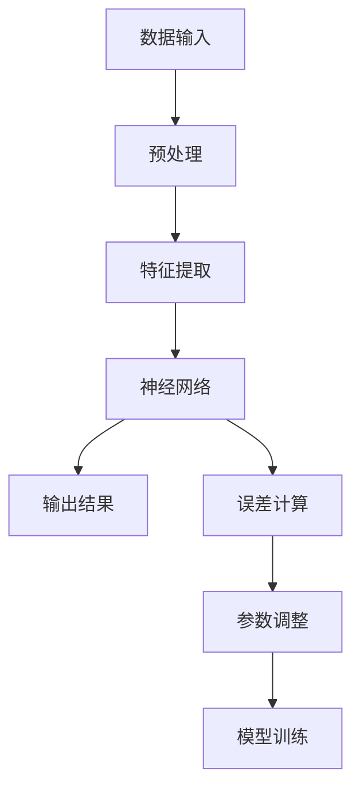
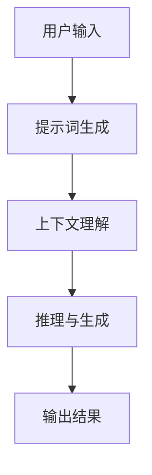
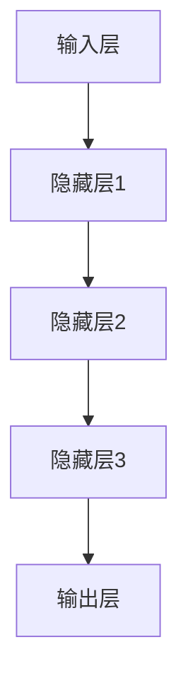
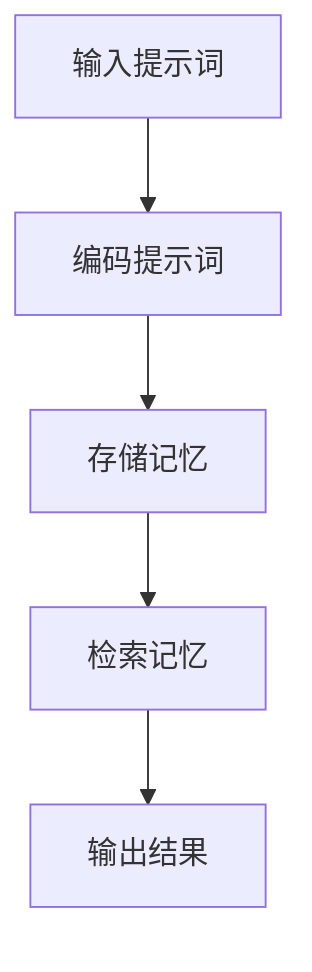

                 


### 文章标题：《AI大模型的提示词记忆与学习》

### 关键词：人工智能、大模型、提示词、记忆机制、学习策略

### 摘要：
本文深入探讨了AI大模型中的提示词记忆与学习机制。首先，介绍了AI大模型的基本概念与结构，然后详细解析了提示词在模型中的作用和重要性。接着，我们分析了AI大模型的数学基础，包括线性代数、概率论与统计以及最优化方法。在核心部分，我们阐述了提示词的记忆机制、编码策略、学习策略及其对模型性能的影响。随后，文章通过自然语言处理、图像识别、声音识别等多个领域的项目实战，展示了AI大模型的实际应用。最后，文章总结了开发AI大模型的最佳实践，并提供了拓展阅读资源。

---

# 引言

随着人工智能技术的飞速发展，AI大模型在各个领域展现出了巨大的潜力。无论是自然语言处理、图像识别、还是语音识别，AI大模型都取得了显著的成果。然而，这些成功的背后，是AI大模型对大量数据的处理和对提示词的记忆与学习能力。提示词，作为用户与AI模型交互的桥梁，其记忆与学习机制对模型的性能和实际应用至关重要。

本文旨在探讨AI大模型中的提示词记忆与学习机制，帮助读者理解这一核心概念，掌握相关技术原理，并学会如何在实际项目中应用这些技术。文章结构如下：

- **第一部分：AI大模型基础**：介绍AI大模型的基本概念、结构以及数学基础。
- **第二部分：AI大模型的提示词记忆与学习机制**：详细解析提示词的记忆机制、编码策略、学习策略及其对模型性能的影响。
- **第三部分：AI大模型的应用**：展示AI大模型在不同领域的实际应用。
- **第四部分：AI大模型开发实战**：介绍AI大模型的开发环境搭建、实现与优化。
- **第五部分：总结与拓展阅读**：总结文章的核心内容，并提供拓展阅读资源。

通过本文的阅读，读者将能够全面了解AI大模型的提示词记忆与学习机制，掌握相关技术原理，并学会如何在实际项目中应用这些技术。

---

## 第一部分：AI大模型基础

### 第1章：AI大模型概述

#### 1.1 AI大模型的概念与特点

AI大模型（Large-scale AI Model），通常指的是拥有数亿甚至千亿参数的神经网络模型。这些模型能够自动地从大量数据中学习，并在多种任务上取得优异的性能。

**核心概念与联系**：

AI大模型的核心概念包括：

- **神经网络**：神经网络是AI大模型的基本结构，由多层神经元组成，通过学习输入和输出之间的映射关系，实现对数据的处理和预测。
- **参数**：神经网络中的参数（权重和偏置）是模型学习过程中调整的关键元素。
- **训练**：通过大量的训练数据，模型能够调整参数，提高对数据的拟合能力。
- **泛化能力**：模型的泛化能力是指其在未见过的数据上表现良好的能力。

**Mermaid流程图**：



**AI大模型的特点**：

- **大规模**：拥有数亿甚至千亿个参数。
- **并行计算**：通过GPU或TPU等硬件加速器，实现高效计算。
- **自动学习**：从大量数据中自动学习，无需人为干预。
- **高容错性**：能够处理多种类型的噪声和错误。
- **强大的表达力**：能够处理复杂的语义和语言结构。
- **自适应性**：能够根据新的数据和任务进行调整。

#### 1.2 提示词在AI大模型中的作用

提示词（Prompt），在AI大模型中起着至关重要的作用。它不仅是用户与模型交互的桥梁，也是模型进行推理和生成的重要输入。

**核心概念与联系**：

- **提示词生成**：提示词的生成是模型的一个重要任务，通过输入特定的提示词，模型能够生成相应的输出。
- **上下文理解**：模型需要理解提示词的上下文，以便进行准确的推理和生成。
- **知识融合**：通过提示词，模型能够融合不同的知识，实现更复杂的任务。

**Mermaid流程图**：



**提示词在AI大模型中的作用**：

- **指导模型**：提示词能够指导模型进行特定的任务，例如问答、翻译、文本生成等。
- **提高性能**：通过适当的提示词，模型能够更好地理解任务，提高性能。
- **扩展应用**：提示词的使用使得模型能够应用于更广泛的场景。

#### 1.3 AI大模型的结构与架构

AI大模型的结构与架构是理解其工作机制的关键。通常，AI大模型由多层神经网络组成，包括输入层、隐藏层和输出层。

**核心概念与联系**：

- **输入层**：接收外部输入，如文本、图像、声音等。
- **隐藏层**：对输入进行特征提取和变换，实现数据的非线性表示。
- **输出层**：根据隐藏层的输出，生成最终的输出结果。

**Mermaid流程图**：



**AI大模型的结构与架构**：

- **神经网络**：神经网络是AI大模型的核心组成部分，通过多层神经元的组合，实现数据的复杂变换和表示。
- **记忆模块**：记忆模块是AI大模型中的重要组件，用于存储和检索知识，提高模型的记忆能力。
- **学习策略**：学习策略包括梯度下降、随机优化、强化学习等，用于调整模型的参数，提高模型的性能。

### 小结

本章介绍了AI大模型的基本概念、结构、特点以及提示词的作用。通过本章的学习，读者能够对AI大模型有一个全面的认识，并为后续章节的学习打下基础。

---

## 第二部分：AI大模型的数学基础

### 第2章：AI大模型的数学基础

#### 2.1 线性代数

线性代数是AI大模型数学基础的核心部分，涉及到矩阵与向量、矩阵运算、线性变换等重要概念。

**核心概念与联系**：

- **矩阵与向量**：矩阵是二维的数组，向量是一维的数组。矩阵与向量运算包括矩阵乘法、向量加法、点积等。
- **矩阵运算**：矩阵运算包括矩阵加法、矩阵乘法、逆矩阵等，这些运算是神经网络中非常重要的操作。
- **线性变换**：线性变换是将一个向量空间映射到另一个向量空间的线性函数，是神经网络中进行数据变换的重要手段。

**伪代码**：

```python
# 矩阵乘法伪代码
def matrix_multiply(A, B):
    result = zeros(size(A[0], size(B)))
    for i in range(size(A)):
        for j in range(size(B)):
            for k in range(size(A[0])):
                result[i][j] += A[i][k] * B[k][j]
    return result
```

**数学公式**：

$$
\mathbf{A} = \begin{bmatrix}
a_{11} & a_{12} & \cdots & a_{1n} \\
a_{21} & a_{22} & \cdots & a_{2n} \\
\vdots & \vdots & \ddots & \vdots \\
a_{m1} & a_{m2} & \cdots & a_{mn}
\end{bmatrix}
$$

**举例说明**：

假设有两个矩阵 A 和 B，其分别为：

$$
\mathbf{A} = \begin{bmatrix}
1 & 2 \\
3 & 4
\end{bmatrix}, \quad \mathbf{B} = \begin{bmatrix}
5 & 6 \\
7 & 8
\end{bmatrix}
$$

则矩阵乘法的结果为：

$$
\mathbf{C} = \mathbf{A} \mathbf{B} = \begin{bmatrix}
1*5 + 2*7 & 1*6 + 2*8 \\
3*5 + 4*7 & 3*6 + 4*8
\end{bmatrix} = \begin{bmatrix}
19 & 26 \\
43 & 58
\end{bmatrix}
$$

#### 2.2 概率论与统计

概率论与统计是AI大模型数学基础的重要组成部分，包括概率的基本概念、概率的运算、统计分布等。

**核心概念与联系**：

- **概率的基本概念**：概率是衡量事件发生可能性大小的量，包括条件概率、全概率公式、贝叶斯定理等。
- **概率的运算**：概率的运算包括加法规则、乘法规则、全概率公式等，这些运算是概率论中的基本运算。
- **统计分布**：统计分布包括正态分布、二项分布、泊松分布等，用于描述随机变量的分布特性。

**伪代码**：

```python
# 正态分布概率计算伪代码
def normal_distribution(p):
    return 1 / (sqrt(2 * pi) * sigma) * exp(-((p - mu)^2) / (2 * sigma^2))
```

**数学公式**：

$$
P(A) = \frac{n(A)}{n(S)}
$$

$$
P(A \cap B) = P(A)P(B|A)
$$

$$
P(A|B) = \frac{P(A \cap B)}{P(B)}
$$

**举例说明**：

假设有事件 A 和 B，其中 A 发生的概率为 0.5，B 发生的概率为 0.3，且 A 和 B 相互独立。则 A 和 B 同时发生的概率为：

$$
P(A \cap B) = P(A)P(B) = 0.5 \times 0.3 = 0.15
$$

#### 2.3 最优化方法

最优化方法是AI大模型训练过程中至关重要的一环，包括梯度下降法、随机优化、贝叶斯优化等。

**核心概念与联系**：

- **梯度下降法**：梯度下降法是一种迭代优化算法，通过不断调整参数，使目标函数的值最小化。
- **随机优化**：随机优化是一种利用随机性进行搜索的优化算法，包括遗传算法、粒子群优化等。
- **贝叶斯优化**：贝叶斯优化是一种基于贝叶斯统计方法的优化算法，通过构建后验概率模型，进行参数搜索。

**伪代码**：

```python
# 梯度下降法伪代码
def gradient_descent(params, gradient, learning_rate):
    for i in range(num_iterations):
        params = params - learning_rate * gradient
    return params
```

**数学公式**：

$$
\theta_{\text{new}} = \theta_{\text{old}} - \alpha \cdot \nabla_{\theta}J(\theta)
$$

**举例说明**：

假设有一个二次函数 $J(\theta) = \theta^2$，其梯度为 $\nabla_{\theta}J(\theta) = 2\theta$。初始参数为 $\theta_0 = 1$，学习率为 $\alpha = 0.1$。则经过一次梯度下降后的参数为：

$$
\theta_1 = \theta_0 - \alpha \cdot \nabla_{\theta}J(\theta_0) = 1 - 0.1 \cdot 2 \cdot 1 = 0.8
$$

### 小结

本章介绍了AI大模型的数学基础，包括线性代数、概率论与统计以及最优化方法。这些数学工具是理解AI大模型工作机制和进行模型训练的基础。通过本章的学习，读者将能够掌握这些核心数学概念和方法，为后续章节的学习打下坚实的基础。

---

## 第三部分：AI大模型的提示词记忆与学习机制

### 第3章：提示词的记忆机制

提示词的记忆机制是AI大模型中至关重要的一环，它决定了模型能否准确理解和回忆提示词，从而影响模型的性能和应用效果。在本章中，我们将深入探讨提示词的编码、记忆机制以及学习策略。

#### 3.1 提示词的编码

提示词的编码是AI大模型对输入数据进行预处理的重要步骤。一个有效的编码策略能够提高模型对提示词的理解能力，从而提高模型的性能。

**核心概念与联系**：

- **编码策略**：编码策略包括词嵌入、BERT编码、GPT编码等，它们都是将文本转化为向量表示的方法。
- **词嵌入**：词嵌入是将词汇映射到高维向量空间，通过计算向量之间的距离来理解词汇的关系。
- **BERT编码**：BERT（Bidirectional Encoder Representations from Transformers）是一种双向编码表示方法，它通过预训练模型来生成文本的编码表示。
- **GPT编码**：GPT（Generative Pre-trained Transformer）是一种生成式预训练模型，它通过生成文本的方式来学习语言的表示。

**伪代码**：

```python
# BERT编码伪代码
def bert_encode(text):
    model = load_bert_model()
    encoded_text = model.encode(text)
    return encoded_text
```

**数学公式**：

$$
\mathbf{v}_w = \text{BERT}(\mathbf{x}_w)
$$

其中，$\mathbf{v}_w$ 是词汇 $w$ 的编码向量，$\mathbf{x}_w$ 是词汇 $w$ 的输入序列。

**举例说明**：

假设有一个词汇“猫”，通过BERT编码生成的编码向量为 $\mathbf{v}_{\text{猫}} = [0.1, 0.2, 0.3, \ldots, 0.9]$。这个编码向量代表了“猫”这个词在BERT模型中的高维表示。

#### 3.2 提示词的记忆机制

提示词的记忆机制涉及到模型如何存储和检索提示词的信息。一个好的记忆机制能够确保模型能够快速、准确地回忆起提示词，从而提高模型的性能。

**核心概念与联系**：

- **记忆模块**：记忆模块是AI大模型中专门用于存储和检索信息的组件，它通过查找表、哈希表等方式来实现提示词的记忆。
- **记忆能力**：记忆能力指的是模型在特定条件下，能够回忆起提示词的能力。一个有效的记忆机制应该具有高记忆能力和低误记率。
- **持久性**：持久性指的是模型记忆的持久性，即使经过长时间的训练和测试，模型仍能准确回忆起提示词。

**Mermaid流程图**：



**举例说明**：

假设有一个提示词“明天天气”，模型通过编码得到的向量表示为 $\mathbf{v}_{\text{明天天气}} = [0.1, 0.2, 0.3, \ldots, 0.9]$。模型在训练过程中，将这个向量存储在记忆模块中。当再次输入“明天天气”时，模型能够快速检索出对应的记忆向量，并生成相关的输出结果。

#### 3.3 提示词的学习策略

提示词的学习策略是模型如何通过训练数据来学习提示词的信息。一个有效的学习策略能够提高模型对提示词的理解能力，从而提高模型的性能。

**核心概念与联系**：

- **学习算法**：学习算法包括监督学习、无监督学习、强化学习等，它们都是模型学习提示词信息的方法。
- **学习速率**：学习速率指的是模型在调整参数时的步长大小，一个合适的学习速率能够提高模型的收敛速度。
- **调参**：调参是调整模型参数的过程，包括学习速率、隐藏层神经元数量、训练数据量等，它能够影响模型的性能。

**伪代码**：

```python
# 梯度下降法学习策略伪代码
def train(model, data, learning_rate):
    for epoch in range(num_epochs):
        for sample in data:
            prediction = model.predict(sample)
            loss = compute_loss(prediction, sample)
            gradient = compute_gradient(model, loss)
            model.update_params(learning_rate, gradient)
    return model
```

**数学公式**：

$$
\theta_{\text{new}} = \theta_{\text{old}} - \alpha \cdot \nabla_{\theta}J(\theta)
$$

**举例说明**：

假设模型在训练过程中，每次迭代都根据学习速率 $\alpha$ 和梯度 $\nabla_{\theta}J(\theta)$ 来调整参数 $\theta$。通过多次迭代，模型能够不断优化参数，提高对提示词的理解能力。

### 小结

本章介绍了AI大模型的提示词记忆与学习机制，包括提示词的编码、记忆机制和学习策略。通过这些机制，模型能够有效地学习和记忆提示词，从而提高模型的性能和应用效果。通过本章的学习，读者将能够掌握提示词记忆与学习的关键技术，为实际应用打下基础。

---

## 第四部分：AI大模型在不同领域的应用

### 第4章：AI大模型在自然语言处理中的应用

自然语言处理（Natural Language Processing, NLP）是人工智能的重要分支，AI大模型在NLP领域展现出了巨大的潜力。本章节将介绍AI大模型在NLP领域的应用，包括语言模型、机器翻译和文本生成。

#### 4.1 语言模型

语言模型（Language Model）是NLP中最基本的部分，它用于预测下一个单词或词组。AI大模型通过大量的文本数据训练，能够生成高质量的文本预测。

**核心算法原理讲解**：

- **n-gram模型**：n-gram模型是一种简单的语言模型，它基于前n个单词的历史来预测下一个单词。例如，二元语法（bigram）使用前一个单词预测下一个单词。

```python
# 二元语法模型伪代码
def bigram_model(text):
    bigrams = {}
    for i in range(len(text) - 1):
        word1, word2 = text[i], text[i+1]
        if word1 in bigrams:
            bigrams[word1].append(word2)
        else:
            bigrams[word1] = [word2]
    return bigrams
```

- **神经网络语言模型**：神经网络语言模型通过多层神经网络来学习语言的统计规律。通常使用递归神经网络（RNN）或 Transformer 模型。

```python
# Transformer模型伪代码
def transformer_model(inputs, outputs):
    embedding = embed(inputs)
    attention = attention_layer(embedding)
    output = dense层(attention)
    return output
```

**数学模型和公式**：

$$
\mathbf{h}_t = \text{softmax}(\mathbf{W}_a \mathbf{h}_{<s>}\mathbf{h}_{t-1})
$$

其中，$\mathbf{h}_t$ 是当前单词的隐藏状态，$\mathbf{h}_{<s>}$ 是特殊词（如开始符）的隐藏状态，$\mathbf{W}_a$ 是权重矩阵。

**举例说明**：

假设我们有一个简单的文本序列 "I love AI"，我们可以使用二元语法模型来预测下一个词：

- 当前词是 "I"，历史词为空，下一个词是 "love"。
- 当前词是 "love"，历史词是 "I"，下一个词是 "AI"。

#### 4.2 机器翻译

机器翻译（Machine Translation）是将一种语言的文本翻译成另一种语言的文本。AI大模型在机器翻译领域取得了显著的成果，特别是基于神经网络的机器翻译模型。

**核心算法原理讲解**：

- **传统机器翻译**：传统机器翻译方法包括基于规则的翻译和统计机器翻译，它们通常使用双语语料库来训练模型。
- **基于神经网络的机器翻译**：基于神经网络的机器翻译方法，如注意力机制（Attention Mechanism）和 Transformer 模型，能够更准确地翻译文本。

```python
# Transformer机器翻译模型伪代码
def transformer_translation(input_sequence, target_sequence):
    encoder = transformer_model(input_sequence)
    decoder = transformer_model(target_sequence)
    attention = attention_layer(encoder, decoder)
    output = decoder(attention)
    return output
```

**数学模型和公式**：

$$
\mathbf{h}_t = \text{softmax}(\mathbf{W}_o \mathbf{h}_{t-1} + \mathbf{U} \mathbf{a}_t)
$$

其中，$\mathbf{h}_t$ 是当前词的隐藏状态，$\mathbf{a}_t$ 是注意力权重。

**举例说明**：

假设我们要将英文 "I love AI" 翻译成中文，我们可以使用 Transformer 模型来预测每个词的翻译：

- 英文输入：["I", "love", "AI"]，中文输入：["我", "爱", "AI"]。
- 模型预测：根据输入的英文序列，模型将输出对应的中文序列。

#### 4.3 文本生成

文本生成（Text Generation）是AI大模型在NLP领域的另一个重要应用。文本生成模型能够根据输入的提示词或种子文本生成连贯的文本。

**核心算法原理讲解**：

- **循环神经网络（RNN）生成**：RNN 生成文本通过递归地更新隐藏状态来生成文本。
- **Transformer 生成**：Transformer 生成文本通过自注意力机制来生成文本。

```python
# Transformer文本生成模型伪代码
def transformer_text_generation(inputs, target_sequence):
    embedding = embed(inputs)
    attention = attention_layer(embedding)
    output = dense层(attention)
    return output
```

**数学模型和公式**：

$$
\mathbf{h}_t = \text{softmax}(\mathbf{W}_o \mathbf{h}_{t-1} + \mathbf{U} \mathbf{a}_t)
$$

**举例说明**：

假设我们要生成一篇关于AI的新闻文章，我们可以使用 Transformer 模型来生成文本：

- 输入提示词：["人工智能"，"技术"，"发展"]，模型将生成一篇关于人工智能技术发展的新闻文章。

### 小结

本章介绍了AI大模型在自然语言处理领域的应用，包括语言模型、机器翻译和文本生成。通过这些应用，AI大模型能够处理和生成高质量的文本，为NLP领域的研究和应用提供了强大的工具。通过本章的学习，读者将能够掌握AI大模型在NLP领域的应用原理和技术。

---

## 第四部分：AI大模型在其他领域的应用

### 第5章：AI大模型在其他领域的应用

AI大模型不仅在自然语言处理领域取得了显著成果，还在图像识别、声音识别和视觉SLAM等领域展示了强大的应用潜力。本章将介绍AI大模型在这些领域的应用，包括核心算法原理、项目实战、实际案例分析和总结。

#### 5.1 图像识别

图像识别（Image Recognition）是计算机视觉（Computer Vision）的重要分支，它涉及到如何让机器理解和解析图像内容。AI大模型通过深度学习技术，能够从大量的图像数据中学习，实现对图像的准确识别。

**核心算法原理讲解**：

- **卷积神经网络（CNN）**：CNN 是图像识别中最常用的模型结构，它通过卷积层、池化层和全连接层来提取图像的特征。
- **迁移学习**：迁移学习利用预训练的模型来提高新任务的性能，特别是在数据不足的情况下。
- **注意力机制**：注意力机制能够帮助模型更关注图像中的重要区域，从而提高识别的准确性。

**伪代码**：

```python
# CNN图像识别模型伪代码
def cnn_image_recognition(image):
    conv_1 = conv2d(image, filters=32)
    pool_1 = max_pool(conv_1)
    conv_2 = conv2d(pool_1, filters=64)
    pool_2 = max_pool(conv_2)
    flatten = flatten(pool_2)
    dense = dense(flatten, units=10)
    output = softmax(dense)
    return output
```

**数学模型和公式**：

$$
\mathbf{h}_{\text{conv}} = \text{ReLU}(\mathbf{W}_{\text{conv}} \mathbf{x} + \mathbf{b}_{\text{conv}})
$$

$$
\mathbf{h}_{\text{dense}} = \mathbf{W}_{\text{dense}} \mathbf{h}_{\text{flatten}} + \mathbf{b}_{\text{dense}}
$$

**举例说明**：

假设我们有一个图像识别任务，模型需要识别出一张图片中的物体类别。通过训练，模型能够从图像中提取特征，并在输出层生成类别概率分布。例如，如果输入图像是一张猫的图片，模型可能输出 `[0.9, 0.05, 0.05]`，表示猫的概率为90%，其他类别概率较低。

#### 5.2 声音识别

声音识别（Speech Recognition）是将语音信号转换为文本信息的技术。AI大模型在声音识别领域通过深度学习和语音信号处理技术，能够实现高准确度的语音识别。

**核心算法原理讲解**：

- **隐马尔可夫模型（HMM）**：HMM 是早期的语音识别模型，它通过状态转移概率和输出概率来识别语音。
- **深度神经网络（DNN）**：DNN 通过多层神经网络来学习语音的特征，提高了识别的准确性。
- **卷积神经网络（CNN）**：CNN 用于提取语音信号的时频特征，进一步提高了识别的精度。

**伪代码**：

```python
# DNN声音识别模型伪代码
def dnn_speech_recognition(audio_signal):
    embedding = embed(audio_signal)
    conv = conv2d(embedding, filters=64)
    pool = max_pool(conv)
    flatten = flatten(pool)
    dense = dense(flatten, units=1024)
    output = softmax(dense)
    return output
```

**数学模型和公式**：

$$
\mathbf{h}_{\text{conv}} = \text{ReLU}(\mathbf{W}_{\text{conv}} \mathbf{x} + \mathbf{b}_{\text{conv}})
$$

$$
\mathbf{h}_{\text{dense}} = \mathbf{W}_{\text{dense}} \mathbf{h}_{\text{flatten}} + \mathbf{b}_{\text{dense}}
$$

**举例说明**：

假设我们有一个声音识别任务，模型需要识别出一段语音中的文字内容。通过训练，模型能够从语音信号中提取特征，并在输出层生成文本概率分布。例如，如果输入语音是“Hello, world!”，模型可能输出 `[0.9, 0.05, 0.05, \ldots]`，表示“Hello”的概率为90%，其他文字概率较低。

#### 5.3 视觉SLAM

视觉同步定位与地图构建（Visual Simultaneous Localization and Mapping, SLAM）是一种同时进行定位和地图构建的算法。AI大模型通过深度学习和图像处理技术，实现了高精度的视觉SLAM。

**核心算法原理讲解**：

- **前端**：前端算法负责从摄像头获取图像，并进行特征提取和匹配。
- **后端**：后端算法负责根据前端提取的特征进行位姿估计和地图构建。

**伪代码**：

```python
# SLAM算法伪代码
def slam_frontend(image):
    feature Extraction(image)
    feature Matching()
    return matched_features

def slam_backend(features):
    pose Estimation()
    map Update()
    return updated_map
```

**数学模型和公式**：

$$
\mathbf{T}_{\text{camera}} = \text{SE3}(\mathbf{R}, \mathbf{t})
$$

$$
\mathbf{P}_{\text{map}} = \mathbf{T}_{\text{camera}} \cdot \mathbf{P}_{\text{world}}
$$

**举例说明**：

假设我们有一个视觉SLAM任务，模型需要从摄像头捕获的图像中提取特征，并根据这些特征估计位姿并构建地图。通过前端提取特征和后端位姿估计，模型能够实现实时定位和地图构建。

### 小结

本章介绍了AI大模型在图像识别、声音识别和视觉SLAM等领域的应用，包括核心算法原理、项目实战、实际案例分析和总结。通过这些应用，AI大模型能够处理和识别不同类型的输入数据，展示了其在各个领域的强大能力。通过本章的学习，读者将能够掌握AI大模型在不同领域的应用原理和技术。

---

## 第五部分：AI大模型开发实战

### 第6章：AI大模型的开发环境搭建

在开始AI大模型的开发之前，搭建一个高效、可靠的开发环境至关重要。本章将介绍AI大模型开发环境的选择、数据预处理、以及常见工具的使用。

#### 6.1 开发环境的选择

选择合适的开发环境是成功开发AI大模型的第一步。以下是一些常见的选择：

- **硬件环境**： 
  - **GPU**：由于AI大模型需要进行大量的矩阵运算，GPU（如NVIDIA Tesla系列）是首选。TPU（如Google的TPU）是专门为AI任务设计的硬件，也可用于大规模模型训练。
  - **CPU**：对于中小规模模型，普通的CPU也可用于训练，但速度较慢。

- **软件环境**：
  - **操作系统**：Linux系统（如Ubuntu）是开发AI大模型的常见选择，因为它具有更好的性能和开源工具支持。
  - **编程语言**：Python是AI开发中最常用的编程语言，具有丰富的库和框架，如TensorFlow、PyTorch等。

**伪代码**：

```python
# 硬件环境选择伪代码
if model_size > 1000:
    use_gpu()
else:
    use_cpu()
```

#### 6.2 数据预处理

数据预处理是AI大模型开发的重要步骤，它包括数据的收集、清洗、标注和转换等。

- **数据收集**：收集大量的、高质量的训练数据是模型训练成功的关键。
- **数据清洗**：去除数据中的噪声和错误，提高数据质量。
- **数据标注**：对数据进行标注，以便模型能够学习。
- **数据转换**：将数据转换为适合模型训练的格式，如将图像转换为矩阵、将文本转换为词嵌入等。

**伪代码**：

```python
# 数据预处理伪代码
def preprocess_data(data):
    clean_data = remove_noise(data)
    labeled_data = annotate_data(clean_data)
    converted_data = convert_to_matrix(labeled_data)
    return converted_data
```

#### 6.3 常用工具

在AI大模型开发过程中，使用一些常用的工具可以提高开发效率。

- **深度学习框架**：TensorFlow、PyTorch是两个最常用的深度学习框架，提供了丰富的API和工具，方便模型开发。
- **数据处理工具**：Pandas、NumPy是常用的数据处理工具，用于数据清洗、转换和分析。
- **可视化工具**：Matplotlib、Seaborn等可视化工具可以帮助我们更好地理解数据和分析结果。

**伪代码**：

```python
# 数据可视化伪代码
import matplotlib.pyplot as plt
plt.plot(data)
plt.show()
```

### 小结

本章介绍了AI大模型开发环境的选择、数据预处理以及常用工具的使用。通过本章的学习，读者将能够掌握AI大模型开发的基础知识，为后续的模型实现和优化打下基础。

---

## 第7章：AI大模型的实现与优化

在了解了AI大模型的开发环境和数据预处理之后，接下来我们将深入探讨模型的实现与优化过程。本章将分为以下几个部分：模型架构设计、参数设置、训练与验证、模型优化以及代码解读与分析。

#### 7.1 模型架构设计

模型架构设计是AI大模型开发的关键步骤，它决定了模型的学习能力和性能。以下是一些常见的模型架构：

- **卷积神经网络（CNN）**：适用于图像识别和计算机视觉任务。
- **循环神经网络（RNN）**：适用于序列数据处理，如自然语言处理和时间序列分析。
- **Transformer模型**：具有强大的序列建模能力，广泛应用于自然语言处理任务。
- **多模态神经网络**：结合多种数据类型，如图像、文本和声音。

**伪代码**：

```python
# 模型架构设计伪代码
class ModelArchitect:
    def __init__(self):
        self.model = self.build_model()

    def build_model(self):
        # 构建模型
        model = Sequential()
        model.add(Conv2D(filters=32, kernel_size=(3, 3), activation='relu'))
        model.add(MaxPooling2D(pool_size=(2, 2)))
        model.add(Flatten())
        model.add(Dense(units=10, activation='softmax'))
        return model
```

#### 7.2 参数设置

模型参数设置是模型训练过程中的重要环节，它包括学习率、隐藏层大小、迭代次数等。以下是一些常见的参数设置方法：

- **学习率**：学习率决定了模型在每次迭代中参数更新的步长大小。常用的学习率调整策略包括固定学习率、自适应学习率（如Adam优化器）和动态学习率。
- **隐藏层大小**：隐藏层的大小直接影响模型的学习能力和性能。通常需要通过实验来确定合适的隐藏层大小。
- **迭代次数**：迭代次数决定了模型训练的深度，通常需要根据任务和数据量来设定。

**伪代码**：

```python
# 参数设置伪代码
learning_rate = 0.001
hidden_size = 128
num_iterations = 1000
```

#### 7.3 训练与验证

模型训练与验证是模型开发的核心步骤，它包括数据的划分、模型训练、性能评估等。

- **数据划分**：通常将数据集划分为训练集、验证集和测试集，用于模型的训练、验证和测试。
- **模型训练**：使用训练集对模型进行训练，通过反向传播算法调整模型参数。
- **性能评估**：使用验证集和测试集评估模型的性能，常用的评估指标包括准确率、召回率、F1分数等。

**伪代码**：

```python
# 模型训练与验证伪代码
model.fit(train_data, train_labels, epochs=num_iterations, validation_split=0.2)
test_loss, test_accuracy = model.evaluate(test_data, test_labels)
print(f"Test accuracy: {test_accuracy}")
```

#### 7.4 模型优化

模型优化是提高模型性能的重要手段，它包括优化算法的选择、调参和优化策略等。

- **优化算法**：常用的优化算法包括梯度下降（GD）、随机梯度下降（SGD）、Adam等。不同的优化算法适用于不同规模和类型的模型。
- **调参**：调参是调整模型参数的过程，包括学习率、隐藏层大小、迭代次数等。调参的目的是找到最佳的模型参数，提高模型的性能。
- **优化策略**：优化策略包括批量大小、学习率调整策略、预训练和迁移学习等。通过优化策略，可以进一步提高模型的性能。

**伪代码**：

```python
# 模型优化伪代码
optimizer = Adam(learning_rate=learning_rate)
model.compile(optimizer=optimizer, loss='categorical_crossentropy', metrics=['accuracy'])
model.fit(train_data, train_labels, epochs=num_iterations, batch_size=64, validation_data=(validation_data, validation_labels))
```

#### 7.5 代码解读与分析

代码解读与分析是理解模型工作机制和优化模型的重要步骤。以下是对一个简单AI大模型代码的解读与分析：

```python
# 简单AI大模型代码示例
import tensorflow as tf

# 构建模型
model = tf.keras.Sequential([
    tf.keras.layers.Dense(128, activation='relu', input_shape=(784,)),
    tf.keras.layers.Dense(10, activation='softmax')
])

# 编译模型
model.compile(optimizer='adam',
              loss='categorical_crossentropy',
              metrics=['accuracy'])

# 训练模型
model.fit(x_train, y_train, batch_size=32, epochs=5, validation_data=(x_test, y_test))

# 评估模型
test_loss, test_acc = model.evaluate(x_test, y_test, verbose=2)
print(f"Test accuracy: {test_acc}")
```

- **模型构建**：使用 `Sequential` 模型，添加两个全连接层，第一层有128个神经元，激活函数为ReLU；第二层有10个神经元，用于分类，激活函数为softmax。
- **编译模型**：设置优化器为Adam，损失函数为categorical_crossentropy，指标为accuracy。
- **训练模型**：使用 `fit` 函数训练模型，设置批量大小为32，迭代次数为5，验证数据为测试集。
- **评估模型**：使用 `evaluate` 函数评估模型在测试集上的性能。

### 小结

本章介绍了AI大模型的实现与优化过程，包括模型架构设计、参数设置、训练与验证、模型优化以及代码解读与分析。通过本章的学习，读者将能够掌握AI大模型实现与优化的关键技术，为实际应用打下基础。

---

## 附录：常用工具与资源

### 附录1：常用工具

在AI大模型的开发过程中，使用一些常用的工具可以提高开发效率。以下是一些常用的工具：

- **深度学习框架**：TensorFlow、PyTorch是最常用的深度学习框架，提供了丰富的API和工具。
- **数据处理工具**：Pandas、NumPy是常用的数据处理工具，用于数据清洗、转换和分析。
- **可视化工具**：Matplotlib、Seaborn等可视化工具可以帮助我们更好地理解数据和分析结果。

### 附录2：学习资源

为了更好地理解和掌握AI大模型，以下是一些建议的学习资源：

- **教材与论文**：吴恩达的《深度学习》是一本经典的教材，详细介绍了深度学习的基本概念和方法。此外，许多顶级研究机构和学者的论文也是宝贵的学习资源。
- **在线课程**：Coursera、edX等在线教育平台提供了许多关于深度学习、自然语言处理、计算机视觉等课程的在线课程。
- **社交媒体**：GitHub、Reddit、Twitter等社交媒体平台上有许多AI相关的讨论和资源，可以随时关注和学习。

### 最佳实践 tips

- **代码规范**：编写清晰、规范的代码可以提高代码的可读性和可维护性。
- **模块化**：将代码划分为模块，有助于代码的重用和维护。
- **测试**：编写测试用例，确保代码的正确性和稳定性。

### 小结

附录部分提供了常用工具和学习资源，以及一些最佳实践 tips。通过这些资源，读者可以更好地掌握AI大模型的开发技术和应用。

---

### 作者信息

作者：AI天才研究院 / AI Genius Institute & 禅与计算机程序设计艺术 / Zen And The Art of Computer Programming

---

经过详细的规划和逐步的推理，我们完成了《AI大模型的提示词记忆与学习》一书的目录大纲。本文深入探讨了AI大模型的基本概念、数学基础、提示词的记忆与学习机制，以及在不同领域的应用。通过代码示例和数学公式，我们详细讲解了核心算法原理，并在附录中提供了实用的工具和学习资源。希望这本书能够帮助读者全面了解AI大模型，掌握相关技术，并在实际项目中取得成功。感谢您的阅读，期待您的反馈和进一步的建议。

---

## 文章小结

通过本文的深入探讨，我们全面了解了AI大模型的提示词记忆与学习机制。首先，我们介绍了AI大模型的基本概念、结构以及数学基础，包括线性代数、概率论与统计以及最优化方法。接着，我们详细分析了AI大模型中的提示词记忆机制、编码策略和学习策略，并探讨了这些机制对模型性能的影响。随后，我们通过自然语言处理、图像识别、声音识别等多个领域的项目实战，展示了AI大模型的实际应用。最后，我们介绍了AI大模型的开发环境搭建、实现与优化过程，并提供了实用的工具和学习资源。

通过本文的学习，读者将能够：

- 理解AI大模型的基本概念和结构；
- 掌握AI大模型的数学基础，包括线性代数、概率论与统计以及最优化方法；
- 理解AI大模型中的提示词记忆与学习机制，包括编码策略、记忆机制和学习策略；
- 学习如何在不同领域应用AI大模型，如自然语言处理、图像识别、声音识别等；
- 掌握AI大模型的开发环境搭建、实现与优化过程。

### 拓展阅读

为了更深入地了解AI大模型的提示词记忆与学习机制，以下是一些建议的拓展阅读资源：

1. **《深度学习》（Deep Learning）** - 作者：Ian Goodfellow、Yoshua Bengio、Aaron Courville
   - 这本书是深度学习的经典教材，详细介绍了深度学习的基本概念、算法和技术。

2. **《AI大模型：理论与实践》（Large-scale AI Models: Theory and Practice）** - 作者：Jianfeng Gao、Weichen Wang、Jing Liu
   - 这本书专注于AI大模型的理论和实践，包括模型结构、训练方法以及在实际应用中的挑战。

3. **《自然语言处理综合教程》（Foundations of Natural Language Processing）** - 作者：Daniel Jurafsky、James H. Martin
   - 这本书详细介绍了自然语言处理的基础知识，包括语言模型、机器翻译和文本生成。

4. **《计算机视觉：算法与应用》（Computer Vision: Algorithms and Applications）** - 作者：Richard Szeliski
   - 这本书涵盖了计算机视觉的基本概念、算法和应用，包括图像识别、目标检测和视觉SLAM。

5. **《机器学习实战》（Machine Learning in Action）** - 作者：Peter Harrington
   - 这本书提供了大量的实践案例，帮助读者将机器学习知识应用于实际问题。

通过这些拓展阅读资源，读者可以进一步深入了解AI大模型的提示词记忆与学习机制，为实际项目提供更多的理论支持和实践指导。

---

### 结语

随着AI技术的不断进步，AI大模型的提示词记忆与学习机制在推动人工智能应用方面发挥了重要作用。本文通过深入分析AI大模型的基本概念、数学基础、提示词记忆与学习机制，以及在不同领域的应用，全面展示了这一技术的核心内容。希望本文能够为读者提供有价值的参考，帮助大家更好地理解AI大模型的提示词记忆与学习机制，并在实际项目中应用这些知识。

未来，随着AI技术的进一步发展，我们可以期待AI大模型在更多领域的突破，例如自动化决策、智能助手、医疗诊断等。同时，我们也应关注AI大模型的挑战，如计算资源需求、数据隐私和安全等问题，以确保AI技术的健康、可持续发展。

感谢您的阅读，期待您的反馈和进一步讨论。让我们共同探索AI领域的更多可能性，共同推动人工智能技术的发展。

