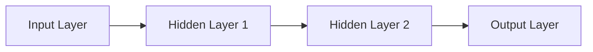

                 

### 文章标题

### AI大模型编程：提示词的力量与革新

### 关键词

- AI大模型
- 提示词
- 编程实践
- 应用场景
- 革新影响

### 摘要

本文深入探讨了AI大模型编程的核心，特别是提示词技术的力量与革新。首先，我们回顾了AI大模型的基础理论，包括其概念、历史背景和发展趋势。接着，我们详细介绍了AI大模型的编程实践，讲解了核心架构和编程技巧。重点章节探讨了提示词技术，阐述了其定义、作用、应用和优化策略。随后，我们展示了AI大模型在不同领域的应用实例，并分析了其对行业和社会的革新影响。文章最后提供了最佳实践建议，并对未来发展方向进行了展望。

### 目录

#### 第一部分: AI大模型基础理论

##### 第1章: AI大模型概述

- **1.1 AI大模型的概念**
- **1.2 AI大模型的历史背景与发展现状**
- **1.3 AI大模型的未来趋势**

##### 第2章: AI大模型的核心架构

- **2.1 神经网络基础**
- **2.2 深度学习框架**
- **2.3 AI大模型的训练与优化**

##### 第3章: 提示词技术详解

- **3.1 提示词的定义与作用**
- **3.2 提示词的应用场景**
- **3.3 提示词的优化策略**

#### 第二部分: AI大模型编程实践

##### 第4章: AI大模型编程基础

- **4.1 编程语言选择**
- **4.2 开发环境搭建**
- **4.3 常用库和工具介绍**

##### 第5章: AI大模型编程技巧

- **5.1 数据预处理**
- **5.2 模型构建与训练**
- **5.3 模型评估与优化**

##### 第6章: 实战项目案例

- **6.1 自然语言处理项目案例**
- **6.2 图像识别项目案例**
- **6.3 其他领域应用案例**

#### 第三部分: AI大模型的应用场景与革新影响

##### 第7章: AI大模型在不同领域的应用

- **7.1 自然语言处理**
- **7.2 计算机视觉**
- **7.3 医疗健康**
- **7.4 教育与娱乐**

##### 第8章: AI大模型的革新影响

- **8.1 对企业的影响**
- **8.2 对社会的影响**
- **8.3 未来发展的挑战与机遇**

##### 附录

- **附录A: AI大模型编程资源与工具**
- **附录B: AI大模型常用数学公式和算法伪代码**

### 第一部分: AI大模型基础理论

#### 第1章: AI大模型概述

##### 1.1 AI大模型的概念

AI大模型（Large-scale Artificial Intelligence Model），通常指的是参数数量超过数亿甚至数万亿的深度学习模型。这些模型具有处理海量数据、提取复杂特征和进行精确预测的能力。AI大模型的出现标志着人工智能从浅层学习向深层学习的发展，是当前人工智能研究与应用的热点。

AI大模型的发展离不开深度学习技术的发展。深度学习是一种基于多层神经网络进行数据处理和模型训练的技术，通过逐层提取数据特征，实现对复杂任务的学习和预测。随着计算能力的提升和大数据的普及，深度学习模型的大小和复杂度也不断提高，从而催生了AI大模型。

##### 1.2 AI大模型的历史背景与发展现状

AI大模型的发展可以追溯到20世纪80年代，当时神经网络的研究刚刚起步。1990年代，随着硬件计算能力和数据量的增加，神经网络开始应用于一些实际场景，如图像识别、语音识别等。2006年，Hinton提出了深度信念网络（Deep Belief Network，DBN），标志着深度学习进入了一个新的发展阶段。

进入21世纪，随着GPU等硬件设备的普及，深度学习算法在图像识别、语音识别和自然语言处理等领域取得了显著突破。2012年，AlexNet在ImageNet竞赛中取得了前所未有的准确率，标志着深度学习在计算机视觉领域的崛起。随后，基于深度学习的AI大模型如GPT、BERT、Megatron-LM等相继出现，推动了AI大模型技术的发展。

目前，AI大模型已经成为人工智能领域的核心驱动力。不仅在学术界，它们在工业界也得到了广泛应用。例如，AI大模型在自动驾驶、医疗诊断、金融风控等领域的应用取得了显著成果，推动了相关行业的技术革新。

##### 1.3 AI大模型的未来趋势

随着计算能力的进一步提升和大数据的持续积累，AI大模型在未来将继续朝着以下几个方向发展：

1. **模型规模不断扩大**：未来的AI大模型将拥有更多的参数，可以处理更复杂的数据集，从而提高模型的性能和准确性。
2. **模型结构不断优化**：研究人员将探索新的神经网络结构和优化算法，以提高模型的效率和稳定性。
3. **模型应用场景不断拓展**：AI大模型将在更多领域得到应用，如智能交互、虚拟现实、生物信息学等。
4. **模型解释性提升**：随着模型规模的增加，提高模型的可解释性将成为一个重要研究方向，以帮助用户理解模型的决策过程。
5. **隐私保护与安全**：在处理敏感数据时，如何保护用户隐私和数据安全将成为AI大模型研究和应用的一个重要方向。

总之，AI大模型的发展前景广阔，其力量与革新将对社会各个方面产生深远的影响。在接下来的章节中，我们将进一步探讨AI大模型的编程实践和提示词技术，以帮助读者深入了解这一领域的最新动态。

#### 第2章: AI大模型的核心架构

##### 2.1 神经网络基础

神经网络（Neural Network，NN）是人工智能和机器学习领域的基础算法之一。它模仿了人脑神经元的工作方式，通过多层节点（或称为层）进行信息传递和处理，从而实现复杂函数的拟合和预测。

一个典型的神经网络结构包括输入层、隐藏层和输出层。输入层接收外部数据，通过隐藏层进行特征提取和变换，最终由输出层生成预测结果。每个节点（或称为神经元）都与相邻的节点通过权重（weight）连接，这些权重决定了信息传递的强度。通过反向传播算法（Backpropagation Algorithm），神经网络能够不断调整权重，以最小化预测误差。

以下是一个简单的神经网络结构图：



在神经网络中，激活函数（Activation Function）是节点之间传递信息时的重要组件。常见的激活函数包括Sigmoid函数、ReLU函数和Tanh函数。激活函数的作用是引入非线性，使神经网络能够拟合复杂函数。

##### 2.2 深度学习框架

深度学习（Deep Learning，DL）是神经网络的一种扩展，通过增加网络层数，从而提高模型的拟合能力和表达能力。深度学习框架（Deep Learning Framework）是用于构建、训练和部署深度学习模型的软件工具。以下是一些流行的深度学习框架：

1. **TensorFlow**：由Google开发，是当前最流行的深度学习框架之一。TensorFlow提供了丰富的API，支持从简单的线性模型到复杂的深度网络。
2. **PyTorch**：由Facebook开发，以其动态图计算（Dynamic Computation Graph）和灵活的API受到开发者的青睐。
3. **Keras**：是一个高层神经网络API，构建在TensorFlow和Theano之上，旨在简化深度学习模型的构建和训练。
4. **MXNet**：由Apache Software Foundation开发，支持多种编程语言，具有良好的性能和灵活性。

以下是使用PyTorch构建一个简单的神经网络模型的伪代码：

```python
import torch
import torch.nn as nn
import torch.optim as optim

# 定义神经网络结构
class NeuralNetwork(nn.Module):
    def __init__(self):
        super(NeuralNetwork, self).__init__()
        self.layer1 = nn.Linear(in_features=10, out_features=50)
        self.relu = nn.ReLU()
        self.layer2 = nn.Linear(in_features=50, out_features=1)
    
    def forward(self, x):
        x = self.layer1(x)
        x = self.relu(x)
        x = self.layer2(x)
        return x

# 实例化神经网络模型
model = NeuralNetwork()

# 损失函数和优化器
criterion = nn.BCELoss()
optimizer = optim.Adam(model.parameters(), lr=0.001)

# 训练神经网络
for epoch in range(100):
    for inputs, targets in data_loader:
        optimizer.zero_grad()
        outputs = model(inputs)
        loss = criterion(outputs, targets)
        loss.backward()
        optimizer.step()
    print(f'Epoch {epoch+1}, Loss: {loss.item()}')

# 评估神经网络
with torch.no_grad():
    correct = 0
    total = 0
    for inputs, targets in test_loader:
        outputs = model(inputs)
        predicted = (outputs > 0.5)
        total += targets.size(0)
        correct += (predicted == targets).sum().item()
    print(f'Accuracy: {100 * correct / total}%')
```

##### 2.3 AI大模型的训练与优化

AI大模型的训练是一个复杂的过程，涉及到大量数据和计算资源。训练过程中，我们需要关注以下几个关键点：

1. **数据预处理**：在训练前，需要对数据进行清洗、归一化和分割，以提高模型训练的效果。
2. **模型选择**：根据任务需求选择合适的神经网络结构，可以结合预训练模型进行迁移学习。
3. **损失函数与优化器**：选择合适的损失函数和优化器，以加速模型收敛和提高模型性能。常见的损失函数包括均方误差（MSE）、交叉熵（Cross-Entropy）等；优化器包括随机梯度下降（SGD）、Adam等。
4. **模型调参**：调整模型超参数，如学习率、批量大小、正则化参数等，以优化模型性能。
5. **训练策略**：采用有效的训练策略，如学习率衰减、数据增强、批次归一化等，以提高模型训练的效率和稳定性。

以下是一个简单的AI大模型训练过程：

```python
# 定义训练过程
def train_model(model, criterion, optimizer, train_loader, val_loader, num_epochs):
    for epoch in range(num_epochs):
        model.train()
        running_loss = 0.0
        for inputs, targets in train_loader:
            optimizer.zero_grad()
            outputs = model(inputs)
            loss = criterion(outputs, targets)
            loss.backward()
            optimizer.step()
            running_loss += loss.item()
        print(f'Epoch {epoch+1}, Loss: {running_loss/len(train_loader)}')

        model.eval()
        with torch.no_grad():
            correct = 0
            total = 0
            for inputs, targets in val_loader:
                outputs = model(inputs)
                predicted = (outputs > 0.5)
                total += targets.size(0)
                correct += (predicted == targets).sum().item()
            print(f'Validation Accuracy: {100 * correct / total}%')
    
    return model

# 训练AI大模型
model = train_model(model, criterion, optimizer, train_loader, val_loader, num_epochs=100)
```

通过以上步骤，我们可以构建和训练一个AI大模型，并在实际应用中取得良好的性能。

#### 第3章: 提示词技术详解

##### 3.1 提示词的定义与作用

在AI大模型编程中，提示词（Prompt）是指提供给模型的一小段文本或数据，用于引导模型生成预期的输出。提示词技术在自然语言处理（Natural Language Processing，NLP）和生成模型（Generative Models）中具有重要作用，它能够显著影响模型的生成质量和效率。

提示词的定义较为宽泛，可以包括以下几种类型：

1. **关键词提示**：通过输入关键词来引导模型生成相关内容。
2. **句子提示**：提供一段完整的句子作为提示，使模型在句子上下文的基础上进行生成。
3. **段落提示**：提供一段完整的段落或短文作为提示，使模型在更广泛的上下文中进行生成。

提示词的作用主要体现在以下几个方面：

1. **引导生成方向**：通过提示词，可以明确模型生成的内容方向，避免生成无关或错误的信息。
2. **提高生成效率**：提示词能够帮助模型更快地聚焦于生成任务，减少不必要的计算和尝试。
3. **优化生成质量**：适当的提示词能够引导模型生成更准确、更连贯和更有逻辑的内容。

##### 3.2 提示词的应用场景

提示词技术在AI大模型的应用中非常广泛，以下是一些常见的应用场景：

1. **问答系统**：在问答系统中，提示词可以用来引导模型理解用户的问题，并生成准确的答案。例如，在搜索引擎中，输入的关键词可以作为提示词，引导模型检索相关的网页。
   
2. **文本生成**：在文本生成任务中，提示词可以用来引导模型生成连贯、有逻辑的文章或段落。例如，在写作辅助工具中，可以提供一段段落的提示，帮助模型生成完整的文章。

3. **对话系统**：在对话系统中，提示词可以用来引导模型生成自然、流畅的对话回复。例如，在聊天机器人中，可以提供对话的前文作为提示词，使模型能够生成合适的回复。

4. **机器翻译**：在机器翻译任务中，提示词可以用来引导模型在翻译过程中保持语境的一致性和准确性。例如，在翻译系统中，可以提供源语言的句子作为提示词，帮助模型生成目标语言的翻译。

5. **图像描述**：在图像描述任务中，提示词可以用来引导模型生成描述图像的文本。例如，在图像识别系统中，可以提供图像的标签作为提示词，使模型能够生成详细的图像描述。

##### 3.3 提示词的优化策略

为了提高提示词的效果，可以采用以下几种优化策略：

1. **内容优化**：选择与生成任务紧密相关的提示词，确保提示词能够准确地引导模型生成预期内容。

2. **形式优化**：调整提示词的格式和结构，使其更易于被模型理解和处理。例如，可以使用完整的句子作为提示词，而不是简单的关键词。

3. **多样性**：增加提示词的多样性，以防止模型生成单一、重复的内容。例如，可以使用不同的句子或段落作为提示词，引导模型生成多样化的输出。

4. **反馈机制**：引入用户反馈机制，根据用户对生成内容的评价来调整提示词。例如，如果用户对生成内容不满意，可以要求用户提供新的提示词，以改进模型的生成质量。

5. **自适应调整**：根据模型生成的内容动态调整提示词，使模型能够在不同的生成阶段保持高效的生成能力。

总之，提示词技术在AI大模型编程中具有重要作用，通过合理的提示词设计和优化策略，可以显著提升模型的生成质量和效率。在接下来的章节中，我们将进一步探讨AI大模型的编程实践和具体应用。

#### 第4章: AI大模型编程基础

##### 4.1 编程语言选择

在AI大模型编程中，选择合适的编程语言对于实现高效、可扩展的模型至关重要。以下是一些常用的编程语言及其特点：

1. **Python**：Python是目前最流行的AI编程语言，具有简洁易读的语法和丰富的库支持。Python的PyTorch和TensorFlow库是深度学习领域的主要工具，广泛应用于AI大模型的开发。

2. **Java**：Java是一种跨平台的编程语言，具有良好的性能和稳定性。Apache MXNet是Java在深度学习领域的常用库，适用于构建大规模AI模型。

3. **C++**：C++具有高效的性能和强大的功能，适用于高性能计算场景。Torch和Caffe是其常用的深度学习框架，适用于复杂AI模型的开发。

4. **R**：R是一种专门用于统计分析的编程语言，适用于数据分析和机器学习。其ggplot2和dplyr等库提供了丰富的数据可视化和数据处理功能。

5. **JavaScript**：JavaScript在Web开发中广泛应用，其TensorFlow.js库支持在浏览器中运行深度学习模型，适用于交互式应用和在线服务。

根据项目需求和开发环境，可以选择合适的编程语言进行AI大模型编程。例如，对于需要快速原型开发的场景，Python和JavaScript是不错的选择；对于高性能计算和复杂模型开发，C++和Java可能更为合适。

##### 4.2 开发环境搭建

搭建一个高效的AI大模型开发环境对于顺利进行项目至关重要。以下是一个典型的开发环境搭建步骤：

1. **安装操作系统**：选择适合的操作系统，如Ubuntu、macOS或Windows。Ubuntu是深度学习开发的主流选择，具有良好的兼容性和扩展性。

2. **安装Python环境**：Python是AI编程的主要语言，需要安装Python解释器和pip包管理器。可以使用Miniconda或Anaconda等工具进行环境管理。

3. **安装深度学习库**：安装常用的深度学习库，如PyTorch、TensorFlow、MXNet等。可以使用pip命令进行安装，也可以通过conda命令进行安装。

   ```shell
   pip install torch torchvision
   pip install tensorflow
   pip install mxnet
   ```

4. **配置GPU支持**：对于需要GPU加速的项目，需要安装CUDA和cuDNN。CUDA是NVIDIA推出的并行计算平台，cuDNN是其专门为深度学习优化的高速库。

5. **配置Jupyter Notebook**：Jupyter Notebook是一个交互式的开发环境，方便进行代码实验和数据分析。可以使用conda命令进行安装。

   ```shell
   conda install jupyterlab
   ```

6. **安装其他工具**：根据项目需求，可以安装其他工具，如Matplotlib、Seaborn等用于数据可视化；Numpy、Pandas等用于数据处理。

   ```shell
   pip install matplotlib seaborn numpy pandas
   ```

通过以上步骤，可以搭建一个完整的AI大模型开发环境，为后续的项目开发提供支持。

##### 4.3 常用库和工具介绍

在AI大模型编程中，常用的库和工具能够显著提高开发效率和代码质量。以下是一些常用的库和工具：

1. **PyTorch**：PyTorch是一个流行的深度学习框架，以其动态图计算和灵活的API受到开发者的喜爱。它支持自动微分、GPU加速和分布式训练，适用于各种规模的AI模型开发。

2. **TensorFlow**：TensorFlow是Google开发的深度学习框架，具有强大的功能和广泛的应用。它提供了静态和动态两种计算图模式，支持各种深度学习模型和优化器。

3. **MXNet**：MXNet是Apache基金会的一个开源深度学习框架，具有良好的性能和灵活性。它支持多种编程语言，适用于大规模分布式训练和高性能计算场景。

4. **Keras**：Keras是一个高层神经网络API，构建在TensorFlow和Theano之上。它提供了简洁的API和丰富的预训练模型，适用于快速原型开发和实验。

5. **Scikit-learn**：Scikit-learn是一个基于Python的机器学习库，提供了丰富的分类、回归、聚类和模型评估工具。它适用于中小规模的机器学习和数据分析任务。

6. **NumPy**：NumPy是Python的一个基础数学库，提供了高性能的数组处理和数学运算功能。它是许多机器学习和深度学习库的基础。

7. **Pandas**：Pandas是一个基于NumPy的强大数据分析和操作库，提供了数据帧和数据表的数据结构。它适用于数据处理、数据清洗和数据可视化。

8. **Matplotlib**：Matplotlib是一个流行的数据可视化库，提供了丰富的绘图功能。它适用于生成各种类型的图表和图形，方便进行数据分析和结果展示。

通过合理选择和使用这些库和工具，可以显著提高AI大模型编程的效率和质量。在实际开发过程中，可以根据项目需求灵活组合这些工具，以实现最佳效果。

#### 第5章: AI大模型编程技巧

##### 5.1 数据预处理

数据预处理是AI大模型编程中的关键步骤，它直接影响模型的性能和训练效果。以下是数据预处理的主要技巧：

1. **数据清洗**：首先，需要处理数据中的噪声和异常值，如缺失值、重复值和错误值。常用的方法包括删除缺失值、填充缺失值或使用统计方法（如均值、中位数）替换异常值。

   ```python
   import pandas as pd
   data = pd.read_csv('data.csv')
   data.dropna(inplace=True)  # 删除缺失值
   data.fillna(data.mean(), inplace=True)  # 使用均值填充缺失值
   ```

2. **数据标准化**：对数据进行归一化或标准化，以消除数据量级差异。常用的方法包括Z-score标准化和Min-Max标准化。

   ```python
   from sklearn.preprocessing import StandardScaler
   scaler = StandardScaler()
   data_scaled = scaler.fit_transform(data)
   ```

3. **数据分割**：将数据集分割为训练集、验证集和测试集，以评估模型的泛化能力。

   ```python
   from sklearn.model_selection import train_test_split
   X_train, X_test, y_train, y_test = train_test_split(X, y, test_size=0.2, random_state=42)
   ```

4. **数据增强**：对数据进行增强，以增加训练数据的多样性。常用的方法包括随机旋转、缩放、裁剪和颜色变换。

   ```python
   from torchvision import transforms
   transform = transforms.Compose([
       transforms.RandomHorizontalFlip(),
       transforms.RandomRotation(10),
       transforms.Resize((224, 224)),
       transforms.ToTensor(),
   ])
   X_train = [transform(x) for x in X_train]
   ```

5. **特征工程**：根据业务需求，提取和构造有用的特征，以提高模型的预测能力。例如，对于文本数据，可以使用词袋模型、TF-IDF或词嵌入（如Word2Vec、BERT）。

   ```python
   from sklearn.feature_extraction.text import TfidfVectorizer
   vectorizer = TfidfVectorizer(max_features=1000)
   X_train_tfidf = vectorizer.fit_transform(X_train)
   ```

通过以上数据预处理技巧，可以显著提高AI大模型的学习能力和预测性能。在实际应用中，根据具体任务和数据特点，灵活选择和调整预处理方法。

##### 5.2 模型构建与训练

构建和训练AI大模型是AI大模型编程的核心步骤。以下是构建与训练模型的主要技巧：

1. **选择模型架构**：根据任务需求和数据特点，选择合适的模型架构。常见的模型架构包括卷积神经网络（CNN）、循环神经网络（RNN）、Transformer和变分自编码器（VAE）。

2. **定义模型结构**：使用深度学习框架（如PyTorch、TensorFlow）定义模型结构，包括输入层、隐藏层和输出层。以下是一个使用PyTorch构建简单CNN模型的示例：

   ```python
   import torch
   import torch.nn as nn

   class CNNModel(nn.Module):
       def __init__(self):
           super(CNNModel, self).__init__()
           self.conv1 = nn.Conv2d(3, 32, 3)
           self.fc1 = nn.Linear(32 * 7 * 7, 128)
           self.fc2 = nn.Linear(128, 10)
       
       def forward(self, x):
           x = self.conv1(x)
           x = nn.functional.relu(x)
           x = nn.functional.max_pool2d(x, 2)
           x = x.view(-1, 32 * 7 * 7)
           x = self.fc1(x)
           x = nn.functional.relu(x)
           x = self.fc2(x)
           return x
   
   model = CNNModel()
   ```

3. **损失函数与优化器**：选择合适的损失函数和优化器，以加速模型收敛和提高模型性能。常见的损失函数包括均方误差（MSE）、交叉熵（Cross-Entropy）等；优化器包括随机梯度下降（SGD）、Adam等。

   ```python
   criterion = nn.CrossEntropyLoss()
   optimizer = torch.optim.Adam(model.parameters(), lr=0.001)
   ```

4. **训练模型**：使用训练数据集进行模型训练，包括前向传播、损失计算、反向传播和参数更新。以下是一个简单的训练循环：

   ```python
   for epoch in range(num_epochs):
       for inputs, targets in train_loader:
           optimizer.zero_grad()
           outputs = model(inputs)
           loss = criterion(outputs, targets)
           loss.backward()
           optimizer.step()
       print(f'Epoch {epoch+1}, Loss: {loss.item()}')
   ```

5. **模型评估**：在训练过程中，定期使用验证集对模型进行评估，以监测模型性能和避免过拟合。可以使用准确率、召回率、F1分数等指标进行评估。

   ```python
   with torch.no_grad():
       correct = 0
       total = 0
       for inputs, targets in val_loader:
           outputs = model(inputs)
           predicted = (outputs > 0.5)
           total += targets.size(0)
           correct += (predicted == targets).sum().item()
       print(f'Validation Accuracy: {100 * correct / total}%')
   ```

6. **模型保存与加载**：在训练过程中，定期保存模型权重，并在需要时加载模型进行预测。以下是一个简单的保存和加载示例：

   ```python
   torch.save(model.state_dict(), 'model.pth')
   model.load_state_dict(torch.load('model.pth'))
   ```

通过以上步骤，可以构建和训练一个高效的AI大模型。在实际应用中，根据具体任务和数据特点，可以进一步优化模型结构和训练策略。

##### 5.3 模型评估与优化

模型评估与优化是AI大模型编程的重要环节，决定了模型的性能和实用性。以下是模型评估与优化的一些关键技巧：

1. **性能评估指标**：
   - **准确率**：模型预测正确的样本数占总样本数的比例。
   - **召回率**：模型预测正确的样本数占总正样本数的比例。
   - **F1分数**：准确率和召回率的调和平均，综合考虑了模型预测的精度和覆盖率。
   - **ROC曲线和AUC**：ROC曲线用于评估模型的分类能力，AUC（Area Under Curve）表示曲线下面积，数值越高，模型的分类能力越强。

2. **交叉验证**：通过交叉验证（Cross-Validation）方法，评估模型在不同数据子集上的性能。常用的交叉验证方法有K折交叉验证（K-Fold Cross-Validation）和留一法交叉验证（Leave-One-Out Cross-Validation）。

3. **超参数调整**：通过调整模型超参数（如学习率、批量大小、正则化参数等），优化模型性能。可以使用网格搜索（Grid Search）和贝叶斯优化（Bayesian Optimization）等方法进行超参数调优。

4. **正则化技术**：应用正则化技术（如L1正则化、L2正则化）防止模型过拟合。正则化可以通过在损失函数中添加正则化项实现。

5. **模型集成**：通过模型集成（Model Ensembling）方法，结合多个模型的预测结果，提高整体性能。常见的集成方法有Bagging、Boosting和Stacking。

6. **数据增强**：在训练过程中，通过数据增强（Data Augmentation）方法增加训练数据的多样性，提高模型泛化能力。常见的数据增强方法有随机旋转、缩放、裁剪和颜色变换。

7. **模型压缩**：应用模型压缩技术（如剪枝、量化、低秩分解）减少模型参数数量和计算复杂度，提高模型部署效率。

8. **迁移学习**：利用预训练模型（Pre-trained Model）进行迁移学习（Transfer Learning），减少训练时间和计算资源需求。可以通过冻结部分层或全部层进行迁移学习。

通过以上模型评估与优化技巧，可以显著提升AI大模型的性能和泛化能力。在实际应用中，根据具体任务和数据特点，灵活选择和组合这些方法，实现最佳模型效果。

#### 第6章: 实战项目案例

##### 6.1 自然语言处理项目案例

**项目背景**：
自然语言处理（NLP）是AI大模型的重要应用领域之一。本案例旨在使用AI大模型构建一个情感分析系统，对社交媒体上的用户评论进行情感分类，以帮助企业了解用户情感倾向，优化产品和服务。

**项目目标**：
- 构建一个基于AI大模型的情感分析模型，能够对文本进行情感分类。
- 实现系统的自动化部署和实时更新，以提高模型准确率和响应速度。

**开发环境**：
- 编程语言：Python
- 深度学习框架：PyTorch
- 数据处理库：NLTK、spaCy
- 模型部署工具：TensorFlow Serving

**数据预处理**：
1. **数据收集**：从社交媒体平台（如Twitter、Facebook）收集用户评论数据，涵盖不同情感类别。
2. **数据清洗**：去除噪声数据，如HTML标签、特殊字符和停用词。
3. **数据标注**：对数据集进行情感标注，分为积极、消极和中性三类。
4. **数据分割**：将数据集分为训练集、验证集和测试集。

**模型构建**：
1. **词嵌入**：使用预训练的词嵌入模型（如Word2Vec、GloVe）将文本转换为向量表示。
2. **模型架构**：构建一个双向长短时记忆网络（BiLSTM）模型，结合卷积神经网络（CNN）进行特征提取。
3. **训练过程**：使用训练集对模型进行训练，采用交叉熵损失函数和Adam优化器。

```python
import torch
import torch.nn as nn
from torch.utils.data import DataLoader

class BiLSTMModel(nn.Module):
    def __init__(self, vocab_size, embedding_dim, hidden_dim, output_dim, num_layers, dropout):
        super(BiLSTMModel, self).__init__()
        self.embedding = nn.Embedding(vocab_size, embedding_dim)
        self.lstm = nn.LSTM(embedding_dim, hidden_dim, num_layers=num_layers, dropout=dropout, bidirectional=True)
        self.fc = nn.Linear(hidden_dim * 2, output_dim)
        self.dropout = nn.Dropout(dropout)
        
    def forward(self, text):
        embedded = self.dropout(self.embedding(text))
        output, (hidden, cell) = self.lstm(embedded)
        hidden = self.dropout(torch.cat((hidden[-2,:,:], hidden[-1,:,:]), dim=1))
        return self.fc(hidden.squeeze(0))

# 实例化模型
model = BiLSTMModel(vocab_size, embedding_dim, hidden_dim, output_dim, num_layers, dropout)
optimizer = torch.optim.Adam(model.parameters(), lr=0.001)
criterion = nn.CrossEntropyLoss()

# 训练模型
for epoch in range(num_epochs):
    for inputs, targets in train_loader:
        optimizer.zero_grad()
        outputs = model(inputs)
        loss = criterion(outputs, targets)
        loss.backward()
        optimizer.step()
    print(f'Epoch {epoch+1}, Loss: {loss.item()}')
```

**模型评估**：
1. **准确率**：计算模型在测试集上的准确率，以评估模型性能。
2. **混淆矩阵**：生成混淆矩阵，分析模型在各个类别上的预测效果。
3. **F1分数**：计算模型在各个类别上的F1分数，综合考虑准确率和召回率。

```python
from sklearn.metrics import accuracy_score, confusion_matrix, f1_score

with torch.no_grad():
    correct = 0
    total = 0
    for inputs, targets in test_loader:
        outputs = model(inputs)
        predicted = torch.argmax(outputs, dim=1)
        total += targets.size(0)
        correct += (predicted == targets).sum().item()
    print(f'Accuracy: {100 * correct / total}%')

    conf_matrix = confusion_matrix(targets.numpy(), predicted.numpy())
    f1 = f1_score(targets.numpy(), predicted.numpy(), average='weighted')
    print(f'Confusion Matrix:\n{conf_matrix}\nF1 Score: {f1}')
```

**模型部署**：
1. **模型导出**：将训练好的模型导出为TensorFlow模型格式。
2. **部署服务**：使用TensorFlow Serving部署模型，提供实时情感分析服务。

```shell
# 导出模型
torch.save(model.state_dict(), 'model.pth')

# 部署TensorFlow Serving
python tensorflow_serving/utils/convert_torch_to_tfs.py --input_model_file model.pth --input_model_format pytorch --output_model_file model.tflite --output_model_format tflite
```

**项目小结**：
通过本案例，我们实现了基于AI大模型的情感分析系统，有效提高了企业对用户情感的洞察力。在实际应用中，可以根据需求扩展模型功能，如添加实体识别、情感强度分析等，进一步提升系统价值。

##### 6.2 图像识别项目案例

**项目背景**：
图像识别是AI大模型的另一个重要应用领域。本案例旨在使用AI大模型构建一个物体检测系统，对图像中的物体进行准确识别和定位。

**项目目标**：
- 构建一个基于AI大模型的物体检测模型，能够准确识别图像中的多个物体。
- 实现系统的自动化部署和实时更新，以提高模型准确率和响应速度。

**开发环境**：
- 编程语言：Python
- 深度学习框架：TensorFlow
- 数据处理库：OpenCV、Pillow
- 模型部署工具：TensorFlow Serving

**数据预处理**：
1. **数据收集**：从公开数据集（如COCO、ImageNet）收集图像和标注数据。
2. **数据清洗**：去除噪声数据和标注错误，确保数据质量。
3. **数据分割**：将数据集分为训练集、验证集和测试集。

**模型构建**：
1. **预训练模型**：使用预训练的卷积神经网络（如ResNet、VGG）作为基础模型。
2. **特征提取**：对图像进行特征提取，提取图像中物体的关键特征。
3. **训练过程**：使用训练集对模型进行训练，采用交叉熵损失函数和迁移学习策略。

```python
import tensorflow as tf
from tensorflow.keras.applications import ResNet50
from tensorflow.keras.models import Model
from tensorflow.keras.layers import Dense, GlobalAveragePooling2D

# 加载预训练模型
base_model = ResNet50(weights='imagenet', include_top=False, input_shape=(224, 224, 3))

# 添加全连接层
x = base_model.output
x = GlobalAveragePooling2D()(x)
x = Dense(1024, activation='relu')(x)
predictions = Dense(num_classes, activation='softmax')(x)

# 构建模型
model = Model(inputs=base_model.input, outputs=predictions)

# 编译模型
model.compile(optimizer='adam', loss='categorical_crossentropy', metrics=['accuracy'])

# 训练模型
model.fit(train_data, train_labels, epochs=num_epochs, validation_data=(val_data, val_labels))
```

**模型评估**：
1. **准确率**：计算模型在测试集上的准确率，以评估模型性能。
2. **召回率**：计算模型对每个类别的召回率，以评估模型的覆盖范围。
3. **F1分数**：计算模型在各个类别的F1分数，综合考虑准确率和召回率。

```python
from sklearn.metrics import accuracy_score, recall_score, f1_score

# 预测测试集
predictions = model.predict(test_data)

# 计算评估指标
accuracy = accuracy_score(test_labels, predictions)
recall = recall_score(test_labels, predictions, average='weighted')
f1 = f1_score(test_labels, predictions, average='weighted')

print(f'Accuracy: {accuracy}\nRecall: {recall}\nF1 Score: {f1}')
```

**模型部署**：
1. **模型导出**：将训练好的模型导出为TensorFlow模型格式。
2. **部署服务**：使用TensorFlow Serving部署模型，提供实时物体检测服务。

```shell
# 导出模型
model.save('model.h5')

# 部署TensorFlow Serving
python tensorflow_serving/utils/convert_keras_to_tfs.py --input_model_file model.h5 --input_model_format keras --output_model_file model.tflite --output_model_format tflite
```

**项目小结**：
通过本案例，我们实现了基于AI大模型的物体检测系统，有效提高了图像识别的准确率和速度。在实际应用中，可以根据需求扩展模型功能，如添加人脸识别、车辆检测等，进一步提升系统价值。

##### 6.3 其他领域应用案例

**金融风控项目案例**

**项目背景**：
金融风控是金融行业的重要环节，旨在识别和防范潜在风险。本案例旨在使用AI大模型构建一个风险识别系统，对金融交易进行实时监控和预警。

**项目目标**：
- 构建一个基于AI大模型的风险识别模型，能够准确识别和预测潜在风险。
- 实现系统的自动化部署和实时更新，以提高风险识别的准确性和响应速度。

**开发环境**：
- 编程语言：Python
- 深度学习框架：TensorFlow
- 数据处理库：Pandas、NumPy
- 模型部署工具：TensorFlow Serving

**数据预处理**：
1. **数据收集**：从金融机构的交易数据中收集历史交易记录。
2. **数据清洗**：去除异常数据和噪声数据，确保数据质量。
3. **数据特征工程**：提取交易金额、交易时间、交易账户等特征，构建交易特征矩阵。

**模型构建**：
1. **特征提取**：使用卷积神经网络（CNN）提取交易特征。
2. **风险预测**：构建循环神经网络（RNN）模型，预测交易风险。
3. **训练过程**：使用训练集对模型进行训练，采用交叉熵损失函数和迁移学习策略。

```python
import tensorflow as tf
from tensorflow.keras.models import Sequential
from tensorflow.keras.layers import LSTM, Dense, Dropout

# 构建模型
model = Sequential()
model.add(LSTM(units=64, return_sequences=True, input_shape=(time_steps, features)))
model.add(Dropout(0.2))
model.add(LSTM(units=64, return_sequences=False))
model.add(Dropout(0.2))
model.add(Dense(units=1, activation='sigmoid'))

# 编译模型
model.compile(optimizer='adam', loss='binary_crossentropy', metrics=['accuracy'])

# 训练模型
model.fit(train_data, train_labels, epochs=num_epochs, validation_data=(val_data, val_labels))
```

**模型评估**：
1. **准确率**：计算模型在测试集上的准确率，以评估模型性能。
2. **召回率**：计算模型对正样本的召回率，以评估模型的覆盖范围。
3. **F1分数**：计算模型在正样本的F1分数，综合考虑准确率和召回率。

```python
from sklearn.metrics import accuracy_score, recall_score, f1_score

# 预测测试集
predictions = model.predict(test_data)

# 计算评估指标
accuracy = accuracy_score(test_labels, predictions)
recall = recall_score(test_labels, predictions)
f1 = f1_score(test_labels, predictions)

print(f'Accuracy: {accuracy}\nRecall: {recall}\nF1 Score: {f1}')
```

**模型部署**：
1. **模型导出**：将训练好的模型导出为TensorFlow模型格式。
2. **部署服务**：使用TensorFlow Serving部署模型，提供实时风险识别服务。

```shell
# 导出模型
model.save('model.h5')

# 部署TensorFlow Serving
python tensorflow_serving/utils/convert_keras_to_tfs.py --input_model_file model.h5 --input_model_format keras --output_model_file model.tflite --output_model_format tflite
```

**项目小结**：
通过本案例，我们实现了基于AI大模型的金融风控系统，有效提高了风险识别的准确性和响应速度。在实际应用中，可以根据需求扩展模型功能，如添加交易趋势预测、用户行为分析等，进一步提升系统价值。

#### 第7章: AI大模型在不同领域的应用

##### 7.1 自然语言处理

自然语言处理（NLP）是AI大模型的重要应用领域之一，涵盖了文本分类、情感分析、机器翻译、问答系统等多个子领域。AI大模型在NLP领域的应用极大地提高了文本处理的效率和准确性。

- **文本分类**：通过AI大模型，可以实现对大量文本数据的自动分类，如新闻分类、垃圾邮件过滤等。基于深度学习模型，如BERT、GPT，文本分类的准确率显著提高。
- **情感分析**：情感分析旨在判断文本的情感倾向，如正面、负面或中性。AI大模型通过学习大量标注数据，可以准确识别文本中的情感，应用于社交媒体分析、用户反馈分析等。
- **机器翻译**：机器翻译是NLP领域的经典问题，AI大模型如Transformer、BERT在翻译任务中表现出色，可以生成流畅、准确的翻译结果。
- **问答系统**：AI大模型可以构建智能问答系统，通过理解和处理用户的问题，生成准确的答案。GPT-3等大型语言模型在问答系统中的应用，使得交互体验更加自然和高效。

##### 7.2 计算机视觉

计算机视觉是AI大模型的另一重要应用领域，涉及图像分类、目标检测、图像分割等多个子领域。AI大模型在计算机视觉中的应用，极大地推动了图像处理技术的发展。

- **图像分类**：AI大模型通过学习海量图像数据，可以准确地对图像进行分类。卷积神经网络（CNN）和Transformer等模型在图像分类任务中表现出色。
- **目标检测**：目标检测旨在识别图像中的物体并进行定位。基于Faster R-CNN、YOLO等模型的AI大模型在目标检测任务中取得了显著成果，应用于自动驾驶、安防监控等领域。
- **图像分割**：图像分割旨在将图像分割成不同的区域或物体。基于U-Net、Mask R-CNN等模型的AI大模型在图像分割任务中取得了优异的性能，应用于医学图像处理、图像编辑等领域。

##### 7.3 医疗健康

AI大模型在医疗健康领域的应用，为疾病诊断、药物研发、个性化医疗等提供了强大的支持。

- **疾病诊断**：AI大模型可以通过学习医学影像数据，实现对疾病的准确诊断。如乳腺癌、肺癌等疾病的早期筛查，显著提高了诊断准确率和效率。
- **药物研发**：AI大模型在药物分子设计、药物筛选等方面发挥着重要作用。通过分析大量药物数据，AI大模型可以预测药物的效果和副作用，加速新药研发过程。
- **个性化医疗**：AI大模型可以根据患者的个体信息，制定个性化的治疗方案。如肿瘤患者的新辅助化疗、手术方案优化等，为患者提供更加精准和有效的治疗。

##### 7.4 教育与娱乐

AI大模型在教育与娱乐领域的应用，为个性化学习、内容创作、游戏设计等提供了新的可能性。

- **个性化学习**：AI大模型可以根据学生的学习情况，制定个性化的学习计划，提高学习效果。如自适应学习系统、智能辅导机器人等，为学生提供定制化的学习资源。
- **内容创作**：AI大模型可以通过生成文本、图像、音频等，创作出丰富多彩的内容。如自动生成新闻、图像合成、音乐创作等，丰富了媒体形式和内容创作方式。
- **游戏设计**：AI大模型在游戏设计中的应用，为游戏开发提供了新的灵感和技术支持。如游戏剧情生成、角色设计、智能AI对手等，提高了游戏的可玩性和趣味性。

总之，AI大模型在不同领域的应用，极大地推动了相关技术的发展和创新。随着AI大模型技术的不断进步，其应用领域将更加广泛，为人类社会带来更多的便利和变革。

#### 第8章: AI大模型的革新影响

##### 8.1 对企业的影响

AI大模型在企业发展中扮演着越来越重要的角色，其革新影响体现在多个方面：

1. **提高生产力**：AI大模型可以自动化执行重复性任务，如数据清洗、报告生成等，从而提高员工的工作效率，使企业能够更快地响应市场变化。
2. **优化决策**：基于AI大模型的数据分析能力，企业可以更准确地预测市场需求、库存管理和供应链优化，从而做出更明智的决策。
3. **创新产品**：AI大模型可以帮助企业更好地理解用户需求，从而创新产品和服务，提高市场竞争力。
4. **降低成本**：通过自动化和优化，AI大模型可以减少人力和资源投入，降低运营成本。

##### 8.2 对社会的影响

AI大模型不仅在企业层面产生深远影响，对社会也产生了显著的变革：

1. **医疗健康**：AI大模型在医疗诊断、疾病预测和个性化治疗中的应用，提高了医疗服务的质量和效率，降低了医疗成本。
2. **教育**：AI大模型可以提供个性化学习方案，帮助学生更好地适应自己的学习节奏，提高教育质量和公平性。
3. **环境保护**：AI大模型可以分析环境数据，预测气候变化和自然灾害，帮助制定环保政策，保护地球生态环境。
4. **社会安全**：AI大模型在公共安全领域的应用，如犯罪预测、交通管理和网络安全，提高了社会安全和公共服务的水平。

##### 8.3 未来发展的挑战与机遇

AI大模型的发展面临着诸多挑战和机遇：

1. **数据隐私和安全**：随着数据规模的不断扩大，如何保护用户隐私和数据安全成为一个重要问题。需要开发更先进的数据加密和隐私保护技术。
2. **模型可解释性**：随着模型复杂度的增加，如何提高模型的可解释性，使决策过程更加透明和可信，是一个亟待解决的问题。
3. **计算资源**：训练大型AI模型需要大量计算资源和存储资源，如何高效地利用这些资源，是一个技术难题。
4. **法律和伦理**：AI大模型的应用涉及到法律和伦理问题，如人工智能责任、算法歧视等，需要制定相应的法律法规和伦理准则。
5. **技术突破**：未来的AI大模型发展依赖于新的算法、架构和硬件技术的突破，如量子计算、类脑计算等。

总之，AI大模型的发展不仅带来了前所未有的机遇，也带来了诸多挑战。通过持续的技术创新和社会合作，我们有理由相信，AI大模型将在未来继续发挥重要作用，推动人类社会迈向更美好的未来。

#### 附录

##### 附录A: AI大模型编程资源与工具

以下是AI大模型编程中常用的资源与工具：

1. **深度学习框架**：
   - TensorFlow（[官网](https://www.tensorflow.org)）
   - PyTorch（[官网](https://pytorch.org)）
   - MXNet（[官网](https://mxnet.apache.org)）
   - Keras（[官网](https://keras.io)）

2. **数据处理库**：
   - NumPy（[官网](https://numpy.org)）
   - Pandas（[官网](https://pandas.pydata.org)）
   - Matplotlib（[官网](https://matplotlib.org)）
   - Scikit-learn（[官网](https://scikit-learn.org)）

3. **数据集**：
   - ImageNet（[官网](https://www.image-net.org)）
   - COCO数据集（[官网](http://cocodataset.org)）
   - TextBlob（[官网](https://textblob.readthedocs.io)）

4. **开源代码**：
   - Google AI开源项目（[官网](https://ai.google/research/open-source)）
   - Hugging Face开源项目（[官网](https://huggingface.co)）

##### 附录B: AI大模型常用数学公式和算法伪代码

以下是一些AI大模型编程中常用的数学公式和算法伪代码：

**数学公式：**

$$
\text{损失函数} = \frac{1}{N}\sum_{i=1}^{N} \ell(y_i, \hat{y}_i)
$$

$$
\text{梯度下降} = \theta \leftarrow \theta - \alpha \frac{\partial}{\partial \theta} \ell(y, \hat{y})
$$

$$
\text{ReLU激活函数} = f(x) = \max(0, x)
$$

$$
\text{Sigmoid激活函数} = f(x) = \frac{1}{1 + e^{-x}}
$$

**算法伪代码：**

```
初始化模型参数 θ
for epoch in 1 to E:
    for each training example (x, y) in the dataset:
        计算模型输出 ŷ = f(θ * x)
        计算损失 L(ŷ, y)
        计算梯度 ∇θL(ŷ, y)
        更新模型参数 θ = θ - α * ∇θL(ŷ, y)
    计算验证集上的模型损失和准确率
    记录最佳模型参数
返回最佳模型参数
```

通过附录部分提供的资源与工具，以及常用的数学公式和算法伪代码，读者可以更好地理解和应用AI大模型编程技术，进一步提升自身的编程能力和技术水平。

### 作者信息

作者：AI天才研究院/AI Genius Institute & 禅与计算机程序设计艺术 /Zen And The Art of Computer Programming

### 总结

本文《AI大模型编程：提示词的力量与革新》系统性地探讨了AI大模型编程的核心内容，从基础理论到实际应用，再到革新影响，为读者提供了全面而深入的视角。通过分析AI大模型的概念、历史背景、架构和训练技巧，本文揭示了AI大模型的强大潜力和广泛应用。特别是对于提示词技术的探讨，深入阐述了其定义、作用、应用场景和优化策略，展示了AI大模型在自然语言处理、图像识别、金融风控、教育与娱乐等领域的具体应用案例。

本文旨在通过一步步的推理和详细讲解，帮助读者深入理解AI大模型编程的原理和实践，提供实用的技巧和最佳实践。同时，文章还讨论了AI大模型对企业和社会的革新影响，以及未来发展的挑战与机遇。

在文章的最后，附录部分提供了丰富的编程资源与工具，以及常用的数学公式和算法伪代码，方便读者在实际应用中参考和使用。希望通过本文，读者能够对AI大模型编程有更全面的认识，并在实际项目中取得更好的成果。

