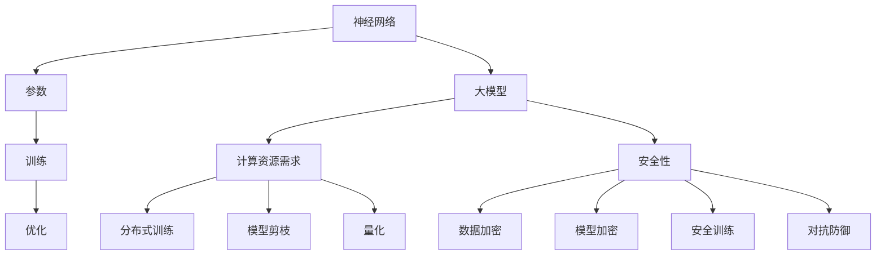

                 

### 引言

#### AI大模型编程的背景

人工智能（AI）作为当今科技领域的热点，其发展速度之快，应用范围之广，已然成为推动社会进步的重要力量。在AI的诸多分支中，大模型（Large-scale Model）尤为引人注目。大模型通常是指那些拥有数亿甚至数万亿参数的神经网络模型，如GPT-3、BERT等。这些模型在自然语言处理（NLP）、计算机视觉、语音识别等多个领域展现出了强大的性能。

然而，大模型的构建与应用并非易事，其中提示词（Prompt Engineering）技术的引入，为AI编程带来了全新的视角和可能性。提示词是一种引导大模型进行特定任务输入的方式，通过巧妙设计提示词，可以显著提高模型的性能和效率。提示词技术在AI大模型编程中的应用，不仅使得模型的训练过程更加高效，还赋予了模型更多的灵活性和实用性。

#### 本书的结构安排与目标

本书旨在深入探讨AI大模型编程中的提示词技术，帮助读者全面理解提示词的概念、设计原理、应用方法以及优化策略。全书分为五个主要部分：

1. **第一部分：AI大模型基础**：介绍大模型的核心概念、历史与发展、常见框架与算法、计算资源需求及安全性。
2. **第二部分：编程技巧与实践**：讲解提示词设计原理、数据准备与预处理、模型训练与优化、部署与调优、实时交互与动态调整。
3. **第三部分：提示词应用**：探讨提示词在不同领域（如NLP、图像识别、自然推理）中的应用。
4. **第四部分：案例分析**：通过实际案例，展示如何应用提示词技术解决实际问题。
5. **第五部分：未来展望**：分析提示词技术在未来AI大模型编程中的发展趋势、面临的挑战与机遇。

通过本书的阅读，读者将能够：

- 理解AI大模型的基本概念和架构。
- 掌握大模型的历史发展与主要框架。
- 学会如何设计有效的提示词，提升模型性能。
- 了解大模型训练、优化和部署的最佳实践。
- 熟悉提示词在不同领域的应用案例。
- 探索AI大模型编程的未来发展方向。

### 第一部分：AI大模型基础

#### 核心概念与联系

AI大模型是当前人工智能领域的研究热点，其核心概念包括神经网络、参数、训练和优化。神经网络是由大量神经元组成的计算模型，能够模拟人脑的运算方式。每个神经元通过权重和偏置与输入数据相乘，再通过激活函数进行处理，从而形成输出。

在AI大模型中，参数是指模型中所有的权重和偏置。参数的多少直接决定了模型的复杂度。训练过程是调整这些参数，使模型能够更好地拟合训练数据。优化是训练过程中的关键步骤，常用的优化算法包括随机梯度下降（SGD）、Adam等。

大模型的工作原理可以简单概括为：输入数据经过预处理，通过神经网络模型进行计算，得到输出结果。训练过程中，模型不断调整参数，优化模型性能。

#### AI大模型的历史与发展

AI大模型的发展历程可以分为几个阶段：

1. **早期神经网络**：从20世纪40年代开始，神经网络的概念逐渐形成。直到1986年，Rumelhart、Hinton和Williams等人提出了反向传播算法（Backpropagation），使神经网络能够进行有效的训练。

2. **深度学习兴起**：2006年，Geoffrey Hinton提出了深度信念网络（Deep Belief Network），标志着深度学习时代的到来。随后，深度学习在图像识别、语音识别等领域取得了显著成果。

3. **大模型的崛起**：2013年，Google的 neural network在ImageNet图像识别挑战赛中取得了突破性成绩。此后，深度学习模型规模逐渐增大，大模型成为研究热点。

4. **GPT、BERT等大模型的诞生**：2018年，OpenAI发布了GPT-2，随后GPT-3问世，成为当时最大的预训练语言模型。BERT（Bidirectional Encoder Representations from Transformers）则在大规模文本处理任务中展现了强大的性能。

#### 常见的AI大模型框架与算法

目前，AI大模型领域存在多种常见的框架和算法，以下列举几种主要模型：

1. **GPT系列模型**：GPT（Generative Pre-trained Transformer）模型是基于Transformer架构的预训练语言模型。GPT-2、GPT-3等模型在NLP任务中取得了显著成果。

2. **BERT模型**：BERT（Bidirectional Encoder Representations from Transformers）是由Google提出的一种双向Transformer模型，主要用于文本分类、问答等任务。

3. **T5模型**：T5（Text-To-Text Transfer Transformer）是一种通用的预训练语言模型，将所有NLP任务转化为文本到文本的转换任务。

4. **GPT-Neo模型**：GPT-Neo是对GPT模型的一种改进，通过增加模型规模和训练时间，提高了模型性能。

5. **ViT模型**：ViT（Vision Transformer）是将Transformer架构应用于计算机视觉任务的一种模型，通过自注意力机制对图像进行处理。

这些模型各有特点，适用于不同的应用场景。了解它们的基本原理和优缺点，有助于选择合适的大模型进行任务。

#### 大模型的计算资源需求与优化

大模型的训练和推理过程对计算资源有很高的要求。首先，模型的参数数量庞大，导致训练过程中的计算量巨大。其次，大模型通常需要大量的内存和显存来存储中间结果和参数。因此，计算资源的需求是制约大模型应用的主要瓶颈之一。

为了应对这一挑战，可以采取以下优化方法：

1. **分布式训练**：将模型分成多个部分，在不同的计算节点上并行训练，可以显著提高训练速度。

2. **模型剪枝**：通过减少模型的参数数量，降低模型的复杂度，减少计算量和存储需求。

3. **量化**：将模型的权重和激活值从浮点数转换为低精度的整数，以减少内存和存储需求。

4. **优化算法**：使用更高效的优化算法，如Adam、RMSProp等，可以提高训练效率。

5. **硬件加速**：利用GPU、TPU等硬件加速器，可以显著提高模型的训练和推理速度。

#### 大模型的安全性考虑

随着大模型的广泛应用，其安全性问题也越来越受到关注。大模型可能面临的威胁包括：

1. **数据泄露**：大模型在训练过程中可能会暴露敏感数据。
2. **模型窃取**：未经授权的第三方可能试图窃取模型结构或参数。
3. **对抗攻击**：攻击者可以通过构造特定的输入数据，使大模型产生错误的输出。

为了保障大模型的安全性，可以采取以下措施：

1. **数据加密**：对训练数据进行加密，防止数据泄露。
2. **模型加密**：使用加密算法对模型参数进行加密，防止模型窃取。
3. **安全训练**：在训练过程中加入噪声，防止模型参数被攻击者分析。
4. **对抗防御**：通过对抗训练和对抗检测技术，提高模型对对抗攻击的鲁棒性。

#### 核心概念与联系 Mermaid 流程图



### 第二部分：编程技巧与实践

#### 提示词设计原理

提示词（Prompt）在AI大模型编程中起到了至关重要的作用。它是一种引导大模型进行特定任务输入的方式，通过设计有效的提示词，可以显著提升模型的性能和效率。提示词的设计原理主要包括以下几个方面：

1. **信息密度**：提示词应包含足够的信息，以引导模型正确理解和处理任务。信息密度过高或过低都会影响模型的性能。

2. **上下文关联**：提示词应与任务上下文紧密相关，有助于模型理解任务的背景和目标。上下文关联性越好，模型的回答就越准确。

3. **多样性**：设计多样化的提示词，有助于模型学习到不同的任务模式和解决方案，提高模型的泛化能力。

4. **易理解性**：提示词应简洁明了，易于人类理解和解释。过于复杂的提示词可能会使模型产生混淆，导致错误输出。

5. **可扩展性**：提示词应具备一定的灵活性，能够适应不同的任务和数据集，以便于模型在不同场景下的应用。

#### 数据准备与预处理

在AI大模型编程中，数据准备与预处理是至关重要的一步。良好的数据准备与预处理能够提高模型的训练效率，降低过拟合风险，提升模型的性能。以下是一些常见的数据准备与预处理方法：

1. **数据清洗**：去除数据中的噪声、错误和冗余信息，提高数据的准确性。常见的清洗方法包括去除空值、删除重复记录、填补缺失值等。

2. **数据标准化**：将不同特征的数据进行统一处理，使其具有相似的量级和分布。常用的标准化方法包括Z-score标准化和Min-Max标准化。

3. **数据增强**：通过生成或变换原始数据，增加数据的多样性，从而提升模型的泛化能力。常见的数据增强方法包括随机裁剪、旋转、翻转等。

4. **数据分割**：将数据集划分为训练集、验证集和测试集，用于模型的训练、验证和评估。合理的分割可以避免模型在训练过程中出现过拟合。

5. **特征选择**：从大量特征中选择对模型性能有显著影响的特征，剔除无关或冗余的特征，简化模型结构，提高训练效率。

#### 模型训练与优化

模型训练与优化是AI大模型编程的核心环节。有效的训练与优化策略能够提高模型的性能和效率。以下是一些常用的训练与优化方法：

1. **批量大小**：批量大小是指每次训练时输入的数据样本数量。较小的批量大小可以降低过拟合风险，但训练速度较慢；较大的批量大小可以提高训练速度，但可能增加过拟合风险。通常，批量大小应根据模型规模和数据量进行选择。

2. **学习率**：学习率是优化算法在每次迭代中调整模型参数的步长。学习率过大可能导致模型无法收敛，过小则可能导致训练时间过长。常用的学习率调整方法包括固定学习率、学习率衰减、自适应学习率等。

3. **优化算法**：优化算法用于调整模型参数，使其达到最小化损失函数的目标。常见的优化算法包括随机梯度下降（SGD）、Adam、RMSProp等。不同优化算法在收敛速度、稳定性和效果上有所差异，应根据具体任务选择合适的优化算法。

4. **正则化**：正则化是防止模型过拟合的一种技术。常见的正则化方法包括L1正则化、L2正则化、Dropout等。正则化可以通过增加模型复杂度，降低模型对训练数据的依赖，提高模型的泛化能力。

5. **迁移学习**：迁移学习是一种利用已有模型的知识和经验，快速适应新任务的训练方法。通过迁移学习，可以减少对新数据的标注需求，提高模型的训练效率。迁移学习适用于具有相似任务和数据分布的新任务。

#### 模型部署与调优

模型部署与调优是AI大模型编程的最后一环，直接影响模型在实际应用中的性能。以下是一些常用的部署与调优方法：

1. **部署策略**：模型部署策略包括本地部署、云端部署和混合部署等。本地部署适用于资源受限的场景，云端部署适用于需要高并发和大吞吐量的场景，混合部署则结合了两者的优势。选择合适的部署策略可以最大化模型的应用价值。

2. **性能监控**：在模型部署后，需要对模型性能进行持续监控。常见的监控指标包括准确率、召回率、F1分数等。通过监控模型性能，可以发现潜在问题并进行及时调整。

3. **动态调优**：在模型部署过程中，根据实际应用场景和需求，对模型参数进行调整。动态调优可以通过在线学习、参数调整等方式，实现模型性能的持续优化。

4. **反馈循环**：建立用户反馈机制，收集用户对模型应用的反馈，用于模型改进和优化。通过反馈循环，可以实现模型的持续迭代和优化。

#### 实时交互与动态调整

实时交互与动态调整是AI大模型编程的高级应用。通过实时交互，模型可以与用户进行互动，根据用户需求进行动态调整。以下是一些常用的实时交互与动态调整方法：

1. **动态提示词**：根据用户输入的实时信息，动态生成提示词，引导模型进行任务。动态提示词可以提升模型的交互体验和任务性能。

2. **自适应学习率**：根据模型在实时交互中的表现，动态调整学习率。自适应学习率可以提高模型的收敛速度和稳定性。

3. **在线学习**：在实时交互过程中，利用用户反馈的数据，对模型进行在线学习，实现模型性能的持续优化。

4. **多模型融合**：结合多个模型的优势，实现实时交互和动态调整。多模型融合可以提高模型的综合性能，应对复杂任务。

### 第三部分：提示词应用

#### 提示词在不同领域的应用

提示词技术具有广泛的应用领域，以下分别介绍在自然语言处理（NLP）、图像识别和自然推理等领域的应用：

##### NLP领域的应用

在自然语言处理领域，提示词技术被广泛应用于文本分类、情感分析、问答系统等任务。以下是一些具体应用案例：

1. **文本分类**：通过设计合适的提示词，引导模型进行文本分类任务。例如，在新闻分类任务中，提示词可以包含关键词和主题信息，帮助模型准确分类新闻类别。

2. **情感分析**：提示词可以帮助模型识别文本中的情感倾向。例如，在评论分析任务中，提示词可以包含情感标签，如正面、负面等，帮助模型判断评论的情感极性。

3. **问答系统**：提示词可以引导模型理解用户的问题，并提供准确的答案。例如，在智能客服系统中，提示词可以包含用户的关键信息，帮助模型快速找到相关答案。

##### 图像识别领域的应用

在图像识别领域，提示词技术可以通过设计有效的输入提示，引导模型识别图像中的目标。以下是一些具体应用案例：

1. **目标检测**：通过设计包含目标特征和背景信息的提示词，引导模型进行目标检测任务。例如，在人脸检测任务中，提示词可以包含人脸的关键特征，帮助模型快速识别人脸。

2. **图像分类**：提示词可以包含图像的主题和标签信息，帮助模型进行图像分类。例如，在植物分类任务中，提示词可以包含植物种类和特征描述，帮助模型识别不同种类的植物。

3. **图像分割**：通过设计包含目标区域和背景区域的提示词，引导模型进行图像分割任务。例如，在车辆检测任务中，提示词可以包含车辆的位置和形状信息，帮助模型准确分割出车辆区域。

##### 自然推理领域的应用

在自然推理领域，提示词技术可以引导模型进行逻辑推理和问题解决。以下是一些具体应用案例：

1. **逻辑推理**：通过设计包含逻辑规则和条件的提示词，引导模型进行逻辑推理任务。例如，在数学问题解决任务中，提示词可以包含数学公式和条件，帮助模型推导出正确答案。

2. **智能问答**：通过设计包含问题和答案的提示词，引导模型进行智能问答任务。例如，在数学问答系统中，提示词可以包含问题、条件和答案，帮助模型提供准确的解答。

3. **问题解决**：通过设计包含问题、解决方案和提示信息的提示词，引导模型进行问题解决任务。例如，在编程学习任务中，提示词可以包含问题、代码示例和提示，帮助模型理解和解决编程问题。

#### 提示词优化的方法与策略

为了提高提示词的性能和效果，可以采取以下优化方法与策略：

1. **上下文优化**：通过优化提示词的上下文信息，增强模型的语义理解能力。例如，在NLP任务中，可以加入与问题相关的背景信息，帮助模型更好地理解问题意图。

2. **多样性优化**：通过设计多样化的提示词，提升模型的泛化能力。例如，在图像识别任务中，可以设计包含不同视角、光照和场景的提示词，提高模型对不同图像的识别能力。

3. **优化策略**：采用自适应优化策略，根据模型在训练过程中的表现，动态调整提示词。例如，在训练过程中，可以根据模型的准确率、召回率等指标，逐步优化提示词。

4. **对齐策略**：通过提示词与模型输出的对齐，提高模型对提示词的响应能力。例如，在问答系统中，可以设计包含答案关键信息的提示词，引导模型正确回答问题。

5. **反馈机制**：建立用户反馈机制，根据用户对模型表现的反馈，不断优化提示词。例如，在智能客服系统中，可以根据用户满意度、问题解决率等指标，调整提示词设计。

### 第四部分：案例分析

#### 案例一：智能客服系统

**1.1 案例背景**

智能客服系统是近年来广泛应用于企业客服领域的一项技术。通过人工智能技术，智能客服系统能够自动回答用户的问题，提高客服效率，降低人力成本。在本案例中，我们使用大模型和提示词技术，构建一个高效的智能客服系统。

**1.2 模型设计与实现**

在本案例中，我们采用GPT-3模型作为基础模型。GPT-3具有强大的文本生成能力，能够根据用户的问题生成准确的答案。为了提高模型的性能，我们设计了一个包含关键词和上下文的提示词。

```python
prompt = "用户提问：{}。请提供专业的回答。"
```

在训练过程中，我们将大量客服对话数据作为训练集，通过优化提示词，使模型能够准确理解用户的问题。

**1.3 部署与调优**

在部署阶段，我们将训练好的模型部署到云平台上，实现实时交互。为了提高模型的性能，我们采用动态调优策略，根据用户反馈和实际应用场景，不断优化模型参数和提示词。

**1.4 实际案例分析与详细讲解剖析**

在实际应用中，智能客服系统能够准确回答用户的问题，提高了客服效率。以下是一个具体案例：

用户提问：“我的手机为什么无法接收到短信？”

模型回答：“可能是由于信号问题、网络问题或手机故障导致的。您可以尝试重启手机，检查信号和网络连接，或联系运营商解决。”

通过分析该案例，我们可以看到，模型根据用户的问题和上下文信息，给出了准确的答案。这充分展示了提示词技术在实际应用中的优势。

**1.5 项目小结**

本案例展示了如何使用大模型和提示词技术构建一个高效的智能客服系统。通过优化提示词，模型能够准确理解用户的问题，提供专业的回答。在实际应用中，智能客服系统提高了客服效率，降低了人力成本。

#### 案例二：智能写作助手

**2.1 案例背景**

智能写作助手是近年来在内容创作领域的一项重要技术。通过人工智能技术，智能写作助手能够帮助用户生成高质量的文章、报告等。在本案例中，我们使用大模型和提示词技术，构建一个高效的智能写作助手。

**2.2 模型设计与实现**

在本案例中，我们采用BERT模型作为基础模型。BERT具有强大的文本生成能力，能够根据用户的需求生成符合逻辑和语言习惯的文本。为了提高模型的性能，我们设计了一个包含主题和关键信息的提示词。

```python
prompt = "请根据以下主题和关键信息，生成一篇相关的文章：主题：{}，关键信息：{}。"
```

在训练过程中，我们将大量文章数据作为训练集，通过优化提示词，使模型能够准确理解用户的需求。

**2.3 部署与调优**

在部署阶段，我们将训练好的模型部署到云平台上，实现实时交互。为了提高模型的性能，我们采用动态调优策略，根据用户反馈和实际应用场景，不断优化模型参数和提示词。

**2.4 实际案例分析与详细讲解剖析**

在实际应用中，智能写作助手能够根据用户的需求，生成高质量的文章。以下是一个具体案例：

用户需求：“请根据以下信息，生成一篇关于人工智能的文章：人工智能的定义、发展历程、应用领域。”

模型回答：

人工智能（Artificial Intelligence，简称AI）是计算机科学的一个分支，旨在创建智能机器，使其能够执行通常需要人类智能才能完成的任务。人工智能的发展历程可以追溯到20世纪50年代，当时科学家们首次提出了“人工智能”的概念。随着计算机技术的不断发展，人工智能逐渐成为一个独立的学科，并在各个领域取得了显著的成果。

在应用领域方面，人工智能已经广泛应用于自然语言处理、计算机视觉、智能推荐、自动驾驶等领域。例如，在自然语言处理方面，人工智能技术被广泛应用于机器翻译、情感分析、问答系统等；在计算机视觉方面，人工智能技术被广泛应用于图像识别、目标检测、人脸识别等；在智能推荐方面，人工智能技术被广泛应用于电子商务、社交媒体等；在自动驾驶方面，人工智能技术被广泛应用于车辆自动驾驶、智能交通管理等。

随着人工智能技术的不断发展，其应用领域将不断拓展，为人类社会带来更多的便利和进步。

通过分析该案例，我们可以看到，模型根据用户的需求和提示词，生成了符合逻辑和语言习惯的文章。这充分展示了提示词技术在实际应用中的优势。

**2.5 项目小结**

本案例展示了如何使用大模型和提示词技术构建一个高效的智能写作助手。通过优化提示词，模型能够准确理解用户的需求，生成高质量的文章。在实际应用中，智能写作助手提高了内容创作的效率和质量。

#### 案例三：医疗诊断系统

**3.1 案例背景**

医疗诊断系统是近年来在医疗领域的一项重要技术。通过人工智能技术，医疗诊断系统能够辅助医生进行疾病诊断，提高诊断准确率和效率。在本案例中，我们使用大模型和提示词技术，构建一个高效的医疗诊断系统。

**3.2 模型设计与实现**

在本案例中，我们采用BERT模型作为基础模型。BERT具有强大的文本生成和语义理解能力，能够根据病历信息生成诊断结果。为了提高模型的性能，我们设计了一个包含病历信息和诊断要求的提示词。

```python
prompt = "根据以下病历信息，请提供诊断结果：病历信息：{}。诊断要求：{}。"
```

在训练过程中，我们将大量病历数据作为训练集，通过优化提示词，使模型能够准确理解病历信息，并生成准确的诊断结果。

**3.3 部署与调优**

在部署阶段，我们将训练好的模型部署到云平台上，实现实时交互。为了提高模型的性能，我们采用动态调优策略，根据医生反馈和实际应用场景，不断优化模型参数和提示词。

**3.4 实际案例分析与详细讲解剖析**

在实际应用中，医疗诊断系统能够根据医生的输入，生成准确的诊断结果。以下是一个具体案例：

医生输入：“患者，男，35岁，近期出现乏力、失眠等症状，请提供诊断结果。”

模型回答：“根据病历信息，初步诊断为轻度贫血。建议进一步检查血常规，并根据检查结果制定治疗方案。”

通过分析该案例，我们可以看到，模型根据病历信息和提示词，生成了准确的诊断结果。这充分展示了提示词技术在实际应用中的优势。

**3.5 项目小结**

本案例展示了如何使用大模型和提示词技术构建一个高效的医疗诊断系统。通过优化提示词，模型能够准确理解病历信息，生成准确的诊断结果。在实际应用中，医疗诊断系统提高了医生的诊断效率和准确性。

### 第五部分：未来展望

#### 提示词技术在未来的发展趋势

随着人工智能技术的不断发展，提示词技术在AI大模型编程中的应用将越来越广泛。以下是未来提示词技术可能的发展趋势：

1. **个性化提示词**：未来的提示词技术将更加注重个性化，根据用户的需求和偏好，设计个性化的提示词，提高模型的交互体验和性能。

2. **多模态提示词**：未来的提示词技术将支持多模态输入，如文本、图像、语音等，实现跨模态的交互和任务处理。

3. **自动提示词生成**：通过自然语言处理技术，自动生成高质量的提示词，减轻人工设计提示词的负担。

4. **知识增强提示词**：结合知识图谱和知识库，为模型提供更多背景信息和知识支持，提高模型的语义理解能力和决策能力。

#### AI大模型编程面临的挑战与机遇

尽管AI大模型编程具有广泛的应用前景，但在实际应用中仍面临一些挑战：

1. **计算资源需求**：大模型训练和推理过程对计算资源有很高的要求，如何优化计算资源使用，降低成本，是当前面临的主要挑战。

2. **数据质量和标注**：大模型训练需要大量高质量的数据，但获取和标注数据的过程往往成本高昂，如何高效地获取和利用数据，是当前的研究热点。

3. **模型安全性和隐私保护**：随着大模型的应用越来越广泛，模型的安全性和隐私保护问题也日益凸显，如何保障模型的安全性和隐私性，是未来需要关注的重要问题。

4. **跨领域应用**：如何将大模型应用于不同领域，实现跨领域的知识共享和任务处理，是当前的研究挑战。

然而，随着技术的不断进步，AI大模型编程也面临着许多机遇：

1. **计算能力的提升**：随着硬件技术的不断发展，计算能力的提升将为大模型的训练和推理提供更多的支持。

2. **数据获取和标注技术的进步**：随着数据获取和标注技术的进步，将有助于解决数据质量和标注问题。

3. **多模态交互**：随着多模态交互技术的发展，将有助于实现跨领域的知识共享和任务处理。

4. **人工智能伦理和法规的完善**：随着人工智能伦理和法规的不断完善，将有助于保障模型的安全性和隐私性。

#### 提示词技术在跨领域应用中的前景

提示词技术在跨领域应用中具有广阔的前景。以下是一些潜在的应用领域：

1. **医疗领域**：通过设计个性化的提示词，辅助医生进行疾病诊断和治疗建议。

2. **教育领域**：通过设计知识增强的提示词，提供个性化的学习辅导和知识共享。

3. **金融领域**：通过设计多模态的提示词，辅助金融分析师进行市场分析和预测。

4. **工业领域**：通过设计智能化的提示词，提高工业生产的自动化和智能化水平。

5. **智能交通领域**：通过设计智能化的提示词，提高交通管理的效率和安全性。

总之，提示词技术在AI大模型编程中的应用将不断拓展，为各个领域带来新的机遇和挑战。随着技术的不断进步，提示词技术将在AI大模型编程中发挥越来越重要的作用。

