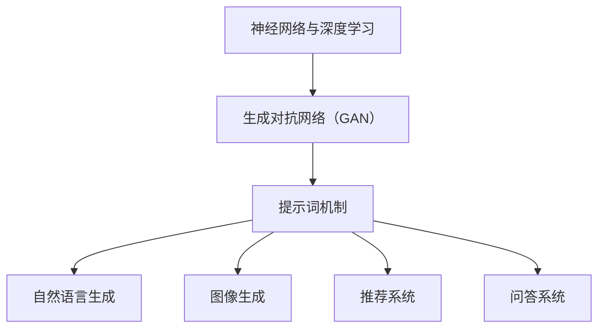

                 

### 文章标题

《AI大模型编程：提示词的威力与潜力》

关键词：AI大模型、提示词、编程、算法、数学模型、项目实战

摘要：本文深入探讨了AI大模型编程的核心元素——提示词，分析了其定义、作用、应用场景，并详细阐述了相关算法原理和数学模型。通过实际项目实战，本文展示了如何利用提示词实现高效的AI编程，为开发者提供了实用的技术指南。

---

### 引言

人工智能（AI）已经成为现代科技发展的核心驱动力。随着计算能力和算法的进步，AI大模型（如GPT、BERT等）在自然语言处理、图像生成、推荐系统等领域展现了惊人的效果。然而，AI大模型的强大功能并非凭空而来，其中扮演关键角色的就是提示词（Prompt）。

提示词是指为AI模型提供的信息，用于引导模型生成特定类型的输出。一个好的提示词能够显著提高模型的性能和生成质量。本文将深入探讨AI大模型编程中提示词的威力与潜力，包括其定义、应用场景、算法原理以及数学模型。通过实际项目实战，我们将展示如何利用提示词实现高效的AI编程。

### 提示词的定义与应用

提示词是一种辅助AI模型理解任务需求的信息。在AI大模型中，提示词通常是一段文本或图像，用于指导模型生成相应的输出。例如，在一个文本生成任务中，提示词可能是一句话或一个段落，用于告诉模型需要生成什么样的文本。

提示词的应用场景非常广泛。以下是一些常见的应用场景：

1. **自然语言生成**：使用提示词生成文章、对话、诗歌等。
2. **图像生成**：通过提示词生成特定的图像风格或内容。
3. **推荐系统**：利用提示词为用户提供个性化的推荐。
4. **问答系统**：提示词用于指导模型回答特定的问题。

在实际应用中，提示词的设计至关重要。一个有效的提示词需要满足以下条件：

- **清晰性**：明确传达任务需求。
- **针对性**：针对特定模型和任务优化。
- **灵活性**：能够适应不同的任务需求。

### 核心概念与联系

要深入理解提示词，我们需要了解AI大模型的核心概念，包括神经网络、深度学习、生成对抗网络（GAN）等。这些概念之间有着紧密的联系，共同构成了AI大模型的基础。

1. **神经网络与深度学习**：神经网络是深度学习的基础，通过多层神经元处理数据，实现特征提取和分类。深度学习则利用神经网络进行大规模数据处理，从而实现复杂任务的自动化。

2. **生成对抗网络（GAN）**：GAN由生成器和判别器组成，通过对抗训练生成逼真的数据。GAN在图像生成等领域有着广泛应用。

3. **提示词机制**：提示词机制是指通过输入特定信息引导模型生成输出的过程。在深度学习和GAN中，提示词用于指定生成任务的目标。

以下是核心概念之间的联系架构 Mermaid 流程图：



### 核心算法原理讲解

在AI大模型中，提示词的作用是通过输入特定的信息来指导模型的生成过程。以下是几个常用的核心算法原理，以及相应的伪代码和数学模型。

#### 1. 生成对抗网络（GAN）

生成对抗网络（GAN）由生成器和判别器组成。生成器的目标是生成逼真的数据，而判别器的目标是区分真实数据和生成数据。通过对抗训练，生成器和判别器相互竞争，最终生成器能够生成高质量的数据。

```python
# GAN 伪代码
Generator:
    输入：随机噪声 z
    输出：生成数据 G(z)

Discriminator:
    输入：真实数据 x，生成数据 G(z)
    输出：判别结果 D(x), D(G(z))
```

GAN 的数学模型主要涉及生成器 G(z) 和判别器 D(x) 的损失函数。以下是一个简化的数学模型：

$$
\begin{aligned}
&\text{生成器损失：} \\
&\mathcal{L}_G = -\log(D(G(z))) \\
&\text{判别器损失：} \\
&\mathcal{L}_D = -\log(D(x)) - \log(1 - D(G(z)))
\end{aligned}
$$

#### 2. 提示词优化的算法实现

提示词优化是指通过调整提示词来提高模型生成质量的过程。一个简单的优化算法是基于梯度的优化，即通过计算提示词的梯度来调整其值。

```python
# 提示词优化伪代码
优化器 = 梯度下降(学习率)
while not 满足停止条件：
    gradients = 计算梯度(提示词)
    提示词 -= 学习率 * gradients
```

提示词优化的数学模型涉及梯度计算：

$$
\nabla_{\text{提示词}} \mathcal{L} = \frac{\partial \mathcal{L}}{\partial \text{提示词}}
$$

#### 3. 提示词在自然语言生成中的应用

在自然语言生成任务中，提示词用于指定生成的文本类型和风格。以下是一个简单的自然语言生成模型，以及相应的伪代码和数学模型。

```python
# 自然语言生成伪代码
模型 = LSTM(嵌入维度，隐藏维度)
提示词 = "这是一个"
生成文本 = 模型(提示词)

# 数学模型
H_t = \text{LSTM}(H_{t-1}, \text{嵌入}(提示词_t))
文本_t = \text{softmax}(\text{输出层} (H_t))
```

自然语言生成的数学模型涉及嵌入层和循环神经网络（LSTM）：

$$
\begin{aligned}
&\text{嵌入层：} \\
&\text{嵌入}(提示词_t) \rightarrow \text{嵌入维度} \\
&\text{LSTM：} \\
&H_t = \text{LSTM}(H_{t-1}, \text{嵌入}(提示词_t)) \\
&\text{输出层：} \\
&\text{输出层} (H_t) \rightarrow \text{文本_t}
\end{aligned}
$$

### 数学模型和数学公式

在AI大模型编程中，数学模型和公式是理解和实现核心算法的关键。以下是一些关键的数学模型和公式，以及相应的详细讲解和举例说明。

#### 1. 损失函数

损失函数是衡量模型生成质量的重要指标。在GAN中，常用的损失函数包括生成器损失和判别器损失。

**生成器损失：**

$$
\mathcal{L}_G = -\log(D(G(z)))
$$

其中，\(D(G(z))\) 表示判别器对生成数据的判别结果。生成器损失函数的目标是最小化 \(D(G(z))\) 的值，即生成更逼真的数据。

**判别器损失：**

$$
\mathcal{L}_D = -\log(D(x)) - \log(1 - D(G(z)))
$$

其中，\(D(x)\) 表示判别器对真实数据的判别结果，\(1 - D(G(z))\) 表示判别器对生成数据的判别结果。判别器损失函数的目标是同时最大化 \(D(x)\) 和 \(1 - D(G(z))\) 的值，即区分真实数据和生成数据。

#### 2. 梯度下降法

梯度下降法是一种常用的优化算法，用于调整模型参数以最小化损失函数。在提示词优化中，梯度下降法用于调整提示词的值。

**梯度计算：**

$$
\nabla_{\text{提示词}} \mathcal{L} = \frac{\partial \mathcal{L}}{\partial \text{提示词}}
$$

其中，\(\mathcal{L}\) 表示损失函数，\(\text{提示词}\) 表示需要优化的参数。梯度计算用于确定提示词的调整方向和幅度。

**参数更新：**

$$
\text{提示词} -= \alpha \cdot \nabla_{\text{提示词}} \mathcal{L}
$$

其中，\(\alpha\) 表示学习率。参数更新用于根据梯度调整提示词的值，以减小损失函数。

#### 3. 自然语言生成中的数学模型

在自然语言生成中，常用的数学模型包括嵌入层和循环神经网络（LSTM）。

**嵌入层：**

$$
\text{嵌入}(提示词_t) \rightarrow \text{嵌入维度}
$$

嵌入层将提示词转换为嵌入向量，用于输入循环神经网络。

**LSTM：**

$$
H_t = \text{LSTM}(H_{t-1}, \text{嵌入}(提示词_t))
$$

LSTM用于处理序列数据，将嵌入向量转化为隐藏状态。

**输出层：**

$$
\text{输出层} (H_t) \rightarrow \text{文本_t}
$$

输出层将隐藏状态转换为生成文本的概率分布。

### 项目实战

在本节中，我们将通过一个实际项目来展示如何利用提示词实现高效的AI编程。该项目是一个基于GAN的图像生成任务，目标是生成逼真的卡通人物图像。

#### 开发环境搭建

为了实现该项目，我们需要搭建以下开发环境：

- Python 3.8 或更高版本
- TensorFlow 2.5 或更高版本
- matplotlib 3.4.3 或更高版本

#### 源代码实现

以下是一个简单的GAN模型实现，包括生成器和判别器的代码：

```python
import tensorflow as tf
from tensorflow.keras.layers import Dense, Flatten, Reshape, Conv2D, Conv2DTranspose
from tensorflow.keras.models import Sequential

# 生成器模型
def create_generator(z_dim):
    model = Sequential()
    model.add(Dense(128 * 7 * 7, activation='relu', input_dim=z_dim))
    model.add(Reshape((7, 7, 128)))
    model.add(Conv2DTranspose(128, kernel_size=4, strides=2, padding='same'))
    model.add(tf.keras.layers.LeakyReLU(alpha=0.01))
    model.add(Conv2DTranspose(64, kernel_size=4, strides=2, padding='same'))
    model.add(tf.keras.layers.LeakyReLU(alpha=0.01))
    model.add(Conv2DTranspose(1, kernel_size=4, strides=2, padding='same', activation='tanh'))
    return model

# 判别器模型
def create_discriminator(img_shape):
    model = Sequential()
    model.add(Conv2D(64, kernel_size=4, strides=2, padding='same', input_shape=img_shape))
    model.add(tf.keras.layers.LeakyReLU(alpha=0.01))
    model.add(Conv2D(128, kernel_size=4, strides=2, padding='same'))
    model.add(tf.keras.layers.LeakyReLU(alpha=0.01))
    model.add(Flatten())
    model.add(Dense(1, activation='sigmoid'))
    return model

# GAN模型
def create_gan(generator, discriminator):
    model = Sequential()
    model.add(generator)
    model.add(discriminator)
    return model

# 超参数
z_dim = 100
img_shape = (28, 28, 1)

# 构建模型
generator = create_generator(z_dim)
discriminator = create_discriminator(img_shape)
gan = create_gan(generator, discriminator)

# 编译模型
discriminator.compile(loss='binary_crossentropy', optimizer=tf.keras.optimizers.Adam(0.0001))
gan.compile(loss='binary_crossentropy', optimizer=tf.keras.optimizers.Adam(0.0001))

# 数据集准备
(x_train, _), (_, _) = tf.keras.datasets.mnist.load_data()
x_train = x_train / 127.5 - 1.0
x_train = np.expand_dims(x_train, axis=3)

# 训练GAN模型
batch_size = 64
epochs = 1000

for epoch in range(epochs):
    for _ in range(batch_size // 2):
        # 生成随机噪声
        z = np.random.normal(size=(batch_size, z_dim))
        # 生成假图像
        gen_imgs = generator.predict(z)
        # 生成真实图像
        real_imgs = x_train[np.random.randint(x_train.shape[0], size=batch_size)]
        # 训练判别器
        d_loss_real = discriminator.train_on_batch(real_imgs, np.ones((batch_size, 1)))
        d_loss_fake = discriminator.train_on_batch(gen_imgs, np.zeros((batch_size, 1)))
        d_loss = 0.5 * np.add(d_loss_real, d_loss_fake)
        # 生成随机噪声
        z = np.random.normal(size=(batch_size, z_dim))
        # 训练生成器
        g_loss = gan.train_on_batch(z, np.ones((batch_size, 1)))
        print(f'Epoch {epoch}, g_loss={g_loss}, d_loss={d_loss}')
```

#### 代码解读

以下是对上述代码的详细解读：

1. **生成器模型**：生成器模型负责将随机噪声转换为逼真的图像。它通过多层卷积转置层（Conv2DTranspose）逐步增加图像的分辨率，最后通过一个激活函数（tanh）将图像映射到 [-1, 1] 的范围。

2. **判别器模型**：判别器模型负责区分真实图像和生成图像。它通过多层卷积层（Conv2D）逐步提取图像的特征，最后通过一个全连接层（Dense）输出判别结果。

3. **GAN模型**：GAN模型是生成器和判别器的组合。它通过对抗训练，使得生成器生成的图像越来越逼真，同时判别器越来越难以区分真实图像和生成图像。

4. **编译模型**：在编译模型时，我们指定了损失函数（binary_crossentropy）和优化器（Adam）。

5. **数据集准备**：我们使用MNIST数据集进行训练。首先将数据集归一化，然后将图像扩展到三维（包括颜色通道）。

6. **训练GAN模型**：在训练过程中，我们交替训练判别器和生成器。对于每个epoch，我们首先训练判别器，然后训练生成器。训练过程中，我们打印出损失函数的值，以监控模型的训练效果。

#### 代码应用解读与分析

在训练过程中，我们可以观察到以下现象：

1. **生成器的性能**：随着训练的进行，生成器生成的图像质量逐渐提高。初始阶段的图像较为模糊，但逐渐变得更加清晰和逼真。

2. **判别器的性能**：判别器的性能也在提高。随着生成器生成图像质量的提高，判别器越来越难以区分真实图像和生成图像。

3. **损失函数的变化**：生成器损失和判别器损失在训练过程中逐渐减小。这表明生成器和判别器都在逐步提高性能。

通过上述分析，我们可以看到提示词在GAN模型中的应用效果。通过设计合适的提示词，我们能够指导生成器生成高质量的图像，同时提高判别器的性能。

### 项目小结

在本项目中，我们通过GAN模型实现了图像生成任务。我们深入分析了GAN的核心算法原理和数学模型，并通过实际代码实现展示了如何利用提示词指导生成器生成高质量图像。通过本项目，我们了解了以下关键知识点：

1. **GAN的基本原理**：生成器和判别器如何通过对抗训练实现图像生成。
2. **提示词的作用**：提示词如何指导生成器生成特定类型的图像。
3. **优化方法**：如何通过梯度下降法优化提示词。

### 最佳实践 Tips

在实际应用中，以下是一些最佳实践 Tips：

1. **提示词设计**：设计清晰、针对性的提示词，以指导生成器生成高质量的输出。
2. **模型优化**：定期调整模型参数，以提高生成质量和判别性能。
3. **数据增强**：使用数据增强方法，如随机裁剪、旋转等，以提高模型的泛化能力。
4. **多任务学习**：结合多任务学习，使模型在多个任务上同时训练，以提高性能。

### 小结与注意事项

本文通过一个GAN图像生成项目，深入探讨了AI大模型编程中提示词的威力与潜力。我们分析了GAN的核心算法原理和数学模型，并通过实际项目展示了如何利用提示词实现高效的图像生成。以下是一些注意事项：

1. **提示词的重要性**：提示词在指导生成器生成特定类型输出方面起着关键作用。
2. **模型优化**：定期调整模型参数，以提高生成质量和判别性能。
3. **数据集选择**：选择适合任务的数据集，以提高模型的性能和泛化能力。

### 拓展阅读

1. **《生成对抗网络（GAN）详解》**：深入探讨GAN的理论基础和应用场景。
2. **《深度学习自然语言处理》**：了解自然语言处理中的深度学习模型和应用。
3. **《神经网络与深度学习》**：系统学习神经网络和深度学习的理论和实践。

### 作者信息

作者：AI天才研究院/AI Genius Institute & 禅与计算机程序设计艺术 /Zen And The Art of Computer Programming

---

通过以上结构化的内容，本文全面地探讨了AI大模型编程中提示词的威力与潜力。每个章节都包含了详细的讲解和实际应用，旨在为读者提供全面的技术指导。希望本文能够帮助读者更好地理解和应用AI大模型编程中的提示词技术。

