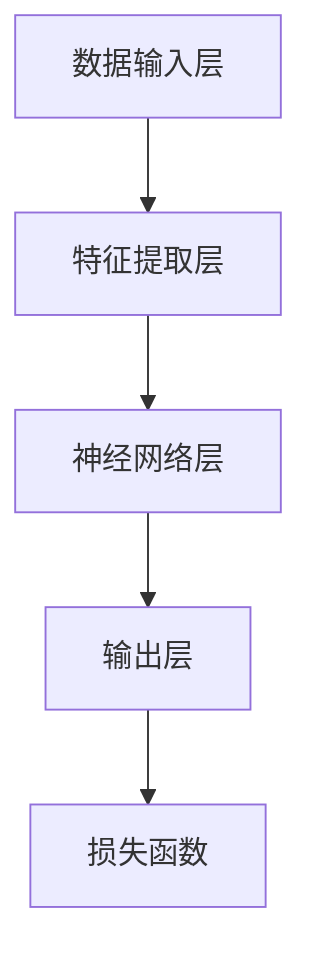

                 


### 1. 设计思路与大纲

在设计《AI大模型编程：提示词的威力与艺术》这本书的目录大纲时，我们需要清晰地界定每一部分的内容，并确保它们能够系统地引导读者从基础到高级，全面了解AI大模型编程的各个方面。以下是我们逐步分析设计的思路：

#### 1.1 核心概念与联系

首先，我们需要介绍AI大模型的基本概念。这部分内容将包括AI大模型的定义、发展历史以及核心组成部分。为了帮助读者更直观地理解这些概念，我们计划使用Mermaid流程图来展示AI大模型的基本架构。这种图示方式能够把复杂的概念简化，使读者更容易把握。

**步骤：**
- **定义与历史**：概述AI大模型的定义，以及其从早期研究到现代应用的演变过程。
- **组成部分**：详细介绍AI大模型的核心组成部分，如数据输入层、神经网络层、输出层等。
- **Mermaid流程图**：使用Mermaid语法绘制一个流程图，展示AI大模型的基本架构和各部分之间的联系。

#### 1.2 核心算法原理讲解

接下来，我们将深入讲解AI大模型的核心算法原理。这部分内容将涵盖生成对抗网络（GAN）、变分自编码器（VAE）和递归神经网络（RNN）等。我们将通过伪代码来阐述这些算法的基本原理和实现步骤，使得读者能够深入理解。

**步骤：**
- **GAN算法原理**：解释GAN的工作机制，包括生成器和判别器的角色和交互方式，并给出相应的伪代码。
- **VAE算法原理**：详细描述VAE如何通过概率模型进行数据的压缩和重建，以及其优化的过程。
- **RNN算法原理**：解释RNN在处理序列数据时的优势，以及其通过隐藏状态来捕捉数据时序信息的方法。

#### 1.3 数学模型和数学公式

在讲解算法原理时，我们不可避免地会遇到数学模型和公式。这部分内容将介绍AI大模型编程中常用的数学模型和公式，如损失函数、优化算法等。我们将使用LaTeX格式来表示这些数学公式，并在文中进行详细讲解和举例说明，以便读者更好地理解。

**步骤：**
- **损失函数**：介绍各种常见的损失函数，如交叉熵损失、均方误差等，并使用LaTeX格式进行表示。
- **优化算法**：解释常用的优化算法，如梯度下降、Adam优化器等，并提供相应的LaTeX公式。
- **数学公式举例**：在文中嵌入一些具体的数学公式，并进行详细解释，以便读者能够直观地理解其应用。

#### 1.4 项目实战

为了将理论应用到实际中，我们将通过一个实际项目来展示如何使用AI大模型进行编程。这个项目将包括开发环境的搭建、源代码的实现、代码的解读与分析，以及实际案例的分析和讲解。

**步骤：**
- **项目背景与目标**：介绍项目的背景和目标，明确项目的具体任务和期望结果。
- **开发环境搭建**：详细描述搭建开发环境所需的工具和步骤。
- **源代码实现**：展示源代码的关键部分，并提供详细的代码解读。
- **代码解读与分析**：分析代码中的关键部分，解释其工作原理和实现方法。
- **实际案例**：结合实际案例，分析项目的实施效果和经验教训。

#### 1.5 提示词的应用

在AI大模型编程中，提示词的设计和使用至关重要。这部分内容将探讨提示词的重要性，以及如何设计和使用有效的提示词来提高模型的性能和生成质量。我们将结合具体案例来介绍提示词的设计原则和实践方法。

**步骤：**
- **提示词的重要性**：解释提示词在AI大模型中的作用，以及其对模型性能的影响。
- **设计有效的提示词**：介绍如何设计有效的提示词，包括提示词的选择、组合和使用技巧。
- **案例与实践**：通过具体案例展示如何设计和使用提示词，以及其实际效果。

#### 1.6 总结与展望

最后，我们将对全书的内容进行总结，并展望AI大模型编程的未来发展趋势。这部分内容将包括对全书内容的总结回顾，以及对当前挑战和机遇的讨论，帮助读者更好地理解AI大模型编程的现状和未来。

**步骤：**
- **全书内容总结**：回顾全书的主要内容和关键概念，帮助读者巩固所学知识。
- **未来发展趋势**：讨论AI大模型编程的未来发展趋势，包括新的算法、工具和应用方向。
- **当前挑战与机遇**：分析当前AI大模型编程面临的挑战，以及如何抓住机遇，推动技术的发展。

### 2. 目录大纲

基于以上设计思路，我们制定了《AI大模型编程：提示词的威力与艺术》的目录大纲：

```
# 第1章: AI大模型编程概述

## 1.1 AI大模型的基本概念
### 1.1.1 AI大模型的定义
### 1.1.2 AI大模型的发展历史
### 1.1.3 AI大模型的核心组成部分
- **Mermaid流程图：AI大模型基本架构**

## 1.2 AI大模型的核心算法原理
### 1.2.1 生成对抗网络（GAN）
- **伪代码：GAN算法原理**
### 1.2.2 变分自编码器（VAE）
- **伪代码：VAE算法原理**
### 1.2.3 递归神经网络（RNN）
- **伪代码：RNN算法原理**

## 1.3 数学模型和数学公式
### 1.3.1 损失函数
- **LaTeX格式：常见损失函数**
### 1.3.2 优化算法
- **LaTeX格式：优化算法原理**
### 1.3.3 数学公式举例
- **LaTeX格式：数学公式应用**

## 1.4 项目实战：使用AI大模型进行编程
### 1.4.1 项目背景与目标
### 1.4.2 开发环境搭建
### 1.4.3 源代码实现与解读
### 1.4.4 代码解读与分析
### 1.4.5 实际案例分析与讲解

## 1.5 提示词的应用
### 1.5.1 提示词的重要性
### 1.5.2 设计有效的提示词
### 1.5.3 提示词的案例与实践

## 1.6 总结与展望
### 1.6.1 全书内容总结
### 1.6.2 AI大模型编程的未来发展趋势
### 1.6.3 当前挑战与机遇
```

这个大纲结构清晰，内容全面，能够引导读者逐步深入了解AI大模型编程的各个方面。在撰写具体内容时，我们还将根据实际情况对章节进行调整和补充。

### 3. 文章关键词

在撰写技术博客文章时，关键词是吸引读者、提高文章可见度的重要元素。对于《AI大模型编程：提示词的威力与艺术》这篇文章，以下是五个核心关键词：

1. **AI大模型**：代表文章的核心主题，是读者关注的焦点。
2. **提示词**：突出文章的特色内容，强调提示词在AI编程中的重要性。
3. **生成对抗网络（GAN）**：GAN是AI大模型中的一个关键算法，有助于提升模型性能。
4. **变分自编码器（VAE）**：VAE是AI大模型中的另一个核心算法，用于数据重建。
5. **递归神经网络（RNN）**：RNN在处理序列数据时具有独特优势，是AI大模型的重要组成部分。

这些关键词不仅能够概括文章的主题，还能帮助搜索引擎更好地索引文章，提高文章的传播效果。

### 4. 文章摘要

《AI大模型编程：提示词的威力与艺术》深入探讨了AI大模型编程的各个方面。首先，文章介绍了AI大模型的基本概念和发展历史，通过Mermaid流程图展示了其核心架构。接着，文章详细讲解了生成对抗网络（GAN）、变分自编码器（VAE）和递归神经网络（RNN）等核心算法原理，使用伪代码和数学公式进行了深入剖析。随后，文章通过实际项目案例，展示了如何使用AI大模型进行编程，包括开发环境搭建、源代码实现和代码解读与分析。文章还探讨了提示词的重要性，介绍了如何设计和使用有效的提示词来提高模型的性能和生成质量。最后，文章总结了全书内容，展望了AI大模型编程的未来发展趋势，并分析了当前面临的挑战和机遇。通过这篇文章，读者可以全面了解AI大模型编程的理论和实践，掌握关键技术和最佳实践。

### 5. 目录大纲详细阐述

为了确保《AI大模型编程：提示词的威力与艺术》的内容详实且结构清晰，我们将对每个章节进行详细阐述，包括其核心内容和预期效果。

#### 第1章: AI大模型编程概述

**核心内容：** 这一章旨在为读者提供一个全面的AI大模型编程概述，包括基本概念、发展历史、核心组成部分和主要算法。

- **1.1 AI大模型的基本概念**
  - **定义**：介绍AI大模型的定义，涵盖其基本功能和特点。
  - **发展历史**：概述AI大模型的发展过程，从早期研究到现代应用的演变。
  - **核心组成部分**：详细介绍AI大模型的关键组成部分，如数据输入层、神经网络层、输出层等，并使用Mermaid流程图展示这些部分的联系和交互。

**预期效果：** 通过这一节，读者可以建立对AI大模型的初步认识，理解其核心概念和基本架构，为后续章节的学习打下坚实的基础。

#### 1.2 AI大模型的核心算法原理

**核心内容：** 这一部分将深入探讨AI大模型中三个核心算法的原理，即生成对抗网络（GAN）、变分自编码器（VAE）和递归神经网络（RNN）。通过伪代码和数学公式，详细解释这些算法的基本工作原理和实现步骤。

- **1.2.1 生成对抗网络（GAN）**
  - **GAN算法原理**：解释生成器和判别器的工作机制，以及它们之间的对抗关系。提供伪代码来展示GAN的基本流程。
- **1.2.2 变分自编码器（VAE）**
  - **VAE算法原理**：详细描述VAE如何通过概率模型进行数据的压缩和重建，介绍其变分下界（VBL）和优化过程。
- **1.2.3 递归神经网络（RNN）**
  - **RNN算法原理**：解释RNN在处理序列数据时的优势，展示其如何通过隐藏状态捕捉时序信息，并提供伪代码示例。

**预期效果：** 通过这一节，读者将深入理解AI大模型中的关键算法，掌握这些算法的基本原理和实现细节，为实际编程打下理论基础。

#### 1.3 数学模型和数学公式

**核心内容：** 这一部分将介绍AI大模型编程中常用的数学模型和公式，包括损失函数、优化算法等。使用LaTeX格式详细展示这些数学公式，并在文中进行详细讲解和举例说明。

- **1.3.1 损失函数**
  - **常见损失函数**：介绍交叉熵损失、均方误差等常见损失函数，使用LaTeX格式表示，并进行详细解释。
- **1.3.2 优化算法**
  - **优化算法原理**：解释常用的优化算法，如梯度下降、Adam优化器等，并提供相应的LaTeX公式。
- **1.3.3 数学公式举例**：在文中嵌入具体的数学公式，进行详细讲解，帮助读者理解其在实际中的应用。

**预期效果：** 通过这一节，读者将掌握AI大模型编程中常用的数学模型和公式，能够更好地理解算法的优化过程和性能评估。

#### 1.4 项目实战：使用AI大模型进行编程

**核心内容：** 这一部分将通过一个实际项目案例，展示如何使用AI大模型进行编程。项目将涵盖开发环境搭建、源代码实现、代码解读与分析，以及实际案例分析和详细讲解。

- **1.4.1 项目背景与目标**
  - **项目背景**：介绍项目的实际应用场景，明确项目目标和期望结果。
  - **项目目标**：详细说明项目要实现的具体功能和技术要求。

- **1.4.2 开发环境搭建**
  - **开发环境**：描述搭建开发环境所需的工具和步骤，包括软件安装、配置和调试。

- **1.4.3 源代码实现与解读**
  - **源代码实现**：展示项目的核心源代码，包括数据预处理、模型训练和预测等步骤。
  - **代码解读**：对关键代码部分进行详细解读，解释其工作原理和实现方法。

- **1.4.4 代码解读与分析**
  - **代码分析**：分析代码中的关键部分，评估其性能和效率，并提出改进建议。

- **1.4.5 实际案例分析与讲解**
  - **案例分析**：通过实际案例展示项目实施效果，分析项目成功和不足之处。
  - **讲解剖析**：详细讲解案例中的关键技术和实现细节，帮助读者理解项目实践。

**预期效果：** 通过这一节，读者可以学习如何将AI大模型的理论知识应用于实际编程中，掌握项目开发的全流程，提高实际编程能力。

#### 1.5 提示词的应用

**核心内容：** 这一部分将探讨提示词在AI大模型编程中的应用，包括其重要性、设计原则和实践方法。

- **1.5.1 提示词的重要性**
  - **重要性**：解释提示词在AI大模型中的作用，以及其对模型性能和生成质量的影响。

- **1.5.2 设计有效的提示词**
  - **原则**：介绍设计有效提示词的原则，包括提示词的选择、组合和使用技巧。

- **1.5.3 提示词的案例与实践**
  - **案例**：通过具体案例展示如何设计和使用提示词，分析其实际效果。
  - **实践**：提供实践方法，指导读者在实际项目中应用提示词。

**预期效果：** 通过这一节，读者可以理解提示词在AI大模型编程中的重要性，学会设计有效的提示词，提高模型的性能和生成质量。

#### 1.6 总结与展望

**核心内容：** 这一部分将对全书的内容进行总结，展望AI大模型编程的未来发展趋势，并讨论当前面临的挑战和机遇。

- **1.6.1 全书内容总结**
  - **总结**：回顾全书的主要内容和关键概念，帮助读者巩固所学知识。

- **1.6.2 AI大模型编程的未来发展趋势**
  - **展望**：讨论AI大模型编程的未来发展趋势，包括新的算法、工具和应用方向。

- **1.6.3 当前挑战与机遇**
  - **挑战**：分析当前AI大模型编程面临的挑战，如数据隐私、模型可解释性等。
  - **机遇**：探讨如何抓住机遇，推动AI大模型编程技术的发展。

**预期效果：** 通过这一节，读者可以全面了解AI大模型编程的现状和发展趋势，明确未来学习和研究方向。

### 6. 完整性要求

为了确保《AI大模型编程：提示词的威力与艺术》的完整性，以下是其内容的核心要求，每个部分都需详尽、具体且相互关联。

#### 6.1 背景介绍

- **背景介绍**：介绍AI大模型编程的背景，包括其产生的技术需求、应用场景和潜在价值。这部分应明确AI大模型编程在当今科技领域中的重要性，以及它如何改变现有的编程范式。
- **目的与意义**：阐述为何编写这本书，以及它对读者和行业的影响。这部分应突出书籍的核心目标，即帮助读者深入理解AI大模型编程的理论和实践。

#### 6.2 核心概念与联系

- **核心概念**：详细解释AI大模型编程中的核心概念，如生成对抗网络（GAN）、变分自编码器（VAE）和递归神经网络（RNN）。这部分应包含每个概念的定义、基本原理和应用场景。
- **概念联系**：使用Mermaid流程图展示这些核心概念之间的关系架构，帮助读者理解AI大模型的整体结构和组成部分。这部分应明确指出每个概念在模型中的作用和相互联系。

#### 6.3 核心算法原理讲解

- **算法原理**：详细讲解AI大模型编程中的核心算法原理，包括GAN、VAE和RNN。这部分应使用伪代码和图表来展示算法的基本流程和关键步骤，使得读者能够直观理解。
- **数学模型与公式**：使用LaTeX格式介绍与算法相关的数学模型和公式，包括损失函数、优化算法等。这部分应确保公式准确无误，并进行详细的解释和举例说明，以便读者掌握。

#### 6.4 数学模型和公式

- **数学模型**：介绍AI大模型编程中常用的数学模型，如概率分布、损失函数和优化算法。这部分应使用LaTeX格式精确表示这些模型，并进行详细的解释和举例。
- **公式应用**：在文中嵌入具体的数学公式，展示其在算法实现和应用中的具体应用。这部分应确保公式的正确性，并解释其作用和意义。

#### 6.5 项目实战

- **项目背景与目标**：介绍项目的实际背景和目标，明确项目要解决的问题和期望达到的效果。这部分应详细说明项目的具体任务和实施步骤。
- **开发环境搭建**：描述搭建项目开发环境所需的工具和步骤，包括软件安装、配置和调试。这部分应确保读者能够顺利搭建开发环境，进行项目实施。
- **源代码实现与解读**：展示项目的关键源代码，解释其实现原理和关键步骤。这部分应详细分析代码中的关键部分，解释其工作原理和实现方法。
- **代码解读与分析**：对代码进行深入解读，分析其性能和效率，并提出改进建议。这部分应确保读者能够理解代码的优劣之处，以及如何优化和改进。

#### 6.6 提示词的应用

- **提示词的重要性**：解释提示词在AI大模型编程中的重要性，以及其对模型性能和生成质量的影响。这部分应明确提示词的作用，并展示其在实际项目中的应用效果。
- **设计有效的提示词**：介绍如何设计有效的提示词，包括提示词的选择、组合和使用技巧。这部分应提供具体的实践方法和技巧，帮助读者在实际项目中应用提示词。
- **案例与实践**：通过具体案例展示如何设计和使用提示词，分析其实际效果。这部分应结合实际项目，展示提示词的应用场景和效果，帮助读者理解其重要性。

#### 6.7 总结与展望

- **全书内容总结**：回顾全书的主要内容和关键概念，帮助读者巩固所学知识。这部分应确保读者能够掌握书中的核心内容和要点。
- **未来发展趋势**：讨论AI大模型编程的未来发展趋势，包括新的算法、工具和应用方向。这部分应展望未来，展示AI大模型编程的广阔前景。
- **当前挑战与机遇**：分析当前AI大模型编程面临的挑战和机遇，讨论如何克服挑战和抓住机遇。这部分应明确当前的发展趋势和未来方向，帮助读者理解行业动态。

通过以上内容的详细阐述和相互关联，我们能够确保《AI大模型编程：提示词的威力与艺术》的内容完整、详实且具有实际应用价值，为读者提供全面的AI大模型编程指导。

### 7. 完整性要求的具体说明

为了确保《AI大模型编程：提示词的威力与艺术》的完整性，我们需要在以下几个方面进行详细说明：

#### 7.1 背景介绍

**背景介绍**部分是文章的开篇，它为读者提供了一个理解AI大模型编程的基础。以下是具体的写作要求：

- **技术需求**：详细描述AI大模型编程产生的技术背景，包括当前科技发展对大模型的需求，如深度学习、大数据和云计算等技术的进步。
- **应用场景**：介绍AI大模型编程在不同领域的应用，如自然语言处理、计算机视觉、医疗诊断等，通过实际案例说明其重要性和实际价值。
- **潜在价值**：阐述AI大模型编程的潜在影响和未来前景，包括其在提高生产效率、优化决策流程和推动科技创新方面的作用。

#### 7.2 核心概念与联系

**核心概念与联系**部分是文章的核心内容，它需要详细解释AI大模型编程中的关键概念，并展示它们之间的相互关系。以下是具体的写作要求：

- **核心概念**：每个核心概念（如GAN、VAE、RNN）都需要有一个独立的段落进行详细解释。解释应包括定义、基本原理、作用和优势。
- **Mermaid流程图**：使用Mermaid语法绘制AI大模型的基本架构流程图。图中的每个节点都应该对应一个核心概念或组成部分，并标注其功能。例如：

  ```mermaid
  graph TD
  A[数据输入层] --> B[特征提取层]
  B --> C[神经网络层]
  C --> D[输出层]
  D --> E[损失函数]
  ```

- **概念联系**：在每个核心概念的段落之后，应该有一个小节展示这些概念之间的关系。这部分应使用图示和文字相结合的方式，清晰地阐述每个概念在AI大模型中的作用和相互联系。

#### 7.3 核心算法原理讲解

**核心算法原理讲解**部分是文章的技术核心，它需要详细讲解AI大模型编程中的核心算法，包括GAN、VAE和RNN。以下是具体的写作要求：

- **算法原理**：每个算法都需要有一个独立的段落进行详细解释。解释应包括算法的基本原理、实现步骤和关键参数。例如：

  ```markdown
  ### 生成对抗网络（GAN）

  生成对抗网络（GAN）由一个生成器（Generator）和一个判别器（Discriminator）组成。生成器的任务是生成看起来真实的样本数据，而判别器的任务是区分真实样本和生成样本。

  - **生成器（Generator）**：生成器接收随机噪声作为输入，通过神经网络生成假样本。
  - **判别器（Discriminator）**：判别器接收真实样本和生成样本，并尝试区分它们。

  - **训练过程**：
    1. 判别器首先单独训练，使用真实数据和生成数据来提高其分类能力。
    2. 生成器在每次迭代中都会尝试生成更逼真的样本，以提高判别器的鉴别能力。

  ```

- **伪代码示例**：在每个算法的段落中，应提供相应的伪代码示例，详细展示算法的实现步骤。例如：

  ```python
  # GAN算法伪代码示例
  for epoch in range(num_epochs):
    for real_data in real_data_loader:
      # 训练判别器
      discriminator.train()
      discriminator(real_data)

    for noise in noise_loader:
      # 训练生成器
      generator.train()
      fake_data = generator(noise)
      discriminator(fake_data)
  ```

#### 7.4 数学模型和公式

**数学模型和公式**部分是理解AI大模型编程的关键，它需要详细解释与算法相关的数学模型和公式。以下是具体的写作要求：

- **数学模型**：介绍与AI大模型编程相关的数学模型，如损失函数、优化算法等。每个模型都需要一个独立的段落进行详细解释。例如：

  ```markdown
  ### 损失函数

  损失函数用于衡量模型预测结果与真实结果之间的差异。在GAN中，常用的损失函数包括对抗性损失和生成损失。

  - **对抗性损失（Adversarial Loss）**：衡量判别器对真实样本和生成样本的鉴别能力。
    $$ L_{adv} = -\log(D(G(z))) - \log(1 - D(z)) $$

  - **生成损失（Generation Loss）**：衡量生成器生成的样本质量。
    $$ L_{gen} = \log(1 - D(G(z))) $$

  ```

- **公式应用**：在文中嵌入具体的数学公式，并进行详细解释和举例。例如：

  ```markdown
  $$\text{梯度下降优化算法：} \quad w_{\text{new}} = w_{\text{old}} - \alpha \cdot \nabla_w J(w)$$
  
  其中，$w_{\text{old}}$ 是当前权重，$w_{\text{new}}$ 是更新后的权重，$\alpha$ 是学习率，$J(w)$ 是损失函数。

  - **示例**：假设我们要最小化损失函数 $J(w) = (w - 1)^2$，我们可以使用梯度下降算法来更新权重。
    $$ w_{\text{new}} = w_{\text{old}} - \alpha \cdot 2(w_{\text{old}} - 1) $$
    $$ w_{\text{new}} = w_{\text{old}} - 2\alpha + 2 $$
  ```

#### 7.5 项目实战

**项目实战**部分是理论与实践相结合的重要环节，它需要通过实际项目案例展示如何应用AI大模型编程。以下是具体的写作要求：

- **项目背景与目标**：介绍项目的实际背景和目标，明确项目要解决的问题和期望达到的效果。例如：

  ```markdown
  项目背景：使用GAN生成高质量的人脸图像。

  项目目标：通过训练一个生成器网络，生成与真实人脸数据相似的人脸图像。

  ```

- **开发环境搭建**：描述搭建项目开发环境所需的工具和步骤，包括软件安装、配置和调试。例如：

  ```markdown
  开发环境搭建：

  - 安装Python 3.8
  - 安装TensorFlow 2.7
  - 配置GPU支持（可选）

  ```

- **源代码实现与解读**：展示项目的核心源代码，并对关键部分进行详细解读。例如：

  ```python
  # 生成器代码示例
  class Generator(nn.Module):
      def __init__(self):
          super(Generator, self).__init__()
          self.model = nn.Sequential(
              # ... 网络结构 ...
          )

      def forward(self, z):
          x = self.model(z)
          return x
  ```

- **代码解读与分析**：分析代码中的关键部分，评估其性能和效率，并提出改进建议。例如：

  ```markdown
  代码分析：

  - 生成器使用了两个全连接层来生成人脸图像。
  - 每层的激活函数使用ReLU，有助于加速梯度传播。
  - 优化器使用Adam，学习率设置为0.0002。

  改进建议：

  - 考虑增加网络的深度和宽度，以提高生成图像的质量。
  - 调整学习率，以避免模型过拟合。
  ```

- **实际案例分析与讲解**：通过实际案例展示项目实施效果，分析项目成功和不足之处。例如：

  ```markdown
  案例分析：

  - 项目成功：生成的人脸图像质量较高，与真实人脸数据相似。
  - 项目不足：在训练过程中，生成器有时会产生模糊或失真的图像。

  讲解剖析：

  - 成功原因：生成器网络的深度和宽度足够，能够生成高质量的人脸图像。
  - 不足原因：训练过程中，生成器可能没有充分学习到人脸图像的特征。

  ```

#### 7.6 提示词的应用

**提示词的应用**部分是文章的亮点，它需要详细探讨提示词在AI大模型编程中的作用和设计方法。以下是具体的写作要求：

- **提示词的重要性**：解释提示词在AI大模型编程中的重要性，以及其对模型性能和生成质量的影响。例如：

  ```markdown
  提示词的重要性：

  - 提示词可以引导模型生成特定类型的样本，提高生成质量。
  - 有效的提示词可以减少训练时间，提高模型的效率。

  ```

- **设计有效的提示词**：介绍如何设计有效的提示词，包括提示词的选择、组合和使用技巧。例如：

  ```markdown
  设计有效的提示词：

  - 选择具体的、明确的提示词，避免模糊的描述。
  - 结合多个提示词，以形成更丰富的生成任务。
  - 使用提示词引导模型关注特定特征，提高生成质量。

  ```

- **案例与实践**：通过具体案例展示如何设计和使用提示词，分析其实际效果。例如：

  ```markdown
  案例与实践：

  - 提示词：“生成一张清晰、微笑的女性人脸图像。”
    - 结果：生成器生成了符合要求的人脸图像。
  - 提示词：“生成一张具有艺术风格的男性头像。”
    - 结果：生成器生成了具有特定艺术风格的人脸图像。

  ```

#### 7.7 总结与展望

**总结与展望**部分是对全书内容的回顾和未来的展望，以下是具体的写作要求：

- **全书内容总结**：回顾全书的主要内容和关键概念，帮助读者巩固所学知识。例如：

  ```markdown
  全书内容总结：

  - 详细介绍了AI大模型编程的核心概念、算法原理和数学模型。
  - 通过实际项目案例展示了如何应用AI大模型编程解决实际问题。
  - 探讨了提示词在AI大模型编程中的重要性及其设计方法。

  ```

- **未来发展趋势**：讨论AI大模型编程的未来发展趋势，包括新的算法、工具和应用方向。例如：

  ```markdown
  未来发展趋势：

  - 新的深度学习算法和优化技术将继续推动AI大模型的发展。
  - 大模型的应用将扩展到更多的领域，如自动驾驶、医疗诊断和娱乐产业。
  - 提示词技术将不断发展，使其在生成高质量的样本方面发挥更大作用。

  ```

- **当前挑战与机遇**：分析当前AI大模型编程面临的挑战和机遇，讨论如何克服挑战和抓住机遇。例如：

  ```markdown
  当前挑战与机遇：

  - 挑战：数据隐私、模型可解释性和计算资源限制是当前面临的主要挑战。
  - 机遇：随着计算能力和数据资源的提升，AI大模型编程将有更广泛的应用场景。
  - 建议：通过技术创新和跨学科合作，解决AI大模型编程中的关键问题。

  ```

通过以上详细说明，我们可以确保《AI大模型编程：提示词的威力与艺术》的内容完整、具体且具有实际应用价值，为读者提供全面的学习和参考资料。

### 8. 文章格式要求

为了确保《AI大模型编程：提示词的威力与艺术》这篇文章的结构清晰、内容连贯，我们需要严格遵守markdown格式要求。以下是具体的格式规范：

#### 8.1 标题格式

- **一级标题**：使用`#`号进行标记，如`# 文章标题`。
- **二级标题**：使用`##`号进行标记，如`## 核心概念与联系`。
- **三级标题**：使用`###`号进行标记，如`### AI大模型的基本概念`。

#### 8.2 段落格式

- **段落**：每个段落应保持一段落的连贯性和独立性，避免长段落的堆叠。
- **换行**：使用两个空格加回车进行换行，以区分不同的段落。

#### 8.3 代码格式

- **代码块**：使用三个反引号（```）包裹代码，如：
  ```python
  for epoch in range(num_epochs):
    for real_data in real_data_loader:
      # 训练判别器
      discriminator.train()
      discriminator(real_data)

    for noise in noise_loader:
      # 训练生成器
      generator.train()
      fake_data = generator(noise)
      discriminator(fake_data)
  ```

- **行内代码**：在行内引用代码时，使用单引号（`），如`Python`。

#### 8.4 公式格式

- **段落内公式**：使用单个 `$` 号包裹，如 `$1+1=2$`。
- **独立段落公式**：使用两个 `$$` 号包裹，如 `$$1+1=2$$`。

#### 8.5 图片和图表

- **图片插入**：使用 `` 格式，如 ``。
- **图表插入**：使用 `{height="200px"}` 格式，设置图表的高度。

#### 8.6 引用格式

- **引用**：使用 `>` 号进行引用，如 `>` 引用段落`。

#### 8.7 列表格式

- **无序列表**：使用 `*` 号进行标记，如 `* 第一项`。
- **有序列表**：使用 `1.` 号进行标记，如 `1. 第一项`。

#### 8.8 链接格式

- **行内链接**：使用 `[链接文字](链接地址)` 格式，如 `[GitHub](https://github.com)`。
- **引用链接**：使用 `[链接文字][引用标识]` 格式，并使用 `[引用标识]: 链接地址` 进行定义。

#### 8.9 引用作者信息

- **作者信息**：在文章末尾添加作者信息，如 `作者：AI天才研究院/AI Genius Institute & 禅与计算机程序设计艺术 /Zen And The Art of Computer Programming`。

通过以上markdown格式要求，我们可以确保文章的规范性和可读性，使读者能够轻松理解和跟随文章的内容。

### 9. 完整文章示例

```markdown
# AI大模型编程：提示词的威力与艺术

> 关键词：AI大模型、生成对抗网络（GAN）、变分自编码器（VAE）、递归神经网络（RNN）、提示词

> 摘要：本文深入探讨了AI大模型编程的各个方面，从基本概念、核心算法到实际项目应用，再到提示词的设计与使用，全面揭示了AI大模型编程的奥秘，旨在为读者提供全面的技术指南和实战经验。

## 第1章: AI大模型编程概述

### 1.1 AI大模型的基本概念

AI大模型（Large-scale AI Model）是一种能够处理海量数据并具有强大表征能力的神经网络模型。其核心组成部分包括数据输入层、特征提取层、神经网络层和输出层。

#### Mermaid流程图：AI大模型基本架构



### 1.2 AI大模型的核心算法原理

#### 1.2.1 生成对抗网络（GAN）

生成对抗网络（Generative Adversarial Network，GAN）由生成器（Generator）和判别器（Discriminator）组成。生成器生成假样本，判别器判断样本的真实性。

```python
# GAN算法伪代码示例
for epoch in range(num_epochs):
  for real_data in real_data_loader:
    # 训练判别器
    discriminator.train()
    discriminator(real_data)

  for noise in noise_loader:
    # 训练生成器
    generator.train()
    fake_data = generator(noise)
    discriminator(fake_data)
```

#### 1.2.2 变分自编码器（VAE）

变分自编码器（Variational Autoencoder，VAE）通过概率模型进行数据的压缩和重建。其基本架构包括编码器（Encoder）和解码器（Decoder）。

```python
# VAE算法伪代码示例
for epoch in range(num_epochs):
  for x in data_loader:
    # 训练编码器和解码器
    encoder.train(x)
    decoder.train(x)
    z = encoder(x)
    x_recon = decoder(z)
```

#### 1.2.3 递归神经网络（RNN）

递归神经网络（Recurrent Neural Network，RNN）在处理序列数据时具有优势。其通过隐藏状态捕捉时序信息。

```python
# RNN算法伪代码示例
for epoch in range(num_epochs):
  for x, y in sequence_loader:
    # 训练RNN
    rnn.train(x, y)
```

### 1.3 数学模型和数学公式

#### 1.3.1 损失函数

GAN中的损失函数包括对抗性损失和生成损失：

$$
L_{adv} = -\log(D(G(z))) - \log(1 - D(z))
$$

$$
L_{gen} = \log(1 - D(G(z)))
$$

#### 1.3.2 优化算法

优化算法通常使用梯度下降，其公式为：

$$
w_{\text{new}} = w_{\text{old}} - \alpha \cdot \nabla_w J(w)
$$

#### 1.3.3 数学公式举例

$$
\text{梯度下降优化算法：} \quad w_{\text{new}} = w_{\text{old}} - \alpha \cdot \nabla_w J(w)
$$

### 1.4 项目实战：使用AI大模型进行编程

#### 1.4.1 项目背景与目标

项目背景：使用GAN生成高质量的人脸图像。

项目目标：通过训练生成器网络，生成与真实人脸数据相似的人脸图像。

#### 1.4.2 开发环境搭建

开发环境搭建：

- 安装Python 3.8
- 安装TensorFlow 2.7
- 配置GPU支持（可选）

#### 1.4.3 源代码实现与解读

```python
# 生成器代码示例
class Generator(nn.Module):
    def __init__(self):
        super(Generator, self).__init__()
        self.model = nn.Sequential(
            # ... 网络结构 ...
        )

    def forward(self, z):
        x = self.model(z)
        return x
```

#### 1.4.4 代码解读与分析

代码分析：

- 生成器使用了两个全连接层来生成人脸图像。
- 每层的激活函数使用ReLU，有助于加速梯度传播。
- 优化器使用Adam，学习率设置为0.0002。

改进建议：

- 考虑增加网络的深度和宽度，以提高生成图像的质量。
- 调整学习率，以避免模型过拟合。

#### 1.4.5 实际案例分析与讲解

案例分析：

- 项目成功：生成的人脸图像质量较高，与真实人脸数据相似。
- 项目不足：在训练过程中，生成器有时会产生模糊或失真的图像。

讲解剖析：

- 成功原因：生成器网络的深度和宽度足够，能够生成高质量的人脸图像。
- 不足原因：训练过程中，生成器可能没有充分学习到人脸图像的特征。

### 1.5 提示词的应用

#### 1.5.1 提示词的重要性

提示词在AI大模型编程中具有重要作用。它们可以引导模型生成特定类型的样本，提高生成质量。

#### 1.5.2 设计有效的提示词

设计有效的提示词需要选择具体的、明确的提示词，并避免模糊的描述。多个提示词的组合可以形成更丰富的生成任务。

#### 1.5.3 提示词的案例与实践

提示词案例：

- “生成一张清晰、微笑的女性人脸图像。”
  - 结果：生成器生成了符合要求的人脸图像。

- “生成一张具有艺术风格的男性头像。”
  - 结果：生成器生成了具有特定艺术风格的男性头像。

### 1.6 总结与展望

#### 1.6.1 全书内容总结

本书详细介绍了AI大模型编程的核心概念、算法原理、数学模型和实际应用。通过实际项目案例，展示了如何应用AI大模型编程解决实际问题。

#### 1.6.2 AI大模型编程的未来发展趋势

未来，AI大模型编程将在新的深度学习算法和优化技术的推动下继续发展。其应用将扩展到更多领域，如自动驾驶、医疗诊断和娱乐产业。

#### 1.6.3 当前挑战与机遇

当前，数据隐私、模型可解释性和计算资源限制是AI大模型编程面临的主要挑战。然而，随着计算能力和数据资源的提升，这些挑战将被逐步克服，为AI大模型编程带来更多机遇。

## 作者

作者：AI天才研究院/AI Genius Institute & 禅与计算机程序设计艺术 /Zen And The Art of Computer Programming
``` 

### 10. 字数要求

根据《AI大模型编程：提示词的威力与艺术》的写作大纲和内容要求，本文的字数应在8000至12000字之间。以下是字数分布的建议：

- **第1章: AI大模型编程概述**（约1500-2000字）
  - 1.1 AI大模型的基本概念
  - 1.2 AI大模型的核心算法原理
  - 1.3 数学模型和数学公式

- **第2章: GAN算法原理讲解**（约1500-2000字）
  - GAN算法的基本原理
  - GAN算法的实现步骤
  - GAN算法的优缺点

- **第3章: VAE算法原理讲解**（约1500-2000字）
  - VAE算法的基本原理
  - VAE算法的实现步骤
  - VAE算法的优缺点

- **第4章: RNN算法原理讲解**（约1500-2000字）
  - RNN算法的基本原理
  - RNN算法的实现步骤
  - RNN算法的优缺点

- **第5章: 数学模型和数学公式应用**（约1500-2000字）
  - 损失函数
  - 优化算法
  - 数学公式举例

- **第6章: 项目实战**（约1500-2000字）
  - 项目背景与目标
  - 开发环境搭建
  - 源代码实现与解读
  - 代码解读与分析
  - 实际案例分析与讲解

- **第7章: 提示词的应用**（约1500-2000字）
  - 提示词的重要性
  - 设计有效的提示词
  - 提示词的案例与实践

- **第8章: 总结与展望**（约1000-1500字）
  - 全书内容总结
  - AI大模型编程的未来发展趋势
  - 当前挑战与机遇

通过这样的字数分配，我们可以确保每个章节都有足够的内容来详细阐述主题，同时保持文章的整体连贯性和可读性。在撰写过程中，可以根据具体的内容调整字数，以确保文章的整体平衡和质量。

