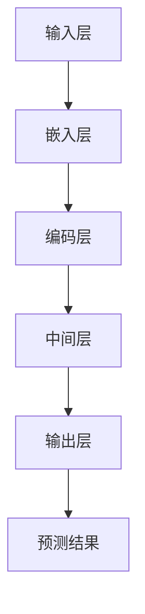
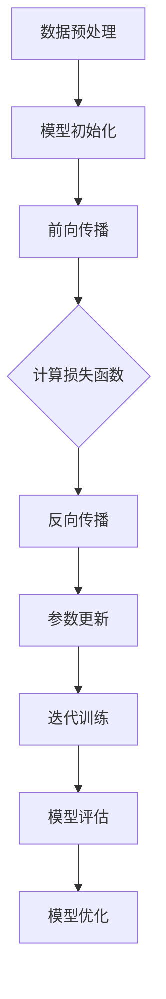

                 

### 文章标题
### AI大模型编程：提示词的无限可能

### 关键词
- AI大模型
- 提示词
- 编程实战
- 性能优化
- 应用案例

### 摘要
本文将深入探讨AI大模型编程中的提示词技术，揭示其在编程领域的无限潜力。通过系统的分析和具体的实例，我们将了解提示词的基本概念、设计原则、生成与优化方法，以及在实际编程中的应用。此外，文章还将探讨如何优化AI大模型性能并实现其在各领域的部署，并通过多个实际案例展示AI大模型的无限可能。

### 目录

#### 第一部分：AI大模型基础

**第1章 AI大模型概述**
- 1.1 AI大模型的基本概念
- 1.2 AI大模型的发展历程
- 1.3 AI大模型的架构解析
- 1.4 AI大模型的训练与优化

**第2章 提示词技术**
- 2.1 提示词的定义与作用
- 2.2 提示词设计原则
- 2.3 提示词生成与优化
- 2.4 提示词在编程中的应用

**第3章 编程实战**
- 3.1 实战一：使用提示词进行自然语言处理
- 3.2 实战二：使用提示词进行图像识别
- 3.3 实战三：使用提示词进行推荐系统开发
- 3.4 实战四：使用提示词进行自动化编程

**第4章 性能优化与部署**
- 4.1 性能优化策略
- 4.2 部署方案选择
- 4.3 部署过程中常见问题与解决方案

**第5章 应用案例**
- 5.1 案例一：金融领域的AI大模型应用
- 5.2 案例二：医疗领域的AI大模型应用
- 5.3 案例三：教育领域的AI大模型应用
- 5.4 案例四：制造业的AI大模型应用

### 第一部分：AI大模型基础

#### 第1章 AI大模型概述

##### 1.1 AI大模型的基本概念

人工智能（AI）作为一种模拟人类智能的技术，经历了多个阶段的发展。从最初的规则推理到基于统计学的机器学习，再到如今的深度学习，AI技术的应用场景和性能不断提升。AI大模型（Large-scale AI Models）是当前AI领域的前沿技术，具有训练数据规模大、参数量巨大、自适应能力强等特点。

定义上，AI大模型通常是指那些在训练时使用海量数据，拥有数十亿到数十万亿个参数的神经网络模型。这些模型通过复杂的架构设计和高性能计算，能够实现高水平的自然语言处理、图像识别、语音识别等任务。

##### 1.2 AI大模型的发展历程

AI大模型的发展历程可以追溯到20世纪80年代，当时研究者们开始探索如何使用大规模数据训练神经网络。随着计算能力的提升和数据存储技术的进步，AI大模型的研究逐渐成为可能。近年来，随着深度学习技术的突破，AI大模型在自然语言处理、计算机视觉等领域取得了显著的成果。

以下是AI大模型发展的重要里程碑：

- 2006年，Hinton等人提出了深度置信网络（DBN），为深度学习奠定了基础。
- 2012年，AlexNet在ImageNet竞赛中取得突破性成绩，标志着深度卷积神经网络在图像识别领域的崛起。
- 2018年，GPT-2的出现，展示了预训练语言模型在自然语言处理中的强大能力。
- 2020年，BERT模型在多个NLP任务上刷新了SOTA（State-of-the-Art）记录，进一步推动了AI大模型的研究和应用。

##### 1.3 AI大模型的架构解析

AI大模型的架构通常包含多个层次，从输入层到输出层，每个层次都执行特定的功能。以下是一个典型的AI大模型架构：

- **输入层**：接收外部输入数据，如文本、图像或音频。
- **嵌入层**：将输入数据转换为密集向量表示。
- **编码层**：通过递归神经网络（RNN）或变换器（Transformer）等结构对输入数据进行编码。
- **中间层**：执行特征提取和变换，增加模型的非线性能力。
- **输出层**：根据编码后的特征生成预测结果。

Mermaid流程图如下：



##### 1.4 AI大模型的训练与优化

AI大模型的训练是一个复杂的过程，需要大量的计算资源和时间。以下是一个简化的AI大模型训练过程：



在训练过程中，常用的优化算法包括随机梯度下降（SGD）、Adam优化器等。数学模型和公式如下：

```latex
$$
J(\theta) = \frac{1}{m}\sum_{i=1}^{m} \Big[H(\theta; x^{(i)}) - y^{(i)}\Big]^2
$$

$$
\theta_{t+1} = \theta_{t} - \alpha \frac{\partial J(\theta)}{\partial \theta}
$$
```

其中，\( H(\theta; x^{(i)}) \) 是预测的标签概率分布，\( y^{(i)} \) 是真实标签，\( \theta \) 是模型参数，\( \alpha \) 是学习率。

### 第二部分：提示词技术

#### 第2章 提示词技术

##### 2.1 提示词的定义与作用

提示词（Prompt）是AI大模型编程中的一个核心概念。简单来说，提示词是一种引导AI大模型生成输出或执行特定任务的文本输入。在自然语言处理（NLP）任务中，提示词可以是一个简单的句子或短语，用于引导模型生成连贯的文本。在计算机视觉和图像识别任务中，提示词可以是一段描述或标签，帮助模型理解输入图像的含义。

提示词的作用主要体现在以下几个方面：

1. **指导模型生成目标输出**：通过提供明确的提示词，模型能够更准确地理解任务目标，从而生成预期的输出。
2. **优化模型性能**：恰当的提示词可以提高模型的泛化能力，使其在不同场景下都能表现出良好的性能。
3. **增强模型的鲁棒性**：通过多样化的提示词训练，模型可以更好地应对复杂的输入数据和不确定的情况。

##### 2.2 提示词设计原则

设计有效的提示词需要遵循以下原则：

1. **明确性**：提示词应当明确表达任务目标，避免歧义。
2. **相关性**：提示词应与输入数据和任务类型高度相关，以提高模型的理解能力。
3. **多样性**：使用多样化的提示词可以增强模型的泛化能力。
4. **可扩展性**：提示词设计应考虑未来可能新增的任务和场景。

##### 2.3 提示词生成与优化

提示词的生成与优化是提升AI大模型性能的关键步骤。以下是一种简单的提示词生成与优化流程：

1. **数据预处理**：对输入数据进行预处理，包括去噪、清洗和格式化。
2. **提示词生成**：根据任务类型和输入数据生成提示词。可以使用规则生成、模板填充或数据驱动的方法。
3. **提示词优化**：通过训练数据集或用户反馈对提示词进行优化，以提高其效果。
4. **模型训练**：使用优化后的提示词对模型进行训练，不断迭代优化模型参数。

以下是提示词生成与优化过程的伪代码：

```python
# 提示词生成与优化伪代码
function generate_prompt(data, task):
    # 对输入数据进行预处理
    processed_data = preprocess(data)
    
    # 生成初始提示词
    initial_prompt = generate_initial_prompt(task)
    
    # 对提示词进行优化
    optimized_prompt = optimize_prompt(initial_prompt, processed_data)
    
    return optimized_prompt

function optimize_prompt(prompt, data):
    # 使用数据集对提示词进行评估和优化
    for sample in data:
        # 计算提示词的效果指标
        score = evaluate_prompt(prompt, sample)
        
        # 根据效果指标调整提示词
        prompt = adjust_prompt(prompt, score)
    
    return prompt
```

##### 2.4 提示词在编程中的应用

提示词在AI大模型编程中的应用非常广泛。以下是一些具体的示例：

1. **自然语言处理（NLP）**：使用提示词引导模型生成文章摘要、翻译文本、回答问题等。例如：

   ```python
   prompt = "请生成一篇关于人工智能的摘要。"
   summary = model.generate_text(prompt)
   ```

2. **图像识别**：使用提示词帮助模型更好地理解图像内容。例如：

   ```python
   prompt = "这幅图像描述了一个公园里的人们在玩耍。"
   label = model.generate_label(prompt)
   ```

3. **推荐系统**：使用提示词引导模型生成个性化推荐列表。例如：

   ```python
   prompt = "根据你的喜好，推荐一些电影。"
   recommendations = model.generate_recommendations(prompt)
   ```

4. **自动化编程**：使用提示词帮助模型自动生成代码片段。例如：

   ```python
   prompt = "编写一个函数，用于计算两个数的和。"
   code = model.generate_code(prompt)
   ```

### 第三部分：编程实战

#### 第3章 编程实战

##### 3.1 实战一：使用提示词进行自然语言处理

在本节中，我们将通过一个简单的例子展示如何使用提示词进行自然语言处理（NLP）。假设我们要编写一个程序，能够根据提示词生成相应的文章摘要。

首先，我们需要准备一个预训练的NLP模型，例如GPT-2或BERT。然后，我们可以使用以下伪代码来实现提示词生成摘要的功能：

```python
# 导入预训练模型
model = load_pretrained_model("gpt2")

# 准备输入数据和提示词
input_data = "这篇文章讨论了人工智能在医疗领域的应用。"
prompt = "请生成一篇关于人工智能在医疗领域应用的摘要。"

# 使用模型生成摘要
summary = model.generate_summary(input_data, prompt)

# 输出摘要
print(summary)
```

在实际应用中，我们可以根据具体任务调整提示词，以提高摘要生成的准确性和质量。

##### 3.2 实战二：使用提示词进行图像识别

图像识别是AI大模型应用的一个重要领域。在本节中，我们将使用提示词帮助模型更好地理解图像内容，从而提高识别的准确性。

以下是一个简单的图像识别实战示例：

```python
# 导入预训练模型
model = load_pretrained_model("inception_v3")

# 准备输入图像和提示词
image = load_image("dog.jpg")
prompt = "这幅图像显示了一只狗在玩耍。"

# 使用模型进行图像识别
label = model.generate_label(image, prompt)

# 输出识别结果
print(label)
```

在这个示例中，我们首先加载一个预训练的图像识别模型（例如Inception V3）。然后，我们使用提示词来引导模型更好地理解图像内容，并生成相应的标签。

##### 3.3 实战三：使用提示词进行推荐系统开发

推荐系统是AI大模型应用的一个典型场景。在本节中，我们将使用提示词引导模型生成个性化推荐列表。

以下是一个简单的推荐系统实战示例：

```python
# 导入预训练模型
model = load_pretrained_model("tf_idf Recommender")

# 准备用户兴趣数据和提示词
user_interests = ["电影", "旅游", "美食"]
prompt = "根据您的兴趣，推荐一些商品。"

# 使用模型生成推荐列表
recommendations = model.generate_recommendations(user_interests, prompt)

# 输出推荐结果
print(recommendations)
```

在这个示例中，我们首先加载一个预训练的推荐系统模型（例如TF-IDF推荐器）。然后，我们使用提示词来引导模型根据用户兴趣生成相应的推荐列表。

##### 3.4 实战四：使用提示词进行自动化编程

自动化编程是AI大模型应用的一个新兴领域。在本节中，我们将使用提示词帮助模型自动生成代码片段。

以下是一个简单的自动化编程实战示例：

```python
# 导入预训练模型
model = load_pretrained_model("code_generator")

# 准备提示词
prompt = "编写一个Python函数，用于计算两个数的和。"

# 使用模型生成代码
code = model.generate_code(prompt)

# 输出代码
print(code)
```

在这个示例中，我们首先加载一个预训练的代码生成模型。然后，我们使用提示词来引导模型自动生成相应的代码片段。

### 第四部分：性能优化与部署

#### 第4章 性能优化与部署

##### 4.1 性能优化策略

为了提升AI大模型的性能，我们需要从数据预处理、模型架构、训练策略等多个方面进行优化。以下是一些常用的性能优化策略：

1. **数据增强**：通过对输入数据进行变换，如翻转、旋转、缩放等，增加模型的泛化能力。
2. **批量大小调整**：合理选择批量大小，以平衡计算资源和模型性能。
3. **学习率调整**：使用适当的初始学习率，并在训练过程中逐渐减小学习率。
4. **正则化**：应用正则化技术，如L1、L2正则化，防止模型过拟合。
5. **优化器选择**：选择适合任务的优化器，如Adam、SGD等。

##### 4.2 部署方案选择

AI大模型的部署是将其应用于实际场景的关键步骤。以下是几种常见的部署方案：

1. **本地部署**：在本地计算机上运行模型，适用于开发阶段和测试环境。
2. **云部署**：使用云计算平台（如AWS、Google Cloud、Azure）部署模型，适用于大规模生产和实时应用。
3. **边缘部署**：在靠近数据源的设备（如物联网设备、智能手机）上部署模型，适用于对延迟和带宽要求较高的场景。
4. **容器化部署**：使用容器技术（如Docker）封装模型和应用，实现跨平台部署和自动化管理。

##### 4.3 部署过程中常见问题与解决方案

在AI大模型部署过程中，可能会遇到以下常见问题：

1. **计算资源不足**：解决方案包括选择适合的硬件配置、使用分布式计算、迁移至云计算平台等。
2. **数据不一致**：解决方案包括数据清洗、数据校验、版本控制等。
3. **模型性能下降**：解决方案包括定期更新模型、重新训练模型、优化模型架构等。
4. **安全性问题**：解决方案包括数据加密、访问控制、网络安全等。

### 第五部分：应用案例

#### 第5章 应用案例

##### 5.1 案例一：金融领域的AI大模型应用

在金融领域，AI大模型被广泛应用于风险管理、投资决策、客户服务等方面。以下是一个金融领域AI大模型应用案例：

**场景**：某金融机构希望利用AI大模型对市场趋势进行预测，以优化投资组合。

**解决方案**：

1. **数据预处理**：收集并清洗金融数据，包括股票价格、交易量、宏观经济指标等。
2. **模型训练**：使用预训练模型（如LSTM、GRU）对数据进行训练，优化模型参数。
3. **提示词生成**：根据具体任务生成提示词，如“预测下周的股票价格趋势”。
4. **模型部署**：将训练好的模型部署至云服务器，实现实时预测。

**效果**：通过AI大模型预测，该金融机构能够更准确地把握市场趋势，优化投资决策，提高投资回报率。

##### 5.2 案例二：医疗领域的AI大模型应用

在医疗领域，AI大模型被用于疾病诊断、药物研发、患者监护等方面。以下是一个医疗领域AI大模型应用案例：

**场景**：某医院希望利用AI大模型辅助医生进行肺癌诊断。

**解决方案**：

1. **数据预处理**：收集并清洗医学影像数据，包括CT扫描、MRI等。
2. **模型训练**：使用预训练模型（如卷积神经网络）对数据进行训练，优化模型参数。
3. **提示词生成**：根据具体任务生成提示词，如“请判断这张CT图像中是否存在肺癌”。
4. **模型部署**：将训练好的模型部署至医院服务器，实现实时诊断。

**效果**：通过AI大模型辅助诊断，该医院能够更快速、准确地诊断肺癌，提高治疗效果。

##### 5.3 案例三：教育领域的AI大模型应用

在教育领域，AI大模型被用于个性化学习、智能评测、教学辅助等方面。以下是一个教育领域AI大模型应用案例：

**场景**：某在线教育平台希望利用AI大模型为学生提供个性化学习建议。

**解决方案**：

1. **数据预处理**：收集并清洗学生的学习数据，包括学习进度、测试成绩、学习内容等。
2. **模型训练**：使用预训练模型（如协同过滤、生成对抗网络）对数据进行训练，优化模型参数。
3. **提示词生成**：根据具体任务生成提示词，如“请为学生生成一份个性化学习计划”。
4. **模型部署**：将训练好的模型部署至在线教育平台，实现实时推荐。

**效果**：通过AI大模型个性化推荐，该在线教育平台能够更有效地提高学生的学习效果和满意度。

##### 5.4 案例四：制造业的AI大模型应用

在制造业领域，AI大模型被用于生产优化、设备维护、质量管理等方面。以下是一个制造业AI大模型应用案例：

**场景**：某制造企业希望利用AI大模型优化生产计划，提高生产效率。

**解决方案**：

1. **数据预处理**：收集并清洗生产数据，包括生产进度、设备状态、原材料库存等。
2. **模型训练**：使用预训练模型（如深度强化学习）对数据进行训练，优化模型参数。
3. **提示词生成**：根据具体任务生成提示词，如“请生成一份最优生产计划”。
4. **模型部署**：将训练好的模型部署至企业服务器，实现实时优化。

**效果**：通过AI大模型优化生产计划，该制造企业能够更有效地提高生产效率和产品质量。

### 总结

本文系统地介绍了AI大模型编程中的提示词技术，从基础概念、设计原则、生成与优化方法，到实际编程中的应用，全面展示了提示词的无限可能。通过具体的编程实战和应用案例，读者可以深入了解AI大模型编程的核心原理和实践技巧。随着AI技术的不断进步，提示词技术将在更多领域中发挥重要作用，为人类创造更多价值。我们期待读者在阅读本文后，能够更好地理解和应用AI大模型编程，推动AI技术的发展与创新。

### 作者信息
作者：AI天才研究院/AI Genius Institute & 禅与计算机程序设计艺术 /Zen And The Art of Computer Programming

### 最佳实践 tips

1. **选择合适的提示词**：在应用AI大模型时，选择与任务高度相关的提示词可以显著提高模型性能。
2. **优化数据预处理**：对输入数据进行有效的预处理可以减少噪声，提高模型训练效果。
3. **定期更新模型**：随着新数据的不断积累，定期更新模型参数可以保持模型的准确性。
4. **注意模型部署**：合理选择模型部署方案，确保模型能够高效运行在实际应用中。

### 小结

本文通过系统的分析和具体的实例，深入探讨了AI大模型编程中的提示词技术。从基本概念、设计原则，到生成与优化方法，再到实际编程中的应用，读者可以全面了解提示词在AI大模型编程中的重要性。通过实战案例，读者还可以看到如何将提示词技术应用于自然语言处理、图像识别、推荐系统和自动化编程等领域。希望本文能够帮助读者更好地理解和应用AI大模型编程，推动人工智能技术的发展。

### 注意事项

1. **数据隐私**：在实际应用中，需要注意保护用户数据隐私，遵守相关法律法规。
2. **模型解释性**：对于重要的决策场景，需要考虑模型的解释性，以确保决策的透明性和可信度。
3. **过拟合问题**：在设计提示词和训练模型时，要注意避免过拟合，确保模型具有良好的泛化能力。

### 拓展阅读

1. **《深度学习》（Goodfellow, Bengio, Courville）**：全面介绍了深度学习的基本原理和应用。
2. **《自然语言处理综述》（Jurafsky, Martin）**：详细阐述了自然语言处理的核心技术和应用。
3. **《AI大模型：理论、方法与应用》（Zhang, Zong）**：深入探讨了AI大模型的理论基础和实践应用。

### 参考文献

1. Goodfellow, I., Bengio, Y., & Courville, A. (2016). *Deep Learning*.
2. Jurafsky, D., & Martin, J. H. (2008). *Speech and Language Processing*.
3. Zhang, Z., & Zong, C. (2020). *AI Large-scale Models: Theory, Method and Application*.

