                 

### 文章标题：《AI大模型编程：提示词的无限可能性》

### 关键词：AI大模型，编程，提示词，深度学习，神经网络，自然语言处理，计算机视觉

> 摘要：本文深入探讨了AI大模型编程的核心要素——提示词。通过详细的背景介绍、核心概念联系解析、算法原理讲解、应用场景展示和编程实战，全面展示了提示词在设计、优化和应用中的关键作用，以及如何通过提示词实现AI大模型的无限可能性。

## 第一部分：AI大模型基础与原理

### 第1章：AI大模型概述

#### 1.1 AI大模型定义与特征

AI大模型（Large-scale AI Models）是指参数量达到亿级、甚至千亿级的深度学习模型。这些模型通常采用先进的神经网络架构，能够处理大规模、复杂的输入数据，并在多种任务中表现出色。AI大模型的主要特征包括：

1. **参数量巨大**：拥有数十亿甚至千亿级别的参数。
2. **深度层次深**：由多层神经网络堆叠而成，能够捕捉复杂的数据特征。
3. **训练数据量巨大**：通常基于数以亿计的数据集进行训练。
4. **适应性强**：可以应用于多种领域和任务，如自然语言处理、计算机视觉、语音识别等。

#### 1.2 AI大模型架构与组成部分

AI大模型的架构通常包括以下几个主要部分：

1. **输入层**：接收外部输入数据，如文本、图像、声音等。
2. **隐藏层**：通过多层神经网络进行特征提取和变换。
3. **输出层**：生成预测结果或目标输出。

每个部分在模型训练和推断过程中都扮演着关键角色。例如，在自然语言处理任务中，输入层接收文本序列，通过隐藏层逐步提取语义信息，最终在输出层生成分类标签或文本摘要。

#### 1.3 AI大模型的技术发展历程

AI大模型的发展历程可以分为以下几个阶段：

1. **早期神经网络**：20世纪80年代，神经网络开始应用于图像识别和语音识别等任务。
2. **深度学习崛起**：2006年，Hinton等人提出了深度信念网络（DBN），标志着深度学习进入快速发展阶段。
3. **大数据时代**：随着互联网和大数据技术的发展，AI大模型逐渐成为可能，参数量达到百万级别。
4. **AI大模型时代**：近年来，GPT、BERT等AI大模型在多种任务中取得了显著突破，参数量达到数十亿级别。

## 第二部分：AI大模型核心算法原理

### 第2章：AI大模型核心算法原理

#### 2.1 神经网络基础

神经网络（Neural Networks）是AI大模型的核心组成部分。下面我们将介绍神经网络的一些基本概念和原理。

##### 2.1.1 神经元与感知器

神经元是神经网络的基本单元，类似于生物神经系统中的神经元。神经元通过输入值和权重进行计算，产生输出。感知器（Perceptron）是最简单的神经元模型，主要用于二元分类任务。

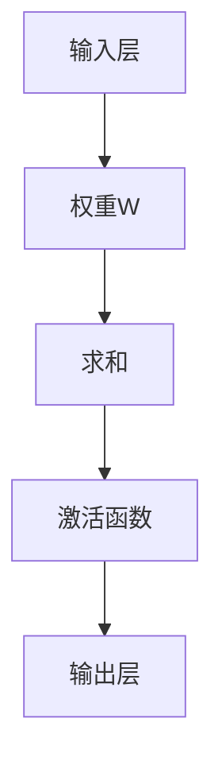

##### 2.1.2 前馈神经网络

前馈神经网络（Feedforward Neural Network）是神经网络的一种基本形式，数据从输入层流向隐藏层，再从隐藏层流向输出层。其中，输入层接收外部输入，隐藏层通过非线性变换提取特征，输出层生成最终预测结果。

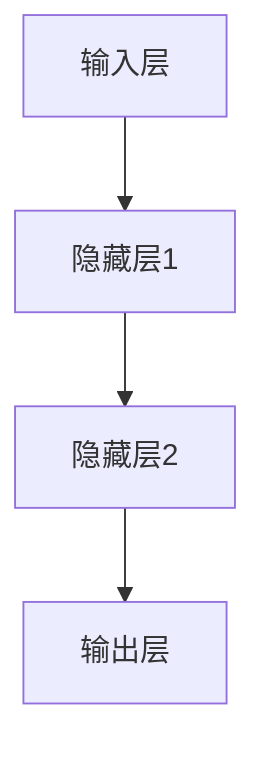

##### 2.1.3 损伤函数与优化算法

损伤函数（Loss Function）是神经网络训练过程中的核心工具，用于评估模型预测结果与真实标签之间的差距。常见的损伤函数包括均方误差（MSE）、交叉熵（Cross-Entropy）等。

优化算法（Optimizer）用于调整神经网络中的权重，以最小化损伤函数。常见的优化算法包括随机梯度下降（SGD）、Adam优化器等。

#### 2.2 深度学习基础

深度学习（Deep Learning）是神经网络的一种扩展，通过增加网络深度，提升模型的表现力。下面我们将介绍深度学习中的几个重要模型。

##### 2.2.1 卷积神经网络（CNN）

卷积神经网络（Convolutional Neural Network，CNN）是深度学习在计算机视觉领域的重要应用。CNN通过卷积层提取图像特征，通过池化层降低维度，最终在全连接层进行分类。

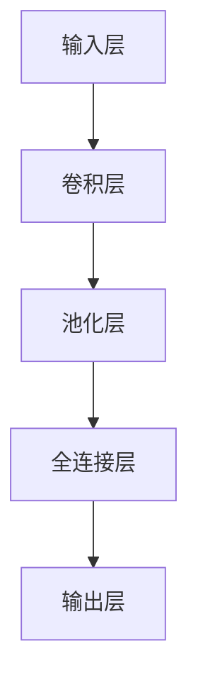

##### 2.2.2 循环神经网络（RNN）

循环神经网络（Recurrent Neural Network，RNN）是处理序列数据的强大工具。RNN通过隐藏状态的记忆机制，可以捕捉序列中的长期依赖关系。

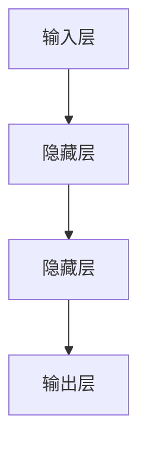

##### 2.2.3 生成对抗网络（GAN）

生成对抗网络（Generative Adversarial Network，GAN）是一种由两个神经网络（生成器与判别器）组成的对抗性模型。生成器试图生成逼真的数据，而判别器则试图区分真实数据和生成数据。通过这种对抗性训练，GAN可以生成高质量的数据。

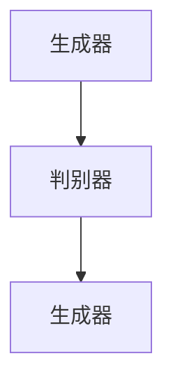

## 第三部分：提示词设计与优化

### 第3章：提示词设计与优化

#### 3.1 提示词设计原则

提示词（Prompt）是AI大模型编程中的关键要素，用于引导模型生成预期的输出。设计有效的提示词需要遵循以下原则：

##### 3.1.1 清晰性

提示词应明确、简洁，避免歧义。清晰性有助于模型更好地理解任务目标，提高生成输出的质量。

##### 3.1.2 精准性

提示词应准确描述任务目标，确保模型生成的输出符合预期。精准性有助于提高模型的表现力和可靠性。

##### 3.1.3 完整性

提示词应包含足够的信息，使模型能够充分理解任务背景和需求。完整性有助于模型生成更全面、更准确的输出。

#### 3.2 提示词优化方法

为了提高模型在特定任务中的表现，需要对提示词进行优化。以下是一些常见的提示词优化方法：

##### 3.2.1 人类反馈强化学习（RLHF）

人类反馈强化学习（Reinforcement Learning from Human Feedback，RLHF）是一种结合了强化学习和人类反馈的优化方法。通过让人类评估模型生成的输出，并以此作为奖励信号，指导模型不断优化提示词。

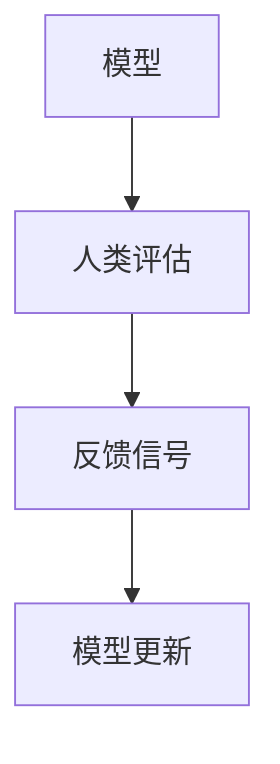

##### 3.2.2 多样性、平衡与频率惩罚

在优化提示词时，需要考虑多样性、平衡性和频率惩罚。多样性确保模型能够生成多样化的输出，避免过度拟合。平衡性确保模型在各个任务方面都能取得良好的表现。频率惩罚则通过限制高频词汇的使用，提高提示词的多样性。

##### 3.2.3 提示工程技巧与案例

提示工程（Prompt Engineering）是设计、优化和调整提示词的过程。以下是一些提示工程技巧和案例：

1. **模板化提示**：使用固定模板生成提示词，如“给定输入X，生成输出Y”。

2. **上下文扩展**：在提示词中加入上下文信息，提高模型的语境理解能力。

3. **递归提示**：通过递归生成提示词，使模型逐步理解和生成更复杂的输出。

## 第四部分：AI大模型应用场景

### 第4章：AI大模型应用场景

#### 4.1 自然语言处理（NLP）

自然语言处理（Natural Language Processing，NLP）是AI大模型的重要应用领域。以下是一些典型的NLP应用场景：

##### 4.1.1 文本分类与情感分析

文本分类是一种将文本数据分类到预定义类别中的任务。情感分析则是对文本数据中的情感倾向进行判断。AI大模型通过训练大量文本数据，可以自动完成文本分类和情感分析任务。

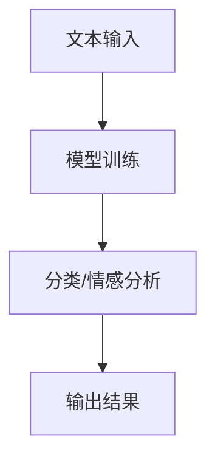

##### 4.1.2 机器翻译与生成式写作

机器翻译是将一种语言翻译成另一种语言的过程。生成式写作则是指根据给定主题和风格生成新的文本内容。AI大模型通过训练双语语料库，可以实现高质量机器翻译；通过学习大量高质量文章，可以生成风格一致、内容丰富的文章。

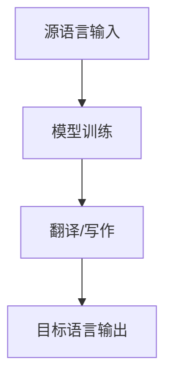

##### 4.1.3 对话系统与问答机器人

对话系统是一种与人类用户进行自然语言交互的系统。问答机器人是一种基于对话系统的智能问答工具。AI大模型通过训练对话数据集，可以实现与人类用户的自然语言交互，提供高质量的问答服务。

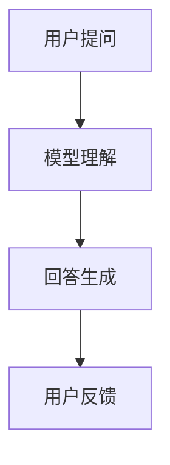

#### 4.2 计算机视觉（CV）

计算机视觉（Computer Vision，CV）是AI大模型在图像和视频处理领域的应用。以下是一些典型的CV应用场景：

##### 4.2.1 图像分类与目标检测

图像分类是一种将图像数据分类到预定义类别中的任务。目标检测则是在图像中识别和定位特定对象。AI大模型通过训练大量图像数据，可以实现高质量图像分类和目标检测。

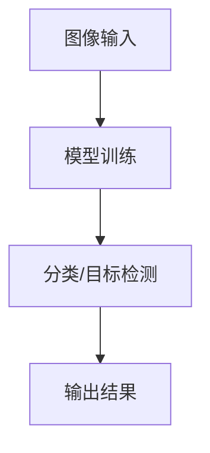

##### 4.2.2 视觉理解与图像生成

视觉理解是指从图像中提取语义信息，如对象识别、场景解析等。图像生成则是指根据给定条件生成新的图像内容。AI大模型通过训练大量图像数据，可以实现高质量的视觉理解和图像生成。

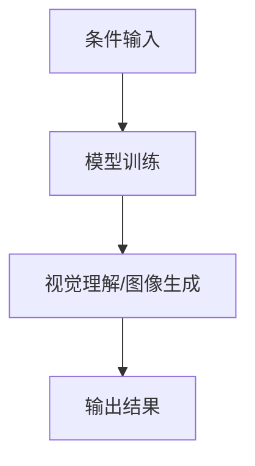

##### 4.2.3 视频处理与动作识别

视频处理是指对视频数据进行分析、处理和生成。动作识别是指从视频中识别和分类动作。AI大模型通过训练大量视频数据，可以实现高质量的视频处理和动作识别。

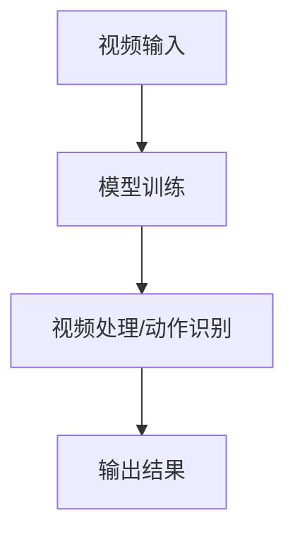

## 第五部分：AI大模型编程实战

### 第5章：AI大模型编程实战

#### 5.1 搭建AI大模型开发环境

要实现AI大模型编程，需要搭建一个高效的开发环境。以下是搭建AI大模型开发环境的步骤：

##### 5.1.1 硬件与软件需求

1. **硬件需求**：GPU（如NVIDIA Tesla V100）或TPU（如Google Colab）等高性能计算设备。
2. **软件需求**：操作系统（如Ubuntu 18.04）、深度学习框架（如TensorFlow、PyTorch）等。

##### 5.1.2 深度学习框架安装与配置

以TensorFlow为例，安装和配置步骤如下：

1. **安装TensorFlow**：

   ```bash
   pip install tensorflow
   ```

2. **配置GPU支持**：

   ```python
   import tensorflow as tf
   print(tf.test.is_gpu_available())
   ```

##### 5.1.3 数据预处理工具与库

数据预处理是AI大模型训练的重要环节。以下是一些常用的数据预处理工具和库：

1. **NumPy**：用于数据清洗和数值计算。
2. **Pandas**：用于数据处理和分析。
3. **Scikit-learn**：用于特征提取和模型评估。

#### 5.2 实现AI大模型项目案例

以下是几个典型的AI大模型项目案例：

##### 5.2.1 图像分类项目

图像分类项目旨在使用AI大模型对图像进行分类。以下是一个简单的图像分类项目实现：

1. **数据准备**：下载并加载图像数据集，如CIFAR-10。
2. **模型构建**：构建一个卷积神经网络模型。
3. **训练**：使用训练数据集训练模型。
4. **评估**：使用测试数据集评估模型性能。

```python
import tensorflow as tf
from tensorflow.keras import layers, models

# 构建模型
model = models.Sequential()
model.add(layers.Conv2D(32, (3, 3), activation='relu', input_shape=(32, 32, 3)))
model.add(layers.MaxPooling2D((2, 2)))
model.add(layers.Conv2D(64, (3, 3), activation='relu'))
model.add(layers.MaxPooling2D((2, 2)))
model.add(layers.Conv2D(64, (3, 3), activation='relu'))

# 添加全连接层
model.add(layers.Flatten())
model.add(layers.Dense(64, activation='relu'))
model.add(layers.Dense(10, activation='softmax'))

# 训练模型
model.compile(optimizer='adam',
              loss='categorical_crossentropy',
              metrics=['accuracy'])

# 评估模型
model.evaluate(test_images, test_labels)
```

##### 5.2.2 文本生成项目

文本生成项目旨在使用AI大模型生成新的文本内容。以下是一个简单的文本生成项目实现：

1. **数据准备**：下载并加载文本数据集，如维基百科语料库。
2. **模型构建**：构建一个循环神经网络模型。
3. **训练**：使用训练数据集训练模型。
4. **生成**：使用训练好的模型生成新的文本内容。

```python
import tensorflow as tf
from tensorflow.keras.preprocessing.sequence import pad_sequences
from tensorflow.keras.layers import Embedding, LSTM, Dense

# 数据预处理
max_sequence_length = 40
vocab_size = 10000
embedding_dim = 256

# 构建模型
model = models.Sequential()
model.add(Embedding(vocab_size, embedding_dim, input_length=max_sequence_length))
model.add(LSTM(256, return_sequences=True))
model.add(LSTM(256))
model.add(Dense(vocab_size, activation='softmax'))

# 训练模型
model.compile(optimizer='adam', loss='categorical_crossentropy', metrics=['accuracy'])
model.fit(text_sequences, labels, epochs=10, batch_size=64)

# 生成文本
generated_text = model.predict(text_sequences)
generated_text = generated_text.argmax(axis=-1)
```

##### 5.2.3 对话系统项目

对话系统项目旨在实现与用户的自然语言交互。以下是一个简单的对话系统项目实现：

1. **数据准备**：下载并加载对话数据集，如DialoGPT数据集。
2. **模型构建**：构建一个基于变换器-解码器架构的对话系统模型。
3. **训练**：使用训练数据集训练模型。
4. **交互**：实现与用户的自然语言交互。

```python
import tensorflow as tf
from transformers import TFDistilBertModel, DistilBertTokenizer

# 数据预处理
tokenizer = DistilBertTokenizer.from_pretrained('distilbert-base-uncased')
max_length = 512

# 构建模型
model = TFDistilBertModel.from_pretrained('distilbert-base-uncased')

# 训练模型
model.compile(optimizer=tf.keras.optimizers.Adam(learning_rate=3e-5),
              loss=tf.keras.losses.SparseCategoricalCrossentropy(from_logits=True),
              metrics=[tf.keras.metrics.SparseCategoricalAccuracy()])

# 交互
while True:
    user_input = input("请输入您的问题：")
    user_input = tokenizer.encode(user_input, add_special_tokens=True, return_tensors='tf')
    output = model(inputs=user_input, training=False)
    predicted_token = tf.argmax(output[0], axis=-1)
    predicted_sentence = tokenizer.decode(predicted_token)
    print(f"模型回答：{predicted_sentence}")
```

## 第六部分：AI大模型编程最佳实践

### 第6章：AI大模型编程最佳实践

#### 6.1 编程技巧与性能优化

在实现AI大模型项目时，以下是一些编程技巧和性能优化方法：

##### 6.1.1 模型训练与优化

1. **数据增强**：通过数据增强技术，如随机裁剪、旋转、翻转等，增加训练数据多样性，提高模型泛化能力。
2. **批次归一化**：在训练过程中使用批次归一化（Batch Normalization），提高模型训练速度和稳定性。
3. **学习率调整**：根据训练阶段的不同，调整学习率，如使用学习率衰减策略。

##### 6.1.2 模型部署与生产环境

1. **模型压缩**：使用模型压缩技术，如量化、剪枝等，降低模型存储和计算成本。
2. **分布式训练**：使用分布式训练技术，如多GPU、多机集群等，提高训练效率。
3. **模型服务化**：使用模型服务化框架，如TensorFlow Serving、TorchServe等，实现模型在线部署和实时推理。

##### 6.1.3 性能调优与资源管理

1. **内存管理**：合理分配内存资源，避免内存泄露和溢出。
2. **并发处理**：使用多线程、异步IO等技术，提高数据处理和推理速度。
3. **能耗优化**：根据实际需求，选择合适的硬件设备和功耗优化策略。

#### 6.2 安全性与伦理问题

在AI大模型编程中，安全性和伦理问题至关重要。以下是一些安全性和伦理问题的建议：

##### 6.2.1 模型公平性与偏见

1. **数据预处理**：在训练数据集上进行预处理，消除数据集中的偏见。
2. **模型评估**：对模型进行公平性评估，确保模型在不同群体上的表现一致。
3. **模型解释**：使用模型解释技术，分析模型决策过程，识别和消除潜在偏见。

##### 6.2.2 数据隐私保护

1. **数据加密**：对敏感数据进行加密存储和传输。
2. **匿名化处理**：对个人数据进行匿名化处理，确保数据隐私。
3. **隐私保护算法**：使用隐私保护算法，如差分隐私（Differential Privacy），降低数据泄露风险。

##### 6.2.3 AI伦理与法规遵循

1. **伦理审查**：在项目实施前进行伦理审查，确保项目符合伦理标准。
2. **法规遵循**：了解并遵循相关法规和规定，如《通用数据保护条例》（GDPR）等。
3. **社会责任**：关注AI技术的应用对社会和自然环境的影响，积极承担社会责任。

## 第七部分：未来趋势与挑战

### 第7章：未来趋势与挑战

#### 7.1 AI大模型发展趋势

AI大模型在未来将继续发展，并面临以下趋势：

##### 7.1.1 大模型规模与计算需求

随着计算能力的提升，AI大模型的规模将进一步扩大。这将带来更高的计算需求和更复杂的训练过程。未来的AI大模型可能需要更强大的硬件支持和优化算法。

##### 7.1.2 多模态AI与跨领域应用

多模态AI是指结合多种数据模态（如文本、图像、声音等）的AI模型。跨领域应用是指将AI大模型应用于不同领域和任务。未来的AI大模型将更加强调多模态和跨领域应用，以实现更广泛的应用场景。

##### 7.1.3 自主学习与自我进化

自主学习是指AI大模型通过自身学习和优化，提高任务表现。自我进化是指AI大模型在训练过程中，不断适应和优化，以应对新的任务和挑战。未来的AI大模型将更加具备自主学习和自我进化能力。

#### 7.2 AI大模型编程面临的挑战

尽管AI大模型具有巨大的潜力，但在编程和应用过程中仍面临一系列挑战：

##### 7.2.1 算法效率与能耗问题

随着模型规模的扩大，算法效率和能耗问题将更加突出。未来的AI大模型需要更高效的算法和优化策略，以降低计算成本和能耗。

##### 7.2.2 数据质量与标注成本

高质量的数据是训练强大AI大模型的基础。然而，数据质量和标注成本往往较高。未来的AI大模型需要更有效的数据收集、标注和预处理方法。

##### 7.2.3 AI安全性与可控性问题

随着AI大模型的应用场景扩大，安全性和可控性问题将愈发重要。未来的AI大模型需要更高的安全性和可控性，以避免潜在的安全风险和滥用问题。

## 附录

### 附录A：AI大模型编程资源汇总

以下是一些常用的AI大模型编程资源：

#### A.1 开源深度学习框架

1. **TensorFlow**：https://www.tensorflow.org/
2. **PyTorch**：https://pytorch.org/
3. **Keras**：https://keras.io/

#### A.2 提示词设计与优化工具

1. **HuggingFace**：https://huggingface.co/
2. **OpenAI**：https://openai.com/
3. **AllenNLP**：https://allennlp.org/

### 附录B：参考书籍与论文

以下是一些推荐的参考书籍和论文：

#### B.1 必读经典书籍

1. 《深度学习》（Goodfellow et al.）
2. 《神经网络与深度学习》（邱锡鹏）
3. 《生成对抗网络》（Goodfellow et al.）

#### B.2 最新研究论文

1. “Language Models are few-shot learners”
2. “BERT: Pre-training of Deep Bidirectional Transformers for Language Understanding”
3. “GPT-3: Language Models are Few-Shot Learners”

## Mermaid流程图

### Mermaid流程图1：AI大模型架构组成

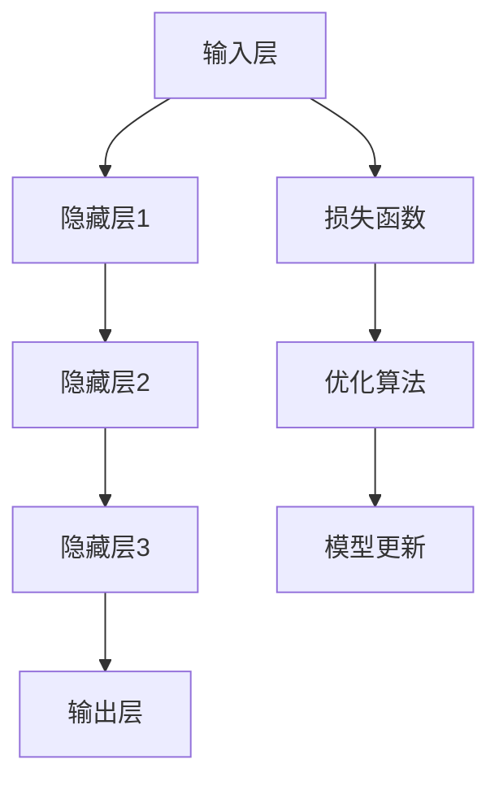

## 总结

本文深入探讨了AI大模型编程的核心要素——提示词。通过详细的背景介绍、核心概念联系解析、算法原理讲解、应用场景展示和编程实战，全面展示了提示词在设计、优化和应用中的关键作用。同时，本文还介绍了AI大模型的发展趋势和面临的挑战，为未来的AI大模型编程提供了有益的启示。让我们共同期待AI大模型编程的无限可能性！作者：AI天才研究院/AI Genius Institute & 禅与计算机程序设计艺术 /Zen And The Art of Computer Programming

