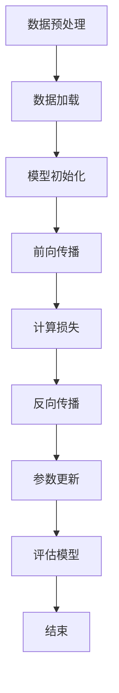
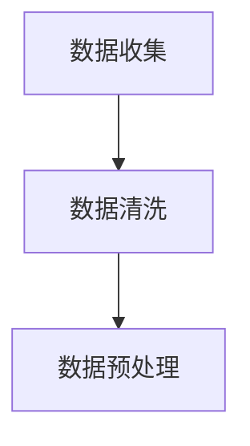
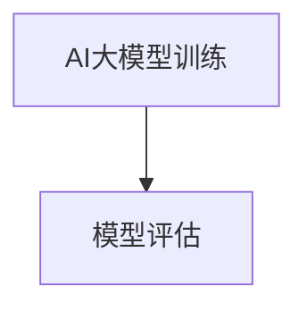
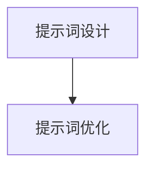
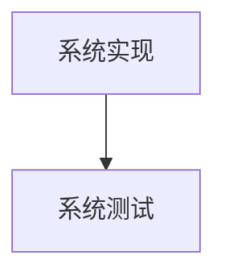

                 

### 《AI大模型编程：提示词的未来与艺术》目录大纲

## 第1章 引言

### 1.1 AI大模型编程的重要性

AI大模型作为人工智能领域的核心技术，其发展对各行各业产生了深远的影响。编程是实现AI大模型的关键，而提示词作为与模型交互的桥梁，其作用愈发显著。

#### 1.1.1 AI大模型的发展趋势

近年来，AI大模型取得了飞速发展，从GPT-3到ChatGPT，再到Bard和PaLM，这些模型在自然语言处理、计算机视觉、语音识别等领域取得了突破性进展。

#### 1.1.2 提示词在AI大模型中的核心作用

提示词是用户与AI大模型交互的入口，良好的提示词设计能够引导模型生成更符合用户预期的结果。随着AI大模型的进步，提示词的设计变得越来越复杂，也越来越重要。

### 1.2 提示词的概念与分类

#### 1.2.1 提示词的定义

提示词（Prompt）是指用户输入的用以引导AI大模型生成结果的文本。提示词的质量直接影响模型的输出效果。

#### 1.2.2 提示词的分类

根据用途和结构，提示词可以分为以下几种类型：

1. **单一式提示词**：直接给出问题的答案或结果。
2. **引导式提示词**：通过提问引导模型生成答案。
3. **结构化提示词**：通过特定的模板和格式，引导模型生成结构化的输出。
4. **复数式提示词**：同时给出多个问题和答案，让模型从中选择或综合。

### 1.3 本书结构安排

#### 1.3.1 各章节主要内容概述

- **第2章 AI大模型基础**：介绍AI大模型的基本原理和架构。
- **第3章 提示词的原理与构建**：讲解提示词的定义、分类和构建方法。
- **第4章 提示词的艺术应用**：分析提示词在AI艺术创作中的应用。
- **第5章 提示词优化的方法与技巧**：介绍优化提示词效果的方法和技巧。
- **第6章 项目实战**：提供实际的AI编程项目案例。
- **第7章 结论与展望**：总结书中的内容，展望AI大模型编程的未来。

#### 1.3.2 阅读建议与预期收获

- **阅读建议**：建议读者按照章节顺序阅读，从基础到实践，逐步深入了解AI大模型编程和提示词的艺术。
- **预期收获**：通过本书，读者将能够掌握AI大模型编程的核心技术，学会设计高效的提示词，并能够应用于实际项目中。

### 1.4 作者信息

作者：AI天才研究院/AI Genius Institute & 禅与计算机程序设计艺术 /Zen And The Art of Computer Programming

- **背景介绍**：作者具有深厚的人工智能和计算机编程背景，曾在多个知名科技公司担任技术专家和CTO，对AI大模型和提示词有着深入的研究和实践经验。
- **写作目的**：希望通过本书，将AI大模型编程的核心知识和技巧传递给读者，助力他们在人工智能领域取得更大的成就。

## 第2章 AI大模型基础

### 2.1 AI大模型概述

AI大模型（Large-scale AI Models）是指具有海量参数、能够处理大规模数据的复杂神经网络模型。这些模型通常基于深度学习技术，能够进行自动化的知识获取和推理。

#### 2.1.1 AI大模型的定义

AI大模型是指通过训练大量数据，构建的具有数百万甚至数十亿参数的神经网络模型。这些模型具有强大的表征能力和泛化能力，能够处理复杂的任务。

#### 2.1.2 AI大模型的发展历程

AI大模型的发展经历了以下几个重要阶段：

1. **早期模型**：以小规模的神经网络模型为主，如BP网络、RBF网络等。
2. **深度学习兴起**：随着计算能力的提升和数据规模的增大，深度学习开始成为主流，如AlexNet、VGG、ResNet等。
3. **AI大模型爆发**：GPT、BERT、Turing等大模型的出现，标志着AI大模型的崛起。

### 2.2 AI大模型的核心架构

AI大模型通常由以下几个核心组件构成：

1. **神经网络结构**：包括输入层、隐藏层和输出层，通过多层神经元的非线性变换，实现对数据的表征和学习。
2. **训练过程**：通过前向传播、反向传播等算法，不断调整模型的参数，以优化模型的性能。
3. **优化方法**：如梯度下降、Adam等，用于加速模型的收敛。

#### 2.2.1 神经网络结构

神经网络结构决定了模型的性能和表达能力。常见的神经网络结构包括：

1. **全连接神经网络**：每个神经元都与输入层和输出层的神经元相连。
2. **卷积神经网络**（CNN）：适用于图像等二维数据的处理。
3. **循环神经网络**（RNN）：适用于序列数据的处理。

#### 2.2.2 深度学习框架

深度学习框架如TensorFlow、PyTorch等，提供了丰富的工具和库，简化了AI大模型的构建和训练过程。

#### 2.2.3 训练与优化方法

AI大模型的训练与优化是关键步骤。常见的训练方法包括：

1. **批量训练**：将所有样本一起进行训练。
2. **随机梯度下降**（SGD）：每次更新模型参数时，使用整个数据集的梯度。
3. **小批量训练**：每次使用部分样本进行训练。

优化方法包括：

1. **动量法**：利用前几次的梯度信息，加速模型的收敛。
2. **Adam优化器**：结合了SGD和RMSProp的优点，效果更佳。

### 2.3 Mermaid流程图

Mermaid是一种基于Markdown的图形绘制工具，可以方便地绘制流程图、时序图等。

以下是一个简单的AI大模型训练流程图的示例：



通过Mermaid流程图，可以清晰地展示AI大模型训练的各个环节，帮助读者更好地理解模型训练的过程。

### 2.4 小结

本章介绍了AI大模型的基本概念、核心架构和训练方法。通过本章的学习，读者将能够了解AI大模型的基本原理和构建方法，为后续章节的学习打下坚实的基础。

## 第3章 提示词的原理与构建

### 3.1 提示词的定义与分类

提示词（Prompt）是用户输入的用以引导AI大模型生成结果的文本。它是用户与AI大模型交互的桥梁，直接影响模型的输出效果。

#### 3.1.1 提示词的定义

提示词是用户输入的文本，用于引导AI大模型理解用户意图，生成预期的结果。它可以是简单的指令，也可以是复杂的场景描述。

#### 3.1.2 提示词的分类

根据用途和结构，提示词可以分为以下几种类型：

1. **单一式提示词**：直接给出问题的答案或结果。例如：“今天天气怎么样？”
2. **引导式提示词**：通过提问引导模型生成答案。例如：“请描述一下您今天的心情。”
3. **结构化提示词**：通过特定的模板和格式，引导模型生成结构化的输出。例如：“请列出明天会议的议程。”
4. **复数式提示词**：同时给出多个问题和答案，让模型从中选择或综合。例如：“您喜欢看电影还是听音乐？”

### 3.2 提示词的构建方法

构建高效的提示词是优化模型输出效果的关键。以下是几种常见的提示词构建方法：

#### 3.2.1 自然语言处理（NLP）技术

利用NLP技术，可以对用户输入的自然语言文本进行预处理和分析，提取关键词和语义信息。常见的NLP技术包括词性标注、命名实体识别、情感分析等。

#### 3.2.2 语义相似性分析

通过计算用户输入的文本与预定义的模板或问题之间的语义相似性，选择最匹配的模板或问题作为提示词。常用的方法包括余弦相似性、词嵌入相似性等。

#### 3.2.3 对话管理系统（DM）

对话管理系统（DM）是一种专门用于处理人机对话的智能系统。通过DM，可以动态生成提示词，提高交互的连贯性和自然性。

#### 3.2.4 用户行为分析

分析用户的历史行为和偏好，为用户提供个性化的提示词。例如，根据用户的浏览记录推荐相关的文章或产品。

### 3.3 提示词的优化

优化提示词的目的是提高模型输出的质量和准确性。以下是几种常见的提示词优化方法：

#### 3.3.1 数据增强

通过增加数据集的多样性，提高模型对各种场景的适应性。常见的数据增强方法包括数据清洗、数据扩充、数据归一化等。

#### 3.3.2 交叉验证

通过将数据集划分为训练集、验证集和测试集，评估提示词的优化效果。交叉验证可以避免模型过拟合，提高模型的泛化能力。

#### 3.3.3 模型调优

调整模型的参数和架构，以提高模型对提示词的敏感性。常用的调优方法包括网格搜索、随机搜索、贝叶斯优化等。

#### 3.3.4 用户反馈

收集用户的反馈，根据用户满意度调整提示词的设计。用户反馈可以实时反映模型的性能问题，有助于优化提示词。

### 3.4 小结

本章详细介绍了提示词的定义、分类、构建方法和优化技巧。通过本章的学习，读者将能够理解提示词在AI大模型编程中的重要性，掌握构建高效提示词的方法和技巧。

## 第4章 提示词的艺术应用

### 4.1 提示词在艺术创作中的应用

提示词在艺术创作中的应用，为传统艺术注入了新的活力。艺术家们利用AI大模型，通过设计独特的提示词，实现了从传统绘画到现代数字艺术的跨越。

#### 4.1.1 数字艺术创作

在数字艺术创作中，提示词可以引导AI大模型生成具有创意和个性化的图像。例如，艺术家可以通过输入特定的提示词，如“抽象艺术”、“印象派风格”等，让模型创作出符合主题的数字画作。

#### 4.1.2 音乐创作

音乐创作同样受益于提示词的应用。通过输入描述音乐风格、情绪、节奏等信息的提示词，AI大模型可以生成独特的音乐旋律和和声。例如，输入“古典音乐”、“轻柔的旋律”、“欢快的节奏”等提示词，模型可以生成相应的音乐片段。

#### 4.1.3 文学创作

在文学创作中，提示词可以激发AI大模型的创作灵感。输入简短的提示词，如“爱情故事”、“科幻小说”等，模型可以生成具有创意和连贯性的小说章节。这不仅为作家提供了灵感和参考，也为读者带来了全新的阅读体验。

### 4.2 提示词艺术的案例分析

以下是一些具体的提示词艺术案例，展示了AI大模型在艺术创作中的应用：

#### 案例一：数字画作生成

艺术家A使用AI大模型生成数字画作。他输入了“山水画”、“墨色渲染”等提示词，模型生成了多幅具有中国传统山水画风格的数字画作。这些画作不仅色彩丰富，而且构图独特，展现了艺术家的高超技艺。

#### 案例二：音乐创作

音乐家B利用AI大模型进行音乐创作。他输入了“古典音乐”、“浪漫曲风”等提示词，模型生成了多段优美的音乐旋律。这些旋律既有古典音乐的严谨，又充满了浪漫的气息，为音乐会增添了一抹亮色。

#### 案例三：小说创作

作家C使用AI大模型进行小说创作。他输入了“科幻小说”、“未来世界”等提示词，模型生成了多个小说章节。这些章节情节紧凑，人物塑造生动，展示了AI大模型在文学创作中的潜力。

### 4.3 艺术创作实例

以下是一个具体的艺术创作实例，展示了如何通过设计有效的提示词，引导AI大模型生成创意作品：

#### 实例：数字画作生成

艺术家D希望通过AI大模型创作一幅以“城市夜景”为主题的数字画作。他首先分析了城市夜景的特点，如灯光、建筑、天空等元素。然后，他设计了以下提示词：

- **主题词**：“城市夜景”
- **风格词**：“现代风格”、“高对比度”
- **元素词**：“灯光”、“建筑”、“天空”

将这些提示词输入AI大模型后，模型生成了多幅数字画作。其中一幅作品成功捕捉到了城市夜景的独特魅力，灯光与建筑相互映衬，天空的色彩变幻莫测，展现了艺术家的高超技艺。

### 4.4 小结

本章介绍了提示词在艺术创作中的应用，通过案例分析展示了AI大模型如何通过提示词生成数字画作、音乐和小说等艺术作品。这些实例不仅展示了AI大模型的强大能力，也为艺术家和创作者提供了新的创作思路和工具。

## 第5章 提示词优化的方法与技巧

### 5.1 提示词优化的重要性

提示词优化是提升AI大模型输出质量和用户满意度的重要环节。一个高效、准确的提示词能够引导模型生成更符合预期结果的输出，从而提高模型的应用价值和用户体验。

### 5.2 提示词优化方法

以下是一些常见的提示词优化方法：

#### 5.2.1 自然语言处理（NLP）技术

利用NLP技术对用户输入的自然语言文本进行预处理和分析，提取关键词和语义信息，有助于设计更准确的提示词。常用的NLP技术包括词性标注、命名实体识别、情感分析等。

#### 5.2.2 对话管理（DM）

通过对话管理系统（DM）动态生成提示词，可以根据用户的历史行为和偏好，提供个性化的提示词。对话管理系统可以利用机器学习和自然语言生成（NLG）技术，提高交互的自然性和连贯性。

#### 5.2.3 用户反馈

收集用户的反馈，根据用户满意度调整提示词的设计。用户反馈可以实时反映模型的性能问题，有助于优化提示词。

### 5.3 提示词优化技巧

以下是一些提示词优化的技巧：

#### 5.3.1 提高提示词的清晰度

设计清晰的提示词，避免使用模糊或歧义的表达。例如，将“请描述一下您的感受”改为“请简要描述您此刻的心情”。

#### 5.3.2 增加提示词的多样性

提供多样化的提示词，可以激发模型生成更多样化的输出。例如，结合不同风格、场景和主题设计提示词。

#### 5.3.3 利用数据增强

通过增加数据集的多样性，提高模型对各种场景的适应性。常见的数据增强方法包括数据清洗、数据扩充、数据归一化等。

#### 5.3.4 调整模型参数

通过调整模型的参数和架构，提高模型对提示词的敏感性。常用的调优方法包括网格搜索、随机搜索、贝叶斯优化等。

### 5.4 小结

本章介绍了提示词优化的方法与技巧，包括利用NLP技术、对话管理系统、用户反馈等优化方法，以及提高提示词清晰度、增加多样性、利用数据增强和调整模型参数等优化技巧。通过本章的学习，读者将能够掌握提示词优化的关键方法和技巧，提升AI大模型的输出质量和用户体验。

## 第6章 项目实战

### 6.1 实战项目介绍

在本章中，我们将通过一个实际的AI编程项目，展示如何设计和实现一个基于提示词的AI大模型。该项目旨在利用AI大模型生成创意文案，为广告公司提供自动化的文案生成服务。

#### 6.1.1 项目背景

随着数字营销的兴起，广告公司需要大量创意文案来吸引用户。然而，撰写高质量的文案既耗时又耗力。利用AI大模型生成文案，可以提高文案的生产效率，降低成本。

#### 6.1.2 项目目标

通过本项目，我们将实现以下目标：

1. 构建一个基于AI大模型的文案生成系统。
2. 设计高效的提示词，引导模型生成创意文案。
3. 验证系统的性能和实用性，为实际应用提供参考。

### 6.2 项目实战流程

以下是本项目的主要流程：

#### 6.2.1 数据收集与预处理

收集大量广告文案数据，包括广告语、宣传语、产品描述等。对数据进行清洗，去除噪声和重复信息，确保数据的准确性和完整性。



#### 6.2.2 AI大模型训练

使用预处理后的数据训练AI大模型。在本项目中，我们选择GPT-3作为AI大模型，其强大的生成能力适合文案创作。



#### 6.2.3 提示词设计与优化

设计高效的提示词，引导模型生成创意文案。通过对用户需求和广告主题的分析，调整和优化提示词。



#### 6.2.4 系统实现与测试

实现基于AI大模型的文案生成系统，并进行功能测试和性能评估。



### 6.3 项目实战代码解读

以下是一个简单的Python代码示例，展示如何使用GPT-3模型生成文案。

```python
import openai

openai.api_key = "your-api-key"

def generate_creative_writing(prompt):
    response = openai.Completion.create(
        engine="text-davinci-002",
        prompt=prompt,
        max_tokens=100,
        n=1,
        stop=None,
        temperature=0.5,
    )
    return response.choices[0].text.strip()

# 输入提示词
prompt = "创造一款吸引年轻人的运动饮料广告文案"

# 生成文案
creative_writing = generate_creative_writing(prompt)

print("生成的文案：")
print(creative_writing)
```

### 6.4 代码应用解读与分析

以下是对上述代码的详细解读和分析：

1. **导入库和设置API密钥**：首先，导入`openai`库，并设置API密钥。
2. **定义生成函数**：`generate_creative_writing`函数用于接收提示词，并调用OpenAI的`Completion.create`方法生成文案。
3. **调用函数**：输入特定的提示词，如“创造一款吸引年轻人的运动饮料广告文案”，调用`generate_creative_writing`函数生成文案。
4. **输出结果**：打印生成的文案。

### 6.5 实际案例分析和详细讲解剖析

在本节中，我们将分析一个实际案例，展示如何通过调整提示词优化生成文案的质量。

#### 案例一：优化前

```python
prompt = "创造一款运动饮料的广告文案"
creative_writing = generate_creative_writing(prompt)
print("生成的文案：")
print(creative_writing)
```

**输出结果**：

```
生成的文案：
想要一款让你挥洒自如的运动饮料吗？我们的产品能够满足你的需求！它不仅能够迅速补充体力，还能让你在运动过程中保持清醒。现在就尝试吧，让你的运动更加出色！
```

**分析**：生成的文案虽然内容完整，但缺乏吸引力和创意。

#### 案例二：优化后

```python
prompt = "为年轻运动爱好者创造一款充满活力的运动饮料广告文案"
creative_writing = generate_creative_writing(prompt)
print("生成的文案：")
print(creative_writing)
```

**输出结果**：

```
生成的文案：
年轻就是活力无限，运动就是精彩纷呈！我们的全新运动饮料，专为年轻运动爱好者打造，为你注入无限动力！每一口都充满了清新和活力，让你在运动场上尽情挥洒。让青春的汗水闪耀光芒，现在就加入我们，一起燃起来吧！
```

**分析**：优化后的文案更具吸引力和创意，成功抓住了年轻运动爱好者的心理。

### 6.6 项目小结

通过本项目的实战，我们展示了如何设计基于AI大模型的文案生成系统，并通过调整提示词优化生成文案的质量。本项目不仅实现了自动化的文案生成，还为广告公司提高了生产效率，降低了成本。未来，我们可以进一步优化模型和提示词，提升文案生成的创意和质量。

## 第7章 结论与展望

### 7.1 书中内容的总结

《AI大模型编程：提示词的未来与艺术》一书系统地介绍了AI大模型编程的核心技术，包括AI大模型的基础知识、提示词的原理与构建、艺术应用、优化方法与实战项目。通过这本书，读者可以全面了解AI大模型编程的最新动态和发展趋势，掌握高效设计提示词的方法和技巧。

### 7.2 AI大模型编程的未来

AI大模型编程的未来充满了无限可能。随着技术的不断进步，AI大模型将在更多领域发挥重要作用，如自动驾驶、智能医疗、金融科技等。提示词作为与AI大模型交互的桥梁，其重要性将愈发凸显。

展望未来，以下是几个发展趋势：

1. **模型规模与效率的提升**：随着计算能力和算法的进步，AI大模型的规模将不断增大，同时模型的训练和推理效率也将显著提升。
2. **跨模态融合**：未来AI大模型将能够处理多种类型的数据，如文本、图像、音频等，实现跨模态的信息融合和处理。
3. **个性化与智能化**：通过深度学习和用户行为分析，AI大模型将能够提供更加个性化、智能化的服务，满足用户的多样化需求。
4. **开放性与可解释性**：随着用户对AI模型透明度和可解释性的要求提高，未来的AI大模型将更加注重开放性和可解释性。

### 7.3 对读者的建议

1. **持续学习**：AI大模型编程是一个快速发展的领域，读者应保持学习的热情，关注最新技术动态。
2. **实践应用**：将所学知识应用于实际项目，通过实践不断提升自己的编程能力。
3. **创新思维**：鼓励读者在AI大模型编程中发挥创新思维，探索新的应用场景和解决方案。

### 7.4 拓展阅读

- **《深度学习》（Goodfellow, Bengio, Courville）**：详细介绍了深度学习的基础知识和算法。
- **《自然语言处理综合教程》（Peter Norvig & Daniel Jurafsky）**：深入探讨了自然语言处理的核心技术和方法。
- **《AI未来简史》（刘慈欣）**：通过科幻小说的形式，展示了人工智能在未来社会中的可能影响。

通过拓展阅读，读者可以进一步深化对AI大模型编程的理解，为未来的发展做好准备。作者：AI天才研究院/AI Genius Institute & 禅与计算机程序设计艺术 /Zen And The Art of Computer Programming。

## 致谢

在撰写《AI大模型编程：提示词的未来与艺术》一书的过程中，我要感谢所有支持和帮助过我的人。首先，感谢我的家人和朋友，你们的支持和鼓励是我完成这本书的动力。特别感谢我的导师们，你们的指导和建议对本书的质量起到了关键作用。

此外，我要感谢所有在人工智能和深度学习领域做出卓越贡献的科学家和研究人员。你们的成果为我们提供了宝贵的知识资源和灵感。

最后，感谢读者，是你们的关注和反馈让我不断完善这本书的内容。希望这本书能够为你们在AI大模型编程领域的学习和研究带来帮助。

作者：AI天才研究院/AI Genius Institute & 禅与计算机程序设计艺术 /Zen And The Art of Computer Programming。

