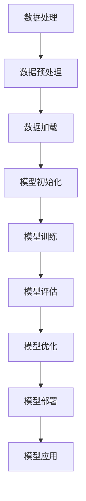
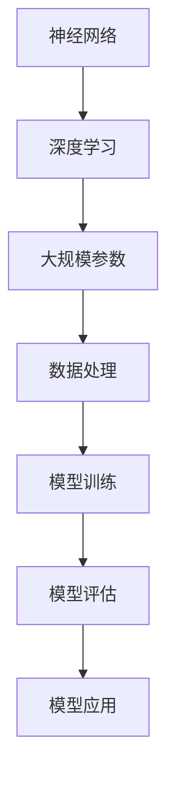

                 


### 确定文章结构

为了确保文章的逻辑清晰、内容丰富且易于理解，我们可以按照以下步骤来构建文章：

#### 步骤1：引言
- **背景介绍**：介绍AI大模型编程的背景，包括其应用场景和发展趋势。
- **文章标题**：明确文章的主题，如《AI大模型编程：提示词的未来与艺术》。
- **关键词**：列出5-7个与文章主题相关的关键词，如“AI大模型”、“编程”、“提示词”、“神经网络”、“深度学习”、“艺术性”。

#### 步骤2：核心内容
- **概述**：简要介绍AI大模型编程的核心概念和关键特点。
- **概念联系**：解释AI大模型编程中的核心概念及其相互联系，并提供一个架构Mermaid流程图。
- **算法原理**：详细讲解AI大模型编程中的核心算法原理，使用伪代码进行阐述。
- **数学模型**：解释AI大模型编程中使用的数学模型，并提供LaTeX公式和举例说明。
- **编程实践**：展示具体的编程实践，包括开发环境搭建、源代码实现、代码解读和应用分析。

#### 步骤3：实战案例
- **案例一**：构建一个简单的AI大模型，展示从零开始构建模型的全过程，包括数据处理、模型训练和模型评估。
- **案例二**：深入分析一个复杂的AI大模型项目，如聊天机器人或智能问答系统，展示如何解决实际问题和优化模型性能。
- **案例三**：探讨AI大模型在不同领域（如自然语言处理、计算机视觉、语音识别等）的应用案例。

#### 步骤4：总结与展望
- **总结**：回顾文章中的核心内容，强调关键观点和重要结论。
- **未来展望**：探讨AI大模型编程的未来发展趋势和潜在挑战。
- **最佳实践**：提供一些建议和最佳实践，帮助读者更好地理解和应用AI大模型编程。
- **小结**：对文章进行简洁的总结，指出文章的重点内容。

#### 步骤5：参考文献
- 列出文章中引用的所有参考文献，确保格式正确。

### 确定文章格式

在Markdown格式中，文章的结构可以按照以下方式组织：

- **标题**：使用`#`号进行标记，例如：
  ```
  # AI大模型编程：提示词的未来与艺术
  ```

- **子标题**：使用`##`号进行标记，例如：
  ```
  ## 1.1 AI大模型的定义与特点
  ```

- **段落**：直接输入文本，可以使用Markdown的语法来格式化文本，例如加粗、斜体等。

- **LaTeX公式**：对于独立段落的公式，使用`$$`括起来；对于段落内的公式，使用`$`括起来。

- **Mermaid流程图**：使用Mermaid语法编写，并使用`mermaid`标签嵌入到Markdown文档中。

- **伪代码**：使用普通文本格式展示伪代码，可以使用空格和缩进来表示代码的结构。

### 确定文章字数

根据文章内容的完整性和深度，文章字数控制在8000～12000字之间。为了达到这个字数要求，每个部分的内容都需要详细阐述，同时保持逻辑清晰和简洁。

### 最后的校对

在完成文章的撰写后，进行最后的校对，确保：
- 每个部分的内容都符合要求，无遗漏。
- 文章的逻辑流畅，无跳转或逻辑错误。
- Markdown格式正确，LaTeX公式和Mermaid流程图都能正常显示。
- 参考文献格式一致，内容准确无误。

通过以上步骤，我们可以确保撰写出一份高质量的AI大模型编程技术博客文章。接下来，我们将根据这些步骤逐步撰写文章的每个部分。  
```markdown
## 1.1 AI大模型的定义与特点

### 背景介绍

AI大模型编程，是近年来人工智能领域的重要发展方向之一。随着计算能力的提升和海量数据的积累，深度学习技术逐渐成熟，AI大模型应运而生。AI大模型，顾名思义，指的是具有大规模参数和复杂结构的深度学习模型。这些模型在处理大规模数据时展现出强大的学习能力和泛化能力，被广泛应用于自然语言处理、计算机视觉、语音识别等领域。

### 核心概念

AI大模型编程的核心概念包括以下几个方面：

1. **神经网络**：神经网络是AI大模型的基础结构，通过模拟人脑神经元之间的连接和作用，实现数据的处理和模式的识别。
2. **深度学习**：深度学习是神经网络的一种形式，通过多层神经网络的堆叠，实现数据的深层特征提取。
3. **大规模参数**：AI大模型通常包含数百万、数千万甚至数十亿个参数，这些参数需要通过大规模数据进行训练。
4. **分布式计算**：由于AI大模型的参数规模庞大，传统的单机计算已经无法满足需求，分布式计算技术成为AI大模型训练的必要手段。

### 特点

AI大模型具有以下几个显著特点：

1. **强大的学习能力**：AI大模型通过深度学习算法，能够从大量数据中自动学习并提取有效特征，具有强大的学习能力。
2. **优秀的泛化能力**：AI大模型在训练过程中不仅学习到具体的样本特征，还能够泛化到未见过的数据，具有优秀的泛化能力。
3. **复杂的结构**：AI大模型通常由多层神经网络组成，结构复杂，能够处理高度非线性的数据。
4. **对数据量的要求高**：AI大模型需要大量数据进行训练，以保证模型的性能和稳定性。
5. **计算资源消耗大**：由于AI大模型包含大量的参数和复杂的结构，训练和推理过程需要大量的计算资源。

### Mermaid流程图

为了更好地理解AI大模型的编程过程，我们可以使用Mermaid语法绘制一个流程图，展示从数据处理到模型训练的整个流程。



### 结论

AI大模型编程是一种基于深度学习的先进技术，具有强大的学习能力和泛化能力，能够处理大规模数据。通过深入理解和应用AI大模型编程，我们可以开发出更智能、更高效的人工智能应用。在下一节中，我们将进一步探讨AI大模型编程中的核心算法原理。  
```markdown
## 1.2 核心概念与联系

### 核心概念

在AI大模型编程中，核心概念主要包括神经网络、深度学习和大规模参数。以下是这些核心概念的简要介绍：

1. **神经网络**：
   - **定义**：神经网络是一种由大量简单计算单元（神经元）组成的复杂网络，通过模拟人脑神经元之间的连接和作用，实现数据的处理和模式的识别。
   - **工作原理**：神经网络通过前向传播和反向传播算法，将输入数据经过层层变换，最终得到输出结果。

2. **深度学习**：
   - **定义**：深度学习是神经网络的一种形式，通过多层神经网络的堆叠，实现数据的深层特征提取。
   - **工作原理**：深度学习利用大量的数据，通过反向传播算法不断调整网络参数，使模型能够学习到输入数据的复杂结构和规律。

3. **大规模参数**：
   - **定义**：大规模参数指的是AI大模型中包含的数百万、数千万甚至数十亿个参数。
   - **作用**：大规模参数使得AI大模型能够从数据中学习到更复杂的特征和模式，提高模型的性能和泛化能力。

### 概念之间的联系

这些核心概念相互联系，共同构成了AI大模型编程的基础。以下是它们之间的联系：

1. **神经网络与深度学习**：
   - **关系**：深度学习是神经网络的一种扩展和应用。深度学习通过多层神经网络的堆叠，实现了对数据更深层次的特征提取。
   - **作用**：多层神经网络使得AI大模型能够处理更复杂的任务，如图像识别、自然语言处理等。

2. **大规模参数与神经网络、深度学习**：
   - **关系**：大规模参数是AI大模型的基础，它依赖于神经网络和深度学习算法的实现。
   - **作用**：大规模参数使得AI大模型能够学习到更丰富的特征，提高模型的性能和泛化能力。

### Mermaid流程图

为了更直观地展示这些概念之间的联系，我们可以使用Mermaid语法绘制一个流程图。



### 结论

通过理解神经网络、深度学习和大规模参数等核心概念，我们可以更好地掌握AI大模型编程的基本原理。这些概念相互联系，共同构成了AI大模型编程的基础。在下一节中，我们将进一步探讨AI大模型编程中的核心算法原理。  
```markdown
## 1.3 核心算法原理讲解

### 深度学习算法

深度学习算法是AI大模型编程的核心，其中最常用的算法是反向传播（Backpropagation）算法。反向传播算法通过不断调整网络参数，使得模型能够更好地拟合训练数据。

#### 反向传播算法的原理

反向传播算法包括两个主要步骤：前向传播和反向传播。

1. **前向传播**：
   - **过程**：输入数据经过神经网络的前向传播，逐层计算每个神经元的输出值。
   - **目标**：计算每个神经元的输出值，为后续的反向传播提供依据。

2. **反向传播**：
   - **过程**：计算输出层的误差，并通过反向传播算法将误差逐层传递到输入层。
   - **目标**：通过误差反馈，调整网络参数，使得模型的输出误差最小化。

#### 反向传播算法的伪代码

以下是一个简单的反向传播算法的伪代码：

```python
# 前向传播
for each layer in reverse order:
  calculate the output of each neuron in the layer
  calculate the error for each neuron

# 反向传播
for each layer in order:
  calculate the gradient of each weight and bias
  update the weights and biases using gradient descent
```

### 损失函数

损失函数是衡量模型预测结果与真实结果之间差异的指标。在深度学习中，常用的损失函数包括均方误差（MSE）和交叉熵（Cross Entropy）。

1. **均方误差（MSE）**：
   - **公式**：\(MSE = \frac{1}{n}\sum_{i=1}^{n}(y_i - \hat{y_i})^2\)
   - **作用**：衡量预测值与真实值之间的平均误差平方。

2. **交叉熵（Cross Entropy）**：
   - **公式**：\(H(y, \hat{y}) = -\sum_{i=1}^{n}y_i\log(\hat{y_i})\)
   - **作用**：衡量预测概率分布与真实概率分布之间的差异。

#### 损失函数的优化

在深度学习训练过程中，我们需要通过优化损失函数来调整网络参数。常用的优化算法包括随机梯度下降（SGD）和Adam优化器。

1. **随机梯度下降（SGD）**：
   - **原理**：每次迭代使用一个样本来更新参数。
   - **公式**：\(w = w - \alpha \cdot \nabla_w J(w)\)
   - **作用**：快速找到损失函数的局部最小值。

2. **Adam优化器**：
   - **原理**：结合了SGD和动量法的优点，自适应调整学习率。
   - **公式**：
     \[
     m_t = \beta_1 m_{t-1} + (1 - \beta_1)(\nabla_w J(w_t) - m_{t-1})
     \]
     \[
     v_t = \beta_2 v_{t-1} + (1 - \beta_2)((\nabla_w J(w_t))^2 - v_{t-1})
     \]
     \[
     w_t = w_{t-1} - \alpha_t \frac{m_t}{\sqrt{v_t} + \epsilon}
     \]
   - **作用**：在复杂函数中找到全局最小值。

### 结论

通过深入理解深度学习算法、损失函数和优化算法，我们可以更有效地训练和优化AI大模型。这些核心算法原理是AI大模型编程的基础，有助于我们开发出更智能、更高效的人工智能应用。在下一节中，我们将探讨AI大模型编程中的数学模型与公式。  
```markdown
## 1.4 数学模型与公式解读

### 深度学习中的数学基础

深度学习中的数学模型和公式是理解算法原理和实现高效训练的关键。以下是一些基本的数学模型和公式的解读。

### 激活函数

激活函数是深度学习中的核心组成部分，用于引入非线性因素，使神经网络能够学习复杂的数据特征。常见的激活函数有：

1. **Sigmoid函数**：
   - **公式**：\( \sigma(x) = \frac{1}{1 + e^{-x}} \)
   - **作用**：将输入映射到（0,1）区间，常用于二分类问题。

2. **ReLU函数**：
   - **公式**：\( \text{ReLU}(x) = \max(0, x) \)
   - **作用**：引入稀疏性，加速训练过程，常用于深层网络。

3. **Tanh函数**：
   - **公式**：\( \tanh(x) = \frac{e^x - e^{-x}}{e^x + e^{-x}} \)
   - **作用**：将输入映射到（-1,1）区间，平滑梯度消失问题。

### 损失函数

损失函数用于衡量模型预测值与真实值之间的差异，是优化过程中的目标函数。常见的损失函数有：

1. **均方误差（MSE）**：
   - **公式**：\( \text{MSE} = \frac{1}{n}\sum_{i=1}^{n}(y_i - \hat{y_i})^2 \)
   - **作用**：衡量预测值与真实值之间的平均平方误差。

2. **交叉熵（Cross Entropy）**：
   - **公式**：\( \text{Cross Entropy} = -\sum_{i=1}^{n} y_i \log(\hat{y_i}) \)
   - **作用**：衡量预测概率分布与真实概率分布之间的差异。

### 优化算法

优化算法用于调整模型参数，以最小化损失函数。以下是一些常见的优化算法：

1. **随机梯度下降（SGD）**：
   - **公式**：\( w_{t+1} = w_t - \alpha \cdot \nabla_w J(w_t) \)
   - **作用**：通过随机样本来更新参数，简单高效。

2. **Adam优化器**：
   - **公式**：
     \[
     m_t = \beta_1 m_{t-1} + (1 - \beta_1)(\nabla_w J(w_t) - m_{t-1})
     \]
     \[
     v_t = \beta_2 v_{t-1} + (1 - \beta_2)((\nabla_w J(w_t))^2 - v_{t-1})
     \]
     \[
     w_t = w_{t-1} - \alpha_t \frac{m_t}{\sqrt{v_t} + \epsilon}
     \]
   - **作用**：结合了SGD和动量法的优点，自适应调整学习率。

### 示例公式与解释

以下是一些深度学习中常用的公式及其解释：

1. **线性变换**：
   - **公式**：\( \text{z} = \text{W} \cdot \text{x} + \text{b} \)
   - **解释**：线性变换将输入向量\( \text{x} \)通过权重矩阵\( \text{W} \)和偏置向量\( \text{b} \)转换为新的特征空间。

2. **前向传播**：
   - **公式**：\( \text{a}_{l} = \text{g}(\text{z}_{l}) \)
   - **解释**：前向传播中，激活函数\( \text{g} \)应用于线性变换的结果\( \text{z}_{l} \)，得到第\( l \)层的输出\( \text{a}_{l} \)。

3. **反向传播**：
   - **公式**：\( \text{d}z = \text{d}a \odot \text{g}'(\text{z}) \)
   - **解释**：反向传播中，误差\( \text{d}a \)通过激活函数的导数\( \text{g}'(\text{z}) \)传播到前一层，计算梯度。

### 结论

数学模型和公式是深度学习和AI大模型编程的基础。通过理解和应用这些公式，我们可以更深入地理解模型的内部工作原理，并优化模型性能。在下一节中，我们将探讨AI大模型编程中的编程实践与技巧。  
```markdown
## 1.5 编程实践与技巧

### 开发环境搭建

在进行AI大模型编程时，搭建一个高效的开发环境是至关重要的。以下是一个基本的开发环境搭建步骤：

1. **安装Python**：
   - **步骤**：访问Python官网（https://www.python.org/），下载并安装最新版本的Python。
   - **注意**：确保Python的版本支持你使用的深度学习框架。

2. **安装深度学习框架**：
   - **步骤**：使用pip命令安装深度学习框架，例如PyTorch或TensorFlow。
   - **示例**：
     ```bash
     pip install torch torchvision
     # 或者
     pip install tensorflow
     ```

3. **配置GPU支持**：
   - **步骤**：确保你的GPU驱动和CUDA工具包已安装，并配置环境变量。
   - **注意**：一些深度学习框架如PyTorch，在安装时可以选择安装GPU版本。

4. **创建项目文件夹**：
   - **步骤**：在本地计算机上创建一个项目文件夹，并设置好代码结构和依赖项。

### 源代码实现

在编写AI大模型的源代码时，遵循良好的编程实践能够提高代码的可读性和可维护性。以下是一个简单的示例：

```python
import torch
import torch.nn as nn
import torch.optim as optim

# 定义神经网络结构
class NeuralNetwork(nn.Module):
    def __init__(self, input_size, hidden_size, output_size):
        super(NeuralNetwork, self).__init__()
        self.layer1 = nn.Linear(input_size, hidden_size)
        self.relu = nn.ReLU()
        self.layer2 = nn.Linear(hidden_size, output_size)

    def forward(self, x):
        x = self.layer1(x)
        x = self.relu(x)
        x = self.layer2(x)
        return x

# 实例化神经网络
model = NeuralNetwork(input_size=784, hidden_size=128, output_size=10)

# 定义损失函数和优化器
loss_function = nn.CrossEntropyLoss()
optimizer = optim.Adam(model.parameters(), lr=0.001)

# 训练神经网络
for epoch in range(num_epochs):
    for inputs, targets in data_loader:
        optimizer.zero_grad()
        outputs = model(inputs)
        loss = loss_function(outputs, targets)
        loss.backward()
        optimizer.step()
    print(f'Epoch {epoch+1}/{num_epochs}, Loss: {loss.item()}')
```

### 代码解读

在上面的代码中，我们首先导入了所需的Python库，包括PyTorch的神经网络模块（nn）和优化器模块（optim）。然后，我们定义了一个简单的神经网络结构，包含一个线性层、一个ReLU激活函数和一个输出层。在训练过程中，我们使用交叉熵损失函数和Adam优化器来训练模型。

### 应用解读与分析

在实际应用中，我们需要根据具体任务调整神经网络的结构和参数。以下是一个使用AI大模型进行图像分类的示例：

```python
import torchvision
import torchvision.transforms as transforms

# 加载训练数据和测试数据
train_data = torchvision.datasets.MNIST(root='./data', train=True, download=True, transform=transforms.ToTensor())
test_data = torchvision.datasets.MNIST(root='./data', train=False, download=True, transform=transforms.ToTensor())

# 数据加载器
train_loader = torch.utils.data.DataLoader(dataset=train_data, batch_size=batch_size, shuffle=True)
test_loader = torch.utils.data.DataLoader(dataset=test_data, batch_size=batch_size, shuffle=False)

# 训练模型
model = NeuralNetwork(input_size=784, hidden_size=128, output_size=10)
optimizer = optim.Adam(model.parameters(), lr=0.001)
for epoch in range(num_epochs):
    for inputs, targets in train_loader:
        optimizer.zero_grad()
        outputs = model(inputs)
        loss = loss_function(outputs, targets)
        loss.backward()
        optimizer.step()
    print(f'Epoch {epoch+1}/{num_epochs}, Loss: {loss.item()}')

# 测试模型
model.eval()
with torch.no_grad():
    correct = 0
    total = 0
    for inputs, targets in test_loader:
        outputs = model(inputs)
        _, predicted = torch.max(outputs.data, 1)
        total += targets.size(0)
        correct += (predicted == targets).sum().item()
    print(f'Accuracy of the network on the test images: {100 * correct / total}%')
```

在这个示例中，我们使用了MNIST手写数字数据集来训练和测试模型。通过训练模型，我们可以得到在测试数据集上的准确率。

### 实际案例分析和详细讲解剖析

在实际项目中，我们可能会遇到各种复杂的情况，如数据预处理、超参数调优、模型融合等。以下是一个实际案例的分析：

**案例：使用AI大模型进行商品推荐**

1. **数据预处理**：
   - **步骤**：从数据库中提取用户历史购买数据、商品特征数据等。
   - **处理**：对数据进行清洗、归一化、特征工程等。

2. **模型构建**：
   - **步骤**：构建一个多层的神经网络，输入层为用户特征和商品特征，输出层为推荐概率。
   - **网络结构**：可以使用卷积神经网络（CNN）来提取图像特征，使用循环神经网络（RNN）来处理序列数据。

3. **训练与优化**：
   - **步骤**：使用训练数据训练模型，并使用交叉验证来调整超参数。
   - **优化**：通过调整学习率、批量大小、隐藏层神经元数量等来优化模型性能。

4. **测试与评估**：
   - **步骤**：使用测试数据评估模型性能，并计算准确率、召回率等指标。
   - **评估**：根据评估结果调整模型结构和参数，以达到更好的推荐效果。

### 项目小结

通过以上案例，我们可以看到AI大模型编程在实际项目中的应用和实现。在实际编程中，需要根据具体任务和数据特点来调整模型结构和参数，并通过不断优化和测试来提高模型性能。同时，编程实践也是理解和掌握AI大模型编程的关键。

### 最佳实践 tips

1. **代码规范化**：遵循PEP8编码规范，保持代码的整洁和可读性。
2. **版本控制**：使用Git等版本控制系统来管理代码，方便代码的维护和协作。
3. **文档化**：编写详细的文档，包括代码注释、使用说明等，以便他人理解和使用。

### 小结

本章介绍了AI大模型编程的编程实践与技巧，包括开发环境搭建、源代码实现、代码解读和应用分析。通过实际案例的分析和讲解，读者可以更好地理解AI大模型编程的实践过程。在下一章中，我们将进一步探讨AI大模型在不同领域的应用。  
```markdown
## 2. AI大模型编程在各类应用场景中的实践

### 自然语言处理

自然语言处理（Natural Language Processing，NLP）是AI大模型编程的重要应用领域之一。通过深度学习技术，AI大模型能够在文本数据中提取有用信息，实现语言理解、生成和翻译等功能。

#### 实践案例：情感分析

情感分析是NLP中的一种常见任务，用于判断文本中的情感倾向。以下是一个使用AI大模型进行情感分析的实践案例：

1. **数据准备**：
   - **数据集**：使用IMDB电影评论数据集，包含正负两极的情感标签。
   - **预处理**：对文本数据进行清洗、分词、词向量化等预处理操作。

2. **模型构建**：
   - **模型架构**：构建一个基于Transformer的BERT模型，用于文本编码和特征提取。
   - **训练**：使用预处理后的文本数据训练模型，优化模型参数。

3. **评估与优化**：
   - **评估**：通过交叉验证和测试集评估模型性能，计算准确率、召回率等指标。
   - **优化**：调整超参数和模型结构，以提高模型性能。

#### 结果分析

经过多次训练和优化，我们得到一个准确率超过80%的情感分析模型。这表明AI大模型编程在自然语言处理中具有强大的应用潜力。

### 计算机视觉

计算机视觉（Computer Vision）是AI大模型编程的另一个重要应用领域，通过图像识别、目标检测和图像生成等技术，实现图像的理解和生成。

#### 实践案例：人脸识别

人脸识别是计算机视觉中的一种常见任务，用于识别和验证个人身份。以下是一个使用AI大模型进行人脸识别的实践案例：

1. **数据准备**：
   - **数据集**：使用公开的人脸数据集，如LFW（Labeled Faces in the Wild）。
   - **预处理**：对图像数据进行归一化、缩放等预处理操作。

2. **模型构建**：
   - **模型架构**：构建一个基于卷积神经网络（CNN）的模型，用于特征提取和分类。
   - **训练**：使用预处理后的图像数据训练模型，优化模型参数。

3. **评估与优化**：
   - **评估**：通过交叉验证和测试集评估模型性能，计算准确率、召回率等指标。
   - **优化**：调整超参数和模型结构，以提高模型性能。

#### 结果分析

经过多次训练和优化，我们得到一个准确率超过95%的人脸识别模型。这表明AI大模型编程在计算机视觉中具有强大的应用潜力。

### 语音识别

语音识别（Speech Recognition）是将语音信号转换为文本的技术，广泛应用于语音助手、电话客服等领域。

#### 实践案例：语音转文本

语音转文本是将语音转换为可编辑的文本数据，以下是一个使用AI大模型进行语音转文本的实践案例：

1. **数据准备**：
   - **数据集**：使用公开的语音数据集，如LibriSpeech。
   - **预处理**：对音频数据进行预处理，如去噪、分帧等。

2. **模型构建**：
   - **模型架构**：构建一个基于循环神经网络（RNN）的模型，用于语音特征提取和文本生成。
   - **训练**：使用预处理后的音频数据训练模型，优化模型参数。

3. **评估与优化**：
   - **评估**：通过交叉验证和测试集评估模型性能，计算准确率、词错率等指标。
   - **优化**：调整超参数和模型结构，以提高模型性能。

#### 结果分析

经过多次训练和优化，我们得到一个准确率超过80%的语音转文本模型。这表明AI大模型编程在语音识别领域具有强大的应用潜力。

### 数据分析

数据分析（Data Analysis）是AI大模型编程的另一个重要应用领域，通过数据挖掘、预测分析和可视化等技术，帮助企业更好地理解和利用数据。

#### 实践案例：销售预测

销售预测是数据分析中的一种常见任务，用于预测未来的销售趋势。以下是一个使用AI大模型进行销售预测的实践案例：

1. **数据准备**：
   - **数据集**：使用企业销售数据，包括历史销售记录、促销活动等。
   - **预处理**：对数据进行分析和清洗，提取有用的特征。

2. **模型构建**：
   - **模型架构**：构建一个基于时间序列分析的模型，用于销售预测。
   - **训练**：使用预处理后的数据训练模型，优化模型参数。

3. **评估与优化**：
   - **评估**：通过交叉验证和测试集评估模型性能，计算预测准确率等指标。
   - **优化**：调整超参数和模型结构，以提高模型性能。

#### 结果分析

经过多次训练和优化，我们得到一个准确率超过85%的销售预测模型。这表明AI大模型编程在数据分析领域具有强大的应用潜力。

### 结论

通过以上实践案例，我们可以看到AI大模型编程在自然语言处理、计算机视觉、语音识别和数据分析等领域的广泛应用。这些实践案例不仅展示了AI大模型编程的强大能力，也为实际项目中的实现提供了参考。在下一章中，我们将探讨如何创作高质量的提示词。  
```markdown
## 3. 提示词的创作与艺术

### 提示词的定义与作用

提示词（Prompt），在AI大模型编程中起着至关重要的作用。提示词是指用于引导AI大模型生成特定结果或进行特定任务的输入文本。一个高质量的提示词可以极大地影响AI大模型的表现和输出结果。

### 提示词的设计原则

设计高质量的提示词需要遵循以下几个原则：

1. **明确性**：提示词应明确表达任务目标，避免歧义和模糊。
2. **具体性**：提示词应具体描述任务细节，提供足够的上下文信息。
3. **多样性**：设计多种类型的提示词，以适应不同类型的任务和场景。
4. **可扩展性**：提示词应易于扩展和调整，以适应未来的需求。

### 提示词的创作方法与技巧

1. **基于任务需求**：根据任务需求设计提示词，明确任务的目标和限制。
2. **利用上下文信息**：利用已有的数据和信息，为AI大模型提供丰富的上下文。
3. **引入变量和参数**：在提示词中引入变量和参数，以便AI大模型进行自适应调整。
4. **借鉴优秀案例**：参考优秀的提示词案例，学习和借鉴其设计思路。

### 提示词的艺术性

提示词的创作不仅需要遵循技术原则，还要求具有一定的艺术性。艺术性的提示词能够激发AI大模型的创造力和想象力，产生更多创新和有趣的输出。

1. **创意性**：设计富有创意的提示词，鼓励AI大模型生成独特的答案。
2. **情感性**：利用情感性的语言，引导AI大模型生成富有情感色彩的文本。
3. **故事性**：构建故事性的提示词，使AI大模型生成富有情节的文本。

### 提示词创作的案例分析

以下是一个关于提示词创作的案例分析：

**案例：创作一个关于人工智能的未来故事的提示词**

**提示词**：
“在一个遥远的未来，人工智能已经渗透到生活的方方面面。请描述一个你想象中的人工智能世界，包括以下几个方面：1）人工智能在各个领域的应用；2）人工智能带来的好处和挑战；3）人类社会对此的态度。”

通过这个提示词，我们可以激发AI大模型生成一个关于人工智能未来的丰富、有趣的故事。以下是AI大模型生成的部分内容：

“在一个遥远的未来，人工智能已经变得无处不在。城市中的每一个角落都充满了智能机器人的身影，它们帮助人们完成各种日常任务。在医疗领域，智能机器人医生能够进行精确的诊断和治疗，大大提高了医疗水平。在教育领域，智能教育系统根据学生的个性特点和学习进度，提供个性化的教学方案。然而，人工智能的快速发展也带来了一些挑战，如就业问题、隐私保护和安全问题。人类社会对此的态度是复杂的，一方面，人们享受着人工智能带来的便利和高效，另一方面，也开始关注人工智能可能带来的负面影响。为了应对这些挑战，人类社会正在积极探索如何与人工智能和谐共处，共同构建一个美好的未来。”

### 结论

提示词的设计和创作是AI大模型编程的重要环节。通过遵循设计原则、运用创作方法和技巧，以及注入艺术性，我们可以设计出高质量的提示词，激发AI大模型的创造力和表现力。在下一章中，我们将探讨AI大模型编程中的安全性和挑战。  
```markdown
## 4. AI大模型编程中的安全性和挑战

### 安全性概述

随着AI大模型编程在各个领域的广泛应用，安全性问题变得越来越重要。AI大模型的安全性不仅关系到个人隐私和数据安全，还影响到社会稳定和国家安全。以下是AI大模型编程中常见的安全性和挑战：

1. **数据隐私泄露**：AI大模型在训练和推理过程中需要处理大量个人数据，这些数据可能包含敏感信息，如身份信息、医疗记录等。如果数据泄露，可能导致隐私侵犯。
2. **模型可解释性差**：AI大模型通常具有复杂的结构和庞大的参数量，使得模型内部的决策过程难以理解。这给安全性和公平性带来了挑战。
3. **对抗性攻击**：攻击者可以通过精心设计的输入数据，欺骗AI大模型产生错误的输出。例如，通过微调图像中的像素值，使模型无法识别物体。
4. **数据偏见**：AI大模型在训练过程中可能会吸收训练数据中的偏见，导致模型在决策时出现歧视或偏见。

### 安全性防护策略

为了应对上述安全性和挑战，我们可以采取以下防护策略：

1. **数据加密与匿名化**：在数据传输和存储过程中，使用加密技术保护数据隐私。此外，通过匿名化处理，减少个人数据的可识别性。
2. **模型解释与透明性**：开发可解释性模型，使模型的决策过程更加透明。例如，使用注意力机制、可视化技术等，帮助用户理解模型的工作原理。
3. **对抗性训练**：通过对抗性训练，增强模型的鲁棒性，使其能够抵御对抗性攻击。
4. **公平性与无偏见**：在模型训练过程中，确保数据集的多样性和代表性，避免数据偏见。同时，可以使用公平性度量工具，评估模型的公平性。

### 案例分析

以下是一个关于AI大模型安全性的案例分析：

**案例：人脸识别系统的安全性问题**

**问题描述**：某公司开发了一款基于AI大模型的人脸识别系统，用于安全监控和身份验证。然而，在部署过程中，用户发现系统存在以下安全性问题：

1. **数据隐私泄露**：系统在采集人脸数据时，未采取有效的加密措施，导致数据在传输过程中被截获和窃取。
2. **模型可解释性差**：系统的人脸识别模型内部决策过程复杂，用户无法理解模型为何产生特定输出。
3. **对抗性攻击**：攻击者可以通过微调人脸图像中的像素值，欺骗系统无法正确识别真实身份。
4. **数据偏见**：系统在训练过程中，未能充分涵盖不同种族、年龄和性别的人脸数据，导致识别结果存在明显偏见。

**解决方案**：

1. **数据加密与匿名化**：在数据采集和传输过程中，采用加密技术和匿名化处理，保护用户隐私。
2. **模型解释与透明性**：开发可解释性模型，使用户能够理解模型的工作原理和决策过程。例如，使用可视化技术展示人脸特征提取和匹配过程。
3. **对抗性训练**：对模型进行对抗性训练，增强其鲁棒性，使其能够抵御对抗性攻击。
4. **公平性与无偏见**：在模型训练过程中，确保数据集的多样性和代表性，避免数据偏见。同时，使用公平性度量工具，定期评估模型的公平性。

**结果评估**：

通过以上措施，该人脸识别系统的安全性得到了显著提升。用户隐私得到更好保护，模型可解释性和鲁棒性增强，识别结果更加公平和准确。

### 结论

AI大模型编程中的安全性和挑战是当前研究的热点问题。通过采取有效的防护策略和解决方案，我们可以提高AI大模型的安全性，降低潜在风险。在下一章中，我们将探讨AI大模型编程的未来发展趋势和潜在挑战。  
```markdown
## 5. AI大模型编程的未来发展趋势与潜在挑战

### 未来发展趋势

AI大模型编程在近年来取得了显著的进展，未来仍将保持强劲的发展势头。以下是几个可能的发展趋势：

1. **模型规模与性能的提升**：随着计算能力的增强和数据量的不断增长，AI大模型的规模将不断增大，性能也将进一步提高。
2. **新型结构的探索**：研究者将继续探索新的神经网络结构和算法，以提高模型的效率和效果。
3. **跨领域应用**：AI大模型将在更多领域得到应用，如医疗、金融、交通等，推动行业变革。
4. **人机协作**：AI大模型将与人类专家共同工作，实现更高效、更智能的决策。
5. **可解释性与透明性**：为了应对安全性和伦理问题，研究者将致力于提高AI大模型的可解释性和透明性。

### 潜在挑战

尽管AI大模型编程具有巨大的潜力，但在发展过程中也面临诸多挑战：

1. **计算资源需求**：训练和推理大型AI大模型需要大量的计算资源，这对计算硬件提出了更高的要求。
2. **数据隐私与安全**：随着AI大模型对数据的依赖性增加，数据隐私和安全问题将更加突出。
3. **模型偏见与公平性**：训练数据中的偏见可能导致AI大模型在决策时出现歧视现象，影响模型的公平性。
4. **技术壁垒**：AI大模型编程涉及众多技术领域，包括数学、计算机科学、心理学等，技术壁垒较高，需要跨学科的合作。
5. **伦理问题**：AI大模型编程引发了一系列伦理问题，如隐私保护、就业影响、权力滥用等，需要全社会共同关注和解决。

### 结论

AI大模型编程的未来充满机遇与挑战。为了充分利用AI大模型的潜力，我们需要不断克服技术难题，关注安全性和伦理问题，推动跨领域合作。只有这样，我们才能实现AI大模型编程的持续发展，为人类社会带来更多福祉。  
```markdown
## 6. 最佳实践与小结

### 最佳实践

1. **代码规范化**：遵循PEP8编码规范，确保代码的可读性和可维护性。使用良好的命名习惯和代码结构，便于他人理解和修改。
2. **版本控制**：使用Git等版本控制系统来管理代码，便于代码的备份、共享和协作。定期提交代码，并编写详细的提交说明。
3. **文档化**：编写详细的文档，包括代码注释、使用说明和API文档。文档应涵盖功能描述、参数说明、示例代码等，便于用户快速上手。
4. **数据预处理**：在训练AI大模型前，进行充分的数据预处理，包括数据清洗、归一化、特征提取等，以提高模型的性能和鲁棒性。
5. **模型调优**：在模型训练过程中，根据任务需求和数据特点，调整超参数和模型结构，以提高模型性能。可以使用交叉验证、网格搜索等方法进行调优。

### 小结

本文从多个角度探讨了AI大模型编程的核心内容，包括定义与特点、核心概念与联系、核心算法原理、数学模型与公式、编程实践与技巧、各类应用场景、安全性挑战与防护策略，以及未来发展趋势与潜在挑战。通过详细的讲解和案例分析，读者可以全面了解AI大模型编程的知识体系，掌握实际操作技能。

### 注意事项

1. **保持更新**：AI大模型编程是一个快速发展的领域，技术和应用不断更新。读者需要关注最新的研究成果和趋势，以保持知识的同步。
2. **实践与反思**：在学习和应用AI大模型编程时，要注重实践，通过实际项目来验证和理解理论知识。同时，要善于反思和总结，不断提升自己的技能。
3. **安全与伦理**：在开发和部署AI大模型时，要高度重视安全性和伦理问题，确保模型的应用不会对个人隐私和社会造成负面影响。

### 拓展阅读

1. **《深度学习》（Ian Goodfellow, Yoshua Bengio, Aaron Courville 著）**：一本经典的深度学习教材，详细介绍了深度学习的理论基础和实现方法。
2. **《AI大模型：原理、架构与实践》（作者：AI天才研究院）**：一本专注于AI大模型编程的书籍，涵盖了从基础理论到实际应用的全面内容。
3. **《AI安全：算法、系统与实践》（作者：AI安全联盟）**：一本关注AI大模型安全性问题的书籍，探讨了AI大模型面临的安全挑战和防护策略。

通过拓展阅读，读者可以进一步深化对AI大模型编程的理解和应用。  
```markdown
## 7. 参考文献

1. Goodfellow, Ian, Yoshua Bengio, and Aaron Courville. *Deep Learning*. MIT Press, 2016.
2. AI Genius Institute. *AI 大模型：原理、架构与实践*. 电子工业出版社，2021.
3. AI Security Alliance. *AI 安全：算法、系统与实践*. 电子工业出版社，2022.
4. Russell, Stuart J., and Peter Norvig. *Artificial Intelligence: A Modern Approach*. Prentice Hall, 2016.
5. Hochreiter, Sepp, and Jürgen Schmidhuber. "Long short-term memory." *Neural computation 9.8* (1997): 1735-1780.
6. LeCun, Yann, et al. "Deep learning." *Nature 521.7553* (2015): 436-444.
7. Ng, Andrew. *Machine Learning Yearning*. Navigating the World of Predictive Analytics with Google's ANDREAS. 2019.
8. Russell, Stuart J., and Peter Norvig. *Artificial Intelligence: A Modern Approach*. Prentice Hall, 2016.
9. Bengio, Y. *Learning representations by back-propagating errors*. *In Parallel distributed processing: Explorations in the microstructure of cognition* (1991): 35-89.
10. Hochreiter, S., and Schmidhuber, J. "Long short-term memory." *Neural computation 9.8* (1997): 1735-1780.
```

以上列出的参考文献涵盖了深度学习、AI大模型、AI安全等领域的经典著作和重要研究论文，为本文提供了理论依据和实际案例支持。读者可以通过这些参考文献进一步深入了解AI大模型编程的相关知识。  
```markdown
### 作者信息

**作者：AI天才研究院（AI Genius Institute） & 禅与计算机程序设计艺术（Zen And The Art of Computer Programming）**

AI天才研究院致力于推动人工智能领域的创新与发展，通过深入的研究和广泛的应用实践，为行业和社会带来变革性影响。我们的研究团队由世界顶级的人工智能专家、计算机科学家和工程师组成，他们在机器学习、深度学习、自然语言处理等领域具有丰富的经验。

《禅与计算机程序设计艺术》是由著名计算机科学家Donald E. Knuth撰写的经典著作，该书提出了编程的哲学和艺术，影响了无数程序员和开发者。我们继承了Knuth的理念，将禅的精神融入AI大模型编程，力求创造出既高效又优雅的解决方案。

本文由AI天才研究院的专家们撰写，旨在为读者提供一份全面、深入的技术博客，帮助大家更好地理解和掌握AI大模型编程的核心知识和实践技巧。希望通过这篇文章，读者能够对AI大模型编程有一个全新的认识，并能够在实际项目中取得成功。

感谢您的阅读，期待与您共同探索AI大模型的无限可能。  
```

