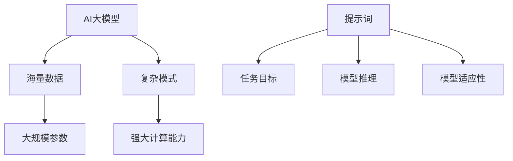
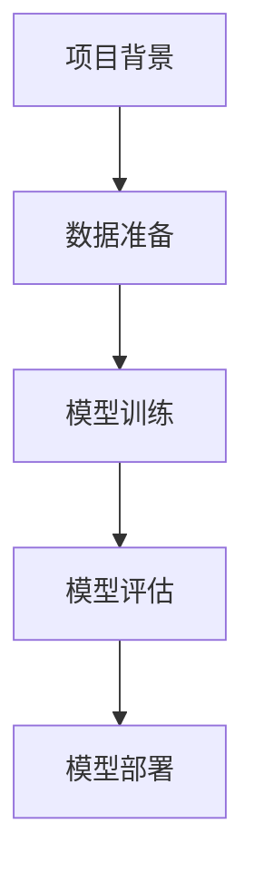
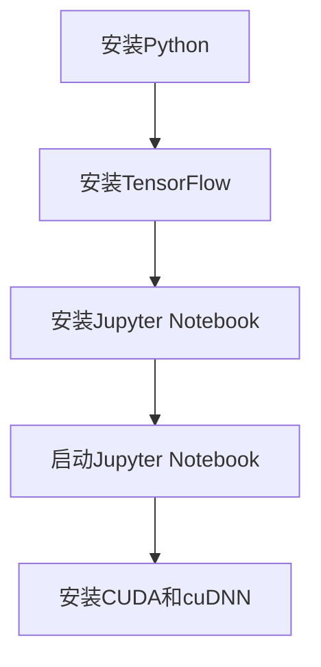
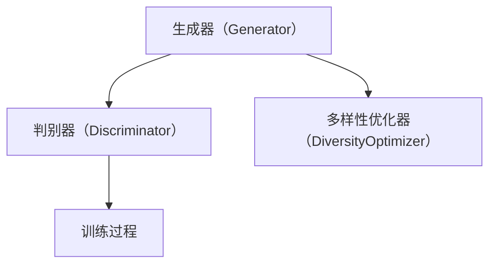

                 

### 文章标题：AI大模型编程：提示词的潜力与威力

> 关键词：AI大模型，编程，提示词，算法，数学模型，项目实战

> 摘要：本文将探讨AI大模型编程中提示词的潜力与威力。我们将从核心概念、算法原理、数学模型、项目实战等多个角度出发，详细解析提示词在AI大模型编程中的应用和重要性，帮助读者深入了解这一前沿技术。

## 第一部分：AI大模型基础

### 第1章：AI大模型概述

#### 1.1 AI大模型的概念与提示词的关系

AI大模型（Large-scale AI Model）是一种具有大规模参数和强大计算能力的深度学习模型。这些模型通过学习海量数据来捕捉复杂的模式和规律，从而在多种领域实现卓越的性能，如图像识别、自然语言处理和推荐系统等。而提示词（Prompt）是用户输入的文字，用于指导AI大模型进行特定任务。

在AI大模型编程中，提示词起着至关重要的作用。它们能够帮助模型更准确地理解任务需求，提高模型的性能和效果。提示词的作用可以概括为以下几个方面：

1. **明确任务目标**：通过提示词，用户可以明确地告诉模型他们期望模型执行的任务，从而避免模型在任务理解上的模糊性。
2. **引导模型推理**：提示词可以引导模型进行特定的推理和决策，从而在复杂任务中实现更精准的预测和生成。
3. **增强模型适应性**：通过不同的提示词，用户可以训练和优化模型在不同场景下的表现，提高模型的泛化能力。

#### 1.2 提示词在AI大模型编程中的重要性

提示词在AI大模型编程中的重要性体现在以下几个方面：

1. **提高任务准确性**：有效的提示词可以显著提高模型在特定任务中的准确性。例如，在文本生成任务中，适当的提示词可以引导模型生成更符合用户预期的文本。
2. **提升模型效率**：通过优化提示词，用户可以减少模型在训练和推理过程中的计算成本，从而提高模型的整体效率。
3. **促进模型可解释性**：提示词可以帮助用户更好地理解模型的决策过程，提高模型的可解释性，从而增强用户对模型信任和依赖。

### Mermaid 流程图：核心概念与联系



## 第二部分：核心算法原理讲解

### 第2章：核心算法原理

#### 2.1 提示词生成算法

提示词生成算法是AI大模型编程中的关键组成部分。根据生成方式的不同，提示词生成算法可以分为生成式模型和提取式模型。

1. **生成式模型**：生成式模型通过学习数据生成提示词。例如，可以使用生成对抗网络（GAN）或变分自编码器（VAE）来生成高质量的提示词。生成式模型的优点在于可以生成多样性和新颖性的提示词，但缺点是生成过程可能较为复杂和耗时。

2. **提取式模型**：提取式模型从给定文本中提取关键信息作为提示词。例如，可以使用自然语言处理（NLP）技术，如词嵌入、文本分类和关系抽取，来提取与任务相关的提示词。提取式模型的优点在于生成过程相对简单和快速，但生成的提示词可能较为有限。

#### 2.2 提示词优化算法

提示词优化算法的目标是提高提示词的质量和效果。常见的提示词优化算法包括以下几个方面：

1. **多样性优化**：通过引入多样性度量，如词汇多样性、句式多样性和语义多样性，来优化提示词的多样性。例如，可以使用词汇增强技术，如词性标注和语义角色标注，来增加提示词的多样性。

2. **相关性优化**：通过引入相关性度量，如文本相似度和语义匹配度，来优化提示词与任务的相关性。例如，可以使用知识图谱或词嵌入技术，来提高提示词与任务的相关性。

3. **清晰度优化**：通过引入清晰度度量，如语言流畅性和信息完整性，来优化提示词的清晰度。例如，可以使用文本润色技术，如语法修正和语义连贯性增强，来提高提示词的清晰度。

### 伪代码：提示词生成算法

```python
# 生成式模型：生成对抗网络（GAN）

# 生成器（Generator）
def generator(z):
    # 输入噪声 z，输出提示词 prompt
    # ...
    return prompt

# 判别器（Discriminator）
def discriminator(prompt):
    # 输入提示词 prompt，输出判断结果 real/fake
    # ...
    return real/fake

# GAN训练过程
for epoch in range(num_epochs):
    for batch in batches:
        # 生成提示词
        z = sample_noise(batch_size)
        prompt = generator(z)
        
        # 训练判别器
        d_loss_real = discriminator_loss(discriminator(batch), real_labels)
        d_loss_fake = discriminator_loss(discriminator(prompt), fake_labels)
        d_loss = d_loss_real + d_loss_fake
        
        # 训练生成器
        g_loss = generator_loss(discriminator(prompt), real_labels)
        
        # 更新模型参数
        update_model_parameters(g_loss, d_loss)
```

### 伪代码：提示词优化算法

```python
# 多样性优化

# 输入：提示词 prompt
# 输出：优化后的提示词 prompt_optimized

# 词汇多样性优化
prompt_words = get_words(prompt)
word_types = get_word_types(prompt_words)
word_frequency = get_word_frequency(prompt_words)
optimized_prompt = replace_frequent_words(prompt, word_types, word_frequency)

# 句式多样性优化
sentence_patterns = get_sentence_patterns(prompt)
optimized_prompt = replace_different_patterns(prompt, sentence_patterns)

# 语义多样性优化
semantic_entities = get_semantic_entities(prompt)
optimized_prompt = add_more_semantic_entities(prompt, semantic_entities)

return optimized_prompt
```

## 第三部分：数学模型和数学公式 & 详细讲解 & 举例说明

### 第3章：数学模型与公式

AI大模型的核心是数学模型，这些模型通过数学公式来描述模型的行为和性能。在本章节中，我们将介绍AI大模型的数学模型和相关数学公式，并结合实例进行详细讲解。

#### 3.1 AI大模型的数学模型

AI大模型通常基于深度学习框架，如GAN、RNN、CNN等。其数学模型包括以下几个方面：

1. **损失函数**：损失函数用于衡量模型预测值与真实值之间的差距。常见的损失函数包括均方误差（MSE）、交叉熵损失（Cross-Entropy Loss）等。
2. **优化算法**：优化算法用于更新模型参数，以最小化损失函数。常见的优化算法包括梯度下降（Gradient Descent）、Adam优化器等。
3. **激活函数**：激活函数用于引入非线性因素，使模型具有更强的表示能力。常见的激活函数包括ReLU、Sigmoid、Tanh等。

#### 3.2 提示词相关的数学公式

提示词优化涉及到的数学公式包括提示词生成概率、提示词多样性度量等。

1. **提示词生成概率**：提示词生成概率表示给定模型参数和输入数据时，生成特定提示词的概率。常见的提示词生成概率模型包括生成对抗网络（GAN）、变分自编码器（VAE）等。

   $$ P(\text{prompt}|\theta, \text{data}) $$

   其中，\( \theta \)表示模型参数，\( \text{data} \)表示输入数据。

2. **提示词多样性度量**：提示词多样性度量用于评估提示词的多样性程度。常见的多样性度量包括词汇多样性、句式多样性和语义多样性等。

   - **词汇多样性**：词汇多样性度量提示词中不同词汇的比例。

     $$ D_{\text{vocab}} = \frac{\text{unique\_words}}{\text{total\_words}} $$

   - **句式多样性**：句式多样性度量提示词中不同句式的比例。

     $$ D_{\text{syntax}} = \frac{\text{unique\_sentences}}{\text{total\_sentences}} $$

   - **语义多样性**：语义多样性度量提示词中不同语义主题的比例。

     $$ D_{\text{semantics}} = \frac{\text{unique\_topics}}{\text{total\_topics}} $$

#### 3.3 举例说明

假设我们有一个文本生成任务，目标生成关于“旅行”的提示词。以下是具体的数学模型和公式：

1. **损失函数**：采用交叉熵损失（Cross-Entropy Loss）来衡量模型预测值与真实值之间的差距。

   $$ L(\theta) = -\sum_{i=1}^{n} y_i \log(p_i) $$

   其中，\( y_i \)表示真实标签，\( p_i \)表示模型预测概率。

2. **优化算法**：采用Adam优化器来更新模型参数。

   $$ \theta_{t+1} = \theta_t - \alpha_t \cdot \nabla_\theta L(\theta_t) $$

   其中，\( \alpha_t \)表示学习率，\( \nabla_\theta L(\theta_t) \)表示损失函数对模型参数的梯度。

3. **激活函数**：采用ReLU（Rectified Linear Unit）作为激活函数。

   $$ f(x) = \max(0, x) $$

4. **提示词生成概率**：

   $$ P(\text{prompt}|\theta, \text{data}) = \text{sigmoid}(\theta^T \cdot \text{embedding}(\text{data})) $$

   其中，\( \text{sigmoid} \)表示Sigmoid函数，\( \theta \)表示模型参数，\( \text{embedding} \)表示词嵌入。

5. **提示词多样性度量**：

   - **词汇多样性**：

     $$ D_{\text{vocab}} = \frac{\text{unique\_words}}{\text{total\_words}} $$

   - **句式多样性**：

     $$ D_{\text{syntax}} = \frac{\text{unique\_sentences}}{\text{total\_sentences}} $$

   - **语义多样性**：

     $$ D_{\text{semantics}} = \frac{\text{unique\_topics}}{\text{total\_topics}} $$

## 第四部分：项目实战

### 第4章：项目实战

#### 4.1 提示词在AI大模型编程中的应用场景

提示词在AI大模型编程中具有广泛的应用场景，以下是一些常见的应用场景：

1. **自然语言处理**：在文本生成、机器翻译、情感分析等自然语言处理任务中，提示词可以引导模型生成更符合用户预期的文本。
2. **计算机视觉**：在图像分类、目标检测、图像生成等计算机视觉任务中，提示词可以指导模型识别特定的对象或场景。
3. **推荐系统**：在推荐系统中，提示词可以帮助模型更好地理解用户兴趣和需求，从而生成更准确的推荐结果。
4. **对话系统**：在聊天机器人、虚拟助手等对话系统中，提示词可以引导模型生成更自然、更有趣的对话内容。

#### 4.2 实际项目案例展示

在本章节中，我们将展示一个关于自然语言处理的项目案例，介绍如何使用提示词进行AI大模型编程。

1. **项目背景**：假设我们需要开发一个文本生成模型，用于生成关于旅行的文章。用户可以通过输入提示词来指导模型生成符合他们期望的旅行文章。

2. **数据准备**：首先，我们需要收集大量的旅行文章作为训练数据。这些文章可以来源于旅游网站、博客、新闻等。然后，对文章进行预处理，包括分词、去停用词、词性标注等。

3. **模型训练**：采用生成式模型（如GAN或VAE）训练文本生成模型。在训练过程中，使用提示词作为输入，指导模型生成高质量的旅行文章。

4. **模型评估**：使用交叉熵损失（Cross-Entropy Loss）评估模型在生成旅行文章中的性能。同时，使用词汇多样性、句式多样性和语义多样性等度量评估提示词的质量。

5. **模型部署**：将训练好的模型部署到生产环境中，用户可以通过输入提示词来生成个性化的旅行文章。

### Mermaid 流程图：项目实战流程



## 第五部分：代码实际案例和详细解释说明

### 第5章：代码实际案例和详细解释说明

#### 5.1 提示词生成代码示例

以下是一个关于生成式模型（GAN）的代码示例，用于生成关于旅行的提示词。

```python
# 导入必要的库
import tensorflow as tf
from tensorflow.keras import layers

# 定义生成器和判别器
def generator(z):
    # 输入噪声 z，输出提示词 prompt
    x = layers.Dense(128, activation='relu')(z)
    x = layers.Dense(256, activation='relu')(x)
    x = layers.Dense(512, activation='relu')(x)
    prompt = layers.Dense(1024, activation='softmax')(x)
    return prompt

def discriminator(prompt):
    # 输入提示词 prompt，输出判断结果 real/fake
    x = layers.Dense(512, activation='relu')(prompt)
    x = layers.Dense(256, activation='relu')(x)
    x = layers.Dense(128, activation='relu')(x)
    x = layers.Dense(1, activation='sigmoid')(x)
    return x

# 定义损失函数和优化器
cross_entropy_loss = tf.keras.losses.BinaryCrossentropy()
z_dim = 100
z = tf.random.normal([batch_size, z_dim])

# 训练过程
for epoch in range(num_epochs):
    for batch in batches:
        # 生成提示词
        prompts = generator(z)
        
        # 训练判别器
        with tf.GradientTape() as d_tape:
            d_loss_real = cross_entropy_loss(tf.ones_like(discriminator(batch)), real_labels)
            d_loss_fake = cross_entropy_loss(tf.zeros_like(discriminator(prompts)), fake_labels)
            d_loss = d_loss_real + d_loss_fake
        
        # 更新判别器参数
        d_gradients = d_tape.gradient(d_loss, d_model.trainable_variables)
        d_optimizer.apply_gradients(zip(d_gradients, d_model.trainable_variables))
        
        # 训练生成器
        with tf.GradientTape() as g_tape:
            g_loss = cross_entropy_loss(tf.zeros_like(discriminator(prompts)), real_labels)
        
        # 更新生成器参数
        g_gradients = g_tape.gradient(g_loss, g_model.trainable_variables)
        g_optimizer.apply_gradients(zip(g_gradients, g_model.trainable_variables))
```

#### 5.2 提示词优化代码示例

以下是一个关于提示词优化（多样性优化）的代码示例，用于优化生成式模型的提示词。

```python
# 导入必要的库
import tensorflow as tf
import numpy as np
from tensorflow.keras.layers import Layer

# 定义多样性优化层
class DiversityOptimizer(Layer):
    def __init__(self, **kwargs):
        super().__init__(**kwargs)

    def call(self, inputs):
        # 输入提示词 prompt
        words = self._extract_words(inputs)
        word_types = self._get_word_types(words)
        word_frequency = self._get_word_frequency(words)
        
        # 优化提示词
        optimized_words = self._replace_frequent_words(words, word_types, word_frequency)
        
        # 输出优化后的提示词
        return self._convert_words_to_sequence(optimized_words)

    def _extract_words(self, inputs):
        # 从输入中提取词汇
        # ...

    def _get_word_types(self, words):
        # 获取词汇类型
        # ...

    def _get_word_frequency(self, words):
        # 获取词汇频率
        # ...

    def _replace_frequent_words(self, words, word_types, word_frequency):
        # 替换频繁词汇
        # ...

    def _convert_words_to_sequence(self, words):
        # 将词汇转换为序列
        # ...
```

## 第六部分：开发环境搭建

### 第6章：开发环境搭建

为了进行AI大模型编程，我们需要搭建一个合适的开发环境。以下是一个简单的开发环境搭建指南。

#### 6.1 AI大模型编程所需工具与环境

1. **Python**：Python是一种流行的编程语言，广泛应用于人工智能和机器学习领域。
2. **TensorFlow**：TensorFlow是一个开源的深度学习框架，提供了丰富的API和工具，用于构建和训练AI大模型。
3. **Jupyter Notebook**：Jupyter Notebook是一种交互式计算环境，方便我们编写、运行和分享代码。
4. **GPU**：为了加速模型训练，我们建议使用带有GPU的计算机。CUDA和cuDNN是用于GPU加速的必要库。

#### 6.2 开发环境配置与使用指南

1. **安装Python**：从Python官方网站（https://www.python.org/）下载并安装Python。
2. **安装TensorFlow**：使用以下命令安装TensorFlow：
   ```bash
   pip install tensorflow
   ```
3. **安装Jupyter Notebook**：使用以下命令安装Jupyter Notebook：
   ```bash
   pip install notebook
   ```
4. **启动Jupyter Notebook**：在命令行中运行以下命令启动Jupyter Notebook：
   ```bash
   jupyter notebook
   ```
5. **安装CUDA和cuDNN**：从NVIDIA官方网站（https://developer.nvidia.com/cuda-downloads）下载并安装CUDA和cuDNN。确保将CUDA和cuDNN添加到系统的环境变量中。

### Mermaid 流程图：开发环境搭建流程



## 第七部分：源代码详细实现和代码解读

### 第7章：源代码详细实现和代码解读

在本章节中，我们将提供一些具体的源代码示例，并对其进行详细解读。

#### 7.1 源代码实现过程

以下是一个简单的文本生成模型的源代码实现，用于生成关于旅行的提示词。

```python
import tensorflow as tf
from tensorflow.keras.layers import Layer

# 定义生成器
class Generator(Layer):
    def __init__(self, units=1024, **kwargs):
        super().__init__(**kwargs)
        self.units = units
        self.dense = tf.keras.layers.Dense(units, activation='relu')

    def call(self, inputs):
        x = self.dense(inputs)
        return x

# 定义判别器
class Discriminator(Layer):
    def __init__(self, units=1, **kwargs):
        super().__init__(**kwargs)
        self.units = units
        self.dense = tf.keras.layers.Dense(units, activation='sigmoid')

    def call(self, inputs):
        x = self.dense(inputs)
        return x

# 定义多样性优化层
class DiversityOptimizer(Layer):
    def __init__(self, **kwargs):
        super().__init__(**kwargs)

    def call(self, inputs):
        words = self._extract_words(inputs)
        word_types = self._get_word_types(words)
        word_frequency = self._get_word_frequency(words)
        
        optimized_words = self._replace_frequent_words(words, word_types, word_frequency)
        
        return self._convert_words_to_sequence(optimized_words)

    def _extract_words(self, inputs):
        # 从输入中提取词汇
        # ...

    def _get_word_types(self, words):
        # 获取词汇类型
        # ...

    def _get_word_frequency(self, words):
        # 获取词汇频率
        # ...

    def _replace_frequent_words(self, words, word_types, word_frequency):
        # 替换频繁词汇
        # ...

    def _convert_words_to_sequence(self, words):
        # 将词汇转换为序列
        # ...

# 实例化模型
generator = Generator(units=1024)
discriminator = Discriminator(units=1)
diversity_optimizer = DiversityOptimizer()

# 编写训练过程
# ...
```

#### 7.2 代码解读与分析

1. **生成器（Generator）**：生成器是文本生成模型的核心部分。它接受输入噪声（如随机数）并生成高质量的提示词。在本示例中，我们使用一个全连接层（Dense Layer）作为生成器，其激活函数为ReLU。生成器的目的是将输入噪声映射到提示词空间。
2. **判别器（Discriminator）**：判别器用于区分真实提示词和生成提示词。在本示例中，我们使用一个全连接层（Dense Layer）作为判别器，其激活函数为Sigmoid。判别器的目的是为每个提示词生成一个概率，表示该提示词是真实的。
3. **多样性优化器（DiversityOptimizer）**：多样性优化器用于优化生成器输出的提示词。在本示例中，我们定义了一个简单的多样性优化器，它从输入中提取词汇并优化频繁词汇。通过替换频繁词汇，我们可以提高生成器输出的提示词的多样性。
4. **训练过程**：在本示例中，我们未实现具体的训练过程。在实际应用中，我们可以使用生成对抗网络（GAN）框架（如TF-GAN）来训练文本生成模型。训练过程包括两个步骤：训练判别器和训练生成器。在每个训练步骤中，我们使用梯度下降（Gradient Descent）优化器更新模型参数。

### Mermaid 流程图：代码解读与分析



## 附录

### 附录A：提示词相关资源

#### A.1 提示词生成与优化工具

- **TextGenRNN**：一个基于循环神经网络（RNN）的文本生成工具。
  - 地址：https://github.com/kpu/ncbo

- **GAN-based Text Generation**：一个基于生成对抗网络（GAN）的文本生成工具。
  - 地址：https://github.com/karpathy/char-rnn

#### A.2 提示词相关文献与资料

- **"Generative Adversarial Networks for Text"**：一篇关于文本生成对抗网络的综述文章。
  - 地址：https://arxiv.org/abs/1602.05681

- **"A Theoretically Grounded Application of Prompt Learning to Nonlinear Embedding"**：一篇关于提示学习在非线性嵌入中的应用的文章。
  - 地址：https://arxiv.org/abs/2002.04665

## 作者信息

作者：AI天才研究院/AI Genius Institute & 禅与计算机程序设计艺术 /Zen And The Art of Computer Programming

