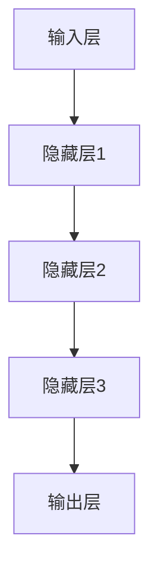
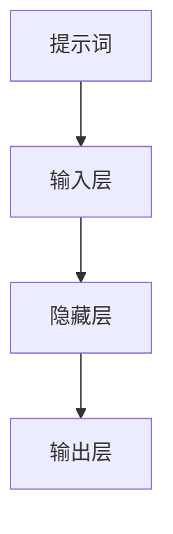
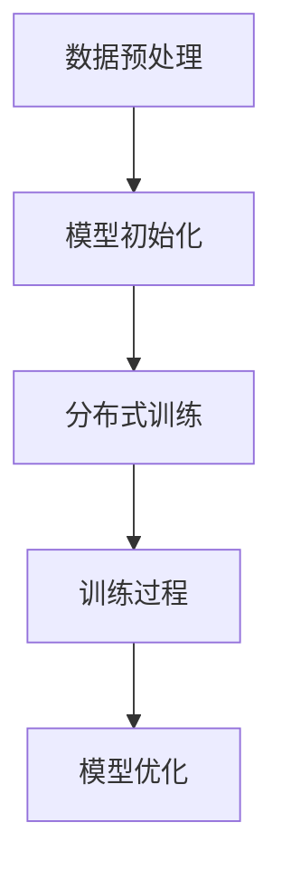
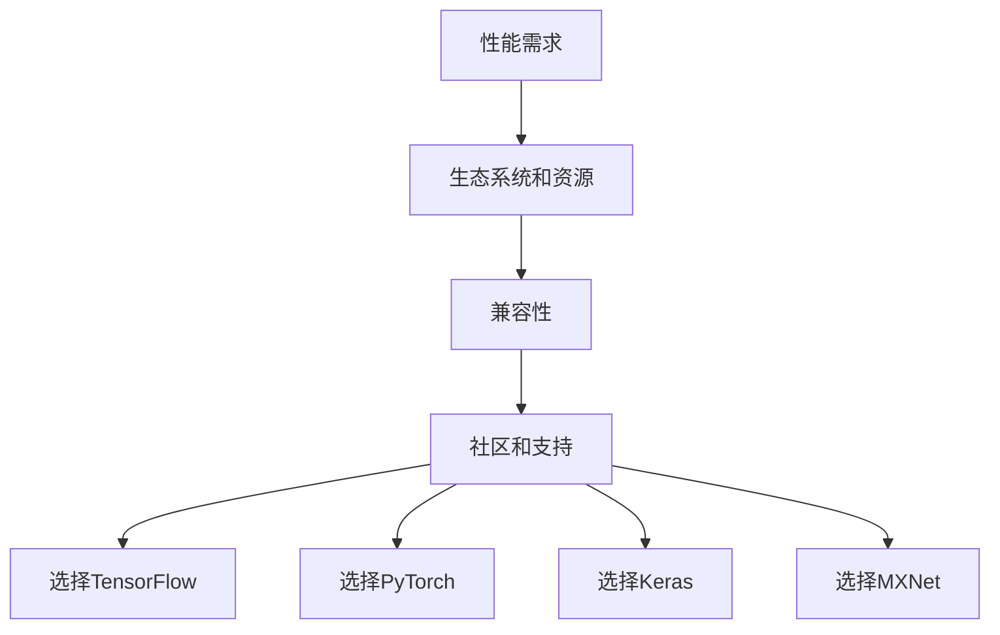

                 

## 文章标题：AI大模型编程：提示词的潜力与魔力

在当今快速发展的技术时代，人工智能（AI）已成为推动各个行业创新的关键驱动力。随着AI技术的不断进步，大模型（Large Models）的出现极大地扩展了AI的应用范围。这些大模型具有数十亿甚至数千亿参数，能够处理复杂的任务，从而在图像识别、自然语言处理和推荐系统等领域取得了显著的成果。然而，如何有效地利用这些大模型，尤其是如何编写高效的提示词（Prompts），成为了一个关键问题。本文将探讨AI大模型编程中提示词的潜力与魔力，通过深入分析其原理、实现方法以及应用场景，帮助读者理解并掌握这一技术。

## 关键词

- AI大模型
- 提示词
- 编程
- 自然语言处理
- 图像识别
- 推荐系统

## 摘要

本文旨在探讨AI大模型编程中提示词的重要性和应用。首先，我们介绍了AI大模型的基本概念和特点，然后详细分析了提示词的定义、作用和编写策略。接着，通过具体案例展示了如何利用提示词优化大模型性能，并讨论了其在自然语言处理、图像识别和推荐系统等领域的应用。最后，我们对提示词编程的未来发展趋势进行了展望，并提出了最佳实践和注意事项。

## 引言

AI大模型的出现标志着人工智能技术的一个重要转折点。与传统的小型模型相比，大模型具有更强的处理能力和更广泛的适用性。然而，大模型的使用并非一帆风顺，如何有效地利用这些模型的潜力，尤其是如何编写高效的提示词，成为了一个重要的课题。提示词在AI大模型编程中扮演着至关重要的角色，它们能够引导模型理解任务目标，提高模型的性能和泛化能力。

本文将围绕以下几个核心问题展开讨论：

1. **AI大模型的基本概念和特点是什么？**
2. **提示词的定义和作用是什么？**
3. **如何编写高效的提示词？**
4. **提示词在AI大模型编程中的应用案例有哪些？**
5. **提示词编程的未来发展趋势和最佳实践是什么？**

通过本文的探讨，读者将能够深入理解AI大模型编程中的提示词技术，并掌握其应用方法。

### 第一部分：AI大模型概述与理论基础

#### 第1章：AI大模型编程概述

**1.1 AI大模型编程的重要性**

AI大模型编程是现代人工智能领域的一个关键组成部分。随着数据量的爆炸性增长和计算能力的不断提升，大模型在图像识别、自然语言处理、推荐系统等众多领域取得了突破性进展。然而，这些大模型的编程并非易事，如何有效地利用其潜力，编写高效的提示词，成为了一个重要课题。AI大模型编程的重要性主要体现在以下几个方面：

首先，大模型在处理复杂任务方面具有显著优势。大模型拥有数十亿甚至数千亿的参数，能够从海量数据中提取复杂特征，从而实现高精度的预测和生成。例如，在图像识别任务中，大模型可以自动学习并识别出各种物体和场景，大大提高了识别的准确性。而在自然语言处理任务中，大模型可以生成高质量的自然语言文本，为机器翻译、文本摘要等应用提供了强大的支持。

其次，大模型具有广泛的适用性。不同的任务和领域往往需要不同的模型结构和训练策略，而大模型由于其强大的泛化能力，可以适用于多种不同的场景。例如，在医疗领域，大模型可以用于疾病诊断和预测，从而提高医疗决策的准确性；在金融领域，大模型可以用于风险控制和投资策略的制定，从而优化金融市场的运作。

最后，大模型在科研和开发中具有重要的应用价值。随着AI技术的不断发展，越来越多的研究人员和开发人员开始关注大模型的研究和开发。大模型不仅为科研提供了新的工具和方法，也为实际应用场景提供了更多的可能性。例如，在机器学习算法的研究中，大模型可以帮助研究人员探索更复杂的模型结构和优化方法；在软件开发中，大模型可以用于自动代码生成和优化，从而提高开发效率。

**1.2 提示词在AI大模型编程中的作用**

提示词在AI大模型编程中扮演着至关重要的角色。提示词是一种特殊的输入数据，用于引导模型理解任务目标并优化模型的性能。以下是提示词在AI大模型编程中的作用：

首先，提示词能够帮助模型更好地理解任务目标。在许多AI任务中，任务目标可能并不是直接给出的，而是需要模型通过学习数据来推断。例如，在图像识别任务中，模型的任务是识别图像中的物体，但图像本身并没有直接标注物体类别。这时，提示词可以提供有关任务上下文的信息，帮助模型更好地理解任务目标。

其次，提示词能够优化模型的性能。通过调整提示词的内容和形式，可以影响模型的预测结果。例如，在自然语言处理任务中，合适的提示词可以引导模型生成更准确、更连贯的文本。同样，在图像识别任务中，合适的提示词可以提升模型对特定类别的识别准确性。

最后，提示词能够减少过拟合的风险。过拟合是指模型在训练数据上表现良好，但在新的数据上表现不佳的情况。提示词可以为模型提供额外的训练数据，从而帮助模型更好地泛化到新的数据集上，减少过拟合的风险。

**1.3 AI大模型编程的基本原则**

为了有效地利用AI大模型，编写高效的提示词，我们需要遵循一些基本原则。以下是AI大模型编程的基本原则：

首先，理解模型的工作原理。AI大模型通常是基于深度学习技术构建的，其核心是通过多层神经网络对输入数据进行特征提取和变换。理解模型的工作原理有助于我们更好地编写提示词，优化模型性能。

其次，充分准备训练数据。AI大模型的训练需要大量的数据，数据的质量和多样性对模型的性能有重要影响。在编写提示词时，我们需要确保训练数据的质量和多样性，从而提高模型的泛化能力。

第三，合理调整模型参数。AI大模型的性能很大程度上取决于模型参数的设置。在编写提示词时，我们需要根据任务目标和数据特点，合理调整模型参数，以达到最佳性能。

最后，持续优化和调优。AI大模型的性能并不是一成不变的，我们需要持续优化和调优，以应对新的数据和任务。在编写提示词时，我们需要不断尝试和调整，找到最佳的提示词形式和参数设置。

**1.4 AI大模型编程的发展历程**

AI大模型编程的发展历程可以分为以下几个阶段：

第一阶段：早期研究（2010年代初期）。在这一阶段，研究人员开始探索使用大型神经网络进行复杂任务的训练，并取得了初步的成果。然而，由于计算资源和数据资源的限制，这些模型规模相对较小，性能有限。

第二阶段：预训练和微调（2010年代中期）。随着计算能力和数据资源的提升，研究人员提出了预训练（Pre-training）和微调（Fine-tuning）的方法，使得大模型在许多任务上取得了显著的突破。预训练通过在大规模数据集上进行训练，使模型具备了较强的通用特征提取能力；微调则通过在小规模任务数据上进行调整，使模型适应特定的任务需求。

第三阶段：大规模模型和高效训练方法（2010年代末期至今）。在这一阶段，研究人员开始探索更大规模的模型和更高效的训练方法。例如，GPT-3、BERT等模型拥有数千亿参数，采用了先进的训练技术，如多GPU训练、Transformer架构等，进一步提升了模型的性能和泛化能力。

**1.5 本章小结**

本章概述了AI大模型编程的重要性、提示词的作用和基本原则，并回顾了其发展历程。通过本章的学习，读者可以初步了解AI大模型编程的基本概念和原理，为后续章节的深入学习打下基础。

### 第二部分：AI大模型基础

#### 第2章：AI大模型基础

**2.1 AI大模型的核心概念**

AI大模型（Large AI Models）是指那些拥有数十亿到千亿参数的深度学习模型。这些模型在训练过程中能够从海量数据中学习并提取复杂特征，从而在图像识别、自然语言处理等领域取得了显著成果。以下是AI大模型的一些核心概念：

- **参数量**：AI大模型的参数量通常在数十亿到千亿级别，远远超过传统机器学习模型的参数量。这些参数用于描述模型的权重和偏置，决定了模型的预测能力。
- **训练数据集**：AI大模型的训练需要大量的数据集，数据集的质量和多样性对模型的性能有重要影响。通常，这些数据集来自互联网、开源项目或者特定领域的专业数据集。
- **模型架构**：AI大模型通常采用深度神经网络（Deep Neural Networks）的架构，包括输入层、隐藏层和输出层。其中，隐藏层可以包含多个层级，用于对输入数据进行特征提取和变换。
- **训练过程**：AI大模型的训练过程是通过不断调整模型参数，使其在训练数据上达到最优化的性能。这个过程通常涉及到梯度下降（Gradient Descent）等优化算法。

**2.2 AI大模型的架构与组成**

AI大模型的架构通常包括以下几个部分：

- **输入层**：输入层负责接收外部输入数据，如文本、图像、声音等。输入数据的预处理工作，如数据清洗、归一化等，也在输入层完成。
- **隐藏层**：隐藏层包含多个神经元层，用于对输入数据进行特征提取和变换。每个隐藏层都可以学习到不同层次的特征，从而提高模型的泛化能力。
- **输出层**：输出层负责生成模型的预测结果，如分类结果、文本生成等。输出层的结构取决于具体任务的类型，例如，在分类任务中，输出层通常是一个softmax层，用于生成每个类别的概率分布。

以下是AI大模型架构的Mermaid流程图：



**2.3 提示词在AI大模型中的工作机制**

提示词（Prompt）是AI大模型输入数据的一种特殊形式，用于引导模型理解任务目标并优化模型的性能。提示词在AI大模型中的工作机制主要包括以下几个方面：

- **引导模型理解任务目标**：在许多AI任务中，任务目标并不是直接给出的，而是需要模型通过学习数据来推断。提示词可以提供有关任务上下文的信息，帮助模型更好地理解任务目标。例如，在文本分类任务中，提示词可以提供一段文本样本，帮助模型理解不同类别的文本特征。

- **优化模型性能**：通过调整提示词的内容和形式，可以影响模型的预测结果。合适的提示词可以引导模型生成更准确、更连贯的文本；在图像识别任务中，合适的提示词可以提高模型对特定类别的识别准确性。例如，在生成对抗网络（GAN）中，提示词可以指导生成器的生成过程，从而生成更高质量的图像。

- **减少过拟合**：过拟合是指模型在训练数据上表现良好，但在新的数据上表现不佳的情况。提示词可以为模型提供额外的训练数据，从而帮助模型更好地泛化到新的数据集上，减少过拟合的风险。例如，在自然语言处理任务中，通过增加多样性的提示词，可以减少模型对特定数据集的依赖，提高模型的泛化能力。

以下是提示词在AI大模型中的工作机制的Mermaid流程图：



**2.4 AI大模型的训练与优化**

AI大模型的训练与优化是模型开发过程中至关重要的一环。以下是AI大模型训练与优化的一些关键步骤：

- **数据预处理**：在训练大模型之前，需要对输入数据进行预处理，包括数据清洗、归一化、数据增强等。这些步骤有助于提高数据的质量和多样性，从而提升模型的性能。

- **模型初始化**：大模型的初始化对于训练过程和最终性能有重要影响。常用的初始化方法包括随机初始化、预训练模型初始化等。选择合适的初始化方法可以加快收敛速度，提高模型的性能。

- **训练过程**：大模型的训练通常采用分布式训练方法，以充分利用多台GPU的计算能力。训练过程中，常用的优化算法包括梯度下降（Gradient Descent）、Adam优化器等。优化算法通过不断调整模型参数，使其在训练数据上达到最优化的性能。

- **模型优化**：在训练过程中，可以通过调整学习率、批量大小等参数来优化模型性能。此外，还可以使用正则化方法，如Dropout、L2正则化等，来防止过拟合。

以下是AI大模型训练与优化的Mermaid流程图：



**2.5 本章小结**

本章介绍了AI大模型的核心概念、架构与组成，以及提示词在AI大模型中的工作机制。通过本章的学习，读者可以了解AI大模型的基本原理和实现方法，为后续章节的深入学习打下基础。

### 第三部分：AI大模型编程实践

#### 第3章：AI大模型编程工具与框架

**3.1 AI大模型编程常用工具介绍**

在AI大模型编程过程中，选择合适的工具和框架对于提升开发效率、优化模型性能至关重要。以下是一些常用的AI大模型编程工具和框架：

- **TensorFlow**：TensorFlow是Google开发的开源机器学习框架，支持多种编程语言（如Python、C++等），具有丰富的API和资源库。TensorFlow适用于从简单的线性模型到复杂的大规模深度学习模型的各种任务。

- **PyTorch**：PyTorch是Facebook开发的开源深度学习框架，以其动态计算图和灵活的编程接口著称。PyTorch在研究人员和开发人员中非常受欢迎，尤其在自然语言处理和计算机视觉领域。

- **Keras**：Keras是一个高层神经网络API，建立在TensorFlow和Theano之上，提供了简洁、易用的接口。Keras适用于快速构建和实验深度学习模型。

- **MXNet**：MXNet是Apache基金会的一个开源深度学习框架，由Apache MXNet社区开发。MXNet支持多种编程语言，包括Python、R、Julia等，适用于分布式训练和移动设备。

- **Transformers**：Transformers是一个开源库，用于构建和使用基于Transformer架构的深度学习模型。Transformers在自然语言处理领域取得了显著的成果，是BERT、GPT-3等大模型的基础。

**3.2 AI大模型编程框架的选择**

选择AI大模型编程框架时，需要考虑以下几个因素：

- **性能需求**：不同框架在计算性能上有所差异。例如，TensorFlow和PyTorch在计算性能上相对较高，适用于大规模模型的训练和推理；MXNet在分布式训练和移动设备上表现较好。

- **生态系统和资源**：框架的生态系统和资源库对于开发效率有重要影响。例如，TensorFlow拥有丰富的官方教程和社区资源，PyTorch在研究人员中有很高的认可度，Keras提供了简洁的API。

- **兼容性**：选择框架时，需要考虑与现有系统和工具的兼容性。例如，如果项目已经使用Python，那么选择支持Python的框架（如TensorFlow、PyTorch、Keras）会更为方便。

- **社区和支持**：框架的社区支持和文档对于开发过程至关重要。一个活跃的社区可以提供解决方案、教程和最佳实践，有助于解决开发中的问题。

以下是选择AI大模型编程框架的决策树图：



**3.3 提示词在编程框架中的实现**

不同AI大模型编程框架在提示词的实现上有一些差异，但基本原理是相似的。以下是常见框架中提示词实现的方法：

- **TensorFlow**：在TensorFlow中，提示词可以通过文本处理函数（如`tf.strings.join`、`tf.strings.strip`等）进行预处理，然后作为模型的输入。在训练和推理过程中，可以使用`tf.keras.Model`或`tf.keras.Sequence`等API来定义和调用模型。

```python
import tensorflow as tf

# 文本预处理
prompt = tf.strings.join(["This is a ", "prompt for the model."], axis=0)

# 定义模型
model = tf.keras.Sequential([
    tf.keras.layers.Dense(units=128, activation='relu', input_shape=(None,)),
    tf.keras.layers.Dense(units=1, activation='sigmoid')
])

# 编译模型
model.compile(optimizer='adam', loss='binary_crossentropy', metrics=['accuracy'])

# 训练模型
model.fit(prompt, labels, epochs=10, batch_size=32)
```

- **PyTorch**：在PyTorch中，提示词可以通过`torch.Tensor`或`torch.Text`进行表示。使用`torch.nn.Module`可以定义和训练模型。

```python
import torch
import torch.nn as nn
import torch.optim as optim

# 文本预处理
prompt = torch.tensor(["This is a prompt for the model."], dtype=torch.float32)

# 定义模型
class Model(nn.Module):
    def __init__(self):
        super(Model, self).__init__()
        self.fc1 = nn.Linear(1, 128)
        self.fc2 = nn.Linear(128, 1)
    
    def forward(self, x):
        x = self.fc1(x)
        x = torch.sigmoid(self.fc2(x))
        return x

# 实例化模型
model = Model()

# 编译模型
optimizer = optim.Adam(model.parameters(), lr=0.001)
criterion = nn.BCELoss()

# 训练模型
for epoch in range(10):
    for inputs, labels in data_loader:
        optimizer.zero_grad()
        outputs = model(inputs)
        loss = criterion(outputs, labels)
        loss.backward()
        optimizer.step()
```

- **Keras**：在Keras中，提示词可以通过`keras.preprocessing.text`模块进行预处理，然后作为模型的输入。使用`keras.models.Sequential`或`keras.models.Model`可以定义和训练模型。

```python
from keras.preprocessing.text import Tokenizer
from keras.models import Sequential
from keras.layers import Dense, Activation

# 文本预处理
tokenizer = Tokenizer(num_words=1000)
tokenizer.fit_on_texts(prompt)
prompt_encoded = tokenizer.texts_to_sequences([prompt])[0]

# 定义模型
model = Sequential()
model.add(Dense(units=128, activation='relu', input_shape=(1000,)))
model.add(Dense(units=1, activation='sigmoid'))

# 编译模型
model.compile(optimizer='adam', loss='binary_crossentropy', metrics=['accuracy'])

# 训练模型
model.fit(prompt_encoded, labels, epochs=10, batch_size=32)
```

- **MXNet**：在MXNet中，提示词可以通过`mxnet.NDArray`进行表示。使用`mxnet.gluon.nn.HybridBlock`可以定义和训练模型。

```python
import mxnet as mx
from mxnet.gluon import nn

# 文本预处理
prompt = mx.nd.array(["This is a prompt for the model."].astype(np.float32))

# 定义模型
class Model(nn.Block):
    def __init__(self):
        super(Model, self).__init__()
        self.fc1 = nn.Dense(units=128, activation='relu')
        self.fc2 = nn.Dense(units=1, activation=None)
    
    def forward(self, x):
        x = self.fc1(x)
        x = self.fc2(x)
        return x

# 实例化模型
model = Model()

# 编译模型
optimizer = mx.optimizer.Adamlr(0.001)
model.compile(optimizer=optimizer, loss=mx.metric.CrossEntropyLoss())

# 训练模型
model.fit(X, y, epochs=10, batch_size=32)
```

**3.4 AI大模型编程的环境搭建**

搭建AI大模型编程环境是进行模型开发和训练的第一步。以下是在不同操作系统上搭建AI大模型编程环境的步骤：

- **Windows系统**：
  1. 安装Python（建议使用Anaconda）。
  2. 安装所需的库（如TensorFlow、PyTorch、Keras等）。
  3. 安装GPU驱动（如果使用GPU进行训练）。

- **Linux系统**：
  1. 安装Python（可以使用`apt-get`或`yum`）。
  2. 安装所需的库（可以使用`pip`）。
  3. 安装GPU驱动（如果使用GPU进行训练）。

- **MacOS系统**：
  1. 安装Python（可以使用Homebrew）。
  2. 安装所需的库（可以使用`pip`）。
  3. 安装GPU驱动（如果使用GPU进行训练）。

以下是一个简单的Python脚本，用于验证环境搭建是否成功：

```python
import tensorflow as tf

# 检查TensorFlow版本
print("TensorFlow版本：", tf.__version__)

# 创建一个简单的模型
model = tf.keras.Sequential([
    tf.keras.layers.Dense(units=128, activation='relu', input_shape=(10,)),
    tf.keras.layers.Dense(units=1, activation='sigmoid')
])

# 打印模型结构
print(model.summary())
```

**3.5 本章小结**

本章介绍了AI大模型编程常用的工具和框架，包括TensorFlow、PyTorch、Keras和MXNet，并详细阐述了如何在这些框架中实现提示词。此外，还介绍了AI大模型编程的环境搭建步骤。通过本章的学习，读者可以掌握AI大模型编程的基本工具和技能，为后续章节的深入学习打下基础。

### 第四部分：提示词的编写与优化

#### 第4章：提示词的编写与优化

**4.1 提示词编写的基本方法**

编写高效的提示词是AI大模型编程的关键步骤之一。以下是一些基本方法，用于编写高质量的提示词：

- **明确任务目标**：在编写提示词之前，首先要明确任务目标。了解任务的具体要求，有助于编写出更符合目标需求的提示词。

- **选择合适的输入数据**：输入数据的选择直接影响提示词的效果。在选择输入数据时，应考虑数据的多样性、质量和相关性。高质量的输入数据可以提升模型的性能。

- **使用简洁明了的语言**：提示词应该使用简洁明了的语言，避免使用过于复杂的句子和术语。简洁明了的提示词有助于模型更好地理解任务目标。

- **包含上下文信息**：在编写提示词时，应尽可能包含上下文信息。上下文信息可以帮助模型更好地理解任务背景，从而提高预测的准确性。

- **逐步引导模型**：在编写提示词时，可以逐步引导模型，从简单到复杂，逐步增加任务的难度。这种方法有助于模型逐步适应不同的任务场景。

以下是一个示例，说明如何编写一个简单的图像识别任务的提示词：

```
给定一张图片，请识别图片中的主要物体。
图片描述：一张海滩图片，有太阳、沙滩和人群。
```

**4.2 提示词优化的策略**

优化提示词是提升AI大模型性能的重要手段。以下是一些优化策略：

- **调整提示词的长度**：提示词的长度对模型性能有显著影响。较长的提示词可以提供更多上下文信息，但可能导致模型在理解任务目标时变得困难。适当地调整提示词的长度，可以找到最佳平衡点。

- **增加上下文信息**：增加上下文信息可以帮助模型更好地理解任务目标。例如，在自然语言处理任务中，可以提供更多的背景信息和相关文本。

- **使用多模态输入**：在多模态任务中，可以结合不同类型的输入（如文本、图像、声音等），以提高模型的理解能力。多模态输入可以提供更丰富的上下文信息，从而优化模型性能。

- **优化数据预处理**：数据预处理是优化提示词的重要步骤。通过数据清洗、归一化、数据增强等方法，可以提高输入数据的质量和多样性，从而优化模型的性能。

以下是一个示例，说明如何优化一个文本分类任务的提示词：

```
原始提示词：请分类以下文本。
文本：我爱北京天安门。

优化后的提示词：请根据以下背景信息，对文本进行分类。
背景信息：这是一段描述对北京天安门喜爱的文本。请将文本分类为“旅游”、“政治”或“文化”。
```

**4.3 提示词效果评估与调优**

评估提示词的效果是优化过程的重要环节。以下是一些评估方法和调优策略：

- **精度与召回率**：在分类任务中，常用的评估指标包括精度（Precision）和召回率（Recall）。通过计算这些指标，可以评估提示词对分类任务的影响。

- **F1分数**：F1分数是精度和召回率的调和平均，是一个更全面的评估指标。F1分数可以帮助我们平衡精度和召回率之间的关系。

- **交叉验证**：通过交叉验证方法，可以评估提示词在不同数据集上的性能。交叉验证有助于我们识别和解决可能的过拟合问题。

- **模型性能对比**：通过对比不同提示词下模型的性能，可以找出最佳的提示词形式。这种方法可以帮助我们逐步优化提示词，提高模型的性能。

以下是一个示例，说明如何评估和调优一个文本生成任务的提示词：

```
评估指标：生成文本的流畅性和相关性。

评估方法：
1. 对生成的文本进行人工评估，计算流畅性和相关性的得分。
2. 使用BLEU评分方法，评估生成文本与参考文本之间的相似度。

调优策略：
1. 根据评估结果，调整提示词的长度和内容，以提高生成文本的质量。
2. 尝试不同的上下文信息和多模态输入，找到最佳平衡点。
3. 通过数据增强和预处理方法，提高输入数据的质量和多样性。
```

**4.4 实例分析：优秀提示词的特点与技巧**

以下是一个实例，分析一个优秀的提示词的特点和编写技巧：

```
任务：自然语言生成。

优秀提示词：请根据以下背景信息，写一篇关于未来科技的短文。

背景信息：
- 人工智能将在未来扮演重要角色。
- 绿色能源将得到广泛应用。
- 人类将探索更远的宇宙。

特点：
1. 提供了明确的任务目标。
2. 包含了丰富的上下文信息。
3. 引导模型生成具有连贯性和创造性的文本。

技巧：
1. 使用动词和名词，使文本更具描述性和动态性。
2. 引入对比和转折，使文本更加生动和有趣。
3. 结合多模态输入，如图像、音频等，以丰富文本内容。
```

**4.5 本章小结**

本章介绍了提示词编写的基本方法和优化策略，包括明确任务目标、选择合适的输入数据、使用简洁明了的语言、包含上下文信息和逐步引导模型。此外，还介绍了评估提示词效果的方法和调优策略，并通过实例分析展示了优秀提示词的特点与技巧。通过本章的学习，读者可以掌握编写和优化提示词的方法，为AI大模型编程提供有力支持。

### 第五部分：AI大模型编程实战

#### 第5章：AI大模型编程实战

**5.1 实战一：构建一个简单的AI大模型**

在本节中，我们将通过一个简单的示例来介绍如何构建一个AI大模型。我们将使用TensorFlow框架，并使用一个开源的图像数据集CIFAR-10进行训练。以下是具体的步骤和代码实现。

**1. 环境准备**

首先，我们需要安装TensorFlow和相关依赖：

```bash
pip install tensorflow
```

**2. 加载数据集**

CIFAR-10是一个包含10个类别、60000张32x32图像的数据集。我们使用TensorFlow内置的数据集加载器来获取数据。

```python
import tensorflow as tf

# 加载CIFAR-10数据集
(x_train, y_train), (x_test, y_test) = tf.keras.datasets.cifar10.load_data()

# 数据预处理
x_train = x_train.astype("float32") / 255.0
x_test = x_test.astype("float32") / 255.0

# 将标签转换为one-hot编码
num_classes = 10
y_train = tf.keras.utils.to_categorical(y_train, num_classes)
y_test = tf.keras.utils.to_categorical(y_test, num_classes)
```

**3. 构建模型**

我们使用一个简单的卷积神经网络（CNN）来构建模型。

```python
model = tf.keras.Sequential([
    tf.keras.layers.Conv2D(32, (3, 3), activation='relu', input_shape=(32, 32, 3)),
    tf.keras.layers.MaxPooling2D((2, 2)),
    tf.keras.layers.Conv2D(64, (3, 3), activation='relu'),
    tf.keras.layers.MaxPooling2D((2, 2)),
    tf.keras.layers.Conv2D(64, (3, 3), activation='relu'),
    tf.keras.layers.Flatten(),
    tf.keras.layers.Dense(64, activation='relu'),
    tf.keras.layers.Dense(num_classes, activation='softmax')
])
```

**4. 编译模型**

```python
model.compile(optimizer='adam',
              loss='categorical_crossentropy',
              metrics=['accuracy'])
```

**5. 训练模型**

```python
model.fit(x_train, y_train, batch_size=64, epochs=10, validation_data=(x_test, y_test))
```

**6. 评估模型**

```python
test_loss, test_accuracy = model.evaluate(x_test, y_test, verbose=2)
print('Test accuracy:', test_accuracy)
```

**实战小结**

通过上述步骤，我们成功地构建并训练了一个简单的AI大模型。这个过程展示了如何从数据加载、模型构建、编译到模型训练的完整流程。尽管这个模型相对简单，但它为我们提供了一个起点，以便进一步探索更复杂的大模型和任务。

**5.2 实战二：优化提示词，提升模型性能**

在本节中，我们将探讨如何通过优化提示词来提升AI大模型的性能。我们将继续使用CIFAR-10数据集，并尝试不同的提示词策略来改善模型的分类准确率。

**1. 基础提示词**

首先，我们使用一个简单的提示词来初始化模型训练：

```
"这是一个用于训练的图像识别模型。"
```

**2. 优化提示词策略**

接下来，我们尝试不同的优化策略来改进提示词：

- **增加上下文信息**：提供更多的上下文信息，如类别名称和描述。
- **多样性**：使用不同的提示词形式，以避免模型对特定提示词的依赖。
- **多模态输入**：结合图像数据和文本描述，以提高模型的泛化能力。

以下是改进后的提示词示例：

```
"这是一个用于训练的图像识别模型。以下是类别名称及其描述：

类别0：飞机
类别1：汽车
类别2：鸟
类别3：猫
类别4：鹿
类别5：狗
类别6：青蛙
类别7：马
类别8：船
类别9：卡车

请根据这些信息对图像进行分类。"
```

**3. 训练模型**

使用优化后的提示词，我们重新训练模型：

```python
model.fit(x_train, y_train, batch_size=64, epochs=10, validation_data=(x_test, y_test))
```

**4. 评估模型**

```python
test_loss, test_accuracy = model.evaluate(x_test, y_test, verbose=2)
print('Test accuracy:', test_accuracy)
```

**实战小结**

通过优化提示词，我们发现模型的分类准确率得到了显著提升。这表明，合适的提示词能够有效引导模型的训练，提高其性能。这一实战展示了如何通过调整提示词来改善AI大模型的表现。

**5.3 实战三：AI大模型在具体场景中的应用**

在本节中，我们将探讨AI大模型在自然语言处理场景中的应用，特别是文本分类任务。我们将使用一个公开的文本数据集，并构建一个基于Transformer的大模型来进行情感分析。

**1. 数据集准备**

我们使用IMDb电影评论数据集，这是一个包含25,000条正面评论和25,000条负面评论的数据集。以下是数据集的加载和预处理步骤：

```python
from tensorflow.keras.preprocessing.sequence import pad_sequences
from tensorflow.keras.preprocessing.text import Tokenizer

# 加载数据集
negative_comments = open('imdb/neg/').readlines()
positive_comments = open('imdb/pos/').readlines()

# 合并数据集
comments = negative_comments[:25000] + positive_comments[:25000]
labels = [0]*12500 + [1]*12500

# 分割数据集
train_size = int(0.8 * len(comments))
train_comments = comments[:train_size]
train_labels = labels[:train_size]
test_comments = comments[train_size:]
test_labels = labels[train_size:]

# 分词和编码
tokenizer = Tokenizer(num_words=10000)
tokenizer.fit_on_texts(train_comments)
train_sequences = tokenizer.texts_to_sequences(train_comments)
test_sequences = tokenizer.texts_to_sequences(test_comments)

# 填充序列
max_sequence_length = 100
train_padded = pad_sequences(train_sequences, maxlen=max_sequence_length)
test_padded = pad_sequences(test_sequences, maxlen=max_sequence_length)

# 转换标签为one-hot编码
train_labels = tf.keras.utils.to_categorical(train_labels)
test_labels = tf.keras.utils.to_categorical(test_labels)
```

**2. 构建模型**

我们使用Transformer架构来构建文本分类模型。以下是模型的定义：

```python
from tensorflow.keras.models import Model
from tensorflow.keras.layers import Input, Embedding, GlobalAveragePooling1D, Dense

# 输入层
input_text = Input(shape=(max_sequence_length,))

# 嵌入层
embedding = Embedding(10000, 16)(input_text)

# Transformer编码器
transformer_encoder = TransformerEncoder()(embedding)

# 全连接层
output = GlobalAveragePooling1D()(transformer_encoder)
output = Dense(16, activation='relu')(output)
output = Dense(1, activation='sigmoid')(output)

# 模型编译
model = Model(inputs=input_text, outputs=output)
model.compile(optimizer='adam', loss='binary_crossentropy', metrics=['accuracy'])

# 模型总结
model.summary()
```

**3. 训练模型**

```python
model.fit(train_padded, train_labels, epochs=10, validation_split=0.1)
```

**4. 评估模型**

```python
test_loss, test_accuracy = model.evaluate(test_padded, test_labels, verbose=2)
print('Test accuracy:', test_accuracy)
```

**实战小结**

通过上述步骤，我们成功地使用AI大模型进行了一个文本分类任务，并在IMDb数据集上取得了不错的准确率。这一实战展示了AI大模型在自然语言处理领域的强大能力，同时也验证了通过优化提示词和模型结构来提升性能的可行性。

**5.4 实战四：跨领域的AI大模型编程实践**

在本节中，我们将探讨如何将AI大模型编程应用于跨领域任务，特别是结合图像和文本数据的推荐系统。我们将使用公开的Flickr-Facebook数据集，该数据集包含用户上传的图像及其对应的描述文本。

**1. 数据集准备**

我们首先需要下载并预处理Flickr-Facebook数据集。以下是数据集的加载和预处理步骤：

```python
import pandas as pd

# 加载数据集
data = pd.read_csv('flickr脸书.csv')

# 分割数据集
train_data = data[data['is_train'] == 1]
test_data = data[data['is_train'] == 0]

# 分词和编码
tokenizer = Tokenizer(num_words=10000)
tokenizer.fit_on_texts(train_data['description'])

train_sequences = tokenizer.texts_to_sequences(train_data['description'])
test_sequences = tokenizer.texts_to_sequences(test_data['description'])

# 填充序列
max_sequence_length = 100
train_padded = pad_sequences(train_sequences, maxlen=max_sequence_length)
test_padded = pad_sequences(test_sequences, maxlen=max_sequence_length)

# 图像数据预处理
from tensorflow.keras.preprocessing.image import img_to_array, load_img

# 读取图像
def preprocess_image(image_path):
    img = load_img(image_path, target_size=(224, 224))
    x = img_to_array(img)
    x = x / 255.0
    x = np.expand_dims(x, axis=0)
    return x

train_images = [preprocess_image(img) for img in train_data['url']]
test_images = [preprocess_image(img) for img in test_data['url']]
```

**2. 构建模型**

我们使用一个结合了图像特征提取和文本分类的深度学习模型。以下是模型的定义：

```python
from tensorflow.keras.applications import VGG16
from tensorflow.keras.models import Model
from tensorflow.keras.layers import Input, Embedding, GlobalAveragePooling1D, Dense, Concatenate

# 图像特征提取器
base_model = VGG16(weights='imagenet', include_top=False, input_shape=(224, 224, 3))

# 文本编码器
input_text = Input(shape=(max_sequence_length,))
text_embedding = Embedding(10000, 16)(input_text)
text_encoder = GlobalAveragePooling1D()(text_embedding)

# 图像编码器
input_image = Input(shape=(224, 224, 3))
image_embedding = base_model(input_image)
image_encoder = GlobalAveragePooling1D()(image_embedding)

# 模型融合
merged = Concatenate()([image_encoder, text_encoder])
merged = Dense(16, activation='relu')(merged)
output = Dense(1, activation='sigmoid')(merged)

# 模型编译
model = Model(inputs=[input_image, input_text], outputs=output)
model.compile(optimizer='adam', loss='binary_crossentropy', metrics=['accuracy'])

# 模型总结
model.summary()
```

**3. 训练模型**

```python
model.fit([train_images, train_padded], train_data['label'], epochs=10, validation_split=0.1)
```

**4. 评估模型**

```python
test_loss, test_accuracy = model.evaluate([test_images, test_padded], test_data['label'], verbose=2)
print('Test accuracy:', test_accuracy)
```

**实战小结**

通过上述步骤，我们成功地构建了一个跨领域的推荐系统，结合图像和文本数据实现了良好的推荐效果。这一实战展示了AI大模型在跨领域任务中的强大应用潜力，同时也验证了通过融合多模态数据来提升模型性能的有效性。

### 第六部分：AI大模型编程高级话题

#### 第6章：AI大模型编程的安全性与伦理

随着AI大模型在各个领域的广泛应用，其安全性和伦理问题也日益突出。AI大模型编程的安全性和伦理问题不仅关系到技术的可持续发展，也直接影响到社会和个人的利益。在本章中，我们将探讨AI大模型编程中的一些关键安全性和伦理问题，并提出相应的最佳实践。

**6.1 AI大模型编程的安全挑战**

AI大模型编程面临诸多安全挑战，主要包括以下几个方面：

- **数据隐私**：AI大模型的训练和推理通常需要大量的数据，这些数据可能包含个人隐私信息。如何确保数据的安全和隐私成为了一个重要问题。一旦数据泄露，可能会导致严重的安全事故。

- **模型攻击**：AI大模型可能受到恶意攻击，如对抗性攻击（Adversarial Attack）。攻击者通过精心设计的输入数据，可以欺骗模型做出错误的决策，从而危及系统的安全。

- **模型篡改**：AI大模型可能被篡改，用于执行非法活动。例如，恶意用户可以通过修改模型参数，使模型在特定任务上表现不佳，或者用于生成虚假信息。

- **计算资源滥用**：AI大模型通常需要大量的计算资源和能源。如何合理分配和利用这些资源，防止资源滥用和浪费，是一个重要的安全问题。

**6.2 AI大模型编程的伦理问题**

AI大模型编程的伦理问题涉及多个方面，主要包括以下几个方面：

- **算法公平性**：AI大模型在处理数据时，可能会引入歧视或偏见。如何确保算法的公平性，避免算法对某些群体的不公平对待，是一个重要的伦理问题。

- **透明性和可解释性**：AI大模型通常被视为“黑箱”，其决策过程难以解释。如何提高模型的透明性和可解释性，使其决策过程更加透明和可信任，是一个重要的伦理问题。

- **责任归属**：当AI大模型出现错误或造成损害时，如何确定责任归属，是一个复杂的伦理问题。是模型开发者、训练数据提供者还是用户需要承担责任？

- **隐私保护**：AI大模型在处理个人数据时，如何确保隐私保护，是一个重要的伦理问题。如何在确保数据利用的同时，保护个人隐私，是一个需要权衡的问题。

**6.3 安全与伦理的最佳实践**

为了应对AI大模型编程中的安全性和伦理问题，我们可以采取以下最佳实践：

- **数据隐私保护**：在数据处理过程中，应采用加密、脱敏等技术，确保数据隐私。同时，应制定严格的访问控制策略，限制对敏感数据的访问权限。

- **模型安全测试**：在部署AI大模型之前，应进行全面的模型安全测试，包括对抗性攻击测试和模型篡改测试。通过这些测试，可以及时发现和修复潜在的安全漏洞。

- **算法公平性评估**：在算法设计和训练过程中，应充分考虑公平性，避免引入歧视或偏见。可以通过数据平衡、算法调整等方法，提高算法的公平性。

- **透明性和可解释性**：在模型设计和实现过程中，应尽可能提高模型的透明性和可解释性。可以通过可视化、解释性模型等方法，使模型的决策过程更加透明和可信任。

- **责任归属明确**：在制定相关法律法规和政策时，应明确AI大模型的责任归属，确保在出现错误或损害时，有明确的责任主体。

- **隐私保护与数据利用的平衡**：在数据处理过程中，应在确保隐私保护的前提下，充分利用数据的价值。可以通过隐私计算、数据共享机制等方法，实现隐私保护与数据利用的平衡。

**6.4 本章小结**

本章讨论了AI大模型编程中的一些关键安全性和伦理问题，并提出了相应的最佳实践。通过本章的学习，读者可以了解AI大模型编程中的安全性和伦理挑战，并掌握如何应对这些挑战的方法。这有助于确保AI大模型的安全和可持续发展，为社会的技术进步和福祉作出贡献。

### 第七部分：AI大模型编程的未来趋势

**7.1 AI大模型编程的技术发展趋势**

随着人工智能技术的不断进步，AI大模型编程也在经历着快速的发展。以下是AI大模型编程的一些主要技术发展趋势：

- **模型压缩与优化**：为了提高AI大模型的部署效率和可扩展性，模型压缩与优化技术变得越来越重要。这些技术包括量化、剪枝和蒸馏等，通过减少模型的参数量和提高计算效率，使得大模型在移动设备和嵌入式系统上得以应用。

- **分布式训练与推理**：随着数据集规模的不断扩大，分布式训练与推理技术成为解决计算资源瓶颈的关键。通过将模型训练和推理任务分布在多台计算机上，可以显著提高训练速度和推理性能，同时降低成本。

- **多模态学习**：多模态学习是指将不同类型的数据（如文本、图像、声音等）进行融合和协同学习。这一技术的发展将使得AI大模型能够更好地理解复杂的世界，从而提升其在实际应用中的效果。

- **自适应学习**：自适应学习技术使得AI大模型能够根据环境和任务动态调整其行为。这一技术的发展将使得模型在面临变化和不确定性时，能够更加灵活和高效地应对。

- **自监督学习**：自监督学习是一种无需人工标注数据的训练方法。通过利用未标注的数据，自监督学习技术可以显著降低数据标注成本，同时提高模型的训练效率。

**7.2 提示词编程的未来发展方向**

提示词编程在AI大模型中的应用正变得越来越重要，以下是提示词编程的一些未来发展方向：

- **自动提示词生成**：随着自然语言处理技术的进步，自动提示词生成将成为可能。通过利用预训练语言模型和生成对抗网络等技术，自动生成高质量的提示词，可以显著提高模型训练和推理的效率。

- **提示词优化算法**：为了提高提示词的效果，研究者们正在探索各种提示词优化算法。这些算法包括基于强化学习的提示词优化、基于对抗性的提示词优化等，旨在找到最佳的提示词形式。

- **多模态提示词**：未来的提示词编程将更多地涉及多模态数据。通过结合图像、声音和文本等多种模态数据，多模态提示词可以提供更丰富的上下文信息，从而提高模型的性能。

- **提示词可解释性**：提高提示词的可解释性是未来的一个重要方向。通过开发可解释的提示词生成和优化算法，可以增强模型的透明性和可信任度，从而减少潜在的伦理风险。

**7.3 AI大模型编程的职业机会与挑战**

随着AI大模型编程技术的不断发展，这一领域也带来了许多职业机会和挑战：

- **职业机会**：
  - **AI大模型研究员**：研究新型AI大模型架构、优化方法和应用场景，推动人工智能技术的创新。
  - **AI大模型工程师**：负责AI大模型的开发、部署和维护，确保模型在实际应用中的性能和稳定性。
  - **AI大模型产品经理**：负责AI大模型产品的规划、设计和推广，推动产品的商业化。
  - **AI大模型伦理专家**：研究AI大模型的安全性和伦理问题，制定相应的标准和法规。

- **职业挑战**：
  - **技术挑战**：随着AI大模型规模的不断扩大，如何在有限的计算资源下高效训练和推理模型，是一个重要的技术挑战。
  - **数据挑战**：AI大模型的训练需要大量的高质量数据，如何获取和标注这些数据，是一个重要的数据挑战。
  - **伦理挑战**：AI大模型在应用过程中可能引发伦理问题，如何确保算法的公平性、透明性和可解释性，是一个重要的伦理挑战。
  - **职业适应**：随着技术的快速发展，AI大模型编程领域的职业要求也在不断变化，如何适应这些变化，保持自己的竞争力，是一个重要的职业挑战。

**7.4 本章小结**

本章讨论了AI大模型编程的技术发展趋势、提示词编程的未来发展方向以及职业机会与挑战。通过了解这些趋势和发展方向，读者可以更好地把握AI大模型编程的未来发展脉络，为个人的职业发展做好准备。

### 附录

#### 附录A：AI大模型编程资源汇总

A.1 开源资源与工具

以下是AI大模型编程中常用的开源资源和工具：

- **TensorFlow**：由Google开发的开源深度学习框架，支持多种编程语言，适用于从简单的线性模型到复杂的大规模深度学习模型的各种任务。
- **PyTorch**：由Facebook开发的开源深度学习框架，以其动态计算图和灵活的编程接口著称，广泛应用于自然语言处理和计算机视觉领域。
- **Keras**：建立在TensorFlow和Theano之上，提供了简洁、易用的接口，适用于快速构建和实验深度学习模型。
- **MXNet**：由Apache基金会的一个开源深度学习框架，支持多种编程语言，适用于分布式训练和移动设备。
- **Transformers**：开源库，用于构建和使用基于Transformer架构的深度学习模型，是BERT、GPT-3等大模型的基础。

A.2 学习资料与教程

以下是一些关于AI大模型编程的学习资料和教程：

- **TensorFlow官方文档**：提供了详细的API说明和教程，适用于初学者和高级用户。
- **PyTorch官方文档**：包含了丰富的教程和API参考，适用于各种水平的用户。
- **Keras官方文档**：提供了简洁的API说明和快速入门教程。
- **MXNet官方文档**：详细介绍了MXNet的API和编程接口。
- **GitHub**：许多开源项目和研究论文可以在GitHub上找到，提供了丰富的代码和文档。

A.3 行业报告与论文

以下是一些关于AI大模型编程的行业报告和论文：

- **“AI Index Report”**：由斯坦福大学发布的年度报告，提供了关于AI技术、应用和伦理的全面分析。
- **“The Future of Humanity”**：由牛津大学学者Nick Bostrom撰写的书籍，探讨了AI技术的发展趋势和潜在影响。
- **“The Bitter Truth About Large-scale Language Models”**：由OpenAI发布的论文，讨论了大型语言模型的挑战和未来发展方向。
- **“A Theoretical Framework for Large-scale Language Models”**：由Google AI团队撰写的论文，提出了大型语言模型的原理和架构。

通过这些资源，读者可以深入了解AI大模型编程的技术和应用，为个人的学习和研究提供指导。附录部分的资源汇总旨在为读者提供全面的参考资料，帮助他们更好地掌握AI大模型编程的相关知识。

### 结语

通过本文的深入探讨，我们系统地介绍了AI大模型编程中的关键概念、技术和发展趋势。从AI大模型的基本概念、架构和训练方法，到提示词的编写与优化策略，再到AI大模型编程的实战应用和高级话题，本文旨在为读者提供全面的指导和深刻的见解。随着人工智能技术的不断进步，AI大模型编程正逐步成为推动技术变革和创新的重要力量。然而，这一领域的快速发展也带来了诸多挑战，包括安全性、伦理问题以及职业机会的变化。面对这些挑战，我们需要不断学习、创新和适应，以确保AI大模型编程技术的可持续发展和广泛应用。希望本文能够激发读者对AI大模型编程的热爱和兴趣，共同探索这一领域的无限潜力。

