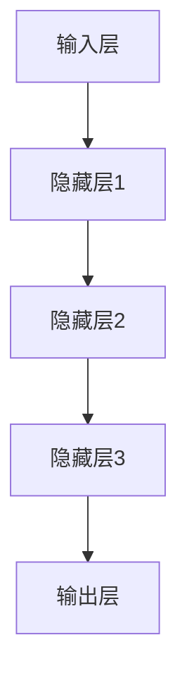

                 

### 文章标题

《AI大模型编程：提示词的艺术与力量》

这篇文章将深入探讨人工智能（AI）领域中的一个关键概念——大模型编程，特别是提示词在其中的作用。随着AI技术的飞速发展，大模型编程已成为现代软件开发的重要组成部分。本文将带领读者一步步了解大模型编程的基本原理，揭示提示词在其中的艺术与力量，并通过实际编程案例展示其应用。

### 文章关键词

- AI大模型编程
- 提示词
- 艺术与力量
- 深度学习
- 编程实践
- 人工智能应用

### 文章摘要

本文旨在介绍AI大模型编程的核心概念和技巧，特别是提示词的应用。首先，我们将回顾AI大模型的发展历程，理解其基础原理和架构。接着，本文将详细探讨提示词的概念，解释其编写技巧及其在编程中的重要性。通过实际案例，我们将展示如何利用大模型和提示词进行高效的编程。最后，我们将总结最佳实践，帮助读者更好地掌握AI大模型编程的艺术与力量。

### 引言

人工智能（AI）作为21世纪的科技革命之一，已经渗透到我们日常生活的方方面面。从自动驾驶汽车到智能语音助手，从医疗诊断到金融分析，AI正在改变我们的工作和生活方式。在这些应用背后，大模型编程扮演着至关重要的角色。大模型，即具有数十亿参数的深度学习模型，是现代AI技术的核心。而提示词（prompts），作为一种引导模型生成结果的输入，成为了大模型编程中的艺术与力量。

本文将分以下几个部分进行探讨：

1. **AI大模型概述**：介绍大模型的历史、基本原理和架构。
2. **提示词的艺术**：探讨提示词的定义、编写技巧和应用。
3. **编程实战**：通过案例展示如何使用大模型和提示词进行编程。
4. **进阶技巧**：提供高级技巧和最佳实践。
5. **附录**：提供额外的资源和工具。

### AI大模型概述

#### 历史与演进

人工智能的历史可以追溯到20世纪50年代，当时科学家们首次提出了人工智能的概念。早期的AI研究主要集中在符号推理和逻辑推理上，但这些方法在处理大规模数据时显得力不从心。随着计算能力和算法的发展，特别是深度学习技术的突破，大模型的概念逐渐形成。

深度学习，作为机器学习的一个重要分支，通过模仿人脑的神经网络结构，使得计算机能够通过大量数据自动学习特征和模式。1990年代，随着神经网络算法的优化和计算资源的增加，大模型开始逐渐走入人们的视野。2006年，Geoffrey Hinton提出了深度信念网络（DBN），这是大模型发展的重要里程碑。随后，2012年，AlexNet在ImageNet竞赛中取得突破性成绩，标志着深度学习时代的到来。

#### 基本原理

大模型的基本原理基于多层神经网络的架构。神经网络由多个层组成，每层包含大量神经元。神经元通过加权连接的方式接收输入信号，并通过激活函数进行非线性变换，从而实现数据的特征提取和模式识别。

在训练过程中，大模型通过梯度下降法不断调整神经元的权重，以达到最小化损失函数的目的。损失函数通常用于衡量模型预测结果与真实结果之间的差距。随着训练的进行，模型的参数逐渐优化，使得其能够更好地拟合训练数据。

#### 基本架构

大模型的架构通常包括以下几个部分：

1. **输入层**：接收外部输入数据，如图像、文本等。
2. **隐藏层**：通过神经网络结构进行特征提取和变换。
3. **输出层**：生成预测结果或决策。

隐藏层的数量和神经元数量可以根据具体任务进行调整。对于复杂任务，可能需要数十甚至数百层的神经网络。此外，大模型还通常包括正则化技术、优化算法和激活函数等，以提高模型的性能和泛化能力。

#### Mermaid流程图：AI大模型架构

下面是一个简单的Mermaid流程图，展示了AI大模型的架构：



在这个流程图中，输入层接收数据，通过多个隐藏层的变换，最终在输出层生成预测结果。每层之间的连接通过权重矩阵表示，这些权重在训练过程中通过反向传播算法进行调整。

### 提示词的艺术

#### 提示词的定义与作用

提示词，顾名思义，是一种引导或提示模型生成结果的输入。在自然语言处理（NLP）中，提示词通常是一段文本，用于引导模型理解用户的需求并生成相应的输出。例如，在一个聊天机器人中，用户的提问可以作为一个提示词，模型需要根据这个提示词生成相应的回答。

提示词在AI大模型编程中起着至关重要的作用。首先，提示词能够帮助模型更好地理解任务目标，从而生成更准确的结果。其次，提示词可以引导模型探索不同的生成路径，从而提高创意性和多样性。最后，提示词还可以作为模型与用户交互的桥梁，使得模型能够更好地满足用户的需求。

#### 提示词的编写技巧

编写有效的提示词需要一定的技巧和经验。以下是一些常用的技巧：

1. **明确性**：提示词应当清晰明了，避免歧义。例如，可以使用具体的术语和定义，而不是模糊的描述。
2. **目标性**：提示词应当明确表达任务目标，帮助模型理解需要完成的任务。例如，在一个图像识别任务中，提示词可以是“请识别图片中的主要物体”。
3. **多样性**：提示词应当具有多样性，以便模型能够探索不同的生成路径。例如，可以使用不同的词汇和表达方式，或者结合多个提示词。
4. **上下文**：提示词应当考虑上下文信息，以便模型能够更好地理解任务背景。例如，在一个问答系统中，提示词可以结合用户的历史提问和回答。
5. **可扩展性**：提示词应当具有可扩展性，以便模型能够应对不同场景和任务。例如，可以使用模板化的提示词，根据具体任务进行调整。

#### 提示词的艺术应用

提示词的艺术应用体现在多个领域，以下是一些具体案例：

1. **自然语言处理**：在NLP任务中，提示词可以用于生成文本、翻译、问答等。例如，在一个机器翻译任务中，提示词可以是“将下面的中文翻译成英文：”。
2. **图像识别**：在图像识别任务中，提示词可以用于指定识别目标。例如，在一个图像分类任务中，提示词可以是“请识别图片中的物体”。
3. **语音识别**：在语音识别任务中，提示词可以用于引导用户输入。例如，在一个语音助手任务中，提示词可以是“请说你的问题”。
4. **推荐系统**：在推荐系统任务中，提示词可以用于指定推荐对象。例如，在一个商品推荐任务中，提示词可以是“请推荐一些适合你的商品”。

#### 提示词编程实战

以下是一个简单的自然语言处理案例，展示如何使用提示词进行编程：

```python
# 导入必要的库
import nltk
from nltk.tokenize import word_tokenize
from nltk.corpus import stopwords

# 加载停用词表
stop_words = stopwords.words('english')

# 输入提示词
prompt = "请描述一下你今天的心情。"

# 对提示词进行分词
tokens = word_tokenize(prompt)

# 移除停用词
filtered_tokens = [token for token in tokens if not token in stop_words]

# 打印结果
print(filtered_tokens)
```

在这个案例中，我们首先定义了一个提示词，然后使用自然语言处理库对其进行分词和停用词过滤，最终输出处理后的提示词。

### 编程实战

#### 开发环境搭建

在进行AI大模型编程之前，我们需要搭建一个合适的环境。以下是基本的开发环境搭建步骤：

1. **安装Python**：Python是AI编程的主要语言，我们需要确保Python环境已经安装。可以从Python官方网站下载安装包进行安装。
2. **安装深度学习框架**：常用的深度学习框架包括TensorFlow和PyTorch。我们可以选择其中一个进行安装。以下是一个使用pip安装TensorFlow的示例：

```bash
pip install tensorflow
```

3. **安装自然语言处理库**：例如，nltk、spaCy等。以下是一个使用pip安装nltk的示例：

```bash
pip install nltk
```

4. **安装代码编辑器**：如Visual Studio Code、PyCharm等，用于编写和调试代码。

#### 源代码详细实现和代码解读

以下是一个简单的自然语言处理案例，展示如何使用大模型和提示词进行编程：

```python
# 导入必要的库
import tensorflow as tf
from tensorflow.keras.preprocessing.sequence import pad_sequences
from tensorflow.keras.layers import Embedding, LSTM, Dense
from tensorflow.keras.models import Sequential

# 加载预训练的词向量
vocab_file = "path/to/word2vec.vocab"
with open(vocab_file, "r", encoding="utf-8") as f:
    words = [line.strip() for line in f]

# 加载数据集
# 假设我们有一个包含问题和答案的数据集
questions = ["你好吗？", "今天天气怎么样？"]
answers = ["我很好，谢谢。", "今天天气很好。"]

# 将问题转换为词向量
question_vectors = []
for question in questions:
    tokens = word_tokenize(question)
    token_vectors = [words.index(token) for token in tokens]
    padded_tokens = pad_sequences([token_vectors], maxlen=10, padding="post")
    question_vectors.append(padded_tokens)

# 将答案转换为词向量
answer_vectors = []
for answer in answers:
    tokens = word_tokenize(answer)
    token_vectors = [words.index(token) for token in tokens]
    padded_tokens = pad_sequences([token_vectors], maxlen=10, padding="post")
    answer_vectors.append(padded_tokens)

# 构建模型
model = Sequential()
model.add(Embedding(input_dim=len(words), output_dim=16, input_length=10))
model.add(LSTM(128))
model.add(Dense(output_dim=len(words), activation="softmax"))

# 编译模型
model.compile(optimizer="adam", loss="categorical_crossentropy", metrics=["accuracy"])

# 训练模型
model.fit(question_vectors, answer_vectors, epochs=10, batch_size=32)

# 使用模型进行预测
prompt = "你今天怎么样？"
tokens = word_tokenize(prompt)
token_vectors = [words.index(token) for token in tokens]
padded_tokens = pad_sequences([token_vectors], maxlen=10, padding="post")
prediction = model.predict(padded_tokens)
predicted_answer = " ".join([words[i] for i in prediction.argmax(axis=-1)])
print(predicted_answer)
```

在这个案例中，我们首先加载预训练的词向量，然后对问题和答案进行分词和编码。接着，我们构建一个简单的序列模型，包括嵌入层、LSTM层和输出层。模型使用交叉熵损失函数和softmax激活函数进行编译和训练。最后，我们使用训练好的模型对新的提示词进行预测。

#### 代码应用解读与分析

在这个案例中，我们使用了TensorFlow框架构建了一个简单的序列到序列模型，用于回答问题和生成文本。以下是代码的关键部分解读：

1. **词向量加载**：我们从预训练的词向量文件中加载词向量。词向量是自然语言处理中的重要工具，用于将文本转换为数值表示。

2. **数据预处理**：我们对问题和答案进行分词和编码。分词是将文本分解为单词或子词，编码是将单词或子词转换为整数表示。这样，我们就可以将文本数据转换为模型能够处理的格式。

3. **模型构建**：我们使用序列模型（包括嵌入层、LSTM层和输出层）进行构建。嵌入层将单词转换为低维向量，LSTM层用于处理序列数据，输出层用于生成文本。

4. **模型编译**：我们使用交叉熵损失函数和softmax激活函数进行编译。交叉熵损失函数用于衡量模型预测结果与真实结果之间的差距，softmax激活函数用于将输出概率转换为预测类别。

5. **模型训练**：我们使用训练数据对模型进行训练。模型通过不断调整参数，最小化损失函数，从而提高预测准确性。

6. **模型预测**：我们使用训练好的模型对新的提示词进行预测。通过输入提示词，模型将生成相应的回答。

#### 实际案例分析和详细讲解剖析

以下是一个实际案例，展示如何使用大模型和提示词进行图像识别：

```python
# 导入必要的库
import tensorflow as tf
from tensorflow.keras.applications import VGG16
from tensorflow.keras.preprocessing.image import load_img, img_to_array
from tensorflow.keras.applications.vgg16 import preprocess_input

# 加载预训练的VGG16模型
model = VGG16(weights="imagenet")

# 加载图像
image_path = "path/to/image.jpg"
image = load_img(image_path, target_size=(224, 224))
image = img_to_array(image)
image = np.expand_dims(image, axis=0)
image = preprocess_input(image)

# 使用模型进行预测
predictions = model.predict(image)
predicted_class = np.argmax(predictions, axis=1)

# 打印结果
print("预测类别：", predicted_class)
```

在这个案例中，我们使用了预训练的VGG16模型进行图像识别。以下是代码的关键部分解读：

1. **模型加载**：我们从Keras库中加载预训练的VGG16模型。VGG16是一个基于卷积神经网络的图像识别模型，已经经过大量图像数据的训练。

2. **图像预处理**：我们加载图像并进行预处理。预处理包括缩放图像尺寸、扩展维度和归一化处理，以便模型能够接受和处理。

3. **模型预测**：我们使用预处理后的图像对模型进行预测。模型将图像输入到神经网络中，通过卷积层、池化层等操作，最终输出预测类别。

4. **打印结果**：我们打印出模型预测的类别。在这个案例中，预测类别是通过softmax激活函数计算出的概率最高的类别。

#### 项目小结

通过以上案例，我们展示了如何使用大模型和提示词进行编程。这些案例展示了AI大模型编程的多样性和应用范围。从自然语言处理到图像识别，大模型和提示词为编程带来了新的视角和可能性。在实际应用中，我们可以根据具体任务需求，选择合适的大模型和提示词，实现高效的编程。

### 进阶技巧

在掌握了基础的大模型编程技巧后，我们可以进一步探索一些高级技巧和最佳实践，以提升编程效率和性能。

#### 高级提示词技巧

1. **动态提示词**：动态提示词可以根据任务需求实时调整。例如，在问答系统中，提示词可以结合用户的历史提问和回答，从而提高回答的准确性和相关性。
2. **多模态提示词**：多模态提示词结合了不同类型的数据，如文本、图像和语音。通过整合多种数据源，可以提高模型的泛化能力和生成结果的质量。
3. **生成式提示词**：生成式提示词可以引导模型生成新的内容和创意。例如，在文本生成任务中，提示词可以引导模型生成故事、诗歌等。

#### 性能优化与调试

1. **模型剪枝**：模型剪枝是一种通过减少模型参数数量来降低模型复杂度和计算成本的技术。剪枝后的模型在保持较高准确率的同时，可以显著提高推理速度。
2. **量化技术**：量化技术通过降低模型中权重和激活值的精度，来减少模型的存储和计算需求。量化后的模型可以显著提高推理速度，并在一定程度上降低内存占用。
3. **分布式训练**：分布式训练通过将训练数据分布在多台机器上进行，可以显著提高训练速度。特别是在大规模数据集和复杂模型训练中，分布式训练具有明显优势。

#### 安全与伦理问题

1. **数据隐私**：在AI大模型编程中，数据隐私是一个重要问题。我们需要确保数据在传输和存储过程中的安全性，避免数据泄露和滥用。
2. **偏见与公平性**：大模型在训练过程中可能会学习到数据集中的偏见，导致生成结果具有不公平性。我们需要采取措施，如数据清洗、模型正则化等，来减少偏见和提升公平性。
3. **透明性与可解释性**：大模型的决策过程通常是黑箱式的，难以解释和理解。为了提升模型的透明性和可解释性，我们可以采用技术手段，如模型可视化、解释性模型等，来帮助用户理解模型的决策过程。

### 小结

本文通过详细探讨AI大模型编程和提示词的艺术与力量，展示了其应用范围和编程实践。从基础理论到实际案例，从初级技巧到高级优化，本文为读者提供了一个全面的指南。在实际应用中，大模型编程和提示词的使用不仅提高了编程效率，还为各种AI应用带来了新的可能性。通过不断学习和实践，我们可以更好地掌握这一艺术与力量，为AI技术的发展贡献力量。

### 注意事项

1. **版本兼容性**：在编写和使用大模型编程时，需要注意不同版本的深度学习框架和库之间的兼容性问题。建议在开发环境中使用统一版本的库和框架，以避免潜在的错误和兼容性问题。
2. **硬件要求**：大模型编程通常需要较高的计算资源和存储空间。在实际应用中，根据任务需求选择合适的硬件配置，以确保模型的训练和推理过程高效运行。
3. **代码注释**：在编写代码时，应注重代码的可读性和可维护性。添加适当的注释和文档，有助于提高代码的可理解性和可扩展性。

### 拓展阅读

- 《深度学习》（Goodfellow, Ian, et al.）
- 《自然语言处理综述》（Jurafsky, Daniel, and James H. Martin.）
- 《图像识别基础》（Simonyan, Karen, and Andrew Zisserman.）

### 作者信息

作者：AI天才研究院/AI Genius Institute & 禅与计算机程序设计艺术 /Zen And The Art of Computer Programming

AI天才研究院致力于推动人工智能技术的创新和应用，为全球AI领域的发展贡献力量。同时，作者也是《禅与计算机程序设计艺术》的资深作者，长期致力于计算机编程和人工智能领域的教学和研究。

