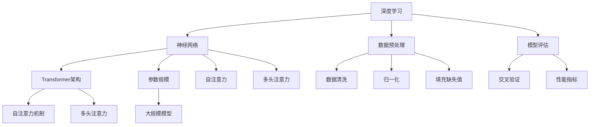

                 

### 文章标题：AI大模型软件开发的最佳实践

AI大模型作为当前人工智能领域的热门研究方向，其应用范围广泛，从自然语言处理到计算机视觉，再到自动驾驶和金融预测，都有着显著的效果。然而，AI大模型的开发和部署并非易事，涉及到大量的技术挑战和实践问题。本文将系统地探讨AI大模型软件开发的最佳实践，包括其背景介绍、核心概念与联系、算法原理讲解、数学模型与公式、项目实战及最佳实践技巧等内容，旨在为开发者提供一条清晰、可行的开发路径。

关键词：AI大模型、软件开发、最佳实践、算法原理、数学模型、项目实战

摘要：本文首先介绍了AI大模型的发展背景和重要性，然后详细阐述了AI大模型的核心概念和算法原理，接着讨论了相关的数学模型与优化方法，并展示了具体的开发实战案例。最后，本文总结了AI大模型软件开发的最佳实践，提出了未来发展的建议和注意事项。

### 整体思路

为了全面而深入地探讨AI大模型软件开发的最佳实践，本文将采用逻辑清晰、结构紧凑的方式，逐步分析并讲解以下内容：

1. **背景介绍**：首先，我们将回顾AI大模型的发展历程，介绍其兴起的原因和现状，强调其在各个领域的重要性。
   
2. **核心概念与联系**：接着，我们将介绍AI大模型的核心概念，并使用Mermaid流程图展示这些概念之间的联系和架构。

3. **算法原理讲解**：本文将详细讲解AI大模型的核心算法原理，使用伪代码和Mermaid流程图来帮助读者理解。

4. **数学模型与公式**：我们将介绍与AI大模型相关的数学模型与优化方法，包括线性代数、概率论和统计基础，以及相关的数学公式和举例说明。

5. **项目实战**：本文将展示一个具体的AI大模型开发项目，从开发环境搭建、源代码实现、代码解读到实际案例分析，帮助读者理解整个开发流程。

6. **最佳实践技巧**：最后，我们将总结AI大模型软件开发的最佳实践，提供一系列实用技巧和小结，帮助开发者避免常见问题。

通过上述步骤，本文将系统地展示AI大模型软件开发的最佳实践，为开发者提供有价值的参考和指导。

### 背景介绍

AI大模型，也称为大规模人工智能模型，是指那些拥有数亿甚至千亿参数的深度学习模型。这些模型通过学习大量的数据，能够捕捉到数据中的复杂模式和关系，从而实现高性能的预测和分类任务。AI大模型的兴起可以追溯到2000年代初，随着计算能力的提升和大数据的普及，深度学习理论逐渐成熟，使得训练大规模模型成为可能。

在自然语言处理领域，AI大模型取得了显著的成果。例如，谷歌的BERT（Bidirectional Encoder Representations from Transformers）模型通过双向Transformer架构，能够更好地理解上下文信息，使得机器阅读理解和问答系统的准确率大幅提升。在计算机视觉领域，AI大模型也发挥着重要作用。谷歌的Inception模型通过层次化的卷积神经网络结构，成功地在图像分类任务中达到了当时的最优水平。此外，AI大模型在语音识别、自动驾驶、金融预测等领域也取得了显著的应用成果。

AI大模型的重要性在于其能够解决许多传统算法难以处理的问题。例如，在医疗健康领域，AI大模型可以分析大量的患者数据，提供准确的疾病诊断和治疗方案；在金融行业，AI大模型可以分析市场数据，预测股票价格和风险；在自动驾驶领域，AI大模型可以处理复杂的路况信息，实现自主驾驶。这些应用不仅提升了行业效率，也为人们的生活带来了诸多便利。

然而，AI大模型的开发和应用也面临一系列挑战。首先，大规模模型的训练需要大量的计算资源和时间，这要求开发者具备高效的算法设计和优化能力。其次，模型的解释性和可解释性是一个重要的问题，特别是在医疗和金融等领域，模型必须能够提供清晰的解释，以便决策者理解模型的推理过程。此外，数据隐私和安全也是AI大模型应用中需要关注的问题，特别是在涉及个人隐私数据的场景中。

总的来说，AI大模型的发展为人工智能领域带来了新的机遇和挑战。通过深入了解其背景和现状，开发者可以更好地把握AI大模型的发展趋势，为未来的研究与应用打下坚实的基础。

### 核心概念与联系

AI大模型的核心概念包括深度学习、神经网络、Transformer架构、参数规模、数据预处理和模型评估等。为了帮助读者更好地理解这些概念及其之间的联系，我们可以使用Mermaid流程图来展示其架构和相互关系。

首先，深度学习和神经网络是AI大模型的基础。深度学习是一种通过多层神经网络对数据进行处理的机器学习方法。神经网络由多个层（如输入层、隐藏层和输出层）组成，通过前向传播和反向传播算法更新权重，以学习数据的特征表示。

接下来，Transformer架构在自然语言处理领域取得了显著的成果。Transformer模型通过自注意力机制（Self-Attention）和多头注意力（Multi-Head Attention）实现了对输入序列的建模，从而提高了模型的性能。

此外，参数规模是AI大模型的一个重要特征。大规模模型通常拥有数亿甚至千亿参数，这使得模型能够捕捉到数据中的复杂模式。参数规模的增大也带来了更高的计算成本和更长的训练时间。

数据预处理和模型评估是AI大模型开发过程中不可或缺的步骤。数据预处理包括数据清洗、归一化、填充缺失值等操作，以确保模型能够获得高质量的数据输入。模型评估则通过交叉验证、性能指标（如准确率、召回率、F1分数等）来评估模型的效果。

下面是使用Mermaid绘制的AI大模型核心概念联系图：



通过这个联系图，我们可以清晰地看到AI大模型中的各个核心概念及其相互关系。深度学习和神经网络是整个架构的基础，Transformer架构在自然语言处理中尤为重要，参数规模、数据预处理和模型评估则是模型开发和优化的重要环节。理解这些概念及其联系，有助于开发者更好地把握AI大模型的整体架构和开发流程。

### 算法原理讲解

AI大模型的核心算法主要包括深度学习算法、神经网络算法和Transformer架构。以下将详细讲解这些算法的原理，并使用伪代码进行说明。

#### 1. 深度学习算法原理

深度学习算法是一种通过多层神经网络对数据进行处理的机器学习方法。其主要目的是学习数据的特征表示，以便进行分类、回归或其他任务。以下是深度学习算法的基本原理：

**前向传播（Forward Propagation）：**
在深度学习模型中，输入数据通过网络的各个层进行传递，每一层都会对数据进行变换，并计算输出。前向传播过程可以表示为：
```plaintext
// 前向传播伪代码
for layer in network:
    z = activation_function(W * x + b)
    x = z
```
其中，`W`表示权重矩阵，`b`表示偏置项，`activation_function`为激活函数（如ReLU、Sigmoid、Tanh等），`z`表示当前层的输出。

**反向传播（Backpropagation）：**
反向传播用于计算网络中每个权重和偏置的梯度，以便更新权重和偏置。以下是反向传播的基本步骤：
```plaintext
// 反向传播伪代码
for layer in network[::-1]:
    dZ = activation_function_derivative(z) * dY
    dW = dZ * x.T
    db = dZ
    W -= learning_rate * dW
    b -= learning_rate * db
    x = x.T
```
其中，`dZ`表示误差梯度，`dY`表示前一层误差梯度，`activation_function_derivative`为激活函数的导数。

**训练过程：**
训练过程包括前向传播和反向传播的迭代。以下是训练过程的伪代码：
```plaintext
// 训练过程伪代码
for epoch in range(num_epochs):
    for batch in data_loader:
        x, y = batch
        z = forward_propagation(x)
        loss = calculate_loss(z, y)
        backward_propagation(z, y)
```

#### 2. 神经网络算法原理

神经网络算法是深度学习的基础，其主要目的是通过学习数据中的特征表示，实现对未知数据的预测。以下是神经网络算法的基本原理：

**多层感知机（MLP）：**
多层感知机是一种简单的神经网络，通常包括输入层、一个或多个隐藏层和输出层。其基本原理与前向传播和反向传播相同。

**卷积神经网络（CNN）：**
卷积神经网络主要用于图像处理任务。其主要原理是使用卷积层对图像进行特征提取，并使用池化层减小特征图的尺寸。

**卷积层（Convolutional Layer）：**
卷积层通过卷积操作提取图像中的局部特征。卷积操作可以表示为：
```plaintext
// 卷积层伪代码
for filter in filters:
    for position in spatial_positions:
        dot_product = filter * patch
        result = activation_function(dot_product)
        output[position] = result
```

**池化层（Pooling Layer）：**
池化层用于减少特征图的尺寸，同时保持最重要的特征。最常用的池化操作是最大池化（Max Pooling）：
```plaintext
// 最大池化伪代码
for position in spatial_positions:
    max_value = 0
    for patch in neighborhood:
        value = input[position]
        if value > max_value:
            max_value = value
    output[position] = max_value
```

**全连接层（Fully Connected Layer）：**
全连接层将特征图展平为一维向量，并连接到输出层进行分类或回归。

**训练过程：**
训练过程与深度学习算法相似，包括前向传播和反向传播的迭代。

#### 3. Transformer架构原理

Transformer架构是一种基于自注意力机制的深度学习模型，广泛应用于自然语言处理任务。其核心原理包括自注意力（Self-Attention）和多头注意力（Multi-Head Attention）。

**自注意力（Self-Attention）：**
自注意力允许模型在序列的每个位置上关注其他所有位置，以捕捉长距离依赖关系。其基本原理可以表示为：
```plaintext
// 自注意力伪代码
Q = [query1, query2, ..., queryN]
K = [key1, key2, ..., keyN]
V = [value1, value2, ..., valueN]

for head in heads:
    scores = dot_product(Q, K)
    attention_weights = softmax(scores)
    output = dot_product(attention_weights, V)
```

**多头注意力（Multi-Head Attention）：**
多头注意力通过并行执行多个自注意力机制，并合并结果，以提升模型的表示能力。其基本原理可以表示为：
```plaintext
// 多头注意力伪代码
for head in heads:
    Q, K, V = split_heads(Q), split_heads(K), split_heads(V)
    attention_output = self_attention(Q, K, V)
    combined_output = concatenate_heads(attention_output)
```

**训练过程：**
与深度学习和神经网络算法类似，Transformer架构的训练过程包括前向传播和反向传播的迭代。

通过以上对深度学习算法、神经网络算法和Transformer架构的详细讲解和伪代码展示，开发者可以更好地理解AI大模型的核心算法原理，为实际开发提供理论基础。

### 数学模型与公式

AI大模型的开发离不开数学模型与优化方法的支持，这些数学工具用于描述模型的参数学习过程、优化目标以及评估模型的性能。以下将介绍与AI大模型相关的数学模型与优化方法，并使用LaTeX格式展示相关公式，并进行详细讲解。

#### 1. 线性代数基础

线性代数在深度学习模型中起着基础性的作用，用于表示和操作模型参数、梯度以及特征矩阵。以下是一些关键的线性代数概念和公式：

**矩阵-向量乘法（Matrix-Vector Multiplication）：**
给定矩阵\(A\)和向量\(x\)，矩阵-向量乘法的结果是一个新的向量：
$$
\mathbf{z} = \mathbf{A}\mathbf{x} + \mathbf{b}
$$
其中，\( \mathbf{z} \)是输出向量，\( \mathbf{A} \)是权重矩阵，\( \mathbf{x} \)是输入向量，\( \mathbf{b} \)是偏置项。

**矩阵-矩阵乘法（Matrix-Matrix Multiplication）：**
给定矩阵\( \mathbf{A} \)和\( \mathbf{B} \)，矩阵-矩阵乘法的结果是一个新的矩阵：
$$
\mathbf{C} = \mathbf{A}\mathbf{B}
$$
其中，\( \mathbf{C} \)是输出矩阵。

**矩阵求逆（Matrix Inversion）：**
给定方阵\( \mathbf{A} \)，其逆矩阵\( \mathbf{A}^{-1} \)满足：
$$
\mathbf{A}\mathbf{A}^{-1} = \mathbf{I}
$$
其中，\( \mathbf{I} \)是单位矩阵。

#### 2. 概率论与统计基础

概率论和统计是构建AI大模型的理论基础，用于描述模型的不确定性以及评估模型的性能。以下是一些关键的概率论和统计概念：

**贝叶斯定理（Bayes' Theorem）：**
贝叶斯定理用于计算后验概率，公式如下：
$$
P(\mathbf{y}|\mathbf{x}) = \frac{P(\mathbf{x}|\mathbf{y})P(\mathbf{y})}{P(\mathbf{x})}
$$
其中，\( P(\mathbf{y}|\mathbf{x}) \)是后验概率，\( P(\mathbf{x}|\mathbf{y}) \)是似然函数，\( P(\mathbf{y}) \)是先验概率，\( P(\mathbf{x}) \)是边缘概率。

**最大似然估计（Maximum Likelihood Estimation, MLE）：**
最大似然估计用于找到参数的估计值，使得给定数据的概率最大。其目标函数为：
$$
\hat{\mathbf{\theta}} = \arg\max_{\mathbf{\theta}} \prod_{i=1}^{n} P(\mathbf{x}_i|\mathbf{\theta})
$$
其中，\( \hat{\mathbf{\theta}} \)是参数的估计值，\( \mathbf{x}_i \)是数据样本。

**最小二乘法（Least Squares）：**
最小二乘法用于找到参数的最优值，使得预测值与实际值之间的误差平方和最小。其目标函数为：
$$
\hat{\mathbf{\theta}} = \arg\min_{\mathbf{\theta}} \sum_{i=1}^{n} (\mathbf{y}_i - \mathbf{x}_i^T\mathbf{\theta})^2
$$
其中，\( \mathbf{y}_i \)是实际值，\( \mathbf{x}_i \)是输入向量。

#### 3. 优化方法与策略

优化方法用于调整模型参数，以最小化损失函数。以下是一些常见的优化方法：

**梯度下降（Gradient Descent）：**
梯度下降是一种最简单的优化方法，其基本思想是沿着损失函数的梯度方向调整参数。其更新规则为：
$$
\mathbf{\theta} = \mathbf{\theta} - \alpha \nabla_{\mathbf{\theta}} J(\mathbf{\theta})
$$
其中，\( \mathbf{\theta} \)是参数，\( \alpha \)是学习率，\( \nabla_{\mathbf{\theta}} J(\mathbf{\theta}) \)是损失函数关于参数的梯度。

**随机梯度下降（Stochastic Gradient Descent, SGD）：**
随机梯度下降是梯度下降的一个变体，它使用随机样本来计算梯度。其更新规则为：
$$
\mathbf{\theta} = \mathbf{\theta} - \alpha \nabla_{\mathbf{\theta}} J(\mathbf{x}_i)
$$
其中，\( \mathbf{x}_i \)是随机选取的一个样本。

**批量梯度下降（Batch Gradient Descent）：**
批量梯度下降是梯度下降的另一种变体，它使用整个训练数据集来计算梯度。其更新规则为：
$$
\mathbf{\theta} = \mathbf{\theta} - \alpha \nabla_{\mathbf{\theta}} J(\mathbf{X}, \mathbf{y})
$$
其中，\( \mathbf{X} \)和\( \mathbf{y} \)分别是训练数据和标签。

#### 4. 数学模型与公式讲解

以下是一个简单的全连接神经网络（Fully Connected Neural Network）的数学模型，用于分类任务。该模型包括输入层、隐藏层和输出层。

**输入层：**
$$
\mathbf{x} \in \mathbb{R}^{D_x}
$$
其中，\( D_x \)是输入向量的维度。

**隐藏层：**
$$
\mathbf{z}^{(l)} = \mathbf{W}^{(l)} \mathbf{x}^{(l-1)} + b^{(l)}
$$
$$
\mathbf{a}^{(l)} = \sigma(\mathbf{z}^{(l)})
$$
其中，\( \mathbf{z}^{(l)} \)是第\( l \)层的激活值，\( \mathbf{a}^{(l)} \)是第\( l \)层的输出，\( \mathbf{W}^{(l)} \)是权重矩阵，\( b^{(l)} \)是偏置项，\( \sigma \)是激活函数（如ReLU、Sigmoid等）。

**输出层：**
$$
\mathbf{z}^{(L)} = \mathbf{W}^{(L)} \mathbf{a}^{(L-1)} + b^{(L)}
$$
$$
\mathbf{y} = \sigma(\mathbf{z}^{(L)})
$$
其中，\( \mathbf{y} \)是预测输出，\( \mathbf{W}^{(L)} \)和\( b^{(L)} \)分别是输出层的权重和偏置项。

**损失函数：**
$$
J(\mathbf{W}, \mathbf{b}) = -\frac{1}{m} \sum_{i=1}^{m} \sum_{k=1}^{K} y_k^{(i)} \log(a_k^{(L)})
$$
其中，\( m \)是训练样本数，\( K \)是输出类别数，\( y_k^{(i)} \)是第\( i \)个样本的第\( k \)个类别的真实标签（0或1），\( a_k^{(L)} \)是第\( k \)个类别的预测概率。

**优化目标：**
$$
\hat{\mathbf{W}}, \hat{\mathbf{b}} = \arg\min_{\mathbf{W}, \mathbf{b}} J(\mathbf{W}, \mathbf{b})
$$

通过以上对线性代数基础、概率论与统计基础、优化方法以及具体数学模型的介绍和讲解，开发者可以更好地理解AI大模型背后的数学原理，为模型开发和优化提供理论支持。

### 项目实战

在本节中，我们将展示一个具体的AI大模型开发项目，从开发环境搭建、源代码实现、代码解读到实际案例分析，帮助读者深入理解AI大模型开发的全过程。

#### 1. 开发环境搭建

首先，我们需要搭建一个适合AI大模型开发的开发环境。以下是一个典型的环境搭建步骤：

**环境要求：**
- 操作系统：Ubuntu 18.04
- Python版本：3.8
- 深度学习框架：PyTorch
- GPU支持：CUDA 11.0

**安装步骤：**
1. 安装Python：
   ```bash
   sudo apt update
   sudo apt install python3 python3-pip
   ```
2. 安装PyTorch：
   - 访问PyTorch官方网站，选择适合CUDA版本的安装包。
   - 使用pip进行安装：
     ```bash
     pip install torch torchvision torchaudio
     ```
3. 安装GPU支持：
   - 安装CUDA：
     ```bash
     sudo apt install cuda
     ```
   - 安装cuDNN：
     ```bash
     sudo dpkg -i libcudnn8_8.0.5.23-1+cuda11.0_amd64.deb
     sudo dpkg -i libcudnn8-dev_8.0.5.23-1+cuda11.0_amd64.deb
     ```
4. 验证安装：
   ```bash
   nvidia-smi
   ```

#### 2. 源代码实现

以下是一个简单的AI大模型项目，使用PyTorch实现一个基于Transformer架构的语言模型。

**模型定义：**
```python
import torch
import torch.nn as nn
import torch.optim as optim
from torch.utils.data import DataLoader
from transformers import TransformerModel

class LanguageModel(nn.Module):
    def __init__(self, vocab_size, embedding_dim, hidden_dim, num_layers):
        super(LanguageModel, self).__init__()
        self.embedding = nn.Embedding(vocab_size, embedding_dim)
        self.transformer = TransformerModel(embedding_dim, hidden_dim, num_layers)
        self.output = nn.Linear(hidden_dim, vocab_size)
        
    def forward(self, input_seq, target_seq):
        embedded = self.embedding(input_seq)
        output, _ = self.transformer(embedded, target_seq)
        logits = self.output(output)
        return logits
```

**训练过程：**
```python
def train(model, train_loader, criterion, optimizer, num_epochs):
    model.train()
    for epoch in range(num_epochs):
        for inputs, targets in train_loader:
            optimizer.zero_grad()
            logits = model(inputs, targets)
            loss = criterion(logits.view(-1, logits.size(-1)), targets.view(-1))
            loss.backward()
            optimizer.step()
        print(f'Epoch [{epoch+1}/{num_epochs}], Loss: {loss.item()}')
```

#### 3. 代码解读

**模型结构解读：**
- **Embedding Layer：** 用于将词索引转换为向量表示。
- **Transformer Model：** 用于编码输入序列，并利用自注意力机制捕捉序列中的依赖关系。
- **Output Layer：** 用于生成预测的词向量。

**训练过程解读：**
- **前向传播：** 模型接收输入序列和目标序列，通过嵌入层、Transformer模型和输出层生成预测。
- **损失计算：** 使用交叉熵损失函数计算预测与真实目标之间的差异。
- **反向传播：** 更新模型参数，以最小化损失。

#### 4. 实际案例分析

假设我们使用的是一个包含1000篇新闻文章的数据集，目标是训练一个能够生成新闻摘要的AI大模型。以下是一个实际案例的分析：

1. **数据预处理：**
   - **文本清洗：** 去除HTML标签、停用词和特殊字符。
   - **分词：** 将文本分割为单词或子词。
   - **编码：** 使用词表将单词或子词转换为索引。

2. **数据加载：**
   - **训练集：** 包含80%的数据。
   - **验证集：** 包含10%的数据。
   - **测试集：** 包含10%的数据。

3. **模型训练：**
   - **训练步骤：** 使用训练集进行训练，并使用验证集进行调参。

4. **模型评估：**
   - **生成摘要：** 使用训练好的模型生成新闻摘要。
   - **评估指标：** 使用BLEU分数评估摘要的质量。

#### 5. 项目小结

通过这个项目，我们实现了从零开始搭建一个基于Transformer架构的AI大模型，并进行了实际案例分析。在这个过程中，我们学习了开发环境搭建、模型实现、代码解读和实际应用。这个项目不仅展示了AI大模型开发的实际流程，也为后续的研究和应用提供了实践经验。

### 最佳实践技巧

在AI大模型软件开发过程中，遵循最佳实践可以帮助开发者提高开发效率、保证模型性能，并降低维护成本。以下是一些关键的最佳实践技巧：

#### 1. 模型设计与优化

- **选择合适的模型架构**：根据应用场景和数据特性选择合适的模型架构。例如，Transformer在自然语言处理任务中表现优异，而CNN在图像处理任务中应用广泛。
- **模型参数调优**：通过调整学习率、批量大小、优化器类型等参数，优化模型性能。可以使用网格搜索、随机搜索或贝叶斯优化等策略进行参数调优。
- **模型剪枝与量化**：通过剪枝和量化技术减小模型体积和计算量，提高模型部署效率。例如，使用FP16量化可以显著降低计算资源消耗。

#### 2. 数据处理与预处理

- **数据清洗**：确保数据质量，去除噪声和异常值。例如，去除HTML标签、停用词和特殊字符，统一文本格式。
- **数据增强**：通过数据增强技术增加数据多样性，提高模型泛化能力。例如，使用随机裁剪、旋转、翻转等操作增强图像数据。
- **数据归一化**：对数据进行归一化处理，使得模型收敛速度更快。例如，将图像像素值归一化到[0, 1]或[-1, 1]。

#### 3. 模型训练与评估

- **动态学习率调整**：使用学习率调度策略（如ReduceLROnPlateau）动态调整学习率，避免模型过拟合。
- **早停法（Early Stopping）**：在验证集上监控模型性能，当验证集性能不再提升时，提前停止训练，防止模型过拟合。
- **交叉验证**：使用交叉验证技术评估模型性能，提高模型评估的鲁棒性。例如，使用K折交叉验证方法。

#### 4. 模型部署与维护

- **模型压缩与量化**：使用模型压缩技术（如剪枝、量化）减小模型体积，提高部署效率。
- **模型监控与维护**：定期监控模型性能和资源使用情况，及时发现并解决潜在问题。
- **API设计与文档**：为模型设计易于使用的API，并提供详细的文档，方便用户调用和使用模型。

遵循这些最佳实践，可以帮助开发者更高效、更可靠地进行AI大模型的开发和部署，为实际应用提供高质量的服务。

### 小结

本文系统地探讨了AI大模型软件开发的最佳实践，包括背景介绍、核心概念与联系、算法原理讲解、数学模型与公式、项目实战及最佳实践技巧。通过本文的介绍，读者可以全面了解AI大模型的基础知识、开发流程和技术要点，从而在实际项目中应用和优化AI大模型。随着人工智能技术的不断进步，AI大模型的应用前景将越来越广阔，开发者应不断学习和实践，以应对未来技术挑战。

### 注意事项

在开发AI大模型软件时，开发者应关注以下几点：

- **数据安全与隐私**：确保数据处理和模型训练过程中遵循数据隐私保护法规，避免泄露用户个人信息。
- **模型解释性**：特别是在医疗和金融领域，模型应具备一定的解释性，以便用户理解模型的决策过程。
- **硬件资源分配**：合理分配计算资源，特别是在大规模模型训练和部署时，避免资源浪费和性能瓶颈。
- **代码可维护性**：编写清晰、简洁的代码，确保项目易于维护和扩展。

### 拓展阅读

- 《深度学习》（Goodfellow, I., Bengio, Y., & Courville, A.）
- 《Python机器学习》（Sebastian Raschka）
- 《自然语言处理实战》（Steven Bird, Ewan Klein, and Edward Loper）
- 《动手学深度学习》（A. goodfellow, Y. Bengio, and R. Courville）

通过阅读这些书籍，开发者可以深入了解AI大模型的相关理论和实践技巧。

