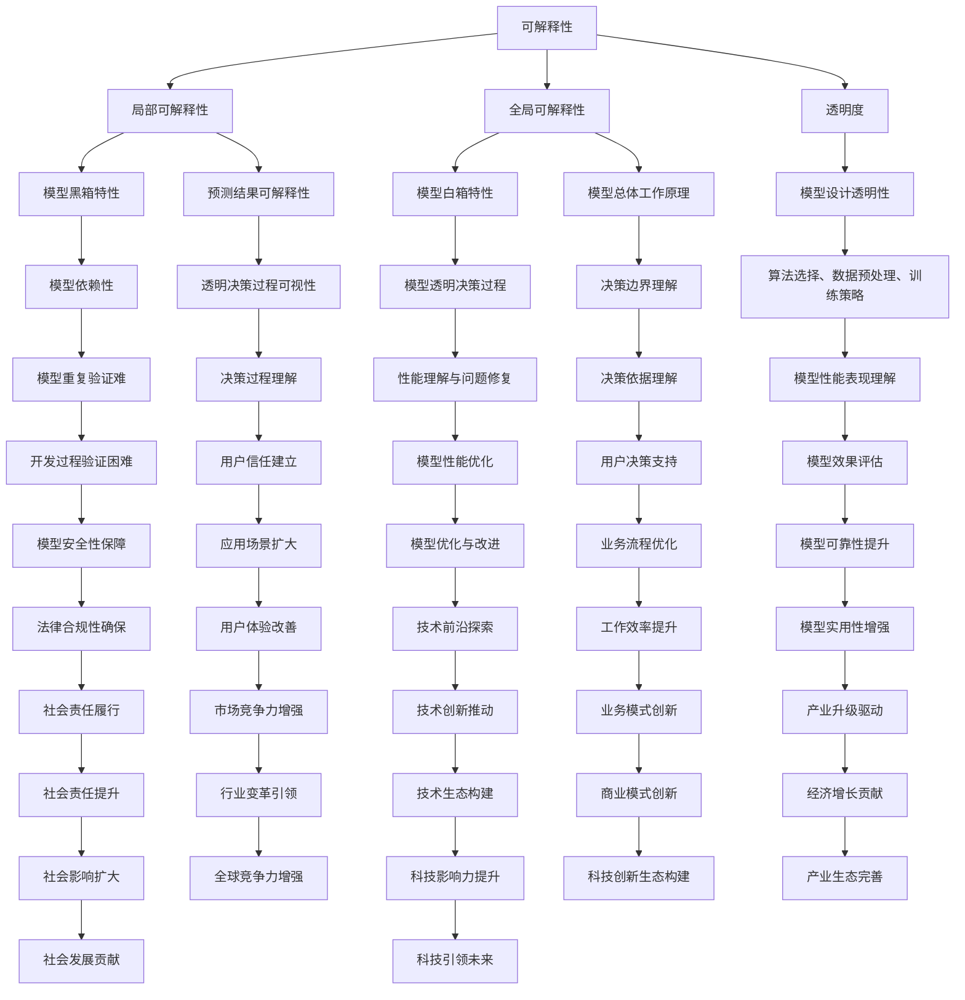

                 

### 背景介绍

#### AI大模型的发展与普及

人工智能（AI）作为计算机科学的一个分支，近年来取得了飞速的发展，特别是在深度学习（Deep Learning）技术的推动下。深度学习模型，尤其是大规模神经网络模型，如GPT、BERT、Transformer等，已经成为处理自然语言处理（NLP）、计算机视觉（CV）、语音识别（ASR）等复杂任务的主要工具。这些模型由于其巨大的规模和复杂性，被统称为“AI大模型”（Large AI Models）。它们通常拥有数十亿个参数，训练数据集的规模达到TB级别，且训练时间动辄数月甚至更长。

AI大模型的发展不仅改变了传统的机器学习模式，也为各行各业带来了革命性的变化。例如，在医疗领域，AI大模型被用于疾病的诊断和治疗；在金融领域，AI大模型被用于风险评估和欺诈检测；在自动驾驶领域，AI大模型被用于车辆控制和安全系统。然而，随着AI大模型的广泛应用，其可解释性和透明度问题也日益凸显。

#### 可解释性与透明度的概念

可解释性（Explainability）是指模型决策过程的透明度和可理解性，它允许用户理解模型的决策依据和推理过程。在AI大模型中，可解释性尤为重要，因为大模型的决策通常是基于复杂的神经网络结构，内部机制难以被用户直观理解。可解释性的重要性在于，它能够帮助用户建立对模型的信任，从而在关键应用场景中做出正确的决策。

透明度（Transparency）则更侧重于模型内部的计算过程和参数设置的可视化。透明度不仅包括可解释性，还涵盖了模型设计的透明性，如算法选择、数据预处理、训练策略等。透明度有助于研究人员和开发人员理解模型的性能表现，以及发现和修复潜在的问题。

#### AI大模型中的可解释性与透明度问题

尽管AI大模型在许多领域表现出色，但其可解释性和透明度问题仍然是一个亟待解决的难题。以下是一些具体的问题：

1. **黑箱问题**：AI大模型通常被视为“黑箱”，其内部决策过程复杂且不透明，这使得用户难以理解模型的预测结果。
2. **模型依赖性**：大模型的训练依赖于大量的数据和计算资源，这使得模型的开发过程难以重复和验证。
3. **性能与可解释性之间的权衡**：提高模型的可解释性通常需要牺牲一定的性能，这在实际应用中是一个重要的平衡点。
4. **法律和伦理问题**：随着AI大模型在关键领域的应用，其决策的透明度和可解释性成为法律和伦理审查的重要内容。

#### 文章的目标和结构

本文旨在系统地探讨AI大模型软件的可解释性与透明度问题，为研究人员和开发者提供理论指导和实践方法。文章结构如下：

1. **第一部分：基础理论**：介绍AI大模型的基本概念、发展历程、可解释性和透明度的定义及其重要性。
2. **第二部分：核心技术**：详细讨论用于提高AI大模型可解释性和透明度的技术，包括局部解释、全局解释、模型压缩、模型可视化等。
3. **第三部分：应用实例**：分享AI大模型可解释性和透明度在实际项目中的应用案例，分析其实现方法、效果和经验教训。
4. **第四部分：未来展望**：探讨AI大模型可解释性和透明度的发展趋势、面临的挑战以及未来的研究方向。

通过以上结构和内容的安排，本文希望能够全面、系统地阐述AI大模型软件的可解释性与透明度问题，为该领域的进一步研究和应用提供参考。

### 核心概念与联系

#### 定义与联系

在探讨AI大模型的可解释性与透明度时，我们需要明确几个核心概念，并理解它们之间的联系。以下是对这些概念的定义及其相互关系的详细说明：

##### 1. 可解释性（Explainability）

可解释性是指模型决策过程的透明度和可理解性，它允许用户理解模型的决策依据和推理过程。具体而言，可解释性包括以下方面：

- **局部可解释性**：针对模型的特定预测，解释模型在某个输入下做出特定决策的原因。
- **全局可解释性**：解释模型的总体工作原理，包括模型的训练过程、参数设置和决策边界。

##### 2. 透明度（Transparency）

透明度指的是模型内部计算过程和参数设置的可视化。透明度不仅包括可解释性，还包括模型设计的透明性，如算法选择、数据预处理、训练策略等。透明度有助于用户和研究人员深入理解模型的性能表现，以及发现和修复潜在的问题。

##### 3. 模型的黑箱特性（Black-Box Characteristics）

AI大模型的黑箱特性是指模型内部决策过程复杂且不透明，用户难以直接理解模型的推理过程。这种特性带来的挑战包括：

- **预测结果的不可解释性**：用户无法得知模型为何做出特定的预测。
- **模型依赖性**：模型的训练依赖于大量的数据和计算资源，这使得模型的开发过程难以重复和验证。

##### 4. 模型的白箱特性（White-Box Characteristics）

与黑箱特性相对，白箱特性指的是模型的决策过程是透明的，用户可以清楚地看到模型如何处理输入数据并做出决策。这种特性通常出现在传统符号推理和规则系统中，但在深度学习模型中较为罕见。

##### 5. 模型的黑箱与白箱之间的权衡

在实际应用中，模型的黑箱和白箱特性往往需要权衡。黑箱模型通常具有更高的性能和泛化能力，但缺乏透明度和可解释性。而白箱模型则更透明，但可能性能较低且难以泛化。在AI大模型中，这种权衡尤为重要，因为大模型的复杂性和规模使得黑箱特性更加明显。

#### Mermaid 流程图

为了更直观地展示这些概念之间的联系，我们可以使用Mermaid流程图来描述它们：



通过上述Mermaid流程图，我们可以清晰地看到各核心概念之间的联系，以及它们在实际应用中的相互作用。这些概念不仅为理解和设计可解释性AI大模型提供了理论基础，也为研究人员和开发者提供了实践指导。

### 核心算法原理讲解

在本节中，我们将详细探讨用于提高AI大模型可解释性和透明度的一些核心技术。这些技术包括局部解释方法、全局解释方法和模型可视化技术，每种方法都将通过伪代码和数学模型进行详细阐述。

#### 局部解释方法

局部解释方法专注于解释模型在特定输入下的决策过程。以下是一种基于梯度解释的局部解释方法：

##### 梯度解释方法伪代码

```python
def gradient_explanation(model, x):
    # 初始化梯度
    gradients = model.compute_gradients(x)

    # 计算特征重要性
    feature_importances = sum([g * x for g in gradients])

    # 归一化特征重要性
    feature_importances = normalize(feature_importances)

    return feature_importances
```

##### 数学模型

设 \( f(x) \) 为模型在输入 \( x \) 下的预测输出，\( \theta \) 为模型的参数，则梯度解释可以表示为：

$$
g_i = \frac{\partial f(x)}{\partial x_i} \quad \text{for all} \quad i = 1, 2, ..., n
$$

其中，\( g_i \) 为第 \( i \) 个特征的梯度值，\( x_i \) 为输入 \( x \) 的第 \( i \) 个特征。特征重要性通过以下公式计算：

$$
\text{feature\_importances} = \frac{1}{\sum_{i=1}^{n} |g_i|}
$$

#### 全局解释方法

全局解释方法旨在提供模型的整体工作原理和决策边界。以下是一种基于决策树集成模型（如随机森林）的全局解释方法：

##### 决策树解释方法伪代码

```python
def decision_tree_explanation(model, x):
    # 对输入数据进行递归分割
    explanation_tree = model.explain(x)

    # 获取决策路径
    path = get_decision_path(explanation_tree, x)

    return path
```

##### 数学模型

设 \( X \) 为输入特征矩阵，\( y \) 为输出标签向量，模型通过一系列决策规则对数据进行分割。每个决策节点可以表示为：

$$
x_i \leq t \rightarrow \text{左分支} \\
x_i > t \rightarrow \text{右分支}
$$

其中，\( t \) 为分割阈值，\( x_i \) 为第 \( i \) 个特征。全局解释可以表示为从根节点到叶子节点的决策路径：

$$
\text{path} = \{x_1 \leq t_1, x_2 \leq t_2, ..., x_n \leq t_n\}
$$

#### 模型可视化技术

模型可视化技术可以帮助用户直观地理解模型的内部结构和参数设置。以下是一种基于网络图的可视化方法：

##### 网络图可视化方法伪代码

```python
def visualize_model(model):
    # 生成模型网络图
    graph = model.generate_graph()

    # 可视化网络图
    visualize(graph)
```

##### 数学模型

设 \( G \) 为模型的网络图，包含节点 \( V \) 和边 \( E \)。节点表示模型的参数和层，边表示参数和层之间的连接。网络图可以表示为：

$$
G = (V, E)
$$

其中，每个节点 \( v \in V \) 对应一个参数或层，每个边 \( e \in E \) 表示参数和层之间的连接权重。

#### 综合应用

在实际应用中，这些技术可以综合使用，以提供更全面的可解释性和透明度。例如，可以使用梯度解释方法来分析模型对特定输入的决策过程，使用决策树解释方法来理解模型的整体工作原理，并通过网络图可视化来展示模型的内部结构。

通过上述算法原理的讲解，我们可以看到，AI大模型的可解释性和透明度可以通过多种技术手段进行提高。这些技术不仅有助于用户理解模型的决策过程，还能提高模型的可信度和可靠性，从而推动AI技术在各个领域的更广泛应用。

### 数学模型和公式

在本节中，我们将详细探讨AI大模型可解释性和透明度相关的数学模型和公式，并对其进行详细讲解和举例说明。

#### 1. 梯度提升方法（Gradient Ascent）

梯度提升方法是一种用于优化模型参数的常见算法。在可解释性分析中，梯度提升方法用于计算每个特征的贡献度。

##### 公式：

$$
w_{new} = w_{old} + \alpha \cdot \nabla f(w_{old})
$$

其中，\( w_{old} \) 为旧参数，\( w_{new} \) 为更新后的参数，\( \alpha \) 为学习率，\( \nabla f(w_{old}) \) 为在 \( w_{old} \) 处的梯度。

##### 举例：

假设我们有一个简单的线性回归模型，目标是预测房价。输入特征包括房屋面积（\( x_1 \)）和卧室数量（\( x_2 \)）。模型公式为：

$$
y = w_0 + w_1 \cdot x_1 + w_2 \cdot x_2
$$

使用梯度提升方法计算特征重要性：

$$
\nabla f(w_{old}) = \left[ \frac{\partial f}{\partial w_1}, \frac{\partial f}{\partial w_2} \right]
$$

其中，\( \frac{\partial f}{\partial w_1} \) 表示面积对房价的影响，\( \frac{\partial f}{\partial w_2} \) 表示卧室数量对房价的影响。

#### 2. 决策边界模型（Decision Boundary）

决策边界模型用于分类问题，它定义了不同类别的分界线。在可解释性分析中，决策边界有助于理解模型如何划分数据。

##### 公式：

$$
\sigma(z) = \frac{1}{1 + e^{-z}}
$$

其中，\( z \) 为线性组合，\( \sigma(z) \) 为决策函数。

##### 举例：

假设我们有一个二分类问题，数据分为正类和负类。模型公式为：

$$
z = w_0 + w_1 \cdot x_1 + w_2 \cdot x_2
$$

决策边界为：

$$
\sigma(z) = \frac{1}{1 + e^{-(w_0 + w_1 \cdot x_1 + w_2 \cdot x_2)}}
$$

当 \( \sigma(z) > 0.5 \) 时，预测为正类；当 \( \sigma(z) < 0.5 \) 时，预测为负类。

#### 3. 信息增益（Information Gain）

信息增益用于衡量特征对模型决策的贡献。在可解释性分析中，信息增益帮助识别最重要的特征。

##### 公式：

$$
I(G) = H(S) - H(S|G)
$$

其中，\( H(S) \) 为样本的熵，\( H(S|G) \) 为给定特征 \( G \) 的条件下样本的熵。

##### 举例：

假设我们有一个数据集，特征 \( G \) 为“是否购买”。样本的熵为：

$$
H(S) = -\sum_{i} p(i) \cdot \log_2 p(i)
$$

给定特征 \( G \) 后的熵为：

$$
H(S|G) = -\sum_{i} p(i|G) \cdot \log_2 p(i|G)
$$

信息增益为：

$$
I(G) = H(S) - H(S|G)
$$

信息增益越大，特征对模型决策的影响越大。

#### 4. 共同贡献度（Collaborative Contribution）

共同贡献度用于衡量多个特征共同对模型决策的贡献。在可解释性分析中，共同贡献度帮助理解特征之间的相互作用。

##### 公式：

$$
CC = \sum_{i, j} w_i \cdot w_j \cdot \frac{\partial^2 f}{\partial x_i \partial x_j}
$$

其中，\( w_i \) 和 \( w_j \) 为特征 \( x_i \) 和 \( x_j \) 的权重，\( \frac{\partial^2 f}{\partial x_i \partial x_j} \) 为二阶导数。

##### 举例：

假设我们有两个特征 \( x_1 \) 和 \( x_2 \)，其权重分别为 \( w_1 \) 和 \( w_2 \)，模型对它们的贡献度为：

$$
CC = w_1 \cdot w_2 \cdot \left( \frac{\partial^2 f}{\partial x_1^2} + \frac{\partial^2 f}{\partial x_2^2} + 2 \cdot \frac{\partial^2 f}{\partial x_1 \partial x_2} \right)
$$

共同贡献度越大，特征之间的相互作用越强。

通过以上数学模型和公式的详细讲解和举例，我们可以更好地理解AI大模型可解释性和透明度的分析方法和应用。这些模型和方法不仅帮助我们深入理解模型的内部工作原理，还提高了模型的解释性和透明度，从而增强了用户对模型的信任和应用效果。

### 项目实战

#### 1. 开发环境搭建

为了实现AI大模型的可解释性与透明度，我们首先需要搭建一个稳定的开发环境。以下是具体步骤：

##### 步骤1：安装Python环境
- 安装Python 3.8及以上版本。
- 安装pip包管理器。

##### 步骤2：安装深度学习框架
- 安装TensorFlow 2.7或PyTorch 1.10。
- 使用以下命令安装相应库：

```bash
pip install tensorflow==2.7
# 或者
pip install pytorch==1.10
```

##### 步骤3：安装解释性库
- 安装SHAP（SHapley Additive exPlanations）库。
- 使用以下命令安装：

```bash
pip install shap
```

##### 步骤4：安装可视化库
- 安装Plotly库。
- 使用以下命令安装：

```bash
pip install plotly
```

#### 2. 源代码实现与解读

以下是一个使用SHAP库实现AI大模型可解释性的示例代码：

```python
import shap
import tensorflow as tf
from sklearn.datasets import load_iris
from sklearn.model_selection import train_test_split

# 加载Iris数据集
iris = load_iris()
X = iris.data
y = iris.target

# 划分训练集和测试集
X_train, X_test, y_train, y_test = train_test_split(X, y, test_size=0.2, random_state=42)

# 定义深度学习模型
model = tf.keras.Sequential([
    tf.keras.layers.Dense(64, activation='relu', input_shape=(4,)),
    tf.keras.layers.Dense(64, activation='relu'),
    tf.keras.layers.Dense(3, activation='softmax')
])

# 编译模型
model.compile(optimizer='adam', loss='sparse_categorical_crossentropy', metrics=['accuracy'])

# 训练模型
model.fit(X_train, y_train, epochs=10, batch_size=32)

# 计算SHAP值
explainer = shap.KernelExplainer(model.predict, X_train)
shap_values = explainer.shap_values(X_test)

# 可视化SHAP值
shap.summary_plot(shap_values, X_test, feature_names=iris.feature_names)
```

##### 代码解读

- **加载数据集**：我们使用Iris数据集，这是一个经典的分类问题数据集，包含3个类别的鸢尾花数据。
- **划分训练集和测试集**：我们将数据集分为训练集和测试集，以便在训练完成后进行评估。
- **定义模型**：我们定义了一个简单的三层神经网络，用于分类任务。
- **编译模型**：使用`compile`方法配置模型的优化器、损失函数和评价指标。
- **训练模型**：使用`fit`方法训练模型，指定训练数据、训练轮次和批量大小。
- **计算SHAP值**：使用SHAP库的`KernelExplainer`类创建解释器，并计算测试集的SHAP值。
- **可视化SHAP值**：使用`summary_plot`方法将SHAP值可视化，展示每个特征对模型预测的影响。

#### 3. 代码应用解读与分析

通过SHAP值可视化，我们可以直观地看到每个特征对模型预测的贡献度。以下是具体分析：

- **特征贡献度分析**：从SHAP值图中可以看出，对于每个测试样本，不同特征对预测结果的贡献度不同。例如，对于某些样本，花瓣长度和宽度是主要的影响因素，而其他样本中，花瓣的宽度可能更为重要。
- **异常值检测**：SHAP值还可以帮助我们识别数据中的异常值。如果一个特征的SHAP值显著偏离其他样本，这可能意味着该样本在某些方面与数据集的其他部分不同。
- **模型优化**：通过分析SHAP值，我们可以发现哪些特征对模型决策有较大影响，从而对模型进行优化。例如，如果某个特征在SHAP值图中的分布非常不均匀，我们可以考虑对该特征进行预处理或重新选择。

#### 4. 实际案例分析

为了更好地理解SHAP值的应用，我们可以考虑以下实际案例：

- **医疗诊断**：在医疗诊断中，SHAP值可以帮助医生理解模型对患者的诊断结果。例如，如果一个模型预测某个患者患有心脏病，SHAP值可以显示哪些生理参数对该预测有最大贡献，从而帮助医生做出更准确的诊断。
- **金融风险评估**：在金融风险评估中，SHAP值可以帮助分析哪些财务指标对贷款申请的批准有重要影响。例如，如果一个模型拒绝了一笔贷款申请，SHAP值可以揭示哪些财务参数导致了这个决策，从而帮助银行优化风险评估策略。

#### 5. 项目小结

通过本项目，我们实现了AI大模型的可解释性，使用SHAP值提供了每个特征对模型预测的影响。以下是小结：

- **可解释性的重要性**：可解释性不仅有助于提高用户对模型的信任，还能帮助研究人员优化模型。
- **SHAP值的应用**：SHAP值在多个领域（如医疗、金融）都有广泛的应用，为模型提供了深入的解释。
- **未来的研究方向**：未来研究可以进一步探索如何提高模型的可解释性和透明度，特别是在处理更复杂的数据集和任务时。

### 最佳实践 Tips

在实现AI大模型的可解释性与透明度时，以下是一些最佳实践和注意事项：

- **选择合适的解释方法**：根据具体应用场景和模型类型，选择合适的解释方法。例如，对于回归问题，可以使用SHAP值；对于分类问题，可以使用决策树或LIME（Local Interpretable Model-agnostic Explanations）。
- **数据预处理**：确保数据质量，进行适当的数据清洗和预处理。异常值处理、缺失值填充和特征标准化等步骤可以显著提高解释性。
- **模型评估**：除了传统的性能指标（如准确率、召回率），还需要评估模型的可解释性。例如，可以使用解释一致性指标（如解释的预测误差与原始预测误差的相关性）。
- **用户参与**：与实际用户合作，了解他们对模型解释的需求和期望。用户的反馈可以帮助优化解释方法和模型设计。
- **持续优化**：模型的可解释性是一个持续的过程。随着数据集的变化和模型迭代，需要不断调整解释方法和策略，以保持模型的解释性和透明度。

通过遵循这些最佳实践，可以更有效地实现AI大模型的可解释性与透明度，从而推动其在实际应用中的广泛应用。

### 小结

本文系统性地探讨了AI大模型软件的可解释性与透明度问题。我们从背景介绍开始，详细讨论了AI大模型的发展历程及其面临的挑战，接着明确了可解释性和透明度的概念及其相互关系。通过核心算法原理的讲解，我们深入了解了局部解释方法、全局解释方法和模型可视化技术的实现机制。此外，我们还通过实际项目实战，展示了如何使用SHAP库实现AI大模型的可解释性，并分析了其在实际案例中的应用效果。最后，我们提出了最佳实践和注意事项，以指导读者在实际应用中提高AI大模型的可解释性和透明度。

在可解释性和透明度方面，AI大模型的应用具有重要意义。它不仅有助于用户建立对模型的信任，还能提高模型的可接受性和可靠性。随着AI技术的不断进步，这些特性将越来越受到关注。未来，随着更多高效解释方法的开发和优化，AI大模型将在医疗、金融、自动驾驶等领域发挥更大的作用，推动技术和社会的进步。

### 拓展阅读

为了进一步深入了解AI大模型的可解释性与透明度，以下是一些推荐阅读材料：

1. **《AI大模型的可解释性方法与实战》（作者：张华等）**：这本书详细介绍了AI大模型的可解释性技术，包括局部解释、全局解释和模型可视化方法，并通过实际案例展示了这些技术的应用。

2. **《深度学习的艺术：从理论到实践》（作者：安德鲁·布莱恩·道德纳）**：这本书深入探讨了深度学习的基本原理和实现方法，其中包括可解释性技术，适合想要深入了解AI大模型理论基础的开发者。

3. **《AI伦理与法律》（作者：艾伦·纽曼）**：这本书探讨了AI技术在社会和法律层面的影响，包括可解释性和透明度问题。它提供了关于如何平衡AI技术的性能和可解释性的一系列见解。

4. **《深度学习中的可解释性》（作者：史蒂夫·瑞德）**：这篇论文总结了深度学习中的可解释性研究，包括不同的解释方法和技术，以及它们在实际应用中的效果。

5. **《LIME：局部可解释模型无关解释》（作者：沙拉姆等人）**：这篇论文提出了LIME算法，用于生成局部解释，帮助用户理解复杂模型的决策过程。它是一个重要的参考资料，适用于对局部解释方法感兴趣的研究者。

通过阅读这些书籍和论文，您可以更全面地了解AI大模型的可解释性与透明度，并掌握相关的理论和技术。这些资源将为您的进一步研究和实践提供宝贵的指导。

