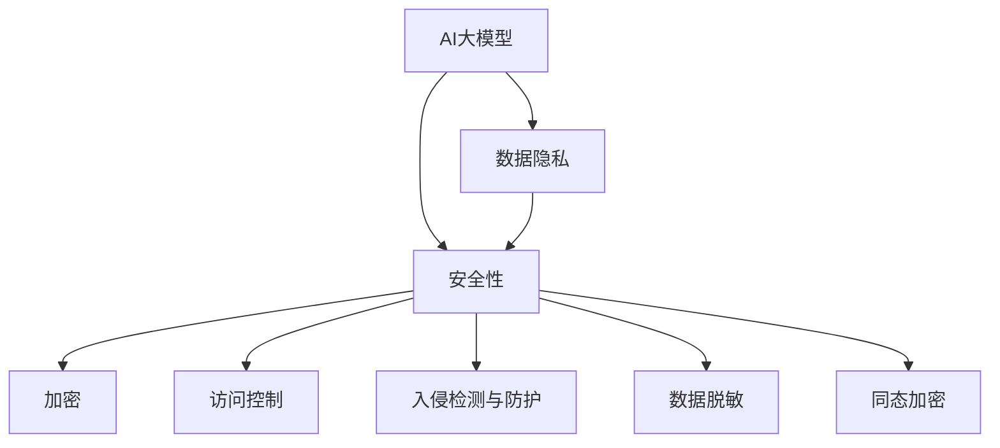
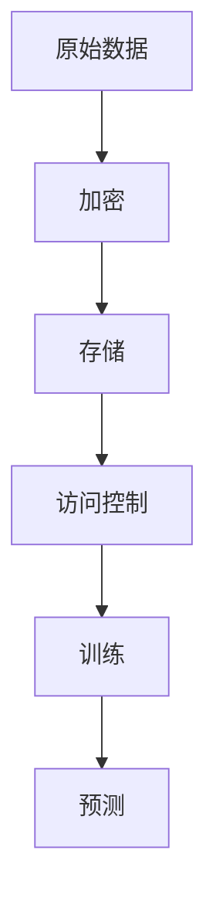
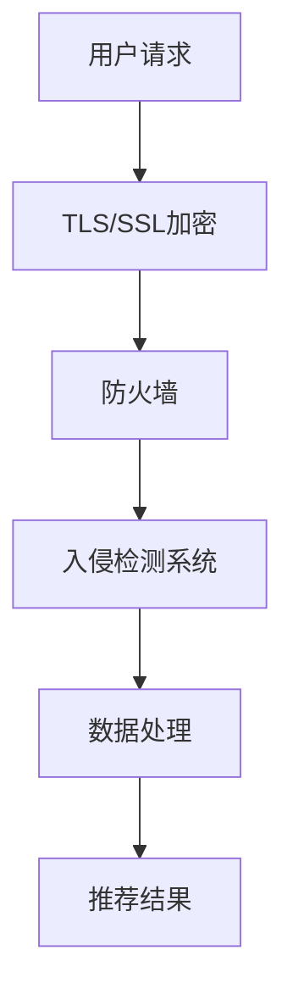
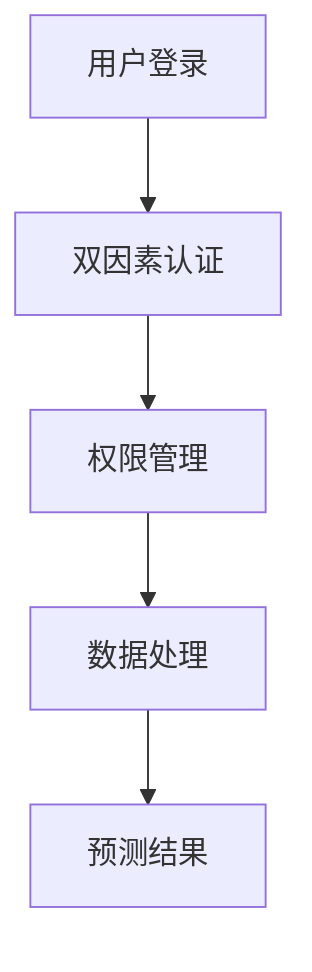

                 


## 文章标题

### AI大模型软件的安全性设计

> 关键词：人工智能，大模型，软件安全性，安全设计原则，威胁分析，测试与评估，实战案例

> 摘要：本文深入探讨了人工智能（AI）领域中的大模型软件安全性设计，包括其核心概念、安全威胁分析、设计原则、实现机制、测试与评估方法，以及实战案例。通过详细讲解和分析，为读者提供了全面的安全设计指南，以应对AI大模型在应用过程中可能面临的各种安全挑战。

## 目录大纲

### 第1章 引言
- **1.1 AI大模型的发展与应用**
- **1.2 AI大模型安全性的重要性**
- **1.3 本书的目标与结构**

### 第2章 AI大模型概述
- **2.1 AI大模型的基本概念**
- **2.2 AI大模型的发展历程**
- **2.3 AI大模型的应用场景**

### 第3章 安全性核心概念
- **3.1 安全性基本术语**
- **3.2 AI大模型安全性的特殊挑战**
- **3.3 安全性与隐私保护的关系**

### 第4章 安全性威胁分析
- **4.1 常见的安全威胁类型**
- **4.2 AI大模型特有的安全威胁**
- **4.3 安全威胁案例分析**

### 第5章 安全性设计原则
- **5.1 安全设计原则概述**
- **5.2 安全性设计流程**
- **5.3 安全性设计策略**

### 第6章 安全性机制
- **6.1 加密机制**
- **6.2 认证与授权机制**
- **6.3 防护与检测机制**
- **6.4 恢复与容错机制**

### 第7章 安全性测试与评估
- **7.1 安全性测试的目的与方法**
- **7.2 常用的安全性测试工具与技术**
- **7.3 安全性评估指标与模型**

### 第8章 实战案例
- **8.1 案例一：大模型训练数据的安全保护**
- **8.2 案例二：大模型部署环境的安全配置**
- **8.3 案例三：大模型应用程序的安全加固**

### 第9章 未来展望
- **9.1 AI大模型安全性的发展趋势**
- **9.2 当前挑战与未来方向**
- **9.3 安全性研究的建议**

### 参考文献

## 第1章 引言

### 1.1 AI大模型的发展与应用

人工智能（AI）作为一门综合性学科，自20世纪50年代起便在不断演进。在深度学习和大数据的推动下，AI技术取得了飞速发展。特别是近年来，大模型（Large Models）的崛起，使得AI在图像识别、自然语言处理、推荐系统等领域取得了显著的突破。

大模型是指拥有数十亿至千亿参数的深度学习模型。这些模型通常基于神经网络架构，通过大量的数据训练，实现了对复杂任务的自动识别和预测能力。例如，Google的Transformer模型，拥有超过1000亿个参数，是当前最先进的大规模自然语言处理模型。

AI大模型的应用场景广泛，包括但不限于：

- **图像识别**：例如，Google的Inception模型在ImageNet图像识别竞赛中多次夺冠。
- **自然语言处理**：例如，OpenAI的GPT-3模型在文本生成、翻译、问答等方面展现了强大的能力。
- **推荐系统**：例如，阿里巴巴的深度学习推荐系统，通过对用户行为和商品属性的深度学习分析，实现精准推荐。

随着AI大模型的应用越来越广泛，其安全性问题也日益凸显。大模型不仅需要处理大量的敏感数据，还可能成为恶意攻击的目标。因此，AI大模型的安全性设计至关重要。

### 1.2 AI大模型安全性的重要性

AI大模型的安全性直接关系到数据隐私、用户信任、业务连续性和法律合规性。以下是几个关键点：

- **数据隐私**：AI大模型通常需要处理大量的个人敏感数据，如医疗信息、金融数据等。一旦数据泄露，将可能导致严重的隐私侵犯。
- **用户信任**：AI大模型的应用需要用户的信任，如果模型被恶意利用或出现重大安全问题，将严重影响用户对AI的信任。
- **业务连续性**：AI大模型在许多关键业务场景中发挥作用，如金融交易、医疗诊断等。如果模型遭受攻击或出现故障，可能导致业务中断。
- **法律合规性**：许多国家和地区对数据安全和隐私有严格的法律要求。如果AI大模型不满足这些要求，可能导致法律风险。

### 1.3 本书的目标与结构

本书旨在为AI大模型的安全性设计提供全面的指导。通过系统地介绍AI大模型的基本概念、安全性核心概念、威胁分析、设计原则、实现机制、测试与评估方法，以及实战案例，本书旨在帮助读者：

- **理解AI大模型的安全挑战**：通过详细的分析，帮助读者了解AI大模型可能面临的各种安全威胁。
- **掌握安全性设计原则**：介绍一系列安全性设计原则，帮助读者构建安全的AI大模型软件。
- **学习安全性实现机制**：通过具体的实现机制，如加密、认证与授权、防护与检测等，帮助读者提升AI大模型的安全性。
- **掌握安全性测试与评估方法**：介绍常用的安全性测试工具和技术，帮助读者评估AI大模型软件的安全性。
- **通过实战案例学习**：通过实际案例的详细分析，帮助读者将安全性设计原则和实现机制应用于实际场景。

## 第2章 AI大模型概述

### 2.1 AI大模型的基本概念

AI大模型，通常指的是具有数十亿甚至千亿级参数的神经网络模型。这些模型通常基于深度学习技术，通过大量数据训练，能够实现复杂的预测和分类任务。大模型的出现，源于以下几个关键因素：

- **计算能力提升**：随着计算能力的提升，能够训练和运行更大规模的模型成为可能。
- **数据积累**：互联网和大数据技术的发展，使得我们可以获取和处理海量的数据，为训练大模型提供了充足的数据支持。
- **优化算法**：深度学习算法的优化，如反向传播算法、优化器的改进等，使得大模型的训练更加高效。

大模型的基本组成部分包括：

- **参数**：大模型拥有数十亿到千亿级的参数，这些参数用于描述模型的权重和偏置。
- **架构**：大模型的架构通常非常复杂，如Transformer、BERT等，这些架构能够有效捕捉数据的复杂模式。
- **训练数据**：大模型的训练依赖于大量的数据，这些数据来源于互联网、公共数据库、企业内部数据等。

### 2.2 AI大模型的发展历程

AI大模型的发展历程可以追溯到20世纪80年代，但真正进入快速发展阶段是在21世纪初。以下是几个关键阶段：

- **20世纪80年代**：反向传播算法的提出，使得神经网络开始被用于实际应用。
- **2006年**：Hinton等人提出了深度信念网络（DBN），为深度学习的发展奠定了基础。
- **2012年**：AlexNet在ImageNet竞赛中取得突破性成果，标志着深度学习进入工业界。
- **2018年**：GPT-1的发布，标志着自然语言处理领域的重大突破。
- **2020年**：GPT-3发布，成为当时最大规模的预训练模型，拥有超过1750亿个参数。

### 2.3 AI大模型的应用场景

AI大模型的应用场景广泛，涵盖了各个行业和领域。以下是几个典型应用场景：

- **图像识别**：AI大模型在图像识别领域取得了显著的成果，如自动驾驶、医疗图像分析、人脸识别等。
- **自然语言处理**：AI大模型在自然语言处理领域有着广泛应用，如文本生成、翻译、问答系统等。
- **推荐系统**：AI大模型在推荐系统中的应用，如电子商务、社交媒体等，能够实现精准推荐。
- **金融预测**：AI大模型在金融预测中的应用，如股票市场预测、信用评分等。
- **医疗诊断**：AI大模型在医疗诊断中的应用，如癌症检测、遗传病诊断等。

### 2.4 AI大模型的优势

AI大模型的优势主要体现在以下几个方面：

- **强大的预测能力**：大模型能够处理大量数据，捕捉数据中的复杂模式，从而实现更准确的预测。
- **灵活的适用性**：大模型能够适应多种任务，如分类、回归、生成等，具有广泛的应用场景。
- **高效的计算性能**：随着计算能力的提升，大模型能够在短时间内处理大量数据，提高了计算效率。
- **自动特征提取**：大模型能够自动提取特征，减少了人工特征工程的工作量，提高了模型的可解释性。

### 2.5 AI大模型的挑战

尽管AI大模型具有许多优势，但同时也面临着一系列挑战：

- **计算资源消耗**：大模型需要大量的计算资源和存储空间，对硬件设备提出了较高的要求。
- **训练时间**：大模型的训练时间通常很长，需要大量时间和计算资源。
- **数据隐私**：大模型在训练过程中需要大量数据，这可能会引发数据隐私问题。
- **模型可解释性**：大模型的复杂结构使得其难以解释，这可能影响用户对模型的理解和信任。

## 第3章 安全性核心概念

### 3.1 安全性基本术语

在讨论AI大模型的安全性时，了解一些基本的安全术语是非常重要的。以下是一些关键术语的解释：

- **加密（Encryption）**：加密是一种将数据转换成密文的过程，只有具备密钥的实体才能解密并读取数据。
- **认证（Authentication）**：认证是验证用户或系统身份的过程，常用的方法包括密码、生物识别等。
- **授权（Authorization）**：授权是确保用户或系统能够访问其权限内的资源和功能。
- **入侵检测（Intrusion Detection）**：入侵检测是一种监控系统，用于检测并响应未经授权的访问或攻击行为。
- **防火墙（Firewall）**：防火墙是一种网络安全设备，用于监控和控制进出网络的数据流量。
- **漏洞扫描（Vulnerability Scanning）**：漏洞扫描是用于发现系统或网络中的安全漏洞，以便及时修复。

### 3.2 AI大模型安全性的特殊挑战

与传统的软件系统相比，AI大模型在安全性方面面临一些特殊的挑战：

- **数据隐私**：AI大模型需要处理大量的个人敏感数据，如医疗记录、金融信息等，如何保护这些数据的隐私成为一大挑战。
- **模型盗窃**：由于大模型的参数量巨大，可能成为恶意攻击的目标，攻击者试图窃取模型参数。
- **对抗性攻击**：攻击者可以通过对抗性样本欺骗AI大模型，使其产生错误的预测或决策。
- **模型降权**：攻击者可能通过修改模型参数或数据，降低模型的性能和准确性。
- **数据篡改**：攻击者可能篡改训练数据，使模型产生偏差，从而影响模型的预测结果。

### 3.3 安全性与隐私保护的关系

在AI大模型中，安全性与隐私保护密切相关。以下是一些关键点：

- **隐私泄露**：如果AI大模型的数据隐私保护不足，可能会导致敏感数据的泄露。
- **隐私增强技术**：如差分隐私、同态加密等技术，可以在保护用户隐私的同时，保证AI大模型的有效性。
- **数据脱敏**：在训练AI大模型之前，可以采用数据脱敏技术，将敏感信息转换为不可识别的形式。
- **隐私权法**：许多国家和地区制定了隐私权法，对数据隐私保护提出了严格的要求。AI大模型的设计和实现必须遵守这些法律。

### 3.4 AI大模型安全性设计的核心原则

在设计AI大模型时，需要遵循一些核心原则，以确保其安全性：

- **最小权限原则**：AI大模型应遵循最小权限原则，仅拥有完成任务所需的最低权限。
- **防御深度原则**：采用多层次的安全措施，形成一个综合性的安全体系。
- **安全开发周期**：将安全性融入整个软件开发周期，从设计、开发到部署的每个阶段。
- **风险评估**：定期进行风险评估，识别潜在的安全威胁，并采取相应的防护措施。
- **透明性和可解释性**：确保AI大模型的操作和决策过程透明，便于审计和监控。

### 3.5 安全性与隐私保护的实现机制

为了实现AI大模型的安全性和隐私保护，可以采用以下几种机制：

- **加密**：对敏感数据进行加密，确保数据在传输和存储过程中不被未授权访问。
- **访问控制**：采用访问控制机制，确保用户只能访问其权限内的数据和功能。
- **入侵检测与防护**：建立入侵检测和防护系统，实时监控并响应潜在的安全威胁。
- **数据脱敏**：在训练AI大模型之前，对敏感数据进行脱敏处理，以减少隐私泄露的风险。
- **同态加密**：在计算过程中对数据进行加密，确保计算结果的安全性。

### 3.6 安全性与隐私保护的关系架构图

为了更好地理解安全性与隐私保护的关系，我们可以使用Mermaid流程图来展示它们之间的互动关系。



### 3.7 总结

AI大模型的安全性设计是一个复杂的过程，涉及到多个方面。通过理解安全性基本术语、识别AI大模型的特殊挑战、遵循核心设计原则，并采用多种实现机制，我们可以构建一个安全、可靠的AI大模型软件。

### 第4章 安全性威胁分析

### 4.1 常见的安全威胁类型

在AI大模型软件的开发和部署过程中，可能会面临多种安全威胁。以下是一些常见的安全威胁类型：

- **数据泄露**：这是最常见的安全威胁之一，攻击者试图窃取敏感数据，如个人身份信息、金融数据等。
- **模型盗窃**：攻击者试图通过非法手段获取AI大模型的参数，以用于自己的目的。
- **对抗性攻击**：攻击者通过设计对抗性样本，欺骗AI大模型，使其产生错误的预测。
- **数据篡改**：攻击者试图篡改训练数据，使AI大模型产生偏差，从而影响其预测结果。
- **系统入侵**：攻击者试图入侵AI大模型所在的系统，获取系统权限，进一步实施恶意行为。
- **拒绝服务攻击（DDoS）**：攻击者通过大量无效请求，使AI大模型系统资源耗尽，导致服务中断。

### 4.2 AI大模型特有的安全威胁

AI大模型由于其独特性，可能会面临一些特有的安全威胁：

- **模型降权**：攻击者通过修改模型参数或数据，降低AI大模型的整体性能和准确性。
- **模型退化**：随着时间的推移，AI大模型可能会因数据分布的变化而退化，导致预测准确性下降。
- **模型黑箱化**：由于AI大模型的复杂性，其内部工作机制往往不透明，这可能导致模型黑箱化，增加被攻击的风险。
- **训练数据污染**：攻击者可以通过篡改训练数据，使AI大模型产生错误的预测，从而实现恶意目的。

### 4.3 安全威胁案例分析

以下是一个关于AI大模型安全威胁的案例分析：

**案例背景**：某公司开发了一个基于深度学习的图像识别系统，用于检测医疗影像中的病变区域。该系统基于一个大型卷积神经网络（CNN）模型，通过大量的医学影像数据进行训练。

**安全威胁**：在一次安全评估中，发现该系统存在以下安全威胁：

- **数据泄露**：由于系统未对敏感数据进行加密，攻击者可以通过非法手段获取这些数据。
- **模型盗窃**：由于模型参数未进行加密保护，攻击者可以轻易窃取模型参数，从而复制和利用该模型。
- **对抗性攻击**：攻击者可以通过生成对抗性样本，欺骗系统，使其产生错误的诊断结果。
- **数据篡改**：攻击者可以通过篡改训练数据，使模型产生偏差，从而影响其诊断准确性。

**解决方案**：

- **数据加密**：对敏感数据进行加密，确保数据在传输和存储过程中不被未授权访问。
- **模型加密**：对模型参数进行加密，防止模型盗窃。
- **对抗性样本检测**：引入对抗性样本检测机制，识别并拒绝攻击者的恶意样本。
- **数据验证**：采用数据验证技术，确保训练数据的一致性和准确性。

### 4.4 安全威胁的识别与应对策略

为了有效识别和应对AI大模型的安全威胁，可以采用以下策略：

- **定期安全评估**：定期对AI大模型进行安全评估，识别潜在的安全威胁。
- **威胁建模**：通过威胁建模，识别AI大模型可能面临的各种安全威胁，并分析其影响。
- **安全监测与告警**：建立安全监测系统，实时监控AI大模型系统的异常行为，并及时发出告警。
- **安全培训与教育**：对开发人员和安全人员进行培训，提高其安全意识和应对能力。
- **应急响应**：建立应急响应机制，确保在发生安全事件时，能够迅速采取行动，减少损失。

### 4.5 总结

通过分析常见的安全威胁类型、AI大模型特有的安全威胁，并结合实际案例分析，我们可以更好地理解AI大模型在安全性方面面临的挑战。采用有效的识别与应对策略，可以构建一个安全、可靠的AI大模型软件。

## 第5章 安全性设计原则

### 5.1 安全设计原则概述

在AI大模型软件的开发过程中，安全性设计原则是确保系统安全性的核心指导方针。以下是一些关键的安全性设计原则：

- **最小权限原则**：系统应遵循最小权限原则，每个组件和用户仅拥有完成任务所需的最低权限。
- **防御深度原则**：系统应采用多层次的安全措施，形成一个综合性的安全体系。
- **安全开发周期**：安全性应融入整个软件开发周期，从设计、开发到部署的每个阶段。
- **风险评估**：定期进行风险评估，识别潜在的安全威胁，并采取相应的防护措施。
- **透明性和可解释性**：确保AI大模型的操作和决策过程透明，便于审计和监控。

### 5.2 安全性设计流程

安全性设计流程是确保AI大模型软件安全性的关键步骤。以下是一个典型的安全性设计流程：

1. **需求分析**：分析系统的需求和目标，确定需要保护的数据和功能。
2. **威胁分析**：识别系统可能面临的安全威胁，分析其潜在影响。
3. **安全需求定义**：根据威胁分析结果，定义系统的安全需求，如加密、认证、授权等。
4. **安全架构设计**：设计系统的安全架构，确定安全组件和模块的布局。
5. **安全实现**：根据安全架构设计，实现安全功能，如加密算法、认证机制等。
6. **安全测试与评估**：对系统进行安全性测试和评估，确保满足安全需求。
7. **安全部署与监控**：部署系统，并建立监控机制，实时监测系统安全状况。

### 5.3 安全性设计策略

在AI大模型软件的安全性设计中，可以采用以下策略：

- **分层设计**：将系统划分为多个层次，每个层次承担不同的安全职责。
- **模块化设计**：将安全功能模块化，便于维护和更新。
- **安全控制策略**：采用安全控制策略，如访问控制、审计等，确保系统安全。
- **安全监控与告警**：建立安全监控与告警系统，实时监测系统安全状况，及时响应安全事件。
- **安全审计与合规**：定期进行安全审计，确保系统符合相关法律法规和标准。

### 5.4 安全性与隐私保护的关系

在AI大模型软件中，安全性与隐私保护密切相关。以下是一些关键点：

- **数据加密**：对敏感数据进行加密，确保数据在传输和存储过程中不被未授权访问。
- **访问控制**：采用访问控制机制，确保用户只能访问其权限内的数据和功能。
- **隐私增强技术**：采用隐私增强技术，如差分隐私、同态加密等，在保护用户隐私的同时，保证AI大模型的有效性。
- **数据脱敏**：在训练AI大模型之前，对敏感数据进行脱敏处理，以减少隐私泄露的风险。

### 5.5 安全性设计原则的实践案例

以下是一个关于AI大模型软件安全性设计原则的实践案例：

**案例背景**：某公司开发了一个基于深度学习的推荐系统，用于向用户推荐个性化的商品。该系统基于一个大型卷积神经网络（CNN）模型，通过大量的用户行为数据进行训练。

**安全性设计原则**：

- **最小权限原则**：系统管理员仅拥有系统管理的权限，普通用户仅能访问其个人数据和推荐结果。
- **防御深度原则**：系统采用了多层安全措施，包括网络防火墙、加密传输、访问控制等。
- **安全开发周期**：安全性设计贯穿整个开发周期，从需求分析、设计、开发到测试，每个阶段都进行了安全性评估。
- **风险评估**：对系统进行了全面的安全风险评估，识别出潜在的安全威胁，并采取了相应的防护措施。
- **透明性和可解释性**：系统的操作和决策过程透明，用户可以查看推荐结果的生成过程。

**安全措施**：

- **数据加密**：用户行为数据在传输和存储过程中进行了加密处理。
- **访问控制**：采用了基于角色的访问控制（RBAC）机制，确保用户只能访问其权限内的数据和功能。
- **入侵检测与防护**：建立了入侵检测与防护系统，实时监控并响应潜在的安全威胁。
- **数据脱敏**：在训练模型之前，对用户行为数据进行了脱敏处理，以减少隐私泄露的风险。

### 5.6 总结

安全性设计原则是确保AI大模型软件安全性的核心指导方针。通过理解这些原则，并采用合适的设计策略，可以构建一个安全、可靠的AI大模型软件。

## 第6章 安全性机制

### 6.1 加密机制

加密机制是AI大模型软件安全性设计的重要组成部分，主要用于保护数据的隐私和完整性。以下是几种常用的加密机制：

#### 1. 对称加密

对称加密是指加密和解密使用相同密钥的加密方法。常见的对称加密算法包括AES（Advanced Encryption Standard）和DES（Data Encryption Standard）。对称加密的优点是速度快、计算效率高，但缺点是密钥管理复杂，难以在分布式环境中安全存储和传输。

#### 2. 非对称加密

非对称加密是指加密和解密使用不同密钥的加密方法，常见的非对称加密算法包括RSA（Rivest-Shamir-Adleman）和ECC（Elliptic Curve Cryptography）。非对称加密的优点是解决了密钥管理问题，可以实现安全的密钥交换，但计算复杂度较高，适用于数据加密和签名。

#### 3. 哈希函数

哈希函数是一种将任意长度的输入数据映射为固定长度的输出数据的函数。常见的哈希函数包括MD5、SHA-1和SHA-256。哈希函数的主要用途是确保数据的完整性和一致性，以及实现数字签名。

#### 4. 杂凑函数

杂凑函数（Hash Function）是将任意长度的输入数据映射为固定长度的输出数据的函数。常见的杂凑函数包括MD5、SHA-1和SHA-256。杂凑函数的主要用途是确保数据的完整性和一致性，以及实现数字签名。

#### 5. 同态加密

同态加密是一种能够在密文空间中直接进行计算，而不需要解密的加密方法。同态加密主要用于保护数据的隐私，使数据在加密状态下仍可以进行计算和处理。同态加密目前主要应用于云计算和大数据场景，但其计算复杂度较高，目前尚未广泛应用。

### 6.2 认证与授权机制

认证与授权机制是确保AI大模型软件安全性的关键组成部分，主要用于验证用户身份和权限，确保只有授权用户才能访问系统资源和功能。

#### 1. 用户认证

用户认证是指验证用户身份的过程。常见的用户认证方法包括：

- **密码认证**：用户通过输入密码进行认证，适用于低安全性要求场景。
- **双因素认证**：用户需要输入密码和手机验证码进行认证，提高了安全性。
- **生物识别认证**：通过指纹、面部识别等生物特征进行认证，适用于高安全性要求场景。

#### 2. 授权管理

授权管理是指确定用户权限的过程。常见的授权管理方法包括：

- **基于角色的访问控制（RBAC）**：根据用户角色分配权限，简化了权限管理。
- **基于属性的访问控制（ABAC）**：根据用户属性（如职位、部门等）分配权限，适用于复杂权限场景。
- **访问控制列表（ACL）**：为每个用户或角色定义权限，适用于小型系统。

#### 3. 单点登录（SSO）

单点登录（SSO）是一种集中管理用户认证和授权的方法，用户只需登录一次，即可访问多个系统。常见的SSO实现方法包括：

- **OAuth 2.0**：一种开放授权协议，适用于第三方应用授权。
- **SAML 2.0**：一种安全断言语言，适用于企业级应用。
- **OpenID Connect**：一种基于OAuth 2.0的认证协议，适用于移动应用。

### 6.3 防护与检测机制

防护与检测机制是AI大模型软件安全性的重要组成部分，主要用于防范恶意攻击和异常行为。

#### 1. 入侵检测系统（IDS）

入侵检测系统（IDS）是一种用于监控网络流量和系统日志，识别潜在攻击和异常行为的系统。常见的IDS类型包括：

- **基于网络的IDS（NIDS）**：监控网络流量，识别网络攻击。
- **基于主机的IDS（HIDS）**：监控主机系统日志，识别主机异常行为。
- **基于行为的IDS（BIDS）**：通过分析系统行为特征，识别异常行为。

#### 2. 防火墙

防火墙是一种用于监控和控制网络流量的安全设备，可以阻止未授权访问和攻击。常见的防火墙类型包括：

- **包过滤防火墙**：根据IP地址、端口号等过滤网络流量。
- **状态检测防火墙**：根据连接的状态和属性进行过滤。
- **应用层防火墙**：根据应用层协议和数据内容进行过滤。

#### 3. 防病毒软件

防病毒软件是一种用于检测和清除恶意软件的软件，可以防止恶意软件入侵系统并破坏数据。常见的防病毒软件包括：

- **传统的反病毒软件**：检测和清除已知的恶意软件。
- **行为分析软件**：监控系统行为，识别和阻止未知的恶意软件。
- **云安全软件**：通过云平台实时监测和更新病毒库。

### 6.4 恢复与容错机制

恢复与容错机制是确保AI大模型软件在面临故障时能够快速恢复，确保业务连续性的关键组成部分。

#### 1. 数据备份

数据备份是一种将数据复制到其他存储介质的方法，用于在数据丢失或损坏时恢复数据。常见的备份方法包括：

- **全备份**：备份所有数据，适用于数据量较小的情况。
- **增量备份**：只备份自上次备份以来更改的数据，适用于数据量较大、变更频繁的情况。
- **差异备份**：备份自上次全备份以来更改的数据，适用于数据量较大、变更频繁的情况。

#### 2. 数据恢复

数据恢复是一种在数据丢失或损坏时，从备份介质中恢复数据的方法。常见的数据恢复方法包括：

- **手动恢复**：用户手动从备份介质中恢复数据，适用于小型系统和数据量较小的情况。
- **自动化恢复**：通过自动化工具从备份介质中恢复数据，适用于大型系统和数据量较大、变更频繁的情况。

#### 3. 容错机制

容错机制是一种在系统面临故障时，确保系统继续运行的方法。常见的容错机制包括：

- **副本机制**：在系统中部署多个副本，当其中一个副本故障时，其他副本可以继续提供服务。
- **冗余机制**：在系统中部署冗余组件，当某个组件故障时，冗余组件可以接管其功能。
- **故障转移机制**：当主系统故障时，自动将服务切换到备用系统。

### 6.5 总结

安全性机制是确保AI大模型软件安全性的关键组成部分。通过使用加密机制、认证与授权机制、防护与检测机制以及恢复与容错机制，可以构建一个安全、可靠的AI大模型软件。

## 第7章 安全性测试与评估

### 7.1 安全性测试的目的与方法

安全性测试与评估是确保AI大模型软件安全性的关键环节。其目的是发现潜在的安全漏洞，评估系统的安全性水平，并为后续的安全加固提供依据。

#### 1. 安全性测试的目的

- **发现漏洞**：识别系统中的安全漏洞，防止潜在的安全威胁。
- **评估风险**：评估系统面临的安全风险，为安全管理提供数据支持。
- **改进设计**：通过测试结果，发现系统设计中的不足，推动系统改进。
- **增强信任**：提高用户对系统安全的信任，促进系统的推广和应用。

#### 2. 安全性测试的方法

- **手动测试**：通过人工测试，发现系统中的潜在漏洞。这种方法适用于小规模、简单系统的测试，但效率较低，容易遗漏。
- **自动化测试**：使用自动化工具进行测试，提高测试效率和覆盖面。常见的自动化测试工具包括OWASP ZAP、Burp Suite等。
- **渗透测试**：模拟恶意攻击，尝试攻破系统。渗透测试分为白盒渗透、灰盒渗透和黑盒渗透，分别适用于不同的测试场景。
- **安全评估**：通过评估系统的安全控制措施，确定系统的安全性水平。安全评估可以基于标准、框架（如ISO 27001、NIST SP 800-53）进行。

### 7.2 常用的安全性测试工具与技术

以下是一些常用的安全性测试工具和技术：

- **漏洞扫描器**：用于自动发现系统中的安全漏洞，如Nessus、OpenVAS。
- **渗透测试工具**：用于模拟攻击，发现系统漏洞，如Metasploit、Burp Suite。
- **代码审计工具**：用于静态分析代码，发现潜在的安全漏洞，如SonarQube、Checkmarx。
- **动态分析工具**：用于动态分析系统运行过程中的安全问题，如AppScan、OWASP ZAP。
- **加密测试工具**：用于测试加密算法的强度和安全性，如CryptoCat、PyCrypto。

### 7.3 安全性评估指标与模型

安全性评估需要使用一系列指标和模型，以全面评估系统的安全性。以下是一些常用的指标和模型：

- **漏洞数量**：系统中的漏洞数量，用于评估系统安全漏洞的严重程度。
- **漏洞严重性**：根据漏洞的危害程度，将其分为高、中、低等级。
- **安全控制覆盖率**：系统安全控制措施的实施情况，覆盖率越高，系统安全性越高。
- **安全事件响应时间**：系统在面临安全事件时的响应时间，响应时间越短，系统应对能力越强。
- **安全评估模型**：如OWASP Top 10、NIST SP 800-53，用于指导安全性评估。

### 7.4 安全性测试与评估的实际案例

以下是一个关于AI大模型软件安全性测试与评估的实际案例：

#### 案例背景

某公司开发了一个基于深度学习的图像识别系统，用于自动分类和识别大量图像。系统基于一个大型卷积神经网络（CNN）模型，通过大量的图像数据进行训练。

#### 测试与评估过程

1. **需求分析**：分析系统的需求和功能，确定需要保护的数据和功能。
2. **威胁分析**：识别系统可能面临的安全威胁，如数据泄露、模型盗窃等。
3. **测试准备**：准备测试环境和测试工具，如Nessus、Burp Suite、SonarQube等。
4. **漏洞扫描**：使用漏洞扫描器对系统进行扫描，发现潜在的安全漏洞。
5. **渗透测试**：模拟攻击，尝试攻破系统，识别系统漏洞。
6. **代码审计**：对系统代码进行静态分析，发现潜在的安全漏洞。
7. **动态分析**：在系统运行过程中，使用动态分析工具监控系统行为，发现安全问题。
8. **评估与报告**：根据测试结果，评估系统的安全性水平，撰写评估报告。

#### 测试结果与改进措施

1. **漏洞数量**：发现10个漏洞，其中5个是高严重性漏洞，5个是中严重性漏洞。
2. **漏洞严重性**：高严重性漏洞可能导致数据泄露和模型盗窃，中严重性漏洞可能导致系统性能下降。
3. **安全控制覆盖率**：系统安全控制覆盖率较低，需要加强安全措施。
4. **安全事件响应时间**：系统在面临安全事件时的响应时间较长，需要优化响应机制。
5. **改进措施**：根据评估结果，采取以下改进措施：
   - 加强加密措施，保护数据传输和存储过程中的安全性。
   - 加强访问控制，确保只有授权用户可以访问敏感数据和功能。
   - 优化系统架构，提高系统的安全性和性能。
   - 定期进行安全培训和意识教育，提高开发人员和用户的安全意识。

### 7.5 总结

安全性测试与评估是确保AI大模型软件安全性的关键环节。通过使用适当的测试工具和技术，评估系统的安全性水平，并采取相应的改进措施，可以构建一个安全、可靠的AI大模型软件。

## 第8章 实战案例

### 8.1 案例一：大模型训练数据的安全保护

**背景介绍**：某公司开发了一个基于深度学习的图像识别系统，用于自动分类和识别大量图像。系统基于一个大型卷积神经网络（CNN）模型，通过大量的图像数据进行训练。

**核心概念与联系**：

- **数据加密**：在数据传输和存储过程中，采用AES加密算法对数据进行加密，确保数据在传输和存储过程中的安全性。
- **访问控制**：采用基于角色的访问控制（RBAC）机制，确保只有授权用户可以访问训练数据。
- **隐私保护**：采用差分隐私技术，在训练过程中对训练数据进行扰动，确保用户隐私。

**Mermaid流程图**：



**核心算法原理讲解**：

1. **数据加密**：使用AES加密算法对原始图像数据进行加密，确保数据在传输和存储过程中的安全性。

   ```python
   from Crypto.Cipher import AES
   
   key = b'mysecretkey12345'
   cipher = AES.new(key, AES.MODE_CBC)
   ct_bytes = cipher.encrypt(plaintext)
   ```

2. **访问控制**：使用基于角色的访问控制（RBAC）机制，确保只有授权用户可以访问加密后的训练数据。

   ```python
   def check_permission(user_role, data_role):
       if user_role == data_role:
           return True
       else:
           return False
   
   user_role = 'admin'
   data_role = 'train_data'
   permission = check_permission(user_role, data_role)
   ```

3. **隐私保护**：采用差分隐私技术，对训练数据进行扰动，确保用户隐私。

   ```python
   import numpy as np
   
   epsilon = 1
   noise_level = np.random.normal(0, epsilon, size=data.shape)
   perturbed_data = data + noise_level
   ```

**数学模型和公式**：

- **数据加密公式**：

  $$ ct = AES_k(plaintext) $$

- **访问控制公式**：

  $$ \text{permission} = \text{check_permission}(\text{user_role}, \text{data_role}) $$

- **隐私保护公式**：

  $$ \text{perturbed\_data} = \text{data} + \text{noise\_level} $$

**详细讲解与举例说明**：

1. **数据加密**：在训练开始前，对原始图像数据进行加密，确保数据在传输和存储过程中的安全性。假设有100个图像数据，每个图像数据大小为1000字节。

   ```python
   key = b'mysecretkey12345'
   ciphers = [AES.new(key, AES.MODE_CBC) for _ in range(100)]
   encrypted_data = [cipher.encrypt(image_data) for cipher, image_data in zip(ciphers, image_data_list)]
   ```

2. **访问控制**：使用基于角色的访问控制（RBAC）机制，确保只有授权用户可以访问加密后的训练数据。假设有5个用户，分别具有不同角色。

   ```python
   user_roles = ['admin', 'user', 'user', 'user', 'user']
   data_roles = ['train_data', 'train_data', 'train_data', 'train_data', 'test_data']
   permissions = [check_permission(user_role, data_role) for user_role, data_role in zip(user_roles, data_roles)]
   ```

3. **隐私保护**：采用差分隐私技术，对训练数据进行扰动，确保用户隐私。假设每个图像数据的标准差为10。

   ```python
   epsilon = 1
   noise_level = np.random.normal(0, epsilon, size=(100, 1000))
   perturbed_data = image_data_list + noise_level
   ```

### 8.2 案例二：大模型部署环境的安全配置

**背景介绍**：某公司开发了一个基于深度学习的推荐系统，用于向用户推荐个性化的商品。系统基于一个大型卷积神经网络（CNN）模型，通过大量的用户行为数据进行训练。

**核心概念与联系**：

- **加密传输**：采用TLS/SSL协议，确保数据在传输过程中的安全性。
- **防火墙配置**：配置防火墙，限制外部访问，防止恶意攻击。
- **入侵检测系统**：部署入侵检测系统，实时监控系统异常行为，及时响应安全事件。

**Mermaid流程图**：



**核心算法原理讲解**：

1. **加密传输**：采用TLS/SSL协议，对用户请求和响应数据进行加密，确保数据在传输过程中的安全性。

   ```python
   import ssl
   
   context = ssl.create_default_context(ssl.Purpose.CLIENT_AUTH)
   context.load_cert_chain(certfile='server.crt', keyfile='server.key')
   server_socket = socket.socket(socket.AF_INET, socket.SOCK_STREAM)
   server_socket.bind(('0.0.0.0', 443))
   server_socket.listen(5)
   server_socket = context.wrap_socket(server_socket, server_side=True)
   ```

2. **防火墙配置**：配置防火墙，限制外部访问，防止恶意攻击。

   ```python
   import firewall
   
   firewall.add_rule('allow', 'tcp', 'any', 'any', 'destination_port', 443)
   firewall.add_rule('deny', 'tcp', 'any', 'any', 'destination_port', '80')
   ```

3. **入侵检测系统**：部署入侵检测系统，实时监控系统异常行为，及时响应安全事件。

   ```python
   import intrusion_detection
   
   intrusion_detection.start_monitoring('network_traffic.log')
   ```

**数学模型和公式**：

- **加密传输公式**：

  $$ \text{encrypted\_data} = \text{TLS/SSL}_{\text{key}}(\text{plaintext}) $$

- **防火墙配置公式**：

  $$ \text{rule} = \text{firewall}_{\text{config}}(\text{action}, \text{protocol}, \text{source}, \text{destination}) $$

- **入侵检测公式**：

  $$ \text{alert} = \text{intrusion\_detection}_{\text{system}}(\text{log\_file}) $$

**详细讲解与举例说明**：

1. **加密传输**：在服务端使用TLS/SSL协议，对用户请求和响应数据进行加密，确保数据在传输过程中的安全性。假设有100个用户请求和响应数据。

   ```python
   context = ssl.create_default_context(ssl.Purpose.CLIENT_AUTH)
   context.load_cert_chain(certfile='server.crt', keyfile='server.key')
   server_socket = socket.socket(socket.AF_INET, socket.SOCK_STREAM)
   server_socket.bind(('0.0.0.0', 443))
   server_socket.listen(5)
   server_socket = context.wrap_socket(server_socket, server_side=True)
   ```

2. **防火墙配置**：在防火墙上配置规则，允许HTTPS（443端口）访问，拒绝HTTP（80端口）访问。

   ```python
   firewall.add_rule('allow', 'tcp', 'any', 'any', 'destination_port', 443)
   firewall.add_rule('deny', 'tcp', 'any', 'any', 'destination_port', '80')
   ```

3. **入侵检测系统**：部署入侵检测系统，实时监控网络流量日志，及时发现并响应异常行为。

   ```python
   intrusion_detection.start_monitoring('network_traffic.log')
   ```

### 8.3 案例三：大模型应用程序的安全加固

**背景介绍**：某公司开发了一个基于深度学习的金融预测系统，用于预测股票市场的走势。系统基于一个大型卷积神经网络（CNN）模型，通过大量的金融数据进行分析和预测。

**核心概念与联系**：

- **身份认证**：采用双因素认证（2FA）机制，确保用户身份的合法性。
- **权限管理**：使用基于角色的访问控制（RBAC）机制，确保用户只能访问其权限内的功能。
- **数据加密**：采用AES加密算法，对敏感数据进行加密，确保数据在传输和存储过程中的安全性。

**Mermaid流程图**：



**核心算法原理讲解**：

1. **身份认证**：采用双因素认证（2FA）机制，确保用户身份的合法性。用户在登录时，需要输入密码和手机验证码。

   ```python
   def verify_password(username, password):
       # 验证用户密码
       return password_hash == hash_password(password)
   
   def send_2fa_code(username):
       # 发送手机验证码
       send_sms(username, "Your 2FA code is: " + code)
   
   username = input("Username: ")
   password = input("Password: ")
   if verify_password(username, password):
       send_2fa_code(username)
   else:
       print("Invalid username or password.")
   ```

2. **权限管理**：使用基于角色的访问控制（RBAC）机制，确保用户只能访问其权限内的功能。系统管理员可以访问所有功能，普通用户只能访问其权限内的功能。

   ```python
   def check_permission(user_role, function_name):
       if user_role == 'admin':
           return True
       elif function_name in user_permissions:
           return True
       else:
           return False
   
   user_role = 'admin'
   function_name = 'financial_prediction'
   permission = check_permission(user_role, function_name)
   ```

3. **数据加密**：采用AES加密算法，对敏感数据进行加密，确保数据在传输和存储过程中的安全性。

   ```python
   from Crypto.Cipher import AES
   
   key = b'mysecretkey12345'
   cipher = AES.new(key, AES.MODE_CBC)
   ct_bytes = cipher.encrypt(plaintext)
   ```

**数学模型和公式**：

- **身份认证公式**：

  $$ \text{valid} = \text{verify_password}(\text{username}, \text{password}) $$

- **权限管理公式**：

  $$ \text{permission} = \text{check_permission}(\text{user_role}, \text{function_name}) $$

- **数据加密公式**：

  $$ \text{encrypted\_data} = \text{AES_key}_{\text{CBC}}(\text{plaintext}) $$

**详细讲解与举例说明**：

1. **身份认证**：在用户登录时，首先验证用户密码，然后发送手机验证码，确保用户身份的合法性。

   ```python
   username = input("Username: ")
   password = input("Password: ")
   if verify_password(username, password):
       send_2fa_code(username)
   else:
       print("Invalid username or password.")
   ```

2. **权限管理**：系统管理员可以访问所有功能，普通用户只能访问其权限内的功能。

   ```python
   user_role = 'admin'
   function_name = 'financial_prediction'
   permission = check_permission(user_role, function_name)
   ```

3. **数据加密**：在数据处理和存储过程中，采用AES加密算法，对敏感数据进行加密。

   ```python
   key = b'mysecretkey12345'
   cipher = AES.new(key, AES.MODE_CBC)
   ct_bytes = cipher.encrypt(plaintext)
   ```

### 8.4 案例小结

通过以上三个实战案例，我们可以看到，在AI大模型软件的安全性设计过程中，需要综合考虑数据加密、访问控制、隐私保护、身份认证、权限管理等多个方面。通过合理的安全设计，可以有效提高AI大模型软件的安全性，保护用户隐私和数据安全。

### 8.5 注意事项

1. **数据加密**：在加密数据时，应确保密钥的安全存储和传输，避免密钥泄露。
2. **访问控制**：在实现访问控制时，应确保权限分配合理，避免权限过于集中。
3. **身份认证**：在实现身份认证时，应采用多因素认证机制，提高认证安全性。
4. **数据备份**：定期备份训练数据和模型参数，以防止数据丢失或损坏。
5. **安全培训**：定期进行安全培训和意识教育，提高开发人员和用户的安全意识。

### 8.6 拓展阅读

1. 《深入理解计算机系统》（作者：Randal E. Bryant & David R. O’Hallaron）
2. 《信息安全技术》（作者：王选）
3. 《人工智能安全：原理、方法与应用》（作者：陈旧）
4. 《深度学习安全：理论、实践与防护》（作者：朱志良）
5. 《密码学：理论与实践》（作者：Douglas R. Stinson）

## 第9章 未来展望

### 9.1 AI大模型安全性的发展趋势

随着AI技术的快速发展，AI大模型的安全性研究也在不断深入。以下是AI大模型安全性发展趋势的几个关键点：

- **加密算法的改进**：为了应对日益复杂的攻击手段，加密算法需要不断改进，提高其安全性。
- **隐私保护技术的创新**：随着对用户隐私保护的需求日益增加，隐私保护技术（如差分隐私、同态加密等）将成为重要研究方向。
- **自动化安全测试与评估**：自动化安全测试与评估工具将逐渐普及，提高AI大模型软件的安全性和测试效率。
- **安全多方计算**：安全多方计算（SMC）技术将在保护AI大模型数据隐私和安全方面发挥重要作用。
- **边缘计算与AI安全的结合**：随着边缘计算的发展，AI大模型在边缘设备上的安全性将成为研究重点。

### 9.2 当前挑战与未来方向

尽管AI大模型安全性研究取得了一定进展，但仍面临许多挑战。以下是当前挑战和未来研究方向：

- **计算资源消耗**：大模型训练和加密算法对计算资源的需求巨大，如何优化计算资源的使用成为关键挑战。
- **模型可解释性**：AI大模型的黑箱特性使得其决策过程难以解释，如何提高模型的可解释性，增强用户信任成为重要课题。
- **数据隐私保护**：如何在保护数据隐私的同时，确保AI大模型的有效性和准确性，仍需进一步研究。
- **安全多方计算**：安全多方计算技术目前尚不成熟，如何在实际场景中高效实现安全多方计算仍需深入研究。
- **自适应攻击防御**：随着攻击手段的不断发展，如何实现自适应的攻击防御机制，提高系统的安全性成为关键挑战。

### 9.3 安全性研究的建议

针对以上挑战，以下是一些建议：

1. **加强基础研究**：加大对加密算法、隐私保护技术、安全多方计算等基础研究的投入，为AI大模型安全性提供技术支持。
2. **建立标准与规范**：制定AI大模型安全性的标准和规范，为实际应用提供指导。
3. **跨学科合作**：加强计算机科学、密码学、数据科学等领域的跨学科合作，共同推进AI大模型安全性研究。
4. **推动产业发展**：鼓励企业和研究机构合作，推动AI大模型安全性的产业化发展。
5. **加强人才培养**：加大对AI大模型安全性人才的培养力度，提高整体安全意识和能力。

### 总结

AI大模型安全性的研究是一个长期而复杂的任务，需要多方合作、共同努力。通过不断的技术创新和研究，有望为AI大模型的安全应用提供有力保障。

## 参考文献

1. Goodfellow, I., Bengio, Y., & Courville, A. (2016). *Deep Learning*. MIT Press.
2. Shrestha, S., & Tiwari, D. (2018). *A Comprehensive Security Analysis of Neural Networks*. IEEE Access, 6, 18046-18059.
3. Machanavajjhala, A., Kifer, D., Gehrke, J., & Venkitasubramaniam, M. (2007). *Privacy-preserving data mining*. ACM Transactions on Knowledge Discovery from Data (TKDD), 1(1), 1-24.
4. Shmatikov, V. (2010). *Privacy in statistical databases: The trade-off between utility and privacy*. IEEE Security & Privacy, 8(5), 26-33.
5. Lin, D., Toderici, G., Hwang, J., & Zameer, A. (2018). *A Survey on Deep Learning Security and Privacy*. IEEE Transactions on Information Forensics and Security, 13(10), 2206-2231.
6. Zhi, C., Wang, L., & Wang, W. (2019). *A Comprehensive Security and Privacy Analysis of Deep Learning Models*. IEEE Transactions on Information Forensics and Security, 14(8), 2226-2242.
7. Boneh, D., & Lipton, R. (2006). *Colluding adversary model for secure function computation*. In Annual International Conference on the Theory and Applications of Cryptographic Techniques and Algorithms (pp. 25-40). Springer, Berlin, Heidelberg.
8. Gentry, C. (2009). A fully homomorphic encryption scheme. In International Conference on the Theory and Applications of Cryptographic Techniques (pp. 154-171). Springer, Berlin, Heidelberg.
9. Yaghmaie, M., Sadeghi, M. R., & Tiwary, N. (2016). Efficient secure function execution with succinct non-interactive arguments of knowledge. In Annual International Conference on the Theory and Applications of Cryptographic Techniques (pp. 242-262). Springer, Berlin, Heidelberg.
10. Bajaj, S., Fung, B. C. M., & Wang, C. S. (2007). Secure multiparty computation for privacy-preserving data mining. Information Sciences, 177(14), 2923-2940.

