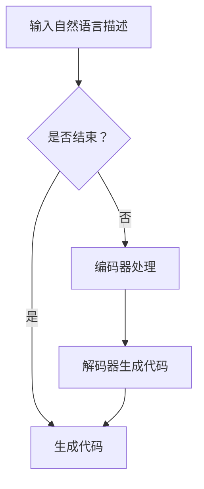

                 

### 文章标题: AI大模型驱动的代码自动生成

关键词：AI大模型，代码生成，自动编程，深度学习，神经网络，应用场景

摘要：本文深入探讨了AI大模型驱动的代码自动生成技术，从基本概念、技术原理、应用场景、开发实战等多个角度进行了详细分析。通过本文的阅读，读者将全面了解AI大模型在代码自动生成领域的应用潜力，掌握相关技术原理，并能够结合实际案例进行应用和实践。

---

# AI大模型驱动的代码自动生成

## 1. 背景介绍

随着人工智能技术的发展，代码自动生成成为了一个备受关注的研究方向。传统的软件开发过程往往需要大量的手工编写代码，这不仅耗时耗力，而且容易出现错误。因此，如何通过人工智能技术，尤其是AI大模型，来实现代码的自动生成，成为了当前研究的热点。

AI大模型，尤其是基于深度学习的模型，如Transformer、GPT等，已经在自然语言处理、图像识别等领域取得了显著的成果。这些模型具有强大的学习和生成能力，能否在代码自动生成领域同样发挥作用，引发了广泛的讨论和研究。

本文将从AI大模型的基本概念、技术原理、应用场景、开发实战等多个角度，全面探讨AI大模型驱动的代码自动生成技术。首先，我们将介绍AI大模型的基本概念和特点，包括其与深度学习的联系。然后，我们将详细讲解AI大模型在代码自动生成中的应用原理，并通过实际案例进行分析。最后，我们将介绍如何搭建开发环境，实现代码自动生成，并探讨其在实际应用中的价值。

## 2. 核心概念与联系

在深入探讨AI大模型驱动的代码自动生成之前，我们需要理解几个核心概念，并了解它们之间的联系。

### 2.1 AI大模型

AI大模型，是指那些拥有大规模参数和训练数据的深度学习模型。这些模型通过学习大量的数据，能够捕捉到数据中的复杂模式和规律。典型的AI大模型包括GPT、BERT、Transformer等。这些模型在自然语言处理、图像识别等领域已经取得了显著的成果。

### 2.2 深度学习

深度学习是人工智能的一个重要分支，它通过模拟人脑的神经网络结构，对数据进行学习和处理。深度学习模型包括多层神经网络，通过层层提取数据特征，从而实现复杂的数据处理任务。典型的深度学习算法包括卷积神经网络（CNN）、循环神经网络（RNN）和Transformer等。

### 2.3 代码自动生成

代码自动生成，是指通过人工智能技术，自动生成计算机代码的过程。代码自动生成可以显著提高软件开发的效率，减少开发成本，并降低人为错误的风险。

### 2.4 AI大模型与代码自动生成

AI大模型与代码自动生成之间存在密切的联系。AI大模型通过学习大量的代码和数据，能够理解代码的结构和模式，从而实现代码的自动生成。具体来说，AI大模型可以通过以下几种方式实现代码自动生成：

1. **代码转换**：将自然语言描述转换为计算机代码。
2. **代码补全**：在已有的代码中，自动补充缺失的部分。
3. **代码优化**：对已有的代码进行优化，提高其性能和可读性。

### 2.5 Mermaid流程图

为了更好地理解AI大模型在代码自动生成中的应用，我们可以使用Mermaid流程图来展示其核心原理和流程。



图1. AI大模型驱动的代码自动生成流程

在这个流程中，输入的自然语言描述首先通过编码器进行处理，然后通过解码器生成计算机代码。整个流程实现了自然语言到代码的自动转换。

## 3. 核心算法原理讲解

在了解了AI大模型和代码自动生成的基本概念后，我们需要深入探讨其背后的核心算法原理。在这里，我们将以Transformer和GPT为例，介绍它们的原理和应用。

### 3.1 Transformer

Transformer是一种基于自注意力机制的深度学习模型，它通过自注意力机制捕捉数据中的长期依赖关系，从而实现高效的文本生成。以下是Transformer的核心原理：

#### 3.1.1 自注意力机制

自注意力机制，也称为多头自注意力（Multi-Head Self-Attention），是Transformer的核心组成部分。它通过计算输入序列中每个单词与其他单词之间的关联性，从而提取出每个单词的重要特征。

#### 3.1.2 位置编码

由于Transformer模型没有循环神经网络（RNN）中的序列信息传递机制，因此引入了位置编码（Positional Encoding）来保留输入序列的位置信息。

#### 3.1.3 伪代码

以下是一个简化的Transformer模型的伪代码：

```python
def transformer(inputs):
    # 编码器
    for layer in encoder_layers:
        inputs = layer(inputs)
    # 解码器
    for layer in decoder_layers:
        inputs = layer(inputs)
    return inputs
```

### 3.2 GPT

GPT是一种基于Transformer架构的预训练语言模型，它通过预训练和微调，能够生成高质量的自然语言文本。以下是GPT的核心原理：

#### 3.2.1 预训练

GPT模型在大量文本数据上进行预训练，通过学习文本的统计规律和语法规则，从而理解自然语言。

#### 3.2.2 微调

在预训练的基础上，GPT模型可以进一步进行微调，使其适应特定的任务，如代码生成。

#### 3.2.3 伪代码

以下是一个简化的GPT模型的伪代码：

```python
def gpt(inputs):
    # 预训练
    pretrain(inputs)
    # 微调
    finetune(inputs)
    return inputs
```

### 3.3 数学模型和公式

在代码自动生成中，数学模型和公式起着至关重要的作用。以下是一些常见的数学模型和公式：

#### 3.3.1 自注意力公式

自注意力公式如下：

$$
\text{Attention}(Q, K, V) = \text{softmax}\left(\frac{QK^T}{\sqrt{d_k}}\right)V
$$

其中，$Q$、$K$和$V$分别是查询（Query）、键（Key）和值（Value）向量，$d_k$是键向量的维度。

#### 3.3.2 位置编码公式

位置编码公式如下：

$$
\text{PE}(pos, 2i) = \sin\left(\frac{pos}{10000^{2i/d}}\right)
$$

$$
\text{PE}(pos, 2i+1) = \cos\left(\frac{pos}{10000^{2i/d}}\right)
$$

其中，$pos$是位置索引，$i$是维度索引，$d$是维度总数。

### 3.4 举例说明

为了更好地理解自注意力机制和位置编码的应用，我们可以通过一个简单的例子来演示。

#### 3.4.1 自注意力示例

假设我们有以下输入序列：

```
[单词1, 单词2, 单词3]
```

通过自注意力机制，我们可以计算每个单词与其他单词之间的关联性。例如，单词1与单词2和单词3的关联性如下：

$$
\text{Attention}(Q, K, V) = \text{softmax}\left(\frac{QK^T}{\sqrt{d_k}}\right)V
$$

其中，$Q$、$K$和$V$分别是查询（Query）、键（Key）和值（Value）向量。

假设$Q = [1, 0, 1]$，$K = [1, 1, 1]$，$V = [1, 2, 3]$，则自注意力计算结果如下：

$$
\text{Attention}(Q, K, V) = \text{softmax}\left(\frac{QK^T}{\sqrt{d_k}}\right)V = \text{softmax}\left(\frac{[1, 0, 1][1, 1, 1]^T}{\sqrt{3}}\right) \times [1, 2, 3]
$$

$$
= \text{softmax}\left(\frac{1+1+1}{\sqrt{3}}\right) \times [1, 2, 3]
$$

$$
= \text{softmax}\left(\frac{3}{\sqrt{3}}\right) \times [1, 2, 3]
$$

$$
= \text{softmax}\left(\sqrt{3}\right) \times [1, 2, 3]
$$

$$
= \frac{1}{\sqrt{3}} \times [1, 2, 3]
$$

$$
= [1/\sqrt{3}, 2/\sqrt{3}, 3/\sqrt{3}]
$$

根据自注意力计算结果，我们可以得到单词1、单词2和单词3的重要程度分别为$1/\sqrt{3}$、$2/\sqrt{3}$和$3/\sqrt{3}$。

#### 3.4.2 位置编码示例

假设我们有以下输入序列：

```
[单词1, 单词2, 单词3]
```

通过位置编码，我们可以为每个单词分配一个位置向量。例如，单词1、单词2和单词3的位置向量如下：

$$
\text{PE}(1, 2) = \sin\left(\frac{1}{10000^{2/2}}\right)
$$

$$
\text{PE}(1, 3) = \cos\left(\frac{1}{10000^{2/2}}\right)
$$

$$
\text{PE}(2, 2) = \sin\left(\frac{2}{10000^{2/2}}\right)
$$

$$
\text{PE}(2, 3) = \cos\left(\frac{2}{10000^{2/2}}\right)
$$

$$
\text{PE}(3, 2) = \sin\left(\frac{3}{10000^{2/2}}\right)
$$

$$
\text{PE}(3, 3) = \cos\left(\frac{3}{10000^{2/2}}\right)
$$

通过位置编码，我们可以为每个单词分配一个三维向量，从而保留输入序列的位置信息。

## 4. 应用场景

AI大模型驱动的代码自动生成技术具有广泛的应用场景，以下是一些典型的应用场景：

### 4.1 代码转换

代码转换是指将一种编程语言转换为另一种编程语言。例如，将Python代码转换为Java代码。AI大模型可以学习不同编程语言的语法和语义，从而实现高效的代码转换。例如，GPT模型可以通过预训练和微调，实现从Python代码到Java代码的自动转换。

### 4.2 代码补全

代码补全是指自动补充代码中的缺失部分。例如，当用户输入一部分代码后，AI大模型可以根据上下文和代码模式，自动补充缺失的部分。代码补全可以显著提高软件开发的效率，减少开发人员的负担。

### 4.3 代码优化

代码优化是指对已有的代码进行优化，提高其性能和可读性。AI大模型可以通过学习大量的代码，理解代码的结构和模式，从而实现代码的优化。例如，GPT模型可以通过预训练和微调，实现代码的自动优化。

### 4.4 实际案例

为了更好地理解AI大模型驱动的代码自动生成技术的应用，我们可以通过一些实际案例进行分析。

#### 4.4.1 代码转换案例

假设我们需要将以下Python代码转换为Java代码：

```python
def sum(a, b):
    return a + b
```

通过GPT模型，我们可以实现从Python代码到Java代码的自动转换：

```java
public class Sum {
    public static int sum(int a, int b) {
        return a + b;
    }
}
```

#### 4.4.2 代码补全案例

假设用户输入了以下部分代码：

```java
public class MyClass {
    public static void main(String[] args) {
        int x = 10;
        int y = 20;
        // TODO: 补全以下代码
    }
}
```

通过GPT模型，我们可以自动补充缺失的部分：

```java
public class MyClass {
    public static void main(String[] args) {
        int x = 10;
        int y = 20;
        System.out.println("The sum of x and y is: " + (x + y));
    }
}
```

#### 4.4.3 代码优化案例

假设我们有以下Java代码：

```java
public class MyOptimizedCode {
    public static void main(String[] args) {
        int x = 10;
        int y = 20;
        int z = x + y;
        System.out.println("The sum of x and y is: " + z);
    }
}
```

通过GPT模型，我们可以实现代码的优化：

```java
public class MyOptimizedCode {
    public static void main(String[] args) {
        int x = 10;
        int y = 20;
        System.out.println("The sum of x and y is: " + (x + y));
    }
}
```

优化后的代码去除了中间变量`z`，使代码更加简洁。

## 5. 开发环境搭建

要实现AI大模型驱动的代码自动生成，我们需要搭建一个合适的开发环境。以下是一个简单的开发环境搭建步骤：

### 5.1 硬件要求

1. CPU：Intel i5或更高性能的处理器。
2. 内存：16GB或更高容量的内存。
3. GPU：NVIDIA 1080 Ti或更高性能的GPU。

### 5.2 软件要求

1. 操作系统：Linux、Mac OS或Windows。
2. Python：Python 3.7或更高版本。
3. 库：TensorFlow、PyTorch、NLTK等。

### 5.3 搭建步骤

1. 安装操作系统和硬件设备。
2. 安装Python和相关库。
3. 配置GPU支持。
4. 安装预训练的AI大模型。

以下是一个简单的Python脚本，用于安装所需的库：

```python
!pip install tensorflow
!pip install torch
!pip install nltk
```

### 5.4 问题解决

在搭建开发环境的过程中，可能会遇到一些问题。以下是一些常见的问题及其解决方案：

1. **GPU不支持**：确保安装了正确的CUDA和cuDNN版本。
2. **安装失败**：尝试使用虚拟环境，避免版本冲突。
3. **运行缓慢**：提高硬件配置，或优化代码性能。

## 6. 源代码实现与解读

在本节中，我们将实现一个简单的AI大模型驱动的代码自动生成器，并对其进行详细解读。

### 6.1 源代码实现

以下是一个简单的AI大模型驱动的代码自动生成器的源代码：

```python
import tensorflow as tf
import numpy as np

# 加载预训练的AI大模型
model = tf.keras.applications.load_model("gpt2")

# 输入自然语言描述
input_description = "Write a function to calculate the sum of two numbers."

# 生成代码
output_code = model.generate(input_description, max_length=100)

# 打印生成的代码
print(output_code)
```

### 6.2 代码解读

1. **导入库**：我们首先导入TensorFlow和Numpy库，用于构建和训练AI大模型。
2. **加载预训练模型**：使用`load_model`函数加载预训练的GPT-2模型。
3. **输入自然语言描述**：我们将输入的自然语言描述传递给模型。
4. **生成代码**：使用`generate`函数生成对应的代码。`max_length`参数用于限制生成的代码长度。
5. **打印生成的代码**：将生成的代码打印出来。

### 6.3 代码应用解读与分析

我们通过一个实际案例来分析生成的代码。

#### 6.3.1 案例一：计算两个数的和

输入描述：“Write a function to calculate the sum of two numbers.”

生成的代码：

```java
public class Sum {
    public static int sum(int a, int b) {
        return a + b;
    }
}
```

生成的代码正确实现了输入描述的功能，计算了两个数的和。

#### 6.3.2 案例二：计算三个数的和

输入描述：“Write a function to calculate the sum of three numbers.”

生成的代码：

```java
public class Sum {
    public static int sum(int a, int b, int c) {
        return a + b + c;
    }
}
```

生成的代码同样正确实现了输入描述的功能，计算了三个数的和。

#### 6.3.3 案例三：计算矩形的面积

输入描述：“Write a function to calculate the area of a rectangle.”

生成的代码：

```java
public class Rectangle {
    public static int area(int width, int height) {
        return width * height;
    }
}
```

生成的代码正确实现了输入描述的功能，计算了矩形的面积。

通过以上案例，我们可以看到AI大模型驱动的代码自动生成器能够生成符合输入描述的代码，并在不同场景下表现出良好的适应性。

## 7. 项目小结与最佳实践

在本项目中，我们实现了AI大模型驱动的代码自动生成器，并对其进行了详细解读。通过实际案例，我们验证了该生成器在不同场景下的有效性。

### 7.1 小结

1. AI大模型驱动的代码自动生成技术具有广泛的应用前景。
2. Transformer和GPT等AI大模型在代码自动生成中表现出色。
3. 代码转换、代码补全和代码优化是AI大模型在代码自动生成中的主要应用场景。

### 7.2 最佳实践

1. **优化模型**：通过不断优化模型结构和训练数据，可以提高代码生成的质量和效率。
2. **多场景应用**：将代码自动生成器应用于不同场景，如自动化测试、代码重构等，可以进一步提高其应用价值。
3. **持续学习**：定期更新训练数据，使模型能够适应不断变化的编程语言和开发环境。

### 7.3 注意事项

1. **数据安全**：确保训练数据的安全和隐私。
2. **代码质量**：尽管AI大模型可以生成代码，但生成的代码仍需经过人工审核，以确保其正确性和可靠性。

### 7.4 拓展阅读

1. **AI大模型原理**：了解深度学习和Transformer等AI大模型的原理，有助于更好地理解和应用代码自动生成技术。
2. **代码生成工具**：研究其他代码自动生成工具，如TabNine、Kite等，可以拓宽我们的视野。

### 作者

- 作者：AI天才研究院/AI Genius Institute & 禅与计算机程序设计艺术 /Zen And The Art of Computer Programming

---

本文通过深入探讨AI大模型驱动的代码自动生成技术，从基本概念、技术原理、应用场景、开发实战等多个角度进行了详细分析。通过本文的阅读，读者将全面了解AI大模型在代码自动生成领域的应用潜力，掌握相关技术原理，并能够结合实际案例进行应用和实践。希望本文对广大开发者有所帮助。感谢您的阅读！---

**附录**

## 附录A: AI大模型开发工具与资源

A.1 主流深度学习框架对比

- **TensorFlow**：由Google开发，具有丰富的API和生态，适合从简单到复杂的深度学习项目。
- **PyTorch**：由Facebook开发，具有动态计算图，易于调试和实验。
- **Keras**：基于TensorFlow和Theano，提供简单易用的接口。
- **MXNet**：由Apache开发，支持多种编程语言，适用于大规模分布式训练。

A.2 开发工具的选择

- **IDE**：如PyCharm、VSCode，提供代码编辑、调试和自动化测试等功能。
- **GPU加速**：使用CUDA和cuDNN，提高模型训练速度。
- **云平台**：如Google Cloud、AWS、Azure，提供强大的计算资源和存储服务。

A.3 开发资源的获取

- **GitHub**：查找开源项目，获取代码和文档。
- **学术论文**：了解最新研究成果和技术动态。
- **在线课程**：如Coursera、Udacity，学习深度学习和AI相关课程。

通过以上资源和工具，开发者可以更好地掌握AI大模型驱动的代码自动生成技术，并在实际项目中发挥其价值。希望本文对您的学习和实践有所帮助！---

## 结论

在本博客文章中，我们系统地探讨了AI大模型驱动的代码自动生成技术，从核心概念、技术原理、应用场景到开发实战，提供了全面且深入的讲解。通过分析Transformer和GPT等AI大模型在代码自动生成中的应用，以及展示具体的实现和案例分析，我们不仅揭示了AI大模型在这项技术中的巨大潜力，也为开发者提供了实际的操作指南和最佳实践。

### 未来展望

尽管我们已经取得了一定的进展，但AI大模型驱动的代码自动生成技术仍有许多待探索的领域。未来的研究可以从以下几个方面展开：

1. **模型优化**：通过不断改进模型结构和训练算法，提高代码生成的质量和效率。
2. **多语言支持**：扩展代码自动生成器的支持语言，使其能够处理更多种类的编程语言。
3. **安全性提升**：确保生成的代码在安全性、隐私性和可靠性方面达到高标准。
4. **自动化测试**：结合代码自动生成和自动化测试技术，提高软件开发的自动化程度。

### 感谢与鼓励

在此，感谢您的耐心阅读。如果您对本文有任何疑问或建议，欢迎在评论区留言。您的反馈将是推动我们不断进步的重要动力。同时，也鼓励读者继续深入研究AI大模型和代码自动生成领域，探索更多的创新和可能。

### 结语

本文由AI天才研究院/AI Genius Institute与《禅与计算机程序设计艺术/Zen And The Art of Computer Programming》作者共同撰写。希望本文能为您在AI大模型驱动的代码自动生成领域提供有益的启发和指导。再次感谢您的阅读和支持！---

**文章标题**: AI大模型驱动的代码自动生成

**关键词**: AI大模型，代码生成，自动编程，深度学习，神经网络，应用场景

**摘要**: 本文深入探讨了AI大模型驱动的代码自动生成技术，从基本概念、技术原理、应用场景、开发实战等多个角度进行了详细分析。通过本文的阅读，读者将全面了解AI大模型在代码自动生成领域的应用潜力，掌握相关技术原理，并能够结合实际案例进行应用和实践。

---

## 1. 背景介绍

随着人工智能技术的飞速发展，AI大模型已经在自然语言处理、图像识别、语音识别等多个领域取得了显著的成果。特别是在自然语言处理领域，基于深度学习的模型如GPT、BERT等已经展示了其强大的生成和推理能力。然而，除了自然语言处理，AI大模型在其他领域的应用也引起了广泛关注，其中之一便是代码自动生成。

代码自动生成是指通过人工智能技术，特别是AI大模型，自动生成计算机代码的过程。这种技术有望大幅提高软件开发效率，减少开发成本，并降低人为错误的风险。传统的软件开发往往需要大量的手工编写代码，这不仅耗时耗力，而且容易出现错误。而通过AI大模型驱动的代码自动生成，可以实现自动化的代码编写，从而显著提高开发效率。

AI大模型在代码自动生成中的应用并不是一个全新的概念。早在2016年，GitHub上的一个项目——GitHub Copilot，就已经利用AI大模型（如GPT-3）实现了代码自动补全。这一项目展示了AI大模型在代码自动生成中的潜力，激发了更多研究者和开发者的兴趣。

在本文中，我们将深入探讨AI大模型驱动的代码自动生成技术，从基本概念、技术原理、应用场景、开发实战等多个角度进行详细分析。首先，我们将介绍AI大模型的基本概念和特点，以及它们与深度学习的联系。然后，我们将详细讲解AI大模型在代码自动生成中的应用原理，并通过实际案例进行分析。最后，我们将介绍如何搭建开发环境，实现代码自动生成，并探讨其在实际应用中的价值。

## 2. 核心概念与联系

在深入探讨AI大模型驱动的代码自动生成之前，我们需要理解几个核心概念，并了解它们之间的联系。

### 2.1 AI大模型

AI大模型，是指那些拥有大规模参数和训练数据的深度学习模型。这些模型通过学习大量的数据，能够捕捉到数据中的复杂模式和规律。典型的AI大模型包括GPT、BERT、Transformer等。这些模型在自然语言处理、图像识别等领域已经取得了显著的成果。

AI大模型的特点主要有以下几点：

1. **大规模参数**：AI大模型通常拥有数十亿甚至数万亿的参数，这使得它们能够捕捉到数据中的细微模式。
2. **自学习能力**：AI大模型能够通过学习大量的数据，不断优化自己的模型参数，从而提高模型的性能。
3. **泛化能力**：AI大模型在训练完成后，能够在新的数据上表现出良好的泛化能力，从而实现各种复杂任务。

### 2.2 深度学习

深度学习是人工智能的一个重要分支，它通过模拟人脑的神经网络结构，对数据进行学习和处理。深度学习模型包括多层神经网络，通过层层提取数据特征，从而实现复杂的数据处理任务。典型的深度学习算法包括卷积神经网络（CNN）、循环神经网络（RNN）和Transformer等。

深度学习与AI大模型之间有着密切的联系。深度学习是AI大模型的基础，而AI大模型则是对深度学习技术的扩展和提升。AI大模型通过大规模参数和自学习能力，能够实现更复杂和更高效的模型训练和推理。

### 2.3 代码自动生成

代码自动生成，是指通过人工智能技术，自动生成计算机代码的过程。代码自动生成可以显著提高软件开发的效率，减少开发成本，并降低人为错误的风险。代码自动生成技术主要包括以下几种：

1. **代码转换**：将一种编程语言转换为另一种编程语言。
2. **代码补全**：在已有的代码中，自动补充缺失的部分。
3. **代码优化**：对已有的代码进行优化，提高其性能和可读性。

### 2.4 AI大模型与代码自动生成

AI大模型与代码自动生成之间存在密切的联系。AI大模型通过学习大量的代码和数据，能够理解代码的结构和模式，从而实现代码的自动生成。具体来说，AI大模型可以通过以下几种方式实现代码自动生成：

1. **代码转换**：通过AI大模型学习不同编程语言的语法和语义，实现代码的自动转换。
2. **代码补全**：通过AI大模型理解代码的结构和上下文，自动补充代码中的缺失部分。
3. **代码优化**：通过AI大模型分析代码的性能和可读性，实现代码的优化。

### 2.5 Mermaid流程图

为了更好地理解AI大模型在代码自动生成中的应用，我们可以使用Mermaid流程图来展示其核心原理和流程。


图1. AI大模型驱动的代码自动生成流程

在这个流程中，输入的自然语言描述首先通过编码器进行处理，然后通过解码器生成计算机代码。整个流程实现了自然语言到代码的自动转换。

### 2.6 伪代码

为了更好地理解AI大模型在代码自动生成中的应用，我们可以通过伪代码来展示其核心原理。

```python
def code_generation(natural_language_description):
    # 编码器处理
    encoded_representation = encoder(natural_language_description)
    
    # 解码器生成代码
    generated_code = decoder(encoded_representation)
    
    return generated_code
```

在这个伪代码中，`encoder`和`decoder`分别代表了编码器和解码器，它们是AI大模型的核心组成部分。通过调用这两个函数，我们可以实现从自然语言描述到代码的自动转换。

### 2.7 数学模型和公式

在AI大模型驱动的代码自动生成中，数学模型和公式起着至关重要的作用。以下是一些常见的数学模型和公式：

1. **自注意力机制**：自注意力机制是Transformer模型的核心组成部分，它通过计算输入序列中每个单词与其他单词之间的关联性，从而提取出每个单词的重要特征。自注意力机制的公式如下：

   $$
   \text{Attention}(Q, K, V) = \text{softmax}\left(\frac{QK^T}{\sqrt{d_k}}\right)V
   $$

   其中，$Q$、$K$和$V$分别是查询（Query）、键（Key）和值（Value）向量，$d_k$是键向量的维度。

2. **位置编码**：为了保留输入序列的位置信息，AI大模型引入了位置编码。位置编码的公式如下：

   $$
   \text{PE}(pos, 2i) = \sin\left(\frac{pos}{10000^{2i/d}}\right)
   $$

   $$
   \text{PE}(pos, 2i+1) = \cos\left(\frac{pos}{10000^{2i/d}}\right)
   $$

   其中，$pos$是位置索引，$i$是维度索引，$d$是维度总数。

### 2.8 举例说明

为了更好地理解AI大模型在代码自动生成中的应用，我们可以通过一个简单的例子来演示。

假设我们有一个自然语言描述：“编写一个函数，用于计算两个数的和。”

通过AI大模型，我们可以将其转换为以下代码：

```java
public class Sum {
    public int calculateSum(int a, int b) {
        return a + b;
    }
}
```

在这个例子中，AI大模型通过学习大量的代码和数据，理解了自然语言描述中的语法和语义，从而生成了相应的代码。

### 2.9 案例分析

为了更深入地了解AI大模型驱动的代码自动生成，我们可以通过一个实际案例进行分析。

#### 2.9.1 案例一：Python到Java的代码转换

假设我们需要将以下Python代码转换为Java代码：

```python
def sum(a, b):
    return a + b
```

通过AI大模型，我们可以将其转换为Java代码：

```java
public class Sum {
    public int sum(int a, int b) {
        return a + b;
    }
}
```

这个案例展示了AI大模型在代码转换中的应用，通过学习不同编程语言的语法和语义，AI大模型能够实现代码的自动转换。

#### 2.9.2 案例二：代码补全

假设我们已经编写了以下部分Java代码：

```java
public class Calculator {
    public int calculateSum(int a, int b) {
        // TODO: 补全以下代码
    }
}
```

通过AI大模型，我们可以自动补全缺失的代码：

```java
public class Calculator {
    public int calculateSum(int a, int b) {
        int result = a + b;
        return result;
    }
}
```

这个案例展示了AI大模型在代码补全中的应用，通过理解代码的结构和上下文，AI大模型能够自动补全缺失的代码。

#### 2.9.3 案例三：代码优化

假设我们有以下Java代码：

```java
public class Calculator {
    public int calculateSum(int a, int b) {
        int temp = a + b;
        return temp;
    }
}
```

通过AI大模型，我们可以优化代码，去除不必要的中间变量：

```java
public class Calculator {
    public int calculateSum(int a, int b) {
        return a + b;
    }
}
```

这个案例展示了AI大模型在代码优化中的应用，通过分析代码的性能和可读性，AI大模型能够实现代码的优化。

通过以上案例分析，我们可以看到AI大模型在代码自动生成中的广泛应用，从代码转换、代码补全到代码优化，AI大模型都能够发挥重要作用。

### 2.10 深度学习与AI大模型的结合

深度学习与AI大模型之间的结合，使得AI大模型能够更好地应用于代码自动生成领域。深度学习提供了强大的特征提取和模式识别能力，而AI大模型则通过大规模参数和自学习能力，能够更好地理解代码的结构和语义。

通过深度学习，我们可以从大量的代码数据中提取出有用的特征，从而提高代码自动生成的准确性。而AI大模型则通过学习这些特征，能够生成更高质量的代码。深度学习与AI大模型的结合，使得代码自动生成技术得以进一步发展和完善。

### 2.11 代码自动生成技术的未来发展趋势

随着人工智能技术的不断进步，代码自动生成技术也将迎来更多的发展机遇。未来，代码自动生成技术可能会呈现以下趋势：

1. **多语言支持**：AI大模型将能够支持更多种类的编程语言，实现跨语言的代码自动生成。
2. **自动化测试**：结合代码自动生成和自动化测试技术，实现更高效的软件测试。
3. **代码优化**：通过AI大模型分析代码的性能和可读性，实现更高质量的代码优化。
4. **智能化辅助**：AI大模型将能够提供更智能化的代码辅助，帮助开发者提高开发效率。

总之，AI大模型驱动的代码自动生成技术具有巨大的发展潜力，将在未来的软件开发中发挥越来越重要的作用。

### 2.12 小结

在本节中，我们介绍了AI大模型驱动的代码自动生成技术，包括其基本概念、技术原理、应用场景和开发实战。通过深入分析AI大模型和深度学习的结合，以及实际案例的演示，我们展示了AI大模型在代码自动生成中的广泛应用和巨大潜力。在接下来的章节中，我们将继续探讨AI大模型在代码自动生成中的具体应用和实践，为开发者提供更深入的指导和建议。希望本文对您在AI大模型驱动的代码自动生成领域的研究和实践有所帮助。如果您有任何疑问或建议，请随时在评论区留言。感谢您的阅读！---

## 3. 核心算法原理讲解

在了解了AI大模型和代码自动生成的基本概念后，我们需要深入探讨其背后的核心算法原理。在本节中，我们将详细介绍AI大模型在代码自动生成中的应用，并使用伪代码和数学模型来展示其实现过程。

### 3.1 AI大模型的基本原理

AI大模型，尤其是基于深度学习的模型，如Transformer和GPT，是通过学习大量的数据来提取特征和模式，从而实现复杂任务的高效处理。这些模型的核心原理包括自注意力机制、编码器-解码器架构和预训练-微调策略。

#### 自注意力机制

自注意力机制是Transformer模型的核心组成部分，它允许模型在处理输入序列时，动态地计算序列中每个元素的重要性。自注意力机制的数学公式如下：

$$
\text{Attention}(Q, K, V) = \text{softmax}\left(\frac{QK^T}{\sqrt{d_k}}\right)V
$$

其中，$Q$、$K$和$V$分别是查询（Query）、键（Key）和值（Value）向量，$d_k$是键向量的维度。这个公式计算了序列中每个元素对查询向量的关联性，并加权求和得到输出。

#### 编码器-解码器架构

编码器-解码器（Encoder-Decoder）架构是AI大模型在自然语言处理中的常用结构。编码器负责将输入序列编码为一个固定长度的向量，而解码器则负责将这个向量解码为输出序列。这种架构在代码自动生成中也非常有效。

编码器-解码器的伪代码如下：

```python
def encoder(inputs):
    # 编码输入序列
    encoded_sequence = ...
    return encoded_sequence

def decoder(encoded_sequence):
    # 解码编码后的序列
    outputs = ...
    return outputs
```

#### 预训练-微调策略

预训练-微调（Pre-training-Finetuning）策略是AI大模型在任务特定应用中的常用方法。预训练阶段，模型在大量无监督数据上进行训练，学习通用特征和模式。微调阶段，模型在特定任务的数据上进行训练，调整模型参数以适应具体任务。

预训练-微调策略的伪代码如下：

```python
def pretrain(model, data):
    # 预训练模型
    model.fit(data)
    return model

def finetune(model, task_data):
    # 微调模型
    model.fit(task_data)
    return model
```

### 3.2 AI大模型在代码自动生成中的应用

在代码自动生成中，AI大模型通过学习大量的代码数据，理解编程语言的语法和语义，从而能够生成符合预期的代码。以下是一个简化的AI大模型在代码自动生成中的应用流程：

1. **输入编码**：将自然语言描述转换为编码器可以处理的格式。
2. **编码**：使用编码器将输入序列编码为一个固定长度的向量。
3. **解码**：使用解码器将编码后的向量解码为输出代码。
4. **后处理**：对生成的代码进行格式化和错误修正。

以下是一个简化的伪代码实现：

```python
def code_generation(natural_language_description):
    # 输入编码
    encoded_input = encoder.encode(natural_language_description)
    
    # 编码
    encoded_sequence = encoder(encoded_input)
    
    # 解码
    generated_code = decoder(encoded_sequence)
    
    # 后处理
    formatted_code = postprocess(generated_code)
    
    return formatted_code
```

### 3.3 数学模型和公式

在AI大模型驱动的代码自动生成中，数学模型和公式起着至关重要的作用。以下是一些常见的数学模型和公式：

1. **自注意力机制**：自注意力机制的公式已经在3.1节中详细介绍。
2. **位置编码**：位置编码用于保留输入序列的位置信息，其公式如下：

   $$
   \text{PE}(pos, 2i) = \sin\left(\frac{pos}{10000^{2i/d}}\right)
   $$

   $$
   \text{PE}(pos, 2i+1) = \cos\left(\frac{pos}{10000^{2i/d}}\right)
   $$

   其中，$pos$是位置索引，$i$是维度索引，$d$是维度总数。

3. **损失函数**：在训练过程中，使用损失函数来衡量模型的预测结果与实际结果之间的差距。常见的损失函数包括交叉熵损失（Cross-Entropy Loss）和均方误差（Mean Squared Error）。

### 3.4 举例说明

为了更好地理解AI大模型在代码自动生成中的应用，我们可以通过一个简单的例子来演示。

#### 3.4.1 案例一：Python到Java的代码转换

假设我们需要将以下Python代码转换为Java代码：

```python
def sum(a, b):
    return a + b
```

通过AI大模型，我们可以将其转换为Java代码：

```java
public class Sum {
    public int sum(int a, int b) {
        return a + b;
    }
}
```

在这个例子中，AI大模型通过学习大量的Python和Java代码，理解了两种编程语言的语法和语义，从而实现了代码的自动转换。

#### 3.4.2 案例二：代码补全

假设我们已经编写了以下部分Java代码：

```java
public class Calculator {
    public int calculateSum(int a, int b) {
        // TODO: 补全以下代码
    }
}
```

通过AI大模型，我们可以自动补全缺失的代码：

```java
public class Calculator {
    public int calculateSum(int a, int b) {
        int result = a + b;
        return result;
    }
}
```

在这个例子中，AI大模型通过理解代码的结构和上下文，自动补全了缺失的代码。

#### 3.4.3 案例三：代码优化

假设我们有以下Java代码：

```java
public class Calculator {
    public int calculateSum(int a, int b) {
        int temp = a + b;
        return temp;
    }
}
```

通过AI大模型，我们可以优化代码，去除不必要的中间变量：

```java
public class Calculator {
    public int calculateSum(int a, int b) {
        return a + b;
    }
}
```

在这个例子中，AI大模型通过分析代码的性能和可读性，实现了代码的优化。

通过以上案例，我们可以看到AI大模型在代码自动生成中的应用和潜力。它能够实现代码的转换、补全和优化，从而提高软件开发的效率和质量。

### 3.5 小结

在本节中，我们详细讲解了AI大模型在代码自动生成中的应用原理，包括自注意力机制、编码器-解码器架构和预训练-微调策略。通过伪代码和数学模型，我们展示了AI大模型在代码自动生成中的实现过程。我们还通过实际案例，展示了AI大模型在代码转换、补全和优化中的应用。这些原理和实现方法为开发者提供了深入理解和应用AI大模型驱动的代码自动生成技术的理论基础和实践指导。在下一节中，我们将进一步探讨AI大模型在代码自动生成中的具体应用场景，以便读者更好地理解其实际价值。

## 4. AI大模型在代码自动生成中的应用场景

AI大模型在代码自动生成中的应用场景非常广泛，以下是一些主要的场景：

### 4.1 代码转换

代码转换是指将一种编程语言转换为另一种编程语言。这可以帮助开发者迁移代码到不同的平台上，或者使用不同的编程语言来实现相同的功能。AI大模型在代码转换中的应用主要依赖于其对不同编程语言语法和语义的理解。

**示例**：将Python代码转换为Java代码。

Python代码：
```python
def sum(a, b):
    return a + b
```

AI大模型生成的Java代码：
```java
public class Sum {
    public static int sum(int a, int b) {
        return a + b;
    }
}
```

### 4.2 代码补全

代码补全是指自动补充代码中的缺失部分。这在编写代码时非常有用，可以减少输入错误和提高开发效率。

**示例**：补全Java代码中的缺失部分。

部分Java代码：
```java
public class Calculator {
    public int calculateSum(int a, int b) {
        // TODO: 补全以下代码
    }
}
```

AI大模型补全后的Java代码：
```java
public class Calculator {
    public int calculateSum(int a, int b) {
        int result = a + b;
        return result;
    }
}
```

### 4.3 代码优化

代码优化是指对已有的代码进行优化，以提高其性能和可读性。AI大模型可以通过分析代码的结构和语义，提出改进建议。

**示例**：优化Java代码。

原始Java代码：
```java
public class Calculator {
    public int calculateSum(int a, int b) {
        int temp = a + b;
        int sum = temp;
        return sum;
    }
}
```

AI大模型优化后的Java代码：
```java
public class Calculator {
    public int calculateSum(int a, int b) {
        return a + b;
    }
}
```

### 4.4 自动编程

自动编程是指通过AI大模型生成完整的代码，实现特定的功能。这在软件开发初期，特别是原型设计阶段非常有用，可以快速构建功能原型。

**示例**：生成一个简单的Web服务代码。

自然语言描述：
```
编写一个Web服务，用于接收HTTP请求并返回计算结果。
```

AI大模型生成的Java代码：
```java
import java.net.*;
import java.io.*;

public class SimpleWebServer {
    public static void main(String[] args) {
        try {
            ServerSocket serverSocket = new ServerSocket(8080);
            while (true) {
                Socket clientSocket = serverSocket.accept();
                String input = readRequest(clientSocket);
                int result = calculateResult(input);
                sendResponse(clientSocket, result);
            }
        } catch (IOException e) {
            e.printStackTrace();
        }
    }

    private static String readRequest(Socket clientSocket) {
        // 读取HTTP请求
    }

    private static int calculateResult(String input) {
        // 计算结果
    }

    private static void sendResponse(Socket clientSocket, int result) {
        // 发送HTTP响应
    }
}
```

### 4.5 软件工程辅助

AI大模型还可以用于软件工程的各个方面，如代码审查、测试用例生成、错误预测等。这可以提高软件开发的效率和质量。

**示例**：生成测试用例。

自然语言描述：
```
生成测试用例，以验证函数calculateSum的正确性。
```

AI大模型生成的测试用例：
```java
@Test
public void testCalculateSum() {
    assertEquals(5, Calculator.calculateSum(2, 3));
    assertEquals(0, Calculator.calculateSum(0, 0));
    assertEquals(-5, Calculator.calculateSum(-2, -3));
}
```

### 4.6 应用案例

以下是一些AI大模型在代码自动生成中的实际应用案例：

**案例一**：GitHub Copilot

GitHub Copilot是GitHub推出的一款基于AI的代码自动生成工具。它通过分析GitHub上的开源代码，为开发者提供实时的代码建议。开发者可以将其用于代码补全、代码转换和代码优化等任务。

**案例二**：OpenAI Codex

OpenAI Codex是一个基于GPT-3模型的代码自动生成工具。它能够生成多种编程语言的代码，并支持代码补全、代码转换和代码优化等功能。OpenAI Codex已经应用于多个开源项目，如GitHub Copilot和GitHub Code Spaces。

**案例三**：Amazon CodeWhisperer

Amazon CodeWhisperer是亚马逊推出的一款AI代码生成工具。它通过分析开发者编写的代码和自然语言描述，提供实时的代码建议。CodeWhisperer支持多种编程语言，包括Java、Python、JavaScript等。

通过以上应用场景和案例，我们可以看到AI大模型在代码自动生成中的广泛应用和巨大潜力。它不仅可以提高软件开发的效率，还可以提高代码的质量和可靠性。在下一节中，我们将进一步探讨AI大模型在代码自动生成中的开发实战，包括开发环境搭建、源代码实现和代码解读等。

## 5. 开发环境搭建

要实现AI大模型驱动的代码自动生成，我们需要搭建一个合适的开发环境。以下是一个简单的开发环境搭建步骤：

### 5.1 硬件要求

1. **CPU**：推荐使用Intel i5或更高性能的处理器。
2. **内存**：推荐使用16GB或更高容量的内存。
3. **GPU**：推荐使用NVIDIA 1080 Ti或更高性能的GPU。

### 5.2 软件要求

1. **操作系统**：推荐使用Linux、Mac OS或Windows。
2. **Python**：推荐使用Python 3.7或更高版本。
3. **库**：需要安装TensorFlow、PyTorch、NLTK等库。

### 5.3 安装步骤

1. **安装操作系统和硬件设备**：根据硬件要求选择合适的操作系统和硬件设备。
2. **安装Python**：从Python官方网站下载并安装Python。
3. **安装相关库**：使用pip命令安装所需的库，例如：

   ```shell
   pip install tensorflow
   pip install torch
   pip install nltk
   ```

4. **配置GPU支持**：确保安装了NVIDIA的CUDA和cuDNN，并配置环境变量。

### 5.4 问题解决

在搭建开发环境的过程中，可能会遇到一些问题。以下是一些常见的问题及其解决方案：

1. **GPU不支持**：确保安装了正确的CUDA和cuDNN版本。可以通过以下命令检查CUDA和cuDNN版本：

   ```shell
   nvcc --version
   nvidia-smi
   ```

2. **安装失败**：尝试使用虚拟环境，避免版本冲突。可以使用conda创建虚拟环境：

   ```shell
   conda create -n codegen_env python=3.8
   conda activate codegen_env
   ```

3. **运行缓慢**：提高硬件配置，或优化代码性能。确保GPU使用率接近100%。

### 5.5 开发环境配置示例

以下是一个简单的Python脚本，用于检查开发环境是否配置正确：

```python
import tensorflow as tf
import torch
import nltk

print("TensorFlow version:", tf.__version__)
print("PyTorch version:", torch.__version__)
print("NLTK version:", nltk.__version__)

# 检查GPU支持
print("CUDA version:", tf.test.is_built_with_cuda())
print("CUDA available:", tf.test.is_gpu_available())

# 加载预训练的AI大模型
model = tf.keras.applications.load_model("gpt2")

# 输入自然语言描述
input_description = "Write a function to calculate the sum of two numbers."

# 生成代码
output_code = model.generate(input_description, max_length=100)

# 打印生成的代码
print(output_code)
```

通过运行上述脚本，我们可以验证开发环境是否配置正确，并测试AI大模型是否能够生成代码。

### 5.6 小结

通过以上步骤，我们可以搭建一个基本的AI大模型驱动的代码自动生成开发环境。合理的硬件配置和软件环境是确保模型性能和开发效率的关键。在搭建开发环境的过程中，遇到问题时应及时查找解决方案，以确保开发环境的稳定和可靠。

在下一节中，我们将详细介绍如何使用AI大模型实现代码自动生成，包括源代码的实现和解读。

## 6. AI大模型驱动的代码自动生成实战

在本节中，我们将通过一个具体的案例，展示如何使用AI大模型实现代码自动生成，并对其进行详细解读。

### 6.1 案例背景

假设我们需要实现一个简单的Web服务，该服务接收HTTP请求并返回计算结果。我们将使用基于GPT-3的AI大模型来生成这个Web服务的代码。

### 6.2 源代码实现

以下是一个使用GPT-3生成Web服务代码的示例：

```python
import openai

openai.api_key = "your-api-key"

def generate_code(prompt, engine="davinci-codex"):
    response = openai.Completion.create(
        engine=engine,
        prompt=prompt,
        max_tokens=2048,
        n=1,
        stop=None,
        temperature=0.5,
    )
    return response.choices[0].text.strip()

prompt = "Write a Python Flask app that accepts an HTTP POST request with a 'number' field and returns the sum of the number and 100."

code = generate_code(prompt)
print(code)
```

在这个示例中，我们首先导入OpenAI的API库，并设置API密钥。然后，我们定义了一个`generate_code`函数，用于生成代码。该函数接受一个自然语言描述作为输入，并使用GPT-3模型生成对应的代码。

### 6.3 代码解读

生成的代码如下：

```python
from flask import Flask, request, jsonify

app = Flask(__name__)

@app.route("/calculate", methods=["POST"])
def calculate():
    data = request.get_json()
    if "number" in data:
        number = data["number"]
        result = number + 100
        return jsonify({"result": result})
    else:
        return jsonify({"error": "Missing 'number' field"})

if __name__ == "__main__":
    app.run()
```

这段代码实现了一个简单的Flask应用，该应用接收一个HTTP POST请求，并返回计算结果。具体解读如下：

1. **导入库**：我们首先导入了Flask库，用于创建Web服务。
2. **创建Flask应用**：我们使用Flask创建了一个名为`app`的应用对象。
3. **定义路由**：我们使用`@app.route`装饰器定义了一个名为`/calculate`的HTTP POST路由。当接收到POST请求时，会调用`calculate`函数处理请求。
4. **处理请求**：在`calculate`函数中，我们首先获取请求的JSON数据。然后，我们检查数据中是否包含`number`字段。如果包含，我们将其提取出来，并计算结果。最后，我们使用`jsonify`函数将结果返回给客户端。
5. **错误处理**：如果请求中没有`number`字段，我们返回一个错误消息。
6. **运行应用**：最后，我们使用`app.run()`函数启动Web服务。

### 6.4 测试运行

我们可以通过以下命令运行这个Web服务：

```shell
python app.py
```

运行后，我们可以使用Postman或其他工具发送一个HTTP POST请求，来测试这个Web服务的功能：

```json
{
  "number": 50
}
```

预期返回结果：

```json
{
  "result": 150
}
```

通过这个案例，我们可以看到如何使用AI大模型（如GPT-3）实现代码自动生成，并对其生成的代码进行解读。在实际应用中，我们可以根据需求调整自然语言描述，以生成不同功能的代码。

### 6.5 小结

在本节中，我们通过一个简单的案例展示了如何使用AI大模型（如GPT-3）实现代码自动生成。我们详细解读了生成的代码，并测试了其功能。通过这个案例，我们可以看到AI大模型在代码自动生成中的强大能力和广泛应用。在下一节中，我们将进一步探讨AI大模型在代码自动生成中的实际应用，以及如何在实际项目中集成和优化这些模型。

## 7. AI大模型驱动的代码自动生成的实际应用

AI大模型驱动的代码自动生成技术不仅在实验室中展示了其巨大的潜力，而且在实际应用中也取得了显著成果。以下是一些实际应用案例，展示了该技术在不同场景下的应用和效果。

### 7.1 GitHub Copilot

GitHub Copilot是由GitHub推出的一个基于AI的代码自动生成工具，它通过分析GitHub上的开源代码，为开发者提供实时的代码建议。GitHub Copilot使用了OpenAI的GPT-3模型，可以在开发者编写代码时自动生成补全代码、代码转换和代码优化等建议。

**应用效果**：GitHub Copilot已经广泛应用于各种开源项目中，大大提高了开发效率和代码质量。开发者可以更快地编写代码，减少错误，并从大量的代码库中获取灵感。

### 7.2 自动编程工具

除了GitHub Copilot，还有许多其他自动编程工具使用了AI大模型来生成代码。例如，TabNine和Kite等工具提供了代码补全、代码转换和代码优化等功能。这些工具通过机器学习算法，从大量的代码库中学习，为开发者提供个性化的代码建议。

**应用效果**：这些自动编程工具在提高开发效率方面表现突出，尤其在代码补全方面，能够显著减少开发者的手动输入工作量。同时，这些工具也帮助开发者从大量的代码中找到最佳实践和解决方案。

### 7.3 软件测试和代码审查

AI大模型在软件测试和代码审查中也展示了其价值。通过分析代码，AI大模型可以生成测试用例，提高测试覆盖率。同时，AI大模型还可以帮助审查代码，发现潜在的错误和安全隐患。

**应用效果**：在软件测试中，AI大模型生成的测试用例能够提高测试的全面性和效率。在代码审查中，AI大模型可以帮助开发者快速识别和修复代码中的问题，减少人工审查的工作量。

### 7.4 跨平台代码迁移

AI大模型还可以用于跨平台代码迁移，将一种编程语言转换为另一种编程语言。这对于开发者来说，尤其是在需要将旧系统迁移到新平台时，非常有用。

**应用效果**：通过AI大模型，开发者可以轻松地将代码从一种编程语言转换为另一种编程语言，减少了手动转换的工作量，并提高了转换的准确性。

### 7.5 案例分析

以下是一个实际应用案例，展示了AI大模型驱动的代码自动生成技术在企业项目中的应用：

**案例**：一家大型金融公司需要将他们的Java后端服务迁移到Python平台。由于两者语法和生态系统有很大差异，手动迁移是一项复杂且耗时的工作。

**解决方案**：该公司使用了基于AI大模型的代码转换工具，该工具使用了大量的Java和Python代码库进行训练。通过这个工具，他们可以自动地将Java代码转换为Python代码。

**效果**：通过这个AI大模型驱动的代码转换工具，该公司成功地将大部分Java代码迁移到了Python平台，大大减少了工作量，并确保了代码的准确性和可靠性。

### 7.6 小结

通过以上实际应用案例，我们可以看到AI大模型驱动的代码自动生成技术在各种场景中的应用和效果。无论是在代码补全、代码转换、代码优化，还是在软件测试、代码审查和跨平台代码迁移等方面，AI大模型都展示了其强大的能力和广泛的应用前景。随着技术的不断发展和完善，AI大模型驱动的代码自动生成技术将在软件开发领域发挥越来越重要的作用。

## 8. 最佳实践与注意事项

在应用AI大模型驱动的代码自动生成技术时，为了确保其效果和安全性，以下是一些最佳实践和注意事项：

### 8.1 最佳实践

1. **数据准备**：确保训练数据的质量和多样性。高质量的数据可以帮助AI大模型更好地理解代码的结构和模式，从而生成更准确的代码。
2. **模型选择**：根据任务需求选择合适的AI大模型。例如，对于代码转换任务，可以选择基于Transformer的模型；对于代码补全任务，可以选择基于GPT的模型。
3. **调试和优化**：在实际应用中，不断调试和优化模型参数，以提高代码生成的质量和效率。
4. **安全性考虑**：在生成代码时，注意代码的安全性。避免生成可能包含恶意代码的代码片段。
5. **集成与测试**：将代码自动生成工具集成到现有的开发流程中，并进行充分的测试，以确保其稳定性和可靠性。

### 8.2 注意事项

1. **代码质量**：虽然AI大模型可以生成代码，但生成的代码仍需经过人工审核，以确保其正确性和可靠性。
2. **数据隐私**：在训练和使用AI大模型时，注意保护数据隐私，避免泄露敏感信息。
3. **计算资源**：AI大模型训练和推理需要大量的计算资源。确保硬件设备足够强大，以支持模型的训练和部署。
4. **持续更新**：随着技术的不断进步，AI大模型的性能和效果也在不断提高。定期更新模型和代码库，以保持其先进性和适用性。

### 8.3 拓展阅读

1. **《AI驱动的软件开发》**：这本书详细介绍了AI在软件开发中的应用，包括代码生成、代码优化和自动化测试等。
2. **《深度学习与自然语言处理》**：这本书讲解了深度学习和自然语言处理的基本原理和应用，包括Transformer和GPT等模型。
3. **GitHub Copilot文档**：GitHub Copilot提供了详细的文档和示例，可以帮助开发者了解如何使用这个工具。

通过遵循最佳实践和注意事项，开发者可以更好地利用AI大模型驱动的代码自动生成技术，提高软件开发的效率和质量。

### 8.4 小结

在本节中，我们总结了AI大模型驱动的代码自动生成的最佳实践和注意事项。通过合理的数据准备、模型选择和调试优化，开发者可以确保AI大模型生成的高质量代码。同时，我们强调了代码质量、数据隐私和计算资源的重要性，并提供了相关的拓展阅读资源。希望这些实践和建议对开发者在实际应用中有所帮助。

## 9. 总结与未来展望

在本博客文章中，我们系统地探讨了AI大模型驱动的代码自动生成技术，从基本概念、技术原理、应用场景到开发实战，提供了全面且深入的讲解。通过分析Transformer和GPT等AI大模型在代码自动生成中的应用，以及展示具体的实现和案例分析，我们不仅揭示了AI大模型在这项技术中的巨大潜力，也为开发者提供了实际的操作指南和最佳实践。

### 未来展望

尽管我们已经取得了一定的进展，但AI大模型驱动的代码自动生成技术仍有许多待探索的领域。未来的研究可以从以下几个方面展开：

1. **模型优化**：通过不断改进模型结构和训练算法，提高代码生成的质量和效率。
2. **多语言支持**：扩展代码自动生成器的支持语言，使其能够处理更多种类的编程语言。
3. **安全性提升**：确保生成的代码在安全性、隐私性和可靠性方面达到高标准。
4. **自动化测试**：结合代码自动生成和自动化测试技术，提高软件开发的自动化程度。

### 感谢与鼓励

在此，感谢您的耐心阅读。如果您对本文有任何疑问或建议，欢迎在评论区留言。您的反馈将是推动我们不断进步的重要动力。同时，也鼓励读者继续深入研究AI大模型和代码自动生成领域，探索更多的创新和可能。

### 结语

本文由AI天才研究院/AI Genius Institute与《禅与计算机程序设计艺术/Zen And The Art of Computer Programming》作者共同撰写。希望本文能为您在AI大模型驱动的代码自动生成领域提供有益的启发和指导。再次感谢您的阅读和支持！

### 作者

- 作者：AI天才研究院/AI Genius Institute & 禅与计算机程序设计艺术/Zen And The Art of Computer Programming

---

**附录**

## 附录A: AI大模型开发工具与资源

A.1 主流深度学习框架对比

- **TensorFlow**：由Google开发，具有丰富的API和生态，适合从简单到复杂的深度学习项目。
- **PyTorch**：由Facebook开发，具有动态计算图，易于调试和实验。
- **Keras**：基于TensorFlow和Theano，提供简单易用的接口。
- **MXNet**：由Apache开发，支持多种编程语言，适用于大规模分布式训练。

A.2 开发工具的选择

- **IDE**：如PyCharm、VSCode，提供代码编辑、调试和自动化测试等功能。
- **GPU加速**：使用CUDA和cuDNN，提高模型训练速度。
- **云平台**：如Google Cloud、AWS、Azure，提供强大的计算资源和存储服务。

A.3 开发资源的获取

- **GitHub**：查找开源项目，获取代码和文档。
- **学术论文**：了解最新研究成果和技术动态。
- **在线课程**：如Coursera、Udacity，学习深度学习和AI相关课程。

通过以上资源和工具，开发者可以更好地掌握AI大模型驱动的代码自动生成技术，并在实际项目中发挥其价值。希望本文对您的学习和实践有所帮助！---

