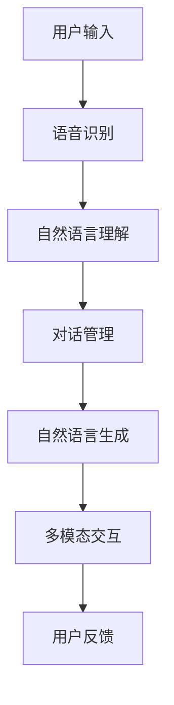

                 

## 文章标题：AI对话系统的提示词设计：增强人机交互体验

### 关键词：AI对话系统、提示词设计、人机交互体验、自然语言处理、多模态交互

### 摘要：

本文旨在探讨AI对话系统中提示词设计的重要性及其对人机交互体验的深远影响。通过对对话系统基本概念、核心技术的深入分析，结合具体的设计方法和实战案例，本文将为读者提供一套完整的提示词设计框架，以帮助提升人机交互的自然性和高效性。文章将从背景介绍、核心概念与联系、基础理论、应用实践、总结与展望五个方面展开，力图全面解析AI对话系统的提示词设计艺术。

## 引言

随着人工智能技术的迅猛发展，AI对话系统逐渐成为人机交互的重要方式，广泛应用于智能客服、智能家居、教育机器人等领域。然而，当前AI对话系统在提升人机交互体验方面仍面临诸多挑战。如何设计有效的提示词，使其不仅能够引导用户正确地表达需求，还能提供自然流畅的交互体验，成为了一个亟待解决的重要问题。

提示词在对话系统中扮演着至关重要的角色。一方面，提示词能够引导用户输入有效信息，帮助对话系统更好地理解用户意图；另一方面，提示词的设计直接影响对话的流畅性和用户满意度。因此，探索有效的提示词设计方法，对提升AI对话系统的人机交互体验具有重要意义。

本文将从以下几个方面展开讨论：

1. **对话系统的基本概念与架构**：介绍对话系统的定义、分类、关键组件及其架构，为人机交互体验提供理论基础。
2. **对话系统的核心技术**：深入解析自然语言处理、对话生成技术、情感计算与多模态交互等核心算法原理，以及对话系统的评估与优化策略。
3. **提示词设计方法**：阐述提示词的设计原则、生成算法以及优化技巧，结合实际案例进行详细讲解。
4. **实战项目展示**：通过具体项目展示提示词设计的实际应用，分析项目的搭建、源代码实现、代码解读以及应用解读与分析。
5. **总结与展望**：对全文内容进行总结，并展望未来对话系统的发展趋势和提示词设计的挑战与机遇。

通过本文的探讨，读者将能够全面了解AI对话系统提示词设计的理论与实践，为实际项目开发提供有力指导。

## 对话系统的基本概念与架构

### 对话系统的定义与分类

对话系统（Dialogue System）是指能够与用户进行自然语言交互的人工智能系统，其核心目标是在合适的时机提供恰当的回答或建议。根据交互形式，对话系统可以分为以下几类：

1. **命令式对话系统**：用户通过输入具体命令来驱动系统的行为，例如智能音箱中的语音助手。
2. **闲聊式对话系统**：系统与用户进行无特定目的的对话，例如聊天机器人。
3. **任务型对话系统**：用户与系统进行特定任务的交互，如在线客服、银行服务机器人等。
4. **混合型对话系统**：结合命令式和任务型对话的特点，能够处理多种类型的交互。

### 对话系统的关键组件

一个完整的对话系统通常包括以下几个关键组件：

1. **语音识别（Speech Recognition）**：将用户的语音输入转换为文本形式，以便进一步处理。
2. **自然语言理解（Natural Language Understanding, NLU）**：分析用户输入的文本，理解其意图和上下文信息。
3. **对话管理（Dialogue Management）**：根据用户意图和系统状态，生成合适的响应，并维护对话状态。
4. **自然语言生成（Natural Language Generation, NLG）**：将系统意图转化为自然语言形式，以回应用户。
5. **多模态交互（Multimodal Interaction）**：结合文本、语音、图像等多种交互方式，提供更加丰富和自然的用户交互体验。

### 对话系统的架构

对话系统的架构通常分为前端和后端两部分：

1. **前端**：包括语音识别、自然语言理解和用户界面等模块，负责接收用户输入并将其转化为系统可理解的格式。
2. **后端**：包括对话管理、自然语言生成和多模态交互等模块，负责处理用户输入、生成响应并进行多模态输出。

图1展示了对话系统的基本架构：



### 对话系统与人机交互体验

人机交互体验（Human-Computer Interaction Experience）是指用户在使用计算机系统时的感受和体验。良好的交互体验能够提升用户的满意度和使用效率。在对话系统中，人机交互体验尤为重要，因为用户与系统的交互主要通过对话实现。

提升人机交互体验的关键在于：

1. **自然性**：对话系统能够理解用户的自然语言，并以自然的方式进行回应。
2. **流畅性**：对话过程顺畅，无明显的延迟和中断。
3. **准确性**：系统能够正确理解用户的意图，并给出准确的响应。
4. **适应性**：系统能够根据用户的行为和偏好进行调整，提供个性化的交互体验。

### 提示词设计基础

提示词（Prompt Word）是对话系统中用于引导用户输入和维持对话的关键要素。有效的提示词设计能够提高用户交互的效率和体验。以下是提示词设计的一些基本原则：

1. **明确性**：提示词应清晰明了，避免使用模糊或抽象的词汇，以便用户能够准确理解。
2. **简洁性**：提示词应尽量简洁，避免冗长复杂的句子，以便用户快速理解并作出回应。
3. **多样性**：提示词应多样化，以适应不同场景和用户需求。
4. **适应性**：提示词应根据对话内容和用户反馈进行实时调整，以维持对话的流畅性和自然性。

### 对话管理

对话管理是对话系统的核心功能之一，负责维护对话状态、处理用户输入、生成响应等任务。以下是对话管理的关键技术：

1. **对话状态跟踪**：系统需要记录对话过程中的关键信息，如用户意图、对话历史等，以便在后续的对话中参考。
2. **对话策略与规划**：系统根据对话状态和用户意图，制定相应的对话策略，如引导用户输入、转移话题等。
3. **对话错误处理**：系统需要能够识别和处理对话中的错误，如用户输入错误、系统理解错误等，以便维持对话的顺利进行。

## 对话系统的核心技术

### 自然语言处理（NLP）

自然语言处理（Natural Language Processing, NLP）是AI对话系统的核心组成部分，负责将用户的自然语言输入转换为系统可理解的形式，并生成自然流畅的响应。以下是NLP的核心技术和应用：

1. **分词（Tokenization）**：将文本分解为单词、短语等基本单元，以便进行进一步处理。
2. **词性标注（Part-of-Speech Tagging）**：识别文本中的单词或短语的词性，如名词、动词、形容词等。
3. **命名实体识别（Named Entity Recognition, NER）**：识别文本中的特定实体，如人名、地名、组织名等。
4. **词向量（Word Embedding）**：将单词映射到高维向量空间，以便进行语义分析和计算。
5. **语言模型（Language Model）**：预测文本的下一个词或序列，用于生成自然语言响应。
6. **句法分析（Syntax Analysis）**：分析文本的句法结构，提取句法树等结构信息。
7. **语义分析（Semantic Analysis）**：理解文本的语义含义，提取实体关系、事件等结构信息。

### 对话生成技术

对话生成技术是对话系统的关键组件，负责根据用户输入和对话状态生成自然流畅的响应。以下是几种常见的对话生成技术：

1. **模板匹配（Template Matching）**：根据预定义的模板，从模板库中选择合适的模板生成响应。
2. **规则推理（Rule-based Reasoning）**：使用预定义的规则，根据用户输入和对话状态进行逻辑推理，生成响应。
3. **基于模型的生成（Model-based Generation）**：使用神经网络模型，如序列到序列（Seq2Seq）模型、生成对抗网络（GAN）等，生成自然语言响应。

以下是一个简单的对话生成算法伪代码：

```python
def generate_response(user_input, state):
    # 预处理输入文本
    processed_input = preprocess(user_input)
    
    # 使用语言模型预测下一个词或序列
    next_sequence = language_model.predict(processed_input)
    
    # 将生成的序列转换为自然语言文本
    response = decode_sequence(next_sequence)
    
    # 更新对话状态
    update_state(state, user_input, response)
    
    return response
```

### 情感计算与多模态交互

情感计算（Affective Computing）是研究如何使计算机具备情感识别、表达和适应能力的领域。在对话系统中，情感计算能够提升人机交互的自然性和情感共鸣。以下是情感计算的关键技术和应用：

1. **情感识别（Affective Recognition）**：使用语音、面部表情、文本等信号，识别用户的情感状态。
2. **情感表达（Affective Expression）**：生成与用户情感状态相符的语音、面部表情、文本等响应。
3. **情感适应（Affective Adaptation）**：根据用户的情感状态，调整对话策略和响应内容，提供个性化的交互体验。

多模态交互（Multimodal Interaction）是将多种交互方式（如文本、语音、图像、手势等）结合起来的交互方式，能够提供更加丰富和自然的用户交互体验。以下是多模态交互的关键技术和应用：

1. **多模态数据融合（Multimodal Data Fusion）**：将来自不同模态的数据进行融合，提高情感识别和语义理解的准确性。
2. **多模态交互界面（Multimodal Interaction Interface）**：设计多模态交互界面，支持用户使用多种方式与系统进行交互。
3. **多模态情感反馈（Multimodal Affective Feedback）**：根据用户的情感反馈，调整系统的交互方式和响应内容。

### 对话系统评估与优化

对话系统的评估与优化是确保其性能和用户体验的重要环节。以下是常见的评估指标和优化策略：

1. **评估指标**：
   - **准确性（Accuracy）**：系统正确理解用户意图的比例。
   - **响应时间（Response Time）**：系统生成响应所需的时间。
   - **用户满意度（User Satisfaction）**：用户对系统交互体验的满意度。

2. **优化策略**：
   - **数据增强（Data Augmentation）**：增加训练数据量，提高模型的泛化能力。
   - **模型融合（Model Fusion）**：结合多种模型，提高预测的准确性。
   - **在线学习（Online Learning）**：根据用户反馈，实时调整模型参数，提高系统性能。
   - **用户行为分析（User Behavior Analysis）**：分析用户行为，优化对话策略和交互界面。

## 提示词设计方法

### 提示词的定义与作用

提示词（Prompt Word）是对话系统中用于引导用户输入和维持对话的关键要素。其定义如下：

提示词是指系统向用户展示的简短文字或语音提示，用于引导用户输入有效信息或执行特定操作，以促进对话的顺利进行。

提示词在对话系统中具有以下作用：

1. **引导用户输入**：提示词能够引导用户按照系统期望的方式输入信息，提高用户交互的效率。
2. **维持对话**：通过合适的提示词，系统能够有效地维持对话，避免用户流失或对话中断。
3. **优化用户体验**：提示词设计直接影响用户体验，良好的提示词能够提升用户满意度。

### 提示词的类型与特点

根据用途和形式，提示词可以分为以下几类：

1. **信息收集型提示词**：用于引导用户输入个人信息、需求等具体信息。例如，“请您输入您的姓名？”。
2. **决策引导型提示词**：用于引导用户在多个选项中进行选择。例如，“您是想购买水果还是蔬菜？”。
3. **情感共鸣型提示词**：用于表达情感，增强用户与系统的情感联系。例如，“听起来您今天心情不错，有什么我可以帮您的吗？”。
4. **任务提醒型提示词**：用于提醒用户完成任务或执行操作。例如，“请您完成以下步骤：1. 输入您的姓名，2. 选择您的服务类型”。

不同类型的提示词具有不同的特点和适用场景。信息收集型提示词主要应用于任务型对话系统，决策引导型提示词适用于选项较多的场景，情感共鸣型提示词适用于需要建立用户情感联系的场景，任务提醒型提示词适用于任务型对话中的步骤引导。

### 提示词设计原则

为了设计出有效的提示词，需要遵循以下原则：

1. **明确性**：提示词应清晰明了，避免使用模糊或抽象的词汇，确保用户能够准确理解。
2. **简洁性**：提示词应尽量简洁，避免冗长复杂的句子，提高用户理解效率。
3. **多样性**：提示词应多样化，以满足不同场景和用户需求，增强对话的自然性和丰富性。
4. **适应性**：提示词应根据对话内容和用户反馈进行实时调整，以维持对话的流畅性和自然性。
5. **个性化**：根据用户的偏好和行为，设计个性化的提示词，提高用户满意度。

### 提示词生成算法

提示词生成算法是对话系统中实现提示词自动生成的重要技术。以下介绍几种常见的提示词生成算法：

1. **模板匹配算法**：根据预定义的模板，从模板库中选择合适的模板生成提示词。适用于结构化数据较多的场景。

   ```python
   def generate_prompt(template, user_input):
       # 根据用户输入选择合适的模板
       template = select_template(user_input)
       
       # 替换模板中的占位符，生成提示词
       prompt = template.format(user_input)
       
       return prompt
   ```

2. **基于规则的生成算法**：使用预定义的规则，根据用户输入和对话状态生成提示词。适用于规则明确的场景。

   ```python
   def generate_prompt(rule, state):
       # 根据对话状态选择合适的规则
       rule = select_rule(state)
       
       # 根据规则生成提示词
       prompt = rule.apply(state)
       
       return prompt
   ```

3. **基于模型的生成算法**：使用神经网络模型，如循环神经网络（RNN）、长短期记忆网络（LSTM）等，根据用户输入和对话状态生成提示词。适用于复杂场景。

   ```python
   def generate_prompt(model, user_input, state):
       # 预处理输入文本
       processed_input = preprocess(user_input)
       
       # 使用模型生成提示词
       prompt = model.predict(processed_input, state)
       
       # 将生成的提示词转换为自然语言文本
       prompt = decode_prompt(prompt)
       
       return prompt
   ```

### 提示词优化技巧

为了进一步提升提示词的有效性和用户体验，可以采用以下优化技巧：

1. **上下文感知**：根据对话的上下文信息，动态调整提示词，使其更符合当前对话场景。
2. **情感匹配**：根据用户的情感状态，选择合适的情感共鸣型提示词，增强用户情感体验。
3. **用户行为分析**：根据用户的历史行为和偏好，设计个性化的提示词，提高用户满意度。
4. **多模态融合**：结合文本、语音、图像等多模态信息，生成更加丰富和自然的提示词。

### 提示词设计案例

下面通过一个简单的案例，展示如何设计有效的提示词。

**案例背景**：一个任务型对话系统，用于帮助用户预订餐厅。

**用户场景**：用户希望预订餐厅，但不确定具体的餐厅名称。

**设计思路**：

1. **明确性**：设计清晰明确的提示词，引导用户输入餐厅名称。
2. **简洁性**：避免使用复杂的句子，确保用户快速理解。
3. **适应性**：根据用户的输入，动态调整提示词，以维持对话的流畅性。

**设计步骤**：

1. **初始提示词**：“您好，您想预订哪个餐厅？”

2. **用户未输入餐厅名称**：“很抱歉，我没有理解您的需求。请告诉我您想预订的餐厅名称。”

3. **用户输入餐厅名称**：“感谢您的告知，现在我们将为您预订[餐厅名称]。请问您需要几点就餐？”

通过这个案例，可以看出，提示词的设计需要充分考虑用户的实际需求和对话的上下文，以确保用户能够顺利完成任务。

## 实战项目展示

### 项目一：智能客服系统的提示词设计

**项目背景**：某企业开发了一款智能客服系统，用于为客户提供在线咨询服务。

**用户需求**：用户需要通过简单、自然的对话方式获取解决问题的方法。

**项目目标**：设计一套有效的提示词，提升用户交互体验和客服效率。

**设计思路**：

1. **明确性**：确保提示词清晰明了，引导用户输入关键信息。
2. **简洁性**：避免冗长复杂的句子，提高用户理解效率。
3. **多样性**：根据不同场景和用户需求，设计多样化的提示词。
4. **适应性**：根据用户反馈和对话进展，实时调整提示词。

**实现步骤**：

1. **需求分析**：收集用户反馈和常见问题，明确用户需求。
2. **场景划分**：将用户交互场景划分为咨询问题、投诉反馈、常见问题等。
3. **提示词设计**：为每个场景设计合适的提示词，确保清晰、简洁、多样化。
4. **测试与优化**：通过用户测试和数据分析，不断优化提示词，提升用户体验。

**效果评估**：

- **用户满意度**：通过用户调查，了解用户对提示词的满意度。
- **客服效率**：统计客服系统的响应时间、处理时长等指标，评估客服效率。

### 项目二：教育机器人的提示词设计

**项目背景**：某学校引进了一款教育机器人，用于辅助课堂教学。

**用户需求**：教师和学生需要通过自然、流畅的对话方式与机器人互动。

**项目目标**：设计一套符合教育场景的提示词，提升教学效果和学生学习体验。

**设计思路**：

1. **引导性**：设计引导性强的提示词，帮助教师和学生快速进入教学状态。
2. **互动性**：设计互动性强的提示词，激发学生的学习兴趣和参与度。
3. **适应性**：根据教学进度和学生学习情况，动态调整提示词。

**实现步骤**：

1. **需求分析**：了解教师和学生的教学和学习需求。
2. **场景划分**：将教学场景划分为新课导入、课堂互动、作业辅导等。
3. **提示词设计**：为每个场景设计合适的提示词，确保引导性强、互动性好。
4. **测试与优化**：通过课堂实践和用户反馈，不断优化提示词。

**效果评估**：

- **教学效果**：通过教学评估，了解提示词对教学效果的提升。
- **学生满意度**：通过学生调查，了解学生对提示词的满意度。

### 项目三：智能家居系统的提示词设计

**项目背景**：某科技公司推出了一款智能家居系统，用户可以通过语音控制智能家居设备。

**用户需求**：用户需要通过简单、自然的语音交互方式控制家居设备。

**项目目标**：设计一套易于理解、使用便捷的提示词，提升用户对智能家居系统的操作体验。

**设计思路**：

1. **简洁性**：设计简洁明了的提示词，确保用户快速理解。
2. **一致性**：确保提示词在系统中保持一致，避免用户混淆。
3. **个性化**：根据用户习惯和偏好，设计个性化的提示词。

**实现步骤**：

1. **需求分析**：了解用户对智能家居系统的使用习惯和偏好。
2. **场景划分**：将智能家居系统划分为设备控制、场景设置、故障诊断等。
3. **提示词设计**：为每个场景设计合适的提示词，确保简洁性、一致性和个性化。
4. **测试与优化**：通过用户测试和数据分析，不断优化提示词。

**效果评估**：

- **用户满意度**：通过用户调查，了解用户对提示词的满意度。
- **系统易用性**：通过用户操作记录，评估系统易用性。

## 未来的发展趋势与展望

### 对话系统的发展趋势

随着人工智能技术的不断进步，对话系统将呈现以下发展趋势：

1. **智能化**：对话系统将更加智能化，能够理解复杂的用户意图和情感。
2. **个性化**：对话系统将根据用户的偏好和行为，提供个性化的交互体验。
3. **多模态**：对话系统将结合多种交互方式（文本、语音、图像、手势等），提供更加丰富和自然的用户交互体验。
4. **实时性**：对话系统将实现实时交互，减少用户等待时间，提升用户体验。
5. **应用广泛性**：对话系统将应用于更多领域，如医疗、金融、教育等，为用户提供更多服务。

### 提示词设计的挑战与机遇

在未来的发展过程中，提示词设计将面临以下挑战和机遇：

1. **挑战**：
   - **复杂性**：用户需求更加多样化，提示词设计需要更加复杂和灵活。
   - **情感识别**：准确识别用户情感，设计情感共鸣型提示词。
   - **个性化**：实现个性化提示词设计，满足不同用户的需求。
   - **实时性**：确保提示词设计的实时性和高效性。

2. **机遇**：
   - **多模态融合**：结合多种模态信息，设计更加丰富和自然的提示词。
   - **大数据与AI**：利用大数据和人工智能技术，优化提示词生成和调整策略。
   - **创新应用**：探索新的应用场景，提升提示词设计的实用性和价值。

### 创新方向

为了应对挑战和抓住机遇，以下是一些创新方向：

1. **多模态融合**：结合文本、语音、图像等多模态信息，设计更加丰富和自然的提示词。
2. **情感计算**：利用情感计算技术，准确识别用户情感，设计情感共鸣型提示词。
3. **个性化推荐**：结合用户行为和偏好，设计个性化推荐型提示词。
4. **自然语言生成**：优化自然语言生成算法，提高提示词的自然性和流畅性。
5. **实时反馈与调整**：实现实时反馈和调整机制，确保提示词设计的实时性和高效性。

## 总结

本文系统地介绍了AI对话系统的提示词设计，从背景介绍、核心概念与联系、基础理论、应用实践到未来的发展趋势与展望，为读者提供了一套完整的提示词设计框架。通过本文的探讨，读者可以深入了解提示词设计的重要性及其对人机交互体验的深远影响。未来，随着人工智能技术的不断进步，提示词设计将面临更多挑战和机遇，期待更多的研究者和技术人员投入到这一领域，共同推动人机交互体验的不断提升。

### 作者信息

作者：AI天才研究院/AI Genius Institute & 禅与计算机程序设计艺术/Zen And The Art of Computer Programming

AI天才研究院（AI Genius Institute）专注于人工智能领域的研究与开发，致力于推动人工智能技术的创新和应用。禅与计算机程序设计艺术（Zen And The Art of Computer Programming）则是一本经典的计算机科学著作，深入探讨了计算机程序的复杂性和美学的结合，为人工智能的研究提供了重要的理论基础。作者通过这两者的结合，为读者呈现了一部关于AI对话系统提示词设计的权威之作。

