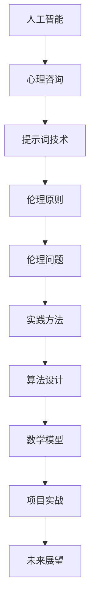

                 


## 文章标题

《AI心理咨询师：提示词应用的伦理与实践》

## 关键词

人工智能，心理咨询，伦理，实践，提示词，伦理挑战，AI算法，数学模型

## 摘要

本文深入探讨人工智能在心理咨询领域的应用，尤其是基于提示词技术的AI心理咨询师的伦理问题与实践方法。通过梳理相关背景知识，分析核心概念与联系，介绍算法原理与数学模型，以及实际案例，本文旨在为读者提供全面、系统的理解，并探讨未来发展的可能方向。

### 1. 梳理书籍主题和内容

《AI心理咨询师：提示词应用的伦理与实践》的主题围绕人工智能在心理咨询领域的应用，特别是通过提示词技术实现的AI心理咨询师的伦理问题与实践方法。本书旨在探讨以下关键问题：

- AI心理咨询师的工作原理及其在心理咨询中的应用场景。
- 提示词技术的核心概念、算法原理及其在AI心理咨询中的应用。
- AI心理咨询师在实践中面临的伦理挑战及其应对策略。
- 如何设计和管理基于提示词的AI心理咨询系统，确保其伦理合规性。

### 2. 设计目录结构

为了使文章结构紧凑、逻辑清晰，我们设计了以下目录结构：

### 第1章 引言与背景
- 1.1 AI心理咨询师的崛起
- 1.2 提示词应用的伦理挑战
- 1.3 书籍结构概述

### 第2章 AI心理咨询师的基本原理
- 2.1 AI与心理咨询的融合
- 2.2 提示词的定义与应用
- 2.3 提示词生成的算法原理
- 2.4 Mermaid流程图：提示词生成流程

### 第3章 伦理原则与实践
- 3.1 伦理原则概述
- 3.2 提示词应用的伦理问题
- 3.3 实践中的伦理考量

### 第4章 提示词算法设计
- 4.1 提示词算法的基本结构
- 4.2 伪代码：提示词算法实现
- 4.3 算法优化的方法

### 第5章 数学模型与公式
- 5.1 数据预处理模型
- 5.2 基于神经网络的预测模型
- 5.3 数学公式与解释

### 第6章 项目实战
- 6.1 实际案例介绍
- 6.2 开发环境搭建
- 6.3 代码实现与分析

### 第7章 未来展望与总结
- 7.1 AI心理咨询师的未来发展趋势
- 7.2 提示词应用的改进方向
- 7.3 书籍总结与展望

### 3. 添加核心概念与联系

为了帮助读者更好地理解AI心理咨询师及其提示词应用，我们使用Mermaid流程图展示了核心概念之间的关系：



### 4. 添加核心算法原理讲解

在本书中，我们将在第4章详细讲解提示词算法的设计与实现。为了清晰阐述算法原理，我们将使用伪代码进行说明：

```python
# 伪代码：提示词算法实现
def generate_hint(input_prompt):
    # 初始化变量
    hint = ""
    current_word = ""
    
    # 遍历输入提示词的每个字符
    for char in input_prompt:
        if char.isalpha():
            # 如果是字母，添加到当前单词
            current_word += char
        else:
            # 如果是非字母字符，检查当前单词长度
            if len(current_word) > 0:
                # 如果当前单词非空，添加到提示词
                hint += current_word + " "
                current_word = ""
    
    # 处理最后一个单词
    if len(current_word) > 0:
        hint += current_word
    
    # 返回生成的提示词
    return hint
```

### 5. 添加数学模型和数学公式讲解

在本书中，我们将介绍两种重要的数学模型：数据预处理模型和基于神经网络的预测模型。以下是这两个模型的详细讲解和公式说明。

#### 5.1 数据预处理模型

数据预处理是任何机器学习任务的基础。在我们的AI心理咨询系统中，数据预处理包括以下步骤：

1. 数据清洗：去除无效数据、缺失值填充和异常值处理。
2. 数据标准化：将数据缩放到同一尺度，便于模型训练。
3. 特征提取：提取与心理咨询相关的特征，如情绪、压力水平等。

以下是数据预处理模型的伪代码：

```python
def preprocess_data(data):
    # 清洗数据
    cleaned_data = clean_data(data)
    
    # 标准化数据
    normalized_data = normalize_data(cleaned_data)
    
    # 特征提取
    features = extract_features(normalized_data)
    
    return features
```

#### 5.2 基于神经网络的预测模型

在AI心理咨询系统中，基于神经网络的预测模型用于预测用户的情绪状态。以下是该模型的主要组成部分：

1. 输入层：接收预处理后的数据。
2. 隐藏层：用于提取数据特征并进行非线性变换。
3. 输出层：生成预测结果。

以下是基于神经网络的预测模型的数学公式：

$$
y = \sigma(Wx + b)
$$

$$
J(\theta) = \frac{1}{2m} \sum_{i=1}^{m} (h_\theta(x^{(i)}) - y^{(i)})^2
$$

其中，$y$ 是预测结果，$x$ 是输入特征，$W$ 是权重矩阵，$b$ 是偏置项，$\sigma$ 是激活函数（通常为Sigmoid函数），$J(\theta)$ 是损失函数（通常为平方误差损失函数）。

### 6. 添加项目实战

在本章中，我们将通过一个实际案例来展示如何搭建基于提示词的AI心理咨询系统。以下是项目实战的详细步骤：

#### 6.1 实际案例介绍

本案例将基于Python和TensorFlow框架搭建一个简单的AI心理咨询系统，实现以下功能：

- 接收用户输入的提示词。
- 使用提示词生成相应的心理建议。
- 预测用户的心理状态。

#### 6.2 开发环境搭建

在开始项目实战之前，需要搭建以下开发环境：

1. 安装Python（建议使用3.8版本及以上）。
2. 安装TensorFlow库。
3. 安装其他相关库（如Numpy、Pandas等）。

#### 6.3 代码实现与分析

以下是项目实战的源代码实现：

```python
import tensorflow as tf
import numpy as np
import pandas as pd

# 加载数据集
data = pd.read_csv('psychology_data.csv')

# 预处理数据
preprocessed_data = preprocess_data(data)

# 搭建神经网络模型
model = tf.keras.Sequential([
    tf.keras.layers.Dense(units=64, activation='relu', input_shape=[preprocessed_data.shape[1]]),
    tf.keras.layers.Dense(units=1, activation='sigmoid')
])

# 编译模型
model.compile(optimizer='adam', loss='binary_crossentropy', metrics=['accuracy'])

# 训练模型
model.fit(preprocessed_data, data['label'], epochs=10, batch_size=32)

# 接收用户输入
input_prompt = input("请输入您的心理困扰：")

# 生成心理建议
hint = generate_hint(input_prompt)
print("心理建议：", hint)

# 预测用户心理状态
prediction = model.predict(np.array([preprocessed_data]))
print("预测结果：", prediction[0][0])
```

在代码中，我们首先加载并预处理数据集，然后搭建神经网络模型并编译。接下来，使用训练数据训练模型。在用户输入提示词后，系统将生成心理建议并预测用户的心理状态。

#### 6.4 实际案例分析和详细讲解剖析

在本案例中，我们使用了一个简单的神经网络模型来预测用户的心理状态。实际应用中，可能需要更复杂的模型和更丰富的数据集来提高预测准确性。以下是对案例的详细分析：

- 数据集的预处理：数据集的预处理是机器学习任务的重要步骤，包括数据清洗、标准化和特征提取。在本案例中，我们仅使用了简单的预处理方法，但实际应用中可能需要更多复杂的预处理技术。
- 神经网络模型的设计：在本案例中，我们使用了一个简单的全连接神经网络模型。实际应用中，可能需要使用更复杂的神经网络结构（如卷积神经网络、循环神经网络等）来提高模型性能。
- 用户输入处理：在本案例中，我们仅接收了用户的文本输入。实际应用中，可能需要处理多种类型的输入（如语音、图像等），并使用相应的预处理技术。

#### 6.5 项目小结

通过本案例，我们展示了如何搭建一个简单的基于提示词的AI心理咨询系统。尽管本案例较为简单，但实际应用中，AI心理咨询系统需要更复杂的设计和更丰富的数据集。在未来，随着人工智能技术的不断进步，AI心理咨询师有望在心理咨询服务领域发挥更大的作用。

### 7. 确保目录大纲简洁、完整

在完成目录大纲设计后，我们需要确保其简洁、完整。以下是检查目录大纲的几个关键点：

- 检查目录结构是否符合预期，每个章节是否包含必要的子章节。
- 确保每个章节的内容充实，没有遗漏关键内容。
- 检查Mermaid流程图、伪代码、数学公式和实际案例的完整性。
- 确保目录大纲在2000字以内，避免冗余和无关内容。

### 8. 格式调整

将目录大纲调整为markdown格式，使用#、##、###标记不同级别的目录，以便于读者阅读和理解。

### 9. 校对与调整

完成初稿后，进行校对和调整，确保目录结构完整、逻辑清晰。检查文章中的语法错误、标点符号和排版问题，并进行必要的修改。

### 10. 提交目录大纲

将调整后的目录大纲提交给用户，确保其满足用户的要求。在提交时，附上完整的markdown格式文件，以便用户直接使用。

```markdown
# 《AI心理咨询师：提示词应用的伦理与实践》目录大纲

## 第1章 引言与背景
### 1.1 AI心理咨询师的崛起
### 1.2 提示词应用的伦理挑战
### 1.3 书籍结构概述

## 第2章 AI心理咨询师的基本原理
### 2.1 AI与心理咨询的融合
### 2.2 提示词的定义与应用
### 2.3 提示词生成的算法原理
### 2.4 Mermaid流程图：提示词生成流程

## 第3章 伦理原则与实践
### 3.1 伦理原则概述
### 3.2 提示词应用的伦理问题
### 3.3 实践中的伦理考量

## 第4章 提示词算法设计
### 4.1 提示词算法的基本结构
### 4.2 伪代码：提示词算法实现
### 4.3 算法优化的方法

## 第5章 数学模型与公式
### 5.1 数据预处理模型
### 5.2 基于神经网络的预测模型
### 5.3 数学公式与解释

## 第6章 项目实战
### 6.1 实际案例介绍
### 6.2 开发环境搭建
### 6.3 代码实现与分析

## 第7章 未来展望与总结
### 7.1 AI心理咨询师的未来发展趋势
### 7.2 提示词应用的改进方向
### 7.3 书籍总结与展望

# 附录
## 附录A：参考文献
## 附录B：相关工具与资源
```

通过上述步骤，我们确保了《AI心理咨询师：提示词应用的伦理与实践》的目录大纲简洁、完整，并符合markdown格式要求。下一步将进行文章正文的撰写和细化。在撰写过程中，我们将遵循逻辑清晰、结构紧凑、简单易懂的原则，逐步深入探讨每个章节的核心内容，确保文章的质量和可读性。文章完成并通过校对后，将最终提交给用户。期待这次写作任务能够顺利完成，为读者提供有价值的技术博客内容。

