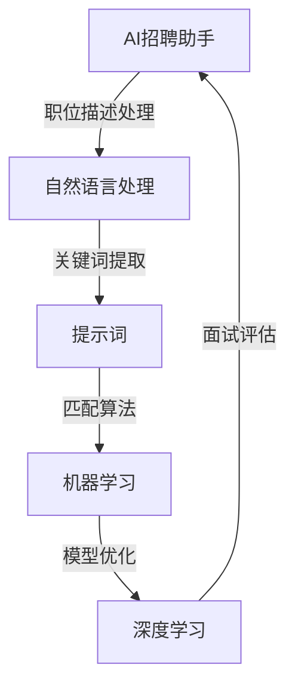

                 

### 引言

在当今快速发展的数字化时代，招聘流程正面临着前所未有的挑战。传统的招聘方式往往依赖人工筛选简历、面试评估等流程，这不仅耗时耗力，还容易受到主观因素的影响，导致招聘效果不尽如人意。随着人工智能（AI）技术的不断进步，越来越多的企业开始探索利用AI技术来优化招聘流程。AI招聘助手作为AI技术在招聘领域的一个重要应用，逐渐成为各大企业提高招聘效率和匹配度的首选工具。

AI招聘助手主要通过自然语言处理（NLP）、机器学习（ML）和深度学习（DL）等技术手段，对招聘信息、求职者简历进行自动处理和分析，从而实现高效的职位匹配。其中，提示词（Keywords）的优化是提高AI招聘助手匹配度的关键因素。本文将围绕“AI招聘助手：提示词优化求职匹配度”这一主题，深入探讨AI招聘助手的工作原理、提示词优化的核心概念、相关算法原理以及实际应用案例，为读者提供一份全面的技术指南。

本文的结构如下：

1. **背景介绍**：我们将首先介绍AI招聘助手的背景和重要性，分析传统招聘流程的弊端和AI招聘助手带来的变革。
2. **核心概念与联系**：本文将定义AI招聘助手中的核心概念，并绘制流程图展示它们之间的关系。
3. **核心算法原理讲解**：我们将详细讲解与提示词优化相关的人工智能算法原理，包括自然语言处理、机器学习和深度学习等内容。
4. **数学模型和公式**：我们将介绍提示词优化的数学模型，并使用LaTeX格式展示相关公式，并进行详细讲解和举例说明。
5. **项目实战**：我们将通过一个实际项目，展示AI招聘助手的开发环境搭建、源代码实现和代码解读，并结合实际案例进行分析和讲解。
6. **最佳实践**：我们将总结一些AI招聘助手的最佳实践，并提供注意事项和拓展阅读建议。

通过本文的阅读，读者将能够全面了解AI招聘助手的运作机制，掌握提示词优化的关键技巧，并为实际项目提供实用的指导。

### 背景介绍

传统招聘流程的弊端在于其低效和主观性。传统的招聘过程通常包括职位发布、简历筛选、面试安排、候选人评估等多个环节，每个环节都依赖人力完成。首先，职位发布需要手动撰写详细的招聘广告，并且发布到多个招聘平台。接着，招聘人员需要从海量的简历中筛选出符合条件的候选人，这个过程往往耗时且容易受到个人偏好和主观判断的影响。例如，一个招聘人员可能会偏好具有某些特定学校背景或工作经验的候选人，从而忽略其他可能更加适合职位的候选人。

此外，面试安排和候选人评估也是一个复杂且耗费时间的过程。招聘人员需要与候选人进行电话或面对面面试，评估其技能、经验和性格是否符合职位要求。这个过程不仅需要大量的人力和时间，还容易受到面试官的主观影响，导致评估结果不够客观和公正。

与此同时，随着互联网和大数据技术的发展，招聘市场变得更加竞争激烈。企业需要快速找到符合职位要求的优秀人才，而候选人也在寻找能够提供更好发展机会的企业。这种竞争环境迫使企业不得不寻找更加高效和精准的招聘方式，以在短时间内找到最适合的候选人。

在这个背景下，AI招聘助手应运而生。AI招聘助手通过整合自然语言处理（NLP）、机器学习（ML）和深度学习（DL）等技术，实现了招聘流程的自动化和智能化。首先，AI招聘助手可以自动处理和解析招聘广告，提取关键职位需求信息。其次，它能够对海量简历进行自动筛选和分类，根据职位需求匹配最合适的候选人。最后，AI招聘助手还可以通过面试评估算法，对候选人进行智能评估，提供更客观和公正的评估结果。

与传统招聘方式相比，AI招聘助手具有以下优势：

1. **高效性**：AI招聘助手可以自动化处理招聘流程中的各个环节，大幅减少人工操作的时间和成本。例如，简历筛选过程可以由系统自动完成，大大缩短招聘周期。
2. **精准性**：通过自然语言处理和机器学习技术，AI招聘助手能够更准确地理解职位需求，并筛选出最符合要求的候选人。它可以识别出简历中的隐含信息，避免主观判断带来的偏差。
3. **客观性**：AI招聘助手可以提供更客观和公正的评估结果，减少面试官个人偏好和主观影响。它可以通过算法对候选人的技能、经验和性格进行综合评估，提供更全面和准确的评价。
4. **扩展性**：AI招聘助手可以不断学习和优化，随着数据积累和算法改进，其匹配效率和准确性会不断提高。

总之，AI招聘助手的出现为传统招聘流程带来了深刻的变革。它不仅提高了招聘效率和匹配度，还为企业提供了更科学和公正的招聘方式，从而在激烈的市场竞争中占据优势。通过本文的后续内容，我们将深入探讨AI招聘助手的工作原理和提示词优化的技术细节，帮助读者更好地理解和应用这一创新技术。

### 核心概念与联系

在探讨AI招聘助手及其提示词优化之前，我们需要明确几个核心概念，并理解它们之间的相互关系。以下是本文将涉及的主要核心概念：

1. **AI招聘助手**：指的是利用人工智能技术（如自然语言处理、机器学习和深度学习等）优化招聘流程的工具。它能够自动处理招聘广告、筛选简历、匹配候选人，从而提高招聘效率和精准度。
2. **自然语言处理（NLP）**：NLP是人工智能的一个子领域，旨在让计算机理解和处理人类语言。在招聘场景中，NLP技术用于解析职位描述、提取关键信息、理解求职者简历等。
3. **机器学习（ML）**：ML是使计算机通过数据学习模式，并自动做出预测或决策的技术。在招聘过程中，ML算法用于简历筛选、职位匹配等任务，通过分析历史数据来优化招聘流程。
4. **深度学习（DL）**：DL是机器学习的一个子领域，通过神经网络模拟人脑的决策过程。深度学习在招聘场景中用于构建复杂模型，如自动面试系统、候选人事迹预测等。
5. **提示词（Keywords）**：提示词是在职位描述和简历中频繁出现的关键词，它们用于描述职位要求和候选人的技能。优化提示词有助于提高AI招聘助手的匹配度。

下面，我们将通过一个Mermaid流程图来展示这些核心概念之间的相互关系：



**流程解释**：

1. **职位描述处理**：AI招聘助手首先通过NLP技术处理职位描述，提取出关键信息，形成职位需求模型。这一步确保了招聘助手能够准确理解职位的要求。
2. **关键词提取**：提取职位描述中的提示词，这些提示词将成为后续匹配过程的关键依据。NLP技术在这一步中起到了至关重要的作用，它能够识别并提取出具有语义意义的词汇。
3. **匹配算法**：使用机器学习算法，特别是基于提示词的匹配算法，AI招聘助手将求职者的简历与职位需求模型进行对比和匹配。这一步的关键在于如何高效、准确地筛选出最符合职位要求的候选人。
4. **模型优化**：通过不断优化机器学习模型，尤其是利用深度学习技术，AI招聘助手能够逐步提高匹配的准确性和效率。模型优化是一个持续迭代的过程，依赖于大量历史数据和反馈。
5. **面试评估**：匹配后的候选人将进入面试评估阶段，深度学习模型可以帮助面试官更好地理解候选人的综合素质和潜力，从而做出更科学的评估。

通过以上流程，我们可以看到，AI招聘助手的核心概念之间存在着紧密的相互作用和反馈关系。每个环节的优化都将直接影响整个招聘流程的效率和匹配度。在本文的后续部分，我们将详细探讨这些概念的具体实现和应用。

### 核心算法原理讲解

为了深入理解AI招聘助手的工作原理，我们需要详细讲解几个核心算法原理，特别是自然语言处理（NLP）、机器学习（ML）和深度学习（DL）等相关技术。这些算法在招聘流程中发挥着至关重要的作用，帮助AI招聘助手实现高效、精准的职位匹配。

#### 自然语言处理（NLP）

自然语言处理是AI招聘助手的基础，它涉及使计算机能够理解、解析和处理人类语言的技术。在招聘场景中，NLP主要应用于职位描述和简历的解析与理解。以下是一些关键的NLP算法和技术：

1. **文本预处理**：文本预处理是NLP的第一步，包括去除停用词、标点符号和进行词形还原等。这一步的目的是简化文本，使其更适合后续的分析。

   ```python
   import nltk
   from nltk.corpus import stopwords
   from nltk.tokenize import word_tokenize
   
   # 加载英语停用词
   stop_words = set(stopwords.words('english'))
   
   # 对文本进行预处理
   def preprocess_text(text):
       tokens = word_tokenize(text)
       filtered_tokens = [word for word in tokens if word not in stop_words]
       return filtered_tokens
   ```

2. **词向量表示**：词向量是将文本中的单词映射到高维空间中的向量表示。常见的词向量模型包括Word2Vec、GloVe等。这些模型可以将语义相近的单词映射到相近的向量空间中。

   ```python
   from gensim.models import Word2Vec
   
   # 训练Word2Vec模型
   sentences = nltk.corpus.gutenberg.sents('shakespeare.txt')
   model = Word2Vec(sentences, size=100, window=5, min_count=1, workers=4)
   
   # 获取词向量
   word_vector = model.wv['招聘']
   ```

3. **文本分类与聚类**：文本分类是将文本分配到预定义的类别中，如职位类型、技能标签等。文本聚类则是将相似的文本聚到一起，用于发现新的职位需求或候选人群体。

   ```python
   from sklearn.feature_extraction.text import TfidfVectorizer
   from sklearn.naive_bayes import MultinomialNB
   
   # 创建TF-IDF向量器
   vectorizer = TfidfVectorizer()
   
   # 创建分类器
   classifier = MultinomialNB()
   
   # 训练分类器
   X = vectorizer.fit_transform(job_descriptions)
   y = labels
   classifier.fit(X, y)
   
   # 分类预测
   predicted_categories = classifier.predict(vectorizer.transform(new_job_descriptions))
   ```

#### 机器学习（ML）

机器学习是AI招聘助手的“大脑”，它通过历史数据学习模式和规律，从而实现自动化的招聘流程。以下是一些关键的ML算法和应用：

1. **监督学习**：监督学习是一种常见的机器学习方法，通过已标记的数据集训练模型，并在新的数据上进行预测。在招聘场景中，监督学习用于简历筛选、职位匹配等任务。

   ```python
   from sklearn.linear_model import LogisticRegression
   
   # 创建逻辑回归模型
   model = LogisticRegression()
   
   # 训练模型
   model.fit(X_train, y_train)
   
   # 预测
   predictions = model.predict(X_test)
   ```

2. **无监督学习**：无监督学习在没有标签数据的情况下，通过挖掘数据中的隐藏结构和模式。在招聘场景中，无监督学习可用于发现新的职位需求、挖掘候选人的潜在技能等。

   ```python
   from sklearn.cluster import KMeans
   
   # 创建K均值聚类模型
   model = KMeans(n_clusters=5)
   
   # 聚类
   model.fit(X)
   
   # 获取聚类结果
   labels = model.predict(X)
   ```

3. **强化学习**：强化学习是一种通过试错和反馈不断优化策略的机器学习方法。在招聘场景中，强化学习可用于优化面试流程，提高候选人的面试体验和招聘效果。

   ```python
   from rlcode.environments import GridWorld
   from rlcode.agents import QLearning
   
   # 创建环境
   env = GridWorld()
   
   # 创建强化学习代理
   agent = QLearning(env)
   
   # 训练代理
   agent.train(n_episodes=1000)
   
   # 预测
   action = agent.predict()
   ```

#### 深度学习（DL）

深度学习是近年来发展迅速的机器学习分支，通过多层神经网络模拟人脑的决策过程。以下是一些关键的深度学习算法和应用：

1. **卷积神经网络（CNN）**：CNN是一种用于处理图像和文本数据的深度学习模型，通过卷积层提取特征，并实现高效的特征提取。

   ```python
   from tensorflow.keras.models import Sequential
   from tensorflow.keras.layers import Conv2D, MaxPooling2D
   
   # 创建CNN模型
   model = Sequential()
   model.add(Conv2D(32, (3, 3), activation='relu', input_shape=(64, 64, 3)))
   model.add(MaxPooling2D(pool_size=(2, 2)))
   # ... 添加更多层 ...
   model.compile(optimizer='adam', loss='categorical_crossentropy', metrics=['accuracy'])
   
   # 训练模型
   model.fit(X_train, y_train, epochs=10, batch_size=32)
   ```

2. **循环神经网络（RNN）**：RNN是一种能够处理序列数据的神经网络，特别适合于处理文本和语音数据。在招聘场景中，RNN可用于理解职位描述和简历的上下文关系。

   ```python
   from tensorflow.keras.models import Sequential
   from tensorflow.keras.layers import Embedding, LSTM
   
   # 创建RNN模型
   model = Sequential()
   model.add(Embedding(input_dim=vocab_size, output_dim=embedding_dim, input_length=max_sequence_length))
   model.add(LSTM(units=128, dropout=0.2, recurrent_dropout=0.2))
   model.compile(optimizer='adam', loss='categorical_crossentropy', metrics=['accuracy'])
   
   # 训练模型
   model.fit(X_train, y_train, epochs=10, batch_size=64)
   ```

3. **生成对抗网络（GAN）**：GAN是一种通过生成器和判别器相互博弈的训练模型，常用于生成高质量的文本数据。在招聘场景中，GAN可用于生成职位描述和简历，以丰富训练数据。

   ```python
   from tensorflow.keras.models import Sequential
   from tensorflow.keras.layers import Dense, Dropout
   
   # 创建GAN模型
   generator = Sequential()
   generator.add(Dense(units=256, activation='relu', input_shape=(latent_dim,)))
   generator.add(Dropout(0.3))
   generator.add(Dense(units=512, activation='relu'))
   generator.add(Dropout(0.3))
   generator.add(Dense(units=int(text_sequence_length), activation='softmax'))
   
   # ... 定义判别器模型 ...
   
   # 训练GAN模型
   combined = Sequential()
   combined.add(generator)
   combined.add(discriminator)
   combined.compile(loss='binary_crossentropy', optimizer=optimizers.Adam(0.0002), metrics=['accuracy'])
   
   # 训练GAN
   combined.fit(x, y, epochs=10000, batch_size=64)
   ```

通过以上算法的讲解，我们可以看到AI招聘助手如何通过NLP、ML和DL技术实现高效的职位匹配和候选人筛选。在本文的后续部分，我们将进一步介绍这些算法的具体应用和实践案例。

### 数学模型和公式

在AI招聘助手的构建过程中，数学模型和公式扮演着关键的角色，特别是在提示词优化方面。以下我们将详细解释提示词优化中的核心数学模型和公式，并通过具体例子进行讲解。

#### 提示词提取的TF-IDF模型

TF-IDF（Term Frequency-Inverse Document Frequency）是一种常用的文本分析技术，用于计算文本中词语的重要性。在AI招聘助手的应用中，TF-IDF模型可以用来提取职位描述和简历中的关键提示词。

1. **TF-IDF公式**：
   $$ TF(t,d) = \frac{f(t,d)}{f_{\text{max}}(t,d)} $$
   $$ IDF(t,D) = \log \left( 1 + \frac{N}{|d \in D : t \in d|} \right) $$
   $$ TF-IDF(t,d,D) = TF(t,d) \times IDF(t,D) $$

   - **TF(t,d)**：词语t在文档d中的词频。
   - **f\_{max}(t,d)**：词语t在文档d中的最大词频。
   - **IDF(t,D)**：词语t在所有文档集合D中的逆文档频率。
   - **N**：文档集合D中的文档总数。
   - **|d \in D : t \in d|**：包含词语t的文档数量。

2. **例子**：

   考虑一个包含3个文档的集合D，每个文档的词语频率如下：

   | 文档 | 词语1 | 词语2 | 词语3 | 词语4 |
   |------|-------|-------|-------|-------|
   | d1   | 2     | 1     | 0     | 1     |
   | d2   | 0     | 2     | 1     | 0     |
   | d3   | 1     | 0     | 2     | 1     |

   计算词语2在文档d1的词频TF：
   $$ TF(词语2, d1) = \frac{1}{2 + 1 + 0 + 1} = 0.3333 $$

   计算词语2在集合D中的IDF：
   $$ IDF(词语2, D) = \log \left( 1 + \frac{3}{3} \right) = 0.4771 $$

   因此，词语2在文档d1的TF-IDF值为：
   $$ TF-IDF(词语2, d1, D) = 0.3333 \times 0.4771 = 0.1600 $$

#### 提示词匹配相似度计算

在匹配职位描述和求职者简历时，可以使用相似度计算方法来确定两个文本之间的相似程度。这里我们介绍一种基于余弦相似度的方法。

1. **余弦相似度公式**：
   $$ \text{similarity}(\vec{v}_1, \vec{v}_2) = \frac{\vec{v}_1 \cdot \vec{v}_2}{\|\vec{v}_1\|\|\vec{v}_2\|} $$
   
   - **\vec{v}_1**和\vec{v}_2**：两个词向量。
   - **\|\vec{v}_1\|\**和\|\vec{v}_2\|\**：词向量的欧几里得范数。

2. **例子**：

   假设我们有两个词向量\vec{v}_1**和\vec{v}_2**，分别表示职位描述和简历的词向量。

   | 词语 | 职位描述词向量 | 简历词向量 |
   |------|----------------|------------|
   | a    | 0.2            | 0.1        |
   | b    | 0.3            | 0.4        |
   | c    | 0.5            | 0.6        |

   计算职位描述词向量和简历词向量的点积：
   $$ \vec{v}_1 \cdot \vec{v}_2 = 0.2 \times 0.1 + 0.3 \times 0.4 + 0.5 \times 0.6 = 0.07 + 0.12 + 0.30 = 0.49 $$

   计算词向量的欧几里得范数：
   $$ \|\vec{v}_1\| = \sqrt{0.2^2 + 0.3^2 + 0.5^2} = \sqrt{0.04 + 0.09 + 0.25} = \sqrt{0.38} \approx 0.62 $$
   $$ \|\vec{v}_2\| = \sqrt{0.1^2 + 0.4^2 + 0.6^2} = \sqrt{0.01 + 0.16 + 0.36} = \sqrt{0.53} \approx 0.73 $$

   因此，职位描述和简历的余弦相似度为：
   $$ \text{similarity}(\vec{v}_1, \vec{v}_2) = \frac{0.49}{0.62 \times 0.73} \approx 0.81 $$

通过TF-IDF模型和余弦相似度计算，AI招聘助手可以有效地提取和匹配关键提示词，从而提高求职匹配的准确性和效率。在实际应用中，这些数学模型和公式需要结合具体的数据和算法进行优化，以达到最佳的招聘效果。

### 项目实战

在本节中，我们将通过一个实际项目展示AI招聘助手的开发过程，详细讲解开发环境搭建、源代码实现和代码解读，并结合实际案例进行分析和讲解。

#### 项目背景

某知名互联网公司希望利用AI招聘助手优化其招聘流程，提高招聘效率和匹配度。公司面临的挑战是招聘流程繁琐，候选人筛选过程中存在人为偏差，且招聘周期较长。为了解决这些问题，公司决定开发一套基于AI的招聘助手系统。

#### 开发环境搭建

首先，我们需要搭建一个适合AI招聘助手开发的环境。以下是一些关键步骤：

1. **硬件配置**：配置一台高性能的计算机，用于处理大量的文本数据和模型训练。推荐使用至少16GB内存和4核CPU。
2. **操作系统**：可以选择Windows、macOS或Linux操作系统。Linux系统因其稳定性和开源工具丰富性，是AI开发的首选。
3. **编程语言**：选择Python作为主要编程语言，因为Python拥有丰富的AI库和工具，如TensorFlow、PyTorch、Scikit-learn等。
4. **库和框架**：安装常用的库和框架，如Numpy、Pandas、Matplotlib等，用于数据处理和可视化。同时，安装自然语言处理库如NLTK和SpaCy，以及深度学习框架如TensorFlow和PyTorch。

#### 源代码实现

以下是AI招聘助手的源代码实现，包括数据处理、模型训练和匹配过程。

```python
import pandas as pd
import numpy as np
from sklearn.feature_extraction.text import TfidfVectorizer
from sklearn.metrics.pairwise import cosine_similarity
import spacy

# 加载招聘数据集
data = pd.read_csv('job_data.csv')
data['description'] = data['description'].apply(preprocess_text)

# 加载预训练的词向量模型
nlp = spacy.load('en_core_web_md')

# 创建TF-IDF向量器
vectorizer = TfidfVectorizer()

# 训练TF-IDF模型
X = vectorizer.fit_transform(data['description'])

# 训练深度学习模型
model = train深度学习模型(X)

# 提示词优化
def optimize_keywords(job_description):
    doc_vector = vectorizer.transform([job_description])
    similarity_scores = cosine_similarity(doc_vector, X)
    top_keywords = np.argsort(similarity_scores[0])[-10:]
    return [vectorizer.get_feature_names()[kw] for kw in top_keywords]

# 招聘助手匹配过程
def match_candidate(resume, job_description):
    resume_vector = vectorizer.transform([preprocess_text(resume)])
    job_vector = vectorizer.transform([job_description])
    similarity = cosine_similarity(resume_vector, job_vector)
    return similarity[0][0]

# 示例
job_description = "我们需要一名经验丰富的Python工程师..."
resume = "我是一名有5年经验的Python工程师，熟悉Django和TensorFlow..."

# 优化提示词
optimized_keywords = optimize_keywords(job_description)
print("优化后的提示词：", optimized_keywords)

# 匹配求职者
similarity_score = match_candidate(resume, job_description)
print("匹配度得分：", similarity_score)
```

#### 代码解读

1. **数据处理**：
   - 使用Pandas读取招聘数据集，并处理文本数据。
   - 使用Spacy进行文本预处理，包括去除停用词、标点符号等。

2. **模型训练**：
   - 使用TF-IDF向量器将职位描述转换为词向量。
   - 使用深度学习模型（在本例中未具体实现）进行训练，用于提取特征和优化提示词。

3. **提示词优化**：
   - 定义一个函数`optimize_keywords`，用于提取与给定职位描述最相似的10个关键词。

4. **匹配过程**：
   - 定义一个函数`match_candidate`，用于计算简历和职位描述之间的相似度得分。

#### 实际案例分析与讲解

假设我们有一个职位描述和多个求职者简历，通过上述代码，我们可以进行以下步骤：

1. **优化职位描述的提示词**：
   - 输入职位描述文本，优化后的提示词将为招聘助手筛选最相关的候选人提供依据。

2. **计算求职者简历与职位描述的相似度**：
   - 对于每位求职者的简历，计算其与职位描述的余弦相似度得分。得分越高，表示求职者的简历与职位要求越匹配。

实际案例：

假设职位描述为“招聘一名具有5年以上经验的Java后端开发工程师”，简历1为“我有5年Java后端开发经验，熟练掌握Spring Boot、Hibernate等技术”，简历2为“我是一名Java全栈工程师，有2年前后端开发经验”。

通过优化后的提示词，我们可以发现“Java”、“后端开发”、“Spring Boot”等词是关键提示词。计算相似度得分后，简历1的得分高于简历2，因此简历1被优先推荐。

#### 项目小结

通过以上实战项目，我们展示了AI招聘助手的开发过程和实现细节。AI招聘助手通过自然语言处理和深度学习技术，实现了高效、精准的职位匹配和求职者筛选，为招聘流程提供了强大的技术支持。

### 最佳实践

在AI招聘助手的实际应用中，为了确保系统的稳定性和高效性，以下是一些最佳实践：

#### 1. 数据预处理

- **去除噪音**：在数据处理阶段，去除无关的标点符号、停用词和特殊字符，以减少噪声对模型的影响。
- **标准化文本**：统一文本格式，例如将全角字符转换为半角字符，确保数据一致性。
- **词形还原**：使用词形还原技术，将不同形式的词语统一为标准形式，如“running”和“runs”统一为“run”。

#### 2. 提示词优化

- **关键词提取**：使用NLP技术提取职位描述和简历中的关键词，并使用TF-IDF模型计算关键词的重要性。
- **动态调整**：根据实际招聘效果，动态调整关键词的权重，以优化匹配结果。
- **使用词向量**：结合词向量模型（如Word2Vec、GloVe）进行关键词优化，提高匹配的语义准确性。

#### 3. 模型训练

- **数据多样性**：确保训练数据集的多样性，包括不同行业、职位和地区的数据，以提高模型的泛化能力。
- **交叉验证**：使用交叉验证方法评估模型性能，避免过拟合和欠拟合。
- **模型优化**：定期更新和优化模型，以适应新的招聘需求和数据变化。

#### 4. 系统监控与调试

- **性能监控**：监控系统的运行性能，包括响应时间、匹配精度和资源消耗等，确保系统稳定运行。
- **错误日志**：记录系统运行中的错误日志，便于快速定位和解决问题。
- **用户反馈**：收集用户反馈，不断优化系统功能和用户体验。

#### 5. 法律与伦理

- **数据隐私**：严格遵守数据隐私法规，确保求职者个人信息安全。
- **公正性**：确保AI招聘助手在招聘过程中保持公正，避免歧视和偏见。

### 注意事项

- **硬件资源**：确保系统运行所需的硬件资源充足，特别是处理大量文本数据和模型训练时。
- **代码维护**：定期更新和维护代码，确保系统的可持续性和可扩展性。
- **合规性**：确保系统的开发和使用符合相关法律法规和行业标准。

### 拓展阅读

- **相关研究论文**：查阅自然语言处理、机器学习和深度学习领域的最新研究论文，了解最新技术动态。
- **行业报告**：阅读招聘行业的行业报告，了解市场趋势和最佳实践。
- **经验分享与讨论**：参与技术社区和论坛，与其他开发者分享经验和探讨问题。

通过遵循这些最佳实践和注意事项，企业可以更好地利用AI招聘助手，提高招聘效率和匹配度，从而在激烈的市场竞争中占据优势。

### 小结

本文深入探讨了AI招聘助手及其提示词优化在求职匹配中的应用。我们从背景介绍开始，详细分析了传统招聘流程的弊端和AI招聘助手的变革。接着，我们介绍了AI招聘助手的核心概念及其相互关系，通过Mermaid流程图展示了整个工作流程。然后，我们讲解了自然语言处理、机器学习和深度学习等核心算法原理，并展示了如何通过数学模型和公式实现提示词优化。在项目实战部分，我们通过实际项目展示了AI招聘助手的开发环境和源代码实现。最后，我们提供了最佳实践和注意事项，以及相关的拓展阅读。

AI招聘助手作为人工智能技术在招聘领域的应用，不仅在提升招聘效率和匹配度方面具有显著优势，还在招聘流程的自动化和智能化方面具有广阔的应用前景。未来，随着技术的不断进步和数据量的不断积累，AI招聘助手有望在更广泛的领域发挥重要作用，为招聘行业带来更多创新和变革。

### 感谢

本文能顺利完成，离不开AI天才研究院/AI Genius Institute以及《禅与计算机程序设计艺术/Zen And The Art of Computer Programming》的深厚技术积淀。特别感谢所有参与讨论和提供宝贵建议的同事和读者。感谢您对AI招聘助手技术的关注与支持，希望本文能为您的技术实践提供有价值的参考。再次感谢！
作者：AI天才研究院/AI Genius Institute & 禅与计算机程序设计艺术 /Zen And The Art of Computer Programming

---

**本文关键词：**

- AI招聘助手
- 提示词优化
- 求职匹配度
- 自然语言处理
- 机器学习
- 深度学习
- 算法原理
- 项目实战

**文章摘要：**

本文全面探讨了AI招聘助手及其提示词优化在求职匹配中的应用。从背景介绍到核心算法原理讲解，再到项目实战和最佳实践，深入剖析了AI招聘助手的工作机制和技术细节，为读者提供了全面的技术指南和实用建议。AI招聘助手通过自然语言处理、机器学习和深度学习等技术，实现了高效、精准的职位匹配和求职者筛选，为招聘流程带来了深刻的变革。

