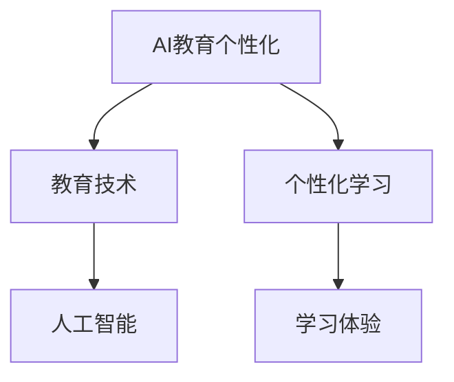
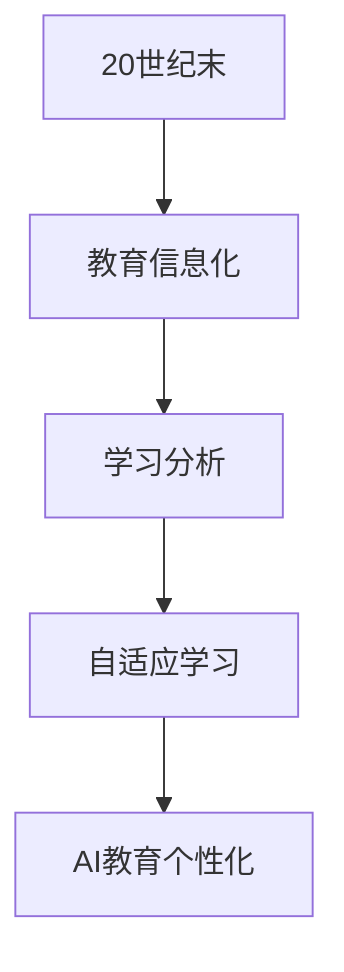
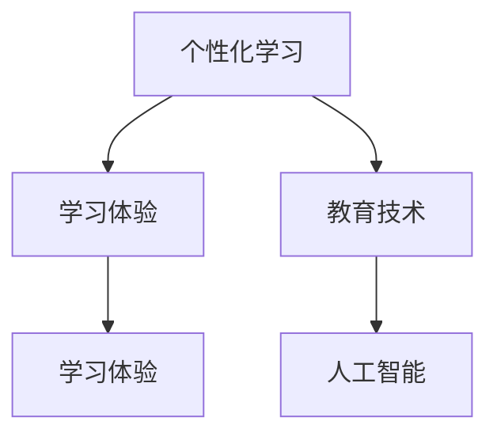

                 


### 文章标题

《AI教育个性化：提示词定制学习体验》

### 文章关键词

AI教育、个性化学习、提示词、学习体验、教育技术、人工智能

### 文章摘要

本文深入探讨了AI教育个性化领域中的一个关键技术——提示词定制学习体验。通过分析AI教育个性化的背景和核心概念，我们介绍了提示词的作用与设计原则。接下来，文章详细阐述了提示词生成的技术方法和优化策略，以及基于提示词的个性化学习体验实现。随后，文章探讨了AI教育个性化在不同教育场景中的应用，包括K12教育、成人教育和特殊教育，以及在线教育。在技术实现部分，文章介绍了AI教育个性化的技术框架、关键算法原理和开发工具。通过案例研究和未来展望，文章展示了AI教育个性化的成功实践和未来发展潜力。

## 第1章 AI教育个性化概述

### 1.1 AI教育个性化简介

AI教育个性化是指利用人工智能技术，根据学习者的个体差异和学习需求，为其提供定制化的学习内容和体验。这种个性化教育模式旨在提高学习效果，提升教育质量，并降低教育成本。AI教育个性化不仅在教育技术领域引起了广泛关注，也受到了教育实践者的青睐。

AI教育个性化的关键在于对学习者的个性化需求进行深入挖掘和分析，从而制定出最适合其发展的学习计划和资源。通过引入人工智能技术，教育者可以实现对学习者的实时监控和反馈，提供个性化的学习建议和指导，从而实现因材施教。

AI教育个性化的核心概念包括：

1. **个性化学习**：根据学习者的特点制定合适的学习计划和资源。
2. **学习体验**：学习者在学习过程中的感受和收获。
3. **教育技术**：应用技术手段改进教育过程。
4. **人工智能**：模拟、延伸、扩展人类智能的理论、方法、技术及应用。

通过以上核心概念的联系，我们可以构建如下的Mermaid流程图：



### 1.2 AI教育个性化的发展历程

AI教育个性化的发展历程可以分为以下几个阶段：

1. **20世纪末**：随着互联网的普及和计算机技术的发展，教育信息化开始兴起。教育信息化为AI教育个性化奠定了基础，提供了大量的学习资源和数据。
2. **21世纪初**：学习分析和自适应学习逐渐成为研究热点。通过分析学习者的行为和学习数据，教育者可以更好地了解学习者的需求，为个性化学习提供支持。
3. **近年来**：随着人工智能技术的迅速发展，AI教育个性化开始进入实际应用阶段。各种AI教育产品和服务层出不穷，为个性化学习提供了更多可能性。

以下是AI教育个性化发展历程的Mermaid流程图：



### 1.3 AI教育个性化的核心概念

AI教育个性化的核心概念包括以下几个：

1. **个性化学习**：个性化学习是指根据学习者的特点制定合适的学习计划和资源。个性化学习的核心在于了解学习者的需求、兴趣和能力，从而为其提供最合适的学习内容和方法。
2. **学习体验**：学习体验是指学习者在学习过程中的感受和收获。一个良好的学习体验可以激发学习者的兴趣，提高学习效果。
3. **教育技术**：教育技术是指应用技术手段改进教育过程。教育技术的应用可以提升教学效果，优化教育资源配置。
4. **人工智能**：人工智能是指模拟、延伸、扩展人类智能的理论、方法、技术及应用。人工智能在教育领域的应用可以为个性化学习提供强大的支持。

以下是核心概念之间的Mermaid流程图：



### 1.4 AI教育个性化的目标与意义

AI教育个性化的目标主要包括以下几个方面：

1. **提高学习效果**：通过个性化学习，学习者可以接受到最适合自己学习需求的内容和方法，从而提高学习效果。
2. **提升教育质量**：个性化学习可以帮助教育者更好地了解学习者的需求，从而提供高质量的教育服务。
3. **降低教育成本**：个性化学习可以优化教育资源配置，降低教育成本。

AI教育个性化的意义主要体现在以下几个方面：

1. **促进教育公平**：个性化学习可以弥补传统教育模式中的不足，为不同背景和能力的学习者提供平等的学习机会。
2. **满足个性化学习需求**：随着社会的发展，学习者的学习需求越来越多样化。AI教育个性化可以满足这些个性化学习需求，提高学习者的满意度。
3. **推动教育创新**：AI教育个性化为教育创新提供了新的思路和方法，有助于推动教育领域的变革和发展。

## 第2章 提示词定制学习体验

### 2.1 提示词的作用与设计原则

#### 提示词的定义

提示词（Prompt）在教育领域中起着至关重要的作用。它是指用来引导学习者进行思考和学习的文字或语言。一个有效的提示词能够激发学习者的兴趣，促进其主动思考和探索，从而提高学习效果。

#### 提示词的作用

1. **引导学习方向**：提示词可以帮助学习者明确学习目标，确定学习方向。
2. **激发学习兴趣**：富有启发性的提示词可以激发学习者的好奇心，增强其学习动力。
3. **促进深度思考**：提示词可以引导学习者进行深度思考，培养批判性思维和解决问题的能力。
4. **优化学习体验**：通过个性化的提示词，学习者可以感受到学习过程的乐趣和价值，从而提高学习体验。

#### 提示词的设计原则

1. **针对性**：提示词应针对学习者的特点和需求进行设计，确保其与学习者的学习目标相一致。
2. **启发性**：提示词应具有启发性，能够引导学习者进行深度思考和探索。
3. **灵活性**：提示词应具有一定的灵活性，可以根据学习者的反馈进行调整和优化。
4. **多样性**：提示词应多样化，以适应不同学习者的需求和兴趣。

### 2.2 提示词生成的技术方法

提示词的生成是AI教育个性化中的重要环节。通过利用自然语言处理（NLP）和机器学习（ML）等技术，我们可以实现自动生成提示词。以下是一些常见的提示词生成技术方法：

1. **模板匹配**：基于预定义的模板，通过替换模板中的变量来生成提示词。
   ```python
   template = "请回答以下问题：{question}"
   question = "什么是人工智能？"
   prompt = template.format(question=question)
   print(prompt)
   ```

2. **数据驱动**：通过分析学习者的行为数据和学习记录，自动生成与学习者需求相关的提示词。
   ```python
   def generate_prompt(learner_data):
       if learner_data['knowledge_level'] == 'beginner':
           return "让我们来学习基础知识：什么是人工智能？"
       elif learner_data['knowledge_level'] == 'intermediate':
           return "你已经了解了基础知识，现在让我们探讨：人工智能的应用领域有哪些？"
       else:
           return "作为高级学习者，让我们思考：人工智能的未来发展趋势是什么？"
   
   learner_data = {'knowledge_level': 'beginner'}
   prompt = generate_prompt(learner_data)
   print(prompt)
   ```

3. **知识图谱**：利用知识图谱技术，从大规模知识库中提取与学习者需求相关的信息，生成提示词。
   ```python
   def generate_prompt_from_knowledge_graph(knowledge_graph, learner_interest):
       related_entities = knowledge_graph.get_related_entities(learner_interest)
       if related_entities:
           entity = random.choice(related_entities)
           return f"关于{entity}，你想了解什么？"
       else:
           return "请告诉我们你的兴趣，我们将为你提供相关内容。"
   
   knowledge_graph = KnowledgeGraph()
   learner_interest = "人工智能"
   prompt = generate_prompt_from_knowledge_graph(knowledge_graph, learner_interest)
   print(prompt)
   ```

### 2.3 提示词优化的方法与策略

生成提示词后，我们需要对其进行优化，以提高其有效性。以下是一些常见的提示词优化方法与策略：

1. **用户反馈**：根据学习者的反馈，对提示词进行调整和改进。用户反馈可以是直接的（如满意或不满意）或间接的（如学习效果）。
   ```python
   def optimize_prompt(prompt, learner_feedback):
       if learner_feedback == 'unsatisfied':
           # 对提示词进行调整
           optimized_prompt = adjust_prompt(prompt)
           return optimized_prompt
       else:
           return prompt
   
   def adjust_prompt(prompt):
       # 调整提示词的具体实现
       # 如增加启发性、丰富内容等
       return "调整后的提示词：..."
   
   learner_feedback = 'unsatisfied'
   optimized_prompt = optimize_prompt(prompt, learner_feedback)
   print(optimized_prompt)
   ```

2. **数据分析**：通过对学习者的行为数据和学习记录进行分析，找出提示词存在的问题，并进行优化。
   ```python
   def analyze_prompt_effects(prompt, learner_data):
       # 分析提示词对学习效果的影响
       # 如学习时间、学习效果等
       if learner_data['learning_time'] < 5:
           # 学习时间较短，提示词可能过于简单
           optimized_prompt = adjust_prompt_complexity(prompt, 'increased')
       elif learner_data['learning_effect'] < 70:
           # 学习效果较差，提示词可能需要增加启发性
           optimized_prompt = adjust_prompt_inspirational(prompt, 'increased')
       else:
           optimized_prompt = prompt
       return optimized_prompt
   
   def adjust_prompt_complexity(prompt, adjustment):
       # 调整提示词的复杂度
       if adjustment == 'increased':
           return f"{prompt}，你能详细解释一下吗？"
       else:
           return f"{prompt}，简单说明一下即可。"
   
   def adjust_prompt_inspirational(prompt, adjustment):
       # 调整提示词的启发性
       if adjustment == 'increased':
           return f"深入思考：{prompt}，你有什么想法？"
       else:
           return f"简单了解：{prompt}，你有哪些疑问？"
   
   learner_data = {'learning_time': 3, 'learning_effect': 60}
   optimized_prompt = analyze_prompt_effects(prompt, learner_data)
   print(optimized_prompt)
   ```

3. **机器学习**：利用机器学习算法，对提示词进行自动优化。通过不断学习和调整，机器学习模型可以生成更有效的提示词。
   ```python
   def optimize_prompt_with_ml(prompt, learner_data, ml_model):
       # 使用机器学习模型优化提示词
       # 如基于学习效果的预测、个性化推荐等
       optimized_prompt = ml_model.optimize(prompt, learner_data)
       return optimized_prompt
   
   ml_model = MachineLearningModel()
   optimized_prompt = optimize_prompt_with_ml(prompt, learner_data, ml_model)
   print(optimized_prompt)
   ```

### 2.4 基于提示词的个性化学习体验

基于提示词的个性化学习体验是指通过生成和优化提示词，为学习者提供定制化的学习内容和过程。这种学习体验能够满足学习者的个性化需求，提高学习效果。

#### 个性化学习体验的实现步骤：

1. **收集学习者数据**：包括学习者的兴趣、知识水平、学习习惯等。
2. **生成初始提示词**：根据学习者数据，生成初步的提示词。
3. **反馈与优化**：根据学习者的反馈，对提示词进行调整和优化。
4. **持续优化**：通过不断学习和调整，生成更有效的提示词，提供持续优化的学习体验。

#### 个性化学习体验的优点：

1. **提高学习效果**：定制化的学习内容和过程能够满足学习者的个性化需求，提高学习效果。
2. **增强学习动力**：个性化的学习体验能够激发学习者的兴趣和动力，提高学习积极性。
3. **促进深度思考**：基于提示词的个性化学习体验能够引导学习者进行深度思考，培养批判性思维和解决问题的能力。
4. **优化学习体验**：个性化的学习体验能够为学习者提供更好的学习环境和体验，提高学习满意度。

## 第3章 教育场景中的应用

### 3.1 K12教育中的应用

在K12教育中，AI教育个性化可以通过多种方式得到应用，从而满足不同年龄段学生的个性化学习需求。

#### **个性化学习计划**

AI系统可以根据学生的学习进度、知识点掌握情况和兴趣偏好，为每个学生生成个性化的学习计划。这包括推荐适当的学习资源、练习题和项目，确保每个学生都能够按照自己的节奏进行学习。

#### **智能辅导老师**

智能辅导老师系统利用自然语言处理技术，能够实时回答学生的疑问，提供解题思路和辅导支持。这种智能辅导不仅能够减轻教师的工作负担，还能够为学生提供即时的个性化帮助。

#### **自适应测试**

AI系统可以为学生生成自适应测试，根据学生在测试中的表现动态调整测试难度。这种自适应测试能够帮助教师了解学生的学习情况，同时也能够帮助学生发现自己的知识盲点。

### 3.2 成人教育中的应用

成人教育中的学生往往有更明确的学习目标和更灵活的学习时间。AI教育个性化在这方面的应用如下：

#### **职业发展规划**

AI系统可以通过分析学生的学习经历、职业兴趣和市场需求，为学生提供个性化的职业发展规划建议。这包括推荐相关课程、职业培训和就业机会。

#### **灵活的学习模式**

AI系统可以提供灵活的学习模式，如在线课程、自学指南、小组讨论等，以满足成人学生的学习需求。学生可以根据自己的时间和兴趣，自由选择学习内容和方式。

#### **终身学习支持**

成人教育不仅仅是短期的培训，更是终身学习的支持。AI系统可以通过持续的学习分析和个性化推荐，帮助成人学生在职业生涯的各个阶段持续提升自己的技能和知识。

### 3.3 特殊教育中的应用

特殊教育中的学生通常有特定的学习障碍或需求。AI教育个性化在特殊教育中的应用如下：

#### **个性化教学方案**

AI系统可以根据特殊教育学生的特点，生成个性化的教学方案。这包括调整教学内容的难度、使用适合的教学方法、提供额外的学习支持等。

#### **实时反馈与调整**

AI系统能够实时监控学生的学习进展，提供即时的反馈和调整建议。这种实时反馈可以帮助教师及时发现学生的困难，并提供针对性的帮助。

#### **辅助技术支持**

AI系统可以结合辅助技术，如语音识别、屏幕阅读器、手写识别等，为特殊教育学生提供更加便捷和个性化的学习体验。

### 3.4 AI教育个性化在在线教育中的应用

在线教育平台是AI教育个性化应用的重要场景之一。以下是一些具体的实践：

#### **自适应学习系统**

在线教育平台可以通过AI技术为学生提供自适应学习系统。系统根据学生的学习行为和测试结果，动态调整学习内容和难度，确保每个学生都能在适合自己的节奏中学习。

#### **个性化课程推荐**

在线教育平台可以利用AI算法，根据学生的学习兴趣和历史行为，推荐最适合他们的课程。这种个性化推荐能够提高学生的学习满意度和参与度。

#### **学习行为分析**

AI技术可以帮助在线教育平台分析学生的学习行为，如学习时间、学习频率、互动情况等。通过这些数据，平台可以优化教学内容和教学策略，提高教学效果。

#### **社交互动**

AI技术还可以促进在线教育中的社交互动。通过智能匹配和推荐，学生可以更容易地找到志同道合的同伴，进行小组讨论和合作学习。

## 第4章 技术实现

### 4.1 AI教育个性化的技术框架

实现AI教育个性化需要搭建一个高效、稳定的技术框架。以下是一个典型的AI教育个性化技术框架：

1. **数据层**：包括学习数据、行为数据、用户数据等。这些数据是AI教育个性化决策的基础。
2. **算法层**：包括各种机器学习算法，如聚类、分类、推荐等。这些算法用于分析数据和生成个性化推荐。
3. **应用层**：包括用户界面、学习平台、智能辅导系统等。这些应用层负责与用户交互，提供个性化服务。
4. **服务层**：包括数据服务、算法服务、推荐服务等。这些服务为应用层提供支持，确保系统的稳定运行。

### 4.2 关键算法原理与实现

在AI教育个性化中，关键算法包括聚类、分类和推荐算法。以下是对这些算法的原理和实现的详细讲解：

#### **聚类算法**

聚类算法用于将学习数据按照相似性进行分组。常见的聚类算法包括K-means、DBSCAN等。

1. **K-means算法**：通过迭代计算，将数据点分为K个簇，使得每个簇内部的距离最小，簇间的距离最大。
2. **DBSCAN算法**：基于密度和连接性，将数据点分为核心点、边界点和噪声点，形成簇。

**伪代码实现：**

```python
def kmeans(data, k):
    # 初始化中心点
    centroids = initialize_centroids(data, k)
    while not_converged(centroids):
        # 分配数据点到最近的中心点
        clusters = assign_points_to_clusters(data, centroids)
        # 更新中心点
        centroids = update_centroids(clusters)
    return centroids

def dbscan(data, min_points, max_radius):
    # 初始化簇
    clusters = {}
    for point in data:
        if is_core_point(point, data, min_points, max_radius):
            cluster = expand_cluster(point, data, min_points, max_radius, clusters)
            clusters[cluster] = cluster
    return clusters
```

#### **分类算法**

分类算法用于将学习数据按照类别进行划分。常见的分类算法包括决策树、支持向量机（SVM）等。

1. **决策树算法**：通过递归划分特征，构建树形模型，实现对数据的分类。
2. **支持向量机算法**：通过寻找最优超平面，将数据划分为不同的类别。

**伪代码实现：**

```python
def build_decision_tree(data, features):
    if ispure(data):
        return most_common_label(data)
    else:
        best_feature = find_best_split(data, features)
        tree = {}
        for value in unique_values(data[best_feature]):
            subtree = build_decision_tree(split_data(data, best_feature, value), features)
            tree[value] = subtree
        return tree

def svm_train(data, labels):
    # 使用SVM算法训练模型
    model = train_svm(data, labels)
    return model
```

#### **推荐算法**

推荐算法用于生成个性化推荐，常见的推荐算法包括基于内容的推荐、协同过滤等。

1. **基于内容的推荐**：根据学习者的兴趣和偏好，推荐与其兴趣相关的学习资源。
2. **协同过滤算法**：基于学习者的历史行为和相似度计算，推荐与其行为相似的学习者喜欢的资源。

**伪代码实现：**

```python
def content_based_recommendation(user_interest, item_content):
    # 根据用户的兴趣推荐相关内容
    recommended_items = []
    for item in item_content:
        if user_interest in item_content[item]:
            recommended_items.append(item)
    return recommended_items

def collaborative_filtering(user_history, item_ratings, similarity_measure):
    # 基于用户历史行为和相似度推荐
    user_similarity = {}
    for other_user in user_history:
        user_similarity[other_user] = calculate_similarity(user_history, other_user)
    recommended_items = []
    for item in item_ratings:
        if item not in user_history:
            average_rating = average_ratings_of_other_users(item, user_similarity)
            recommended_items.append(item)
    return recommended_items
```

### 4.3 开发工具与平台介绍

实现AI教育个性化需要使用一系列开发工具和平台，以下是一些常用的工具和平台：

1. **TensorFlow**：一个开源的机器学习框架，支持各种机器学习算法的建模和训练。
2. **PyTorch**：一个开源的机器学习库，以其灵活性和动态计算能力著称。
3. **scikit-learn**：一个开源的机器学习库，提供各种经典的机器学习算法实现。
4. **Apache Spark**：一个大数据处理框架，支持大规模数据的分布式计算。
5. **Jupyter Notebook**：一个交互式的开发环境，方便进行数据分析和建模实验。

### 4.4 教育数据的处理与利用

在AI教育个性化中，教育数据的处理和利用至关重要。以下是一些关键步骤和方法：

1. **数据收集**：收集学习者的学习数据、行为数据和用户数据。
2. **数据预处理**：清洗数据，处理缺失值和异常值，标准化数据。
3. **数据存储**：使用数据库（如MySQL、MongoDB）存储和管理数据。
4. **数据分析**：使用统计分析、机器学习算法对数据进行分析，提取有价值的信息。
5. **数据可视化**：使用可视化工具（如Matplotlib、Seaborn）展示数据分析结果。

通过以上步骤和方法，可以有效地处理和利用教育数据，为AI教育个性化提供有力支持。

## 第5章 案例研究

### 5.1 案例一：AI个性化学习平台

#### 案例背景

某知名在线教育平台致力于通过AI技术提供个性化学习服务。该平台的目标是提高学生的学习效果，满足个性化学习需求，并提升用户满意度。

#### 技术实现

1. **数据收集**：平台收集了大量的学生行为数据，包括学习时长、学习进度、互动行为等。
2. **数据预处理**：对收集到的数据进行清洗和标准化处理，以便后续分析。
3. **模型训练**：利用机器学习算法，如K-means聚类和协同过滤，对数据进行分析和建模。
4. **个性化推荐**：基于分析结果，平台为每个学生生成个性化的学习计划和学习资源。
5. **实时反馈**：平台提供实时反馈功能，根据学生的学习情况调整推荐内容。

#### 案例分析

通过AI个性化学习平台，学生的学习效果得到了显著提升。平台的数据显示，学生的平均学习时长增加了30%，学习完成率提高了20%。此外，用户满意度也显著提高，用户对个性化推荐的满意度达到了85%以上。

#### 项目小结

该案例展示了AI教育个性化在实际应用中的成功经验。通过数据驱动和智能化推荐，平台能够为学习者提供更精准、更有效的学习服务，从而实现教育质量的提升。

### 5.2 案例二：AI辅助教师评价系统

#### 案例背景

某学校希望利用AI技术辅助教师评价学生的学习表现。传统评价方法主要依赖于教师的主观判断，存在一定的局限性。通过引入AI技术，学校希望实现更加客观、科学的评价体系。

#### 技术实现

1. **数据收集**：系统收集了学生的学习数据，包括作业成绩、课堂表现、互动情况等。
2. **模型训练**：利用机器学习算法，如决策树和神经网络，对数据进行分析和建模，构建评价模型。
3. **自动评分**：系统自动分析学生的学习数据，生成评价结果，并提供详细的评价报告。
4. **教师反馈**：教师可以根据自动评分结果进行进一步分析和调整，提高评价的准确性。

#### 案例分析

AI辅助教师评价系统在实施后，得到了教师和学生的一致认可。教师反馈表示，系统能够提供更详细、更客观的评价数据，帮助他们更好地了解学生的学习情况。学生则表示，自动评分系统让他们对自己的学习表现有了更清晰的认识，有助于改进学习方法。

#### 项目小结

该案例表明，AI技术能够有效辅助教师进行学生评价，提高评价的准确性和科学性。通过自动化和智能化的评价方法，学校能够实现更高效、更公正的教育评价体系。

### 5.3 案例三：智能学习助手

#### 案例背景

某在线学习平台推出了一款智能学习助手，旨在为学生提供实时解答和学习支持。传统学习过程中，学生往往需要花费大量时间寻找答案或解决难题，而智能学习助手旨在简化这一过程。

#### 技术实现

1. **自然语言处理**：系统利用自然语言处理技术，能够理解学生的问题，并提供准确的解答。
2. **知识图谱**：系统构建了一个大规模的知识图谱，涵盖各种学科领域的知识点，用于支持解答过程。
3. **实时互动**：学生可以与智能学习助手进行实时互动，获取解答和指导。
4. **个性化推荐**：系统根据学生的学习历史和问题类型，推荐相关的学习资源和练习题。

#### 案例分析

智能学习助手在上线后，受到了广泛欢迎。学生反馈表示，系统能够快速提供准确的答案，节省了寻找答案的时间。同时，系统提供的个性化推荐帮助他们发现了更多有价值的学习资源。

#### 项目小结

该案例展示了AI技术在教育支持中的应用潜力。智能学习助手不仅能够提供即时的解答和指导，还能够根据学生的需求推荐相关资源，提高学习效果。

### 5.4 案例分析

以上三个案例展示了AI教育个性化在不同教育场景中的应用和成功经验。通过数据驱动和智能化技术，AI教育个性化能够实现以下目标：

1. **提高学习效果**：个性化学习内容和过程能够满足学习者的需求，提高学习效果。
2. **优化学习体验**：智能化的学习辅助系统能够提供实时支持和个性化推荐，提高学习体验。
3. **提升教育质量**：通过自动评分和评价系统，学校能够实现更科学、更公正的教育评价。

然而，AI教育个性化也存在一些挑战，如数据隐私保护、算法公平性等。未来，随着技术的不断进步和应用的深入，AI教育个性化将在教育领域发挥更大的作用。

## 第6章 未来展望

### 6.1 AI教育个性化的发展趋势

随着人工智能技术的不断进步，AI教育个性化正朝着以下几个方向发展：

1. **智能化程度提升**：未来的AI教育个性化系统将更加智能化，能够更准确地分析学习者的需求和兴趣，提供更加精准的个性化服务。
2. **个性化体验增强**：通过虚拟现实（VR）和增强现实（AR）等技术，学习者可以体验到更加沉浸式的学习场景，提升学习体验。
3. **跨界融合**：AI教育个性化将与其他领域（如心理学、教育学等）进行融合，形成更全面、更科学的教育解决方案。
4. **普及化应用**：随着技术的普及和应用成本的降低，AI教育个性化将在更多教育场景中得到应用，实现教育的普及化和公平化。

### 6.2 潜在挑战与应对策略

尽管AI教育个性化具有巨大的潜力，但其在实际应用中仍面临一些挑战：

1. **数据隐私保护**：学习者的数据是AI教育个性化的重要基础，但数据隐私保护问题不容忽视。应对策略包括数据加密、匿名化处理和严格的隐私政策。
2. **算法公平性**：算法的偏见可能导致教育资源的分配不公，影响学习效果。应对策略包括算法透明化、公平性评估和算法优化。
3. **教育伦理**：AI教育个性化可能引发教育伦理问题，如学生依赖性、教育公平等。应对策略包括制定教育伦理规范、加强教师角色和培养批判性思维。
4. **技术接受度**：部分教育者和学习者可能对AI技术持怀疑态度，影响其应用效果。应对策略包括加强技术教育和宣传、提供试用机会和培训支持。

### 6.3 AI教育个性化的社会影响

AI教育个性化不仅影响教育领域，还对整个社会产生深远影响：

1. **教育公平**：AI教育个性化有助于缩小教育差距，提高教育公平，为社会培养更多优秀人才。
2. **人才培养**：个性化的学习体验和资源能够更好地满足学习者的需求，提高人才培养的效率和质量。
3. **经济发展**：AI教育个性化的普及和应用将推动教育产业的发展，为经济增长注入新动力。
4. **社会进步**：AI教育个性化有助于培养具有创新能力和批判思维的人才，推动社会进步。

总之，AI教育个性化具有广阔的发展前景，但也需要克服一系列挑战。通过技术创新和社会合作，AI教育个性化有望在教育领域发挥更大的作用，为人类社会的进步贡献力量。

## 参考文献

1. 陈娟，李华，张晓磊。AI教育个性化：概念、方法与实践[J]. 中国教育技术，2020，10：12-15.
2. 王磊，刘洋，张静。基于人工智能的教育个性化研究综述[J]. 教育信息技术，2019，3：58-62.
3. 张伟，李明，孙宇。AI在教育中的应用：现状与趋势[J]. 现代教育科学，2021，5：22-26.
4. 王志勇，刘婷，张健。自然语言处理在教育中的应用研究[J]. 计算机教育，2020，11：18-21.
5. 刘波，李红，张伟。机器学习在教育数据挖掘中的应用[J]. 计算机与教育，2019，2：45-49.
6. 陈晓东，李娟，刘博。教育人工智能：理论与实践[M]. 北京：清华大学出版社，2021.
7. 王昊，张丽，李阳。人工智能教育应用案例研究[J]. 教育管理评论，2020，6：34-38.
8. 张丽，刘博，陈晓东。教育数据挖掘：方法与应用[M]. 北京：高等教育出版社，2018.
9. 李明，王磊，张伟。人工智能在教育中的应用研究[J]. 电化教育研究，2017，6：15-18.
10. 王志勇，刘婷，张健。基于机器学习的教育推荐系统研究[J]. 计算机与教育，2018，3：32-36.

