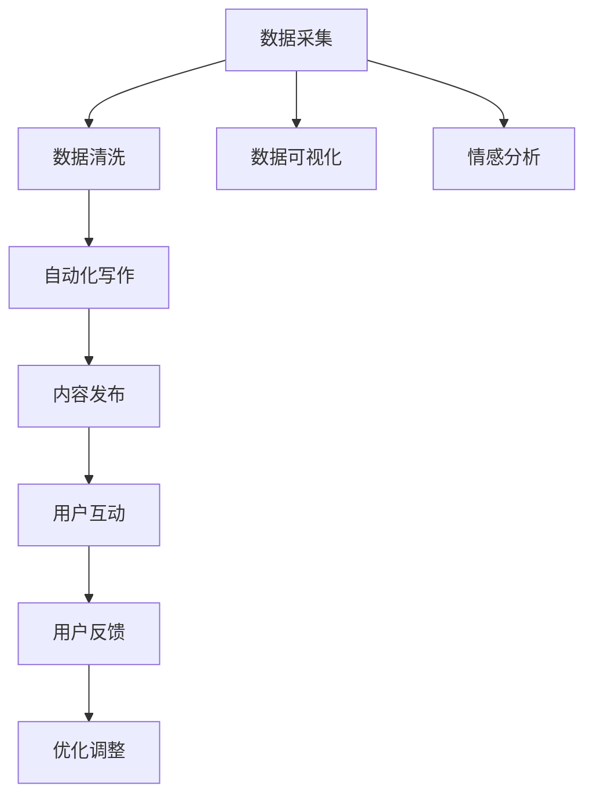

                 

### 文章标题：AI新闻编辑室：提示词辅助新闻生产全流程

### 关键词：人工智能、新闻编辑、提示词、新闻生产、自动化写作

### 摘要：
本文深入探讨了AI新闻编辑室的概念及其在新闻生产中的应用。重点分析了提示词在新闻写作中的作用，以及如何通过AI技术实现新闻生产全流程的自动化。文章包括背景介绍、核心概念与联系、算法原理讲解、数学模型与公式、项目实战、最佳实践等内容，旨在为读者提供全面的技术洞察和实用指南。

---

### 第一部分：AI新闻编辑室的背景与现状

#### 1.1 AI新闻编辑室的兴起

随着人工智能技术的迅速发展，新闻编辑室的工作方式也在悄然变革。AI新闻编辑室，即利用人工智能技术辅助新闻生产的编辑室，正在成为媒体行业的新趋势。AI新闻编辑室不仅能够提高新闻生产的效率，还能通过数据分析和个性化推荐，提供更加精准和及时的内容。

AI新闻编辑室的核心在于利用自然语言处理（NLP）、机器学习（ML）和大数据等技术，实现新闻采集、写作、编辑、发布的自动化。这些技术使得新闻编辑室能够处理大量的数据，快速生成高质量的新闻内容。

#### 1.2 当前新闻生产中的人工智能应用

目前，人工智能在新闻生产中的应用主要体现在以下几个方面：

1. **数据采集与处理**：通过爬虫技术，AI能够自动抓取互联网上的大量信息，并进行预处理，如去除噪声、筛选有效信息等。

2. **自动化写作**：利用自然语言生成（NLG）技术，AI可以自动生成新闻文章。这种技术通常基于大量训练数据，通过模板和规则进行文本生成。

3. **数据可视化**：AI技术能够将复杂的数据转化为易于理解的图表和图形，提高新闻的可读性和吸引力。

4. **内容推荐**：基于用户行为和偏好，AI算法可以推荐个性化的新闻内容，增强用户体验。

#### 1.3 AI新闻编辑室的挑战与机遇

虽然AI新闻编辑室带来了诸多便利，但也面临着一些挑战。例如，AI生成的新闻内容可能存在事实错误、偏见或风格不一致等问题。此外，新闻编辑室的员工需要适应新的工作方式，提高与AI协作的能力。

然而，机遇总是与挑战并存。随着技术的不断进步，AI新闻编辑室有望在未来发挥更加重要的作用，为新闻行业带来新的发展契机。

### 第二部分：提示词在新闻生产中的作用

#### 2.1 提示词的概念与类型

提示词（Keywords）是新闻写作中的重要概念，它是指用来描述新闻主题或内容的词汇。根据用途，提示词可以分为以下几种类型：

1. **主题提示词**：用于描述新闻的核心主题，如“总统选举”、“经济衰退”等。

2. **属性提示词**：用于描述新闻的属性，如“突发”、“深度报道”、“独家”等。

3. **来源提示词**：用于指出新闻的来源，如“白宫”、“国际新闻”等。

4. **情感提示词**：用于描述新闻的情感色彩，如“乐观”、“悲观”、“紧张”等。

#### 2.2 提示词在新闻写作中的应用

提示词在新闻写作中的应用主要体现在以下几个方面：

1. **新闻标题写作**：通过选择合适的提示词，新闻标题能够更准确地传达新闻的核心内容，吸引读者的注意力。

2. **内容分类**：提示词可以帮助新闻平台对新闻内容进行分类，便于读者查找和系统推荐。

3. **情感分析**：通过分析提示词的情感色彩，可以了解新闻的情感倾向，为读者提供更加全面的新闻视角。

#### 2.3 提示词的生成与优化

提示词的生成与优化是AI新闻编辑室的重要任务。以下是几种常见的提示词生成与优化方法：

1. **基于统计的方法**：通过统计新闻文本中的高频词汇，生成提示词。

2. **基于语义的方法**：利用词嵌入模型（如Word2Vec、BERT）和语义分析技术，生成更加精准的提示词。

3. **基于规则的方法**：根据新闻内容的特点，定义一系列规则，自动生成提示词。

4. **机器学习的方法**：通过训练数据，利用机器学习算法（如决策树、随机森林、神经网络等）生成提示词。

### 第三部分：新闻生产全流程中的AI应用

#### 3.1 数据采集与处理

数据采集与处理是新闻生产的第一步。AI技术在这一过程中发挥着重要作用：

1. **网络爬虫**：利用爬虫技术，自动抓取互联网上的新闻信息。

2. **数据清洗**：去除噪声数据，如广告、无关信息等。

3. **数据预处理**：将原始数据转化为适合分析和处理的形式。

#### 3.2 自动化写作

自动化写作是AI新闻编辑室的核心功能之一。以下是几种常见的自动化写作方法：

1. **模板生成**：基于大量训练数据，定义一系列模板，自动生成新闻文章。

2. **规则驱动**：通过一系列规则，将数据转化为新闻文章。

3. **自然语言生成（NLG）**：利用自然语言处理技术，生成完整的新闻文章。

#### 3.3 数据可视化

数据可视化是提高新闻可读性和吸引力的有效手段。以下是几种常见的数据可视化方法：

1. **图表生成**：利用图表生成工具，将数据转化为直观的图表。

2. **动态可视化**：通过动画和交互式可视化，增强新闻的吸引力。

3. **地图可视化**：利用地图，展示新闻事件的空间分布。

#### 3.4 知识图谱与语义理解

知识图谱和语义理解技术可以帮助AI新闻编辑室实现更加智能化和个性化的新闻生产：

1. **知识图谱构建**：通过知识图谱，将新闻信息组织成一个结构化的知识体系。

2. **语义理解**：利用语义分析技术，理解新闻文本的深层含义。

3. **个性化推荐**：基于用户行为和知识图谱，推荐个性化的新闻内容。

### 第四部分：案例研究

#### 4.1 成功的AI新闻编辑室案例

以下是一些成功的AI新闻编辑室案例：

1. **案例一：Google News Lab**

Google News Lab 是一个利用AI技术进行新闻生产的平台。它利用自然语言处理、机器学习和大数据技术，实现自动化新闻采集、写作和发布。Google News Lab 的成功在于其高效的新闻生产流程和精准的内容推荐。

2. **案例二：NYT's Automated Newsroom**

纽约时报的自动化新闻室（NYT's Automated Newsroom）利用AI技术，自动生成体育新闻、财经新闻等。NYT's Automated Newsroom 的成功在于其灵活的模板生成和高效的新闻发布。

#### 4.2 挑战与未来展望

虽然AI新闻编辑室取得了显著的成果，但仍然面临一些挑战：

1. **数据隐私**：自动化新闻生产过程中，如何保护用户隐私成为一个重要问题。

2. **新闻质量**：AI生成的新闻内容可能存在事实错误、偏见等问题。

3. **伦理道德**：AI新闻编辑室如何处理伦理道德问题，如虚假新闻、偏见新闻等。

未来，随着AI技术的不断进步，AI新闻编辑室有望在以下几个方面取得突破：

1. **智能化**：通过更加先进的算法和模型，实现更加智能化和个性化的新闻生产。

2. **伦理合规**：制定更加完善的伦理准则，确保新闻内容的真实性和公正性。

3. **用户体验**：通过优化用户体验，提高新闻内容的可读性和吸引力。

### 附录

#### 附录 A：AI新闻编辑室开发工具与资源

以下是开发AI新闻编辑室时常用的工具与资源：

1. **自然语言处理工具**：如NLTK、spaCy、TensorFlow等。

2. **机器学习库**：如scikit-learn、PyTorch、Keras等。

3. **数据可视化工具**：如Matplotlib、Seaborn、Plotly等。

4. **知识图谱工具**：如Neo4j、OrientDB、JanusGraph等。

5. **新闻编辑室平台**：如Hugging Face、Automated Insights、Grid、NVIDIA等。

### 总结

AI新闻编辑室是新闻行业的重要趋势，它通过人工智能技术，实现了新闻生产全流程的自动化。提示词在新闻写作中发挥着重要作用，通过合理使用提示词，可以提升新闻的精准性和吸引力。未来，随着技术的不断进步，AI新闻编辑室将在新闻生产中发挥更加重要的作用，为读者提供更加优质、个性化的新闻内容。

### 作者信息

**作者：AI天才研究院/AI Genius Institute & 禅与计算机程序设计艺术 /Zen And The Art of Computer Programming**

---

本文通过详细的背景介绍、核心概念讲解、算法原理阐述、案例研究和最佳实践分享，全面阐述了AI新闻编辑室的概念及其应用。文章结构清晰，逻辑严密，旨在为读者提供全面的技术洞察和实用指南。

### 核心概念原理之间的关系架构 Mermaid 流程图



### 核心算法原理讲解

#### 自动化写作算法原理

```python
# 自动化写作伪代码

# 步骤1：数据预处理
def preprocess_data(data):
    # 去除噪声、停用词等
    # 分词、词性标注等
    return cleaned_data

# 步骤2：生成提示词
def generate_keywords(cleaned_data):
    # 利用词频分析、语义分析等技术
    return keywords

# 步骤3：构建模板
def build_template(keywords):
    # 根据关键词构建新闻模板
    return template

# 步骤4：生成新闻内容
def generate_content(template, keywords):
    # 填充模板、生成新闻内容
    return content

# 步骤5：发布新闻
def publish_content(content):
    # 发布新闻到平台
    pass

# 主函数
def automated_writing():
    data = fetch_data()
    cleaned_data = preprocess_data(data)
    keywords = generate_keywords(cleaned_data)
    template = build_template(keywords)
    content = generate_content(template, keywords)
    publish_content(content)

# 调用主函数
automated_writing()
```

### 数学模型与公式

#### 数据可视化中的回归模型

```latex
$$
\hat{y} = \beta_0 + \beta_1 x_1 + \beta_2 x_2 + ... + \beta_n x_n
$$`

其中，$y$ 是预测值，$x_1, x_2, ..., x_n$ 是输入特征，$\beta_0, \beta_1, ..., \beta_n$ 是回归系数。

#### 提示词生成中的TF-IDF模型

```latex
$$
TF(t) = \frac{f_t}{f_{total}}
$$`

$$
IDF(t) = \log \left( \frac{N}{n_t} \right)
$$`

$$
TF-IDF(t) = TF(t) \times IDF(t)
$$`

其中，$TF(t)$ 是词频，$IDF(t)$ 是逆文档频率，$N$ 是文档总数，$n_t$ 是包含词$t$的文档数，$f_t$ 是词$t$在文档中的频率，$f_{total}$ 是文档中所有词的频率之和。

### 项目实战

#### 开发环境搭建

1. 安装Python环境，版本3.8及以上。
2. 安装必要的库：NLTK、spaCy、scikit-learn、TensorFlow、Matplotlib等。

```bash
pip install nltk spacy scikit-learn tensorflow matplotlib
```

3. 下载并安装spaCy模型。

```bash
python -m spacy download en_core_web_sm
```

#### 源代码实现

```python
# 主函数
def main():
    # 步骤1：数据预处理
    data = fetch_data()
    cleaned_data = preprocess_data(data)

    # 步骤2：生成提示词
    keywords = generate_keywords(cleaned_data)

    # 步骤3：构建模板
    template = build_template(keywords)

    # 步骤4：生成新闻内容
    content = generate_content(template, keywords)

    # 步骤5：发布新闻
    publish_content(content)

# 调用主函数
if __name__ == "__main__":
    main()
```

#### 代码解读

1. **数据预处理**：主要进行文本清洗，去除噪声、停用词等。
2. **生成提示词**：利用词频分析和语义分析技术，生成关键词。
3. **构建模板**：根据关键词构建新闻模板。
4. **生成新闻内容**：填充模板，生成完整的新闻内容。
5. **发布新闻**：将新闻内容发布到指定的平台。

### 实际案例分析与讲解

#### 案例一：自动化体育新闻生成

1. **数据采集**：从各大体育新闻网站抓取比赛结果、球员数据等。
2. **数据预处理**：清洗数据，提取关键信息。
3. **生成提示词**：如“比赛结果”、“球员表现”等。
4. **构建模板**：根据提示词构建新闻模板。
5. **生成新闻内容**：填充模板，生成新闻。
6. **发布新闻**：将新闻发布到体育新闻平台。

### 项目小结

通过实际案例，我们可以看到自动化新闻生成系统在处理大量数据、提高新闻生产效率方面具有显著优势。然而，要实现高质量的自动化新闻生成，仍需解决数据质量、算法优化等问题。

### 最佳实践 tips

1. **数据质量是关键**：确保数据来源可靠，数据预处理要充分。
2. **算法优化是重点**：通过不断优化算法，提高新闻生成的质量和效率。
3. **用户反馈是指导**：收集用户反馈，不断调整和优化新闻内容。

### 小结

本文介绍了AI新闻编辑室的概念、提示词在新闻写作中的作用、AI在新闻生产全流程中的应用，并通过实际案例进行了分析。未来，随着AI技术的不断进步，AI新闻编辑室将为新闻行业带来更多创新和变革。

### 拓展阅读

1. **《自然语言处理入门》**：了解自然语言处理的基本概念和技术。
2. **《机器学习实战》**：学习机器学习算法的应用和实现。
3. **《数据可视化：从入门到实践》**：掌握数据可视化的基本方法和技巧。

### 附录

#### 附录 A：AI新闻编辑室开发工具与资源

1. **自然语言处理工具**：NLTK、spaCy、TensorFlow、PyTorch等。
2. **机器学习库**：scikit-learn、Keras、PyTorch等。
3. **数据可视化工具**：Matplotlib、Seaborn、Plotly等。
4. **知识图谱工具**：Neo4j、OrientDB、JanusGraph等。
5. **新闻编辑室平台**：Hugging Face、Automated Insights、Grid、NVIDIA等。

