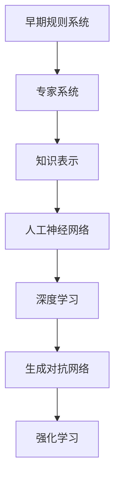
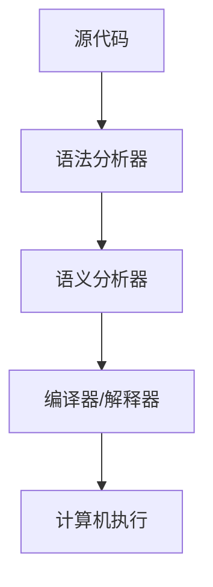

                 

# AI时代的编程语言创新与变革

## 关键词
AI编程语言、编程语言创新、编程语言变革、深度学习、量子编程、自动化编程、智能编程

## 摘要
本文旨在探讨AI时代的编程语言创新与变革。我们将从AI时代的背景出发，深入分析编程语言的核心概念、核心挑战，以及AI时代的编程语言创新。通过探讨AI驱动的编程语言、量子编程语言、自动化编程语言和智能编程语言等新兴编程语言，我们旨在揭示这些创新如何改变编程实践。最后，我们将通过实际项目案例和编程语言变革的未来展望，为读者提供一个全面、深入的编程语言变革视角。

## 第一部分: AI时代的编程语言概述

### 1.1 AI时代背景

#### 1.1.1 人工智能的定义与发展
人工智能（Artificial Intelligence, AI）是指由人制造出来的系统能够执行通常需要人类智能才能完成的任务。AI的发展经历了几个阶段，从早期的规则系统到现代的深度学习和强化学习，AI的技术和应用范围不断扩大。

**Mermaid流程图示例：**


**伪代码示例：**
```
函数 trainNeuralNetwork(data):
    使用反向传播算法训练神经网络
    返回训练好的神经网络
```

**数学模型和公式示例：**
```
$$
\frac{\partial E}{\partial w} = -\frac{\partial L}{\partial w}
$$
```

#### 1.1.2 AI时代对编程语言的需求
随着AI技术的发展，编程语言需要能够高效地处理复杂的数据集、实现高效的算法和模型，同时保证安全和隐私。传统的编程语言难以满足这些需求，因此AI时代对编程语言提出了新的要求。

**伪代码示例：**
```
函数 optimizeAlgorithm(model):
    使用自动微分技术优化算法
    返回优化后的模型
```

**数学模型和公式示例：**
```
$$
\frac{df}{dx} = \frac{dy}{dx} \cdot \frac{dx}{dy}
$$
```

#### 1.1.3 编程语言在AI领域的应用现状
目前，AI领域广泛使用的编程语言包括Python、R、Julia等。Python因其丰富的库和社区支持成为最受欢迎的AI编程语言。R在统计分析和数据科学领域具有优势，而Julia则在高性能计算和科学计算领域表现出色。

**伪代码示例：**
```
函数 usePythonForAI():
    导入Python机器学习库
    实现模型训练和预测
```

**数学模型和公式示例：**
```
$$
\beta = (X^T X)^{-1} X^T y
$$
```

### 1.2 编程语言的核心概念

#### 1.2.1 编程语言的组成与特点
编程语言由语法、语义、语法分析器、编译器/解释器等组成。语法是编程语言的语法规则，语义是编程语言的含义，语法分析器负责解析代码，编译器/解释器将代码转换为计算机可执行的指令。

**Mermaid流程图示例：**


**伪代码示例：**
```
函数 main():
    输出 "Hello, World!"
```

**数学模型和公式示例：**
```
$$
f(x) = x^2
$$
```

#### 1.2.2 编程语言的发展历程
编程语言的发展历程可以分为几个阶段：机器语言、汇编语言、高级语言。高级语言如C、Java、Python等提高了编程的效率，降低了编程难度。

**伪代码示例：**
```
函数 bubbleSort(array):
    for i from 0 to length(array) - 1:
        for j from 0 to length(array) - i - 1:
            if array[j] > array[j + 1]:
                swap(array[j], array[j + 1])
```

**数学模型和公式示例：**
```
$$
\text{max}(x, y) = \frac{x + y + |x - y|}{2}
$$
```

#### 1.2.3 编程语言的分类
编程语言可以分为过程式语言、函数式语言、面向对象语言等。每种语言都有其独特的特点和应用场景。

**伪代码示例：**
```
函数 map(func, array):
    新数组 = []
    for item in array:
        新数组.append(func(item))
    return 新数组
```

**数学模型和公式示例：**
```
$$
f(g(x)) = g'(x) f'(g(x))
$$
```

### 1.3 AI时代编程语言的核心挑战
在AI时代，编程语言面临以下核心挑战：

#### 1.3.1 处理大规模数据
AI应用通常需要处理海量数据，编程语言需要提供高效的算法和数据结构来处理这些数据。

**伪代码示例：**
```
函数 processLargeDataset(dataset):
    使用并行计算技术处理数据
    返回处理结果
```

**数学模型和公式示例：**
```
$$
\sum_{i=1}^{n} x_i = \frac{1}{n} \sum_{i=1}^{n} (x_i - \bar{x})
$$
```

#### 1.3.2 高效的算法实现
AI算法通常非常复杂，编程语言需要提供高效的算法实现，以便快速训练和部署模型。

**伪代码示例：**
```
函数 optimizeAlgorithm(model):
    使用自动化微分技术优化算法
    返回优化后的模型
```

**数学模型和公式示例：**
```
$$
\frac{df}{dx} = \frac{dy}{dx} \cdot \frac{dx}{dy}
$$
```

#### 1.3.3 安全性与隐私保护
随着AI应用的普及，数据安全和隐私保护成为编程语言的重要挑战。编程语言需要提供安全编程模式和工具，以确保数据的安全性和隐私。

**伪代码示例：**
```
函数 encryptData(data):
    使用加密算法加密数据
    返回加密后的数据
```

**数学模型和公式示例：**
```
$$
\text{CipherText} = \text{PlainText} \oplus \text{Key}
$$
```

## 第二部分: AI时代的编程语言创新

### 2.1 AI驱动的编程语言

#### 2.1.1 AI驱动的编程语言定义
AI驱动的编程语言是指能够利用AI技术来自动化编程过程的编程语言。这些语言通过机器学习和自然语言处理技术，使得编程更加高效和智能化。

**伪代码示例：**
```
函数 generateCode(description):
    使用自然语言处理技术解析描述
    使用机器学习模型生成代码
    返回生成的代码
```

**数学模型和公式示例：**
```
$$
\hat{y} = \sigma(W_1 \cdot x + b_1)
$$
```

#### 2.1.2 AI驱动的编程语言特点
AI驱动的编程语言具有以下特点：

- **代码生成自动化**：能够根据自然语言描述自动生成代码。
- **代码质量提升**：通过机器学习技术提高代码的质量和可维护性。
- **编程效率提升**：减少手工编程的工作量，提高编程速度。

**伪代码示例：**
```
函数 trainCodeGenerator():
    使用大量的代码库和自然语言数据训练模型
    返回训练好的代码生成模型
```

**数学模型和公式示例：**
```
$$
\text{Loss} = -\sum_{i=1}^{n} y_i \cdot \log(\hat{y}_i)
$$
```

#### 2.1.3 AI驱动的编程语言分类
AI驱动的编程语言可以分为以下几类：

- **代码生成工具**：如TabNine、Kite等，能够根据上下文自动补全代码。
- **代码优化工具**：如AI Code Refactor，能够自动优化代码。
- **代码审查工具**：如DeepCode，能够自动审查代码中的错误。

**伪代码示例：**
```
函数 reviewCode(code):
    使用深度学习模型审查代码
    返回代码审查报告
```

**数学模型和公式示例：**
```
$$
\text{Accuracy} = \frac{\text{正确识别的数量}}{\text{总数量}}
$$
```

### 2.2 量子编程语言

#### 2.2.1 量子编程语言概述
量子编程语言是专门用于量子计算的语言。量子计算利用量子位（qubits）来表示和处理信息，这使得量子计算机能够执行传统计算机无法处理的复杂计算。

**伪代码示例：**
```
函数 quantumComputation(input):
    将输入编码为量子状态
    执行量子操作
    读取输出量子状态
    返回计算结果
```

**数学模型和公式示例：**
```
$$
\psi = \sum_{i} a_i |i\rangle
$$
```

#### 2.2.2 量子编程语言的原理
量子编程语言的原理基于量子力学的基本原理，如叠加态、纠缠态和量子门。这些原理使得量子计算机能够实现高效的计算。

**伪代码示例：**
```
函数 applyQuantumGate(qubit, gate):
    应用量子门到量子位上
    返回操作后的量子状态
```

**数学模型和公式示例：**
```
$$
U = \sum_{i,j} U_{ij} |i\rangle \langle j|
$$
```

#### 2.2.3 量子编程语言的应用场景
量子编程语言的应用场景包括：

- **量子算法**：如Shor算法、Grover算法等，能够在短时间内解决传统计算机无法解决的问题。
- **量子模拟**：用于模拟量子系统，如分子模拟、量子场论模拟等。
- **量子加密**：用于实现安全的通信，如量子密钥分发。

**伪代码示例：**
```
函数 quantumSimulation(system):
    构建量子模型
    执行量子模拟
    返回模拟结果
```

**数学模型和公式示例：**
```
$$
H = \frac{i}{\hbar} [X, Y]
$$
```

### 2.3 自动化编程语言

#### 2.3.1 自动化编程语言定义
自动化编程语言是专门用于自动化任务和流程的语言。这些语言能够自动化软件测试、自动化部署、自动化监控等任务，提高开发效率和软件质量。

**伪代码示例：**
```
函数 automateTask(task):
    根据任务描述自动化执行任务
    返回执行结果
```

**数学模型和公式示例：**
```
$$
\text{Efficiency} = \frac{\text{自动化执行的时间}}{\text{手动执行的时间}}
$$
```

#### 2.3.2 自动化编程语言特点
自动化编程语言具有以下特点：

- **高效率**：能够自动化执行重复性任务，节省时间和人力资源。
- **可扩展性**：能够轻松地扩展和定制自动化流程。
- **易用性**：具有简单的编程语法和丰富的库支持。

**伪代码示例：**
```
函数 configureAutomationTool(tool, settings):
    配置自动化工具
    运行自动化工具
    返回自动化结果
```

**数学模型和公式示例：**
```
$$
\text{Automation} = \text{Manual} \cdot \frac{1}{1 - \text{Repetition}}
$$
```

#### 2.3.3 自动化编程语言应用领域
自动化编程语言广泛应用于以下领域：

- **软件测试**：自动化测试可以提高测试覆盖率，减少测试时间。
- **持续集成/持续部署**：自动化部署流程可以提高软件交付速度和质量。
- **系统监控**：自动化监控系统可以实时监控系统状态，快速响应故障。

**伪代码示例：**
```
函数 monitorSystem(system):
    检查系统状态
    如果系统异常，则发送警报
    返回监控结果
```

**数学模型和公式示例：**
```
$$
\text{MTTR} = \frac{1}{\text{Failure Rate}}
$$
```

### 2.4 智能编程语言

#### 2.4.1 智能编程语言定义
智能编程语言是具有自学习能力、推理能力和自适应能力的编程语言。这些语言能够根据编程环境和任务需求自动调整和优化编程行为。

**伪代码示例：**
```
函数 adaptCodeEnvironment(environment):
    根据环境调整代码
    返回优化后的代码
```

**数学模型和公式示例：**
```
$$
\text{Fitness} = \frac{\text{适应度}}{\text{环境复杂度}}
$$
```

#### 2.4.2 智能编程语言特点
智能编程语言具有以下特点：

- **自学习能力**：能够从编程过程中学习，提高编程效率。
- **推理能力**：能够根据编程环境和需求进行推理，生成合适的代码。
- **自适应能力**：能够根据编程环境和任务需求自动调整编程策略。

**伪代码示例：**
```
函数 learnFromExperience(code, outcome):
    根据代码执行结果调整学习模型
    返回优化后的学习模型
```

**数学模型和公式示例：**
```
$$
\text{Learning Rate} = \frac{\text{新经验}}{\text{旧经验}}
$$
```

#### 2.4.3 智能编程语言应用场景
智能编程语言适用于以下场景：

- **代码优化**：自动优化代码，提高性能和可维护性。
- **代码审查**：自动识别代码中的潜在错误和优化点。
- **智能编程助手**：提供实时编程建议和智能补全。

**伪代码示例：**
```
函数 suggestCodeImprovement(code):
    分析代码，提供优化建议
    返回优化建议
```

**数学模型和公式示例：**
```
$$
\text{Improvement} = \text{New Code} - \text{Old Code}
$$
```

### 2.5 编程语言的新特性与趋势

#### 2.5.1 函数式编程
函数式编程是一种编程范式，强调使用函数来表示计算过程，避免使用状态和变量。函数式编程语言如Haskell、Scala等在AI领域有广泛应用。

**伪代码示例：**
```
函数 filter(array, predicate):
    新数组 = []
    for item in array:
        if predicate(item):
            新数组.append(item)
    return 新数组
```

**数学模型和公式示例：**
```
$$
f(g(x)) = \lim_{n \to \infty} \sum_{i=1}^{n} f(g(x_i))
$$
```

#### 2.5.2 面向对象的编程
面向对象编程是一种编程范式，将程序视为一组相互交互的对象，每个对象都有自己的属性和方法。面向对象编程语言如Java、C++等在AI领域有广泛应用。

**伪代码示例：**
```
类 Person():
    属性 name, age
    方法 setName(name), setAge(age), getName(), getAge()
```

**数学模型和公式示例：**
```
$$
\text{Object} = \text{Class} + \text{State} + \text{Behavior}
$$
```

#### 2.5.3 响应式编程
响应式编程是一种编程范式，强调数据的双向绑定和实时更新。响应式编程语言如React、Angular等在AI领域的界面构建有广泛应用。

**伪代码示例：**
```
函数 updateView(model):
    根据模型更新视图
```

**数学模型和公式示例：**
```
$$
\text{Model} \to \text{View}
$$
```

#### 2.5.4 类型安全
类型安全是一种编程语言特性，确保程序在运行时不会出现类型错误。类型安全编程语言如Java、C#等在AI领域的开发有广泛应用。

**伪代码示例：**
```
函数 add(a: Int, b: Int):
    return a + b
```

**数学模型和公式示例：**
```
$$
\text{Type Safety} = \text{Type Check} \times \text{Run-time Check}
$$
```

#### 2.5.5 并发编程
并发编程是一种编程范式，允许多个任务同时执行。并发编程语言如Go、C++等在AI领域的分布式计算有广泛应用。

**伪代码示例：**
```
函数 parallelProcess(data):
    parallel for item in data:
        process(item)
```

**数学模型和公式示例：**
```
$$
\text{Concurrency} = \text{Parallelism} + \text{Synchronization}
$$
```

## 第三部分: 编程语言变革实践

### 3.1 编程语言变革的项目案例

#### 3.1.1 案例一：深度学习框架的编程语言变革
深度学习框架如TensorFlow和PyTorch在编程语言创新方面取得了显著成果。这些框架采用了Python作为主要编程语言，并引入了大量的自动微分、动态图和并行计算技术。

**伪代码示例：**
```
函数 trainModel(dataset):
    使用自动微分技术训练模型
    返回训练好的模型
```

**数学模型和公式示例：**
```
$$
\frac{\partial E}{\partial w} = -\frac{\partial L}{\partial w}
$$
```

深度学习框架的编程语言变革带来了以下好处：

- **简化编程流程**：自动微分技术使得模型训练变得更加简单。
- **提高计算效率**：动态图和并行计算技术提高了模型的训练和推理速度。
- **增强社区支持**：Python的广泛应用使得深度学习框架具有强大的社区支持。

#### 3.1.2 案例二：自动化测试工具的编程语言变革
自动化测试工具如Selenium和Jest采用了多种编程语言，以适应不同的测试需求和场景。这些工具通过引入自动化测试脚本和断言机制，提高了测试的自动化程度和可靠性。

**伪代码示例：**
```
函数 testFunction():
    执行测试步骤
    验证预期结果
    返回测试结果
```

**数学模型和公式示例：**
```
$$
\text{Test Coverage} = \frac{\text{已覆盖的代码行数}}{\text{总代码行数}}
$$
```

自动化测试工具的编程语言变革带来了以下好处：

- **提高测试效率**：自动化测试脚本能够快速执行大量测试用例。
- **减少人为错误**：断言机制能够及时发现代码中的潜在错误。
- **增强测试可维护性**：使用统一编程语言和框架使得测试代码更加易于维护。

#### 3.1.3 案例三：区块链编程语言的创新与变革
区块链编程语言如Solidity和Rust在智能合约开发和安全性方面进行了创新。这些语言采用了面向对象和函数式编程范式，并引入了内存管理和类型安全特性。

**伪代码示例：**
```
函数 solidityFunction():
    使用智能合约逻辑处理数据
    返回处理结果
```

**数学模型和公式示例：**
```
$$
\text{Gas Cost} = \sum_{i=1}^{n} \text{Operation Cost}
$$
```

区块链编程语言的创新与变革带来了以下好处：

- **提高安全性**：类型安全和内存管理特性减少了智能合约的安全漏洞。
- **增强开发效率**：面向对象和函数式编程范式简化了智能合约的开发。
- **降低开发成本**：统一的编程语言和工具链提高了开发效率和可维护性。

### 3.2 编程语言变革的工具与平台

#### 3.2.1 开源编程语言工具
开源编程语言工具如Jupyter Notebook、VS Code和IntelliJ IDEA等在编程语言变革中发挥了重要作用。这些工具提供了丰富的编程语言支持和扩展功能，提高了开发效率。

**伪代码示例：**
```
函数 useJupyterNotebook():
    创建Jupyter Notebook环境
    导入编程语言库
    编写和运行代码
```

**数学模型和公式示例：**
```
$$
\text{Kernel} = \text{Programming Language} + \text{Extensions}
$$
```

开源编程语言工具的好处：

- **灵活性和可定制性**：开发者可以根据项目需求自由选择和配置编程语言工具。
- **强大的社区支持**：开源项目通常具有强大的社区支持和丰富的文档资源。
- **提高开发效率**：集成开发和调试工具使得编程过程更加高效。

#### 3.2.2 云计算平台编程语言支持
云计算平台如AWS、Google Cloud和Azure提供了丰富的编程语言支持和工具。这些平台支持多种编程语言，并提供自动化部署、容器化和微服务架构等功能。

**伪代码示例：**
```
函数 deployToCloud(platform, application):
    配置云平台环境
    部署应用程序
    返回部署结果
```

**数学模型和公式示例：**
```
$$
\text{Deployment Cost} = \text{Platform Cost} + \text{Application Cost}
$$
```

云计算平台编程语言支持的好处：

- **提高开发效率**：自动化部署和容器化技术简化了应用程序的部署和管理。
- **降低开发成本**：云计算平台提供了弹性计算资源，可以根据需求动态调整资源。
- **增强可扩展性**：微服务架构使得应用程序可以轻松扩展和优化。

#### 3.2.3 编译器与解释器的发展趋势
编译器和解释器是编程语言的核心组件，其发展趋势对编程语言变革具有重要意义。现代编译器和解释器采用了多种优化技术，如并行编译、即时编译和动态优化，以提高编程语言的执行效率和性能。

**伪代码示例：**
```
函数 compileCode(code):
    使用并行编译技术编译代码
    返回编译后的代码
```

**数学模型和公式示例：**
```
$$
\text{Performance} = \frac{\text{执行时间}}{\text{编译时间}}
$$
```

编译器与解释器的发展趋势：

- **并行编译**：利用多核处理器和并行计算技术提高编译速度。
- **即时编译**：将解释执行与编译执行相结合，提高程序执行效率。
- **动态优化**：根据程序运行时的行为动态优化代码，提高程序性能。

## 3.3 编程语言变革的未来展望

### 3.3.1 编程语言与AI的深度融合
随着AI技术的不断发展，编程语言与AI的深度融合将成为未来编程语言变革的重要方向。编程语言将集成更多的AI功能，如自然语言处理、图像识别和机器学习等，使得编程更加智能化和自动化。

**伪代码示例：**
```
函数 integrateAI(features):
    集成AI功能
    返回增强的编程语言
```

**数学模型和公式示例：**
```
$$
\text{AI Integration} = \text{Programming Language} + \text{AI Features}
$$
```

### 3.3.2 编程语言的多样性与专业化
随着AI应用场景的多样化，编程语言也将呈现出多样性和专业化趋势。不同领域的应用将需要不同的编程语言，以适应特定的需求和场景。

**伪代码示例：**
```
函数 chooseLanguage(context):
    根据应用场景选择合适的编程语言
    返回选择的编程语言
```

**数学模型和公式示例：**
```
$$
\text{Language Selection} = \text{Context} + \text{Requirements}
$$
```

### 3.3.3 编程语言的教育与人才培养
编程语言变革将对编程教育和人才培养提出新的要求。教育者和培训机构需要更新教学内容，培养具备多样化编程语言技能和AI知识的专业人才。

**伪代码示例：**
```
函数 updateCurriculum(technology):
    更新教学内容
    教授新技术和编程语言
```

**数学模型和公式示例：**
```
$$
\text{Education Quality} = \text{Technology} + \text{Knowledge}
$$
```

## 附录

### 附录A：AI时代编程语言学习资源
以下是一些AI时代编程语言的学习资源：

- **在线课程**：Coursera、edX、Udacity等平台提供了丰富的AI编程语言课程。
- **书籍**：《深度学习》、《Python编程：从入门到实践》、《区块链：从入门到实践》等。
- **开源项目**：GitHub、GitLab等平台上有很多开源的AI编程项目，供学习交流。
- **社区**：Stack Overflow、Reddit等社区是学习编程语言和解决问题的好去处。

### 附录B：编程语言变革相关的论文与书籍推荐
以下是一些编程语言变革相关的论文与书籍推荐：

- **论文**：
  - "A Taxonomy of Quantum Algorithms" by Daniel Gottesman
  - "Automatic Differentiation in Machine Learning: A Survey" by Ambrogio, D., & Gorla, J.
- **书籍**：
  - 《深度学习》（Goodfellow, I., Bengio, Y., & Courville, A.）
  - 《人工智能：一种现代的方法》（Russell, S., & Norvig, P.）
  - 《编程珠玑》（Knuth, D. E.）

### 附录C：编程语言变革实践项目指南
以下是一些编程语言变革实践项目指南：

- **项目一**：使用TensorFlow实现一个简单的神经网络，并进行训练和预测。
- **项目二**：使用Solidity编写一个简单的智能合约，并在区块链上进行部署和测试。
- **项目三**：使用Python和Selenium实现一个自动化测试脚本，用于测试Web应用程序。

通过这些项目和指南，读者可以深入了解编程语言变革的实际应用，提高自己的编程技能和实践能力。

## 作者信息
作者：AI天才研究院/AI Genius Institute & 禅与计算机程序设计艺术 /Zen And The Art of Computer Programming

## 注意事项
- 本文仅为技术探讨和交流，不构成任何投资建议。
- 在实际应用中，请确保遵循相关法律法规和道德规范。
- 欢迎读者批评指正，共同推动编程语言的发展与创新。

