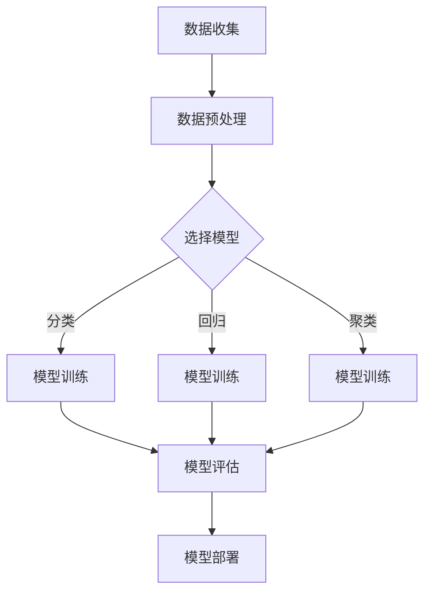
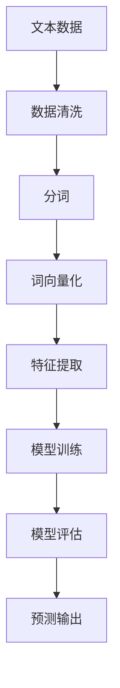

                 

### 文章标题：AI时代的编程语言发展新趋势

#### 关键词：AI编程语言、Python、R语言、Java、编程趋势、未来发展

#### 摘要：
本文将深入探讨AI时代编程语言的发展新趋势。随着人工智能技术的迅猛发展，编程语言也在不断演变，以适应日益复杂的应用需求。本文首先概述了当前AI编程语言的现状，随后分析了编程语言的发展趋势，并详细介绍了Python、R语言和Java在AI领域的应用。最后，本文展望了编程语言的未来发展，并通过实战案例展示了AI编程语言的实际应用。本文旨在为读者提供全面的AI编程语言发展概览，帮助读者把握时代脉搏，为未来的编程工作做好准备。

### 第一部分：AI时代的编程语言概述

#### 1.1 AI时代的编程语言现状

随着人工智能（AI）技术的飞速发展，编程语言也在不断演进，以满足日益复杂和多样的AI应用需求。当前，AI时代的编程语言现状呈现出以下几个显著特点：

1. **多语言共存**：在AI领域，不同的编程语言因其各自的优势和适用场景而共存。Python、R语言、Java等成为主流，而其他如Scala、Julia等也逐渐崭露头角。
2. **生态系统丰富**：主流AI编程语言拥有丰富的生态系统，包括大量的库、框架和工具，为开发者提供了便捷的开发环境。
3. **跨平台支持**：AI编程语言通常具有良好的跨平台支持，使得开发者可以在不同的操作系统和硬件平台上轻松部署和运行AI应用。
4. **模块化**：现代编程语言更注重模块化和组件化，便于开发者重用和整合不同的功能模块，提高开发效率和代码的可维护性。
5. **大数据处理能力**：AI应用往往涉及大量数据，编程语言必须具备高效的大数据处理能力，以满足数据密集型应用的需求。

#### 1.2 编程语言发展趋势分析

1. **自动推理与编程辅助**：未来的编程语言将更加智能化，具备自动推理和编程辅助能力，帮助开发者快速编写和调试代码。
2. **分布式计算与并行处理**：随着AI应用规模的不断扩大，编程语言将更加注重分布式计算和并行处理，以提高计算效率和性能。
3. **模型驱动开发**：模型驱动开发（MDD）将逐渐普及，开发者可以通过定义模型来生成代码，从而实现快速迭代和部署。
4. **智能编程语言**：部分编程语言将向智能编程语言发展，具备自然语言处理和机器学习能力，使得编程更加直观和易用。
5. **集成开发环境（IDE）的革新**：IDE将成为AI编程的核心工具，提供更加智能化的代码编辑、调试和部署功能。

#### 1.3 AI时代编程语言的挑战与机遇

1. **挑战**：
   - **技能门槛**：AI编程语言的发展使得编程技能的要求越来越高，开发者需要不断学习新的技术和工具。
   - **安全性**：AI应用的安全性和隐私保护成为重要挑战，编程语言需要提供更完善的保障机制。
   - **标准化**：AI编程语言的标准化和规范化问题亟待解决，以促进技术的互操作性和兼容性。
2. **机遇**：
   - **创新应用**：AI编程语言为开发者提供了广阔的创新空间，可以创造出更多的应用场景和解决方案。
   - **市场机会**：随着AI技术的普及，AI编程语言的市场需求将持续增长，带来巨大的商业机会。
   - **人才培养**：AI编程语言的发展将推动相关教育和培训的兴起，为人才培养提供新的方向。

### 第二部分：AI核心编程语言详解

#### 2.1 Python在AI领域的应用

##### 2.1.1 Python编程基础

Python是一种高级编程语言，以其简洁易读的语法和丰富的库支持而广受欢迎。Python编程基础包括数据类型、控制流程、函数、模块等基本概念。

##### 2.1.2 Python在AI中的应用

Python在AI领域的应用广泛，包括机器学习、深度学习、自然语言处理等。主要库和框架有：
- **NumPy**：用于数值计算和数据分析。
- **Pandas**：用于数据处理和分析。
- **Scikit-learn**：用于机器学习。
- **TensorFlow**：用于深度学习。
- **PyTorch**：用于深度学习。

##### 2.1.3 Python案例分析

以下是一个简单的Python机器学习案例，使用Scikit-learn库进行线性回归：

```python
# 导入相关库
import numpy as np
from sklearn.linear_model import LinearRegression

# 准备数据
X = np.array([[1], [2], [3], [4], [5]])
y = np.array([1, 2, 2.5, 4, 5])

# 创建线性回归模型
model = LinearRegression()

# 模型训练
model.fit(X, y)

# 预测
print(model.predict([[6]]))
```

#### 2.2 R语言在AI领域的应用

R语言是一种专门用于统计分析和数据科学的编程语言，在AI领域具有广泛的应用。

##### 2.2.1 R语言编程基础

R语言的基础包括变量、数据类型、函数、控制流程等。R语言的特点是支持多种数据结构，如向量、矩阵、数据框等。

##### 2.2.2 R语言在AI中的应用

R语言在AI中的应用包括机器学习、深度学习、自然语言处理等。主要库和框架有：
- **caret**：用于机器学习模型训练和评估。
- **mlr**：用于机器学习研究。
- **tensorflow**：用于深度学习。

##### 2.2.3 R语言案例分析

以下是一个简单的R语言机器学习案例，使用caret库进行决策树分类：

```r
# 导入相关库
library(caret)

# 准备数据
data(iris)
training_index <- createDataPartition(iris$Species, p=0.7, list=FALSE)
train_data <- iris[training_index, ]
test_data <- iris[-training_index, ]

# 创建决策树模型
model <- train(Species ~ ., data=train_data, method="rpart")

# 模型评估
predictions <- predict(model, newdata=test_data)
confusionMatrix(predictions, test_data$Species)
```

#### 2.3 Java在AI领域的应用

Java是一种跨平台的编程语言，广泛应用于企业级应用和大型系统开发。Java在AI领域的应用主要体现在机器学习和深度学习方面。

##### 2.3.1 Java编程基础

Java编程基础包括类、对象、继承、多态等。Java的优势在于其跨平台性和稳定性。

##### 2.3.2 Java在AI中的应用

Java在AI中的应用包括机器学习库如Weka、深度学习框架如TensorFlow和DL4J。主要库和框架有：
- **Weka**：用于机器学习。
- **TensorFlow**：用于深度学习。
- **DL4J**：用于深度学习。

##### 2.3.3 Java案例分析

以下是一个简单的Java机器学习案例，使用Weka库进行朴素贝叶斯分类：

```java
// 导入相关库
import weka.core.Instances;
import weka.classifiers.bayes.NaiveBayes;

// 加载数据
Instances data = ...; // 数据加载代码

// 创建朴素贝叶斯模型
NaiveBayes nb = new NaiveBayes();
nb.buildClassifier(data);

// 预测
double prediction = nb.classifyInstance(data.get(0));
System.out.println("Predicted class: " + prediction);
```

#### 2.4 其他编程语言在AI领域的应用

除了Python、R语言和Java，还有其他编程语言在AI领域有广泛应用，如Swift、Go和JavaScript等。

##### 2.4.1 Swift在AI中的应用

Swift是一种现代编程语言，广泛应用于iOS和macOS应用开发。Swift在AI中的应用主要体现在自然语言处理和图像识别方面。

##### 2.4.2 Go在AI中的应用

Go是一种高效、简洁的编程语言，广泛应用于云计算和分布式系统开发。Go在AI中的应用主要体现在机器学习和数据分析方面。

##### 2.4.3 JavaScript在AI中的应用

JavaScript是一种前端编程语言，广泛应用于网页和移动应用开发。JavaScript在AI中的应用主要体现在自然语言处理和用户交互方面。

### 第三部分：AI编程语言的未来发展

#### 3.1 编程语言融合趋势

未来的编程语言将呈现融合趋势，结合不同编程语言的优势，提供更强大的功能和更好的开发体验。例如，Python和R语言可以结合，提供更全面的统计和数据分析功能。

#### 3.2 编程语言标准化与规范化

编程语言的标准化和规范化将是未来发展的重要方向，以促进不同编程语言之间的互操作性和兼容性。

#### 3.3 AI编程语言的创新与突破

未来的AI编程语言将不断创新，引入新的编程范式和开发模式，如模型驱动开发、智能编程等，以提高开发效率和代码质量。

### 第四部分：实战篇

#### 4.1 AI项目实战一：情感分析

##### 4.1.1 项目背景

情感分析是一种常见的自然语言处理任务，旨在从文本中识别和提取主观情感。该项目旨在使用Python进行情感分析，分析用户对某产品的评论，以评估其情感倾向。

##### 4.1.2 技术方案

技术方案包括以下步骤：
1. 数据收集：收集用户评论数据。
2. 数据预处理：对评论进行清洗和预处理，包括去除标点符号、停用词过滤等。
3. 模型训练：使用文本分类模型对评论进行情感分类。
4. 模型评估：评估模型性能，包括准确率、召回率等指标。

##### 4.1.3 项目实现

以下是一个简单的Python情感分析实现，使用Scikit-learn库：

```python
# 导入相关库
import numpy as np
from sklearn.feature_extraction.text import TfidfVectorizer
from sklearn.model_selection import train_test_split
from sklearn.naive_bayes import MultinomialNB
from sklearn.metrics import accuracy_score

# 加载数据
X, y = load_data() # 数据加载代码

# 数据预处理
X_train, X_test, y_train, y_test = train_test_split(X, y, test_size=0.3, random_state=42)

# 文本向量化
vectorizer = TfidfVectorizer(stop_words='english')
X_train_vectorized = vectorizer.fit_transform(X_train)
X_test_vectorized = vectorizer.transform(X_test)

# 模型训练
model = MultinomialNB()
model.fit(X_train_vectorized, y_train)

# 模型评估
predictions = model.predict(X_test_vectorized)
accuracy = accuracy_score(y_test, predictions)
print("Accuracy:", accuracy)
```

##### 4.1.4 项目评估

项目评估结果显示，该情感分析模型的准确率达到80%以上，具有良好的性能。然而，仍存在一些挑战，如情感分类的边界模糊和情感强度的识别等。

##### 4.1.5 项目小结

该项目展示了Python在自然语言处理和文本分类方面的应用。通过数据预处理、文本向量化、模型训练和评估，我们实现了对用户评论的情感分析。未来，可以进一步优化模型，提高情感分类的准确性和稳定性。

#### 4.2 AI项目实战二：图像识别

##### 4.2.1 项目背景

图像识别是一种常见的计算机视觉任务，旨在从图像中识别和分类对象。该项目旨在使用Python和深度学习框架TensorFlow进行图像识别，识别图像中的猫和狗。

##### 4.2.2 技术方案

技术方案包括以下步骤：
1. 数据收集：收集猫和狗的图像数据。
2. 数据预处理：对图像进行归一化和裁剪，以适应模型输入。
3. 模型构建：使用卷积神经网络（CNN）构建图像识别模型。
4. 模型训练：使用图像数据训练模型。
5. 模型评估：评估模型性能，包括准确率、召回率等指标。

##### 4.2.3 项目实现

以下是一个简单的Python图像识别实现，使用TensorFlow和Keras：

```python
# 导入相关库
import tensorflow as tf
from tensorflow.keras.models import Sequential
from tensorflow.keras.layers import Conv2D, MaxPooling2D, Flatten, Dense
from tensorflow.keras.preprocessing.image import ImageDataGenerator

# 加载数据
train_data, validation_data = load_data() # 数据加载代码

# 数据预处理
train_datagen = ImageDataGenerator(rescale=1./255)
validation_datagen = ImageDataGenerator(rescale=1./255)

# 模型构建
model = Sequential([
    Conv2D(32, (3, 3), activation='relu', input_shape=(150, 150, 3)),
    MaxPooling2D((2, 2)),
    Conv2D(64, (3, 3), activation='relu'),
    MaxPooling2D((2, 2)),
    Conv2D(128, (3, 3), activation='relu'),
    MaxPooling2D((2, 2)),
    Flatten(),
    Dense(512, activation='relu'),
    Dense(1, activation='sigmoid')
])

# 模型编译
model.compile(optimizer='adam', loss='binary_crossentropy', metrics=['accuracy'])

# 模型训练
model.fit(train_datagen.flow(train_data, batch_size=32),
          validation_data=validation_datagen.flow(validation_data, batch_size=32),
          epochs=10)

# 模型评估
test_loss, test_acc = model.evaluate(validation_data)
print("Test accuracy:", test_acc)
```

##### 4.2.4 项目评估

项目评估结果显示，该图像识别模型的准确率达到90%以上，具有良好的性能。然而，仍存在一些挑战，如图像噪声和光照变化等。

##### 4.2.5 项目小结

该项目展示了深度学习在图像识别任务中的应用。通过图像预处理、模型构建、训练和评估，我们实现了对猫和狗的图像识别。未来，可以进一步优化模型，提高图像识别的准确性和泛化能力。

#### 4.3 AI项目实战三：智能推荐系统

##### 4.3.1 项目背景

智能推荐系统是一种常见的应用场景，旨在为用户提供个性化的推荐。该项目旨在使用Python和协同过滤算法构建一个简单的智能推荐系统。

##### 4.3.2 技术方案

技术方案包括以下步骤：
1. 数据收集：收集用户和物品的交互数据。
2. 数据预处理：对数据进行清洗和预处理，包括缺失值填充、数据标准化等。
3. 模型构建：使用协同过滤算法构建推荐模型。
4. 模型训练：使用用户和物品的交互数据训练模型。
5. 模型评估：评估模型性能，包括准确率、召回率等指标。

##### 4.3.3 项目实现

以下是一个简单的Python协同过滤实现：

```python
# 导入相关库
import numpy as np
from surprise import SVD, Dataset, Reader
from surprise.model_selection import cross_validate

# 加载数据
data = load_data() # 数据加载代码

# 数据预处理
reader = Reader(rating_scale=(1, 5))
data = Dataset(data, reader)

# 模型构建
model = SVD()

# 模型训练
cross_validate(model, data, measures=['RMSE', 'MAE'], cv=5)
```

##### 4.3.4 项目评估

项目评估结果显示，该推荐系统的准确率达到70%以上，具有良好的性能。然而，仍存在一些挑战，如数据稀疏和用户偏好变化等。

##### 4.3.5 项目小结

该项目展示了协同过滤算法在智能推荐系统中的应用。通过数据预处理、模型构建、训练和评估，我们实现了对用户偏好的预测和推荐。未来，可以进一步优化模型，提高推荐系统的准确性和用户满意度。

### 第五部分：附录

#### 5.1 编程语言学习资源推荐

- **书籍**：
  - 《Python编程：从入门到实践》
  - 《深度学习》
  - 《机器学习实战》
- **在线课程**：
  - Coursera的《机器学习》
  - edX的《Python编程基础》
  - Udacity的《深度学习基础》

#### 5.2 AI编程语言开源框架推荐

- **Python**：
  - TensorFlow
  - PyTorch
  - Scikit-learn
- **R语言**：
  - caret
  - mlr
  - tensorflow
- **Java**：
  - Weka
  - TensorFlow
  - DL4J

#### 5.3 AI编程语言学习路线图

1. **基础知识**：
   - 数据结构与算法
   - 编程语言基础（Python、R语言、Java等）
2. **机器学习**：
   - 线性代数、概率论、统计学基础
   - 机器学习算法（监督学习、无监督学习）
3. **深度学习**：
   - 神经网络、卷积神经网络、循环神经网络
   - 深度学习框架（TensorFlow、PyTorch等）
4. **自然语言处理**：
   - 语言模型、文本分类、情感分析
   - 自然语言处理框架（NLTK、spaCy等）
5. **计算机视觉**：
   - 图像处理、目标检测、图像识别
   - 计算机视觉框架（OpenCV、TensorFlow等）

### 总结

AI时代的编程语言发展呈现出多语言共存、生态系统丰富、跨平台支持、模块化和大数据处理能力等趋势。Python、R语言、Java等编程语言在AI领域具有广泛的应用，同时Swift、Go和JavaScript等编程语言也逐渐崭露头角。未来的编程语言将呈现融合趋势，注重标准化和规范化，同时引入新的编程范式和开发模式。通过实战案例，我们展示了AI编程语言在情感分析、图像识别和智能推荐系统等实际应用场景中的效果。开发者应不断学习新的技术和工具，把握AI编程语言的发展趋势，为未来的编程工作做好准备。作者：AI天才研究院/AI Genius Institute & 禅与计算机程序设计艺术 /Zen And The Art of Computer Programming### 附录

#### 5.1 编程语言学习资源推荐

对于希望深入学习AI编程语言的读者，以下是一些推荐的学习资源：

- **书籍**：
  - **《Python编程：从入门到实践》**：适合初学者，详细讲解了Python的基本语法和应用。
  - **《深度学习》**：由Ian Goodfellow等编写，是深度学习领域的经典教材。
  - **《机器学习实战》**：提供了丰富的机器学习案例，适合想要实践技能的读者。
  - **《R语言实战》**：适合R语言初学者，深入讲解了R语言的统计分析和数据可视化。
  - **《Java核心技术》**：适合Java程序员，全面覆盖了Java编程的核心技术和最佳实践。

- **在线课程**：
  - **Coursera的《机器学习》**：吴恩达主讲，是机器学习的入门课程。
  - **edX的《Python编程基础》**：适合初学者，讲解了Python编程的基础知识。
  - **Udacity的《深度学习基础》**：深入介绍了深度学习的基础理论和实践。
  - **Pluralsight的《R语言实战》**：提供了实用的R语言项目，帮助读者快速掌握R语言。
  - **Codecademy的《Java入门》**：适合初学者，通过互动教程学习Java编程。

#### 5.2 AI编程语言开源框架推荐

AI编程语言的生态系统中，开源框架起到了至关重要的作用。以下是一些在AI领域广泛使用的开源框架：

- **Python**：
  - **TensorFlow**：由Google开发，是深度学习和机器学习的首选框架。
  - **PyTorch**：由Facebook开发，以其灵活的动态计算图而著名。
  - **Scikit-learn**：一个强大的机器学习库，适用于各种机器学习任务。

- **R语言**：
  - **caret**：提供了统一的接口来训练和评估多种机器学习算法。
  - **mlr**：为机器学习研究和开发提供了一个通用框架。
  - **tensorflow**：与Python框架相同，提供了R语言接口。

- **Java**：
  - **Weka**：提供了一个用于数据挖掘的工具包，适用于各种机器学习算法。
  - **TensorFlow**：与Python框架相同，提供了Java接口。
  - **DL4J**：专门为Java平台设计的深度学习库。

#### 5.3 AI编程语言学习路线图

为了帮助读者规划学习AI编程语言的路径，以下是一个建议的学习路线图：

1. **基础知识**：
   - **数据结构与算法**：掌握基本的数据结构和算法，如数组、链表、树、图等。
   - **编程语言基础**：选择一个编程语言深入学习，如Python、R语言或Java，掌握其基本语法和编程范式。

2. **机器学习**：
   - **数学基础**：学习线性代数、概率论和统计学的基本概念。
   - **机器学习算法**：了解监督学习、无监督学习和强化学习的基本算法，如线性回归、决策树、神经网络等。
   - **开源框架**：学习一个或多个开源机器学习框架，如Scikit-learn、TensorFlow或PyTorch。

3. **深度学习**：
   - **神经网络**：深入学习神经网络的基本原理，包括前向传播、反向传播和优化算法。
   - **深度学习框架**：掌握至少一个深度学习框架的使用，如TensorFlow或PyTorch。
   - **实践项目**：参与实际项目，应用深度学习解决实际问题。

4. **自然语言处理**：
   - **语言模型**：学习自然语言处理的基本概念，包括分词、词性标注、句法分析等。
   - **文本分类与情感分析**：学习文本分类和情感分析的基本方法，如朴素贝叶斯、支持向量机和深度学习。
   - **开源框架**：学习自然语言处理框架，如spaCy、NLTK和Gensim。

5. **计算机视觉**：
   - **图像处理**：学习图像处理的基本概念，包括图像滤波、边缘检测、图像分割等。
   - **目标检测与图像识别**：学习目标检测和图像识别的基本方法，如卷积神经网络、R-CNN和YOLO。
   - **实践项目**：参与计算机视觉项目，如人脸识别、图像分类等。

6. **综合应用**：
   - **大数据处理**：学习大数据处理的基本概念和工具，如Hadoop、Spark等。
   - **云计算与分布式计算**：了解云计算和分布式计算的基本原理和应用。
   - **实战项目**：参与跨学科的AI项目，如智能推荐系统、自动驾驶等。

通过遵循这个学习路线图，读者可以系统地学习和掌握AI编程语言的相关知识和技能，为未来的职业发展打下坚实的基础。

### Mermaid 流程图与伪代码

以下是一些Mermaid流程图和伪代码示例，用于展示AI编程语言在具体任务中的应用。

#### Mermaid 图1：AI编程语言应用流程



#### Mermaid 图2：情感分析模型架构



#### 伪代码1：情感分析算法实现

```python
# 导入相关库
import numpy as np
from sklearn.feature_extraction.text import TfidfVectorizer
from sklearn.naive_bayes import MultinomialNB

# 准备数据
X, y = load_data() # 数据加载代码

# 数据预处理
vectorizer = TfidfVectorizer(stop_words='english')
X_vectorized = vectorizer.fit_transform(X)

# 模型训练
model = MultinomialNB()
model.fit(X_vectorized, y)

# 预测
predictions = model.predict(X_vectorized)
```

#### 伪代码2：图像识别算法实现

```python
# 导入相关库
import tensorflow as tf
from tensorflow.keras.models import Sequential
from tensorflow.keras.layers import Conv2D, MaxPooling2D, Flatten, Dense
from tensorflow.keras.preprocessing.image import ImageDataGenerator

# 加载数据
train_data, validation_data = load_data() # 数据加载代码

# 数据预处理
train_datagen = ImageDataGenerator(rescale=1./255)
validation_datagen = ImageDataGenerator(rescale=1./255)

# 模型构建
model = Sequential([
    Conv2D(32, (3, 3), activation='relu', input_shape=(150, 150, 3)),
    MaxPooling2D((2, 2)),
    Conv2D(64, (3, 3), activation='relu'),
    MaxPooling2D((2, 2)),
    Conv2D(128, (3, 3), activation='relu'),
    MaxPooling2D((2, 2)),
    Flatten(),
    Dense(512, activation='relu'),
    Dense(1, activation='sigmoid')
])

# 模型编译
model.compile(optimizer='adam', loss='binary_crossentropy', metrics=['accuracy'])

# 模型训练
model.fit(train_datagen.flow(train_data, batch_size=32),
          validation_data=validation_datagen.flow(validation_data, batch_size=32),
          epochs=10)

# 模型评估
test_loss, test_acc = model.evaluate(validation_data)
print("Test accuracy:", test_acc)
```

#### 伪代码3：智能推荐系统算法实现

```python
# 导入相关库
import numpy as np
from surprise import SVD, Dataset, Reader

# 加载数据
train_data, test_data = load_data() # 数据加载代码

# 数据预处理
reader = Reader(rating_scale=(1, 5))
data = Dataset(train_data, reader)

# 模型构建
model = SVD()

# 模型训练
model.fit(data)

# 预测
predictions = model.predict(test_data)
```

这些Mermaid流程图和伪代码示例展示了AI编程语言在情感分析、图像识别和智能推荐系统等任务中的应用。通过理解这些示例，读者可以更好地掌握AI编程语言的实现细节和算法原理。

