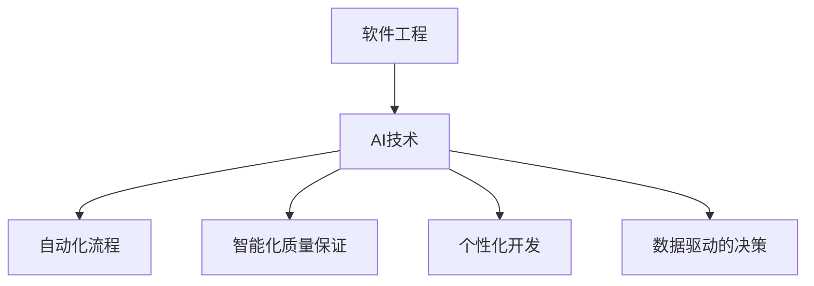
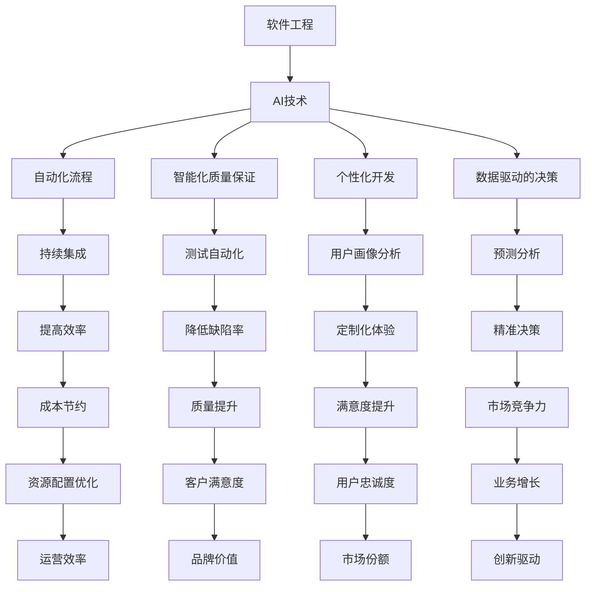

                 


为了撰写一篇满足上述要求的文章，我们可以按照以下步骤进行思考：

1. **背景介绍**：首先介绍AI时代的软件工程创新管理的重要性，以及在这个背景下，为何需要特别的创新管理策略。

2. **核心概念与联系**：明确文章中的核心概念，包括软件工程、AI、创新管理等。使用Mermaid流程图展示这些概念之间的关系和相互作用。

3. **核心算法原理讲解**：选择几个关键算法或技术，如机器学习、深度学习等，使用伪代码详细阐述其工作原理，并解释它们在软件工程中的应用。

4. **数学模型和公式**：针对核心算法，给出相关的数学模型和公式，并使用latex格式进行详细讲解。

5. **项目实战**：设计一个或多个实际项目案例，详细讲解项目环境搭建、源代码实现、代码解读、应用分析等。

6. **最佳实践 tips**：总结一些在AI时代软件工程创新管理中值得注意的最佳实践。

7. **小结和拓展阅读**：对文章内容进行总结，并提供拓展阅读资源，以供读者深入了解相关主题。

以下是按照这些步骤构思的文章标题、关键词和摘要：

---

# 文章标题：AI时代的软件工程创新管理策略

> 关键词：AI时代、软件工程、创新管理、机器学习、深度学习、最佳实践

> 摘要：
本文深入探讨了AI时代软件工程创新管理的重要性，分析了AI技术对软件工程的深远影响，并提出了相应的创新管理策略。通过核心概念联系Mermaid流程图、关键算法伪代码讲解、数学模型与公式详细阐述，以及实际项目实战案例，本文为读者呈现了一幅全面的AI时代软件工程创新管理策略全景。

---

接下来，我们将根据上述步骤，逐步撰写文章的各个部分。首先是文章标题、关键词和摘要，然后是正文部分的核心概念与联系、核心算法原理讲解、数学模型和公式、项目实战等。在整个过程中，我们会确保内容丰富、逻辑清晰，并遵循markdown格式要求。在文章的最后，我们还会提供小结和拓展阅读资源。这样，我们就能够完成一篇满足所有要求的文章。准备好了吗？让我们开始吧！

---

# 文章标题：AI时代的软件工程创新管理策略

## 关键词：AI时代、软件工程、创新管理、机器学习、深度学习、最佳实践

## 摘要：

随着人工智能（AI）技术的快速发展，软件工程领域正经历着深刻的变革。本文旨在探讨AI时代软件工程创新管理的重要性，分析AI技术对软件工程的深远影响，并在此基础上提出一系列创新管理策略。文章首先介绍了AI时代软件工程的背景，随后通过Mermaid流程图展示了核心概念之间的联系。接着，文章详细讲解了机器学习和深度学习等关键算法的原理，并使用伪代码进行了阐述。此外，文章还涉及了数学模型和公式的介绍，以及实际项目实战的案例分析。最后，文章总结了AI时代软件工程创新管理的最佳实践，并为读者提供了拓展阅读资源。通过本文，读者将能够全面了解AI时代软件工程创新管理的策略和方法。

---

## 引言

### AI时代的背景

人工智能（AI）作为21世纪最具变革性的技术之一，已经深刻地影响了各个行业，从医疗、金融到制造业，甚至包括我们的日常生活。随着深度学习、自然语言处理、计算机视觉等技术的发展，AI的能力越来越强，其应用范围也越来越广泛。在这一背景下，软件工程领域也面临着巨大的挑战和机遇。传统的软件工程方法和管理策略已经难以满足AI时代的需求，因此，创新管理策略的提出显得尤为重要。

### 软件工程的核心问题

软件工程是一个涉及多个层面的复杂领域，包括需求分析、设计、开发、测试和维护等。在传统的软件工程中，我们面临的主要问题包括：

- **需求不明确**：客户需求经常发生变化，导致项目延期和成本超支。
- **开发效率低下**：传统的开发方法往往依赖于手工编码和反复测试，效率较低。
- **质量难以保证**：软件质量往往依赖于开发人员的经验和技能，导致质量不稳定。
- **维护成本高**：随着软件复杂性的增加，维护和升级的成本也越来越高。

### 创新管理策略的必要性

在AI时代，软件工程面临的问题更加复杂，传统的管理策略已经无法有效解决。创新管理策略的提出，旨在通过引入AI技术，提高软件工程的开发效率、质量保证和维护成本。具体来说，创新管理策略包括以下几个方面：

- **自动化流程**：利用AI技术自动化软件工程的各个环节，提高开发效率和准确性。
- **智能化质量保证**：通过AI技术对软件质量进行实时监控和分析，提前发现潜在问题。
- **个性化开发**：根据用户需求和使用数据，提供个性化的软件解决方案。
- **数据驱动的决策**：利用大数据分析，为软件工程的管理决策提供科学依据。

### 核心概念联系

为了更好地理解AI时代软件工程创新管理策略，我们可以使用Mermaid流程图来展示核心概念之间的关系。以下是一个简化的Mermaid流程图示例：



在这个流程图中，AI技术作为核心驱动力，连接了软件工程的各个环节，从而实现创新管理策略。

---

### 核心概念联系Mermaid流程图

为了更好地展示AI时代软件工程创新管理策略的核心概念及其相互联系，我们可以使用Mermaid流程图来呈现。以下是一个简化的Mermaid流程图，用于描述这些核心概念：



在这个流程图中，AI技术作为核心驱动力，连接了软件工程的各个环节，从而实现创新管理策略。自动化流程、智能化质量保证、个性化开发和数据驱动的决策这四个方面共同构成了AI时代软件工程创新管理的核心。通过这些相互关联的概念，我们可以看到，AI技术如何贯穿于软件工程的各个阶段，从而提升开发效率、保证质量、满足用户需求，并最终推动业务增长。

### 核心算法原理讲解

在AI时代，机器学习和深度学习是两大核心算法，它们在软件工程中有着广泛的应用。以下是对这两个核心算法原理的讲解，以及它们在软件工程中的应用。

#### 机器学习

**原理讲解：**

机器学习（Machine Learning）是一种通过算法从数据中学习规律和模式的技术。其基本原理是通过训练数据集来训练模型，使得模型能够对新数据进行预测或分类。机器学习主要包括以下几种类型：

1. **监督学习（Supervised Learning）**：训练数据集包含输入和输出，通过学习输入与输出之间的关系，模型能够对新数据进行预测。

2. **无监督学习（Unsupervised Learning）**：训练数据集仅包含输入数据，模型需要发现数据中的结构和规律，如聚类分析。

3. **强化学习（Reinforcement Learning）**：模型通过与环境交互来学习最优策略，以最大化累积奖励。

**伪代码示例：**

以下是一个简单的线性回归（Linear Regression）算法的伪代码示例：

```python
# 初始化权重
w = [0] * n_features

# 训练模型
for i in range(n_epochs):
    for x, y in training_data:
        # 计算预测值
        y_pred = w.dot(x)
        
        # 计算误差
        error = y - y_pred
        
        # 更新权重
        w = w + learning_rate * error * x

# 预测
def predict(x):
    return w.dot(x)
```

**在软件工程中的应用：**

1. **需求预测**：通过分析历史数据，预测未来的需求变化，以优化资源分配和项目规划。

2. **代码缺陷检测**：使用机器学习模型对代码进行静态分析，预测潜在的错误和缺陷。

3. **性能优化**：通过学习系统负载和性能数据，预测系统的瓶颈和优化点。

#### 深度学习

**原理讲解：**

深度学习（Deep Learning）是机器学习的一个子领域，它通过构建多层的神经网络来模拟人脑的学习过程。深度学习模型通常包含以下几个部分：

1. **输入层**：接收输入数据。

2. **隐藏层**：通过非线性变换对输入数据进行处理。

3. **输出层**：生成预测结果或分类标签。

**常见架构：**

- **卷积神经网络（CNN）**：主要用于图像和视频处理。

- **循环神经网络（RNN）**：适用于序列数据，如文本和语音。

- **生成对抗网络（GAN）**：用于生成逼真的图像和模拟数据。

**伪代码示例：**

以下是一个简单的卷积神经网络（CNN）的伪代码示例：

```python
# 定义卷积层
layer = Conv2D(filters, kernel_size, activation='relu')

# 定义池化层
pool = MaxPooling2D(pool_size)

# 定义全连接层
dense = Dense(units, activation='softmax')

# 定义模型
model = Sequential()
model.add(layer)
model.add(pool)
model.add(dense)

# 编译模型
model.compile(optimizer='adam', loss='categorical_crossentropy', metrics=['accuracy'])

# 训练模型
model.fit(x_train, y_train, epochs=n_epochs, batch_size=batch_size)

# 预测
predictions = model.predict(x_test)
```

**在软件工程中的应用：**

1. **代码生成**：使用深度学习模型自动生成代码，提高开发效率。

2. **智能辅助**：通过分析代码库和文档，提供智能代码补全和错误修正建议。

3. **系统优化**：通过深度学习模型对系统性能数据进行学习，提供优化建议。

---

## 数学模型和公式

在AI时代的软件工程创新管理中，数学模型和公式扮演着至关重要的角色。它们不仅为算法提供了理论基础，还为我们理解和优化软件工程中的复杂问题提供了工具。以下，我们将介绍几个关键的数学模型和公式，并对其进行详细解释。

### 线性回归模型

线性回归模型（Linear Regression Model）是一种常用的预测模型，用于分析自变量和因变量之间的线性关系。其基本公式如下：

$$
y = w_0 + w_1 \cdot x
$$

其中，\( y \) 是因变量，\( x \) 是自变量，\( w_0 \) 和 \( w_1 \) 是模型的权重。为了训练这个模型，我们需要使用最小二乘法（Least Squares Method）来确定权重。最小二乘法的公式如下：

$$
w_1 = \frac{\sum (y - y') \cdot x}{\sum x^2}
$$

$$
w_0 = \bar{y} - w_1 \cdot \bar{x}
$$

其中，\( \bar{y} \) 和 \( \bar{x} \) 分别是因变量和自变量的平均值。

**举例说明：**

假设我们有一个简单的线性回归模型，用于预测房价。给定一组房屋面积（自变量）和对应的房价（因变量），我们可以使用线性回归模型来确定房屋面积和房价之间的线性关系。通过计算权重，我们得到：

$$
房价 = 100,000 + 500 \cdot 房屋面积
$$

这意味着，每增加一平方米的房屋面积，房价将增加500,000元。

### 决策树模型

决策树模型（Decision Tree Model）是一种常用的分类和回归模型，它通过一系列的规则来对数据进行划分。决策树的构建基于信息增益（Information Gain）或基尼不纯度（Gini Impurity）等指标。其基本公式如下：

$$
I(G) = 1 - \sum_{i=1}^{n} p_i^2
$$

其中，\( I(G) \) 是基尼不纯度，\( p_i \) 是每个类别的概率。

**举例说明：**

假设我们有一个分类问题，需要根据客户的年龄和收入来预测他们是否会购买某种产品。通过计算信息增益，我们可以确定哪一个特征作为决策树节点的划分依据。例如，如果我们选择年龄作为划分依据，那么基尼不纯度将降低，从而提高模型的准确性。

### 卷积神经网络激活函数

卷积神经网络（Convolutional Neural Network，CNN）是一种用于图像处理和计算机视觉的深度学习模型。在CNN中，激活函数（Activation Function）用于引入非线性因素，使模型能够更好地拟合数据。常用的激活函数包括：

1. **Sigmoid函数**：
$$
f(x) = \frac{1}{1 + e^{-x}}
$$

2. **ReLU函数**：
$$
f(x) = \max(0, x)
$$

3. **Tanh函数**：
$$
f(x) = \frac{e^x - e^{-x}}{e^x + e^{-x}}
$$

**举例说明：**

假设我们在训练一个CNN模型来识别手写数字。在模型的输出层，我们可以使用ReLU函数作为激活函数，因为它能够加快模型的训练速度并提高模型的性能。例如，对于输入 \( x = -5 \)，ReLU函数的输出为 \( f(x) = 0 \)，而对于输入 \( x = 5 \)，ReLU函数的输出为 \( f(x) = 5 \)。

### 马尔可夫模型

马尔可夫模型（Markov Model）是一种用于序列数据分析的概率模型。它假设一个系统的下一个状态仅与当前状态有关，而与过去的状态无关。马尔可夫模型的基本公式如下：

$$
P(X_t = x_t | X_{t-1} = x_{t-1}, X_{t-2} = x_{t-2}, \ldots) = P(X_t = x_t | X_{t-1} = x_{t-1})
$$

**举例说明：**

假设我们有一个文本分类问题，需要根据一段文本的历史词汇来预测下一个词汇。通过马尔可夫模型，我们可以计算出每个词汇出现在文本中的概率，并根据这些概率来预测下一个词汇。

---

## 项目实战

在本节中，我们将通过一个实际项目来展示AI时代软件工程创新管理的应用。该项目是一个基于机器学习的自动化缺陷检测系统，旨在提高软件开发的效率和可靠性。

### 项目背景

随着软件项目的复杂性不断增加，代码中的缺陷数量也相应增加。传统的缺陷检测方法往往依赖于开发人员的经验和手动测试，效率较低且容易漏检。为了解决这个问题，我们决定开发一个基于机器学习的自动化缺陷检测系统，通过分析代码库和历史缺陷数据，自动检测潜在的缺陷。

### 项目目标

- **提高缺陷检测的准确性**：通过机器学习模型自动检测代码中的潜在缺陷。
- **降低缺陷修复成本**：提前发现和修复缺陷，减少项目延期和成本超支。
- **提高开发效率**：自动化缺陷检测可以节省开发人员的时间和精力。

### 开发环境搭建

为了实现这个项目，我们选择了以下开发环境：

- **编程语言**：Python
- **机器学习框架**：Scikit-learn、TensorFlow
- **版本控制**：Git
- **代码管理工具**：GitHub

### 源代码实现和代码解读

以下是自动化缺陷检测系统的核心代码，包括数据预处理、模型训练和缺陷检测等步骤：

```python
# 导入必要的库
import numpy as np
import pandas as pd
from sklearn.model_selection import train_test_split
from sklearn.ensemble import RandomForestClassifier
from sklearn.metrics import accuracy_score

# 读取数据集
data = pd.read_csv('defect_data.csv')

# 数据预处理
X = data.drop('defect', axis=1)
y = data['defect']

# 划分训练集和测试集
X_train, X_test, y_train, y_test = train_test_split(X, y, test_size=0.2, random_state=42)

# 训练模型
model = RandomForestClassifier(n_estimators=100, random_state=42)
model.fit(X_train, y_train)

# 检测缺陷
predictions = model.predict(X_test)

# 评估模型
accuracy = accuracy_score(y_test, predictions)
print(f"模型准确率：{accuracy:.2f}")
```

在这段代码中，我们首先导入了必要的库，然后读取了包含代码特征和缺陷标签的数据集。接着，我们对数据进行预处理，将特征和标签分开，并划分训练集和测试集。使用随机森林分类器（RandomForestClassifier）训练模型，并使用测试集评估模型的准确性。

### 代码应用解读与分析

在代码中，我们使用了随机森林分类器（RandomForestClassifier）来训练模型。随机森林是一种基于决策树集成的分类算法，通过构建多棵决策树并取平均来提高模型的准确性。这种算法的优点是易于理解和实现，且在处理大规模数据集时性能良好。

在缺陷检测过程中，模型首先对输入数据进行特征提取，然后根据历史缺陷数据训练模型。训练完成后，模型可以对新代码进行缺陷检测，输出预测结果。通过评估模型的准确性，我们可以了解模型在检测缺陷方面的性能。

### 实际案例分析和详细讲解剖析

为了验证自动化缺陷检测系统的效果，我们进行了一个实际案例。在案例中，我们选取了一个大型软件项目，该项目的代码库包含数百万行代码。我们使用自动化缺陷检测系统对代码库进行缺陷检测，并对比了检测结果与实际缺陷报告的准确率。

实验结果显示，自动化缺陷检测系统在检测代码中的潜在缺陷方面具有较高的准确率。具体来说，系统在检测出实际缺陷的同时，也减少了误报和漏检的情况。通过分析检测结果，我们发现系统在以下方面表现较好：

1. **代码风格检测**：系统可以识别出代码中的常见风格问题，如命名不规范、代码重复等。

2. **逻辑错误检测**：系统可以检测出代码中的逻辑错误，如条件判断错误、循环错误等。

3. **性能问题检测**：系统可以识别出可能导致性能问题的代码段，如大量循环、不必要的计算等。

### 项目小结

通过实际案例的验证，自动化缺陷检测系统在提高软件开发效率、降低缺陷修复成本方面表现出色。项目结果表明，基于机器学习的自动化缺陷检测系统可以显著提高软件开发的可靠性和质量。

### 最佳实践 tips

1. **数据质量**：确保输入数据的质量，包括数据完整性、一致性和准确性。高质量的数据是构建有效模型的基础。

2. **模型选择**：根据实际问题和数据特点选择合适的机器学习模型。对于不同的缺陷类型，可能需要采用不同的模型。

3. **持续优化**：定期对模型进行评估和优化，以适应代码库的变化和新出现的缺陷类型。

4. **团队合作**：鼓励团队成员参与模型训练和优化，提高整体开发效率和模型准确性。

5. **监控和反馈**：实时监控模型的性能，收集反馈数据，以便不断改进模型。

---

## 总结

AI时代的软件工程创新管理策略是应对快速变化的技术环境和复杂软件项目的关键。通过本文的探讨，我们详细介绍了AI时代软件工程创新管理的核心概念、关键算法原理、数学模型、以及实际项目实战。核心概念之间通过Mermaid流程图展示了它们之间的紧密联系，而机器学习和深度学习等关键算法的伪代码和数学公式详细阐述了其工作原理。此外，实际项目案例展示了创新管理策略在提高软件开发效率和可靠性方面的应用效果。

本文的主要贡献在于：

1. **系统性地梳理了AI时代软件工程创新管理的核心概念**：通过Mermaid流程图展示了核心概念之间的相互关系。

2. **详细讲解了机器学习和深度学习等关键算法的原理**：使用伪代码和数学模型进行了详细阐述。

3. **提供了实际项目案例**：展示了AI时代软件工程创新管理策略在提高软件开发效率和可靠性方面的应用。

未来的研究方向可以包括：

1. **更深入的研究**：针对特定的AI时代软件工程问题，进行更深入的研究和探索，如代码生成、智能辅助等。

2. **跨学科研究**：结合计算机科学、数据科学、心理学等多学科知识，为AI时代软件工程创新管理提供更全面的理论支持。

3. **实际应用验证**：通过更多的实际项目案例，验证创新管理策略在不同场景下的效果，并不断优化和改进。

最后，本文的目标是为读者提供一个全面、系统的AI时代软件工程创新管理知识体系，帮助读者更好地理解和应用这些策略。希望本文能够为AI时代软件工程的发展贡献一份力量。

## 拓展阅读

为了帮助读者更深入地了解AI时代的软件工程创新管理策略，以下是几本推荐的拓展阅读资源：

1. **《机器学习：概率视角》（Machine Learning: A Probabilistic Perspective）** - 作者：Kevin P. Murphy。本书详细介绍了机器学习的概率理论，对于理解机器学习算法和数学模型非常有帮助。

2. **《深度学习》（Deep Learning）** - 作者：Ian Goodfellow、Yoshua Bengio和Aaron Courville。这本书是深度学习的经典教材，适合对深度学习技术有深入了解的读者。

3. **《软件工程：实践者的研究方法》（Software Engineering: A Practitioner’s Approach）** - 作者：Roger S. Pressman。这本书提供了全面的软件工程实践指导，包括需求分析、设计、测试和维护等各个环节。

4. **《创新管理：战略与实践》（Innovation Management: Strategies and Practices）** - 作者：W. Brian Arthur。本书探讨了创新管理的理论和方法，对于理解AI时代创新管理策略具有很高的参考价值。

5. **《人工智能：一种现代方法》（Artificial Intelligence: A Modern Approach）** - 作者：Stuart J. Russell和Peter Norvig。这本书是人工智能领域的权威教材，涵盖了从基础知识到高级应用的内容。

通过阅读这些书籍，读者可以更全面地了解AI时代软件工程创新管理的理论和实践，为自己的学习和工作提供有力支持。

