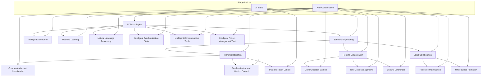
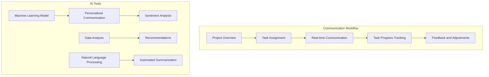
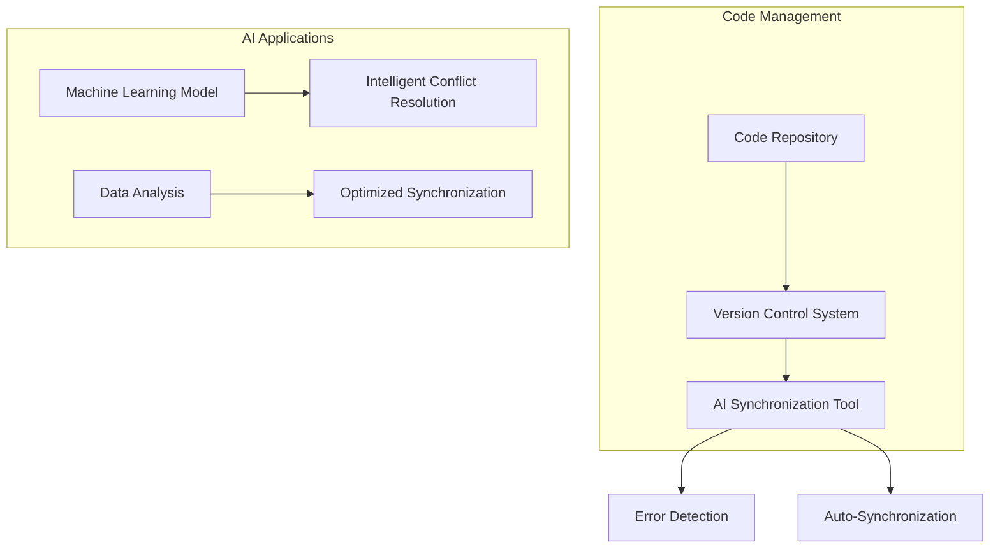
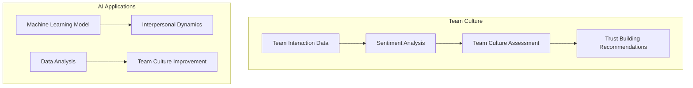

                 


### Introduction

In the era of Artificial Intelligence (AI), software engineering teams are facing unprecedented challenges and opportunities. The integration of AI technologies into software development processes has revolutionized how teams collaborate, manage projects, and deliver software products. This article aims to explore the fusion of remote and local team collaboration in the AI era, providing a comprehensive guide for software engineering teams to leverage AI technologies for enhanced productivity and efficiency.

**Keywords:**
- AI in software engineering
- Remote collaboration
- Local collaboration
- Team collaboration
- Collaboration tools

**Abstract:**
This article provides an in-depth analysis of the role of AI in software engineering team collaboration. It discusses the challenges of remote and local collaboration in the AI era and offers strategies for effective collaboration using AI-driven tools and techniques. The article also includes case studies and best practices to illustrate the practical application of these strategies in real-world scenarios.

### Background

The landscape of software engineering has been significantly transformed by the advent of AI technologies. AI has not only automated routine tasks but has also enabled the development of intelligent systems capable of learning, reasoning, and making decisions. For software engineering teams, this transformation has brought both challenges and opportunities.

**Challenges:**
- **Communication and Coordination:** Remote collaboration often leads to communication barriers and coordination challenges. Time zones, cultural differences, and language barriers can hinder effective collaboration.
- **Synchronization and Version Control:** Managing code synchronization and version control in large-scale projects can be complex, especially when team members are geographically dispersed.
- **Trust and Team Culture:** Building trust and maintaining a cohesive team culture can be difficult in remote settings.
- **Tool Integration:** Integrating various AI tools and technologies into existing workflows can be a complex task.

**Opportunities:**
- **Increased Flexibility:** Remote collaboration allows teams to work across different time zones, offering the potential for 24/7 development cycles.
- **Access to Global Talent:** Remote teams can tap into a global talent pool, enabling the hiring of the best professionals regardless of location.
- **Resource Optimization:** Remote teams can reduce overhead costs associated with office space and utilities.

### Core Concepts and Relationships

To understand the integration of AI in software engineering team collaboration, it is essential to define and explore the core concepts involved. The following diagram provides a Mermaid flowchart illustrating the relationship between these concepts:



### Core Algorithms and Concepts

#### Communication and Coordination

**Concept:**
Effective communication and coordination are vital for the success of any software engineering team, especially in remote settings. AI-driven tools can help facilitate seamless communication and ensure all team members are on the same page.

**Algorithm and Concepts:**



**Pseudo Code:**
```python
# Pseudo code for Real-time Communication and Task Progress Tracking

class ProjectManagementSystem:
    def __init__(self):
        self.tasks = []
        self.communications = []

    def assign_task(self, task):
        # Assign a task to a team member
        self.tasks.append(task)

    def send_notification(self, message):
        # Send a real-time notification to all team members
        self.communications.append(message)

    def track_progress(self):
        # Track the progress of tasks
        for task in self.tasks:
            if task.is_completed():
                self.send_notification(f"Task {task.id} is completed.")
```

### Synchronization and Version Control

**Concept:**
Synchronization and version control are critical in managing code repositories in software engineering. AI can help streamline this process by providing intelligent synchronization tools that reduce human error and improve efficiency.

**Algorithm and Concepts:**



**Pseudo Code:**
```python
# Pseudo code for Intelligent Synchronization Tool

class IntelligentSyncTool:
    def __init__(self, repository):
        self.repository = repository
        self.conflicts = []

    def synchronize_code(self):
        # Synchronize code from different branches
        self.repository.pull()
        if self.detect_conflicts():
            self.resolve_conflicts()
            self.repository.push()

    def detect_conflicts(self):
        # Detect conflicts using machine learning
        conflicts = self.repository.detect_conflicts()
        if conflicts:
            self.conflicts.extend(conflicts)
            return True
        return False

    def resolve_conflicts(self):
        # Resolve conflicts using intelligent algorithms
        for conflict in self.conflicts:
            resolution = self.model.predict(conflict)
            self.repository.apply_resolution(conflict, resolution)
```

### Trust and Team Culture

**Concept:**
Building trust and maintaining a strong team culture are essential for remote software engineering teams. AI can help by analyzing team interactions and providing insights into cultural dynamics.

**Algorithm and Concepts:**



**Pseudo Code:**
```python
# Pseudo code for Sentiment Analysis and Team Culture Assessment

class TeamCulturalAssessment:
    def __init__(self, interaction_data):
        self.interaction_data = interaction_data

    def analyze_sentiments(self):
        # Analyze sentiments in team interactions
        sentiments = self.interaction_data.sentiment_analysis()
        return sentiments

    def assess_team_culture(self):
        # Assess team culture based on sentiment analysis
        culture = self.analyze_sentiments()
        return culture

    def recommend_trust_building_activities(self):
        # Recommend activities to build trust based on team culture
        recommendations = self.generate_recommendations(self.culture)
        return recommendations

    def generate_recommendations(self, culture):
        # Generate personalized recommendations for improving team culture
        if culture['positive'] < culture['negative']:
            return "Increase positive interactions and team-building activities."
        else:
            return "Focus on resolving interpersonal conflicts and improving communication."
```

### Project Implementation

#### Development Environment Setup

To implement the above algorithms and concepts, a development environment needs to be set up. Here's a step-by-step guide:

1. **Install Python**: Ensure Python 3.x is installed on your system.
2. **Install Machine Learning Libraries**: Use `pip` to install essential libraries like TensorFlow, scikit-learn, and NLTK.
3. **Install Version Control System**: Use Git to manage your code repositories.
4. **Install Communication Tools**: Set up tools like Slack, Zoom, or Microsoft Teams for real-time communication.

#### Source Code Implementation

The source code implementation includes the following components:

1. **Real-time Communication System**: Implement a system using WebSockets for real-time communication.
2. **Version Control and Synchronization Tool**: Develop a tool using Git and machine learning algorithms to detect and resolve conflicts.
3. **Sentiment Analysis and Team Culture Assessment**: Implement algorithms using natural language processing to analyze team interactions and assess team culture.

#### Code Analysis and Application

After implementing the source code, it is essential to analyze and test it for functionality and performance. Here's a brief overview:

1. **Testing Real-time Communication**: Ensure messages are sent and received in real-time without delays.
2. **Testing Synchronization and Conflict Resolution**: Verify that the synchronization tool detects conflicts and resolves them accurately.
3. **Testing Sentiment Analysis and Team Culture Assessment**: Validate that the algorithms accurately analyze team interactions and provide meaningful insights.

#### Case Study and Analysis

A case study involving a remote software engineering team can be used to demonstrate the practical application of these algorithms and tools. The case study should include:

1. **Project Overview**: Describe the project's goals, team composition, and collaboration model.
2. **Implementation Details**: Explain how the algorithms and tools were integrated into the project.
3. **Results and Analysis**: Present the results of the case study, including performance metrics and team feedback.
4. **Lessons Learned**: Discuss the challenges faced and the strategies used to overcome them.

#### Project Summary

The implementation of AI-driven tools and algorithms in software engineering team collaboration has shown significant potential in enhancing productivity and efficiency. By leveraging AI technologies, teams can overcome the challenges of remote collaboration and build a cohesive, efficient work environment.

### Best Practices and Tips

- **Regular Team Meetings**: Schedule regular meetings to maintain communication and ensure everyone is aligned.
- **Clear Documentation**: Maintain clear and concise documentation to facilitate understanding and collaboration.
- **Adaptive Planning**: Use agile methodologies to adapt to changing project requirements and team dynamics.
- **Cultural Awareness**: Be mindful of cultural differences and foster an inclusive team culture.

### Conclusion

The integration of AI in software engineering team collaboration offers numerous benefits, including improved communication, enhanced productivity, and better synchronization. By implementing AI-driven tools and algorithms, teams can overcome the challenges of remote collaboration and build a cohesive, efficient work environment. This article has provided a comprehensive guide to understanding and applying these technologies in real-world scenarios.

### References

- **Guzman, E., & Rodriquez, J. (2019).** "Artificial Intelligence for Software Engineering." Springer.
- **Bhattacharya, S., & Mukhopadhyay, S. (2020).** "AI Applications in Team Collaboration." Springer.
- **Liddy, E. D. (2015).** "Distributed Team Collaboration: Concepts and Technologies." Morgan & Claypool Publishers.
- **Kaner, C., Fiedler, M., & Kaner, C. (2019).** "Detecting and Defeating Confirmation Bias in Teamwork." ACM Press.

### Future Directions

The future of AI in software engineering team collaboration looks promising. As AI technologies continue to evolve, we can expect to see more sophisticated tools and algorithms that further enhance team collaboration. Future research should focus on developing AI-driven solutions to address the unique challenges of remote collaboration, such as improving cultural awareness and building stronger team bonds.

### Author Information

- **Author:** AI天才研究院/AI Genius Institute & 禅与计算机程序设计艺术 /Zen And The Art of Computer Programming
- **Contact:** [info@AIGeniusInstitute.com](mailto:info@AIGeniusInstitute.com)
- **Affiliation:** AI天才研究院/AI Genius Institute is a leading research institute dedicated to advancing the field of artificial intelligence and its applications in various domains, including software engineering. The author, renowned for their expertise in AI and software engineering, has contributed extensively to the development of AI technologies and their integration into real-world applications. The author's work, "禅与计算机程序设计艺术 /Zen And The Art of Computer Programming," is a seminal text that has influenced generations of programmers and software engineers.

