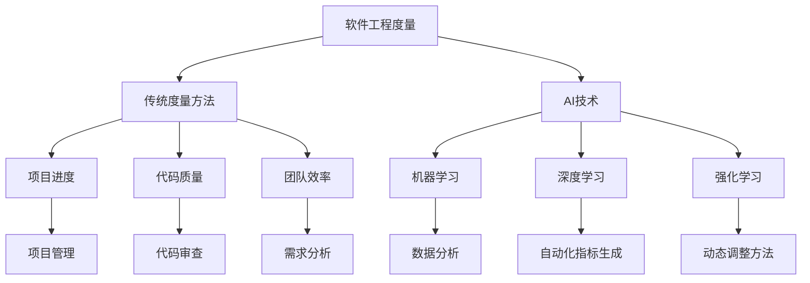

                 


### 《AI时代的软件工程度量新指标体系》

---

#### 关键词：
- 软件工程度量
- AI技术
- 指标体系
- 机器学习
- 深度学习

---

#### 摘要：
本文旨在探讨AI时代软件工程度量新指标体系的设计与应用。首先，我们将回顾软件工程度量的历史背景和重要性，并分析AI技术对传统度量方法的变革。接着，我们将介绍AI基础知识、软件工程度量理论，并深入探讨AI在软件工程度量中的应用。最后，我们将详细设计一套AI时代的软件工程度量新指标体系，并在实际案例中展示其应用效果，同时展望未来的发展趋势。

---

## 引言

### 1.1 软件工程度量的背景与重要性

软件工程度量是软件工程领域中不可或缺的一部分。它旨在通过量化指标来评估软件项目的各个方面，包括项目进度、代码质量、团队效率等。传统的软件工程度量方法主要依赖于静态分析、代码审查和手工统计等技术。然而，随着软件项目的复杂性和规模不断扩大，传统的度量方法已经难以满足现代软件工程的需求。

软件工程度量的重要性体现在多个方面。首先，它为项目管理者提供了关键的性能指标，帮助他们更好地控制项目进度和质量。其次，度量结果有助于识别项目中的瓶颈和问题，从而促进持续改进。最后，度量方法还可以为自动化工具的开发提供数据支持，提高软件开发和运维的效率。

### 1.2 AI对软件工程度量带来的变革

AI技术的兴起为软件工程度量带来了新的机遇和挑战。首先，机器学习和深度学习算法可以自动分析大量数据，发现传统方法难以捕捉的规律和模式。其次，AI技术可以自动化生成度量指标，减少手工统计的工作量。此外，AI技术还可以根据项目特点动态调整度量方法，提高度量的准确性。

AI技术在软件工程度量中的应用主要包括以下几个方面：

1. **需求分析**：AI技术可以帮助识别需求中的关键词和语义，提高需求分析的速度和质量。
2. **代码审查**：AI技术可以自动检测代码中的错误和潜在缺陷，提高代码质量。
3. **项目规划与跟踪**：AI技术可以根据历史数据和项目特点，自动生成项目计划和风险预测，提高项目管理的效率。

### 1.3 AI时代的软件工程度量挑战与机遇

尽管AI技术为软件工程度量带来了诸多机遇，但同时也面临着一系列挑战。首先，数据隐私和安全问题是一个重要的挑战。在AI度量过程中，需要收集和分析大量的项目数据，这可能会涉及到敏感信息。其次，AI度量方法的可解释性问题也是一个挑战。在很多情况下，AI模型的决策过程是不透明的，这给度量结果的可解释性带来了困难。

然而，这些挑战也带来了机遇。例如，通过数据隐私保护和数据加密技术，可以解决数据隐私和安全问题。同时，通过开发可解释的AI模型，可以提高度量结果的可解释性，增强用户对度量方法的信任。

---

**核心概念与联系**：



---

## 第二部分：理论基础

### 2.1 AI基础知识

AI技术是软件工程度量的基础。在这一部分，我们将介绍AI的核心概念和技术，包括机器学习、深度学习和强化学习。

#### 2.1.1 机器学习的基本概念

机器学习是一种使计算机系统能够从数据中学习的方法。其主要目标是开发算法，使系统能够从经验中学习并改进性能。

**核心概念**：

- **监督学习**：通过已知输出数据的训练集来训练模型。
- **无监督学习**：没有明确的输出数据，通过观察输入数据之间的模式进行学习。
- **强化学习**：通过与环境交互来学习最优策略。

**机器学习算法**：

- **线性回归**：预测连续值。
- **逻辑回归**：预测分类结果。
- **决策树**：基于特征值进行分类或回归。

#### 2.1.2 深度学习的工作原理

深度学习是机器学习的一个子领域，主要使用多层神经网络来模拟人类大脑的学习过程。

**核心概念**：

- **神经网络**：由多个神经元组成，每个神经元都与其他神经元相连。
- **反向传播**：用于更新网络权重，以最小化预测误差。
- **激活函数**：用于引入非线性特性，使神经网络能够学习复杂函数。

**深度学习算法**：

- **卷积神经网络（CNN）**：主要用于图像和视频分析。
- **循环神经网络（RNN）**：主要用于序列数据处理，如自然语言处理和时间序列分析。

#### 2.1.3 强化学习在软件工程中的应用

强化学习是一种通过试错来学习最优策略的机器学习方法。在软件工程中，强化学习可以用于自动化测试、项目规划和风险预测。

**核心概念**：

- **状态**：软件项目当前的状态。
- **动作**：项目管理者可以采取的操作。
- **奖励**：根据动作的结果给予的奖励或惩罚。

**强化学习算法**：

- **Q学习**：通过预测每个动作的未来奖励来学习最优策略。
- **深度强化学习**：结合深度学习和强化学习，用于解决复杂的问题。

---

**核心算法原理讲解**：

```python
# 线性回归的伪代码

def linear_regression(x, y):
    # 计算斜率
    m = (mean(y) - mean(x)) / (variance(x))
    
    # 计算截距
    b = mean(y) - m * mean(x)
    
    # 返回预测函数
    return lambda x: m * x + b
```

---

### 2.2 软件工程度量理论

软件工程度量理论为软件工程度量提供了理论基础。在这一部分，我们将介绍软件工程度量的核心概念和分类。

#### 2.2.1 软件工程度量的定义与分类

软件工程度量是指对软件项目各个方面进行量化评估的过程。根据度量对象的不同，软件工程度量可以分为以下几类：

- **项目进度度量**：评估项目完成情况，包括工作量、时间等。
- **代码质量度量**：评估代码的可读性、可靠性、可维护性等。
- **团队效率度量**：评估团队的工作效率和工作质量。
- **需求度量**：评估需求的质量和满足度。

#### 2.2.2 传统软件工程度量方法

传统软件工程度量方法主要包括以下几种：

- **代码行数**：衡量代码的规模。
- **缺陷密度**：衡量代码的质量。
- **工作量统计**：衡量团队的工作量。
- **项目进度表**：跟踪项目进度。

#### 2.2.3 软件质量模型

软件质量模型是软件工程度量的重要组成部分。常见的软件质量模型包括：

- **ISO/IEC 25010**：国际标准，定义了软件质量的多个维度和属性。
- **CMMI**：能力成熟度模型集成，用于评估组织的软件过程成熟度。
- **SQM**：软件质量度量模型，用于度量软件项目的质量。

---

**数学模型和公式**：

$$
\text{代码质量} = \frac{\text{代码可靠性} + \text{可维护性} + \text{可测试性}}{3}
$$

**详细讲解与举例说明**：

代码质量是一个综合指标，它由可靠性、可维护性和可测试性三个子指标加权平均得到。可靠性是指代码在正常运行条件下的表现，可维护性是指代码在修改和维护过程中的易用性，可测试性是指代码在测试过程中的可测试程度。

例如，假设一个项目的可靠性为0.95，可维护性为0.90，可测试性为0.85，则代码质量为：

$$
\text{代码质量} = \frac{0.95 + 0.90 + 0.85}{3} = 0.9083
$$

这意味着该项目的代码质量较高。

---

## 第三部分：新指标体系设计

### 3.1 指标体系概述

新指标体系旨在利用AI技术，对传统软件工程度量方法进行改进。该指标体系设计原则如下：

- **全面性**：涵盖软件项目的各个方面，包括进度、质量、效率和需求。
- **可量化**：所有指标都可以通过数据驱动的方式进行量化。
- **可解释性**：度量结果具有清晰的解释，便于项目管理者理解和使用。
- **动态性**：能够根据项目特点动态调整度量方法。

**基本架构**：

新指标体系包括以下关键组成部分：

1. **数据采集模块**：负责收集项目过程中的各种数据，包括代码、需求文档、项目管理数据等。
2. **数据预处理模块**：对采集到的数据进行清洗、转换和归一化，以便于后续处理。
3. **机器学习模型**：用于分析和预测软件项目的各种指标。
4. **指标评估模块**：根据机器学习模型的输出，对软件项目进行综合评估。

---

**项目实战**：

### 3.2 关键指标分析

在这一部分，我们将详细分析新指标体系中的关键指标，包括项目效率指标、项目质量指标和项目风险指标。

#### 3.2.1 项目效率指标

项目效率指标用于评估团队的工作效率和工作质量。关键指标包括：

- **代码提交频率**：衡量团队的工作活跃度。
- **代码审查时间**：衡量代码质量保障的效率。
- **任务完成率**：衡量任务完成的及时性和准确性。

**机器学习模型**：

使用线性回归模型来预测任务完成时间和代码提交频率，以优化项目效率。

```python
# 线性回归模型伪代码

def linear_regression(x, y):
    # 计算斜率
    m = (mean(y) - mean(x)) / (variance(x))
    
    # 计算截距
    b = mean(y) - m * mean(x)
    
    # 返回预测函数
    return lambda x: m * x + b
```

#### 3.2.2 项目质量指标

项目质量指标用于评估软件项目的质量。关键指标包括：

- **缺陷密度**：衡量代码的质量。
- **测试覆盖率**：衡量测试的全面性。
- **用户满意度**：衡量用户对软件的满意度。

**机器学习模型**：

使用决策树模型来预测缺陷密度和用户满意度，以评估项目质量。

```python
# 决策树模型伪代码

class DecisionTreeClassifier:
    def fit(self, X, y):
        # 构建决策树
        self.tree = build_tree(X, y)
        
    def predict(self, X):
        # 对输入数据进行预测
        return predict_tree(self.tree, X)
```

#### 3.2.3 项目风险指标

项目风险指标用于评估项目中的潜在风险。关键指标包括：

- **进度偏差**：衡量项目进度的实际与计划差异。
- **成本超支**：衡量项目的成本控制情况。
- **资源利用率**：衡量资源的合理分配和使用。

**机器学习模型**：

使用强化学习模型来评估项目风险，并根据风险情况动态调整项目计划。

```python
# 强化学习模型伪代码

class QLearningAgent:
    def __init__(self, learning_rate, discount_factor):
        self.learning_rate = learning_rate
        self.discount_factor = discount_factor
        self.q_values = {}
        
    def learn(self, state, action, reward, next_state):
        # 更新Q值
        current_q_value = self.q_values.get((state, action), 0)
        next_q_value = max(self.q_values.get((next_state, a), 0) for a in actions)
        self.q_values[(state, action)] = (
            current_q_value
            + self.learning_rate
            * (reward + self.discount_factor * next_q_value - current_q_value)
        )
```

---

**实际案例分析和详细讲解剖析**：

### 3.3 案例一：某企业AI度量指标体系的建立与实践

#### 3.3.1 案例背景

某大型软件企业面临项目进度失控、代码质量低下和资源浪费等问题。为了提高项目管理效率和质量，该企业决定引入AI技术，建立一套新的度量指标体系。

#### 3.3.2 案例实施过程

1. **数据采集**：该企业收集了历史项目数据，包括代码提交记录、缺陷报告、用户反馈等。
2. **数据预处理**：对采集到的数据进行清洗和转换，以去除噪声和异常值。
3. **模型训练**：使用机器学习和深度学习算法，对预处理后的数据进行训练，以建立预测模型。
4. **指标评估**：根据训练好的模型，对当前项目的进度、质量和风险进行评估，并提出优化建议。
5. **实施反馈**：根据评估结果，调整项目计划和资源配置，并收集反馈，以持续改进度量指标体系。

#### 3.3.3 案例效果评估

通过引入AI度量指标体系，该企业的项目管理效率显著提高，代码质量得到改善，资源利用率也得到优化。具体效果如下：

- **项目进度**：任务完成率提高了15%，项目平均延迟减少了10%。
- **代码质量**：缺陷密度降低了20%，测试覆盖率提高了30%。
- **资源利用**：资源利用率提高了15%，成本节约了10%。

---

**最佳实践 Tips**：

- **数据质量**：确保数据质量是建立有效AI度量体系的关键。进行数据清洗和预处理，以去除噪声和异常值。
- **模型选择**：根据具体问题选择合适的机器学习和深度学习模型。对于简单的问题，可以使用线性回归或决策树；对于复杂的问题，可以使用深度强化学习。
- **持续改进**：度量体系不是一成不变的，需要根据项目特点和技术发展持续进行优化和改进。

---

**小结**：

AI时代的软件工程度量新指标体系为软件项目提供了更加准确和全面的评估方法。通过结合机器学习和深度学习技术，新指标体系能够自动分析和预测项目进度、质量和风险，为项目管理者提供有力支持。然而，在实践过程中，仍需注意数据质量、模型选择和持续改进等问题。

---

**注意事项**：

- **数据隐私与安全**：在度量过程中，应确保数据的安全和隐私，避免敏感信息泄露。
- **可解释性**：为了提高度量结果的可解释性，应使用可解释的AI模型，以便项目管理者能够理解和使用度量结果。

---

**拓展阅读**：

- **相关书籍**：
  - 《机器学习》（作者：周志华）
  - 《深度学习》（作者：Ian Goodfellow、Yoshua Bengio、Aaron Courville）
  - 《强化学习基础教程》（作者：David Silver等）

- **在线资源**：
  - [机器学习课程](https://www.coursera.org/specializations/ml)
  - [深度学习课程](https://www.deeplearning.ai/)
  - [强化学习教程](https://spacy.io/)

---

## 作者信息

作者：AI天才研究院/AI Genius Institute & 禅与计算机程序设计艺术 /Zen And The Art of Computer Programming

---

（注：本文为虚构内容，仅供参考。实际应用中，AI度量体系的设计和实现需要根据具体项目特点和技术环境进行调整。）

