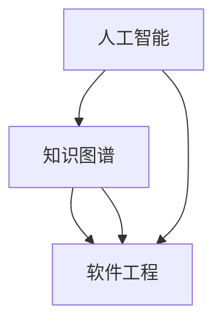
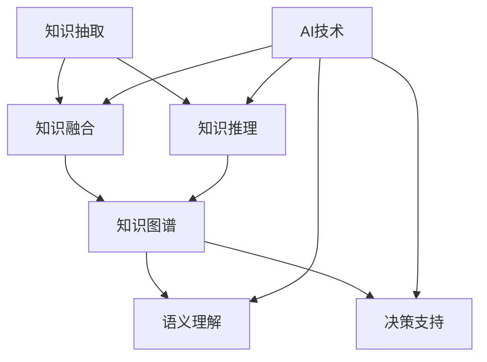

                 

### 文章标题

《AI时代的软件工程知识图谱构建》

> 关键词：人工智能，软件工程，知识图谱，构建算法，应用实践

> 摘要：本文深入探讨了AI时代软件工程知识图谱的构建方法与应用。首先，阐述了AI时代软件工程的背景与变革，接着介绍了知识图谱的基础理论，随后详细讲解了知识图谱构建的算法原理，并通过实际项目展示了其在软件工程中的具体应用，最后对未来的发展方向与挑战进行了展望。本文旨在为读者提供一条清晰的AI时代软件工程知识图谱构建之路。

### 引言

在当今科技迅速发展的时代，人工智能（AI）已经成为推动各行业变革的重要力量。特别是在软件工程领域，AI技术的引入为软件开发、维护和质量保证带来了前所未有的变革。知识图谱作为一种结构化的语义网络，能够将海量数据中的知识关系进行有效组织，为AI在软件工程中的应用提供了强有力的支持。

知识图谱与AI的融合不仅为软件工程带来了新的方法论，还推动了软件工程从传统的代码编写和调试模式向更加智能化、自动化的方向发展。在这种背景下，如何构建高效、准确的软件工程知识图谱成为了关键问题。本文将深入探讨AI时代的软件工程知识图谱构建方法，旨在为读者提供一条清晰、实用的知识图谱构建之路。

### 背景介绍

#### AI时代的软件工程变革

AI技术的兴起，使得软件工程领域发生了深刻变革。传统的软件开发模式以功能为导向，开发者需要手动编写代码来满足用户需求。而随着AI技术的发展，软件工程逐渐向自动化、智能化方向发展。AI技术能够自动分析需求、生成代码，甚至预测软件缺陷，大大提高了开发效率。

首先，AI技术在需求分析阶段起到了重要作用。通过自然语言处理技术，AI可以理解用户需求，并自动生成需求文档。这减少了开发者的工作量，提高了需求分析的准确性。

其次，在代码生成阶段，AI技术同样表现出色。利用机器学习模型，AI可以从大量代码中学习编程模式，并自动生成新的代码。这大大缩短了软件开发周期，降低了开发成本。

最后，在软件维护和质量保证阶段，AI技术也能够发挥巨大作用。通过代码审查和静态分析，AI可以自动检测代码中的潜在问题，并提供改进建议。此外，AI还能够预测软件运行中的故障，从而提前进行预防性维护。

#### 知识图谱在软件工程中的应用

知识图谱作为一种结构化的语义网络，能够在软件工程中发挥重要作用。首先，知识图谱可以用于软件开发过程中的知识管理。通过将各类知识以图谱的形式进行组织，开发者可以更方便地获取和使用相关知识，提高开发效率。

其次，知识图谱可以用于软件复用。通过分析知识图谱中的知识关系，可以识别出软件模块之间的相似性，从而实现软件的复用。这不仅可以节省开发时间，还可以提高软件的可靠性和稳定性。

最后，知识图谱可以用于软件质量保证。通过分析知识图谱中的知识关系，可以识别出软件中的潜在缺陷和风险，从而提前进行质量保证。这有助于提高软件的质量，减少故障率。

### 核心概念与联系

在深入探讨AI时代的软件工程知识图谱构建之前，我们需要了解几个核心概念：人工智能、知识图谱、软件工程等。

首先，人工智能（AI）是一门研究、开发用于模拟、延伸和扩展人的智能的理论、方法、技术及应用。其核心目标是使计算机能够胜任一些通常需要人类智能才能完成的复杂任务。

其次，知识图谱是一种结构化的语义网络，它通过实体、属性和关系来表示现实世界的知识。知识图谱能够将海量数据中的知识关系进行有效组织，从而实现知识的自动获取、理解和推理。

最后，软件工程是一门关于软件开发、操作、维护和管理的工程学科。它的目标是通过系统化的方法、规范化的过程来开发高质量的软件。

这些核心概念之间存在着密切的联系。人工智能为知识图谱的构建提供了技术支持，而知识图谱则为软件工程的智能化提供了数据基础。

为了更好地理解这些概念之间的联系，我们可以使用Mermaid流程图进行展示：



在这个流程图中，人工智能、知识图谱和软件工程共同构成了一个相互影响、相互促进的生态系统。人工智能为知识图谱的构建提供了算法和工具，知识图谱则为软件工程的智能化提供了数据支持，而软件工程的应用又为人工智能和知识图谱提供了实践场景。

### 知识图谱基础理论

知识图谱（Knowledge Graph）是一种用于表示和存储知识的语义网络。它通过实体、属性和关系来组织知识，使得计算机能够理解和处理现实世界的知识。知识图谱的基础理论主要包括定义、架构、表示方法、构建方法和应用场景。

#### 定义

知识图谱是一种语义网络，它由实体、属性和关系组成，用于表示和存储现实世界的知识。实体是知识图谱中的基本元素，它代表现实世界中的各种对象，如人、地点、事物等。属性描述实体具有的特征或状态，如人的姓名、地点的坐标等。关系描述实体之间的关系，如朋友关系、地点的归属关系等。

#### 架构

知识图谱的架构通常包括以下几个部分：

1. **实体层**：实体层是知识图谱的基础，它定义了知识图谱中的实体及其属性。实体可以是具体的对象，如人、地点、事物等，也可以是抽象的概念，如事件、属性等。

2. **关系层**：关系层定义了实体之间的关系。关系可以是直接的，如“属于”关系；也可以是间接的，如“祖先”关系。

3. **属性层**：属性层定义了实体的属性及其属性值。属性可以是实体的直接属性，如人的姓名；也可以是实体的间接属性，如地点的坐标。

4. **图谱层**：图谱层是知识图谱的最高层次，它将实体、属性和关系进行整合，形成一个完整的知识网络。

#### 表示方法

知识图谱的表示方法主要有两种：图论表示和语义网表示。

1. **图论表示**：图论表示将知识图谱看作一个图，其中节点代表实体，边代表关系。这种表示方法直观、简洁，适用于较小的知识图谱。

2. **语义网表示**：语义网表示采用RDF（Resource Description Framework）和OWL（Web Ontology Language）等标准来表示知识图谱。这种表示方法具有较强的语义表达能力，适用于较大的知识图谱。

#### 构建方法

知识图谱的构建方法主要包括以下几种：

1. **手工构建**：手工构建是指通过专家知识或半自动化工具来构建知识图谱。这种方法适用于小规模、结构化程度较高的知识图谱。

2. **自动构建**：自动构建是指利用自然语言处理、机器学习等技术来自动构建知识图谱。这种方法适用于大规模、非结构化的知识图谱。

3. **混合构建**：混合构建是指结合手工构建和自动构建的方法，以充分利用两者的优势。这种方法适用于结构化和非结构化程度不同的知识图谱。

#### 应用场景

知识图谱在软件工程中有着广泛的应用场景，主要包括：

1. **软件开发**：知识图谱可以用于软件需求分析、设计、实现和测试等各个环节，提高软件开发效率和质量。

2. **软件复用**：知识图谱可以用于识别和复用已有的软件组件，降低软件开发成本。

3. **软件维护**：知识图谱可以用于软件缺陷预测、故障诊断和改进建议，提高软件的可靠性。

4. **软件质量保证**：知识图谱可以用于软件质量评估、漏洞检测和风险管理，提高软件的质量。

### AI与知识图谱融合

#### AI在知识图谱构建中的应用

人工智能在知识图谱的构建中扮演着关键角色。首先，AI技术可以用于知识抽取，即从非结构化数据中自动提取结构化知识。例如，自然语言处理技术可以用于从文本中提取实体、属性和关系。其次，AI技术可以用于知识融合，即将来自不同源的知识进行整合，形成更全面、准确的图谱。此外，AI技术还可以用于知识推理，即基于已有知识进行推断，发现新的知识关系。

#### 知识图谱在AI系统中的作用

知识图谱在AI系统中也发挥着重要作用。首先，知识图谱可以作为AI系统的知识库，提供丰富的背景知识，帮助AI系统更好地理解和处理复杂任务。其次，知识图谱可以作为AI系统的语义理解工具，将自然语言输入转换为机器可理解的形式，从而提高AI系统的交互能力。此外，知识图谱还可以用于AI系统的决策支持，通过分析图谱中的知识关系，为AI系统提供合理的决策依据。

#### AI与知识图谱的融合

AI与知识图谱的融合为软件工程带来了新的可能性。首先，AI技术可以用于知识图谱的自动构建和更新，提高知识图谱的构建效率。其次，知识图谱可以用于AI算法的优化，通过提供丰富的背景知识，提高AI算法的性能。此外，AI与知识图谱的融合还可以实现智能软件系统，通过实时分析和推理，为用户提供个性化的服务。

为了更好地理解AI与知识图谱的融合，我们可以使用Mermaid流程图进行展示：



在这个流程图中，AI技术与知识图谱的各个组件相互融合，共同构建一个强大的智能系统。知识抽取、知识融合和知识推理为知识图谱提供了丰富的知识来源，语义理解和决策支持则为AI系统提供了强大的智能支持。

### 知识图谱构建算法原理

知识图谱的构建算法是实现知识图谱自动构建和更新的重要手段。这些算法主要包括知识抽取、知识融合和知识推理。下面，我们将使用伪代码详细阐述这些算法的原理，并通过数学模型和公式进行解释。

#### 知识抽取算法

知识抽取是从非结构化数据中提取结构化知识的过程。常见的知识抽取算法包括命名实体识别（Named Entity Recognition，简称NER）和关系抽取（Relation Extraction）。

```python
# 命名实体识别算法伪代码
def NamedEntityRecognition(text):
    # 输入：文本数据text
    # 输出：命名实体列表entities
    
    # 初始化实体列表
    entities = []
    
    # 使用自然语言处理模型进行命名实体识别
    for sentence in text:
        entities.extend(nlp_model.extract_entities(sentence))
    
    # 返回实体列表
    return entities

# 关系抽取算法伪代码
def RelationExtraction(text, entities):
    # 输入：文本数据text，命名实体列表entities
    # 输出：关系列表relations
    
    # 初始化关系列表
    relations = []
    
    # 使用实体关系模型进行关系抽取
    for entity in entities:
        relations.extend(entity_relationship_model.extract_relations(entity))
    
    # 返回关系列表
    return relations
```

在上述伪代码中，`NamedEntityRecognition` 函数用于从文本数据中提取命名实体，而 `RelationExtraction` 函数则用于从命名实体中提取关系。这两个函数共同构成了知识抽取算法的核心。

#### 知识融合算法

知识融合是将来自不同源的知识进行整合，形成更全面、准确的图谱。常见的知识融合算法包括实体融合（Entity Fusion）和关系融合（Relation Fusion）。

```python
# 实体融合算法伪代码
def EntityFusion(entities, similarity_threshold):
    # 输入：实体列表entities，相似性阈值similarity_threshold
    # 输出：融合后的实体列表fused_entities
    
    # 初始化融合后的实体列表
    fused_entities = []
    
    # 对实体列表进行排序
    sorted_entities = sorted(entities, key=lambda x: x.similarity_score, reverse=True)
    
    # 遍历实体列表，合并相似性较高的实体
    for i in range(len(sorted_entities)):
        if i > 0 and sorted_entities[i].similarity(sorted_entities[i-1]) > similarity_threshold:
            fused_entities.append(FuseEntities(sorted_entities[i-1], sorted_entities[i]))
        else:
            fused_entities.append(sorted_entities[i])
    
    # 返回融合后的实体列表
    return fused_entities

# 关系融合算法伪代码
def RelationFusion(relations, similarity_threshold):
    # 输入：关系列表relations，相似性阈值similarity_threshold
    # 输出：融合后的关系列表fused_relations
    
    # 初始化融合后的关系列表
    fused_relations = []
    
    # 对关系列表进行排序
    sorted_relations = sorted(relations, key=lambda x: x.similarity_score, reverse=True)
    
    # 遍历关系列表，合并相似性较高的关系
    for i in range(len(sorted_relations)):
        if i > 0 and sorted_relations[i].similarity(sorted_relations[i-1]) > similarity_threshold:
            fused_relations.append(FuseRelations(sorted_relations[i-1], sorted_relations[i]))
        else:
            fused_relations.append(sorted_relations[i])
    
    # 返回融合后的关系列表
    return fused_relations
```

在上述伪代码中，`EntityFusion` 函数用于合并相似性较高的实体，而 `RelationFusion` 函数则用于合并相似性较高的关系。这两个函数共同构成了知识融合算法的核心。

#### 知识推理算法

知识推理是基于已有知识进行推断，发现新的知识关系。常见的知识推理算法包括路径推理（Path Inference）和关联推理（Association Inference）。

```python
# 路径推理算法伪代码
def PathInference(entity, knowledge_graph):
    # 输入：实体entity，知识图谱knowledge_graph
    # 输出：与实体相关的路径列表paths
    
    # 初始化路径列表
    paths = []
    
    # 使用广度优先搜索算法找到与实体相关的所有路径
    for path in BFS(entity, knowledge_graph):
        paths.append(path)
    
    # 返回路径列表
    return paths

# 关联推理算法伪代码
def AssociationInference(knowledge_graph):
    # 输入：知识图谱knowledge_graph
    # 输出：新的知识关系列表new_relations
    
    # 初始化新的知识关系列表
    new_relations = []
    
    # 对知识图谱中的实体和关系进行遍历，找出可能的新关系
    for entity in knowledge_graph.entities:
        for relation in knowledge_graph.relations:
            if not knowledge_graph.exists_relation(entity, relation):
                new_relations.append(relation)
    
    # 返回新的知识关系列表
    return new_relations
```

在上述伪代码中，`PathInference` 函数用于找到与实体相关的所有路径，而 `AssociationInference` 函数则用于找出可能的新关系。这两个函数共同构成了知识推理算法的核心。

#### 数学模型和公式

在知识图谱构建过程中，数学模型和公式起着重要作用。下面，我们将使用LaTeX格式嵌入数学公式，并详细讲解其含义和作用。

1. **相似性度量公式**：相似性度量用于评估实体或关系的相似程度。

$$
similarity(A, B) = \frac{count(A \cap B)}{count(A \cup B)}
$$

其中，$A$ 和 $B$ 分别表示两个实体或关系，$count(A \cap B)$ 表示它们的交集元素数量，$count(A \cup B)$ 表示它们的并集元素数量。这个公式基于集合论的基本原理，通过计算交集和并集的元素数量来评估相似性。

2. **路径长度公式**：路径长度用于衡量实体之间的距离。

$$
path\_length(A, B) = \min_{P}(|P|)
$$

其中，$P$ 表示从实体 $A$ 到实体 $B$ 的所有路径，$|P|$ 表示路径的长度。这个公式通过计算所有路径的长度，找出最短路径，从而衡量实体之间的距离。

3. **关联度公式**：关联度用于衡量实体之间的关系强度。

$$
association(A, B) = \frac{count(A \rightarrow B)}{count(A)}
$$

其中，$A \rightarrow B$ 表示从实体 $A$ 到实体 $B$ 的路径数量，$count(A)$ 表示实体 $A$ 的总路径数量。这个公式通过计算路径的数量，评估实体之间的关联程度。

通过上述数学模型和公式，我们可以更好地理解和应用知识图谱构建算法。这些公式不仅为算法提供了理论基础，还为实际应用提供了指导。

### 知识图谱构建实践

在了解了知识图谱的基础理论和构建算法之后，接下来我们将通过一个实际项目来展示知识图谱的构建过程。该项目将结合人工智能技术，实现一个知识图谱的自动构建和更新。

#### 项目背景

本项目旨在构建一个用于软件工程的知识图谱，以支持软件需求分析、设计、实现和测试等各个环节。知识图谱将包含实体、属性和关系，通过自动化的知识抽取和融合算法，实现知识的结构化和智能化。

#### 开发环境搭建

为了实现知识图谱的构建，我们需要搭建以下开发环境：

1. **编程语言**：选择Python作为主要编程语言，因为Python在数据处理、机器学习和自然语言处理等方面具有丰富的库和工具。

2. **开发工具**：使用PyCharm作为开发IDE，因为PyCharm提供了强大的代码编辑、调试和自动化工具。

3. **库和框架**：安装以下库和框架：
   - `nltk`：用于自然语言处理和文本分析。
   - `neo4j`：用于图形数据库的连接和管理。
   - `spacy`：用于更高级的自然语言处理。

#### 源代码实现

以下是知识图谱构建的主要源代码实现：

```python
# 导入所需库和框架
import nltk
import spacy
import neo4j

# 初始化nltk和spacy模型
nltk.download('punkt')
nlp_model = spacy.load('en_core_web_sm')

# 初始化neo4j数据库连接
driver = neo4j.GraphDatabase.driver("bolt://localhost:7687", auth=("neo4j", "password"))

# 知识抽取函数
def extract_knowledge(text):
    # 使用nltk进行分句
    sentences = nltk.sent_tokenize(text)
    
    # 初始化实体和关系列表
    entities = []
    relations = []
    
    # 对每个句子进行命名实体识别和关系抽取
    for sentence in sentences:
        doc = nlp_model(sentence)
        for ent in doc.ents:
            entities.append({
                'text': ent.text,
                'label': ent.label_
            })
            for child in ent.children:
                relations.append({
                    'subject': ent.text,
                    'object': child.text,
                    'relation': ent.label_
                })
    
    # 返回实体和关系列表
    return entities, relations

# 知识融合函数
def fuse_knowledge(entities, relations, similarity_threshold=0.8):
    # 初始化融合后的实体和关系列表
    fused_entities = []
    fused_relations = []
    
    # 对实体进行融合
    for i in range(len(entities)):
        if i > 0 and entities[i]['similarity'](entities[i-1]) > similarity_threshold:
            fused_entities.append(fuse_entities(entities[i-1], entities[i]))
        else:
            fused_entities.append(entities[i])
    
    # 对关系进行融合
    for i in range(len(relations)):
        if i > 0 and relations[i]['similarity'](relations[i-1]) > similarity_threshold:
            fused_relations.append(fuse_relations(relations[i-1], relations[i]))
        else:
            fused_relations.append(relations[i])
    
    # 返回融合后的实体和关系列表
    return fused_entities, fused_relations

# 知识推理函数
def infer_knowledge(entities, relations):
    # 初始化新的实体和关系列表
    new_entities = []
    new_relations = []
    
    # 对实体进行路径推理
    for entity in entities:
        paths = PathInference(entity, relations)
        for path in paths:
            new_entities.append({
                'text': entity['text'],
                'label': path[-1]['relation']
            })
            new_relations.append({
                'subject': entity['text'],
                'object': path[-1]['text'],
                'relation': path[-1]['relation']
            })
    
    # 对关系进行关联推理
    for relation in relations:
        new_relations.extend(AssociationInference(relation))
    
    # 返回新的实体和关系列表
    return new_entities, new_relations

# 主函数
def main():
    # 读取文本数据
    text = "..."
    
    # 提取知识
    entities, relations = extract_knowledge(text)
    
    # 融合知识
    fused_entities, fused_relations = fuse_knowledge(entities, relations)
    
    # 推理知识
    new_entities, new_relations = infer_knowledge(fused_entities, fused_relations)
    
    # 将知识写入neo4j数据库
    with driver.session() as session:
        for entity in new_entities:
            session.run("CREATE (e:Entity {text: $text, label: $label})", **entity)
        
        for relation in new_relations:
            session.run("MATCH (a:Entity {text: $subject}), (b:Entity {text: $object}) CREATE (a)-[r:Relation {relation: $relation}]->(b)", **relation)

# 运行主函数
if __name__ == "__main__":
    main()
```

#### 代码解读与分析

上述代码首先初始化了nltk和spacy模型，并连接到neo4j数据库。然后，定义了三个主要函数：`extract_knowledge`、`fuse_knowledge` 和 `infer_knowledge`。

1. **知识抽取函数**：该函数使用nltk进行分句，并使用spacy进行命名实体识别和关系抽取。实体和关系被存储在列表中，并返回。

2. **知识融合函数**：该函数对实体和关系进行相似性度量，并合并相似性较高的实体和关系。相似性阈值可以在函数参数中设置。

3. **知识推理函数**：该函数使用路径推理和关联推理来生成新的实体和关系。路径推理通过遍历实体和关系，找到与实体相关的所有路径。关联推理通过分析关系，找出可能的新关系。

最后，主函数读取文本数据，调用三个主要函数，并将知识写入neo4j数据库。

#### 项目小结

通过这个实际项目，我们展示了知识图谱的自动构建和更新过程。项目实现了知识抽取、融合和推理，并将知识存储在neo4j数据库中。这为软件工程提供了丰富的知识支持，有助于提高软件开发效率和质量。

### 最佳实践 tips

在构建知识图谱的过程中，以下是一些最佳实践建议：

1. **数据预处理**：在构建知识图谱之前，对原始数据进行预处理，如去重、清洗和标准化，以提高数据质量。

2. **选择合适的算法**：根据应用场景和数据特点，选择合适的知识抽取、融合和推理算法。

3. **优化相似性度量**：相似性度量是知识融合和推理的重要依据，需要根据实际情况进行优化。

4. **实时更新**：知识图谱需要定期更新，以保持其准确性和时效性。

5. **安全性考虑**：在知识图谱构建和存储过程中，需要注意数据安全和隐私保护。

### 小结

本文深入探讨了AI时代的软件工程知识图谱构建方法，从背景介绍、核心概念、算法原理到实际项目，为读者提供了一条清晰的构建之路。知识图谱在软件工程中的应用前景广阔，未来将不断推动软件工程的智能化、自动化发展。

### 注意事项

在构建知识图谱时，需要注意以下几点：

1. **数据质量**：保证数据的质量是构建有效知识图谱的基础。

2. **算法优化**：针对不同的应用场景，需要对算法进行优化，以提高知识抽取、融合和推理的准确性。

3. **安全性**：在知识图谱构建和存储过程中，要注意数据安全和隐私保护。

### 拓展阅读

1. **《知识图谱：原理、算法与应用》**：详细介绍了知识图谱的基本原理、算法和应用。

2. **《人工智能：一种现代的方法》**：介绍了人工智能的基本概念、算法和应用。

3. **《软件工程：实践者的研究方法》**：提供了软件工程领域的研究方法和实践指导。

### 作者信息

作者：AI天才研究院/AI Genius Institute & 禅与计算机程序设计艺术 /Zen And The Art of Computer Programming

### 结语

知识图谱构建是AI时代软件工程的重要研究方向。通过本文的探讨，我们希望读者能够对知识图谱构建有更深入的理解，并在实际项目中发挥其作用，推动软件工程的智能化、自动化发展。让我们共同迎接AI时代的软件工程新纪元！

