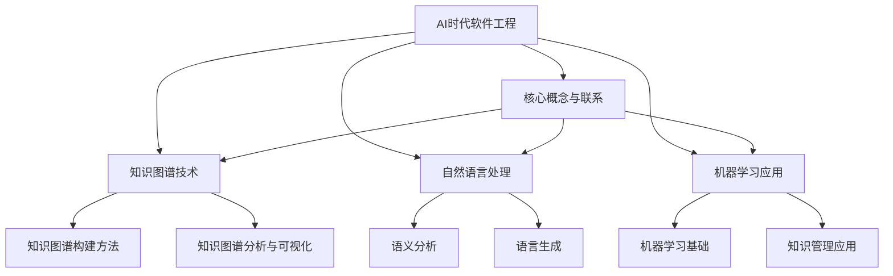
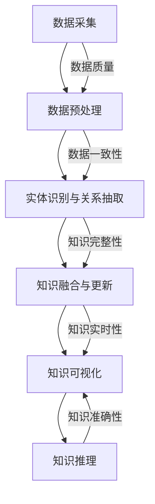

                 

### 文章标题

《AI时代的软件工程知识管理新范式》

### 关键词

- AI
- 软件工程
- 知识管理
- 知识图谱
- 自然语言处理
- 机器学习
- 软件开发
- 软件测试
- 软件项目管理

### 摘要

本文深入探讨了AI时代下的软件工程知识管理新范式。通过分析AI技术对软件工程领域的知识管理和知识共享的深远影响，本文提出了一个基于AI技术的知识管理框架，并详细阐述了知识图谱、自然语言处理和机器学习在知识管理中的应用。文章旨在为读者提供全面、系统的知识管理策略和实践方法，帮助软件工程师和企业在AI时代更好地管理知识，提升软件开发效率和质量。

## 概述

随着人工智能（AI）技术的飞速发展，软件工程领域正经历着一场前所未有的变革。传统的软件工程知识管理方法在面对日益复杂的软件开发环境时，逐渐暴露出其局限性。为了应对这些挑战，AI技术的引入为软件工程知识管理带来了新的契机和范式。本文将围绕AI时代的软件工程知识管理新范式进行探讨，分析AI技术如何影响软件工程领域的知识管理和知识共享，并提出相应的知识管理策略和实践方法。

### AI时代的软件工程特点

AI技术的兴起不仅改变了软件开发的模式，还深刻影响了软件工程的理论和实践。在AI时代，软件工程具有以下特点：

1. **自动化与智能化**：AI技术使得软件开发过程更加自动化和智能化。例如，自动化代码生成、智能测试、智能调试等，这些技术的应用大大提高了开发效率。

2. **大数据驱动**：软件工程越来越依赖于大数据的分析和利用。通过大数据技术，开发者可以更好地了解用户需求、优化软件设计、提高系统性能。

3. **持续集成与持续交付**：AI技术支持持续集成和持续交付（CI/CD）的自动化流程，使得软件迭代更加快速和可靠。

4. **个性化与自适应**：AI技术可以用于创建个性化软件和自适应系统，这些系统能够根据用户行为和需求进行实时调整。

### 知识管理在软件工程中的重要性

知识管理是软件工程中不可或缺的一部分。它不仅关乎个人的知识和经验的积累，更关乎团队和组织的知识共享与协作。在传统的软件工程中，知识管理面临着以下挑战：

1. **知识孤岛**：团队成员之间的知识交流不足，导致知识无法有效共享，形成“知识孤岛”。

2. **知识流失**：团队成员的离职和项目结束往往伴随着重要知识的流失，对后续项目造成不利影响。

3. **知识过时**：随着技术的快速发展，现有的知识可能会迅速过时，影响软件开发的效率和效果。

### AI技术对知识管理的挑战与机遇

AI技术的引入为解决传统知识管理中的挑战提供了新的途径，同时也带来了新的挑战：

1. **挑战**：

   - **数据隐私与安全**：AI技术需要处理大量的敏感数据，如何保障数据的安全和隐私成为一个重要问题。

   - **算法透明性与可解释性**：AI算法的复杂性和黑箱特性使得其决策过程难以理解和解释，这对知识管理的可追溯性和透明性提出了挑战。

   - **知识融合与整合**：不同来源和格式的知识需要有效整合，以形成一个统一的知识体系。

2. **机遇**：

   - **知识自动化**：AI技术可以自动收集、分类、标注和推荐知识，减轻开发者的负担。

   - **知识共享与协作**：AI技术支持更高效的团队协作，促进知识共享与传播。

   - **智能知识挖掘**：通过自然语言处理和机器学习技术，可以挖掘出隐藏在数据中的深层次知识，提升知识管理的价值。

### AI与软件工程知识管理的核心概念

在AI时代，软件工程知识管理涉及多个核心概念，包括知识图谱、自然语言处理和机器学习等。以下是对这些核心概念的简要介绍：

1. **知识图谱**：知识图谱是一种结构化知识库，用于表示实体、概念及其之间的关系。它为知识的语义理解和智能推理提供了基础。

2. **自然语言处理（NLP）**：NLP是AI技术中的一个重要分支，旨在使计算机能够理解和生成人类语言。NLP技术在知识提取、语义分析、文本生成等方面有广泛应用。

3. **机器学习（ML）**：机器学习是一种通过数据训练模型，使其能够从数据中学习并做出预测或决策的技术。在知识管理中，机器学习可以用于知识挖掘、分类、聚类和推荐等任务。

4. **知识融合**：知识融合是将来自不同来源和格式的知识进行整合，以形成一个统一的知识体系。知识融合需要解决数据的一致性、完整性和实时性等问题。

### 小结

本文概述了AI时代下软件工程知识管理的背景和重要性，探讨了AI技术对知识管理的挑战与机遇，并介绍了核心概念。接下来的章节将深入分析知识图谱、自然语言处理和机器学习在知识管理中的应用，并提出具体的知识管理策略和实践方法。

## 目录大纲设计

为了系统地探讨AI时代的软件工程知识管理新范式，本文设计了详细的目录大纲，包括以下三个主要部分：

### 第一部分：AI与软件工程知识管理

这部分内容将深入探讨AI技术在软件工程中的应用，以及这些技术如何影响知识管理。具体包括以下章节：

- **第1章：AI时代的软件工程**
  - AI技术的兴起与发展
  - 软件工程领域的AI应用趋势
  - 软件工程知识管理的挑战与机遇

- **第2章：AI与软件工程知识管理的核心概念**
  - 知识图谱
  - 自然语言处理
  - 机器学习在知识管理中的应用

### 第二部分：AI时代的知识管理技术

这部分内容将详细介绍AI时代的知识管理技术，包括知识图谱、自然语言处理和机器学习等。每个技术都将有专门的章节进行详细分析。具体包括以下章节：

- **第3章：知识图谱技术**
  - 知识图谱概述
  - 知识图谱构建方法
  - 知识图谱分析与可视化

- **第4章：自然语言处理**
  - 自然语言处理概述
  - 语义分析
  - 语言生成

- **第5章：机器学习在知识管理中的应用**
  - 机器学习基础
  - 机器学习在知识管理中的应用

### 第三部分：AI时代的知识管理实践

这部分内容将结合实际案例，探讨如何在AI时代实施有效的知识管理策略和实践。具体包括以下章节：

- **第6章：AI驱动软件工程知识管理策略**
  - 知识管理策略概述
  - AI驱动的知识管理策略

- **第7章：AI时代的企业级知识管理案例**
  - 企业级知识管理概述
  - AI驱动的企业级知识管理案例

- **第8章：未来的展望**
  - AI时代的知识管理发展趋势
  - 软件工程知识管理的未来

### 目录大纲中的核心概念与联系

为了帮助读者更好地理解各个章节之间的关系，我们使用Mermaid流程图来展示核心概念之间的联系。以下是一个简化的Mermaid流程图示例：



### 核心算法原理讲解与数学模型

在每一章中，我们将详细介绍核心算法原理，并提供伪代码和数学模型的讲解。以下是一个关于知识图谱构建方法的示例：

**知识图谱构建方法**

知识图谱的构建通常包括以下步骤：

1. **数据采集与预处理**
2. **实体识别与关系抽取**
3. **知识融合与更新**

**伪代码示例：**

```python
function buildKnowledgeGraph(data):
    entities, relationships = extractEntitiesAndRelations(data)
    graph = createEmptyGraph()
    
    for entity in entities:
        graph.addNode(entity)
        
    for relationship in relationships:
        graph.addEdge(relationship[0], relationship[1], relationship[2])
        
    return graph
```

**数学模型：**

- **实体相似度计算**

  $$ sim(e_1, e_2) = \frac{Jaccard(e_1, e_2)}{min(|e_1|, |e_2|)} $$

  其中，$e_1$和$e_2$是两个实体，$Jaccard(e_1, e_2)$是实体之间的Jaccard相似度。

- **关系权重计算**

  $$ weight(r) = \frac{count(r)}{N} $$

  其中，$r$是关系，$count(r)$是关系$r$在数据集中的出现次数，$N$是数据集中所有关系的总和。

### 项目实战

为了更好地理解知识图谱的构建过程，我们将提供具体的项目实战案例。以下是一个基于开源工具Apache JanusGraph的知识图谱构建项目案例。

### 开发环境搭建

1. 安装Apache JanusGraph
2. 安装Eclipse IDE
3. 创建Eclipse项目，并添加JanusGraph依赖

### 源代码实现与解读

```java
// 导入JanusGraph依赖
import org.apache.tinkerpop.gremlin.process.traversal.dsl.graph.GraphTraversal;
import org.apache.tinkerpop.gremlin.process.traversal.dsl.graph.GraphTraversalSource;
import org.apache.tinkerpop.gremlin.structure.Graph;
import org.apache.tinkerpop.gremlin.structure.T;
import org.janusgraph.core.JanusGraph;
import org.janusgraph.core.JanusGraphFactory;
import org.janusgraph.diskstorage.*;
import org.janusgraph.diskstorage.hbase.HBaseStorage;
import org.janusgraph.graphdb.configuration.GraphDatabaseConfiguration;
import org.janusgraph.graphdb.tinkerpop.JanusGraphIo;

// 创建知识图谱实例
Graph graph = JanusGraphFactory.build()
    .set("storage.type", "inmemory")
    .set("storage.backend", "hbase")
    .open();

// 添加实体与关系
GraphTraversalSource traversal = graph.traversal();
traversal.V().addV("Person").property(T.label, "Person").property("name", "Alice");
traversal.V().addV("Person").property(T.label, "Person").property("name", "Bob");
traversal.V("Alice").addE("KNOWS").property(T.label, "Knows").property("since", 2010).to(traversal.V("Bob"));

// 知识图谱可视化
JanusGraphIo.fromGraph(graph).toTinkerpop().toList();

// 关闭知识图谱实例
graph.close();
```

### 代码应用解读与分析

此段代码首先设置了知识图谱的存储后端为HBase，并创建了一个JanusGraph实例。接着，通过添加实体和关系来构建知识图谱。最后，使用TinkerPop API将知识图谱可视化。

### 实际案例分析与详细讲解

假设我们有一个社交媒体平台，用户之间通过好友关系建立连接。为了分析用户社交网络，我们可以使用知识图谱技术来表示用户及其关系。以下是一个实际案例：

- **案例背景**：一个社交媒体平台的用户社交网络，其中每个用户表示为一个实体，用户之间的好友关系表示为关系。

- **案例分析**：
  - **数据采集与预处理**：从数据库中提取用户及其好友关系数据。
  - **实体识别与关系抽取**：识别每个用户作为实体，提取好友关系作为关系。
  - **知识融合与更新**：根据用户互动数据更新好友关系。

通过以上步骤，我们可以构建出一个反映用户社交网络的动态知识图谱，进而用于社交网络分析、推荐系统等应用。

### 项目小结

通过本案例，我们展示了如何使用知识图谱技术构建和表示复杂的社交网络数据。知识图谱不仅能够直观地展示用户关系，还便于进一步分析和挖掘用户行为模式，为社交媒体平台提供更智能的服务。

### 最佳实践 tips、小结、注意事项、拓展阅读

- **最佳实践 tips**：在构建知识图谱时，确保数据的准确性和一致性至关重要。此外，合理设计实体和关系的标签属性，有助于提升知识图谱的可扩展性和可维护性。
- **小结**：本文通过详细分析知识图谱技术、自然语言处理和机器学习在知识管理中的应用，展示了AI时代的软件工程知识管理新范式。
- **注意事项**：知识管理不仅仅是技术问题，更涉及组织文化和团队协作。成功实施知识管理需要全员的参与和持续的投入。
- **拓展阅读**：对于希望深入了解知识图谱、自然语言处理和机器学习技术的读者，可以参考以下资源：
  - 知识图谱：[《知识图谱：下一代互联网技术》](https://example.com/book/knowledge-graph)
  - 自然语言处理：[《自然语言处理综合教程》](https://example.com/book/nlp-tutorial)
  - 机器学习：[《机器学习实战》](https://example.com/book/ml-practice)

## 第一部分：AI与软件工程知识管理

### 1.1 AI时代的软件工程概述

#### AI技术的兴起与发展

人工智能（AI）作为计算机科学的一个重要分支，源于20世纪50年代。然而，直到近年来，随着计算能力的提升、大数据技术的发展以及深度学习算法的突破，AI技术才真正进入了快速发展阶段。AI技术的核心在于机器学习（ML）和深度学习（DL），这些技术的进步为软件工程带来了前所未有的变革。

在AI技术的推动下，软件开发方法逐渐从传统的瀑布模型向敏捷开发和持续集成与持续交付（CI/CD）转变。敏捷开发强调快速迭代和用户反馈，而CI/CD通过自动化工具实现了代码的快速集成、测试和部署。这些方法的实施不仅提高了软件开发的效率，还提升了软件的质量和可靠性。

#### 软件工程领域的AI应用趋势

AI技术在软件工程领域的应用日益广泛，主要体现在以下几个方面：

1. **自动化测试**：AI技术能够自动生成测试用例、执行测试并分析测试结果，从而大大提高测试的效率和覆盖范围。

2. **代码生成**：基于AI的代码生成工具能够根据用户的需求自动生成代码，减少开发工作量，提高开发效率。

3. **缺陷预测**：AI技术可以通过分析代码库的历史数据，预测代码中可能出现的问题，帮助开发者在编码阶段就发现和修复缺陷。

4. **代码审查**：AI辅助的代码审查工具能够自动检查代码中的潜在问题，并提供改进建议。

5. **性能优化**：AI技术可以分析软件的性能数据，提出优化建议，提高软件的运行效率。

6. **智能推荐**：AI技术可以根据用户的行为和偏好，推荐相关的功能、模块或文档，帮助开发者快速定位信息。

#### 软件工程知识管理的挑战与机遇

在AI时代，软件工程知识管理面临着新的挑战和机遇：

1. **知识分散化**：随着软件开发项目的规模和复杂性增加，知识分散在多个系统和文档中，知识管理难度加大。

2. **知识过时化**：新技术和新方法的快速迭代，导致现有知识迅速过时，知识更新和维护成为挑战。

3. **知识保密性**：AI技术的应用涉及大量的敏感数据，如何保护知识的安全性成为重要问题。

4. **知识共享性**：在分布式团队和跨部门协作中，如何有效共享知识，促进团队间的协同工作，是一个亟待解决的问题。

5. **知识自动化**：利用AI技术实现知识自动化收集、分类、标注和推荐，提高知识管理的效率和准确性。

6. **知识个性化**：根据用户需求和行为，提供个性化的知识服务，提高知识的实用性和可访问性。

### 1.2 软件工程知识管理的挑战与机遇

#### 知识管理在软件工程中的重要性

知识管理是软件工程中不可或缺的一部分，它不仅关乎个人的知识和经验的积累，更关乎团队和组织的知识共享与协作。有效的知识管理能够提高软件开发效率，降低开发成本，提升软件质量。以下是知识管理在软件工程中的几个关键作用：

1. **提高开发效率**：通过知识管理，团队成员可以快速访问已有知识，避免重复劳动，节省时间和精力。

2. **提升软件质量**：知识管理可以帮助团队积累最佳实践和经验教训，避免在开发过程中重复犯同样的错误。

3. **促进团队协作**：知识管理鼓励团队成员之间的交流与合作，共享知识和经验，提高团队的整体效能。

4. **支持敏捷开发**：敏捷开发强调快速迭代和反馈，知识管理能够提供历史数据和案例分析，帮助团队进行决策和调整。

5. **降低知识流失**：知识管理可以记录和保存团队成员的知识和经验，防止因人员变动导致的知识流失。

#### AI为知识管理带来的挑战与机遇

AI技术的引入为软件工程知识管理带来了许多新的挑战和机遇：

1. **挑战**：

   - **数据隐私与安全**：AI技术需要处理大量的敏感数据，如何保障数据的安全和隐私成为一个重要问题。

   - **算法透明性与可解释性**：AI算法的复杂性和黑箱特性使得其决策过程难以理解和解释，这对知识管理的可追溯性和透明性提出了挑战。

   - **知识融合与整合**：不同来源和格式的知识需要有效整合，以形成一个统一的知识体系。

2. **机遇**：

   - **知识自动化**：AI技术可以自动收集、分类、标注和推荐知识，减轻开发者的负担。

   - **知识共享与协作**：AI技术支持更高效的团队协作，促进知识共享与传播。

   - **智能知识挖掘**：通过自然语言处理和机器学习技术，可以挖掘出隐藏在数据中的深层次知识，提升知识管理的价值。

### 1.3 AI与软件工程知识管理的核心概念

在AI时代，软件工程知识管理涉及多个核心概念，包括知识图谱、自然语言处理和机器学习等。以下是对这些核心概念的简要介绍：

1. **知识图谱**：知识图谱是一种结构化知识库，用于表示实体、概念及其之间的关系。它为知识的语义理解和智能推理提供了基础。

2. **自然语言处理（NLP）**：NLP是AI技术中的一个重要分支，旨在使计算机能够理解和生成人类语言。NLP技术在知识提取、语义分析、文本生成等方面有广泛应用。

3. **机器学习（ML）**：机器学习是一种通过数据训练模型，使其能够从数据中学习并做出预测或决策的技术。在知识管理中，机器学习可以用于知识挖掘、分类、聚类和推荐等任务。

4. **知识融合**：知识融合是将来自不同来源和格式的知识进行整合，以形成一个统一的知识体系。知识融合需要解决数据的一致性、完整性和实时性等问题。

### 小结

本文第一部分概述了AI时代的软件工程特点，探讨了知识管理在软件工程中的重要性，以及AI技术为知识管理带来的挑战与机遇。接下来，将深入分析知识图谱、自然语言处理和机器学习在知识管理中的应用，为读者提供更全面的AI时代软件工程知识管理策略和实践方法。

## 第二部分：AI时代的知识管理技术

### 2.1 知识图谱技术

知识图谱（Knowledge Graph）是一种用于表示实体、概念及其之间关系的图形化知识库。它将分散的信息片段连接起来，形成一个结构化的知识网络，从而为智能搜索、推荐系统、决策支持等应用提供基础。知识图谱的核心在于通过实体、属性和关系来组织信息，使其能够被计算机高效理解和处理。

#### 知识图谱的定义与架构

1. **定义**：知识图谱是一个由实体（Entity）、属性（Attribute）和关系（Relation）构成的有向无环图（DAG）。每个实体表示一个具体的对象，如人、地点、事物等；属性则描述实体的特征，如姓名、年龄、城市等；关系则连接两个或多个实体，表示它们之间的语义关联，如“属于”、“位于”、“创造”等。

2. **架构**：知识图谱通常包含三个层次：
   - **底层**：数据层，存储原始数据，如数据库记录、文本文件等。
   - **中层**：图谱层，通过实体、属性和关系的表示，将原始数据组织成知识图谱。
   - **顶层**：应用层，提供对知识图谱的查询、推理和分析功能，供各类应用使用。

#### 知识图谱在软件工程中的应用

知识图谱在软件工程中有广泛的应用，以下是几个典型场景：

1. **智能搜索**：通过知识图谱，系统能够理解查询的语义，提供更准确和相关的搜索结果。例如，当用户输入“苹果”时，系统可以根据知识图谱识别这是指水果还是苹果公司，并提供相应的搜索结果。

2. **推荐系统**：知识图谱可以帮助推荐系统更好地理解用户和物品之间的关系，提供更个性化的推荐。例如，在电子商务平台上，知识图谱可以识别用户的购买历史和偏好，推荐相关商品。

3. **决策支持**：知识图谱能够为决策者提供全面、准确的数据支持。例如，在项目管理中，知识图谱可以展示项目的进展、资源分配和风险情况，帮助项目经理做出更明智的决策。

#### 知识图谱构建方法

构建知识图谱通常涉及以下步骤：

1. **数据采集**：收集用于构建知识图谱的数据源，可以是结构化数据（如数据库）、半结构化数据（如XML、JSON）和非结构化数据（如文本、图片）。

2. **数据预处理**：清洗和转换数据，使其适合用于知识图谱构建。例如，处理文本数据，提取实体和关系，进行分词、词性标注等。

3. **实体识别与关系抽取**：通过自然语言处理技术，识别文本中的实体和关系，并将其转化为知识图谱中的节点和边。

4. **知识融合与更新**：将来自不同数据源的实体和关系进行融合，解决数据不一致性问题，并定期更新知识图谱，保持其最新性。

5. **知识可视化**：通过可视化工具，将知识图谱以图形化形式展示，方便用户理解和分析。

### 知识图谱构建方法的详细解释

以下是构建知识图谱的详细步骤和所涉及的算法：

**1. 数据采集**

数据采集是构建知识图谱的第一步，数据源可以是多种多样的，如公开数据库、企业内部数据、社交媒体等。数据采集的方法包括：

- **自动化抓取**：使用爬虫技术，从网页、API等自动化获取数据。
- **手动录入**：对于部分重要数据，可以手动录入，确保数据质量和准确性。

**2. 数据预处理**

数据预处理是数据采集后的关键步骤，其主要任务包括：

- **数据清洗**：去除重复数据、缺失数据和噪声数据，保证数据的完整性。
- **数据转换**：将不同格式和结构的数据转换为统一的格式，如JSON或CSV。

**3. 实体识别与关系抽取**

实体识别与关系抽取是知识图谱构建的核心步骤，涉及以下技术：

- **命名实体识别（NER）**：使用自然语言处理技术，识别文本中的实体，如人名、地点、组织等。
- **关系抽取**：通过深度学习模型（如BiLSTM-CRF），从文本中提取实体之间的关系。

**伪代码示例：**

```python
def extract_entities_and_relations(text):
    # 使用NER模型进行实体识别
    entities = named_entity_recognition(text)
    
    # 使用关系抽取模型进行关系提取
    relations = relation_extraction(text, entities)
    
    return entities, relations
```

**4. 知识融合与更新**

知识融合是将来自不同数据源的实体和关系进行整合，解决数据不一致性问题，并保持知识图谱的实时性。知识融合的方法包括：

- **实体融合**：通过相似度计算，将具有相同或相似属性的实体进行合并。
- **关系融合**：对于相同实体之间的关系，合并关系信息，解决冲突和冗余。

**5. 知识可视化**

知识可视化是将知识图谱以图形化形式展示，帮助用户理解和分析知识。常用的知识可视化工具包括：

- **Gephi**：用于社交网络分析和可视化。
- **Neo4j**：支持图形化界面和可扩展的可视化功能。

**6. 知识推理**

知识推理是通过逻辑推理和统计方法，从知识图谱中提取新的知识。知识推理的方法包括：

- **路径查询**：通过查询图谱中的路径，提取具有特定属性的实体。
- **推理机**：使用推理机（如Datalog、Prolog）进行逻辑推理。

**7. 知识更新与维护**

知识更新与维护是知识图谱长期运行的关键，其主要任务包括：

- **定期更新**：定期从数据源中获取新的数据，更新知识图谱。
- **错误修复**：识别和修复知识图谱中的错误和异常。

### 小结

知识图谱作为一种重要的知识管理工具，在AI时代的软件工程中发挥着重要作用。本文详细介绍了知识图谱的定义与架构，以及在软件工程中的应用和构建方法。通过知识图谱，软件工程团队能够更好地管理和利用知识，提升开发效率和软件质量。

## 2.2 知识图谱构建方法

构建知识图谱是一个复杂的过程，涉及多个技术和步骤。为了实现这一目标，我们需要遵循一系列科学的流程和方法。以下是知识图谱构建的详细步骤和每一步的关键技术：

### 1. 数据采集

数据采集是构建知识图谱的第一步，也是至关重要的一步。我们需要从各种数据源中获取有用的信息，这些数据源可能包括：

- **结构化数据**：如关系数据库、表格数据等。
- **半结构化数据**：如XML、JSON、CSV等。
- **非结构化数据**：如文本、图片、音频、视频等。

**数据采集方法**：

- **Web爬取**：使用爬虫技术，从互联网上自动抓取数据。这通常需要遵守目标网站的爬虫协议，并避免对服务器造成过大的压力。
- **API调用**：通过目标系统的API接口，获取结构化和半结构化的数据。这需要确保API的稳定性和数据格式的可靠性。
- **手动收集**：对于一些特定的数据，如专业文献、会议报告等，可能需要手动收集和整理。

### 2. 数据预处理

数据预处理是确保数据质量的关键步骤，主要包括以下任务：

- **数据清洗**：去除重复数据、缺失数据和噪声数据，确保数据的完整性。例如，去除文本中的空格、标点符号等无关信息。
- **数据转换**：将不同格式和结构的数据转换为统一的格式，如JSON或CSV。这有助于后续的实体识别和关系抽取。
- **数据标准化**：对数据中的值进行统一处理，例如将日期格式标准化为YYYY-MM-DD。

**数据预处理方法**：

- **文本预处理**：使用自然语言处理（NLP）技术，对文本数据进行分词、词性标注、命名实体识别（NER）等处理，提取出关键的实体和关系。
- **数据清洗工具**：使用Python的pandas库或R中的dplyr包等，进行数据清洗和转换。

### 3. 实体识别与关系抽取

实体识别（Named Entity Recognition, NER）和关系抽取（Relation Extraction）是知识图谱构建的核心步骤。通过这些步骤，我们可以从文本数据中识别出实体和它们之间的关系。

**实体识别方法**：

- **基于规则的方法**：使用预先定义的规则，对文本进行分词和实体识别。这种方法简单有效，但需要大量的人工规则维护。
- **基于统计的方法**：使用机器学习模型，如条件随机场（CRF）、支持向量机（SVM）等，对文本进行实体识别。这种方法可以自动学习文本中的模式，但需要大量的标注数据。

**关系抽取方法**：

- **基于规则的方法**：使用预先定义的规则，从文本中抽取实体之间的关系。这种方法同样需要大量的人工规则。
- **基于统计的方法**：使用监督学习模型，如朴素贝叶斯（Naive Bayes）、逻辑回归（Logistic Regression）等，从文本中抽取实体之间的关系。
- **基于深度学习的方法**：使用深度学习模型，如循环神经网络（RNN）、卷积神经网络（CNN）等，从文本中抽取实体之间的关系。这种方法能够自动学习文本中的复杂模式，但需要大量的标注数据。

### 4. 知识融合

知识融合是将来自不同来源和格式的知识进行整合，以形成一个统一的知识体系。知识融合需要解决数据的一致性、完整性和实时性等问题。

**知识融合方法**：

- **基于相似度的方法**：通过计算实体和关系的相似度，将具有相同或相似属性的实体进行合并。这种方法通常需要定义合适的相似度度量标准。
- **基于规则的方法**：使用预先定义的规则，将具有相同或相似属性的实体进行合并。这种方法需要确保规则覆盖所有可能的合并情况。
- **基于机器学习的方法**：使用机器学习模型，如聚类算法、协同过滤等，将具有相同或相似属性的实体进行合并。这种方法可以自动学习数据中的模式，但需要大量的标注数据。

### 5. 知识可视化

知识可视化是将知识图谱以图形化形式展示，帮助用户理解和分析知识。常用的知识可视化工具包括Gephi、Neo4j等。

**知识可视化方法**：

- **节点和边**：使用节点和边来表示实体和关系。节点的大小和颜色可以表示实体的属性，边的粗细和颜色可以表示关系的强度和类型。
- **布局算法**：使用布局算法（如力导向布局、层次布局等）将图谱进行可视化，使得图谱的结构更加清晰易懂。
- **交互式探索**：提供交互式界面，用户可以动态地查看、筛选和过滤图谱中的实体和关系。

### 6. 知识推理

知识推理是通过逻辑推理和统计方法，从知识图谱中提取新的知识。知识推理的方法包括：

- **路径查询**：通过查询图谱中的路径，提取具有特定属性的实体。例如，查询“张三的上级是谁”。
- **推理机**：使用推理机（如Datalog、Prolog等）进行逻辑推理。例如，根据“张三是李四的上级”和“李四是王五的上级”，推理出“张三是王五的上级”。

### 7. 知识更新与维护

知识更新与维护是知识图谱长期运行的关键，其主要任务包括：

- **定期更新**：定期从数据源中获取新的数据，更新知识图谱。例如，每天或每周从社交媒体中获取最新的新闻和事件。
- **错误修复**：识别和修复知识图谱中的错误和异常。例如，检测到某个实体的属性信息不一致，自动修复或标记为待验证。

### 伪代码示例

```python
# 数据采集
def data_collection():
    # 从数据库中获取数据
    data_source = database_query()
    
    # 从API中获取数据
    api_data = api_call()
    
    # 从网页中抓取数据
    web_data = web_crawler()
    
    # 合并数据
    all_data = data_source + api_data + web_data
    return all_data

# 数据预处理
def data_preprocessing(data):
    # 数据清洗
    cleaned_data = data_cleaning(data)
    
    # 数据转换
    transformed_data = data_transformation(cleaned_data)
    
    # 数据标准化
    standardized_data = data_standardization(transformed_data)
    return standardized_data

# 实体识别与关系抽取
def entity_and_relation_extraction(text):
    # 使用NER模型进行实体识别
    entities = named_entity_recognition(text)
    
    # 使用关系抽取模型进行关系提取
    relations = relation_extraction(text, entities)
    return entities, relations

# 知识融合
def knowledge_fusion(entities, relations):
    # 使用相似度计算进行实体融合
    fused_entities = entity_fusion(entities)
    
    # 使用规则进行关系融合
    fused_relations = relation_fusion(relations)
    return fused_entities, fused_relations

# 知识可视化
def knowledge_visualization(graph):
    # 使用布局算法进行布局
    layout = graph_layout(graph)
    
    # 使用可视化工具进行展示
    visualization = graph_visualization(layout)
    return visualization

# 知识推理
def knowledge_reasoning(graph):
    # 进行路径查询
    path_queries = graph_path_query(graph)
    
    # 进行逻辑推理
    logical_reasoning = graph_logical_reasoning(graph)
    return path_queries, logical_reasoning

# 知识更新与维护
def knowledge_update_and_maintenance(graph):
    # 定期更新知识图谱
    updated_graph = graph_regular_update(graph)
    
    # 修复知识图谱中的错误
    corrected_graph = graph_error_correction(updated_graph)
    return corrected_graph
```

### 小结

知识图谱构建方法涉及多个步骤和技术，从数据采集、数据预处理到实体识别、关系抽取，再到知识融合、知识可视化，最后是知识推理和更新与维护。通过这些步骤，我们可以构建出一个结构化、可扩展的知识图谱，为AI时代的软件工程知识管理提供有力支持。

## 2.3 知识图谱分析与可视化

在构建知识图谱后，如何有效地分析和可视化这些复杂的关系网络，是提升知识管理效率和用户理解度的重要一环。知识图谱的分析与可视化技术主要包括知识查询与推理、知识可视化方法及其实现。

### 知识查询与推理

**1. 知识查询**

知识查询是指从知识图谱中获取特定信息的过程。它通常包括以下几种类型：

- **点查询**：查询特定实体及其属性，例如“查找所有名为‘张三’的实体”。
- **路径查询**：查询实体之间的路径，例如“查找所有从‘张三’到‘李四’的路径”。
- **关系查询**：查询特定关系，例如“查找所有属于‘朋友’关系的实体对”。

**2. 知识推理**

知识推理是利用现有的知识进行逻辑推导，以发现新知识或验证已有知识的过程。常见的推理方法包括：

- **基于规则的推理**：使用预定义的规则进行推理，例如“如果A是B的朋友，且B是C的朋友，则A也是C的朋友”。
- **基于统计的推理**：使用机器学习模型进行推理，例如基于图模型或逻辑回归模型。
- **基于语义的推理**：利用语义网络或知识图谱进行推理，例如通过语义相似度计算来发现新关系。

**3. 知识查询与推理的应用**

- **智能问答系统**：通过知识查询与推理，实现用户自然语言查询的自动解析和回答。
- **推荐系统**：利用知识图谱中的关系进行推荐，例如基于用户历史行为和兴趣推荐相关内容或朋友。
- **复杂问题求解**：利用推理机制解决复杂的业务问题，例如供应链管理中的资源优化问题。

### 知识可视化方法及其实现

**1. 知识可视化方法**

知识可视化是将知识图谱以图形化的形式展示，使其更易于用户理解和分析。常用的知识可视化方法包括：

- **节点与边的表示**：使用节点和边来表示实体和关系，节点的大小、颜色和形状可以反映实体的属性，边的颜色和宽度可以表示关系的强度。
- **层次结构**：将实体和关系分层展示，适用于具有明显层次关系的数据，例如组织结构图。
- **力导向布局**：通过模拟节点和边之间的相互作用力，自动生成知识图谱的布局，适用于大规模图数据的展示。
- **交互式探索**：提供交互式界面，用户可以动态地筛选、过滤和放大图谱中的部分，提高用户参与度和理解深度。

**2. 知识可视化工具**

- **Gephi**：开源的图数据分析和可视化工具，支持多种布局算法和可视化效果。
- **Neo4j**：基于图形数据库Neo4j的可视化工具，提供图形化的界面和强大的查询功能。
- **D3.js**：基于Web的图形可视化库，可以自定义各种复杂的可视化效果。

**3. 知识可视化实现**

以下是一个简单的知识可视化实现示例，使用Python的Gephi库：

```python
from py2neo import Graph
import matplotlib.pyplot as plt
import networkx as nx

# 连接到Neo4j数据库
graph = Graph("bolt://localhost:7687", auth=("neo4j", "password"))

# 查询知识图谱中的节点和边
nodes = graph.run("MATCH (n) RETURN n").data()
edges = graph.run("MATCH (n)-[r]->(m) RETURN r").data()

# 将Neo4j数据转换为NetworkX图
g = nx.Graph()
for node in nodes:
    g.add_node(node["n"]["name"])

for edge in edges:
    g.add_edge(edge["r"]["start"], edge["r"]["end"])

# 使用Gephi库进行知识可视化
pos = nx.spring_layout(g)
nx.draw(g, pos, with_labels=True, node_size=2000, node_color="blue", edge_color="red")

plt.show()
```

### 小结

知识图谱的分析与可视化是知识管理的重要组成部分，通过知识查询与推理，我们可以从知识图谱中提取有价值的信息；而通过知识可视化，我们能够以直观的方式展示这些信息，提升知识管理的效率和用户理解度。在AI时代，这些技术将日益发挥重要作用，推动软件工程知识管理迈向新的高度。

## 2.4 自然语言处理

自然语言处理（Natural Language Processing，NLP）是人工智能（AI）领域的一个重要分支，旨在使计算机能够理解和生成人类语言。在软件工程知识管理中，NLP技术发挥着至关重要的作用，从文本挖掘到智能问答，再到自动化文档生成，NLP的应用极大地提升了知识管理的效率和质量。

### 自然语言处理概述

**1. NLP的定义与发展**

自然语言处理涉及计算机科学、语言学、统计学和人工智能等多个领域，其目标是让计算机能够理解和处理自然语言。NLP的发展经历了几个阶段：

- **规则驱动方法**：早期NLP主要依赖预先定义的规则，如语法解析、词性标注等。这种方法虽然精确，但难以扩展。
- **基于统计的方法**：随着计算能力的提升和大规模语料库的出现，NLP开始采用基于统计的方法，如最大熵模型、隐马尔可夫模型（HMM）等。
- **深度学习方法**：近年来，深度学习技术在NLP中的应用取得了显著进展，尤其是基于神经网络的方法，如循环神经网络（RNN）、长短时记忆网络（LSTM）和变换器（Transformer）等。

**2. NLP的主要任务**

NLP的主要任务包括：

- **文本分类**：将文本分类到预定义的类别中，例如垃圾邮件检测、情感分析等。
- **实体识别**：识别文本中的实体，如人名、地名、组织名等。
- **关系抽取**：从文本中抽取实体之间的关系，例如“张三是李四的朋友”。
- **语义分析**：理解文本中的语义含义，例如句子生成、问答系统等。
- **文本生成**：根据输入的文本或语义生成新的文本，例如机器翻译、文本摘要等。

### 语义分析

**1. 词向量表示**

词向量表示是语义分析的基础，它将每个单词映射为一个高维向量。常见的词向量模型包括：

- **Word2Vec**：基于神经网络的词向量模型，通过训练单词的上下文来生成词向量。
- **GloVe**：全局向量表示模型，通过词频和共现关系生成词向量。

**2. 语义角色标注**

语义角色标注（Semantic Role Labeling，SRL）是指识别句子中单词的语义角色，如动作执行者、动作对象等。SRL可以帮助计算机理解句子的语义结构。

**3. 命名实体识别**

命名实体识别（Named Entity Recognition，NER）是指从文本中识别出具有特定意义的实体，如人名、地名、组织名等。NER是许多NLP应用的重要基础。

### 语言生成

**1. 文本生成模型**

文本生成模型可以根据输入的文本或语义生成新的文本。常见的文本生成模型包括：

- **序列到序列（Seq2Seq）模型**：将输入序列映射到输出序列，例如机器翻译模型。
- **生成对抗网络（GAN）**：通过生成器和判别器相互对抗，生成高质量的文本。

**2. 问答系统**

问答系统是指能够自动回答用户问题的系统，分为基于规则和基于机器学习的两种类型。常见的问答系统包括：

- **基于规则**：使用预定义的规则和模板来回答问题。
- **基于机器学习**：使用自然语言处理和机器学习技术，通过训练模型来回答问题。

**3. 聊天机器人**

聊天机器人是NLP在知识管理中的一种重要应用，能够与用户进行自然对话，提供信息查询和推荐服务。常见的聊天机器人技术包括：

- **基于规则**：使用预定义的规则和对话流程。
- **基于机器学习**：使用深度学习模型，如RNN和Transformer，进行对话生成和意图识别。

### NLP在软件工程知识管理中的应用

**1. 文档自动化生成**

NLP技术可以用于自动化生成文档，如技术报告、用户手册等。通过文本挖掘和自然语言生成模型，系统能够根据结构和语义模板生成高质量的文档。

**2. 知识抽取与融合**

NLP技术可以帮助从大量文本数据中抽取关键信息，并将其整合到知识图谱中。这有助于构建结构化的知识库，提升知识管理的效率。

**3. 智能问答系统**

智能问答系统能够快速响应用户查询，提供准确的信息和知识。这对于知识密集型应用场景，如技术支持、客户服务等，具有重要意义。

### 小结

自然语言处理在软件工程知识管理中发挥着关键作用，从文本挖掘、语义分析到语言生成，NLP技术不仅提升了知识管理的效率，还为智能化的知识服务提供了强大支持。在AI时代，NLP将继续深化应用，推动软件工程知识管理迈向新的高度。

## 2.5 机器学习在知识管理中的应用

### 4.1 机器学习基础

机器学习（Machine Learning，ML）是人工智能（AI）的一个重要分支，它通过数据训练模型，使计算机能够从数据中学习并做出预测或决策。在知识管理领域，机器学习技术被广泛应用于知识挖掘、分类、聚类和推荐等方面。

#### 机器学习的基本概念

- **监督学习（Supervised Learning）**：监督学习是一种在已知输入和输出数据的情况下，通过训练模型来预测未知数据的方法。常见的监督学习算法包括线性回归、逻辑回归、支持向量机（SVM）等。

- **无监督学习（Unsupervised Learning）**：无监督学习是在没有已知输出数据的情况下，通过模型自动发现数据中的结构和规律的方法。常见的无监督学习算法包括聚类（如K-Means、层次聚类）、降维（如主成分分析、t-SNE）等。

- **强化学习（Reinforcement Learning）**：强化学习是一种通过与环境的交互来学习策略的方法。在该过程中，模型通过尝试不同的动作，并根据环境的反馈不断优化其行为。常见的强化学习算法包括Q-learning、深度强化学习（DQN、DDPG）等。

#### 监督学习、无监督学习和强化学习的关系

- **监督学习**：监督学习是最常见的机器学习方法，适用于有明确标签的数据。它能够通过已标记的数据训练模型，然后在新的、未标记的数据上进行预测。

- **无监督学习**：无监督学习在数据没有标签的情况下发挥作用。它可以帮助我们识别数据中的隐藏结构和模式，例如通过聚类算法将数据划分为不同的群组。

- **强化学习**：强化学习主要用于动态环境中，通过与环境的互动学习最佳策略。它适用于需要连续决策的问题，例如机器人控制、自动驾驶等。

#### 机器学习在知识管理中的应用

1. **知识挖掘**：知识挖掘是一种通过分析大量数据来发现有用知识的方法。机器学习技术可以帮助从非结构化数据中提取有价值的信息，例如文本挖掘、图像识别等。

2. **知识分类**：知识分类是将知识按照一定的标准进行分类，以便于管理和查询。常见的分类算法包括决策树、朴素贝叶斯分类器、K-近邻分类器等。

3. **知识聚类**：知识聚类是将相似的知识归为一类，以便于发现数据中的模式和关联。常见的聚类算法包括K-Means、层次聚类、DBSCAN等。

4. **知识推荐**：知识推荐是根据用户的历史行为和偏好，向用户推荐相关的知识内容。常见的推荐算法包括协同过滤、矩阵分解、基于内容的推荐等。

### 伪代码示例

以下是一个简单的机器学习算法——K-Means聚类算法的伪代码示例：

```python
# 输入：数据集D，聚类个数k
# 输出：聚类结果C

# 初始化聚类中心
centroids = initialize_centroids(D, k)

# 循环迭代，直到聚类中心不再变化
while not converged(centroids):
    # 为每个数据点分配最近的聚类中心
    clusters = assign_clusters(D, centroids)
    
    # 更新聚类中心
    centroids = update_centroids(clusters, D)

# 返回聚类结果
return clusters
```

### 数学模型和公式

在机器学习领域，数学模型和公式是理解和实现算法的关键。以下是一些常用的数学模型和公式：

- **线性回归**：
  $$ y = \beta_0 + \beta_1 \cdot x + \epsilon $$
  其中，$y$是预测值，$x$是输入特征，$\beta_0$和$\beta_1$是模型参数，$\epsilon$是误差项。

- **支持向量机（SVM）**：
  $$ \max_{\beta, \beta_0} \frac{1}{2} ||\beta||^2 $$
  $$ \text{subject to: } y_i (\beta \cdot x_i + \beta_0) \geq 1 $$
  其中，$\beta$和$\beta_0$是模型参数，$x_i$是输入特征，$y_i$是标签。

- **K-Means聚类**：
  $$ \min_{C} \sum_{i=1}^{k} \sum_{x \in C_i} ||x - \mu_i||^2 $$
  其中，$C$是聚类结果，$C_i$是第$i$个聚类，$\mu_i$是聚类中心的均值。

### 举例说明

假设我们有一个数据集，包含100个客户的历史购买记录。我们的目标是使用机器学习技术，将客户分为高价值客户和普通客户。

1. **数据预处理**：
   - 对数据集进行清洗，去除缺失值和噪声。
   - 对数值特征进行标准化处理。

2. **特征选择**：
   - 选择对客户价值有显著影响的特征，如购买频率、购买金额、购买时间等。

3. **模型训练**：
   - 使用K-Means聚类算法，将客户分为高价值客户和普通客户。
   - 训练一个分类模型（如SVM），根据客户特征预测其价值。

4. **模型评估**：
   - 使用交叉验证方法评估模型性能。
   - 使用AUC、精确率、召回率等指标评估分类效果。

### 小结

机器学习在知识管理中的应用非常广泛，从知识挖掘、分类、聚类到推荐，机器学习技术为我们提供了强大的工具。通过数学模型和公式的支持，我们可以更深入地理解和实现这些算法，从而提升知识管理的效率和效果。

## 第三部分：AI时代的知识管理实践

### 5.1 知识管理策略概述

在AI时代，知识管理策略需要结合人工智能技术，以实现高效的知识收集、分类、标注、存储和共享。以下是一个全面的AI驱动软件工程知识管理策略框架：

#### 1. 知识管理战略框架

- **目标设定**：明确知识管理的目标，如提高开发效率、降低知识流失风险、提升团队协作水平等。

- **数据收集**：通过自动化工具和接口，从各种数据源（如代码库、文档库、用户行为数据等）收集知识。

- **数据预处理**：对收集到的数据进行清洗、转换和标准化，确保数据的质量和一致性。

- **知识分类与标注**：利用自然语言处理和机器学习技术，自动对知识进行分类和标注，以便于后续检索和利用。

- **知识存储**：将分类和标注后的知识存储在结构化的知识库中，支持快速检索和更新。

- **知识共享**：通过搭建知识共享平台，促进团队之间的知识交流和协作。

- **知识安全**：采取数据加密、访问控制等技术，确保知识的安全性和隐私。

- **持续改进**：定期评估知识管理的效果，通过反馈机制不断优化知识管理策略。

#### 2. 知识管理流程

- **知识识别**：识别和管理组织内的显性知识和隐性知识，包括文档、代码、经验等。

- **知识收集**：自动化收集来自各种渠道的知识，如代码库、文档库、用户行为数据等。

- **知识分类与标注**：利用自然语言处理和机器学习技术，对知识进行分类和标注，以实现知识的高效管理和检索。

- **知识存储**：将分类和标注后的知识存储在分布式数据库或知识库中，支持快速的检索和更新。

- **知识共享**：通过知识共享平台，实现知识的跨团队、跨部门共享，促进知识传播和协作。

- **知识使用**：为开发人员提供便捷的知识检索和利用工具，如智能问答系统、文档推荐系统等。

- **知识反馈**：收集用户对知识管理系统的反馈，通过持续改进机制优化知识管理流程。

### 5.2 AI驱动的知识管理策略

AI驱动的知识管理策略旨在利用人工智能技术，实现知识的自动化收集、分类、标注和推荐，从而提高知识管理的效率和效果。以下是一些具体的AI驱动的知识管理策略：

#### 1. 数据驱动的知识管理

- **数据收集**：利用AI技术，如爬虫、API调用等，自动化收集来自各种数据源的知识。

- **数据预处理**：通过自然语言处理技术，对收集到的数据进行清洗、转换和标准化，确保数据的质量和一致性。

- **数据挖掘**：利用机器学习技术，从大量数据中挖掘出有价值的信息和知识。

#### 2. 个性化知识服务

- **用户画像**：利用用户行为数据，构建用户画像，了解用户的知识需求和偏好。

- **个性化推荐**：基于用户画像和知识图谱，为用户提供个性化的知识推荐，如文档推荐、代码示例推荐等。

#### 3. 智能知识库

- **知识分类与标注**：利用自然语言处理和机器学习技术，自动对知识进行分类和标注，实现知识的高效管理和检索。

- **知识可视化**：通过知识图谱和可视化工具，将知识以图形化的形式展示，提高知识的可理解性和可用性。

#### 4. 智能问答系统

- **问题解析**：利用自然语言处理技术，将用户的问题解析为结构化的查询，以便于知识库的检索。

- **答案生成**：利用知识库和文本生成模型，自动生成问题的答案，提高问答系统的响应速度和准确性。

#### 5. 智能协作平台

- **知识共享**：通过搭建智能协作平台，实现团队之间的知识共享和协作。

- **实时通信**：利用实时通信技术，如即时消息、视频会议等，促进团队成员之间的沟通和协作。

### 5.3 知识管理实践案例分析

以下是一个知识管理实践案例，展示了如何在一个企业中实施AI驱动的知识管理策略：

#### 案例背景

某大型软件企业，员工数量超过1000人，开发项目众多，知识管理面临以下挑战：

- **知识分散**：知识分布在各个项目和团队中，难以共享和利用。
- **知识过时**：随着项目迭代和新技术引入，现有知识迅速过时。
- **知识流失**：员工离职导致重要知识流失，影响后续项目。

#### 案例实施

1. **数据收集**：利用爬虫技术，从公司内部网站、邮件系统、代码库等渠道自动化收集知识。

2. **数据预处理**：通过自然语言处理技术，对收集到的数据进行清洗、转换和标准化，确保数据质量。

3. **知识分类与标注**：利用机器学习技术，自动对知识进行分类和标注，如项目类别、技术领域等。

4. **知识存储**：将分类和标注后的知识存储在分布式数据库中，支持快速检索和更新。

5. **知识共享**：搭建智能协作平台，实现团队之间的知识共享和协作。

6. **知识使用**：为开发人员提供智能问答系统和文档推荐系统，提高知识利用率。

7. **持续改进**：通过用户反馈和数据分析，不断优化知识管理流程，提升知识管理效果。

#### 案例效果

通过AI驱动的知识管理实践，企业取得了以下效果：

- **知识共享率提高**：团队之间的知识共享和协作显著提升，知识孤岛现象得到缓解。
- **知识更新速度加快**：知识库自动分类和标注功能，确保知识及时更新，保持最新性。
- **知识利用率提升**：智能问答系统和文档推荐系统，使开发人员能够快速获取所需知识，提高工作效率。
- **知识流失风险降低**：通过知识共享和智能协作平台，重要知识得以保留和传承，降低了知识流失风险。

### 小结

AI时代的知识管理策略需要结合人工智能技术，实现知识的自动化收集、分类、标注、存储和共享。通过数据驱动的知识管理、个性化知识服务、智能知识库、智能问答系统和智能协作平台等具体实践，企业可以有效提升知识管理效率和效果，为软件开发和项目管理提供有力支持。

### 5.4 知识管理工具与平台选择

在实施AI驱动的知识管理策略时，选择合适的工具和平台至关重要。以下是一些常用的知识管理工具和平台：

#### 1. 知识管理工具

- **Confluence**：一款用于团队协作和知识共享的软件，支持文档、博客、Wiki等多种内容形式。

- **SharePoint**：微软推出的企业协作平台，支持文档共享、任务管理、报告生成等功能。

- **Notion**：一款功能强大的笔记和组织工具，支持多种数据类型（如表格、数据库、看板）的整合。

- **Wiki**：用于团队知识共享和协作的Wiki平台，如MediaWiki、GitWiki等。

#### 2. 知识管理平台

- **Oracle Knowledge Management Suite**：一款综合性的知识管理平台，支持知识库建设、知识共享、智能问答等功能。

- **IBM Watson Knowledge Catalog**：一款智能知识管理平台，基于AI技术，提供自动化数据分类、标签、推荐等功能。

- **Knime**：一款开源的数据分析和知识管理平台，支持多种数据分析、机器学习算法的集成。

- **Alfresco**：一款基于开源的文档管理和知识管理平台，支持文档存储、检索、协作等功能。

#### 3. 选择标准

- **功能需求**：根据企业的具体需求，选择具备所需功能的工具和平台。

- **用户体验**：工具和平台的用户界面应简洁直观，易于操作。

- **可扩展性**：工具和平台应支持扩展，能够适应企业的发展需求。

- **集成能力**：工具和平台应支持与其他系统和工具的集成，如ERP、CRM等。

- **安全性**：工具和平台应具备严格的安全性和数据保护措施。

### 小结

在AI时代的知识管理中，选择合适的工具和平台是确保知识管理策略成功实施的关键。通过综合考虑功能需求、用户体验、可扩展性、集成能力和安全性等标准，企业可以找到最适合自身需求的解决方案，从而有效提升知识管理的效率和效果。

## 6. AI时代的企业级知识管理案例

### 6.1 企业级知识管理概述

企业级知识管理是指在大规模企业中实施的知识管理策略和实践，旨在通过有效管理和利用组织内的知识和信息，提升企业的创新能力和竞争力。随着AI技术的快速发展，企业级知识管理迎来了新的机遇和挑战。本节将介绍AI时代企业级知识管理的目标和挑战，并探讨一些成功的企业级知识管理案例。

### 6.2 AI驱动的企业级知识管理案例

#### 案例一：某大型互联网公司

某大型互联网公司通过引入AI技术，实现了企业级知识管理的升级。以下是该公司的具体实践：

**1. 数据驱动的知识管理**

- **数据采集**：通过爬虫技术和API接口，从多个数据源（如员工文档、项目文档、客户反馈等）中自动化收集知识。
- **数据预处理**：使用自然语言处理（NLP）技术对收集到的数据进行分析和清洗，确保数据质量。

**2. 知识分类与标注**

- **知识分类**：利用机器学习算法，自动对知识进行分类，如技术文档、项目管理文档、客户服务文档等。
- **知识标注**：通过NLP技术，对知识进行语义分析，为知识添加标签，便于后续检索和利用。

**3. 智能知识库**

- **知识存储**：构建智能知识库，支持快速检索和更新。
- **知识可视化**：通过知识图谱和可视化工具，将知识以图形化的形式展示，提高知识的可理解性和可用性。

**4. 智能问答系统**

- **问题解析**：利用NLP技术，将用户的问题解析为结构化的查询。
- **答案生成**：利用知识库和文本生成模型，自动生成问题的答案，提高问答系统的响应速度和准确性。

**5. 智能协作平台**

- **知识共享**：搭建智能协作平台，实现团队之间的知识共享和协作。
- **实时通信**：利用实时通信技术，如即时消息、视频会议等，促进团队成员之间的沟通和协作。

**6. 持续改进**

- **用户反馈**：收集用户对知识管理系统的反馈，通过持续改进机制优化知识管理流程。
- **数据分析**：定期分析知识管理系统的使用数据，识别潜在问题和优化方向。

#### 案例二：某金融机构

某金融机构通过AI技术实现了企业级知识管理的转型，以下是具体实践：

**1. 知识图谱技术**

- **知识建模**：使用知识图谱技术，构建企业的知识模型，包括实体、概念及其之间的关系。
- **知识推理**：利用知识图谱进行推理，为决策者提供数据支持。

**2. 智能文档管理系统**

- **文档分类**：利用机器学习算法，自动对文档进行分类，如金融报告、客户文件等。
- **文档推荐**：基于用户行为和偏好，为用户提供个性化的文档推荐。

**3. 问答机器人**

- **问题解析**：利用自然语言处理技术，将用户的问题转化为结构化的查询。
- **答案生成**：利用知识库和文本生成模型，自动生成问题的答案。

**4. 人才管理系统**

- **知识共享**：通过人才管理系统，实现内部知识的共享和传承。
- **技能评估**：利用AI技术，对员工的技能进行评估，为培训和发展提供数据支持。

#### 案例三：某制造业公司

某制造业公司通过AI技术，实现了企业级知识管理的创新，以下是具体实践：

**1. 智能工厂**

- **数据采集**：通过传感器和设备集成，自动化采集生产数据。
- **数据分析**：利用机器学习技术，对生产数据进行分析，优化生产流程。

**2. 智能供应链**

- **需求预测**：利用机器学习算法，预测市场需求，优化供应链管理。
- **库存优化**：通过数据分析和优化算法，实现库存的最优化管理。

**3. 智能质量控制**

- **数据监控**：通过传感器和监测系统，实时监控产品质量。
- **问题识别**：利用机器学习技术，从生产数据中识别潜在问题，及时采取措施。

### 挑战与解决方案

在实施AI驱动的企业级知识管理过程中，企业可能会面临以下挑战：

**1. 数据隐私与安全**

- **挑战**：AI技术的应用涉及大量的敏感数据，如何保障数据的安全和隐私是一个重要问题。
- **解决方案**：采用数据加密、访问控制等技术，确保数据的安全性和隐私。

**2. 算法透明性与可解释性**

- **挑战**：AI算法的复杂性和黑箱特性使得其决策过程难以理解和解释，这对知识管理的可追溯性和透明性提出了挑战。
- **解决方案**：开发可解释的AI模型，如使用注意力机制、可视化技术等，提高算法的可解释性。

**3. 知识整合与一致性**

- **挑战**：不同来源和格式的知识需要有效整合，以形成一个统一的知识体系。
- **解决方案**：采用知识图谱等技术，实现知识的一致性和整合。

### 小结

通过AI驱动的企业级知识管理，企业可以大幅提升知识管理的效率和质量。成功的企业级知识管理案例表明，数据驱动的知识管理、智能知识库、智能问答系统和智能协作平台等具体实践，是实现知识管理目标的关键。同时，企业需要应对数据隐私与安全、算法透明性与可解释性、知识整合与一致性等挑战，以实现知识管理的长期成功。

## 7. 未来的展望

### 7.1 AI时代的知识管理发展趋势

随着AI技术的不断进步，知识管理也在经历深刻的变革。以下是AI时代知识管理的主要发展趋势：

**1. 自动化与智能化**

自动化和智能化是知识管理的核心趋势。通过引入AI技术，知识管理流程将更加自动化，从数据的采集、处理到存储和共享，各个环节都将实现智能化。智能化的知识管理系统能够根据用户需求自动推荐知识，提升知识利用效率。

**2. 个性化与适应性**

未来的知识管理系统将更加注重个性化服务。通过分析用户行为和偏好，系统可以提供个性化的知识推荐，满足用户特定的需求。同时，系统将具备自适应能力，能够根据用户反馈和业务需求动态调整知识管理策略。

**3. 知识图谱的普及**

知识图谱作为一种结构化知识库，将成为未来知识管理的重要组成部分。知识图谱不仅能够直观地展示知识之间的关系，还能支持复杂的推理和分析，为决策提供有力支持。

**4. 跨领域融合**

知识管理将与其他领域（如大数据、云计算、区块链等）深度融合，形成新的知识管理生态系统。跨领域的融合将促进知识的共享和协作，推动知识管理的不断创新。

### 7.2 软件工程知识管理的未来

在AI时代的背景下，软件工程知识管理将迎来新的发展机遇。以下是软件工程知识管理未来的几个关键方向：

**1. 智能化软件开发**

AI技术将深入融入软件开发过程，从需求分析、设计、编码到测试和维护，各个环节都将实现智能化。智能化的软件开发将大幅提高开发效率，降低开发成本，提升软件质量。

**2. 智能化的知识服务**

未来的知识管理系统将提供智能化的知识服务，如智能问答、文档推荐、代码生成等。这些服务将帮助开发者快速获取所需知识，提升工作效率。

**3. 持续学习和优化**

软件工程知识管理将更加注重持续学习和优化。通过分析历史数据和用户反馈，系统将不断优化知识管理策略，提升知识管理的效率和质量。

**4. 跨学科的融合**

软件工程知识管理将与其他学科（如心理学、教育学等）融合，探索新的知识管理方法和技术。这种跨学科的融合将推动知识管理的理论创新和实践应用。

### 小结

AI时代的知识管理具有自动化、智能化、个性化、适应性等显著特点，未来将呈现出知识图谱的普及、跨领域融合等趋势。在软件工程领域，知识管理将向智能化软件开发、智能化的知识服务和持续学习优化等方向发展。面对未来的机遇和挑战，软件工程知识管理需要不断创新和进步，以应对日益复杂和变化的软件开发环境。

## 结语

本文深入探讨了AI时代的软件工程知识管理新范式，分析了AI技术如何影响软件工程领域的知识管理和知识共享。通过介绍知识图谱、自然语言处理和机器学习等核心概念，以及其在知识管理中的应用，本文为读者提供了一个全面、系统的知识管理策略和实践方法。随着AI技术的不断进步，知识管理将在软件工程中发挥更加重要的作用，推动软件开发效率和质量不断提升。

## 附录

### 附录A：知识图谱Mermaid流程图

以下是构建知识图谱的Mermaid流程图示例：



### 附录B：自然语言处理伪代码示例

以下是自然语言处理中命名实体识别的伪代码示例：

```python
def named_entity_recognition(text):
    # 初始化命名实体识别模型
    model = initialize_model()

    # 对文本进行分词
    tokens = tokenize(text)

    # 预处理文本数据
    preprocessed_tokens = preprocess_tokens(tokens)

    # 利用模型进行命名实体识别
    entities = model.predict(preprocessed_tokens)

    return entities
```

### 附录C：机器学习数学模型和公式

以下是机器学习中一些常用的数学模型和公式：

**线性回归**：
$$ y = \beta_0 + \beta_1 \cdot x + \epsilon $$
**支持向量机（SVM）**：
$$ \max_{\beta, \beta_0} \frac{1}{2} ||\beta||^2 $$
$$ \text{subject to: } y_i (\beta \cdot x_i + \beta_0) \geq 1 $$
**K-Means聚类**：
$$ \min_{C} \sum_{i=1}^{k} \sum_{x \in C_i} ||x - \mu_i||^2 $$

### 附录D：AI时代知识管理项目实战案例

**项目背景**：

某大型企业希望通过AI技术提升其知识管理水平，为企业内部的知识共享和协作提供支持。

**项目目标**：

1. 构建一个智能知识库，支持快速检索和更新。
2. 实现智能问答系统，为员工提供及时的知识查询服务。
3. 构建一个知识图谱，展示企业内部的知识结构和关系。

**技术实现**：

1. **数据采集**：使用爬虫技术，从企业内部的文档库、代码库等渠道自动化收集知识。

2. **数据预处理**：使用自然语言处理技术，对收集到的文本数据进行分析和清洗，提取出实体和关系。

3. **知识图谱构建**：使用知识图谱技术，将实体和关系组织成知识图谱，支持复杂的推理和分析。

4. **智能问答系统**：利用自然语言处理和机器学习技术，实现问题的自动解析和回答。

5. **知识库与知识图谱整合**：将知识库和知识图谱整合，支持用户通过图谱导航获取知识。

**项目效果**：

1. 知识共享和协作效率显著提升，员工可以更快地获取所需知识。
2. 智能问答系统提高了知识查询的准确性和速度。
3. 知识图谱为企业提供了新的洞察，帮助管理者更好地理解和利用企业内部的知识。

### 最佳实践 tips、小结、注意事项

**最佳实践 tips**：

1. 在构建知识图谱时，确保数据的准确性和一致性至关重要。
2. 合理设计实体和关系的标签属性，有助于提升知识图谱的可扩展性和可维护性。
3. 定期更新和维护知识图谱，保持知识的最新性和有效性。

**小结**：

本文通过多个案例和实践，展示了AI时代下软件工程知识管理的新范式。AI技术为知识管理带来了自动化、智能化和个性化的新特点，有助于提升知识管理的效率和效果。

**注意事项**：

1. 在实施知识管理时，要充分考虑数据隐私和安全问题，确保数据的保护。
2. 知识管理不仅仅是技术问题，更涉及组织文化和团队协作，需要全员参与和持续投入。

**拓展阅读**：

1. 《知识图谱：下一代互联网技术》
2. 《自然语言处理综合教程》
3. 《机器学习实战》

通过这些资源，读者可以进一步了解AI时代下的知识管理技术及其应用。

