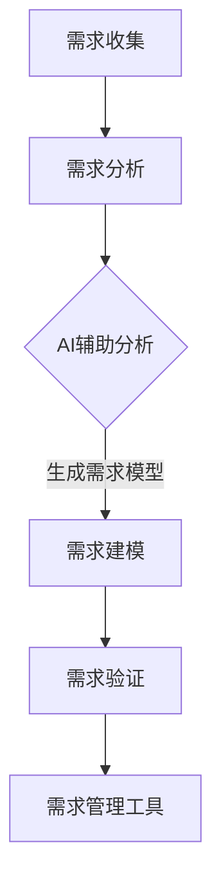

                 

### AI时代的软件工程项目管理新范式

#### 关键词
- **AI**、**软件工程项目管理**、**新范式**、**智能项目管理**、**AI驱动工具**

#### 摘要
本文探讨了AI时代软件工程项目管理的新范式，从AI的兴起背景、项目管理的传统挑战、AI对项目管理的革新、新范式下的项目需求管理、项目规划与执行、风险管理、团队协作、项目管理工具与技术以及未来展望等多个维度，详细阐述了AI如何改变传统软件工程项目的管理方式，提高项目的成功率和效率。

## 目录大纲设计思路

在设计本文的目录大纲时，我们首先明确了核心主题与章节划分，确保每个部分都能涵盖其主题下的关键点。以下是本文的目录大纲设计思路：

### 1. 核心主题与章节划分

#### 核心主题
- **AI与软件工程概述**
- **AI时代项目管理的新理论**
- **新范式实践**
- **工具与技术**
- **未来展望**

#### 章节划分
- **第一部分: AI与软件工程概述**
  - 第1章: AI与软件工程概述
  - 第2章: AI时代项目管理基础
- **第二部分: AI时代项目管理的新理论**
  - 第3章: AI驱动的项目需求管理
  - 第4章: AI时代的项目规划与执行
  - 第5章: AI时代的风险管理
  - 第6章: AI时代的团队协作
- **第三部分: 新范式实践**
  - 第7章: AI时代项目管理工具与技术
- **第四部分: 工具与技术**
  - 第8章: AI时代软件工程项目管理的未来

### 2. 确定章节内容

在每个部分中，我们进一步细化了章节内容，确保每个章节都能涵盖其主题下的关键点。以下是一个初步的章节内容安排：

#### 第一部分: AI与软件工程概述
- **第1章: AI与软件工程概述**
  - **1.1 AI的兴起与软件工程的演变**
  - **1.2 AI在软件工程中的应用场景**
  - **1.3 软件工程中的AI核心概念**

- **第2章: AI时代项目管理基础**
  - **2.1 传统项目管理方法回顾**
  - **2.2 AI对项目管理的影响**
  - **2.3 AI驱动的项目管理框架**

#### 第二部分: AI时代项目管理的新理论
- **第3章: AI驱动的项目需求管理**
  - **3.1 AI在需求收集与分析中的应用**
  - **3.2 智能需求预测与优化**
  - **3.3 智能需求管理工具介绍**

- **第4章: AI时代的项目规划与执行**
  - **4.1 AI驱动的项目规划方法**
  - **4.2 智能项目执行与监控**
  - **4.3 AI驱动的项目管理工具实践**

- **第5章: AI时代的风险管理**
  - **5.1 智能风险识别与评估**
  - **5.2 风险预测与主动应对**
  - **5.3 智能风险管理平台应用**

- **第6章: AI时代的团队协作**
  - **6.1 AI驱动的团队协作模式**
  - **6.2 智能沟通与协作工具**
  - **6.3 AI助力团队效能提升**

#### 第三部分: 新范式实践
- **第7章: AI时代项目管理工具与技术**
  - **7.1 AI项目管理平台选择**
  - **7.2 常用AI项目管理工具介绍**
  - **7.3 AI工具在项目管理中的应用案例**

#### 第四部分: 工具与技术
- **第8章: AI时代软件工程项目管理的未来**
  - **8.1 AI时代项目管理发展趋势**
  - **8.2 AI技术在项目管理中的潜在应用**
  - **8.3 未来项目管理创新方向**

### 3. 设计Mermaid流程图

为了更好地展示AI在软件工程中的应用原理和架构，我们将在相关章节中加入Mermaid流程图。例如：



### 4. 使用伪代码和LaTeX

在每个章节中，为了详细阐述核心算法原理和数学模型，我们将使用伪代码和LaTeX格式进行讲解。例如：

```python
# 伪代码：AI驱动的项目规划算法
function AI_Driven_Project_Planning(input: ProjectScope, input: TimeConstraint)
    # 收集项目数据
    data = CollectData(ProjectScope)
    
    # 使用AI算法进行项目规划
    plan = AI_Algorithm_Planning(data, TimeConstraint)
    
    # 输出项目规划结果
    return plan
```

```latex
% LaTeX：项目规划数学模型
\begin{equation}
    P = f(T, C, R, S)
\end{equation}
其中，\(P\) 代表项目规划，\(T\) 代表时间约束，\(C\) 代表成本约束，\(R\) 代表资源限制，\(S\) 代表项目需求。
```

### 5. 代码案例与分析

在每个章节的相关部分，我们将提供实际的代码案例和详细的解释说明，以确保读者能够理解和应用相关技术和方法。例如：

```python
# Python代码：智能需求预测算法
def predict_demand(data):
    # 使用机器学习模型进行需求预测
    model = train_model(data)
    prediction = model.predict(data)
    
    # 返回预测结果
    return prediction
```

通过以上设计思路和具体内容的安排，本文将系统地阐述AI时代软件工程项目管理的新范式，为读者提供全面、深入的见解和实践指导。接下来，我们将逐一探讨每个章节的具体内容，深入分析AI如何改变软件工程项目的管理方式。

