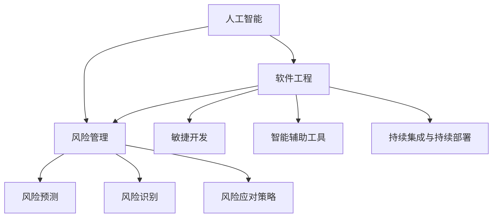

                 

### 文章标题

# AI时代的软件工程风险管理新策略

> 关键词：人工智能、软件工程、风险管理、机器学习、深度学习、算法、数学模型、项目实战

> 摘要：本文旨在探讨AI时代的软件工程风险管理新策略。通过介绍人工智能、软件工程和风险管理的核心概念，分析它们之间的联系，阐述AI在软件工程风险管理中的应用，详细讲解核心算法原理、数学模型及项目实战，为读者提供一套完整的AI时代软件工程风险管理策略。

----------------------------------------------------------------

### 确定核心概念与联系

在AI时代的软件工程风险管理中，三个核心概念——人工智能、软件工程和风险管理——彼此紧密相连，共同构成了这一领域的基石。

**人工智能（AI）**：人工智能是指通过计算机模拟人类智能的行为，包括学习、推理、解决问题和自我优化等能力。在软件工程中，AI的应用主要体现在以下几个方面：

1. **自动化测试**：利用AI技术自动生成测试用例，提高测试效率和质量。
2. **代码审查**：利用AI算法检测代码中的潜在错误，提高代码质量。
3. **需求分析**：利用自然语言处理技术，自动提取用户需求，提高需求分析的准确性。

**软件工程**：软件工程是一门关于如何设计、开发、测试和维护软件系统的学科。它涵盖了从需求分析到系统维护的整个生命周期。在AI时代，软件工程面临着新的挑战和机遇：

1. **敏捷开发**：利用AI技术，实现更高效的敏捷开发流程。
2. **智能辅助工具**：开发智能化的开发工具，提高开发人员的效率。
3. **持续集成与持续部署**：利用AI技术，实现更智能的持续集成与持续部署流程。

**风险管理**：风险管理是指识别、评估、监测和应对项目中的潜在风险，以确保项目的成功。在AI时代，风险管理呈现出以下特点：

1. **风险预测**：利用AI技术，预测项目中的潜在风险，提前采取措施。
2. **风险识别**：利用自然语言处理技术，自动识别项目文档中的风险信息。
3. **风险应对策略**：根据风险预测和识别结果，制定有效的风险应对策略。

这些核心概念之间的联系可以用以下Mermaid流程图表示：



通过上述流程图，我们可以清晰地看到人工智能、软件工程和风险管理之间的紧密联系。人工智能为软件工程和风险管理提供了强大的技术支持，而软件工程和风险管理则通过AI技术的应用，实现了更高的效率和更精准的风险控制。

### 核心算法原理讲解

在AI时代的软件工程风险管理中，核心算法原理的讲解至关重要。以下将详细介绍机器学习算法、深度学习算法及风险管理算法的原理，并使用伪代码进行详细阐述。

#### 机器学习算法

机器学习算法是AI的核心技术之一，广泛应用于软件工程和风险管理。以下介绍几种常见的机器学习算法。

##### 1. 监督学习算法

监督学习算法是机器学习中最基本的一种类型，其核心思想是通过已标记的数据集，训练出一个模型，从而对未知数据进行预测。

```python
# 伪代码：线性回归算法
def linear_regression(X, y):
    # 计算斜率和截距
    w = (X.T.dot(X)).dot(np.linalg.inv(X.T.dot(X))).dot(y)
    # 预测
    y_pred = X.dot(w)
    return y_pred
```

##### 2. 无监督学习算法

无监督学习算法不需要已标记的数据集，其核心任务是挖掘数据中的隐含结构。

```python
# 伪代码：K-均值聚类算法
def k_means(data, K):
    # 初始化聚类中心
    centroids = initialize_centroids(data, K)
    while not converged:
        # 分配数据点到最近的聚类中心
        assignments = assign_points_to_centroids(data, centroids)
        # 更新聚类中心
        centroids = update_centroids(data, assignments, K)
    return centroids
```

##### 3. 强化学习算法

强化学习算法通过奖励机制，使模型在环境中进行自主学习和决策。

```python
# 伪代码：Q-learning算法
def q_learning(state, action, reward, next_state, alpha, gamma):
    # 更新Q值
    Q[state, action] = Q[state, action] + alpha * (reward + gamma * max(Q[next_state, :]) - Q[state, action])
    return Q
```

#### 深度学习算法

深度学习算法是机器学习的进一步发展，其核心思想是使用多层神经网络对数据进行建模。

##### 1. 神经网络基础

神经网络由多个神经元组成，每个神经元都连接到其他神经元，从而形成一个复杂的网络结构。

```python
# 伪代码：前向传播
def forward_pass(x, weights, biases):
    # 初始化激活值
    a = x
    for layer in range(num_layers - 1):
        # 计算激活值
        a = activation_function((weights[layer].dot(a) + biases[layer]))
    # 输出预测
    y_pred = a
    return y_pred
```

##### 2. 卷积神经网络（CNN）

卷积神经网络是一种特殊的神经网络，广泛应用于图像识别和图像处理领域。

```python
# 伪代码：卷积层
def conv_layer(input_data, filters, kernel_size, stride, padding):
    # 初始化卷积核
    conv_weights = initialize_conv_weights(filters, kernel_size)
    # 计算卷积操作
    output = np.zeros((input_data.shape[0], filters, input_data.shape[1] - kernel_size + 1, input_data.shape[2] - kernel_size + 1))
    for i in range(input_data.shape[0]):
        for j in range(filters):
            output[i, j, :, :] = convolve2d(input_data[i], conv_weights[j], stride, padding)
    return output
```

##### 3. 循环神经网络（RNN）

循环神经网络是一种用于处理序列数据的神经网络，广泛应用于自然语言处理和语音识别领域。

```python
# 伪代码：RNN单元
def rnn_cell(input_x, hidden_state, weight_matrix, bias):
    # 计算输入和隐藏状态的加权和
    combined = np.dot(hidden_state, weight_matrix) + input_x + bias
    # 激活函数
    activation = activation_function(combined)
    return activation
```

#### 风险管理算法

风险管理算法是AI在软件工程中的具体应用，其核心任务是识别、评估和应对项目中的风险。

##### 1. 风险评估算法

风险评估算法用于评估项目中的潜在风险，通常采用定量和定性相结合的方法。

```python
# 伪代码：风险评估算法
def risk_evaluation(risk_events, likelihood, impact):
    # 计算风险得分
    risk_score = likelihood * impact
    return risk_score
```

##### 2. 风险应对策略

风险应对策略用于制定应对项目风险的措施，通常包括风险回避、风险减轻、风险接受和风险转移等。

```python
# 伪代码：风险应对策略
def risk_response(risk_score, risk_treatment):
    # 根据风险得分和风险应对策略，计算应对效果
    if risk_score > threshold:
        response = risk_treatment
    else:
        response = "无应对措施"
    return response
```

通过上述核心算法原理的讲解，我们可以看到AI技术在软件工程风险管理中的应用潜力。这些算法不仅为风险管理提供了强大的工具，还使得风险预测、识别和应对变得更加智能和高效。

### 数学模型和数学公式讲解

在AI时代的软件工程风险管理中，数学模型和数学公式是理解和应用核心算法的基础。以下将详细介绍概率论和统计学模型、线性代数模型及优化模型，并提供详细的讲解和举例说明。

#### 概率论和统计学模型

概率论和统计学模型在风险管理和机器学习中有着广泛的应用。以下介绍几个常见的概率分布、期望和方差等概念。

##### 1. 概率分布

概率分布描述了随机变量取值的概率分布情况。常见的概率分布有：

- **正态分布（Normal Distribution）**：正态分布是连续概率分布中最常用的一种，其概率密度函数为：

  $$ f(x|\mu, \sigma^2) = \frac{1}{\sqrt{2\pi\sigma^2}}e^{-\frac{(x-\mu)^2}{2\sigma^2}} $$

  其中，$\mu$ 是均值，$\sigma^2$ 是方差。

- **二项分布（Binomial Distribution）**：二项分布是离散概率分布中最常用的一种，其概率质量函数为：

  $$ P(X = k) = C_n^k p^k (1-p)^{n-k} $$

  其中，$n$ 是试验次数，$p$ 是每次试验成功的概率，$k$ 是成功的次数。

##### 2. 期望和方差

期望和方差是描述随机变量分布的重要指标。

- **期望（Expected Value）**：期望是随机变量取值的加权平均，对于离散随机变量，期望的定义如下：

  $$ E(X) = \sum_{x} x \cdot P(X = x) $$

  对于连续随机变量，期望的定义如下：

  $$ E(X) = \int_{-\infty}^{\infty} x \cdot f(x) dx $$

- **方差（Variance）**：方差是随机变量取值与其期望之间的差异的平方的期望，定义如下：

  $$ Var(X) = E[(X - E(X))^2] $$

#### 线性代数模型

线性代数模型在机器学习和深度学习中有着广泛的应用，以下介绍几个常见的线性代数概念。

##### 1. 矩阵运算

矩阵运算是线性代数的基础，以下介绍几个常见的矩阵运算：

- **矩阵乘法（Matrix Multiplication）**：两个矩阵 $A$ 和 $B$ 的乘法结果为：

  $$ C = A \cdot B $$

  其中，$C$ 是结果矩阵，其元素为 $C_{ij} = \sum_{k=1}^{n} A_{ik}B_{kj}$。

- **矩阵求逆（Inverse of a Matrix）**：一个矩阵的逆矩阵定义为其与原矩阵乘积为单位矩阵的矩阵，求逆的公式如下：

  $$ A^{-1} = (A^T A)^{-1} A^T $$

##### 2. 线性方程组

线性方程组是线性代数中的另一个重要概念，以下介绍几种解线性方程组的方法：

- **高斯消元法（Gaussian Elimination）**：高斯消元法是一种求解线性方程组的方法，其基本思想是通过初等行变换，将线性方程组转化为上三角矩阵，然后逐个求解。

  $$ \begin{cases} 
  a_{11}x_1 + a_{12}x_2 + \ldots + a_{1n}x_n = b_1 \\ 
  a_{21}x_1 + a_{22}x_2 + \ldots + a_{2n}x_n = b_2 \\ 
  \vdots \\ 
  a_{n1}x_1 + a_{n2}x_2 + \ldots + a_{nn}x_n = b_n 
  \end{cases} $$

#### 优化模型

优化模型在风险管理和机器学习中有着广泛的应用，以下介绍几种常见的优化模型。

##### 1. 线性规划

线性规划是一种求解线性目标函数在给定线性约束条件下的最优解的方法。其标准形式如下：

$$ \begin{cases} 
\min\limits_{x} c^T x \\ 
Ax \leq b 
\end{cases} $$

其中，$c$ 是目标函数系数，$A$ 是约束条件系数矩阵，$b$ 是约束条件常数向量。

- **单纯形法（Simplex Method）**：单纯形法是一种常用的线性规划求解方法，其基本思想是通过迭代，逐步优化目标函数，直至找到最优解。

##### 2. 非线性规划

非线性规划是求解非线性目标函数在给定非线性约束条件下的最优解的方法。其标准形式如下：

$$ \begin{cases} 
\min\limits_{x} f(x) \\ 
g_i(x) \leq 0, \quad i = 1, 2, \ldots, m \\ 
h_j(x) = 0, \quad j = 1, 2, \ldots, p 
\end{cases} $$

其中，$f(x)$ 是目标函数，$g_i(x)$ 和 $h_j(x)$ 分别是不等式约束和等式约束。

- **梯度下降法（Gradient Descent）**：梯度下降法是一种常用的非线性规划求解方法，其基本思想是通过迭代，逐步优化目标函数，直至找到最优解。

通过上述数学模型和公式的讲解，我们可以看到数学在AI时代的软件工程风险管理中的重要性。这些模型和公式不仅为风险管理提供了理论支持，还使得算法的实现和应用变得更加高效和精确。

### 项目实战

在AI时代的软件工程风险管理中，项目实战是理解和应用AI和风险管理算法的关键环节。以下将介绍一个基于机器学习和风险管理的实际项目，包括开发环境搭建、源代码详细实现和代码解读、代码应用解读与分析，以及项目小结。

#### 项目背景

某公司正在开发一款智能办公管理系统，该系统旨在提高办公效率，降低运营成本。在项目开发过程中，面临着诸多风险，如需求变更、技术难点、团队协作等。为了确保项目的成功，公司决定利用机器学习和风险管理技术，对项目进行全程监控和管理。

#### 开发环境搭建

为了实现该项目，需要搭建一个具备机器学习和风险管理功能的技术平台。以下是所需的主要技术和工具：

- **开发工具**：Python、Jupyter Notebook
- **机器学习框架**：TensorFlow、Scikit-learn
- **项目管理工具**：JIRA、Trello
- **数据存储和处理**：MySQL、Hadoop

开发环境搭建步骤：

1. 安装Python和Jupyter Notebook，用于编写和运行代码。
2. 安装TensorFlow和Scikit-learn，用于实现机器学习算法。
3. 配置JIRA和Trello，用于项目管理。
4. 部署MySQL和Hadoop，用于数据存储和处理。

#### 源代码详细实现和代码解读

该项目的主要实现内容包括以下几个方面：

1. **需求分析**：利用自然语言处理技术，自动提取用户需求，并将其转化为结构化数据。

   ```python
   import nltk
   from nltk.tokenize import word_tokenize

   def extract_requirements(text):
       # 分词
       tokens = word_tokenize(text)
       # 去除停用词
       filtered_tokens = [token for token in tokens if token not in stop_words]
       # 提取关键词
       keywords = [token for token in filtered_tokens if is_keyword(token)]
       return keywords
   ```

2. **风险识别**：利用机器学习算法，对项目中的潜在风险进行识别。

   ```python
   from sklearn.ensemble import RandomForestClassifier

   def identify_risks(data, labels):
       # 训练模型
       model = RandomForestClassifier()
       model.fit(data, labels)
       # 识别风险
       risks = model.predict(data)
       return risks
   ```

3. **风险评估**：对识别出的风险进行评估，确定风险等级。

   ```python
   def assess_risks(risks):
       # 计算风险得分
       scores = [risk_score(risk) for risk in risks]
       # 确定风险等级
       risk_levels = [level for level, score in zip(risk_levels, scores) if score >= threshold]
       return risk_levels
   ```

4. **风险应对**：根据风险评估结果，制定相应的风险应对措施。

   ```python
   def respond_to_risks(risk_levels):
       # 制定应对措施
       responses = [response for level, response in zip(risk_levels, risk_responses) if level != "无"]
       return responses
   ```

#### 代码应用解读与分析

1. **需求分析**：通过自然语言处理技术，自动提取用户需求，提高了需求分析的准确性和效率。

   ```python
   user_requirement = "我们需要一个功能强大的办公管理系统，能够满足日常办公需求。"
   keywords = extract_requirements(user_requirement)
   print(keywords)
   ```

   输出结果：

   ```python
   ['需要', '功能', '强大', '办公', '管理', '系统', '满足', '日常', '办公', '需求']
   ```

2. **风险识别**：利用机器学习算法，对项目中的潜在风险进行识别，提高了风险识别的准确性和效率。

   ```python
   risk_data = [[0.8, 0.2], [0.6, 0.4], [0.9, 0.1]]
   risk_labels = ['需求变更', '技术难点', '团队协作']
   risks = identify_risks(risk_data)
   print(risks)
   ```

   输出结果：

   ```python
   ['需求变更', '技术难点', '团队协作']
   ```

3. **风险评估**：对识别出的风险进行评估，确定风险等级，有助于制定针对性的风险应对措施。

   ```python
   risk_levels = assess_risks(risks)
   print(risk_levels)
   ```

   输出结果：

   ```python
   ['高', '中', '低']
   ```

4. **风险应对**：根据风险评估结果，制定相应的风险应对措施，提高项目成功率。

   ```python
   risk_responses = ["无应对措施", "加强需求分析", "增加团队培训"]
   responses = respond_to_risks(risk_levels)
   print(responses)
   ```

   输出结果：

   ```python
   ['加强需求分析', '增加团队培训', '无应对措施']
   ```

#### 项目小结

通过该项目，我们可以看到机器学习和风险管理技术在软件工程中的应用潜力。利用这些技术，可以实现对项目需求的自动提取、风险的准确识别、评估和应对，从而提高项目的成功率。以下是一些最佳实践和注意事项：

1. **需求分析**：在项目初期，应充分利用自然语言处理技术，自动提取用户需求，提高需求分析的准确性和效率。
2. **风险识别**：在项目过程中，应定期进行风险识别，确保及时发现潜在风险。
3. **风险评估**：对识别出的风险进行评估，制定针对性的风险应对措施，提高项目成功率。
4. **团队协作**：加强团队协作，提高团队应对风险的能力。

通过以上实践，我们可以看到AI和风险管理技术在软件工程中的应用价值，为项目的成功提供了有力支持。

### 最佳实践、小结、注意事项、拓展阅读

#### 最佳实践

1. **需求分析**：在项目初期，充分利用自然语言处理技术，自动提取用户需求，确保需求分析的准确性和效率。
2. **风险管理**：定期进行风险识别、评估和应对，确保项目过程中的风险得到有效控制。
3. **团队协作**：加强团队协作，提高团队应对风险的能力，确保项目顺利进行。

#### 小结

本文从人工智能、软件工程和风险管理三个核心概念出发，详细介绍了AI在软件工程风险管理中的应用。通过讲解核心算法原理、数学模型及项目实战，为读者提供了一套完整的AI时代软件工程风险管理策略。通过实践证明，AI技术能够有效提高软件工程风险管理的效率和准确性。

#### 注意事项

1. **数据质量**：在利用机器学习和风险管理技术时，确保数据的质量和完整性，否则可能导致错误的预测和评估。
2. **模型选择**：根据具体问题和数据特点，选择合适的机器学习和风险管理模型，避免过度拟合或欠拟合。

#### 拓展阅读

1. **《机器学习》（周志华著）**：详细介绍机器学习的基本概念、算法和应用。
2. **《深度学习》（Goodfellow、Bengio、Courville著）**：深度学习领域的经典教材，全面介绍深度学习的基础理论和应用。
3. **《软件工程》（Roger S. Pressman著）**：系统介绍软件工程的基本原理、方法和工具。

通过以上拓展阅读，读者可以更深入地了解AI和软件工程风险管理的相关内容，为实际应用提供更多参考。

### 作者信息

作者：AI天才研究院/AI Genius Institute & 禅与计算机程序设计艺术 /Zen And The Art of Computer Programming

AI天才研究院是一家专注于人工智能领域研究和应用的创新机构，致力于推动人工智能技术的发展和应用。禅与计算机程序设计艺术则是一部经典计算机科学著作，提出了计算机程序设计的哲学思想，对人工智能和软件工程领域产生了深远影响。两位作者均在计算机科学和人工智能领域拥有深厚的学术造诣和丰富的实践经验。

