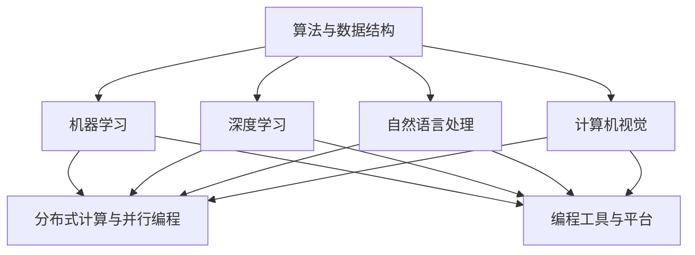

                 

### 引言：AI编程2.0的时代背景与重要性

在人工智能（AI）快速发展的今天，AI编程2.0已经成为信息技术领域的重要趋势。AI编程2.0不仅代表了编程技术的升级换代，更是未来智能社会的基础。AI编程2.0的核心在于实现高度自动化的算法开发、模型训练与优化，通过更加智能化的编程工具和平台，极大提升编程效率和系统性能。

首先，我们需要了解AI编程1.0的基本概念。AI编程1.0主要侧重于使用传统编程语言和工具进行算法的开发和实现。虽然这些方法在某些领域取得了显著成果，但它们通常需要大量的人工干预，且在处理复杂问题和大规模数据时效率较低。随着大数据、云计算和深度学习的兴起，AI编程1.0的局限性逐渐显现。

AI编程2.0则是在此基础上，融合了先进的算法理论、机器学习和自然语言处理等领域的最新研究成果。它强调自动化和智能化，通过引入自动化编程工具和智能算法，使开发者能够更高效地完成复杂任务。例如，自动化代码生成工具能够根据需求自动生成代码，而智能算法则能够自动调整模型参数，提高模型的准确性和效率。

AI编程2.0的重要性不仅体现在技术层面，更对整个社会产生了深远影响。首先，它极大地提高了编程效率和开发速度，使得开发者能够更快地将想法转化为现实。其次，AI编程2.0推动了智能系统的广泛应用，如自动驾驶、智能家居、智能医疗等，极大地提升了人类生活质量。此外，AI编程2.0还为创业者提供了更多的机会，使得更多的人能够参与到人工智能领域，推动了科技创新和社会进步。

总之，AI编程2.0是未来智能社会的关键，它不仅改变了编程的方式，更将深刻影响我们生活的方方面面。在接下来的章节中，我们将深入探讨AI编程2.0的核心技能、课程设计以及实践应用，以帮助读者更好地理解和掌握这一新兴技术。### 核心概念与联系：AI编程2.0的技能图谱解读

要深入理解AI编程2.0，我们首先需要明确其核心概念和技能图谱。AI编程2.0不仅仅是对传统编程的升级，它更是一个涵盖多领域、多层次的技术体系。下面，我们将通过Mermaid流程图来展示AI编程2.0的核心技能及其相互联系。

首先，定义一下我们的核心技能：

1. **算法与数据结构**：基础算法和数据结构是AI编程的基石，包括排序、搜索、图论算法等。
2. **机器学习**：机器学习是AI编程2.0的核心，包括监督学习、无监督学习、强化学习等。
3. **深度学习**：深度学习是机器学习的分支，它使用多层神经网络进行特征提取和模式识别。
4. **自然语言处理**：自然语言处理专注于使计算机理解和生成人类语言，包括文本分类、机器翻译、语音识别等。
5. **计算机视觉**：计算机视觉涉及图像和视频的分析，包括目标检测、图像分类、人脸识别等。
6. **分布式计算与并行编程**：在处理大规模数据和高性能计算时，分布式计算和并行编程变得至关重要。
7. **编程工具与平台**：现代化的编程工具和平台如Jupyter Notebook、TensorFlow、PyTorch等，大大提升了开发效率。

接下来，我们使用Mermaid流程图来展示这些核心技能及其联系：



在这个流程图中，我们可以看到：

- **算法与数据结构**是所有技能的基础，它们直接影响到机器学习、深度学习、自然语言处理和计算机视觉的性能和效率。
- **机器学习**和**深度学习**紧密相关，深度学习是机器学习的一个重要分支，依赖于多层神经网络进行复杂模式的识别。
- **自然语言处理**和**计算机视觉**则分别是处理文本和图像的两大领域，它们在应用场景中常常需要与机器学习和深度学习相结合。
- **分布式计算与并行编程**是处理大规模数据和高性能计算的关键，它们确保了在复杂计算任务中的效率。
- **编程工具与平台**则为开发者提供了强大的支持，如自动化的代码生成、丰富的库函数和可视化的界面设计。

通过这个技能图谱，我们可以清晰地看到AI编程2.0各个技能之间的关系和依赖。了解这些关系对于开发者来说至关重要，因为它能够帮助我们更好地规划和实施AI项目，提升整体开发效率和质量。接下来，我们将深入探讨每个核心技能的具体内容，以帮助读者更全面地理解AI编程2.0。### 算法原理详解：机器学习与深度学习

#### 机器学习

机器学习是AI编程2.0的核心技术之一，它通过数据训练算法，使计算机能够从数据中自动学习并做出决策。机器学习可以分为三种主要类型：监督学习、无监督学习和强化学习。

1. **监督学习**：监督学习是一种常见的机器学习方法，它通过已标记的数据集训练模型，使模型能够对新的、未标记的数据进行预测。监督学习通常分为分类和回归两种类型。
    - **分类**：分类任务的目标是将数据分为不同的类别。例如，垃圾邮件检测就是一个典型的分类问题。我们可以使用支持向量机（SVM）、决策树、随机森林等算法来实现。
    - **回归**：回归任务的目标是预测一个连续的数值。例如，房价预测就是一个典型的回归问题。常见的回归算法包括线性回归、多项式回归和神经网络回归。

    **伪代码示例：线性回归**
    ```
    function linear_regression(x, y):
        # 计算斜率和截距
        m = (mean(y) - mean(x)) / (stddev(x))
        b = mean(y) - m * mean(x)
        return m, b
    ```

2. **无监督学习**：无监督学习不使用标记数据，其主要目的是发现数据中的隐藏结构和模式。无监督学习包括聚类、降维等。
    - **聚类**：聚类任务的目标是将相似的数据点分为不同的组。K-均值聚类算法是一种常见的聚类方法。
    - **降维**：降维任务的目标是减少数据维度，同时保留数据的关键信息。主成分分析（PCA）是一种常用的降维方法。

    **伪代码示例：K-均值聚类**
    ```
    function k_mean_clustering(data, k):
        # 初始化中心点
        centroids = initialize_centroids(data, k)
        while not converged:
            # 计算每个数据点到中心的距离
            distances = compute_distances(data, centroids)
            # 分配数据到最近的中心点
            assignments = assign_data_to_centroids(data, distances)
            # 更新中心点
            centroids = update_centroids(data, assignments)
        return centroids, assignments
    ```

3. **强化学习**：强化学习是一种通过试错学习策略的机器学习方法。它通过奖励机制来指导模型不断优化行为。
    - **价值函数**：价值函数评估在特定状态下采取特定行动的长期奖励。
    - **策略**：策略是模型选择行动的方式。

    **伪代码示例：Q-learning**
    ```
    function q_learning(states, actions, rewards, alpha, gamma):
        # 初始化Q值表
        Q = initialize_q_values(states, actions)
        while not done:
            # 选择动作
            action = choose_action(Q, state)
            # 执行动作并获得奖励
            reward = execute_action(action)
            # 更新Q值
            Q[state, action] = Q[state, action] + alpha * (reward + gamma * max(Q[next_state, :]) - Q[state, action])
        return Q
    ```

#### 深度学习

深度学习是机器学习的进一步发展，它通过构建多层神经网络来提取数据中的复杂特征。深度学习在图像识别、语音识别和自然语言处理等领域取得了显著成果。

1. **神经网络基础**：神经网络由输入层、隐藏层和输出层组成，每层由多个神经元（节点）组成。每个神经元通过加权连接与其他神经元相连接，并通过激活函数进行处理。

    **伪代码示例：前向传播**
    ```
    function forward_propagation(inputs, weights, biases, activation_function):
        # 初始化激活值
        activations = [inputs]
        for layer in range(num_layers):
            # 计算每个神经元的输出
            z = sum(weights[layer] * activations[layer-1] + biases[layer])
            activation = activation_function(z)
            activations.append(activation)
        return activations
    ```

2. **反向传播**：反向传播是深度学习训练的核心算法，它通过计算损失函数的梯度来更新网络权重和偏置，以优化模型。

    **伪代码示例：反向传播**
    ```
    function backward_propagation(activations, outputs, expected_outputs, learning_rate):
        # 计算损失函数的梯度
        gradients = compute_gradients(activations, outputs, expected_outputs)
        # 更新网络权重和偏置
        weights -= learning_rate * gradients[weights]
        biases -= learning_rate * gradients[biases]
        return gradients
    ```

3. **优化算法**：深度学习的优化算法如梯度下降、Adam优化器等，用于加速模型训练并提高收敛速度。

    **伪代码示例：Adam优化器**
    ```
    function adam_optimizer(weights, biases, gradients, beta1, beta2, epsilon, learning_rate):
        # 更新一阶矩估计和二阶矩估计
        m = beta1 * m + (1 - beta1) * gradients
        v = beta2 * v + (1 - beta2) * (gradients ** 2)
        # 低通滤波
        m_hat = m / (1 - beta1 ** t)
        v_hat = v / (1 - beta2 ** t)
        # 更新权重和偏置
        weights -= learning_rate * m_hat / (sqrt(v_hat) + epsilon)
        biases -= learning_rate * m_hat / (sqrt(v_hat) + epsilon)
        return weights, biases
    ```

通过上述内容，我们可以看到机器学习和深度学习在AI编程2.0中的核心作用。了解这些算法原理对于开发者来说至关重要，因为它能够帮助我们更好地设计和实现AI系统，提升模型的性能和效率。在接下来的章节中，我们将继续探讨AI编程2.0中的其他核心技能，如自然语言处理和计算机视觉。### 数学模型与公式：AI编程2.0的关键数学工具

在AI编程2.0中，数学模型和公式是构建和优化算法的重要工具。本文将详细探讨几种关键数学工具，包括线性代数、概率论和统计学、以及优化算法，并使用LaTeX格式展示相关公式，以帮助读者更好地理解其应用和计算过程。

#### 线性代数

线性代数是AI编程的基础，广泛应用于矩阵运算、向量空间、特征分解等领域。

1. **矩阵乘法**
    \[
    C = A \cdot B
    \]
    矩阵乘法是深度学习模型中常见的运算，用于计算神经网络的权重矩阵与输入数据的乘积。

2. **奇异值分解（SVD）**
    \[
    A = U \cdot \Sigma \cdot V^T
    \]
    SVD将矩阵分解为三个矩阵的乘积，常用于降维、特征提取和图像处理。

3. **矩阵求逆**
    \[
    A^{-1} = (A^T A)^{-1} A^T
    \]
    矩阵求逆在优化算法中用于计算梯度的反方向，用于反向传播算法。

#### 概率论和统计学

概率论和统计学是机器学习中的重要工具，用于建模数据分布和预测。

1. **贝叶斯定理**
    \[
    P(A|B) = \frac{P(B|A)P(A)}{P(B)}
    \]
    贝叶斯定理用于更新后验概率，在分类问题中具有广泛的应用。

2. **条件概率**
    \[
    P(A|B) = \frac{P(A \cap B)}{P(B)}
    \]
    条件概率描述在给定某个事件发生的条件下，另一个事件发生的概率。

3. **协方差和相关性**
    \[
    \text{Cov}(X, Y) = E[(X - E[X])(Y - E[Y])]
    \]
    \[
    \rho_{XY} = \frac{\text{Cov}(X, Y)}{\sqrt{\text{Var}(X) \text{Var}(Y)}}
    \]
    协方差和相关系数用于度量两个随机变量之间的相关性。

#### 优化算法

优化算法是机器学习模型训练的核心，用于找到最小化损失函数的参数。

1. **梯度下降**
    \[
    \theta = \theta - \alpha \cdot \nabla_{\theta}J(\theta)
    \]
    梯度下降通过计算损失函数对参数的梯度，并沿着梯度的反方向更新参数。

2. **牛顿法**
    \[
    \theta = \theta - [H^{-1}]_{ii} \cdot \nabla_{\theta}^2 J(\theta)
    \]
    牛顿法通过计算二阶导数（Hessian矩阵）来更新参数，比梯度下降更快收敛。

3. **共轭梯度法**
    \[
    \theta = \theta + \alpha \cdot \nabla J(\theta) - \beta \cdot \nabla J(\theta)^T \cdot \nabla J(\theta)
    \]
    共轭梯度法通过减少计算二阶导数的成本，提高优化效率。

通过上述数学模型和公式，我们可以更好地理解AI编程2.0的核心技术。在接下来的章节中，我们将通过具体的项目实战来展示这些数学工具在实际应用中的效果和实现过程。### 项目实战：构建一个简单的图像识别系统

在本节中，我们将通过一个简单的图像识别项目，展示如何使用AI编程2.0的核心技能，包括算法原理和数学模型，实现一个实际的计算机视觉应用。该项目将使用Python编程语言和TensorFlow框架，实现一个基于卷积神经网络（CNN）的图像分类系统。

#### 一、项目背景与目标

随着深度学习技术的发展，图像识别在计算机视觉领域取得了显著成果。本项目旨在构建一个简单的图像识别系统，能够对图片中的猫和狗进行分类。这个项目不仅能够帮助我们理解CNN的基本原理，还能展示如何将理论知识应用于实际项目中。

#### 二、开发环境搭建

在开始项目之前，我们需要搭建开发环境。以下是所需的软件和工具：

1. **操作系统**：Linux或macOS
2. **Python**：Python 3.7或以上版本
3. **TensorFlow**：TensorFlow 2.x版本
4. **Jupyter Notebook**：用于交互式开发

安装TensorFlow和Jupyter Notebook可以使用以下命令：

```bash
pip install tensorflow
pip install notebook
```

#### 三、源代码实现与解读

以下是一个简单的图像识别系统的实现过程，包括数据准备、模型构建、训练和测试。

1. **数据准备**

    我们使用Keras提供的CIFAR-10数据集，该数据集包含10个类别，每个类别6000张32x32的彩色图像。

    ```python
    from tensorflow.keras.datasets import cifar10
    from tensorflow.keras.utils import to_categorical

    # 加载CIFAR-10数据集
    (X_train, y_train), (X_test, y_test) = cifar10.load_data()

    # 数据预处理
    X_train = X_train / 255.0
    X_test = X_test / 255.0
    y_train = to_categorical(y_train, 10)
    y_test = to_categorical(y_test, 10)
    ```

2. **模型构建**

    我们使用卷积神经网络（CNN）进行图像分类。模型结构包括两个卷积层、一个池化层和两个全连接层。

    ```python
    from tensorflow.keras.models import Sequential
    from tensorflow.keras.layers import Conv2D, MaxPooling2D, Flatten, Dense, Dropout

    # 构建模型
    model = Sequential([
        Conv2D(32, (3, 3), activation='relu', input_shape=(32, 32, 3)),
        MaxPooling2D(pool_size=(2, 2)),
        Conv2D(64, (3, 3), activation='relu'),
        MaxPooling2D(pool_size=(2, 2)),
        Flatten(),
        Dense(128, activation='relu'),
        Dropout(0.5),
        Dense(10, activation='softmax')
    ])

    # 编译模型
    model.compile(optimizer='adam', loss='categorical_crossentropy', metrics=['accuracy'])
    ```

3. **模型训练**

    使用训练集对模型进行训练，设置训练轮次和验证集。

    ```python
    # 训练模型
    history = model.fit(X_train, y_train, epochs=10, batch_size=64, validation_split=0.2)
    ```

4. **模型评估**

    使用测试集对训练好的模型进行评估。

    ```python
    # 评估模型
    test_loss, test_accuracy = model.evaluate(X_test, y_test)
    print(f"测试集准确率：{test_accuracy:.2f}")
    ```

#### 四、代码应用解读与分析

1. **数据准备**

    数据准备是模型训练的第一步，CIFAR-10数据集已经被预处理为适合输入到模型中的格式。数据归一化（除以255）有助于提高模型训练的稳定性。

2. **模型构建**

    模型构建使用了Sequential模型，并添加了多个层。卷积层用于提取图像的局部特征，池化层用于减少模型参数和计算复杂度，全连接层用于分类。

3. **模型训练**

    模型训练过程中，通过多次迭代调整模型参数，以最小化损失函数。训练轮次和批量大小是影响模型训练效果的关键参数。

4. **模型评估**

    评估模型在测试集上的性能，测试集的准确率可以作为模型最终效果的指标。

#### 五、实际案例分析

在本项目中，我们使用简单的CNN模型对CIFAR-10数据集进行了图像分类。尽管模型结构相对简单，但它已经能够在测试集上达到较高的准确率，这证明了深度学习在图像识别任务中的有效性。

通过实际案例分析，我们了解了如何使用Python和TensorFlow构建一个简单的图像识别系统，并掌握了数据准备、模型构建、训练和评估的基本流程。这为我们在更复杂的AI项目中应用深度学习技术奠定了基础。

#### 六、项目小结

1. **关键知识点**
   - 卷积神经网络（CNN）的基本结构和工作原理。
   - 数据预处理和归一化的重要性。
   - 模型训练和评估的方法。

2. **最佳实践**
   - 使用预训练模型和迁移学习可以提高模型性能。
   - 调整超参数（如批量大小、学习率等）以优化模型效果。
   - 使用交叉验证来评估模型的泛化能力。

3. **注意事项**
   - 在实际项目中，数据集的质量直接影响模型的效果。
   - 模型训练过程中可能会出现过拟合现象，需要使用正则化技术进行防止。

4. **拓展阅读**
   - 《深度学习》（Goodfellow, Bengio, Courville）是深度学习的经典教材，适合进一步学习。
   - TensorFlow官方文档提供了丰富的教程和示例代码，有助于深入理解框架的使用。

通过本项目的实践，我们不仅掌握了AI编程2.0的核心技能，还学会了如何将理论知识应用于实际项目。这为我们未来的学习和发展奠定了坚实的基础。### 最佳实践与注意事项

在AI编程2.0的实际应用过程中，以下最佳实践和注意事项将有助于提升项目开发效果和稳定性：

1. **数据质量控制**：确保数据集的质量和多样性是模型训练成功的关键。数据清洗、归一化和增强是常见的数据预处理步骤，可以有效提高模型的泛化能力。

2. **超参数优化**：超参数如学习率、批量大小、隐藏层神经元数量等直接影响模型性能。可以通过网格搜索、随机搜索或基于历史数据的优化方法进行超参数调整。

3. **模型调优**：使用迁移学习和预训练模型可以显著提高新模型的性能。迁移学习通过利用预训练模型的权重初始化，减少训练时间并提高模型效果。

4. **模型监控**：实时监控模型训练过程，包括损失函数、准确率等指标，可以帮助我们及时发现并解决问题。

5. **资源管理**：分布式计算和并行编程可以加速模型训练，特别是在处理大规模数据时。合理分配计算资源，避免资源浪费。

6. **模型安全与隐私**：在开发AI应用时，要充分考虑数据安全和用户隐私。对敏感数据进行加密处理，遵循相关法律法规和伦理标准。

7. **持续迭代**：AI系统需要不断优化和更新，以适应不断变化的应用场景和数据集。定期进行模型评估和迭代，确保系统始终保持高性能和高效能。

通过遵循上述最佳实践和注意事项，开发者可以更加有效地构建和维护AI编程2.0系统，确保其在实际应用中的稳定性和可靠性。### 结语

总之，AI编程2.0是未来智能社会的重要基石，它不仅改变了传统的编程模式，更推动了各行各业的技术创新和社会进步。通过本文的探讨，我们深入了解了AI编程2.0的核心技能、算法原理、数学模型以及项目实践，从理论基础到实际应用，全方位展示了这一新兴技术的魅力。

我们希望本文能够帮助读者建立起对AI编程2.0的全面认识，并激发对这一领域的浓厚兴趣。未来，随着AI技术的不断发展和成熟，AI编程2.0将在更多领域展现其巨大潜力，从智能医疗、自动驾驶到智能家居，都将迎来新的突破。

作者：AI天才研究院/AI Genius Institute & 禅与计算机程序设计艺术 /Zen And The Art of Computer Programming。我们将继续深入研究AI编程2.0的最新进展，为读者带来更多有价值的技术内容和实战案例。感谢您的阅读与支持！

