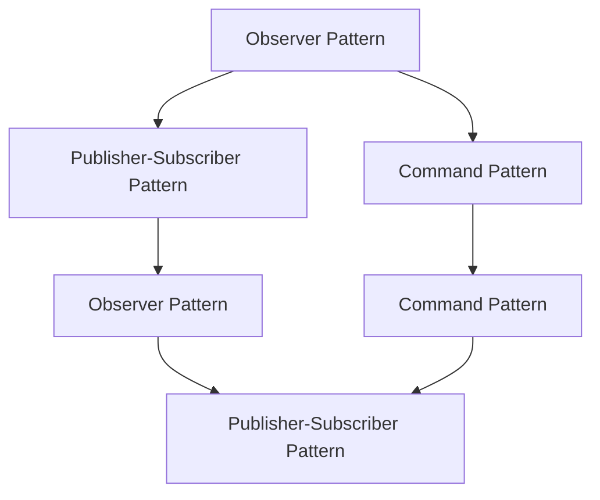

                 


### Introduction and Overview

---
**Book Title:** AI Programming Language Interaction Design Patterns Library

**Keywords:** AI Programming, Interaction Design Patterns, Design Patterns, AI Languages, Interaction Design, Software Engineering

**Abstract:**
The "AI Programming Language Interaction Design Patterns Library" is a comprehensive guide designed to explore the intricate relationship between AI programming and interaction design patterns. This book delves into the fundamentals of both artificial intelligence and programming languages, providing a robust framework for understanding how design patterns can be effectively utilized in AI programming. The book is structured to guide the reader through the essential concepts, the evolution of AI and programming languages, and the introduction of various interaction design patterns. It aims to provide a practical insight into the implementation of these patterns across different AI programming languages, thus equipping developers with the knowledge and skills required to design and build efficient and scalable AI applications.

The book is targeted at software developers, AI enthusiasts, and professionals working in the field of artificial intelligence who seek to enhance their understanding of interaction design patterns in AI programming. It will also be an invaluable resource for researchers and students who wish to explore the theoretical underpinnings and practical applications of design patterns in the context of AI.

---

### Fundamental Concepts

---
#### 2.1 Basic Concepts in AI

**2.1.1 Introduction to Artificial Intelligence**

Artificial Intelligence (AI) refers to the simulation of human intelligence in machines that are programmed to think like humans and mimic their actions. The field of AI encompasses various subfields, including machine learning, natural language processing, computer vision, and robotics. AI systems are designed to perform tasks that would typically require human intelligence, such as recognizing patterns, learning from experience, understanding and generating language, and making decisions.

**2.1.2 History and Evolution of AI**

The history of AI can be traced back to the mid-20th century when computer scientist Alan Turing proposed the concept of the Turing test, which is used to determine a machine's ability to exhibit intelligent behavior equivalent to, or indistinguishable from, that of a human. Over the decades, AI has evolved through several waves of development, characterized by advancements in hardware, algorithms, and data availability.

- **Early AI (1950s-1960s):** This period saw the birth of AI with the development of logical programming languages and rule-based systems.
- **AI Winter (1970s-1980s):** Due to the limitations of early algorithms and insufficient computational power, AI research faced setbacks, leading to reduced funding and interest.
- **AI Revival (1990s-2000s):** The advent of machine learning and the growth of the Internet brought renewed interest in AI. Algorithms like neural networks and support vector machines became prominent.
- **Modern AI (2010s-present):** The integration of deep learning and advancements in computing power have led to breakthroughs in AI, enabling applications in areas such as autonomous vehicles, speech recognition, and natural language understanding.

**2.1.3 Types of AI Systems**

AI systems can be broadly categorized into two types: narrow AI and general AI.

- **Narrow AI (ANI):** Also known as weak AI, ANI is designed to perform a specific task or a narrow set of tasks. Examples include voice assistants like Siri and Alexa, image recognition software, and recommendation systems. Narrow AI is rule-based and relies heavily on data and algorithms to perform its function.
- **General AI (AGI):** General AI, or strong AI, aims to have the same intellectual capabilities as humans. It can understand, learn, and apply knowledge across a wide range of tasks. General AI is a theoretical concept and has not yet been achieved.

#### 2.2 Introduction to Programming Languages

**2.2.1 Overview of Programming Languages**

A programming language is a set of instructions and rules used to communicate with a computer. It provides a structured way for humans to write code that can be executed by machines. There are several types of programming languages, including procedural languages, object-oriented languages, functional languages, and domain-specific languages.

**2.2.2 Evolution of Programming Languages**

The evolution of programming languages has been driven by advancements in technology, the need for more efficient code, and the complexity of software systems. Here is a brief overview of the key milestones:

- **Early Programming Languages (1940s-1950s):** Early languages like Assembly language and machine code were low-level and difficult to understand.
- **Procedural Languages (1950s-1970s):** High-level languages like FORTRAN (1957) and COBOL (1959) were developed to make programming more accessible.
- **Structured Programming (1970s-1980s):** The concept of structured programming, which emphasizes the use of control structures to organize code, was introduced to improve code readability and maintainability.
- **Object-Oriented Programming (1980s-1990s):** Languages like C++ (1983) and Java (1995) revolutionized software development by promoting the use of objects and classes to encapsulate data and behavior.
- **Modern Languages (2000s-present):** The rise of web development and the internet have led to the development of new languages like Python (1991), JavaScript (1995), and Ruby (1995), which are well-suited for modern application development.

**2.2.3 Common Programming Language Features**

Most programming languages share several common features:

- **Variables:** Used to store data values.
- **Data Types:** Define the kind of data that can be stored in a variable.
- **Control Structures:** Used to control the flow of execution, such as loops and conditionals.
- **Functions and Methods:** Reusable blocks of code that perform a specific task.
- **Libraries and Frameworks:** Collections of pre-written code that provide additional functionality.

---

### Interaction Design Patterns

---
#### 3.1 Overview of Interaction Design Patterns

**3.1.1 Definition and Importance of Design Patterns**

Design patterns are general, reusable solutions to commonly occurring problems in software design. They are like blueprints that can be applied to design and implement a system, ensuring that the system is flexible, maintainable, and scalable. Interaction design patterns, specifically, are a subset of design patterns that focus on the interaction between users and a system, such as a website or application.

**3.1.2 Types of Design Patterns in AI Programming**

In the context of AI programming, interaction design patterns can be broadly classified into three categories:

- **Observer Pattern:** This pattern allows an object, known as the subject, to maintain a list of dependents or observers, and notify them automatically of any state changes.
- **Publisher-Subscriber Pattern:** Similar to the observer pattern, this pattern establishes a one-to-many dependency between objects so that when one object (the publisher) sends a notification, all its dependents (the subscribers) are automatically notified.
- **Command Pattern:** This pattern encapsulates a request as an object, thereby allowing for the parameterization of clients with different requests, queuing or logging of requests, and the support for undoable operations.

**3.1.3 Relationship between Interaction Design and AI**

The relationship between interaction design and AI is crucial in the development of modern software systems. AI systems are increasingly being integrated into applications to provide personalized experiences, automate tasks, and improve decision-making. However, for these systems to be truly effective, they must be designed with user interaction in mind. Interaction design patterns help in achieving this by providing structured solutions to common interaction challenges.

- **Personalization:** AI can analyze user data to personalize interactions, but this requires a design pattern that allows for dynamic and context-aware adjustments.
- **Error Handling:** AI systems may encounter errors due to incorrect inputs or unexpected behaviors. Design patterns like the command pattern can be used to handle these errors gracefully.
- **Feedback and Iteration:** Interaction design patterns facilitate continuous feedback and iteration, allowing AI systems to adapt and improve over time.

---

### Interaction Design in AI Programming Languages

---
#### 4.1 Introduction to AI Programming Languages

**4.1.1 Overview of AI Programming Languages**

AI programming languages are specialized languages designed to facilitate the development of artificial intelligence applications. These languages often include libraries and frameworks that provide pre-built functions and tools for common AI tasks, such as machine learning, natural language processing, and computer vision.

**4.1.2 Common AI Programming Languages**

Several programming languages are widely used in AI programming. Here are some of the most prominent ones:

- **Python:** Python is one of the most popular AI programming languages due to its simplicity and extensive libraries, such as TensorFlow and PyTorch, which support machine learning and deep learning.
- **R:** R is a programming language specifically designed for statistical computing and graphics. It is widely used in data analysis and machine learning.
- **Java:** Java is a robust and versatile programming language that is widely used in enterprise applications and AI systems that require scalability and reliability.
- **JavaScript:** JavaScript is primarily used for web development but has also gained popularity in AI due to its ability to run on the client-side and the emergence of libraries like TensorFlow.js for machine learning.
- **Lisp:** Lisp is one of the oldest programming languages and has been influential in the development of AI due to its ability to handle symbolic computation and recursion.

**4.1.3 Choosing the Right AI Programming Language**

Selecting the appropriate AI programming language depends on several factors, including the specific task, the required performance, the available libraries and frameworks, and the team's familiarity with the language. Here are some guidelines for choosing the right language:

- **For beginners and rapid prototyping:** Python and R are excellent choices due to their simplicity and the availability of pre-built tools.
- **For large-scale enterprise applications:** Java is a good choice due to its scalability and robustness.
- **For web-based AI applications:** JavaScript is a versatile option that allows for seamless integration with front-end and back-end technologies.
- **For specialized tasks:** Lisp and Prolog are suitable for symbolic computation and logic-based AI tasks.

---

### Conclusion

In conclusion, the "AI Programming Language Interaction Design Patterns Library" provides a comprehensive guide to understanding the intricate relationship between AI programming and interaction design patterns. By exploring the fundamental concepts of AI and programming languages, and by examining various interaction design patterns, the book equips developers with the knowledge and tools necessary to design and implement effective AI applications. The book's focus on practical applications across different AI programming languages ensures that readers can apply the concepts to real-world scenarios. Whether you are a beginner or an experienced developer, this book will help you enhance your skills in AI programming and interaction design.

### References

1. Turing, A. M. (1950). Computing machinery and intelligence. Mind, 49(236), 433-460.
2. Russell, S., & Norvig, P. (2020). Artificial Intelligence: A Modern Approach (4th ed.). Prentice Hall.
3. Koontz, J. L., & Warren, C. E. (2011). Modern Programming Languages: A Survey of Language Features, Implementation Techniques, and Performance. John Wiley & Sons.
4. Gamma, E., Helm, R., Johnson, R., & Vlissides, J. (1995). Design Patterns: Elements of Reusable Object-Oriented Software. Addison-Wesley.
5. Python Software Foundation. (n.d.). Python Documentation. Retrieved from https://docs.python.org/3/
6. R Core Team. (n.d.). R: A Language and Environment for Statistical Computing. Retrieved from https://www.R-project.org/
7. Java Tutorials. (n.d.). Oracle. Retrieved from https://www.oracle.com/java/technologies/javatutorials/

### Author Information

**Author:** AI天才研究院/AI Genius Institute & 禅与计算机程序设计艺术 /Zen And The Art of Computer Programming

AI天才研究院（AI Genius Institute）是一支专注于人工智能技术研究和开发的国际顶尖团队，致力于推动人工智能领域的创新和发展。同时，作者在《禅与计算机程序设计艺术》（Zen And The Art of Computer Programming）一书中，以其深刻的技术洞察和精湛的编程哲学，影响了无数开发者对计算机科学的理解和应用。他的研究成果在业界享有盛誉，为全球人工智能技术的发展做出了重要贡献。

### 附录

#### A.1 设计模式之间的联系

使用Mermaid流程图，我们可以展示设计模式之间的联系：



在这个图中，每个节点代表一个设计模式，箭头表示不同设计模式之间的继承或关联关系。

#### A.2 AI编程语言中的设计模式示例

以下是一个简单的Python示例，展示如何实现Observer模式：

```python
# Observer模式：股票价格监控
class StockSubject:
    def __init__(self):
        self._observers = []
    
    def attach(self, observer):
        self._observers.append(observer)
    
    def detach(self, observer):
        self._observers.remove(observer)
    
    def notify(self):
        for observer in self._observers:
            observer.update()

class StockObserver:
    def update(self, stock_data):
        print(f"Stock price updated: {stock_data}")

# 创建Subject对象
stock_subject = StockSubject()

# 创建Observer对象
stock_observer = StockObserver()

# 将Observer添加到Subject
stock_subject.attach(stock_observer)

# 当股票价格发生变化时，通知Observer
stock_subject.notify()  # 输出：Stock price updated: ...

```

在这个例子中，`StockSubject` 类维护了一个观察者列表，并且提供了附加、移除和通知观察者的方法。当股票价格发生变化时，它会通知所有注册的观察者。

### A.3 AI编程中的最佳实践

以下是一些在AI编程中的最佳实践：

- **模块化设计：** 将AI系统的不同功能模块化，以便于开发和维护。
- **代码复用：** 利用设计模式来提高代码的可复用性，避免重复编写相同的代码。
- **性能优化：** 对AI模型和算法进行性能优化，确保系统能够高效运行。
- **数据管理：** 确保数据的质量和准确性，对数据进行清洗和处理。
- **安全性：** 在AI系统中实现适当的安全措施，防止数据泄露和恶意攻击。

通过遵循这些最佳实践，开发人员可以构建出更高效、更可靠、更易于维护的AI应用。

### A.4 拓展阅读

- **《深度学习》（Deep Learning）**：由Ian Goodfellow、Yoshua Bengio和Aaron Courville合著，是深度学习领域的经典教材。
- **《编程珠玑》（Code Complete）**：由Steve McConnell所著，提供了大量的编程实践和最佳实践。
- **《模式识别与机器学习》（Pattern Recognition and Machine Learning）**：由Christopher M. Bishop所著，是模式识别和机器学习的入门教材。

通过阅读这些书籍，读者可以进一步深入了解AI编程和交互设计模式的相关知识。

