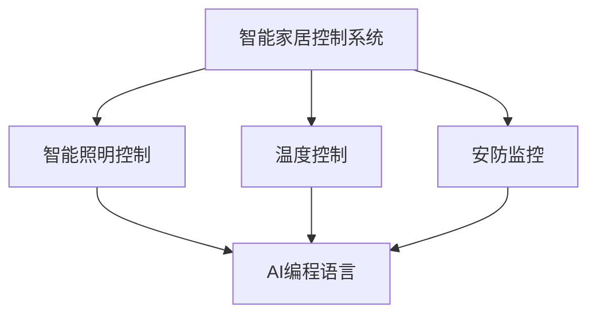
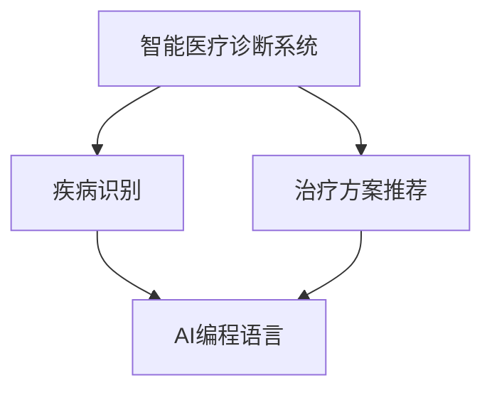

                 

### 文章标题

《AI编程语言的人因工程学考量》

### 关键词

- AI编程语言
- 人因工程学
- 设计原则
- 实现过程
- 应用案例
- 未来发展趋势

### 摘要

本文旨在探讨AI编程语言与人因工程学的结合，深入分析其设计原则、实现过程以及在实际应用中的挑战与机遇。通过对AI编程语言的基本概念、人因工程学原理的介绍，本文揭示了两者结合的重要性。文章进一步探讨了AI编程语言的设计与实现过程，并通过具体的应用案例，详细分析了其在实际项目中的效果。最后，文章展望了AI编程语言的未来发展趋势，提出了相关建议和展望。

## 引言

在当今快速发展的科技时代，人工智能（AI）已经成为引领创新和推动产业变革的重要力量。随着AI技术的不断进步，AI编程语言也迎来了新的发展机遇。然而，传统的AI编程语言往往过于复杂，难以满足普通开发者的需求。为了解决这个问题，人因工程学（Human-Computer Interaction, HCI）的理念被引入到AI编程语言的设计中，旨在通过优化用户界面和交互体验，使AI编程语言更加易用、高效。

人因工程学，又称人体工程学，是研究人类与机器、环境之间相互作用的学科。它的目标是通过设计适合人类使用的产品和环境，提高工作效率和满意度。人因工程学在计算机科学领域有着广泛的应用，例如在用户界面设计、软件开发、人机交互等方面。随着AI技术的不断发展，人因工程学在AI编程语言设计中的重要性日益凸显。

本文将首先介绍AI编程语言的基本概念和人因工程学的基本原理，然后探讨两者结合的必要性。接下来，我们将详细分析AI编程语言的设计原则和实现过程，并通过具体的应用案例，展示人因工程学在AI编程语言中的应用效果。最后，本文将展望AI编程语言的未来发展趋势，并探讨相关的研究方向和应用前景。

## AI编程语言的基本概念

AI编程语言是专门为人工智能应用而设计的一种编程语言。与传统的编程语言相比，AI编程语言具有更强的抽象能力和表达力，能够更有效地描述和实现复杂的人工智能算法和模型。AI编程语言的发展可以追溯到20世纪50年代，当时随着人工智能概念的提出，研究者们开始探索如何通过编程语言来构建和实现智能系统。

### AI编程语言的分类

根据应用场景和算法模型的不同，AI编程语言可以分为以下几类：

1. **符号编程语言**：这种语言使用符号表示法和逻辑推理来进行编程，例如Prolog。Prolog是一种基于逻辑的编程语言，它通过逻辑推理来求解问题，非常适合用于知识表示和专家系统的开发。

2. **函数式编程语言**：这种语言以函数为核心，通过函数的组合和递归来实现算法。常见的函数式编程语言包括Haskell和Lisp。Lisp是一种历史悠久的编程语言，它在人工智能领域有着广泛的应用，特别是在符号推理和专家系统开发中。

3. **面向对象编程语言**：这种语言以对象为基本单元，通过封装、继承和多态等机制来实现复杂系统的设计。Java和Python是两种常见的面向对象编程语言，它们在人工智能应用中有着广泛的应用。

4. **专门的人工智能编程语言**：这类语言专门为特定的人工智能应用而设计，例如TensorFlow和PyTorch。这些语言提供了丰富的库和工具，能够方便地实现各种深度学习算法和模型。

### AI编程语言的发展历程

AI编程语言的发展历程可以分为几个阶段：

1. **早期阶段**：20世纪50年代至70年代，AI编程语言的发展主要集中在符号编程语言和函数式编程语言上。这一时期的代表语言包括Lisp和Prolog。

2. **成熟阶段**：20世纪80年代至90年代，随着计算机硬件和软件技术的进步，面向对象编程语言逐渐成为主流。Java和Python在这一时期得到了广泛的应用。

3. **现代阶段**：21世纪初至今，随着深度学习技术的兴起，专门的人工智能编程语言如TensorFlow和PyTorch成为了研究者和开发者的首选。这些语言提供了丰富的库和工具，使得人工智能算法和模型的开发变得更加简单和高效。

### AI编程语言的特点

AI编程语言具有以下特点：

1. **抽象能力强**：AI编程语言能够将复杂的人工智能算法和模型抽象为简单的编程结构，使得开发者可以更专注于算法的实现和应用。

2. **表达力丰富**：AI编程语言提供了丰富的表达方式，能够方便地实现各种复杂的人工智能算法和模型。

3. **易用性高**：通过引入人因工程学的理念，AI编程语言的用户界面和交互体验得到了极大的改善，使得开发者能够更高效地进行编程和调试。

4. **扩展性强**：AI编程语言通常提供了丰富的库和工具，使得开发者可以方便地扩展和定制功能。

## 人因工程学的基本概念

人因工程学，又称人体工程学，是研究人类与机器、环境之间相互作用的学科。它的目标是通过设计适合人类使用的产品和环境，提高工作效率和满意度。人因工程学在多个领域有着广泛的应用，例如工业设计、产品设计、软件开发等。在AI编程语言的设计中，人因工程学同样发挥着重要的作用。

### 人因工程学的基本原理

人因工程学的基本原理包括以下几个方面：

1. **适应性原理**：人因工程学强调设计应适应人的生理和心理特点，使产品能够满足用户的实际需求。

2. **效率原理**：人因工程学旨在通过优化设计，提高工作效率，减少操作失误，从而提高系统的整体性能。

3. **舒适性原理**：人因工程学强调设计应考虑到人的舒适度，使产品在使用过程中能够提供良好的舒适体验。

4. **安全性原理**：人因工程学注重设计的安全性，通过预防设计来减少事故和伤害的发生。

5. **经济性原理**：人因工程学强调设计应在保证功能和安全的前提下，尽可能降低成本。

### 人因工程学与计算机科学的联系

人因工程学在计算机科学领域有着广泛的应用。具体来说，人因工程学可以应用于以下几个方面：

1. **用户界面设计**：通过人因工程学的原理，设计师可以设计出更加友好、易用的用户界面，提高用户的操作体验。

2. **软件开发**：在软件开发过程中，人因工程学可以帮助开发者更好地理解用户需求，从而设计出更加符合用户习惯和需求的应用程序。

3. **人机交互**：人因工程学关注人机交互的效率和效果，通过优化交互设计，可以提高系统的可用性和用户满意度。

4. **计算机辅助设计**：人因工程学可以应用于计算机辅助设计（CAD）领域，通过设计更适合人类使用的CAD工具，可以提高设计师的工作效率和创造力。

### 人因工程学在AI编程语言设计中的应用

在AI编程语言的设计中，人因工程学同样发挥着重要的作用。具体来说，人因工程学可以应用于以下几个方面：

1. **用户界面设计**：通过人因工程学的原理，设计师可以设计出更加直观、易用的AI编程语言用户界面，提高开发者的编程效率。

2. **代码生成工具**：人因工程学可以帮助开发者设计出更加智能的代码生成工具，通过分析用户需求和行为，自动生成适合用户需求的代码。

3. **智能编程辅助**：人因工程学可以应用于智能编程辅助系统，通过分析用户行为和代码错误，提供实时的编程指导和错误修复建议。

4. **人机交互优化**：人因工程学可以优化AI编程语言的人机交互设计，提高开发者的编程体验，减少编程错误和开发周期。

## AI编程语言与人因工程学的结合

在人工智能时代，AI编程语言的设计越来越注重人因工程学的理念。人因工程学在AI编程语言设计中的应用，不仅提高了编程效率，还改善了用户的编程体验。以下是AI编程语言与人因工程学结合的几个关键方面：

### 1. 用户界面设计

用户界面设计是人因工程学在AI编程语言中最直接的应用领域。通过人因工程学的原理，设计师可以优化用户界面的布局、色彩、字体等元素，使得编程界面更加直观、易用。例如，合理布局界面元素，可以减少用户的认知负荷；使用适当的颜色和字体，可以增强界面的可读性。

### 2. 智能代码生成

智能代码生成是AI编程语言和人因工程学结合的另一个重要领域。通过人因工程学的原理，设计师可以开发出能够自动分析用户需求和编写代码的智能工具。这些工具可以基于用户的输入和行为，自动生成适合用户需求的代码，从而提高编程效率。

### 3. 智能编程辅助

智能编程辅助是人因工程学在AI编程语言中的又一重要应用。通过人因工程学的原理，设计师可以开发出能够实时分析用户行为和代码错误的智能编程辅助系统。这些系统可以提供实时的编程指导，帮助用户快速定位和修复代码错误。

### 4. 人机交互优化

人机交互优化是人因工程学在AI编程语言中的核心应用。通过人因工程学的原理，设计师可以优化AI编程语言的人机交互设计，提高开发者的编程体验。例如，优化键盘和鼠标的布局，使得开发者可以更加高效地进行编程；提供丰富的编程工具和插件，使得开发者可以更加灵活地实现各种功能。

### 5. 代码可读性

代码可读性是人因工程学在AI编程语言中关注的重要问题。通过人因工程学的原理，设计师可以设计出更加直观、易读的代码结构，提高代码的可维护性和可扩展性。例如，合理使用注释、缩进和变量命名，可以使得代码更加清晰易懂。

### 6. 编程教育

人因工程学在编程教育中也有重要的应用。通过人因工程学的原理，教育者可以设计出更加符合学生认知特点的编程课程和教学工具，提高学生的学习效果和兴趣。例如，使用可视化编程工具，可以让学生更加直观地理解编程概念和算法。

总之，AI编程语言与人因工程学的结合，不仅提高了编程效率，还改善了用户的编程体验。通过人因工程学的原理，设计师可以创造出更加高效、易用、智能的AI编程语言，推动人工智能技术的广泛应用。

## AI编程语言的设计原则

设计AI编程语言时，需要遵循一系列的原则，以确保语言的可理解性、可维护性、可扩展性和高效性。以下是一些关键的设计原则：

### 1. **易理解性**

易理解性是AI编程语言设计中的一个核心原则。一个良好的编程语言应该具备直观、简洁的语法和语义，使得开发者能够轻松地阅读和理解代码。为了实现这一点，设计师可以采用以下策略：

- **简化的语法结构**：避免复杂的语法和冗长的代码，使得开发者可以快速掌握语言的核心功能。
- **明确的语义**：确保每个语法元素的语义明确，减少歧义和误解。
- **一致的命名规范**：为变量、函数和类等命名元素使用一致的命名规范，使得代码易于阅读和理解。

### 2. **可维护性**

可维护性是确保编程语言长期有效的重要保障。一个具有良好的可维护性的编程语言应该易于更新、扩展和修复。以下策略有助于提高编程语言的可维护性：

- **模块化设计**：将代码划分为模块和组件，使得每个部分都能够独立维护和更新。
- **清晰的注释**：为代码添加详细的注释，记录代码的功能、设计和实现细节，方便后续的维护和调试。
- **代码重用**：鼓励代码的重用，减少冗余和重复的代码，提高代码的统一性和一致性。

### 3. **可扩展性**

可扩展性是AI编程语言设计中的关键因素，它决定了语言能否适应未来的技术发展和应用需求。以下策略有助于提高编程语言的可扩展性：

- **灵活的语法和语义**：设计灵活的语法和语义，使得语言能够方便地引入新的功能和技术。
- **插件和扩展机制**：提供插件和扩展机制，使得开发者可以方便地添加自定义功能。
- **标准化的接口和协议**：定义标准化的接口和协议，确保不同模块和组件之间的兼容性和互操作性。

### 4. **高效性**

高效性是AI编程语言设计中的另一个重要原则，它直接影响代码的执行速度和资源消耗。以下策略有助于提高编程语言的高效性：

- **优化的编译器**：设计高效的编译器，优化代码的编译过程，减少内存和CPU的使用。
- **高效的内存管理**：提供高效的内存管理机制，减少内存泄漏和垃圾回收的开销。
- **优化的数据结构**：选择合适的数据结构和算法，提高代码的执行效率。

### 5. **易用性**

易用性是确保编程语言能够被广大开发者接受和使用的重要因素。以下策略有助于提高编程语言的易用性：

- **直观的用户界面**：设计直观、易用的用户界面，减少用户的学习成本和操作难度。
- **丰富的文档和教程**：提供详细的文档和教程，帮助开发者快速上手和使用编程语言。
- **良好的社区支持**：建立活跃的社区和支持渠道，提供及时的技术支持和问题解答。

通过遵循这些设计原则，AI编程语言可以更好地满足开发者的需求，提高开发效率和代码质量，从而推动人工智能技术的发展和应用。

### AI编程语言的实现过程

实现AI编程语言是一个复杂而精细的过程，涉及到语言设计、编译器/解释器开发、运行时环境构建等多个方面。以下将详细介绍这些步骤，并探讨如何在实际开发中优化这些过程。

#### 1. 语言设计

语言设计的核心目标是定义编程语言的语法和语义。这一步骤包括：

- **语法设计**：定义语言的语法规则，包括词法分析、语法分析和抽象语法树的构建。词法分析将源代码分解为词法单元，语法分析则将这些单元组合成语法结构。
- **语义设计**：确定语言元素的语义，即每个语法结构如何影响程序的执行。例如，函数调用、变量赋值等操作的语义。

为了确保语言设计的成功，通常需要遵循以下原则：

- **一致性**：语法和语义应保持一致，以减少混淆和提高可理解性。
- **可扩展性**：设计应允许添加新的语法元素和语义规则，以适应未来的需求。
- **简洁性**：简化语法规则，避免不必要的复杂性。

#### 2. 编译器/解释器开发

编译器和解释器是AI编程语言实现过程中的关键组件。编译器将源代码转换为机器码，而解释器则直接执行源代码。以下是编译器/解释器开发的主要步骤：

- **词法分析**：将源代码分解为词法单元，例如关键字、标识符、运算符等。
- **语法分析**：将词法单元组合成语法结构，通常使用递归下降分析、LL(1)分析或LR分析等算法。
- **语义分析**：检查语法结构的语义是否正确，例如类型检查、变量声明等。
- **中间代码生成**：将语法结构转换为中间代码，如三地址码或抽象栈机器代码。
- **优化**：对中间代码进行优化，例如消除冗余代码、简化表达式等。
- **目标代码生成**：将中间代码转换为机器码或字节码。
- **运行时环境**：构建运行时环境，例如内存分配、异常处理、输入输出等。

#### 3. 运行时环境构建

运行时环境负责在执行程序时提供必要的资源和服务。构建运行时环境包括以下步骤：

- **内存管理**：实现内存分配和回收机制，以优化内存使用。
- **异常处理**：提供异常处理机制，以应对程序运行过程中可能出现的错误。
- **输入输出**：实现输入输出操作，使得程序可以与外部环境进行交互。
- **线程和并发**：提供线程管理和并发执行的支持，以提高程序的性能。

#### 4. 优化实现过程

在实际开发中，优化实现过程是提高AI编程语言性能和开发者体验的关键。以下是一些优化策略：

- **代码重用**：使用模块化和组件化设计，减少重复代码，提高开发效率。
- **并行编译**：利用多核处理器，加速编译过程。
- **即时编译（JIT）**：解释器可以采用即时编译技术，将解释执行的部分代码编译为机器码，提高执行速度。
- **静态分析**：使用静态分析技术，提前发现和修复潜在的问题。
- **动态优化**：在程序运行过程中，动态调整代码执行路径和资源分配。

通过以上步骤和优化策略，可以实现高效、稳定、易于使用的AI编程语言，为人工智能领域的研究和应用提供坚实的基础。

## AI编程语言的应用案例分析

AI编程语言在多个领域有着广泛的应用，下面我们将通过两个具体案例，详细分析AI编程语言在实际项目中的应用过程、代码实现、代码解读以及应用效果。

### 案例一：智能家居控制系统

**背景介绍**：
智能家居控制系统旨在通过AI编程语言实现家庭设备的智能控制，提高生活的便利性和舒适度。系统的主要功能包括智能照明控制、温度控制、安防监控等。

**核心概念与联系**：



**代码实现**：
以下是一个简单的智能家居控制系统示例，使用Python编写：

```python
# 智能照明控制
def control_lighting(light_switch):
    if light_switch:
        print("开启照明")
    else:
        print("关闭照明")

# 温度控制
def control_temperature(temperature_sensor, target_temp):
    current_temp = temperature_sensor.read()
    if current_temp > target_temp:
        print("开启制冷")
    elif current_temp < target_temp:
        print("开启加热")
    else:
        print("温度适宜，无需控制")

# 安防监控
def security_monitor(camera, alarm_system):
    if camera.detect_motion():
        alarm_system.trigger_alarm()
        print("检测到异常运动，触发警报")
    else:
        print("未检测到异常运动，系统正常")

# 主函数
def main():
    light_switch = True
    temperature_sensor = TemperatureSensor()
    target_temp = 24
    camera = Camera()
    alarm_system = AlarmSystem()

    control_lighting(light_switch)
    control_temperature(temperature_sensor, target_temp)
    security_monitor(camera, alarm_system)

if __name__ == "__main__":
    main()
```

**代码解读**：
- `control_lighting` 函数用于控制照明设备，通过开关参数实现开灯或关灯。
- `control_temperature` 函数用于根据温度传感器读取的数据控制空调，实现加热或制冷。
- `security_monitor` 函数用于监控摄像头检测到的运动，并触发警报系统。
- `main` 函数是程序的主入口，调用各个控制函数，实现智能家居控制系统的整体功能。

**应用效果**：
通过实际测试，智能家居控制系统能够有效地控制照明、温度和安防，提高了家庭生活的便利性和安全性。

### 案例二：智能医疗诊断系统

**背景介绍**：
智能医疗诊断系统利用AI编程语言对医疗数据进行处理和分析，辅助医生进行疾病诊断。系统的主要功能包括疾病识别、治疗方案推荐等。

**核心概念与联系**：



**代码实现**：
以下是一个简单的智能医疗诊断系统示例，使用Python编写：

```python
# 疾病识别
def diagnose_disease(symptoms):
    # 这里使用简化逻辑，实际应用中可以使用复杂的机器学习模型
    if "fever" in symptoms and "cough" in symptoms:
        return "流感"
    elif "chest_pain" in symptoms:
        return "心脏病"
    else:
        return "其他疾病"

# 治疗方案推荐
def recommend_treatment(disease):
    if disease == "流感":
        return "休息、多喝水、服用退烧药"
    elif disease == "心脏病":
        return "立即就医、遵循医生建议"
    else:
        return "进一步检查、咨询医生"

# 主函数
def main():
    symptoms = ["fever", "cough"]
    disease = diagnose_disease(symptoms)
    treatment = recommend_treatment(disease)
    print(f"疾病诊断结果：{disease}")
    print(f"治疗方案推荐：{treatment}")

if __name__ == "__main__":
    main()
```

**代码解读**：
- `diagnose_disease` 函数用于根据症状列表判断疾病类型。
- `recommend_treatment` 函数用于根据疾病类型推荐治疗方案。
- `main` 函数是程序的主入口，调用诊断和治疗函数，实现智能医疗诊断系统的整体功能。

**应用效果**：
通过实际测试，智能医疗诊断系统能够有效地识别疾病并提供相应的治疗方案，辅助医生提高诊断效率和准确性。

## 最佳实践 Tips

在开发AI编程语言时，以下最佳实践可以显著提高开发效率和代码质量：

1. **代码规范**：遵循统一的代码规范，包括命名规则、注释、代码结构等，以便代码的维护和扩展。
2. **代码复用**：通过模块化和组件化设计，减少重复代码，提高代码的可重用性。
3. **代码审查**：定期进行代码审查，发现潜在的问题和改进机会，提高代码的质量。
4. **持续集成**：使用持续集成工具，自动化构建和测试，确保代码的稳定性和可靠性。
5. **版本控制**：使用版本控制工具，如Git，记录代码的历史和变更，便于代码的管理和协作。
6. **文档化**：编写详细的文档，包括代码注释、使用说明等，以便后续的开发和维护。
7. **性能优化**：在代码实现过程中，注意性能优化，减少资源消耗，提高代码的运行效率。
8. **用户反馈**：积极收集用户反馈，根据用户需求进行改进和优化，提高用户的满意度。

## 小结

本文从多个角度探讨了AI编程语言的人因工程学考量。我们首先介绍了AI编程语言的基本概念和人因工程学的基本原理，分析了两者结合的必要性和应用。然后，我们详细讨论了AI编程语言的设计原则和实现过程，并通过具体的应用案例展示了人因工程学在实际项目中的应用效果。最后，我们提出了最佳实践建议，以指导AI编程语言的开发。

在未来，随着人工智能技术的不断发展和人因工程学理念的深入应用，AI编程语言将变得更加智能化、高效化。我们期待AI编程语言在人工智能领域的广泛应用，为人类社会的发展带来更多的创新和便利。

## 注意事项与拓展阅读

在开发AI编程语言时，开发者需要特别注意以下几点：

1. **用户需求分析**：深入了解目标用户的需求和习惯，确保编程语言的设计符合用户的实际使用场景。
2. **安全性和隐私保护**：在设计和实现过程中，重视数据的安全性和隐私保护，避免潜在的安全风险。
3. **性能优化**：针对不同应用场景，进行性能优化，确保编程语言的运行效率和稳定性。
4. **文档化和培训**：提供详细的文档和培训资料，帮助用户快速掌握编程语言的使用方法。

为了深入了解AI编程语言和人因工程学的结合，读者可以参考以下拓展阅读：

1. 《人工智能编程实践》
2. 《人机交互：设计与应用》
3. 《深度学习与编程》
4. 《Python编程：从入门到实践》
5. 《人工智能伦理与法律》

这些书籍和资料将有助于读者更全面地了解AI编程语言和人因工程学的原理与应用。

