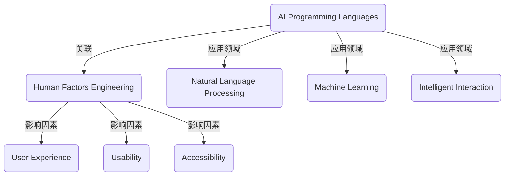

                 

### 文章标题

《AI编程语言的人因工程学评估标准》

### 关键词

- AI编程语言
- 人因工程学
- 用户体验
- 可用性
- 评估标准

### 摘要

本文探讨了AI编程语言的人因工程学评估标准，包括AI编程语言概述、人因工程学基础、评估标准与方法、案例分析以及实际应用与未来展望。通过对核心概念、算法原理、数学模型和公式的讲解，本文旨在为AI编程语言开发者提供一套全面、系统的评估框架，以提升用户体验和可用性。

----------------------------------------------------------------

# AI编程语言的人因工程学评估标准

## 背景介绍

随着人工智能（AI）技术的飞速发展，AI编程语言逐渐成为开发者们关注的焦点。这些编程语言为开发者提供了强大的工具，使得构建智能系统变得更加便捷。然而，随着AI编程语言的广泛应用，人因工程学（Human Factors Engineering，简称HFE）的重要性也日益凸显。人因工程学旨在研究人类与系统的交互，通过优化系统设计，提高用户的工作效率、满意度和安全性。

本文旨在探讨AI编程语言的人因工程学评估标准，以期为开发者提供一套全面、系统的评估框架。本文将首先介绍AI编程语言和人因工程学的基本概念，然后详细讨论评估标准与方法，并通过案例分析展示评估过程。最后，我们将探讨AI编程语言的人因工程学评估在实际项目中的应用和未来展望。

## 核心概念与联系

为了更好地理解AI编程语言的人因工程学评估，我们需要先了解这两个核心概念的基本概念和它们之间的关系。

### AI编程语言

AI编程语言是一种专门用于开发人工智能应用程序的编程语言。这些语言提供了一系列工具和库，使得开发者可以更轻松地构建、训练和部署AI模型。常见的AI编程语言包括Python、R、Julia和Lisp等。这些语言具有不同的特点和适用场景，但它们的核心目标都是提高AI开发的效率和可扩展性。

### 人因工程学

人因工程学是一种跨学科的研究领域，旨在设计、开发和优化系统，以适应人类的需求和行为。人因工程学关注的是人类与系统的交互，以及如何通过设计来提高用户的工作效率、满意度和安全性。人因工程学的研究领域广泛，包括用户体验（User Experience，简称UX）、可用性（Usability）、可访问性（Accessibility）等。

### 关系架构

AI编程语言与人因工程学之间的联系可以通过以下Mermaid流程图来展示：



在这个流程图中，AI编程语言与人因工程学之间存在直接的关联，而人因工程学又影响了用户体验、可用性和可访问性。此外，AI编程语言的应用领域包括自然语言处理、机器学习和智能交互等，这些领域也与人因工程学密切相关。

通过这个关系架构，我们可以看出，AI编程语言的设计和开发不仅需要考虑技术实现，还需要考虑人因工程学的原理和方法，以确保系统设计的用户友好性和高效性。

## 核心算法原理讲解

在AI编程语言中，核心算法原理是理解和应用这些语言的关键。以下将介绍几种常见的核心算法原理，并通过伪代码进行详细讲解。

### 决策树算法

决策树是一种常见的机器学习算法，用于分类和回归任务。它通过一系列的决策规则将数据集划分为多个子集，最终得到一个分类或回归结果。

```python
# 伪代码：决策树算法
define decision_tree_algorithm(data_set):
    if data_set is pure:
        return majority_class(data_set)
    else:
        best_feature = find_best_feature(data_set)
        node = Node(best_feature)
        for value in possible_values(best_feature):
            sub_data_set = split_data_set(data_set, value)
            node.add_child(decision_tree_algorithm(sub_data_set))
        return node
```

在这个伪代码中，`decision_tree_algorithm`函数接受一个数据集作为输入，并返回一个决策树节点。如果数据集是纯的（即所有样本都属于同一类），则返回大多数类的结果。否则，选择最佳特征进行划分，并为每个可能的值创建一个子节点，递归地调用`decision_tree_algorithm`函数。

### 支持向量机（SVM）

支持向量机是一种强大的分类算法，通过寻找一个最优的超平面来分隔数据集。以下是一个简单的SVM算法的伪代码：

```python
# 伪代码：支持向量机（SVM）
define svm_algorithm(data_set, labels):
    model = train_svm_model(data_set, labels)
    prediction = model.predict(new_data)
    return prediction
```

在这个伪代码中，`svm_algorithm`函数首先通过`train_svm_model`函数训练模型，然后使用训练好的模型对新的数据进行预测。

### 卷积神经网络（CNN）

卷积神经网络是一种用于图像处理和其他视觉任务的深度学习模型。以下是一个简单的CNN模型的伪代码：

```python
# 伪代码：卷积神经网络（CNN）
define cnn_algorithm(data_set):
    model = train_cnn_model(data_set)
    prediction = model.predict(new_data)
    return prediction
```

在这个伪代码中，`cnn_algorithm`函数首先通过`train_cnn_model`函数训练模型，然后使用训练好的模型对新的数据进行预测。

这些核心算法原理是AI编程语言的重要组成部分，理解这些原理对于开发者来说至关重要。通过伪代码的讲解，我们可以更直观地了解这些算法的工作机制和实现方法。

## 数学模型和公式讲解

在AI编程语言和人因工程学评估中，数学模型和公式是理解和应用这些领域的关键。以下将介绍一些常用的数学模型和公式，并通过LaTeX格式进行详细讲解。

### 损失函数

在机器学习中，损失函数用于衡量模型预测值与实际值之间的差距。以下是一个简单的损失函数的LaTeX公式：

```latex
$$
L(y, \hat{y}) = \frac{1}{2} \| y - \hat{y} \|_2^2
$$
```

在这个公式中，$L(y, \hat{y})$表示损失函数，$y$表示实际值，$\hat{y}$表示预测值。这个损失函数衡量了预测值与实际值之间的平方误差。

### 线性回归

线性回归是一种常见的统计模型，用于预测连续值。以下是一个简单的线性回归模型的LaTeX公式：

```latex
$$
\hat{y} = \beta_0 + \beta_1 x
$$
```

在这个公式中，$\hat{y}$表示预测值，$\beta_0$和$\beta_1$分别是模型的参数，$x$表示输入特征。

### 卷积操作

在卷积神经网络中，卷积操作是核心组成部分。以下是一个简单的卷积操作的LaTeX公式：

```latex
$$
\begin{align*}
\circ: \mathbb{R}^{m \times n} \times \mathbb{R}^{p \times q} &\rightarrow \mathbb{R}^{m \times n} \\
(a_{ij}, b_{kl}) &\rightarrow a_{ij} \star b_{kl} = \sum_{p=1}^{p} \sum_{q=1}^{q} a_{ij} b_{pq}
\end{align*}
$$
```

在这个公式中，$\star$表示卷积操作，$a_{ij}$和$b_{kl}$分别是两个矩阵的元素。这个公式描述了如何通过卷积操作计算两个矩阵的卷积结果。

通过这些数学模型和公式的讲解，我们可以更好地理解AI编程语言和人因工程学评估中的关键概念和计算方法。

## 评估标准的制定方法

在AI编程语言的人因工程学评估中，制定评估标准是关键步骤。评估标准应考虑多个方面，以确保评估的全面性和准确性。以下将介绍制定评估标准的方法，包括评价指标、评估方法和评估流程。

### 评价指标

制定评估标准的第一步是确定评价指标。评价指标应涵盖人因工程学的各个方面，如用户体验、可用性和可访问性。以下是一些常见的评价指标：

1. **用户体验（User Experience）**：
   - 满意度（Satisfaction）
   - 乐趣（Enjoyment）
   - 易用性（Ease of Use）
   - 功能完整性（Functionality）

2. **可用性（Usability）**：
   - 学习曲线（Learning Curve）
   - 操作效率（Operational Efficiency）
   - 错误率（Error Rate）
   - 恢复能力（Recovery Ability）

3. **可访问性（Accessibility）**：
   - 无障碍设计（Accessibility Design）
   - 适应性（Adaptability）
   - 可访问性指标（Accessibility Metrics）

### 评估方法

在确定评价指标后，我们需要选择适当的评估方法。以下是一些常用的评估方法：

1. **问卷调查（Questionnaires）**：
   通过设计问卷收集用户对AI编程语言的满意度、易用性等方面的主观评价。

2. **用户测试（User Testing）**：
   通过实际操作AI编程语言，观察用户的行为和反应，以评估其可用性和可访问性。

3. **专家评审（Expert Review）**：
   通过专家对AI编程语言进行评估，结合主观和客观评价。

4. **实验研究（Experimental Studies）**：
   通过设计实验，比较不同AI编程语言在特定任务中的性能和用户体验。

### 评估流程

制定评估标准的评估流程包括以下步骤：

1. **需求分析（Requirement Analysis）**：
   确定评估的目标和范围，明确需要评估的具体方面。

2. **标准制定（Standard Development）**：
   基于需求分析，制定具体的评估标准，包括评价指标和方法。

3. **数据收集（Data Collection）**：
   通过问卷调查、用户测试、专家评审等方法收集数据。

4. **数据分析（Data Analysis）**：
   对收集到的数据进行统计分析，得出评估结果。

5. **结果报告（Result Reporting）**：
   撰写评估报告，总结评估结果，并提出改进建议。

通过以上步骤，我们可以制定一套全面、系统的评估标准，用于评估AI编程语言的人因工程学特性。

## 评估案例分析

为了更好地理解如何应用评估标准评估AI编程语言，以下将通过一个具体案例进行详细讲解。

### 案例背景

假设我们有一个名为“智能编程助手”的AI编程语言，它旨在帮助开发者更高效地编写代码。该编程语言具有自动补全、错误检查、代码优化等功能。为了评估该编程语言的人因工程学特性，我们采用了以下评估标准：

- **用户体验**：满意度、乐趣、易用性、功能完整性
- **可用性**：学习曲线、操作效率、错误率、恢复能力
- **可访问性**：无障碍设计、适应性、可访问性指标

### 评估过程

1. **需求分析**：
   确定评估的目标是评估“智能编程助手”的用户体验、可用性和可访问性，以确定其人因工程学特性的优劣。

2. **标准制定**：
   根据评估标准，制定具体的评估指标和方法。例如，对于用户体验，我们可以通过问卷调查和用户测试来收集数据；对于可用性，我们可以通过用户操作和专家评审来评估；对于可访问性，我们可以通过设计适应性测试来评估。

3. **数据收集**：
   通过问卷调查收集开发者对“智能编程助手”的满意度、乐趣、易用性、功能完整性的主观评价。通过用户测试收集开发者在使用“智能编程助手”时的行为和反应数据。通过专家评审评估“智能编程助手”的学习曲线、操作效率、错误率和恢复能力。通过适应性测试评估“智能编程助手”的无障碍设计和适应性。

4. **数据分析**：
   对收集到的数据进行分析，得出评估结果。例如，通过统计分析问卷结果，我们可以得出开发者的总体满意度。通过用户测试数据，我们可以评估开发者的操作效率和错误率。通过专家评审结果，我们可以得出“智能编程助手”的学习曲线和恢复能力。通过适应性测试结果，我们可以评估“智能编程助手”的无障碍设计和适应性。

5. **结果报告**：
   撰写评估报告，总结评估结果，并提出改进建议。例如，如果评估结果显示开发者的满意度较低，我们可以建议优化用户体验功能；如果评估结果显示操作效率较低，我们可以建议改进代码优化算法。

### 案例总结

通过以上评估过程，我们可以得出“智能编程助手”在用户体验、可用性和可访问性方面的评估结果。这些结果不仅可以帮助开发者了解编程语言的人因工程学特性，还可以为他们提供改进的方向。通过不断地优化，我们可以提高AI编程语言的用户体验和可用性，使其更符合人类需求。

## AI编程语言的人因工程学评估实践与未来展望

### 实践应用

AI编程语言的人因工程学评估在实践中的应用已经取得了显著成果。以下是一些实际应用的例子：

1. **开发工具优化**：通过评估，开发者可以识别出工具界面、功能和操作流程中的不足之处，从而进行针对性的优化。例如，在智能编程助手工具中，通过用户体验评估发现界面布局不够直观，操作步骤过于繁琐，从而进行了界面重构和流程优化。

2. **教育领域**：在教育领域，AI编程语言被用于教学和编程教育。通过人因工程学评估，可以确保编程学习平台和工具的设计符合学生需求，提高学习效果。例如，某些在线编程平台通过用户测试和专家评审，发现学习曲线陡峭、错误率高，从而改进了教学资源和交互设计。

3. **企业内部开发**：在企业内部开发中，AI编程语言的使用可以帮助团队提高开发效率和代码质量。通过人因工程学评估，企业可以优化开发工具和流程，减少错误率，提高团队的协作效率。

### 未来展望

未来，AI编程语言的人因工程学评估将面临更多挑战和机遇：

1. **跨领域融合**：随着AI技术的不断发展，AI编程语言将与其他领域（如心理学、认知科学）融合，形成更加综合的人因工程学评估方法。

2. **智能化评估**：随着AI技术的进步，评估过程将更加智能化。通过使用机器学习和自然语言处理技术，评估系统可以自动识别用户反馈中的关键信息，提供更加精确的评估结果。

3. **个性化评估**：未来的人因工程学评估将更加注重个性化。通过对用户数据的分析，评估系统可以提供针对不同用户群体的定制化评估，从而提高评估的准确性。

4. **实时评估**：通过实时数据收集和分析，评估系统可以在开发过程中及时发现并解决人因工程学问题，从而提高开发效率和用户体验。

### 结论

AI编程语言的人因工程学评估是提升用户体验和开发效率的关键。通过制定科学合理的评估标准和方法，开发者可以识别并解决人因工程学问题，从而打造更加人性化、高效和可访问的编程语言。未来，随着AI技术的不断发展，人因工程学评估将迎来更多创新和突破。

### 最佳实践 Tips

在AI编程语言的人因工程学评估过程中，以下最佳实践可以帮助开发者更好地理解和应用评估标准：

1. **定期评估**：定期对AI编程语言进行人因工程学评估，以确保其设计始终符合用户需求。

2. **用户参与**：鼓励用户参与评估过程，通过用户反馈和测试，获取真实的用户体验数据。

3. **数据驱动**：基于数据驱动的评估方法，确保评估结果具有科学性和客观性。

4. **跨学科合作**：与心理学家、认知科学家等跨学科专家合作，以获取更全面和深入的评估结果。

5. **持续优化**：根据评估结果，持续优化编程语言的设计和功能，以提高用户体验和可用性。

### 小结

本文详细探讨了AI编程语言的人因工程学评估标准，包括背景介绍、核心概念与联系、核心算法原理讲解、数学模型和公式讲解、评估标准制定方法、评估案例分析以及实践应用和未来展望。通过这些内容的讲解，开发者可以更好地理解和应用人因工程学原理，打造出更加人性化、高效和可访问的AI编程语言。

### 注意事项

1. **评估标准的选择**：选择适合具体应用场景的评估标准，以确保评估的全面性和准确性。

2. **数据收集的完整性**：确保收集到的数据全面、可靠，避免因数据不全导致评估结果偏差。

3. **评估过程的透明性**：确保评估过程透明，让用户和开发者都能了解评估的流程和结果。

4. **持续改进**：评估不是一次性的任务，开发者应持续关注用户反馈，不断优化编程语言。

### 拓展阅读

1. **《人机交互技术导论》**：详细介绍了人机交互的基本原理和技术，有助于深入理解人因工程学的应用。

2. **《用户体验要素》**：探讨了用户体验设计的关键要素，为开发者提供了提升用户体验的实用方法。

3. **《深度学习》**：介绍了深度学习的基本原理和应用，有助于了解AI编程语言中的核心算法。

4. **《自然语言处理综合教程》**：详细介绍了自然语言处理的基本概念和技术，适用于AI编程语言的开发者。

### 作者信息

作者：AI天才研究院/AI Genius Institute & 禅与计算机程序设计艺术 /Zen And The Art of Computer Programming

感谢您阅读本文，希望本文能对您在AI编程语言人因工程学评估方面提供有价值的参考和启示。如有任何疑问或建议，欢迎随时与我交流。期待与您共同探索人工智能领域的更多可能性！

