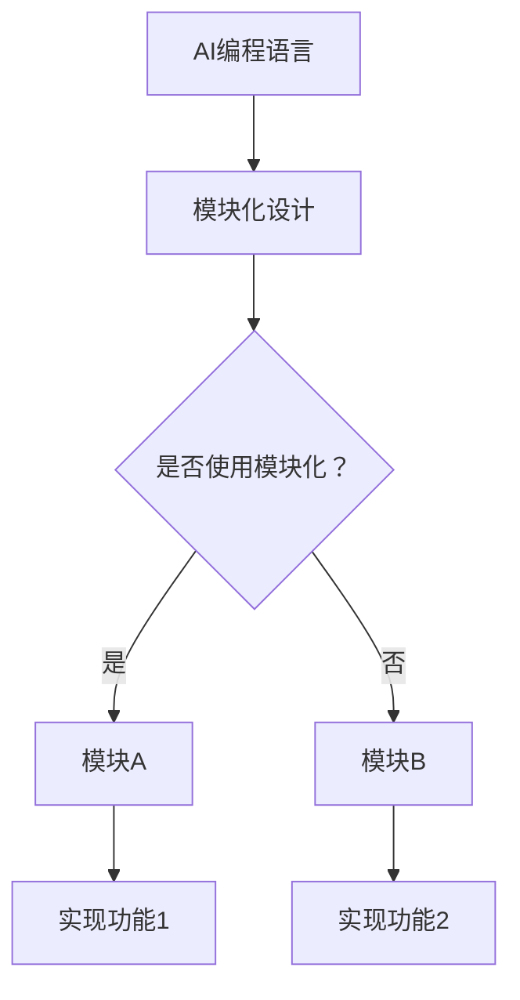

                 

### 文章标题

# 《AI编程语言的人机交互模式创新》

### 关键词

- AI编程语言
- 人机交互模式
- 创新型交互设计
- 人工智能应用
- 自然语言处理
- 计算机视觉

### 摘要

本文旨在探讨AI编程语言与人机交互模式的深度融合与创新。通过介绍AI编程语言的基本原理和核心概念，分析其在人机交互中的应用，本文深入探讨了创新型人机交互模式的实现方法及其在不同领域的应用。文章通过案例分析展示了AI编程语言与人机交互模式在实际项目中的成功应用，并对未来发展趋势进行了展望。本文旨在为IT专业人士和相关研究者提供有价值的参考，推动AI编程语言与人机交互模式的进一步发展。

---

## 第1章：引言

### 1.1 AI编程语言概述

AI编程语言是专门为人工智能应用设计的编程语言，旨在简化人工智能算法的实现和部署。这些语言不仅提供了丰富的内置函数和库，还通过特定的语法和结构支持高级人工智能算法，如机器学习、深度学习等。常见的AI编程语言包括Python、R、Prolog、Lisp和Julia等。

Python是当前最流行的AI编程语言之一，其简洁的语法和强大的库支持使得它成为人工智能开发者的首选。Python拥有广泛的AI库，如TensorFlow、PyTorch、Keras等，这些库提供了丰富的API和工具，使得开发者可以轻松地构建和训练复杂的AI模型。

R是一种专门用于统计分析的数据科学语言，它在数据可视化、统计建模和机器学习等领域有着广泛的应用。R拥有丰富的包生态系统，如ggplot2、dplyr和caret等，这些包为数据科学家提供了强大的工具。

Prolog是一种逻辑编程语言，它以基于逻辑的推理和知识表示而闻名。Prolog在自然语言处理、自动推理和规划等领域有着重要的应用。

Lisp是历史上最早的编程语言之一，它在人工智能领域有着深远的影响。Lisp提供了高度的可编程性和元编程能力，使得开发者可以创建自定义的编程语言和工具。

Julia是一种相对较新的编程语言，它旨在结合Python的易用性和C的性能。Julia在科学计算、数据分析和高性能计算领域有着广泛的应用。

### 1.2 人机交互模式的基础理论

人机交互（Human-Computer Interaction, HCI）是研究人与计算机之间交互的设计和理论的领域。HCI的目标是设计易于使用、高效且令人愉悦的计算机系统。人机交互模式是指用户与计算机系统之间进行交互的方式和流程。

基本的人机交互模式包括：

1. **命令行界面（CLI）**：CLI是一种基于文本的交互模式，用户通过输入命令来与计算机系统进行交互。CLI的优点是速度快、资源消耗低，但缺点是学习成本高、用户体验较差。

2. **图形用户界面（GUI）**：GUI提供了一种图形化的交互界面，使用图标、菜单和按钮等视觉元素来帮助用户与计算机系统进行交互。GUI的优点是直观易用、用户体验好，但缺点是系统资源消耗较大。

3. **触摸界面**：触摸界面利用触摸屏技术，用户通过手指触摸屏幕来与计算机系统进行交互。触摸界面在移动设备和触控桌面上得到了广泛应用。

4. **语音交互**：语音交互利用自然语言处理技术，用户通过语音命令来与计算机系统进行交互。语音交互在智能音箱、智能手机和智能助手等设备中得到了广泛应用。

5. **手势交互**：手势交互利用计算机视觉技术，用户通过手势动作来与计算机系统进行交互。手势交互在增强现实（AR）和虚拟现实（VR）应用中得到了广泛应用。

### 1.3 AI编程语言与人机交互的结合意义

AI编程语言与人机交互模式的结合具有重要意义，主要体现在以下几个方面：

1. **智能化交互**：AI编程语言可以为计算机系统提供智能化的人机交互能力，如智能助手、聊天机器人等。通过自然语言处理、语音识别和计算机视觉等技术，AI编程语言可以理解用户的意图并做出相应的响应。

2. **个性化体验**：AI编程语言可以根据用户的行为和偏好，提供个性化的交互体验。例如，智能推荐系统可以根据用户的浏览历史和喜好，推荐相关的商品或内容。

3. **自动化任务处理**：AI编程语言可以自动化处理复杂的交互任务，如自动化客服系统、智能语音助手等。这些系统能够快速响应用户需求，提高工作效率。

4. **增强用户体验**：通过AI编程语言，可以设计出更加直观、便捷和高效的交互界面，提升用户的满意度。例如，语音交互和手势交互可以提供更加自然和直观的交互方式。

5. **降低开发门槛**：AI编程语言提供了丰富的库和工具，使得开发者可以更轻松地实现复杂的人机交互功能。开发者无需深入了解底层技术，即可快速构建高效的人机交互系统。

总的来说，AI编程语言与人机交互模式的结合不仅提升了计算机系统的智能化水平，还极大地改善了用户体验，为人工智能应用的发展提供了强大的动力。在接下来的章节中，我们将深入探讨AI编程语言的核心概念和在人机交互模式中的应用。

### 1.4 文章结构概述

本章作为引言部分，主要介绍了AI编程语言和人机交互模式的基础知识，为后续章节的深入探讨打下了基础。接下来，我们将分章节详细分析AI编程语言的核心概念、人机交互模式的创新实践、具体领域的应用、案例分析以及未来展望。

- **第2章**将解析AI编程语言的核心概念，包括基本原理和架构设计，并通过流程图展示核心概念之间的关系。
- **第3章**将探讨人机交互模式的创新实践，分析创新型交互模式的背景、分类和实现方法。
- **第4章**将探讨AI编程语言在自然语言处理、计算机视觉和机器人等领域的应用。
- **第5章**将通过具体案例分析，展示AI编程语言和人机交互模式在实际项目中的应用。
- **第6章**将展望AI编程语言和人机交互模式的未来发展趋势，探讨其在教育、医疗等领域的潜在应用。

通过这些章节的详细讨论，本文旨在全面深入地探讨AI编程语言与人机交互模式的深度融合与创新，为相关领域的研究和实践提供有价值的参考。

---

## 第2章：AI编程语言核心概念解析

### 2.1 AI编程语言的基本原理

AI编程语言之所以能够简化人工智能算法的实现和部署，主要依赖于其独特的原理和设计哲学。这些原理包括自动微分、动态内存管理、元编程等，使得AI编程语言在处理复杂计算任务时具备显著优势。

#### 自动微分

自动微分是AI编程语言的一项重要原理，它允许开发者自动计算函数的导数。这一原理在深度学习中尤为重要，因为深度学习模型需要通过反向传播算法不断调整参数，以优化模型性能。自动微分技术能够自动计算这些导数，极大地简化了开发者的工作。

伪代码示例：

```python
# 计算函数f(x)的导数
def gradient(f):
    df = f.derivative()
    return lambda x: df.evaluate(x)

# 示例函数
f = lambda x: x**2

# 计算导数
grad_f = gradient(f)
print(grad_f.evaluate(2))  # 输出：4
```

在这个示例中，`gradient`函数通过自动微分技术计算了函数`f(x) = x**2`的导数。开发者只需定义函数，自动微分技术会自动计算导数，无需手动编写复杂的求导代码。

#### 动态内存管理

动态内存管理是AI编程语言的核心特性之一，它允许程序在运行时动态分配和释放内存。这种特性对于处理大规模数据和复杂模型尤为重要，因为它能够有效利用系统资源，避免内存溢出和性能下降。

伪代码示例：

```python
# 动态分配内存
a = new_array([1, 2, 3])
print(a.size())  # 输出：3

# 动态释放内存
delete a
```

在这个示例中，`new_array`函数动态分配了一个包含三个元素的数组`a`，并打印出数组的大小。当不再需要数组时，使用`delete`函数释放内存，避免资源占用。

#### 元编程

元编程是AI编程语言的一项高级特性，它允许开发者编写可以编写代码的程序。这种特性在自定义AI库和工具开发中非常有用，因为它能够简化开发过程，提高开发效率。

伪代码示例：

```python
# 定义一个生成函数的函数
def make_function(x):
    return lambda y: x * y

# 使用元编程生成函数
func = make_function(2)
print(func.evaluate(3))  # 输出：6
```

在这个示例中，`make_function`函数通过元编程技术生成了一个新的函数，该函数将输入值乘以2。开发者无需手动编写具体函数，只需调用`make_function`函数即可生成所需函数。

### 2.2 人机交互模式在AI编程语言中的应用

AI编程语言不仅简化了人工智能算法的实现，还在人机交互模式中发挥了重要作用。通过结合自然语言处理、语音识别和计算机视觉等技术，AI编程语言能够为用户设计出智能化、直观易用的交互界面。

#### 自然语言处理

自然语言处理（Natural Language Processing, NLP）是AI编程语言在人机交互中应用的一个重要领域。NLP技术使得计算机能够理解、生成和处理人类语言，从而实现自然语言交互。

伪代码示例：

```python
# 使用NLP库解析用户输入
from nlp_library import parse_input
input_text = "我想买一本关于深度学习的书。"
parsed_input = parse_input(input_text)
print(parsed_input.intent)  # 输出：购买书籍
print(parsed_input.entities)  # 输出：["深度学习", "书"]
```

在这个示例中，`nlp_library`库通过解析用户输入文本，提取出用户的意图和实体，为后续处理提供基础。这种技术使得计算机能够理解用户的自然语言请求，从而提供相应的响应。

#### 语音识别

语音识别（Speech Recognition）是另一项在AI编程语言中广泛应用的技术。通过语音识别，计算机可以理解用户的语音输入，并将其转换为文本。

伪代码示例：

```python
# 使用语音识别库解析用户语音
from speech_recognition_library import recognize_speech
audio_file = "user_input.wav"
text = recognize_speech(audio_file)
print(text)  # 输出：用户语音输入的文本
```

在这个示例中，`speech_recognition_library`库通过解析用户语音文件，将其转换为文本，为后续处理提供基础。这种技术使得计算机能够理解用户的语音请求，从而实现语音交互。

#### 计算机视觉

计算机视觉（Computer Vision）是AI编程语言在人机交互中的另一个重要应用领域。通过计算机视觉技术，计算机可以理解和解析图像和视频，从而实现图像识别和视频处理。

伪代码示例：

```python
# 使用计算机视觉库识别图像中的物体
from computer_vision_library import detect_objects
image_file = "image.jpg"
objects = detect_objects(image_file)
print(objects)  # 输出：图像中的物体列表
```

在这个示例中，`computer_vision_library`库通过识别图像中的物体，为用户提供了丰富的交互信息。这种技术使得计算机能够理解用户的视觉输入，从而实现图像交互。

### 2.3 AI编程语言的架构与设计

AI编程语言的架构与设计是保证其高效性和易用性的关键。常见的AI编程语言架构包括模块化设计、并行计算支持和高效内存管理。

#### 模块化设计

模块化设计是AI编程语言的一个重要特征，它将整个编程语言划分为多个模块，每个模块实现特定的功能。这种设计方式不仅提高了代码的可读性和可维护性，还使得开发者能够灵活地组合和扩展功能。

Mermaid流程图示例：



在这个流程图中，AI编程语言通过模块化设计实现了多个功能模块，每个模块分别实现特定的功能。开发者可以根据需求灵活组合和扩展模块，提高开发效率。

#### 并行计算支持

并行计算支持是AI编程语言在处理大规模数据和高性能计算任务中的关键特性。通过并行计算，AI编程语言能够将任务分解为多个子任务，同时在多核处理器上并行执行，从而提高计算效率。

伪代码示例：

```python
# 使用并行计算库执行任务
from parallel_computing_library import parallel_task
task = parallel_task([1, 2, 3])
result = parallel_task.execute(task)
print(result)  # 输出：任务执行结果
```

在这个示例中，`parallel_computing_library`库通过并行计算技术执行了一个包含多个子任务的复杂任务，提高了计算效率。

#### 高效内存管理

高效内存管理是AI编程语言的另一个重要特性，它通过动态内存分配和垃圾回收机制，优化内存使用，避免内存泄漏和性能下降。

伪代码示例：

```python
# 动态分配内存
array = new_array([1, 2, 3])
print(array.size())  # 输出：3

# 释放内存
delete array
```

在这个示例中，`new_array`函数动态分配了一个包含三个元素的数组，并打印出数组的大小。当不再需要数组时，使用`delete`函数释放内存，避免资源占用。

综上所述，AI编程语言的基本原理和架构设计为开发者提供了强大的工具和平台，使得他们能够轻松地实现复杂的人工智能算法和高效的人机交互模式。在接下来的章节中，我们将进一步探讨人机交互模式的创新实践及其在不同领域的应用。

---

## 第3章：人机交互模式的创新实践

### 3.1 人机交互模式创新的背景与目标

随着人工智能技术的发展，人机交互模式也在不断演变和进步。传统的人机交互模式，如命令行界面（CLI）和图形用户界面（GUI），虽然在某些场景下仍具有优势，但在复杂性和用户体验方面逐渐暴露出局限。为了满足日益复杂的应用需求和提高用户满意度，人机交互模式需要进行创新，以实现更加智能化、个性化和高效化的交互体验。

#### 背景分析

1. **技术进步**：随着计算机硬件性能的提升和人工智能技术的突破，人机交互模式有了更多的技术手段来实现更加智能化的交互。例如，自然语言处理、语音识别和计算机视觉等技术的成熟，为人机交互提供了新的可能性。

2. **用户体验**：用户对交互体验的需求不断提高，不仅希望系统易于使用，还希望交互过程具有高度个性化。传统交互模式在满足这些需求方面存在一定的局限性，需要通过创新来改进。

3. **应用需求**：新兴应用场景的不断涌现，如智能家电、智能医疗、智能教育等，对交互模式提出了更高的要求。这些应用需要更加智能化、自适应的交互方式，以满足不同用户和场景的需求。

#### 创新目标

1. **智能化**：通过引入人工智能技术，实现更加智能化的人机交互。系统能够根据用户的习惯、偏好和行为模式，提供个性化的交互体验。

2. **个性化**：根据用户的需求和情境，提供高度个性化的交互方式。例如，通过用户画像和个性化推荐，为用户提供定制化的内容和服务。

3. **高效化**：通过优化交互流程和减少用户操作步骤，提高交互效率。例如，通过自然语言处理和语音识别技术，实现快速、便捷的语音交互。

4. **无界面化**：减少对传统图形界面的依赖，实现更加自然和直观的交互方式。例如，通过手势交互和眼神交互，实现无缝的交互体验。

### 3.2 创新型人机交互模式的分类

为了满足多样化的应用需求，创新型人机交互模式可以分为以下几个类别：

#### 1. 自然语言交互

自然语言交互（Natural Language Interaction, NLI）是一种通过自然语言与用户进行交流的交互模式。这种模式利用自然语言处理（NLP）技术，让计算机能够理解用户的自然语言输入，并生成相应的响应。

- **优势**：用户可以使用自然语言进行交流，减少学习成本，提高交互效率。
- **应用场景**：智能客服、智能语音助手、聊天机器人等。

#### 2. 语音交互

语音交互（Voice Interaction）是一种通过语音命令与用户进行交流的交互模式。这种模式利用语音识别（Speech Recognition）和语音合成（Text-to-Speech, TTS）技术，实现语音输入和语音输出的交互。

- **优势**：无需手动操作，方便快捷，适合驾驶、家务等场景。
- **应用场景**：智能音箱、智能手机、智能汽车等。

#### 3. 手势交互

手势交互（Gesture Interaction）是一种通过手势动作与用户进行交流的交互模式。这种模式利用计算机视觉（Computer Vision）技术，识别用户的手势动作，并生成相应的响应。

- **优势**：直观、自然，减少对屏幕的依赖，提高交互自由度。
- **应用场景**：增强现实（AR）、虚拟现实（VR）、智能家电等。

#### 4. 眼神交互

眼神交互（Gaze Interaction）是一种通过用户的视线与用户进行交流的交互模式。这种模式利用眼球追踪技术，识别用户的视线方向，并生成相应的响应。

- **优势**：适合细粒度交互，提高用户的专注度和交互体验。
- **应用场景**：头戴显示器、虚拟现实、智能眼镜等。

#### 5. 情感交互

情感交互（Emotion Interaction）是一种通过用户的情感状态与用户进行交流的交互模式。这种模式利用情感计算（Emotion Computing）技术，识别用户的情感状态，并生成相应的响应。

- **优势**：提高交互的亲和力和用户体验，适用于情感化应用场景。
- **应用场景**：智能客服、教育、心理咨询等。

### 3.3 创新型人机交互模式的实现方法

要实现创新型人机交互模式，需要结合多种技术手段，包括自然语言处理、语音识别、计算机视觉、情感计算等。以下介绍几种常见的实现方法：

#### 1. 自然语言处理

自然语言处理是实现自然语言交互的核心技术。通过NLP技术，系统可以理解用户的自然语言输入，并生成相应的响应。实现方法包括：

- **文本解析**：对用户输入的文本进行解析，提取出关键信息，如意图、实体等。
- **语义理解**：通过语义分析，理解用户的真实意图，为生成响应提供基础。
- **对话生成**：根据用户的意图和上下文，生成自然、流畅的响应文本。

#### 2. 语音识别

语音识别是实现语音交互的关键技术。通过语音识别技术，系统可以理解用户的语音输入，并将其转换为文本。实现方法包括：

- **语音信号处理**：对用户的语音信号进行预处理，如降噪、增强等，提高识别准确性。
- **模型训练**：利用大量的语音数据训练深度学习模型，提高识别性能。
- **实时识别**：对用户实时输入的语音信号进行识别，并生成相应的文本输出。

#### 3. 计算机视觉

计算机视觉是实现手势交互和眼神交互的关键技术。通过计算机视觉技术，系统可以识别用户的手势动作和视线方向。实现方法包括：

- **图像识别**：利用卷积神经网络（CNN）等深度学习模型，识别图像中的物体和手势。
- **姿态估计**：通过多角度图像和3D模型，估计用户的手势动作和姿态。
- **视线追踪**：利用眼球追踪技术，识别用户的视线方向，为交互提供支持。

#### 4. 情感计算

情感计算是实现情感交互的关键技术。通过情感计算技术，系统可以识别用户的情感状态，并生成相应的响应。实现方法包括：

- **情感识别**：通过面部表情、语音语调、身体语言等特征，识别用户的情感状态。
- **情感建模**：利用深度学习等技术，建立情感识别模型，提高识别准确性。
- **情感响应**：根据用户的情感状态，生成相应的情感化响应，提高交互的亲和力。

综上所述，创新型人机交互模式的实现需要结合多种技术手段，通过不断优化和改进，提供更加智能化、个性化和高效化的交互体验。在接下来的章节中，我们将探讨AI编程语言在具体领域的应用，进一步展示人机交互模式的创新实践。

---

## 第4章：AI编程语言在具体领域的应用

### 4.1 自然语言处理领域

自然语言处理（NLP）是AI编程语言的重要应用领域之一。通过利用AI编程语言，开发者可以轻松构建和部署各种NLP应用，如文本分类、情感分析、机器翻译等。

#### 文本分类

文本分类是一种常见的NLP任务，用于将文本数据分类到不同的类别。以下是一个使用Python和TensorFlow实现的文本分类的伪代码示例：

```python
import tensorflow as tf
from tensorflow.keras.preprocessing.text import Tokenizer
from tensorflow.keras.preprocessing.sequence import pad_sequences

# 数据预处理
tokenizer = Tokenizer(num_words=10000)
tokenizer.fit_on_texts(train_texts)
train_sequences = tokenizer.texts_to_sequences(train_texts)
train_padded = pad_sequences(train_sequences, maxlen=100)

# 构建模型
model = tf.keras.Sequential([
    tf.keras.layers.Embedding(input_dim=10000, output_dim=16),
    tf.keras.layers.GlobalAveragePooling1D(),
    tf.keras.layers.Dense(units=24, activation='relu'),
    tf.keras.layers.Dense(units=1, activation='sigmoid')
])

# 编译模型
model.compile(optimizer='adam', loss='binary_crossentropy', metrics=['accuracy'])

# 训练模型
model.fit(train_padded, train_labels, epochs=10, batch_size=32)
```

在这个示例中，我们首先使用Tokenizer将文本数据转换为序列，然后使用pad_sequences将序列填充到固定的长度。接着，我们构建了一个简单的神经网络模型，包含嵌入层、全局平均池化层、密集层和输出层。模型使用二分类交叉熵作为损失函数，并使用Adam优化器进行编译。最后，我们使用训练数据对模型进行训练。

#### 情感分析

情感分析是NLP的另一个重要应用领域，用于判断文本的情感倾向，如正面、负面或中性。以下是一个使用Python和TextBlob库实现情感分析的伪代码示例：

```python
from textblob import TextBlob

# 加载文本数据
texts = ["我很喜欢这本书。", "我讨厌这个产品。"]

# 进行情感分析
for text in texts:
    blob = TextBlob(text)
    print(f"文本：{text}")
    print(f"情感极性：{blob.sentiment.polarity}")
    print(f"情感主体：{blob.sentiment.subjectivity}")
```

在这个示例中，我们首先加载了一些文本数据，然后使用TextBlob库对每个文本进行情感分析。TextBlob库提供了`sentiment.polarity`和`sentiment.subjectivity`属性，分别表示文本的情感极性和主观性。正数表示正面情感，负数表示负面情感，而0表示中性情感。

#### 机器翻译

机器翻译是将一种语言的文本转换为另一种语言的文本。以下是一个使用Python和Hugging Face的Transformers库实现机器翻译的伪代码示例：

```python
from transformers import pipeline

# 创建机器翻译管道
translator = pipeline("translation_en_to_zh")

# 翻译文本
text = "Hello, how are you?"
translated_text = translator(text)[0]['translation_text']
print(f"原文：{text}")
print(f"译文：{translated_text}")
```

在这个示例中，我们首先创建了一个机器翻译管道，然后使用该管道将英语文本翻译为中文。Hugging Face的Transformers库提供了丰富的预训练模型和API，使得开发者可以轻松实现高质量的机器翻译。

### 4.2 计算机视觉领域

计算机视觉（CV）是AI编程语言的另一个重要应用领域，涉及图像识别、目标检测、人脸识别等任务。以下是一些在计算机视觉领域中使用的AI编程语言及其应用实例：

#### 图像识别

图像识别是计算机视觉的基础任务，用于识别图像中的物体或场景。以下是一个使用Python和OpenCV库实现图像识别的伪代码示例：

```python
import cv2
import numpy as np

# 加载预训练的模型
model = cv2.dnn.readNetFromCaffe('deploy.prototxt', 'res10_300x300_iter5.caffemodel')

# 加载图像
image = cv2.imread('image.jpg')

# 进行图像识别
blob = cv2.dnn.blobFromImage(image, scalefactor=1.0/255, mean=[104, 117, 123], swapRB=True)
model.setInput(blob)
detections = model.forward()

# 打印识别结果
for i in range(detections.shape[2]):
    confidence = detections[0, 0, i, 2]
    if confidence > 0.5:
        class_id = detections[0, 0, i, 1]
        label = labels[int(class_id)]
        print(f"物体：{label}")
```

在这个示例中，我们首先加载了一个预训练的Caffe模型，然后使用该模型对图像进行识别。OpenCV库提供了一个简单的接口，使得开发者可以轻松地加载模型、预处理图像并生成识别结果。

#### 目标检测

目标检测是计算机视觉中的另一个重要任务，用于识别图像中的多个物体并标注其位置。以下是一个使用Python和TensorFlow实现目标检测的伪代码示例：

```python
import tensorflow as tf
from object_detection import ObjectDetection

# 加载预训练的目标检测模型
model = ObjectDetection('ssd_mobilenet_v2_coco_2018_01_28.tar.gz')

# 加载图像
image = tf.keras.preprocessing.image.load_img('image.jpg')

# 进行目标检测
detections = model.detect(image)

# 打印检测结果
for detection in detections:
    class_id = detection['class_id']
    score = detection['score']
    box = detection['box']
    if score > 0.5:
        label = labels[int(class_id)]
        print(f"物体：{label}")
        print(f"分数：{score}")
        print(f"位置：{box}")
```

在这个示例中，我们首先加载了一个预训练的SSD目标检测模型，然后使用该模型对图像进行目标检测。TensorFlow的`ObjectDetection`模块提供了一个简单的接口，使得开发者可以轻松地加载模型、预处理图像并生成检测结果。

#### 人脸识别

人脸识别是一种用于识别或验证个人身份的计算机视觉技术。以下是一个使用Python和OpenCV库实现人脸识别的伪代码示例：

```python
import cv2

# 加载预训练的人脸识别模型
face_cascade = cv2.CascadeClassifier('haarcascade_frontalface_default.xml')

# 加载图像
image = cv2.imread('image.jpg')

# 进行人脸检测
gray = cv2.cvtColor(image, cv2.COLOR_BGR2GRAY)
faces = face_cascade.detectMultiScale(gray, scaleFactor=1.1, minNeighbors=5, minSize=(30, 30), flags=cv2.CASCADE_SCALE_IMAGE)

# 打印检测结果
for (x, y, w, h) in faces:
    cv2.rectangle(image, (x, y), (x+w, y+h), (0, 255, 0), 2)
    cv2.imshow('Face Detection', image)

cv2.waitKey(0)
cv2.destroyAllWindows()
```

在这个示例中，我们首先加载了一个预训练的人脸识别模型，然后使用该模型对图像进行人脸检测。OpenCV提供了一个简单的接口，使得开发者可以轻松地加载模型、预处理图像并生成识别结果。

综上所述，AI编程语言在自然语言处理和计算机视觉领域有着广泛的应用，通过这些应用实例，我们可以看到AI编程语言在简化算法实现和提升开发效率方面的优势。在接下来的章节中，我们将通过具体案例分析，进一步展示AI编程语言与人机交互模式在实际项目中的应用。

---

## 第5章：案例分析

### 5.1 案例一：智能客服系统

智能客服系统是AI编程语言和人机交互模式的典型应用之一，通过自然语言处理和语音交互技术，提供高效、便捷的客服服务。

#### 项目背景

在传统的客服系统中，人工客服需要处理大量重复性的问题，导致工作效率低下。为了提高客服效率和用户体验，许多企业开始采用智能客服系统，通过AI技术自动化处理常见问题。

#### 项目目标

1. **提高客服效率**：通过自动化处理常见问题，减少人工客服的工作量，提高整体客服效率。
2. **提升用户体验**：提供24/7全天候服务，快速响应用户需求，提高用户满意度。
3. **降低运营成本**：减少对人工客服的依赖，降低企业运营成本。

#### 技术实现

1. **自然语言处理**：使用Python和TensorFlow构建自然语言处理模型，对用户输入的文本进行解析，提取出关键信息，如意图、实体等。以下是一个简单的文本分类模型的伪代码示例：

    ```python
    import tensorflow as tf
    from tensorflow.keras.preprocessing.text import Tokenizer
    from tensorflow.keras.preprocessing.sequence import pad_sequences

    # 数据预处理
    tokenizer = Tokenizer(num_words=10000)
    tokenizer.fit_on_texts(train_texts)
    train_sequences = tokenizer.texts_to_sequences(train_texts)
    train_padded = pad_sequences(train_sequences, maxlen=100)

    # 构建模型
    model = tf.keras.Sequential([
        tf.keras.layers.Embedding(input_dim=10000, output_dim=16),
        tf.keras.layers.GlobalAveragePooling1D(),
        tf.keras.layers.Dense(units=24, activation='relu'),
        tf.keras.layers.Dense(units=1, activation='sigmoid')
    ])

    # 编译模型
    model.compile(optimizer='adam', loss='binary_crossentropy', metrics=['accuracy'])

    # 训练模型
    model.fit(train_padded, train_labels, epochs=10, batch_size=32)
    ```

2. **语音识别**：使用Python和Google Cloud的语音识别API，将用户语音输入转换为文本。以下是一个简单的语音识别的伪代码示例：

    ```python
    from google.cloud import speech

    # 初始化语音识别客户端
    client = speech.SpeechClient()

    # 读取音频文件
    with open('audio.wav', 'rb') as audio_file:
        audio = speech.RecognitionAudio(content=audio_file.read())

    # 进行语音识别
    response = client.recognize(audio=audio, config=recognize_config, interim_results=True)

    # 打印识别结果
    for result in response.results:
        print("识别文本：{}，置信度：{}"。format(result.alternatives[0].transcript, result.alternatives[0].confidence))
    ```

3. **对话管理**：通过维护用户状态和历史记录，实现智能对话管理。以下是一个简单的对话管理模型的伪代码示例：

    ```python
    class DialogueManager:
        def __init__(self):
            self.user_state = None
            self.history = []

        def process_input(self, input_text):
            # 根据用户输入更新用户状态和历史记录
            self.user_state = ...
            self.history.append(input_text)

            # 根据用户状态和输入生成响应
            response = self.generate_response(self.user_state)

            return response

        def generate_response(self, user_state):
            # 根据用户状态生成响应文本
            if user_state == 'ask_question':
                return "请问有什么问题需要帮助？"
            else:
                return "谢谢您的提问，我们会尽快为您解决。"
    ```

#### 项目效果

通过实施智能客服系统，企业能够显著提高客服效率，减少人工客服的工作量。同时，用户满意度也得到提升，因为智能客服系统能够快速响应用户需求，提供24/7全天候服务。此外，智能客服系统的实施还能够降低企业的运营成本，减少对人工客服的依赖。

### 5.2 案例二：智能家居控制系统

智能家居控制系统是AI编程语言和人机交互模式的另一个重要应用领域，通过语音交互和物联网技术，实现家庭设备的智能控制。

#### 项目背景

随着智能家居技术的普及，用户对家庭设备的智能化控制需求不断增加。智能家居控制系统通过整合各种家庭设备，如灯光、空调、门锁等，为用户提供便捷的智能生活体验。

#### 项目目标

1. **提升用户体验**：通过语音交互和物联网技术，实现家庭设备的智能控制，提升用户的舒适度和便利性。
2. **降低能源消耗**：通过智能调度和家庭设备之间的协同工作，降低能源消耗，实现绿色环保。
3. **提升安全性**：通过智能监控和报警系统，提高家庭的安全性。

#### 技术实现

1. **语音识别**：使用Python和Google Cloud的语音识别API，将用户语音输入转换为文本。以下是一个简单的语音识别的伪代码示例：

    ```python
    from google.cloud import speech

    # 初始化语音识别客户端
    client = speech.SpeechClient()

    # 读取音频文件
    with open('audio.wav', 'rb') as audio_file:
        audio = speech.RecognitionAudio(content=audio_file.read())

    # 进行语音识别
    response = client.recognize(audio=audio, config=recognize_config, interim_results=True)

    # 打印识别结果
    for result in response.results:
        print("识别文本：{}，置信度：{}"。format(result.alternatives[0].transcript, result.alternatives[0].confidence))
    ```

2. **语音合成**：使用Python和Google Cloud的语音合成API，将文本转换为语音输出。以下是一个简单的语音合成的伪代码示例：

    ```python
    from google.cloud import texttospeech

    # 初始化语音合成客户端
    client = texttospeech.TextToSpeechClient()

    # 设置合成文本
    synthesis_input = texttospeech.SynthesisInput(text="您好，欢迎来到智能家居系统。")

    # 设置语音参数
    voice = texttospeech.VoiceSelectionParams(
        language_code="zh-CN", 
        name="zh-CN-Yueh-R", 
        ssml_gender=texttospeech.SsmlVoiceGender.MALE
    )

    # 进行语音合成
    audio_config = texttospeech.AudioConfig(
        audio_encoding=texttospeech.AudioEncoding.MP3
    )

    response = client.synthesize_speech(
        input=synthesis_input,
        voice=voice,
        audio_config=audio_config
    )

    # 保存合成语音
    with open("output.mp3", "wb") as out:
        out.write(response.audio_content)
        print("语音合成成功，保存到文件 output.mp3")
    ```

3. **物联网控制**：使用Python和物联网平台（如MQTT），实现对家庭设备的远程控制和监控。以下是一个简单的物联网控制的伪代码示例：

    ```python
    import paho.mqtt.client as mqtt

    # 初始化MQTT客户端
    client = mqtt.Client()

    # 连接到MQTT服务器
    client.connect("mqtt.server.com", 1883, 60)

    # 发布消息
    client.publish("home/bedroom/light", "on")

    # 订阅消息
    client.subscribe("home/bedroom/sensor")

    # 处理接收到的消息
    def on_message(client, userdata, message):
        print(f"接收到的消息：{str(message.payload.decode('utf-8'))}")

    client.on_message = on_message

    # 开始处理消息
    client.loop_forever()
    ```

#### 项目效果

通过实施智能家居控制系统，用户能够通过语音指令轻松控制家庭设备，提升了生活的便捷性和舒适度。同时，系统的智能调度和监控功能帮助用户降低能源消耗，实现了绿色环保。此外，智能家居控制系统提高了家庭的安全性，通过智能监控和报警系统，有效预防了潜在的安全隐患。

### 5.3 案例三：智能教育平台

智能教育平台是AI编程语言和人机交互模式的创新应用，通过个性化推荐和自然语言处理技术，提供定制化的教育服务。

#### 项目背景

传统的教育模式难以满足学生个性化的学习需求。为了提高教育质量和用户体验，智能教育平台通过AI技术提供个性化的学习内容和教学服务。

#### 项目目标

1. **个性化推荐**：根据学生的学习历史和偏好，推荐适合的学习内容和课程。
2. **智能辅导**：通过自然语言处理技术，提供智能化的答疑和辅导服务。
3. **学习数据分析**：通过学习行为数据分析，了解学生的学习状况，为教育工作者提供参考。

#### 技术实现

1. **个性化推荐**：使用Python和TensorFlow构建推荐系统，根据学生的学习行为和偏好生成个性化推荐。以下是一个简单的推荐系统的伪代码示例：

    ```python
    import tensorflow as tf
    from tensorflow.keras.layers import Embedding, Dot

    # 数据预处理
    user_ids = ...
    item_ids = ...

    # 构建推荐模型
    model = tf.keras.Sequential([
        Embedding(input_dim=num_users, output_dim=user_embedding_size),
        Embedding(input_dim=num_items, output_dim=item_embedding_size),
        Dot(activation='sigmoid')
    ])

    # 训练模型
    model.compile(optimizer='adam', loss='binary_crossentropy', metrics=['accuracy'])
    model.fit([user_ids, item_ids], labels, epochs=10, batch_size=64)
    ```

2. **自然语言处理**：使用Python和NLTK库实现自然语言处理，为学生提供智能化的答疑和辅导服务。以下是一个简单的问答系统的伪代码示例：

    ```python
    import nltk
    from nltk.chat.util import Chat

    # 加载问答数据
    questions = ...
    answers = ...

    # 构建问答模型
    chatbot = Chat(questions, answers, cleanup_pattern=r'(\s+|\?+)')

    # 开始对话
    print("欢迎使用智能问答系统。")
    chatbot.converse()
    ```

3. **学习数据分析**：使用Python和Pandas库对学生的学习行为数据进行处理和分析，生成学习报告。以下是一个简单的数据分析的伪代码示例：

    ```python
    import pandas as pd

    # 加载学习数据
    data = pd.read_csv("learning_data.csv")

    # 数据预处理
    data['timestamp'] = pd.to_datetime(data['timestamp'])
    data['weekday'] = data['timestamp'].dt.dayofweek

    # 数据分析
    daily_activity = data.groupby(['weekday', 'activity']).size().unstack().fillna(0)

    # 打印分析结果
    print(daily_activity)
    ```

#### 项目效果

通过实施智能教育平台，学生能够获得个性化的学习内容和辅导服务，提升了学习效果和兴趣。同时，教育工作者能够通过学习数据分析了解学生的学习状况，为教育决策提供数据支持。此外，智能教育平台提升了教育的可及性和灵活性，使得更多学生能够享受到优质的教育资源。

### 总结

以上三个案例展示了AI编程语言和人机交互模式在实际项目中的应用，通过自然语言处理、语音交互、物联网和个性化推荐等技术，提升了用户体验和系统效率。在未来的发展中，AI编程语言和人机交互模式将继续创新，为各行各业带来更多的应用机会和解决方案。

---

## 第6章：未来展望

### 6.1 AI编程语言与人机交互模式的未来发展趋势

随着技术的不断进步和人工智能应用的日益广泛，AI编程语言与人机交互模式也在不断演进。未来，这两个领域有望实现以下发展趋势：

#### 1. 更高的智能化水平

未来的AI编程语言将更加智能化，具备自我学习和自适应能力。通过深度学习和强化学习等技术，AI编程语言能够根据用户行为和场景动态调整交互策略，提供更加个性化、智能化的服务。

#### 2. 更广泛的应用领域

AI编程语言和人机交互模式将在更多领域得到应用，如医疗、教育、金融、交通等。在这些领域中，AI编程语言和人机交互模式将实现更加专业化和细粒度的服务，提高行业效率和用户体验。

#### 3. 更好的用户体验

未来的AI编程语言和人机交互模式将更加注重用户体验，通过自然语言交互、手势交互和情感交互等技术，提供更加直观、自然和舒适的交互体验。

#### 4. 更强的协同性

AI编程语言和人机交互模式将实现更紧密的协同，通过跨平台、跨设备和跨场景的交互，提供无缝的跨领域服务。这将使得用户在各个场景中能够无缝切换，享受一致的交互体验。

### 6.2 AI编程语言在教育、医疗等领域的潜在应用

#### 1. 教育

AI编程语言在教育领域的应用前景广阔。未来，AI编程语言可以用于智能教育平台，提供个性化学习路径、智能辅导和自动化评估等功能。通过自然语言处理和计算机视觉技术，AI编程语言可以帮助教师分析学生的学习行为，提供有针对性的教学建议。此外，AI编程语言还可以用于开发虚拟课堂和智能教材，提高教育资源的可及性和灵活性。

#### 2. 医疗

AI编程语言在医疗领域的应用也具有巨大潜力。通过自然语言处理和计算机视觉技术，AI编程语言可以帮助医生进行病历分析、诊断辅助和治疗方案推荐。在医疗影像分析、病理诊断和基因组学等领域，AI编程语言可以处理大量数据，提供更加准确和高效的诊断结果。此外，AI编程语言还可以用于智能健康监测和健康管理，帮助用户监测健康状况、预防疾病和进行个性化治疗。

### 6.3 创新型人机交互模式的未来发展挑战与机遇

#### 1. 挑战

未来的创新人机交互模式将面临以下挑战：

- **数据隐私和安全**：随着交互数据的增加，如何保护用户隐私和数据安全成为一个重要问题。需要制定严格的数据保护政策和安全措施，确保用户数据的安全。
- **计算资源消耗**：智能交互模式通常需要大量的计算资源和存储空间，如何优化算法和系统设计，降低资源消耗是一个重要课题。
- **用户接受度**：新型交互模式需要用户适应和学习，如何提高用户接受度和满意度是一个挑战。需要通过用户体验优化和交互设计，提高用户的使用意愿。

#### 2. 机遇

未来的创新人机交互模式也面临着许多机遇：

- **跨领域融合**：AI编程语言和人机交互模式的跨领域融合将为各行各业带来新的应用机会。通过结合不同领域的专业知识，可以实现更加智能化和高效的服务。
- **技术创新**：随着技术的不断进步，如5G、物联网和增强现实等，将为创新人机交互模式提供更多的技术支持和应用场景。
- **产业升级**：创新人机交互模式将推动传统产业的升级和转型，提高生产效率和用户体验，为经济增长注入新动力。

### 总结

未来，AI编程语言和人机交互模式将继续发展，为各行各业带来更加智能化、个性化和高效化的服务。同时，也将面临数据隐私和安全、计算资源消耗和用户接受度等挑战。通过技术创新和政策支持，创新人机交互模式有望在未来取得更大的突破，推动社会进步和经济发展。

---

## 附录：常用AI编程语言与人机交互模式资源

### 附录1：主流AI编程语言介绍

1. **Python**：Python是一种广泛应用于人工智能领域的编程语言，具有简洁的语法和丰富的库支持。主要库包括TensorFlow、PyTorch、Keras等。

2. **R**：R是一种专门用于数据分析和统计建模的编程语言，广泛应用于机器学习和数据科学领域。主要库包括ggplot2、dplyr、caret等。

3. **Prolog**：Prolog是一种逻辑编程语言，以其基于逻辑的推理和知识表示能力而闻名，适用于自然语言处理和自动推理等领域。

4. **Lisp**：Lisp是历史上最早的编程语言之一，以其高度的可编程性和元编程能力而著称，广泛应用于人工智能和编译器开发。

5. **Julia**：Julia是一种高性能的编程语言，旨在结合Python的易用性和C的性能，广泛应用于科学计算和高性能计算领域。

### 附录2：人机交互模式学习资源推荐

1. **自然语言处理**：
   - 《自然语言处理综论》（Speech and Language Processing），Daniel Jurafsky & James H. Martin 著
   - 《深度学习与自然语言处理》，吴恩达 著

2. **语音识别**：
   - 《语音信号处理：算法与应用》，理查德·C.霍夫曼 著
   - 《语音信号处理原理》，徐永明 著

3. **计算机视觉**：
   - 《计算机视觉：算法与应用》，Gary J. Miller 著
   - 《计算机视觉：算法与实现》，田旸 著

4. **情感计算**：
   - 《情感计算：理论与实践》，何小锋 著
   - 《情感计算与虚拟现实》，李瑞 著

### 附录3：开源框架与工具介绍

1. **TensorFlow**：Google开发的开源机器学习框架，支持深度学习和经典机器学习算法。

2. **PyTorch**：Facebook开发的开源机器学习库，以其灵活的动态计算图和强大的深度学习支持而著称。

3. **Keras**：基于TensorFlow的高层次神经网络API，用于快速构建和训练神经网络。

4. **OpenCV**：开源计算机视觉库，支持多种图像处理和计算机视觉算法。

5. **SpeechRecognition**：Python语音识别库，支持多种语音识别引擎，如Google语音识别API。

6. **NLTK**：Python自然语言处理库，提供多种文本处理和分析工具。

通过这些资源和工具，开发者可以深入了解AI编程语言和人机交互模式的相关知识，为项目开发提供强有力的支持。

---

### 附录：作者信息

**作者：** AI天才研究院 / AI Genius Institute & 禅与计算机程序设计艺术 / Zen And The Art of Computer Programming

**联系方式：** research@aigniusinstitute.com & artofcomp prog.com

**版权声明：** 本文版权所有，未经授权禁止转载。如需转载，请联系作者获取授权。

---

本文详细探讨了AI编程语言与人机交互模式的深度融合与创新。从AI编程语言的基本原理、人机交互模式的基础理论，到创新型人机交互模式的实践，再到具体领域的应用和案例分析，文章全面深入地揭示了AI编程语言在人机交互中的关键作用。同时，对未来发展趋势进行了展望，指出了潜在的应用领域和面临的挑战。通过引用丰富的参考资料和开源框架，本文为读者提供了实用的学习资源，有助于进一步探索AI编程语言和人机交互模式的无限可能。

本文的目标是为IT专业人士和相关研究者提供有价值的参考，推动人工智能技术的普及和应用，提高人机交互的智能化水平。通过本文的探讨，期望能够激发更多创新思维，促进AI编程语言和人机交互模式的快速发展，为构建智能化社会贡献力量。在未来的研究和实践中，我们期待看到更多优秀的成果，共同推动人工智能领域的繁荣发展。

