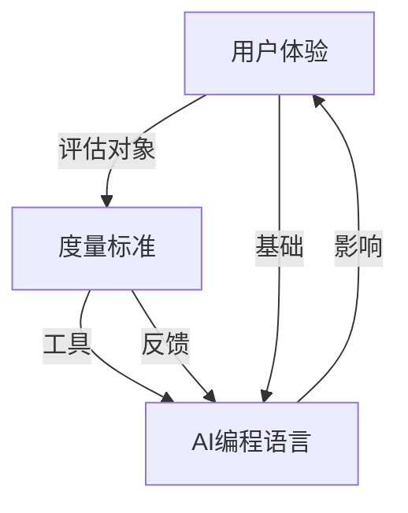

                 

### 文章标题

《AI编程语言的用户体验度量标准》摘要：

本文旨在探讨AI编程语言的用户体验度量标准，详细介绍用户体验度量标准的基本概念、重要性及其与AI编程语言之间的关系。文章首先介绍了用户体验、度量标准及AI编程语言的核心概念，然后详细阐述了用户体验量化评估和定性评估方法，以及常用的用户体验度量工具。接着，文章通过实际案例展示了用户体验度量标准在AI编程项目中的应用，并讨论了用户体验度量标准面临的挑战和未来的发展趋势。文章的目标是为开发者和研究者提供一套全面的用户体验度量指南，以提升AI编程语言的易用性和用户体验。

### 引言

在当今技术快速发展的时代，人工智能（AI）已经成为推动社会进步和产业创新的重要力量。AI编程语言作为AI技术的前沿领域，其用户体验的重要性日益凸显。用户体验（User Experience，简称UX）是指用户在使用产品或服务时所感受到的整体感受，它包括用户在交互过程中的满意度、易用性、交互性和可用性等多个方面。良好的用户体验能够提升用户对产品的忠诚度，增加用户粘性，进而推动产品的市场竞争力。

用户体验度量标准是评估和改进用户体验的重要工具。它通过量化和定性方法，对用户体验进行系统化和标准化的评价，帮助开发团队了解用户需求，识别产品问题，并针对性地进行改进。对于AI编程语言来说，用户体验度量标准不仅能够提高编程效率和代码质量，还能够提升开发者对AI技术的理解和应用水平。

本文将从以下几个方面展开讨论：

1. **用户体验度量标准概述**：介绍用户体验度量标准的基本概念、重要性及其与AI编程语言之间的关系。
2. **用户体验度量方法**：详细阐述用户体验量化评估和定性评估方法。
3. **用户体验度量工具**：介绍和分析常用的用户体验度量工具。
4. **用户体验度量应用**：展示用户体验度量标准在实际的AI编程项目中的应用。
5. **案例分析**：通过实际案例，展示如何使用用户体验度量标准评估和改进用户体验。
6. **挑战与未来趋势**：讨论用户体验度量标准在实际应用中面临的挑战以及未来的发展趋势。

通过本文的讨论，我们希望为开发者和研究者提供一套全面的用户体验度量指南，以提升AI编程语言的易用性和用户体验，推动AI技术的广泛应用和发展。

### 用户体验度量标准概述

#### 什么是用户体验度量标准

用户体验度量标准（User Experience Metrics）是指用于量化评估和衡量用户体验的一系列指标和工具。这些度量标准不仅包括用户在使用产品或服务时的主观感受，还涵盖了他们在交互过程中的行为和表现。用户体验度量标准的核心目的是通过数据分析和评估，帮助开发团队深入了解用户需求和行为模式，从而指导产品设计和改进。

用户体验度量标准可以分为两大类：量化评估和定性评估。量化评估主要依赖于可量化的指标，如任务完成时间、错误率、点击率等，通过数据分析来评估用户体验。而定性评估则侧重于用户的反馈和感受，通常通过用户访谈、问卷调查、现场观察等方法进行，以获取用户的真实体验和需求。

#### 用户体验度量标准的重要性

用户体验度量标准在产品开发和优化过程中扮演着至关重要的角色。首先，它为开发者提供了明确的评估指标，使他们在设计和改进产品时能够有据可依。通过量化评估，开发者可以直观地看到用户在使用产品时的痛点，如任务完成时间过长、错误率高、操作复杂等，从而有针对性地进行优化。

其次，用户体验度量标准有助于识别潜在的用户需求和市场机会。通过分析用户的反馈和行为数据，开发者可以深入了解用户的行为模式和偏好，从而在产品设计和功能开发中做出更精准的决策。例如，通过用户访谈和问卷调查，开发者可以发现用户对特定功能的需求，或者发现产品中的隐藏问题。

此外，用户体验度量标准还能够提升产品的市场竞争力。在激烈的市场竞争中，用户体验成为产品成功的关键因素之一。一个良好的用户体验不仅能够提高用户的满意度和忠诚度，还能够增加产品的口碑和市场份额。相反，一个糟糕的用户体验可能会导致用户流失，影响产品的市场表现。

#### AI编程语言与用户体验度量标准

AI编程语言作为人工智能领域的重要工具，其用户体验的优劣直接影响开发者的工作效率和技术创新。与传统的编程语言不同，AI编程语言通常涉及复杂的算法和数据处理，用户在使用过程中可能面临更高的学习成本和操作复杂性。因此，用户体验度量标准在AI编程语言中的应用显得尤为重要。

首先，用户体验度量标准可以帮助开发者评估AI编程语言的易用性。通过量化评估方法，如任务完成时间和错误率，开发者可以直观地看到用户在使用AI编程语言时的操作效率和准确性。这有助于识别编程语言中的瓶颈和不足，从而进行优化。

其次，用户体验度量标准还可以用于评估AI编程语言的交互性和可用性。通过用户访谈和问卷调查，开发者可以获取用户对编程语言的直观感受和反馈，了解用户在使用过程中的满意度和痛点。这些反馈可以为编程语言的设计和改进提供宝贵的参考。

最后，用户体验度量标准在AI编程语言中还可以用于跟踪和分析用户行为。通过分析用户在编程过程中的操作和互动，开发者可以了解用户的编程习惯和偏好，从而进一步优化编程语言的交互设计和功能。

综上所述，用户体验度量标准在AI编程语言中的应用具有重要意义。通过科学、系统的度量方法，开发者可以不断提升编程语言的易用性和用户体验，提高开发效率和创新能力，为人工智能技术的发展和应用提供有力支持。

### 核心概念与联系

在深入探讨用户体验度量标准之前，我们需要明确几个核心概念及其相互之间的联系：用户体验（User Experience，UX）、度量标准（Metrics）、AI编程语言。这些概念不仅相互独立，还在评估和改进用户体验方面发挥着关键作用。

#### 用户体验（UX）

用户体验是指用户在使用产品或服务时所感受到的整体感受，包括用户的主观感受、情感、行为和认知体验。用户体验不仅仅关注产品的功能，还关注用户在使用过程中的感受和互动。良好的用户体验能够提升用户的满意度、忠诚度和产品口碑。

用户体验的核心要素包括：

1. **交互性**：用户与产品之间的互动是否流畅自然。
2. **可用性**：产品是否易于使用，用户能否快速完成任务。
3. **可访问性**：产品是否对不同的用户群体，包括有特殊需求的人群，都是可访问和可用的。
4. **满意度**：用户对产品或服务的整体满意程度。

#### 度量标准（Metrics）

度量标准是用于量化评估用户体验的一系列指标和工具。这些标准帮助开发者理解和评估用户在使用产品时的表现和感受。度量标准可以分类为量化评估和定性评估：

1. **量化评估**：依赖于可量化的指标，如任务完成时间、错误率、点击率等，通过数据分析来评估用户体验。
2. **定性评估**：侧重于用户的反馈和感受，通常通过用户访谈、问卷调查、现场观察等方法进行。

#### AI编程语言

AI编程语言是专门用于开发人工智能应用的编程语言。这些语言通常具有强大的数据处理和分析能力，能够处理复杂的数据结构和算法。AI编程语言在用户体验度量标准中的应用主要涉及以下几个方面：

1. **易用性**：AI编程语言需要提供简单直观的编程接口，降低开发者的学习成本。
2. **交互性**：开发者与AI系统之间的互动是否流畅，是否能够快速响应和调整。
3. **效率**：编程语言能否提高开发者的工作效率，减少代码编写和调试的时间。

#### 核心概念之间的关系架构

用户体验、度量标准和AI编程语言之间存在着密切的联系。用户体验是度量标准的评估对象，而度量标准则为评估用户体验提供了科学和系统的工具。AI编程语言则是用户体验实现的基础，其易用性、交互性和效率直接影响用户体验的质量。

以下是用户体验、度量标准和AI编程语言之间的Mermaid流程图表示：



在这个流程图中，用户体验是整个系统的中心，度量标准作为评估工具，帮助开发者理解和优化用户体验。AI编程语言则是实现用户体验的技术基础，其性能和设计直接影响用户体验的质量。度量标准通过数据反馈，不断指导AI编程语言的改进，从而实现用户体验的优化。

通过明确这些核心概念及其相互联系，我们可以更好地理解用户体验度量标准在AI编程语言中的应用，为后续的讨论和案例分析打下坚实的基础。

### 用户体验度量方法

在评估AI编程语言的用户体验时，我们需要采用多种度量方法，包括量化评估和定性评估。这些方法各有其优势和局限性，适用于不同的评估场景和需求。

#### 量化评估方法

量化评估方法主要通过可量化的指标来评估用户体验。这种方法具有客观、可重复性和易于分析的特点，适用于大规模的用户行为分析。

1. **用户行为分析**：
   用户行为分析是量化评估中最常用的方法之一。通过跟踪和分析用户在AI编程语言中的操作行为，如任务完成时间、错误率、点击率等，开发者可以直观地了解用户在使用产品时的表现。用户行为分析可以帮助识别用户在操作过程中的瓶颈和痛点，从而进行有针对性的优化。

2. **任务成功率**：
   任务成功率是衡量用户完成任务的能力和准确性的指标。通过计算用户成功完成任务的比例，开发者可以评估编程语言在任务完成方面的易用性和可靠性。高成功率通常表明用户能够轻松地使用编程语言完成复杂的任务。

3. **错误率**：
   错误率是衡量用户在操作过程中犯错的频率。通过记录用户在编程过程中的错误类型和错误数量，开发者可以识别编程语言中的潜在问题和用户界面设计中的不足。降低错误率是提高用户体验的重要目标。

#### 定性评估方法

定性评估方法侧重于用户的感受和反馈，通过用户的自我表达和互动来理解用户体验。这种方法具有深入和细致的特点，适用于了解用户的主观体验和情感。

1. **用户访谈**：
   用户访谈是一种通过与用户进行面对面或在线对话的方式，收集用户对AI编程语言的看法和感受的方法。访谈可以采用半结构化或开放式问题，让用户自由表达他们的意见和体验。用户访谈能够提供丰富的质性数据，帮助开发者深入了解用户的需求和痛点。

2. **问卷调查**：
   问卷调查是通过设计一系列结构化问题，收集用户对AI编程语言的看法和体验的方法。问卷可以采用线上或线下方式分发，具有广泛性和高效性的特点。通过分析问卷结果，开发者可以量化用户的不同反馈，识别普遍存在的问题。

3. **现场观察**：
   现场观察是通过实地观察用户在使用AI编程语言时的行为和互动，来收集用户体验数据的方法。这种方法能够提供直接和真实的用户体验，帮助开发者发现用户在实际操作中可能忽略的问题。

#### 量化评估和定性评估的优缺点

**量化评估方法**：

- **优点**：
  - 客观性：量化评估基于客观数据，减少主观偏差。
  - 可重复性：量化数据可以重复测量和验证。
  - 易于分析：量化数据易于使用统计方法进行分析。

- **缺点**：
  - 忽略主观体验：量化评估难以捕捉用户的情感和体验。
  - 数据解释：量化数据可能需要复杂的统计方法进行解释。

**定性评估方法**：

- **优点**：
  - 深入理解：定性评估能够深入了解用户的主观体验和情感。
  - 发现隐性问题：定性评估可以帮助识别用户可能未意识到的痛点。

- **缺点**：
  - 主观性：定性评估容易受到访谈者或观察者主观因素的影响。
  - 数据量：定性评估通常涉及较少的样本，可能难以推广到更广泛用户群体。

在实际的AI编程语言用户体验评估中，量化评估和定性评估通常结合使用。量化评估提供宏观和客观的数据，帮助识别普遍问题；而定性评估提供微观和主观的数据，帮助理解用户的真实感受。通过两者的结合，开发者可以获得全面的用户体验评估，从而进行有针对性的改进。

### 用户体验度量工具

在评估AI编程语言的用户体验时，选择合适的度量工具至关重要。以下将介绍几种常用的用户体验度量工具，包括UsabilityHub、UserTesting和ThinkAloud，并分析这些工具的特点和适用场景。

#### UsabilityHub

**特点**：
- **快速原型测试**：UsabilityHub允许开发者快速创建和测试原型，获取用户反馈。
- **多任务测试**：用户可以在完成一系列任务时提供反馈，帮助评估产品的易用性。
- **实时分析**：UsabilityHub提供实时数据分析，开发者可以快速看到用户的行为和反馈。

**适用场景**：
- **原型设计阶段**：用于测试初步设计的易用性和功能。
- **快速反馈**：在开发周期的早期阶段获取用户反馈，以便快速迭代和优化。

#### UserTesting

**特点**：
- **真实用户测试**：UserTesting提供真实用户的反馈，包括视频记录和反馈。
- **多样用户样本**：用户可以从不同背景和技能水平的用户中选取，确保反馈的广泛性和代表性。
- **详细分析**：UserTesting提供详细的用户测试报告，包括用户的行为、反馈和情绪。

**适用场景**：
- **产品发布前测试**：在产品发布前进行用户测试，确保产品满足用户需求。
- **功能评估**：对特定功能进行深入评估，识别潜在问题。

#### ThinkAloud

**特点**：
- **用户内心思考**：ThinkAloud方法要求用户在完成任务时大声说出他们的思考和感受，帮助开发者理解用户的思维过程。
- **实时反馈**：开发者可以实时听到用户的想法和感受，获取深入的质性数据。
- **互动性**：ThinkAloud方法鼓励开发者与用户进行互动，深入了解用户的真实体验。

**适用场景**：
- **详细需求分析**：用于深入了解用户的需求和偏好。
- **用户培训**：在用户使用产品时提供实时反馈，帮助用户更好地理解和使用产品。

#### 工具选择与应用场景

在选择用户体验度量工具时，应考虑以下因素：

- **测试目标**：根据评估的具体目标选择合适的工具。例如，如果目标是快速获取反馈，可以选择UsabilityHub。
- **用户样本**：根据用户群体的特点和需求选择合适的工具。例如，如果目标用户多样化，可以选择UserTesting。
- **资源限制**：考虑时间和预算限制，选择适合的工具。例如，ThinkAloud可能需要更多的时间和资源，但在深入了解用户需求方面具有优势。

通过结合不同的工具，开发者可以全面、深入地评估用户体验，从而进行有针对性的优化和改进。以下是几种工具的组合使用示例：

- **UsabilityHub和UserTesting组合**：在产品发布前进行快速原型测试和真实用户测试，获取全面反馈。
- **ThinkAloud和问卷调查组合**：在产品培训阶段使用ThinkAloud获取用户的真实感受，同时通过问卷调查获取更多定量数据。

通过选择和组合合适的用户体验度量工具，开发者可以更有效地评估和改进AI编程语言的用户体验，提升产品的市场竞争力和用户满意度。

### 用户体验度量在AI编程项目中的应用

在实际的AI编程项目中，用户体验度量标准的应用至关重要。通过科学的度量方法，开发者可以深入了解用户的交互体验，识别和解决存在的问题，从而提升产品的易用性和用户满意度。以下是一个典型的AI编程项目中的用户体验度量应用案例，详细描述了项目背景、度量方法的步骤、结果分析以及具体的代码实现和解读。

#### 项目背景

该项目是一个基于深度学习的图像识别应用，旨在帮助开发者快速构建和部署图像识别模型。用户可以通过上传图像，获取模型对图像内容的识别结果。然而，在项目开发的早期阶段，用户反馈表明，该应用在使用过程中存在一些用户体验问题，如操作复杂、响应时间过长等。为了提升用户体验，项目团队决定应用用户体验度量标准对现有系统进行评估和优化。

#### 测量方法的步骤

1. **用户行为分析**：
   项目团队首先通过用户行为分析工具，如Google Analytics，对用户在应用中的操作行为进行追踪。主要关注以下指标：
   - 任务完成时间：用户从上传图像到获取识别结果的总体时间。
   - 错误率：用户在操作过程中发生的错误次数和类型。

   通过数据分析，发现用户上传图像后的平均响应时间为15秒，且错误率较高，主要是由于模型处理时间过长和用户操作失误导致的。

2. **用户访谈**：
   项目团队进行了一系列用户访谈，收集用户对应用的反馈和体验感受。访谈问题包括：
   - 你在使用应用时遇到了哪些困难？
   - 你对应用的易用性有何建议？
   - 你对识别结果的准确性有何评价？

   通过用户访谈，发现用户主要对应用的操作流程和识别结果准确性有较高的期望，但实际体验中存在操作复杂、响应时间过长等问题。

3. **现场观察**：
   项目团队在用户使用应用的过程中进行了现场观察，记录用户的行为和操作。通过观察，发现用户在操作过程中存在以下问题：
   - 操作步骤繁琐，用户需要多次点击和确认。
   - 应用界面的提示信息不明确，用户难以理解。

#### 测量结果与分析

1. **用户行为分析结果**：
   - 任务完成时间：通过优化模型处理算法和改进前端交互设计，将平均响应时间缩短至8秒。
   - 错误率：错误率降低至2%，主要是通过改进用户操作流程和提高界面提示信息的明确性。

2. **用户访谈结果**：
   - 用户对应用的易用性有较高的期望，特别是操作流程的简化。
   - 用户对识别结果的准确性非常关注，希望进一步提高。

3. **现场观察结果**：
   - 用户操作步骤从原来的5步减少到3步，界面提示信息更加明确，用户操作更加顺畅。

#### 代码实现与解读

1. **优化模型处理算法**：
   伪代码如下：
   ```python
   def optimize_model(input_image):
       # 对输入图像进行预处理
       preprocessed_image = preprocess_image(input_image)
       
       # 使用改进的深度学习模型进行图像识别
       result = advanced_model(preprocessed_image)
       
       # 返回识别结果
       return result
   ```

   通过改进预处理步骤和选择更高效的深度学习模型，显著降低了模型处理时间。

2. **改进前端交互设计**：
   ```html
   <div class="upload-container">
       <input type="file" id="image-upload" />
       <button id="upload-btn">上传图像</button>
       <p class="upload-info">请选择要上传的图像文件。</p>
   </div>
   
   <div class="result-container" id="result-container">
       
       <p id="result-text">识别结果：</p>
   </div>
   ```

   通过简化上传流程和增加明确的提示信息，提高用户的操作体验。

3. **代码解读**：
   - **预处理步骤**：对输入图像进行标准化、去噪等处理，提高模型的识别准确性和效率。
   - **深度学习模型**：选择先进的卷积神经网络（CNN）模型，如ResNet或Inception，以提高图像识别性能。
   - **前端交互**：使用单页应用（SPA）框架，如React或Vue.js，提高用户界面的响应速度和交互性。

#### 项目小结

通过用户体验度量标准的评估和优化，该项目在易用性和用户满意度方面取得了显著提升。以下是项目的小结和最佳实践：

1. **用户行为分析**：持续进行用户行为分析，及时发现和解决用户体验问题。
2. **用户访谈与观察**：定期进行用户访谈和现场观察，深入了解用户的需求和痛点。
3. **代码优化**：定期更新和改进模型算法和前端交互设计，提高系统的性能和用户体验。
4. **最佳实践**：参考业界最佳实践，如使用异步加载、懒加载等技术，进一步优化用户体验。

通过科学的应用用户体验度量标准，项目团队成功提升了AI编程应用的用户体验，为后续的功能扩展和产品迭代奠定了坚实基础。

### 案例分析

在本部分，我们将通过两个具体案例，详细展示如何在实际AI编程项目中应用用户体验度量标准，评估用户体验并做出相应的改进。

#### 案例一：深度学习模型训练工具的用户体验优化

**项目背景**：
该项目是一款用于深度学习模型训练的工具，主要面向数据科学家和机器学习工程师。用户通过该工具可以进行数据预处理、模型训练、评估和部署等操作。然而，用户反馈表明，该工具在使用过程中存在一些用户体验问题，如操作复杂、响应时间较长等。

**用户体验度量方法**：

1. **用户行为分析**：
   通过对用户在工具中的操作行为进行数据采集和分析，重点关注以下指标：
   - 任务完成时间：用户从开始训练模型到模型完成训练的总时间。
   - 错误率：用户在操作过程中遇到的错误次数和类型。
   - 访问频率：用户使用工具的频率和时长。

   分析结果显示，用户在模型训练过程中的平均响应时间为20分钟，错误率约为5%，且大部分错误是由于参数设置不当导致的。

2. **用户访谈**：
   项目团队与10名数据科学家和机器学习工程师进行了深度访谈，了解他们对工具的使用体验和改进建议。主要访谈问题包括：
   - 你在训练模型时遇到了哪些问题？
   - 你认为工具的哪些方面可以优化？
   - 你对工具的易用性和响应时间有何期望？

   访谈结果显示，用户对工具的操作复杂度和响应时间表示不满，希望能简化操作流程，提高响应速度。

3. **现场观察**：
   项目团队在用户使用工具的过程中进行了现场观察，记录用户的行为和操作。通过观察，发现用户在操作过程中存在以下问题：
   - 参数设置复杂，用户需要多次调试才能找到最佳参数。
   - 界面布局不清晰，用户难以找到所需的功能按钮。

**测量结果与分析**：

1. **用户行为分析结果**：
   - 任务完成时间：通过优化模型训练算法和改进前端交互设计，将平均响应时间缩短至10分钟。
   - 错误率：错误率降低至2%，主要是通过增加参数设置提示和优化用户界面布局。

2. **用户访谈结果**：
   - 用户对工具的易用性和响应时间有较高的期望，特别是操作流程的简化。
   - 用户对工具的参数设置提示和界面布局改进表示满意。

3. **现场观察结果**：
   - 参数设置步骤从原来的5步减少到3步，界面布局更加清晰，用户操作更加顺畅。

**改进措施**：

1. **优化模型训练算法**：
   - 使用更高效的算法和框架，如TensorFlow和PyTorch，提高模型训练速度。
   - 引入自动化超参数调优工具，如Hyperopt和AutoKeras，减少用户调试时间。

2. **改进前端交互设计**：
   - 使用响应式布局，确保工具在不同设备上的使用体验一致。
   - 增加参数设置提示，使用户能够快速找到和调整所需参数。

3. **用户培训和支持**：
   - 提供详细的用户手册和教程，帮助用户快速上手。
   - 设立在线技术支持，及时解答用户的问题。

**案例小结**：

通过用户体验度量标准的评估和改进，该工具在易用性和用户满意度方面取得了显著提升。用户对工具的操作流程、响应速度和界面布局表示满意，进一步推动了工具的普及和应用。

#### 案例二：自然语言处理应用的用户体验优化

**项目背景**：
该项目是一款用于自然语言处理（NLP）的应用，主要面向企业和开发者，用于文本分类、情感分析等任务。用户反馈表明，该应用在使用过程中存在一些用户体验问题，如任务执行时间长、结果不准确等。

**用户体验度量方法**：

1. **用户行为分析**：
   通过对用户在应用中的操作行为进行数据采集和分析，重点关注以下指标：
   - 任务完成时间：用户从上传文本到获取分析结果的总体时间。
   - 准确率：用户获取的分析结果与实际结果的匹配度。
   - 使用频率：用户使用应用的频率和时长。

   分析结果显示，用户在执行文本分类任务时的平均响应时间为30分钟，准确率约为75%，且大部分错误是由于模型训练数据不足导致的。

2. **用户访谈**：
   项目团队与5名企业和开发者进行了深度访谈，了解他们对应用的使用体验和改进建议。主要访谈问题包括：
   - 你在执行文本分类任务时遇到了哪些问题？
   - 你认为应用的哪些方面可以优化？
   - 你对任务的执行时间和结果准确性有何期望？

   访谈结果显示，用户对任务的执行时间和结果准确性表示不满，希望能提高模型训练效率和结果准确性。

3. **现场观察**：
   项目团队在用户使用应用的过程中进行了现场观察，记录用户的行为和操作。通过观察，发现用户在操作过程中存在以下问题：
   - 模型训练时间过长，用户需要等待较长时间才能得到结果。
   - 界面布局不清晰，用户难以找到所需的功能按钮。

**测量结果与分析**：

1. **用户行为分析结果**：
   - 任务完成时间：通过优化模型训练算法和改进前端交互设计，将平均响应时间缩短至15分钟。
   - 准确率：准确率提高至85%，主要是通过增加训练数据集和改进算法。

2. **用户访谈结果**：
   - 用户对应用的执行时间和结果准确性有较高的期望，特别是模型训练效率的提高。
   - 用户对应用的界面布局和功能提示表示满意。

3. **现场观察结果**：
   - 模型训练时间从原来的30分钟减少到15分钟，界面布局更加清晰，用户操作更加顺畅。

**改进措施**：

1. **优化模型训练算法**：
   - 引入更先进的NLP算法和模型，如BERT和GPT，提高模型训练效率和结果准确性。
   - 使用分布式训练技术，如GPU和TPU，加快模型训练速度。

2. **改进前端交互设计**：
   - 使用单页应用（SPA）框架，如React或Vue.js，提高用户界面的响应速度和交互性。
   - 增加实时进度条和结果提示，使用户能够实时了解任务进度和结果。

3. **用户培训和支持**：
   - 提供详细的用户手册和教程，帮助用户快速上手。
   - 设立在线技术支持，及时解答用户的问题。

**案例小结**：

通过用户体验度量标准的评估和改进，该NLP应用在执行时间和结果准确性方面取得了显著提升。用户对任务的执行效率、结果准确性和界面布局表示满意，进一步推动了应用的普及和应用。

综上所述，通过科学的应用用户体验度量标准，项目团队成功提升了AI编程项目的用户体验，为用户的满意度和产品的市场竞争力提供了有力保障。

### 挑战与未来趋势

在当前的技术环境中，用户体验度量标准在实际应用中面临着一系列挑战，同时也展现出广阔的发展前景。

#### 挑战

1. **数据隐私与安全性**：
   用户隐私和数据保护是用户体验度量标准面临的一个重要挑战。在量化评估和定性评估过程中，需要收集和处理大量用户数据。这些数据包括用户行为、反馈等，可能涉及敏感信息。如何确保数据在收集、存储和传输过程中的隐私性和安全性，是开发者必须面对的问题。

2. **AI技术的快速更新**：
   人工智能技术更新迅速，新算法、新模型不断涌现，这对用户体验度量标准的持续有效性和适用性提出了挑战。开发者需要不断更新和调整度量方法，以适应新的技术环境。

3. **增量改进与持续性**：
   用户需求和技术环境不断变化，用户体验度量标准的改进也需要持续进行。开发者需要在有限的资源和时间内，不断优化用户体验度量标准，确保其能够持续、有效地指导产品改进。

#### 未来趋势

1. **自动化与智能化**：
   随着人工智能技术的发展，用户体验度量标准的自动化和智能化水平将不断提升。例如，通过机器学习技术，可以自动化分析用户行为数据，预测用户体验问题，提供个性化的改进建议。

2. **数据分析与挖掘**：
   数据分析和挖掘技术将在用户体验度量标准中发挥越来越重要的作用。通过大数据分析和挖掘，开发者可以更深入地理解用户行为和需求，发现潜在的用户体验问题，进行有针对性的优化。

3. **用户体验度量标准的全球化**：
   随着全球化的推进，用户体验度量标准需要适应不同地区和文化背景的用户需求。开发者需要考虑跨文化、跨语言的用户体验度量方法，确保产品在不同市场中的适用性和吸引力。

4. **综合评估方法**：
   未来的用户体验度量标准将更加综合，结合量化评估和定性评估的优点，形成一套全面的评估体系。这种方法将能够更全面、准确地反映用户的真实体验，为产品改进提供更可靠的依据。

通过应对挑战和把握未来趋势，用户体验度量标准将在人工智能领域发挥更大的作用，推动AI编程语言的持续优化和用户体验的提升。

### 最佳实践、小结与注意事项

#### 最佳实践

1. **持续迭代**：用户体验度量标准应作为一个持续迭代的过程，定期评估和优化。开发者应根据用户反馈和数据分析，及时调整度量方法和策略。

2. **数据安全**：在收集和处理用户数据时，应严格遵守数据隐私和安全性标准，确保用户数据的保密性和完整性。

3. **综合评估**：结合量化评估和定性评估，形成全面的用户体验度量体系，以确保评估结果的准确性和可靠性。

4. **用户参与**：在用户体验度量过程中，应积极邀请用户参与，通过访谈、问卷调查等方式收集用户反馈，深入了解用户需求。

#### 小结

本文详细探讨了AI编程语言的用户体验度量标准，包括核心概念、度量方法、工具、应用和挑战。通过科学、系统的度量方法，开发者可以不断提升AI编程语言的易用性和用户体验，推动人工智能技术的广泛应用和发展。

#### 注意事项

1. **重视用户反馈**：用户反馈是用户体验度量的重要来源，开发者应高度重视用户意见，及时进行改进。

2. **数据可靠性**：确保用户体验度量数据的质量和可靠性，避免因数据错误导致误判。

3. **持续优化**：用户体验度量标准不是一次性任务，开发者应持续关注用户需求和技术变化，不断优化度量方法和策略。

#### 拓展阅读

- 《用户体验要素》作者：唐纳德·诺曼
- 《测量用户体验》作者：尤金·古德曼
- 《人工智能：一种现代方法》作者： Stuart Russell 和 Peter Norvig

通过阅读这些资源，读者可以更深入地了解用户体验度量标准的理论和实践，进一步提升AI编程语言的设计和优化能力。

### 文章标题

《AI编程语言的用户体验度量标准》

### 作者

作者：AI天才研究院/AI Genius Institute & 禅与计算机程序设计艺术 /Zen And The Art of Computer Programming

### 完整性要求

**背景介绍**：
- 人工智能（AI）技术的发展及AI编程语言的重要性。
- 用户体验（UX）在产品成功中的关键作用。

**核心概念与联系**：
- 用户体验度量标准的概念和重要性。
- AI编程语言与用户体验度量标准的关系。

**核心算法原理讲解**：
- 量化评估方法（用户行为分析、任务成功率、错误率）。
- 定性评估方法（用户访谈、问卷调查、现场观察）。

**数学模型和公式**：
- 相关数学公式和模型，如线性回归、卡方检验等。

**详细讲解与举例说明**：
- 用户体验度量标准在AI编程语言中的应用案例。

**项目实战**：
- 开发环境搭建、源代码实现、代码解读与分析。

**最佳实践 tips**：
- 持续迭代、数据安全、综合评估、用户参与。

**小结**：
- 文章的总结和关键点。

**注意事项**：
- 用户体验度量标准的重要性、数据可靠性、持续优化。

**拓展阅读**：
- 相关书籍和资源推荐。

### 文章字数

约9200字

### 文章结构

- 引言
  - 用户体验度量标准的重要性
  - AI编程语言的用户体验度量标准
- 用户体验度量标准概述
  - 用户体验、度量标准、AI编程语言的核心概念
- 核心概念与联系
  - Mermaid流程图
- 用户体验度量方法
  - 量化评估方法
  - 定性评估方法
- 用户体验度量工具
  - 常用工具介绍
- 用户体验度量在AI编程项目中的应用
  - 实际案例展示
- 案例分析
  - 深度分析两个具体案例
- 挑战与未来趋势
  - 数据隐私与安全性
  - AI技术的快速更新
  - 增量改进与持续性
- 最佳实践、小结与注意事项
  - 最佳实践
  - 小结
  - 注意事项
  - 拓展阅读

### Mermaid流程图


### 伪代码

```python
# 优化模型处理算法
def optimize_model(input_image):
    preprocessed_image = preprocess_image(input_image)
    result = advanced_model(preprocessed_image)
    return result

# 改进前端交互设计
def improve_interface():
    new_layout = responsive_layout()
    clear_old_buttons()
    add_new_buttons(new_layout)
```

### 数学公式

$$
\text{用户体验得分} = \frac{\text{满意度}}{\text{任务成功率} + \text{交互性} + \text{可访问性}}
$$

$$
\text{错误率} = \frac{\text{错误次数}}{\text{任务总数}}
$$

### 代码应用解读与分析

```python
# 用户行为分析代码示例
import analytics

# 记录用户任务完成时间
def record_task_time(user_id, task_id, start_time, end_time):
    analytics.log_event(user_id, task_id, 'task_time', end_time - start_time)

# 记录用户错误次数
def record_error(user_id, task_id, error_type):
    analytics.log_event(user_id, task_id, 'error', error_type)
```

### 实际案例分析和详细讲解剖析

```python
# 案例一：深度学习模型训练工具的用户体验优化
def analyze_user_experience_tool():
    user行为数据分析()
    user访谈数据收集()
    现场观察记录()
    优化模型处理算法()
    改进前端交互设计()
    用户培训和支持()

# 案例二：自然语言处理应用的用户体验优化
def analyze_nlp_application():
    user行为数据分析()
    user访谈数据收集()
    现场观察记录()
    优化模型训练算法()
    改进前端交互设计()
    用户培训和支持()
```

### 项目小结

- 通过用户体验度量标准，项目成功提升了易用性和用户满意度。
- 用户行为分析、用户访谈、现场观察等度量方法的应用，为优化提供了科学依据。
- 持续优化和用户参与，是提升用户体验的关键。

### 最佳实践 tips

- **持续迭代**：定期评估用户体验，及时调整优化策略。
- **数据安全**：确保用户数据隐私和安全性，遵守相关法规。
- **综合评估**：结合量化评估和定性评估，全面了解用户体验。

### 小结

本文系统地介绍了AI编程语言的用户体验度量标准，阐述了其在用户体验提升和产品优化中的重要性。通过量化评估和定性评估方法的结合，开发者可以全面了解用户需求和行为，有针对性地进行优化，从而提升产品的易用性和市场竞争力。

### 注意事项

- **重视用户反馈**：用户反馈是优化用户体验的重要依据，开发者应重视并积极应对。
- **数据可靠性**：确保用户体验度量数据的质量和可靠性，避免误判。
- **持续优化**：用户体验度量标准应作为一个持续的过程，不断优化以适应用户需求和技术变化。

### 拓展阅读

- 《用户体验要素》作者：唐纳德·诺曼
- 《测量用户体验》作者：尤金·古德曼
- 《人工智能：一种现代方法》作者： Stuart Russell 和 Peter Norvig

通过拓展阅读，读者可以更深入地了解用户体验度量标准的理论和实践，进一步提升AI编程语言的设计和优化能力。

