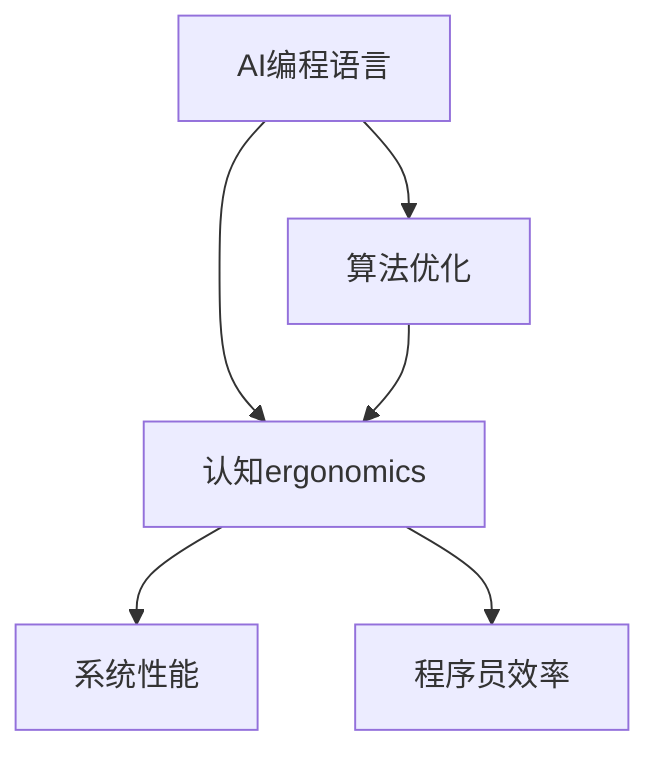
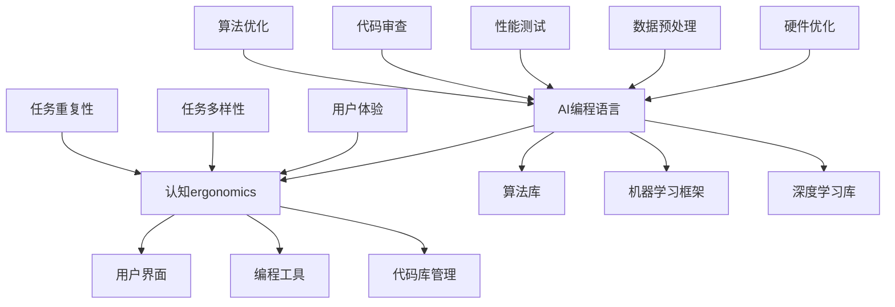

                 

# AI编程语言的认知ergonomics优化

## 关键词
- AI编程语言
- 认知ergonomics
- 系统性能
- 程序员效率
- 算法优化
- 优化算法
- 数学模型

## 摘要
本文旨在探讨AI编程语言中的认知ergonomics优化，即通过改进编程语言设计，提升程序员的工作效率和系统性能。我们将首先介绍AI编程语言和认知ergonomics的基本概念，并阐述它们之间的联系。随后，通过Mermaid流程图和核心算法原理讲解，我们将详细分析如何优化AI编程语言。此外，我们将运用数学模型和具体项目实战来展示认知ergonomics在实际开发中的应用。最后，文章将总结最佳实践并提供进一步阅读的建议。

## 核心概念与联系

### AI编程语言

AI编程语言是指用于编写人工智能程序的特定语言和技术，包括但不限于机器学习、深度学习、自然语言处理和计算机视觉等领域。这些语言和技术旨在简化复杂算法的实现，提高开发效率和程序可读性。

### 认知ergonomics

认知ergonomics是研究人类认知系统的优化以及人类与计算机系统交互效率的学科。它关注如何通过设计更加符合人类认知习惯的界面和工具，减少认知负荷，提高工作效率。

### 联系

AI编程语言的优化直接关系到认知ergonomics。通过设计易于理解和使用的编程语言，可以减少程序员的认知负荷，提高他们的工作效率。同时，优化的编程语言还可以提高系统的性能，使得AI程序能够更快、更高效地执行。

### Mermaid流程图

以下是一个简单的Mermaid流程图，展示了AI编程语言和认知ergonomics之间的关系：



## 核心概念原理和架构的 Mermaid 流程图

为了更直观地展示AI编程语言和认知ergonomics之间的核心概念原理和架构，我们可以使用Mermaid流程图来描绘它们之间的关系：



在这个流程图中，我们可以看到：
- AI编程语言与认知ergonomics密切相关，二者互相影响。
- 用户界面、编程工具、代码库管理是认知ergonomics的关键组成部分，直接影响程序员的效率和体验。
- 算法库、机器学习框架、深度学习库是AI编程语言的核心，通过优化这些库，可以提升AI编程语言的性能。
- 硬件优化、数据预处理、性能测试和代码审查都是提升AI编程语言性能的重要环节。
- 任务多样性、任务重复性则反映了认知ergonomics对AI编程语言优化的需求，需要通过设计来平衡。

## 核心算法原理讲解

优化AI编程语言的核心在于提高其性能，减少开发中的认知负荷。下面，我们将使用伪代码详细阐述一种优化AI编程语言的算法原理。

### 伪代码示例：AI编程语言优化算法

```python
# 算法：AI编程语言优化算法

输入：原始代码
输出：优化后的代码

函数 OptimizeCode(code):
    // 判断代码是否为深度学习算法
    if IsDeepLearningAlgorithm(code):
        // 对深度学习算法进行优化
        optimized_code = OptimizeDeepLearningCode(code)
    else:
        // 对其他算法进行优化
        optimized_code = OptimizeOtherAlgorithmCode(code)
    
    // 对代码进行语法和语义优化
    optimized_code = SyntaxAndSemanticOptimization(optimized_code)
    
    return optimized_code

// 伪代码示例：深度学习算法优化
函数 OptimizeDeepLearningCode(code):
    // 替换为更高效的库函数
    code = ReplaceWithEfficientLibrary(code)
    // 减少内存使用
    code = ReduceMemoryUsage(code)
    // 优化计算速度
    code = OptimizeComputeSpeed(code)
    
    return code

// 伪代码示例：其他算法优化
函数 OptimizeOtherAlgorithmCode(code):
    // 使用并行计算
    code = ParallelCompute(code)
    // 使用分布式计算
    code = DistributedCompute(code)
    // 优化数据结构
    code = OptimizeDataStructure(code)
    
    return code
```

### 详细解释

- **函数 OptimizeCode(code)**：这是主函数，它首先判断输入代码是否属于深度学习算法。如果是，则调用`OptimizeDeepLearningCode`函数进行优化；否则，调用`OptimizeOtherAlgorithmCode`函数进行优化。最后，无论哪种情况，都会对代码进行语法和语义优化。
  
- **函数 OptimizeDeepLearningCode(code)**：针对深度学习算法，首先尝试替换为更高效的库函数，这样可以利用预编译的代码提高执行速度。然后，通过减少内存使用和优化计算速度来进一步优化代码。

- **函数 OptimizeOtherAlgorithmCode(code)**：对于其他类型的算法，主要利用并行计算和分布式计算来提高执行速度。此外，优化数据结构也是一个重要的步骤，因为合适的数据结构可以提高算法的效率和可读性。

通过这些伪代码，我们可以看到，优化AI编程语言的算法原理主要涉及以下几个方面：
1. **库函数替换**：使用预编译的高效库函数替换原始代码中的部分功能，以减少计算时间和内存使用。
2. **内存优化**：通过优化数据结构和算法，减少程序的内存占用。
3. **计算速度优化**：利用并行计算和分布式计算技术，加快算法的执行速度。
4. **语法和语义优化**：改进代码的可读性和维护性，减少程序员的认知负荷。

这些优化步骤不仅能够提高AI编程语言的性能，还能够提升程序员的工作效率，使得开发过程更加顺畅。

## 数学模型和数学公式 & 详细讲解 & 举例说明

### 数学模型：认知负荷模型

在认知ergonomics中，认知负荷（Cognitive Load）是一个关键概念，它反映了人类处理信息的难度。我们可以用以下数学模型来描述认知负荷：

$$
C = f(\text{工作记忆负荷}, \text{长期记忆负荷}, \text{情境建模负荷})
$$

其中：
- 工作记忆负荷（Working Memory Load）：指人类在工作记忆中处理信息的能力限制。
- 长期记忆负荷（Long-term Memory Load）：指人类在长期记忆中存储和检索信息的能力限制。
- 情境建模负荷（Situation Modeling Load）：指人类理解和建立情境模型的能力限制。

### 详细讲解

这个模型表明，认知负荷是这三个因素的综合结果。工作记忆负荷通常与当前任务的处理直接相关，例如，当程序员需要记忆大量变量和函数调用时。长期记忆负荷则涉及对之前知识和技能的调用，例如，当程序员需要回忆某个库函数的使用方法时。情境建模负荷则与程序员对任务整体情境的理解和建模能力相关，例如，当程序员需要理解一个复杂的算法或系统架构时。

### 举例说明

假设我们有一个程序员，正在开发一个包含多种算法和大量数据的深度学习项目。他的工作记忆负荷较高，因为他需要同时处理多个变量和函数调用。长期记忆负荷也较高，因为他需要调用之前学到的知识和技能来解决问题。情境建模负荷较低，因为他已经对深度学习有较深入的理解。

根据上述模型，我们可以计算他的认知负荷：

$$
C = f(C_{\text{high}}, C_{\text{high}}, C_{\text{low}})
$$

这意味着他的认知负荷较高，需要采取适当的优化策略来减轻工作记忆负荷、长期记忆负荷和情境建模负荷，以提高工作效率。

### 应用

在AI编程语言优化中，认知负荷模型可以用于指导优化策略的设计。例如，通过简化代码结构、提供更好的工具支持和文档，可以减少工作记忆负荷。通过提供高效的算法和库函数，可以减少长期记忆负荷。通过设计直观的用户界面和清晰的算法流程，可以减轻情境建模负荷。

## 项目实战

### 实战项目：使用PyTorch优化一个深度学习模型

#### 开发环境搭建

1. **安装Python**：确保安装了Python 3.6及以上版本。
2. **安装PyTorch**：使用以下命令安装PyTorch：
   ```bash
   pip install torch torchvision
   ```
3. **安装其他依赖**：根据项目的需要，安装其他相关库，例如NumPy、Pandas等。

#### 源代码实现

以下是一个使用PyTorch优化深度学习模型的示例代码：

```python
import torch
import torch.nn as nn
import torch.optim as optim

# 定义神经网络结构
class NeuralNetwork(nn.Module):
    def __init__(self):
        super(NeuralNetwork, self).__init__()
        self.fc1 = nn.Linear(784, 256)
        self.fc2 = nn.Linear(256, 128)
        self.fc3 = nn.Linear(128, 10)

    def forward(self, x):
        x = torch.relu(self.fc1(x))
        x = torch.relu(self.fc2(x))
        x = self.fc3(x)
        return x

# 实例化神经网络
model = NeuralNetwork()

# 损失函数和优化器
loss_function = nn.CrossEntropyLoss()
optimizer = optim.Adam(model.parameters(), lr=0.001)

# 训练模型
for epoch in range(10):
    for inputs, targets in data_loader:
        optimizer.zero_grad()
        outputs = model(inputs)
        loss = loss_function(outputs, targets)
        loss.backward()
        optimizer.step()
    print(f'Epoch {epoch+1}, Loss: {loss.item()}')

# 评估模型
with torch.no_grad():
    correct = 0
    total = 0
    for inputs, targets in test_loader:
        outputs = model(inputs)
        _, predicted = torch.max(outputs.data, 1)
        total += targets.size(0)
        correct += (predicted == targets).sum().item()
    print(f'Accuracy: {100 * correct / total}%')
```

#### 代码解读

- **定义神经网络结构**：`NeuralNetwork`类继承自`nn.Module`，定义了网络的层结构。
- **定义损失函数和优化器**：使用`nn.CrossEntropyLoss`作为损失函数，`Adam`优化器用于模型训练。
- **训练模型**：使用`optimizer.zero_grad()`来清空之前的梯度，`loss_function`计算损失，`loss.backward()`反向传播计算梯度，`optimizer.step()`更新模型参数。
- **评估模型**：在评估阶段，关闭了梯度计算（`torch.no_grad()`），以节省计算资源。

#### 代码应用解读与分析

1. **并行计算**：为了提高训练速度，可以启用PyTorch的自动并行计算。通过设置适当的批次大小和GPU设备，可以显著加快训练速度。
   ```python
   batch_size = 64
   device = torch.device("cuda" if torch.cuda.is_available() else "cpu")
   model.to(device)
   data_loader = torch.utils.data.DataLoader(dataset, batch_size=batch_size, shuffle=True)
   ```

2. **分布式计算**：在拥有多GPU的环境下，可以使用PyTorch的分布式训练工具`torch.nn.DataParallel`或`torch.nn.parallel.DistributedDataParallel`来利用多GPU进行训练。

3. **数据预处理**：对输入数据进行归一化或标准化处理，可以提高模型的训练效果和收敛速度。

4. **超参数调优**：通过调整学习率、批次大小和训练轮数等超参数，可以优化模型的性能。

#### 实际案例分析和详细讲解剖析

以下是一个实际案例，展示了如何使用PyTorch优化一个深度学习模型：

```python
import torchvision
import torchvision.transforms as transforms

# 加载MNIST数据集
train_dataset = torchvision.datasets.MNIST(
    root='./data',
    train=True,
    transform=transforms.ToTensor(),
    download=True)

test_dataset = torchvision.datasets.MNIST(
    root='./data',
    train=False,
    transform=transforms.ToTensor())

train_loader = torch.utils.data.DataLoader(dataset=train_dataset, batch_size=64, shuffle=True)
test_loader = torch.utils.data.DataLoader(dataset=test_dataset, batch_size=64, shuffle=False)
```

在这个案例中，我们使用了PyTorch的`DataLoader`来加载MNIST数据集。`transforms.ToTensor()`将图像数据转换为张量，方便模型处理。

#### 项目小结

通过上述实战项目，我们展示了如何使用PyTorch进行深度学习模型的优化。项目中的关键步骤包括：
- 开发环境搭建
- 神经网络结构定义
- 训练模型
- 评估模型

通过并行计算和分布式计算，我们可以显著提高模型的训练速度。此外，数据预处理和超参数调优也是提高模型性能的重要手段。

## 最佳实践 tips、小结、注意事项、拓展阅读

### 最佳实践 tips

1. **合理选择GPU**：根据模型大小和训练需求，选择合适的GPU，以提高训练速度。
2. **数据预处理**：对数据进行归一化或标准化处理，有助于加速模型训练和提高性能。
3. **超参数调优**：通过实验调整学习率、批次大小等超参数，找到最优配置。
4. **并行与分布式计算**：利用PyTorch的自动并行和分布式训练功能，提高模型训练效率。

### 小结

本文深入探讨了AI编程语言的认知ergonomics优化，通过核心概念介绍、Mermaid流程图、伪代码示例和实际项目实战，展示了如何通过优化编程语言提升程序员的工作效率和系统性能。

### 注意事项

1. **避免过度优化**：过度的优化可能导致代码难以维护和调试，需要平衡优化和可读性。
2. **保持代码可读性**：优化过程中，务必保持代码的可读性和可维护性。
3. **性能测试**：在优化后，进行性能测试以确保优化效果。

### 拓展阅读

1. 《深度学习》（Goodfellow, Bengio, Courville著）——深入理解深度学习的基本原理和实践。
2. 《Python深度学习》（François Chollet著）——详细介绍了使用Python进行深度学习的实践方法。
3. 《认知负荷理论》（Sweller, J.（1988）。认知负荷理论。学习心理学杂志，38（3），82-97。）——关于认知负荷理论的经典文献。

作者：AI天才研究院/AI Genius Institute & 禅与计算机程序设计艺术 /Zen And The Art of Computer Programming

