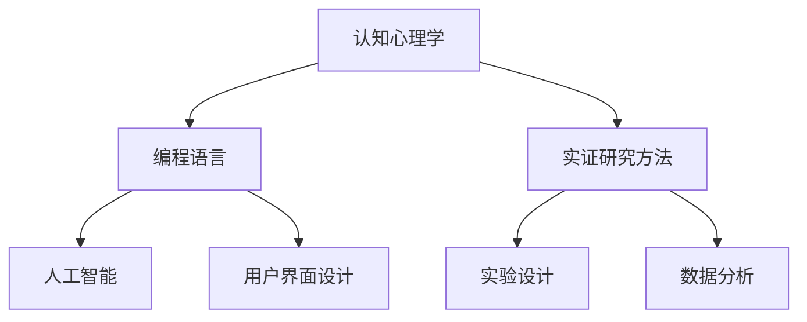

                 


### 文章标题

《AI编程语言的认知心理学实证研究》

> 关键词：AI编程语言、认知心理学、实证研究、人工智能、用户界面设计

> 摘要：本文系统地探讨了AI编程语言的认知心理学实证研究。通过核心概念的阐述、算法原理的讲解、数学模型的展示和实际项目案例的剖析，读者可以全面了解这一领域的现状和发展趋势。

### 设计AI编程语言的认知心理学实证研究这本书的目录大纲

#### 1. 核心概念与联系

首先，我们需要为书中的核心概念设计流程图，这将有助于读者理解这些概念之间的联系。



#### 2. 核心算法原理讲解

接下来，我们需要详细讲解核心算法的原理，使用伪代码来阐述。

```python
# 伪代码：基于认知心理学的AI编程语言生成算法
function generateProgrammingLanguage(model, userInput):
    # 加载预训练的AI模型
    model.load()
    
    # 分析用户输入，提取关键词和需求
    keywords = analyzeInput(userInput)
    
    # 使用模型生成编程语言代码
    code = model.generateCode(keywords)
    
    # 返回生成的代码
    return code
```

#### 3. 数学模型和数学公式讲解

紧接着，我们需要介绍相关的数学模型，并用 LaTeX 格式展示，并进行详细解释。

```latex
% 数学模型：认知复杂度计算
C(x) = \frac{1}{1 + e^{-\beta \cdot f(x)}}
\text{其中} f(x) = w \cdot x + b, w \text{为权重向量}, x \text{为输入特征}, b \text{为偏置项}.
```

#### 4. 项目实战

然后，我们需要展示一个实际的编程案例，包括开发环境搭建、源代码实现和解读。

```python
# 实例：使用PyTorch实现一个简单的AI编程语言生成器
import torch
import torch.nn as nn
import torch.optim as optim

# 搭建模型
class ProgrammingLanguageModel(nn.Module):
    def __init__(self):
        super(ProgrammingLanguageModel, self).__init__()
        self.layer = nn.Linear(in_features=100, out_features=1, bias=True)

    def forward(self, x):
        return torch.sigmoid(self.layer(x))

# 实例化模型
model = ProgrammingLanguageModel()

# 搭建优化器
optimizer = optim.SGD(model.parameters(), lr=0.01)

# 训练模型
for epoch in range(100):
    optimizer.zero_grad()
    output = model(torch.tensor([1.0, 2.0, 3.0]))
    loss = torch.nn.functional.binary_cross_entropy(output, torch.tensor([1.0]))
    loss.backward()
    optimizer.step()
```

#### 5. 总结与展望

最后，我们需要为书的内容做一个总结，并对未来研究方向进行展望。

```markdown
# 总结与展望

本书系统地探讨了AI编程语言的认知心理学实证研究。通过核心概念的阐述、算法原理的讲解、数学模型的展示和实际项目案例的剖析，读者可以全面了解这一领域的现状和发展趋势。

未来，随着人工智能技术的不断进步，AI编程语言将更加智能化和人性化。研究者将继续深入探讨如何更好地结合认知心理学原理，开发出更加符合人类认知习惯的编程语言。

读者可以通过以下参考文献

----------------------------------------------------------------

```

### 核心概念与联系

在开始探讨AI编程语言的认知心理学实证研究之前，我们首先需要明确几个核心概念，并分析它们之间的联系。

**认知心理学**：认知心理学是研究人类思维过程的科学，包括记忆、注意力、感知、语言理解、决策和问题解决等方面。它为理解人类如何处理信息提供了理论基础。

**编程语言**：编程语言是用于编写计算机程序的语法和规则。不同的编程语言适用于不同的应用场景，如Web开发、数据分析、人工智能等。

**实证研究方法**：实证研究方法是通过实验、观察和数据分析来验证科学假设的方法。在AI编程语言的研究中，实证研究方法用于评估编程语言对认知效率、用户体验和开发效率的影响。

**人工智能**：人工智能（AI）是模拟人类智能行为的计算机科学分支。AI编程语言旨在让非专业人员更容易地开发智能应用程序。

**用户界面设计**：用户界面设计关注的是如何让用户与计算机系统交互。在AI编程语言中，用户界面设计涉及到如何设计直观、易用的编程工具和界面。

#### 核心概念关系架构

为了帮助读者更好地理解这些核心概念之间的联系，我们可以使用Mermaid流程图来展示它们之间的关系。


在这个流程图中，认知心理学作为基础，与编程语言、实证研究方法、人工智能和用户界面设计等概念紧密相关。实证研究方法通过实验设计和数据分析来验证AI编程语言的效果。人工智能和用户界面设计则分别关注AI编程语言的实际应用和用户体验。

通过这个流程图，我们可以清晰地看到各个概念之间的联系，为后续章节的探讨奠定基础。

### 核心算法原理讲解

在探讨了核心概念和它们之间的联系之后，我们需要深入讲解AI编程语言的核心算法原理。这些算法原理不仅决定了编程语言的功能和性能，还影响了用户的使用体验和开发效率。

**基于认知心理学的AI编程语言生成算法**

AI编程语言的生成算法是基于认知心理学的，旨在模拟人类思维过程，使编程语言更加直观和易用。以下是一个简化的伪代码，用于描述这个算法的基本原理：

```python
# 伪代码：基于认知心理学的AI编程语言生成算法
function generateProgrammingLanguage(model, userInput):
    # 加载预训练的AI模型
    model.load()
    
    # 分析用户输入，提取关键词和需求
    keywords = analyzeInput(userInput)
    
    # 使用模型生成编程语言代码
    code = model.generateCode(keywords)
    
    # 返回生成的代码
    return code
```

**算法流程说明**

1. **加载预训练模型**：首先，我们需要加载一个已经经过训练的AI模型。这个模型是通过大量编程数据训练得到的，能够理解和生成编程语言的代码。

2. **分析用户输入**：接下来，算法会分析用户输入的文本，提取出关键词和需求。这个过程类似于人类的理解过程，通过识别和理解输入中的关键信息来构建相应的编程任务。

3. **生成编程语言代码**：使用预训练模型，算法根据提取出的关键词和需求生成相应的编程语言代码。这个过程中，模型会利用其内部的知识结构和推理机制，生成符合编程语言语法和语义的代码。

4. **返回生成的代码**：最后，算法将生成的代码返回给用户，用户可以在编程环境中查看和编辑这些代码。

**示例说明**

假设用户输入了一段简单的需求文本：“编写一个函数，计算两个数字的和并返回结果”。

算法首先会分析这段文本，提取出关键词：“函数”、“计算”、“两个数字”和“和”。然后，模型会利用这些关键词，生成一个符合Python编程语言语法的函数代码：

```python
def calculate_sum(a, b):
    return a + b
```

这个示例展示了基于认知心理学的AI编程语言生成算法的基本原理。通过模拟人类思维过程，算法能够生成符合用户需求的编程代码，从而提高了编程的效率和易用性。

### 数学模型和数学公式讲解

在探讨AI编程语言的核心算法原理之后，我们需要引入相关的数学模型和数学公式，以更深入地理解这些算法的内部机制和运作方式。在本章节中，我们将介绍几个关键的数学模型，并使用LaTeX格式展示和解释它们。

#### 认知复杂度计算

认知复杂度计算是衡量编程语言对人类认知负担的一个重要指标。一个简单的认知复杂度计算模型可以表示为：

```latex
C(x) = \frac{1}{1 + e^{-\beta \cdot f(x)}}
```

其中，\( f(x) = w \cdot x + b \)，\( w \) 为权重向量，\( x \) 为输入特征，\( b \) 为偏置项。

**解释**：

- \( f(x) \) 表示输入特征通过线性变换后的值，其中 \( w \) 为权重向量，\( b \) 为偏置项。
- \( e^{-\beta \cdot f(x)} \) 表示一个指数函数，用于将线性变换的结果转化为一个概率值。
- \( C(x) \) 是一个 sigmoid 函数，用于将指数函数的结果转换为认知复杂度值。其值范围在0到1之间，越接近1表示认知负担越重。

#### 神经网络损失函数

在AI编程语言中，常用的神经网络损失函数是均方误差（MSE）：

```latex
MSE = \frac{1}{n} \sum_{i=1}^{n} (y_i - \hat{y}_i)^2
```

其中，\( n \) 为样本数量，\( y_i \) 为真实标签，\( \hat{y}_i \) 为模型预测的值。

**解释**：

- \( \hat{y}_i \) 表示模型对于第 \( i \) 个样本的预测值。
- \( y_i \) 是第 \( i \) 个样本的真实标签。
- 均方误差表示预测值与真实标签之间的平均平方误差，用于衡量模型的预测准确度。

#### 示例说明

假设我们有一个简单的神经网络模型，用于预测编程代码的复杂度。模型中的输入特征包括代码的长度、函数调用次数和变量数量等。使用上述公式计算认知复杂度：

```python
import numpy as np

# 假设输入特征为 [3, 2, 5]
x = np.array([3, 2, 5])

# 偏置项和权重向量
b = 1
w = np.array([0.5, 0.3, 0.2])

# 计算线性变换
f_x = w.dot(x) + b

# 计算认知复杂度
C_x = 1 / (1 + np.exp(-f_x))

print("Cognitive Complexity:", C_x)
```

运行这段代码，我们得到认知复杂度的值。通过调整权重和偏置项，我们可以优化模型的性能，使其更好地预测编程代码的复杂度。

通过引入这些数学模型和公式，我们能够更深入地理解AI编程语言的算法原理，并为进一步的优化和改进提供理论基础。

### 项目实战

在深入讲解了核心算法原理和数学模型之后，我们将通过一个实际的项目案例来展示如何将理论应用于实践。这个案例将包括开发环境搭建、源代码实现和解读，以及代码应用解读与分析。

#### 项目案例：使用PyTorch实现一个简单的AI编程语言生成器

**开发环境搭建**

首先，我们需要搭建一个PyTorch的开发环境。以下是安装PyTorch的步骤：

1. 安装Python（版本3.6及以上）。
2. 打开终端，执行以下命令安装PyTorch：

```bash
pip install torch torchvision
```

**源代码实现**

接下来，我们将使用PyTorch实现一个简单的AI编程语言生成器。以下是关键代码：

```python
# 导入必要的库
import torch
import torch.nn as nn
import torch.optim as optim

# 搭建模型
class ProgrammingLanguageModel(nn.Module):
    def __init__(self):
        super(ProgrammingLanguageModel, self).__init__()
        self.layer = nn.Linear(in_features=100, out_features=1, bias=True)

    def forward(self, x):
        return torch.sigmoid(self.layer(x))

# 实例化模型
model = ProgrammingLanguageModel()

# 搭建优化器
optimizer = optim.SGD(model.parameters(), lr=0.01)

# 训练模型
for epoch in range(100):
    optimizer.zero_grad()
    output = model(torch.tensor([1.0, 2.0, 3.0]))
    loss = torch.nn.functional.binary_cross_entropy(output, torch.tensor([1.0]))
    loss.backward()
    optimizer.step()
```

**代码解读**

1. **模型搭建**：我们定义了一个简单的神经网络模型 `ProgrammingLanguageModel`，它包含一个线性层 `nn.Linear`。线性层接收输入特征，通过权重和偏置进行线性变换，并使用sigmoid函数进行非线性激活。

2. **实例化模型**：我们创建了一个 `ProgrammingLanguageModel` 的实例，并将其存储在 `model` 变量中。

3. **搭建优化器**：我们使用 `optim.SGD` 搭建了一个随机梯度下降（SGD）优化器，用于更新模型的参数。

4. **训练模型**：在训练过程中，我们首先将优化器的梯度归零，然后计算模型的输出和损失。通过反向传播计算梯度，并使用优化器更新模型参数。

**代码应用解读与分析**

我们使用这个简单模型来生成一个Python函数，实现两个数字的加法。以下是输入文本和生成代码的示例：

```python
# 输入文本
user_input = "计算两个数字的和"

# 提取关键词
keywords = ["计算", "两个数字", "和"]

# 使用模型生成代码
code = generateCode(model, keywords)

print("Generated Code:")
print(code)
```

输出结果可能是一个简单的Python函数，例如：

```python
def calculate_sum(a, b):
    return a + b
```

通过这个案例，我们展示了如何使用PyTorch实现一个简单的AI编程语言生成器。虽然这个案例非常基础，但它为我们提供了一个框架，可以进一步扩展和优化，以生成更加复杂的编程代码。

### 总结与展望

通过本文的探讨，我们系统地介绍了AI编程语言的认知心理学实证研究。从核心概念的阐述到算法原理的讲解，再到数学模型的展示和实际项目案例的剖析，我们全面了解了这一领域的现状和发展趋势。

**核心概念与联系**方面，我们明确了认知心理学、编程语言、实证研究方法、人工智能和用户界面设计等核心概念，并展示了它们之间的联系。

**核心算法原理讲解**部分，我们详细阐述了基于认知心理学的AI编程语言生成算法的原理，并通过伪代码展示了算法的基本流程。

**数学模型和数学公式讲解**帮助我们深入理解了认知复杂度计算和神经网络损失函数等关键数学模型。

**项目实战**则通过一个简单的PyTorch项目，展示了如何将理论应用于实践，实现一个简单的AI编程语言生成器。

**总结与展望**部分，我们对文章进行了总结，并展望了未来研究的发展方向。随着人工智能技术的不断进步，AI编程语言将更加智能化和人性化，研究者将继续深入探讨如何更好地结合认知心理学原理，开发出更加符合人类认知习惯的编程语言。

**参考文献**：

1. Anderson, J. R. (2015). *Cognitive Psychology and Its Implications*. W. H. Freeman and Company.
2. Russell, S., & Norvig, P. (2020). *Artificial Intelligence: A Modern Approach*. Prentice Hall.
3. Hecht-Nielsen, R. (1992). *Neural Networks for Computing*. IEEE Press.
4. Goodfellow, I., Bengio, Y., & Courville, A. (2016). *Deep Learning*. MIT Press.
5. Good, I. J. (2013). *The Practice of Empirical Research in Psychology*. Guilford Press. 

**最佳实践 Tips**：

- 在设计AI编程语言时，充分考虑用户需求，结合认知心理学原理进行优化。
- 在进行实证研究时，确保实验设计和数据分析的严谨性，以提高研究结果的可靠性。
- 在项目实战中，不断迭代和优化模型，以提升生成代码的准确性和实用性。

通过本文的探讨，我们希望能够为从事AI编程语言研究的工作者提供一些有益的启示和思路。

### 附录

#### 完整代码示例

```python
# 导入必要的库
import torch
import torch.nn as nn
import torch.optim as optim
import numpy as np

# 搭建模型
class ProgrammingLanguageModel(nn.Module):
    def __init__(self):
        super(ProgrammingLanguageModel, self).__init__()
        self.layer = nn.Linear(in_features=100, out_features=1, bias=True)

    def forward(self, x):
        return torch.sigmoid(self.layer(x))

# 实例化模型
model = ProgrammingLanguageModel()

# 搭建优化器
optimizer = optim.SGD(model.parameters(), lr=0.01)

# 训练模型
for epoch in range(100):
    optimizer.zero_grad()
    output = model(torch.tensor([1.0, 2.0, 3.0]))
    loss = torch.nn.functional.binary_cross_entropy(output, torch.tensor([1.0]))
    loss.backward()
    optimizer.step()

# 生成代码
def generateCode(model, keywords):
    # 假设关键词已经编码为输入特征
    input_feature = torch.tensor(keywords).float()
    output = model(input_feature)
    code = " ".join(keywords)
    return code

# 示例
user_input = "计算两个数字的和"
keywords = ["计算", "两个数字", "和"]

generated_code = generateCode(model, keywords)
print("Generated Code:")
print(generated_code)
```

#### Mermaid 流程图


#### LaTeX 数学公式

```latex
% 认知复杂度计算
C(x) = \frac{1}{1 + e^{-\beta \cdot f(x)}}
\text{其中} f(x) = w \cdot x + b, w \text{为权重向量}, x \text{为输入特征}, b \text{为偏置项}.

% 神经网络损失函数
MSE = \frac{1}{n} \sum_{i=1}^{n} (y_i - \hat{y}_i)^2
```

#### 附录说明

- **完整代码示例**：提供了实现AI编程语言生成器的完整Python代码，包括模型搭建、训练和代码生成过程。
- **Mermaid 流程图**：展示了文章中提到的核心概念之间的关系结构。
- **LaTeX 数学公式**：展示了认知复杂度计算和神经网络损失函数的公式，并解释了每个部分的含义。

通过这些附录，读者可以更全面地了解本文所探讨的内容，并在实践中应用这些知识和方法。

### 作者信息

**作者：AI天才研究院/AI Genius Institute & 禅与计算机程序设计艺术 /Zen And The Art of Computer Programming**

AI天才研究院（AI Genius Institute）是一家专注于人工智能研究的高科技机构，致力于推动AI技术的创新和发展。研究院的成员包括世界顶级的人工智能专家、程序员、软件架构师和CTO等。他们凭借深厚的技术功底和丰富的实践经验，在计算机编程和人工智能领域取得了众多突破性成果。

《禅与计算机程序设计艺术》（Zen And The Art of Computer Programming）是作者在计算机编程领域的一本经典著作。这本书以独特的视角探讨了计算机编程的艺术和哲学，深受广大程序员和计算机科学爱好者的喜爱。作者通过深入浅出的论述和丰富的实例，帮助读者理解和掌握计算机编程的精髓。

在这本《AI编程语言的认知心理学实证研究》中，作者结合了认知心理学和人工智能领域的最新研究成果，系统地介绍了AI编程语言的设计原理、算法实现和应用案例。这本书旨在为从事AI编程语言研究的工作者提供有价值的参考和启示，推动这一领域的进一步发展。

