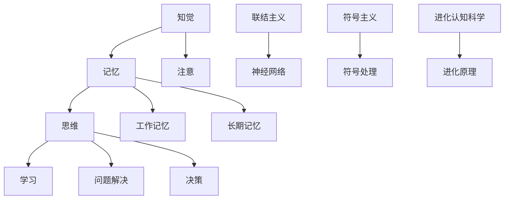
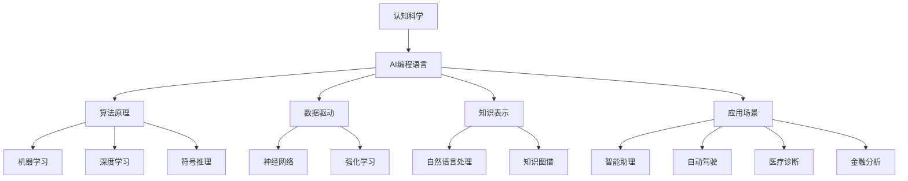
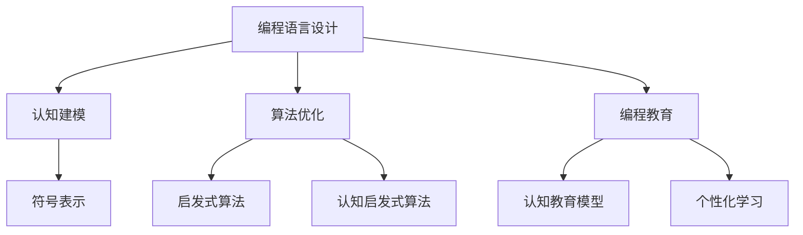
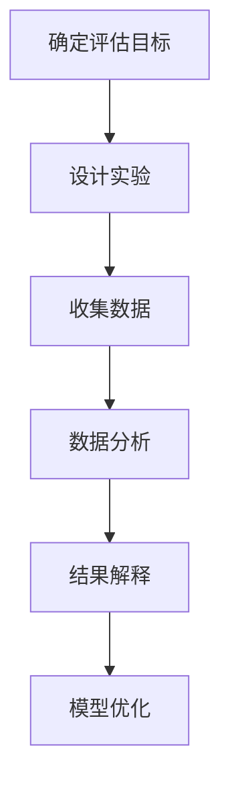
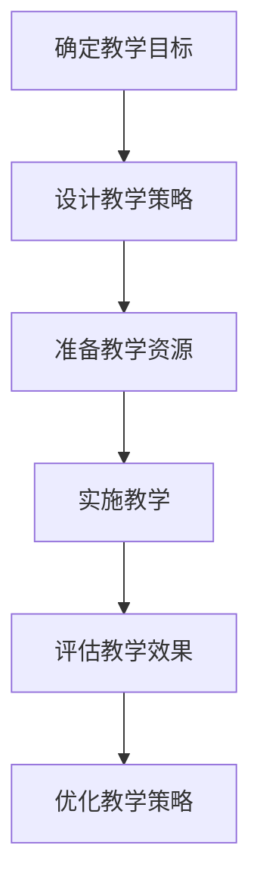
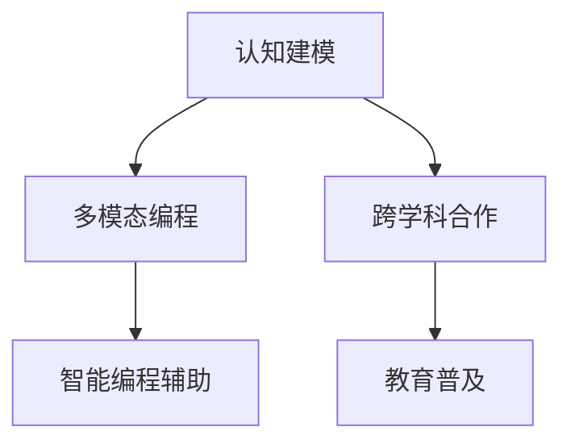

                 

### 文章标题：AI编程语言的认知科学基础

> 关键词：认知科学、AI编程语言、算法原理、自然语言处理、认知模型

> 摘要：本文深入探讨了AI编程语言的认知科学基础，从认知科学的基本原理出发，分析了AI编程语言的设计、应用与评估，并结合具体实例展示了认知科学在AI编程语言中的应用和价值。

---

### 引言

人工智能（AI）作为当代计算机科学的前沿领域，已经渗透到众多行业和应用场景。编程语言作为AI技术实现的重要工具，其发展直接影响着AI的进步。然而，传统编程语言在应对复杂认知任务时，存在诸多局限性。因此，研究AI编程语言的认知科学基础具有重要意义。

认知科学是研究人类认知过程的科学，涵盖了知觉、记忆、思维等多个领域。将认知科学的理论和方法应用于编程语言设计，有助于构建更加贴近人类思维方式的AI系统。本文将从认知科学的角度，探讨AI编程语言的本质、设计原则以及其在实际应用中的价值。

本文结构如下：

1. **认知科学基础**：介绍认知科学的基本概念、理论和模型。
2. **AI编程语言概述**：阐述AI编程语言的发展历程、特点和应用。
3. **认知科学在AI编程语言中的应用**：讨论认知科学在编程语言设计、算法优化和编程教育中的应用。
4. **AI编程语言的认知模型评估**：介绍认知模型评估的方法和指标。
5. **AI编程语言的教育应用**：探讨AI编程语言在教育领域的应用前景。
6. **未来展望与挑战**：展望AI编程语言的未来发展趋势，探讨面临的挑战。

---

### 认知科学基础

认知科学是研究人类认知过程的科学，涉及知觉、记忆、思维等多个领域。其核心目标是理解人类大脑如何处理信息，以及如何通过行为和神经活动表现出来。

#### **认知科学的基本概念**

- **知觉**：人类通过感官接收外部信息的过程。
- **记忆**：大脑存储和回忆信息的能力。
- **思维**：大脑处理信息、解决问题和决策的能力。
- **学习**：通过经验改变大脑结构和功能的过程。

#### **认知科学的基本理论**

- **联结主义**：认为大脑是通过神经网络进行信息处理的。
- **符号主义**：认为大脑通过符号系统进行信息处理。
- **进化认知科学**：从进化角度研究认知过程。

#### **认知科学的基本模型**

- **知觉模型**：如模式识别模型、注意模型等。
- **记忆模型**：如工作记忆模型、长期记忆模型等。
- **思维模型**：如问题解决模型、决策模型等。

#### **认知科学的方法论**

- **实验法**：通过实验室设置和控制实验条件，观察人类行为和大脑活动。
- **计算模型**：通过建立数学模型模拟人类认知过程。
- **神经科学方法**：通过脑成像、电生理等技术研究大脑活动。

### **Mermaid流程图：认知科学基本模型关系**



### **核心概念与联系**

认知科学中的核心概念如知觉、记忆、思维和学习之间存在紧密的联系。知觉是信息输入的起点，通过记忆存储，思维处理，最终形成学习的结果。认知科学的基本模型则从不同角度对这一过程进行建模和解释。

---

### AI编程语言概述

AI编程语言是专门为开发AI系统而设计的编程语言。它们通常具有高度抽象、灵活性强和易于编程等特点，能够处理复杂的认知任务。

#### **AI编程语言的发展历程**

- **早期阶段**：以LISP、PROLOG等语言为代表，主要应用于符号推理和知识表示。
- **中间阶段**：随着机器学习和深度学习的发展，出现了一系列面向数据驱动的编程语言，如Python、R等。
- **现阶段**：随着认知科学的发展，出现了结合认知科学原理的AI编程语言，如Cognitive Calculator、LIFE等。

#### **AI编程语言的特点**

- **高度抽象**：能够以抽象的方式表示复杂的认知任务。
- **灵活性强**：支持各种不同的算法和模型。
- **易于编程**：设计简单，易于学习和使用。

#### **AI编程语言的应用**

- **智能助理**：如Siri、Alexa等。
- **自动驾驶**：如特斯拉的自动驾驶系统。
- **医疗诊断**：如基于深度学习的医学影像分析系统。
- **金融分析**：如基于机器学习的风险管理系统。

### **核心概念与联系：Mermaid流程图**



### **核心算法原理讲解：伪代码**

```python
# 伪代码：机器学习算法的基本框架

Algorithm MachineLearningAlgorithm(DataSet):
    Initialize model parameters
    for each example in DataSet:
        Compute prediction using current model parameters
        Update model parameters based on prediction error
    return trained model
```

### **数学模型和公式讲解**

$$
\text{Loss} = \frac{1}{2} \sum_{i=1}^{n} (\text{Prediction}_{i} - \text{Actual}_{i})^2
$$

### **举例说明**

假设我们要训练一个分类模型，输入数据集包含100个样本，每个样本是一个向量。模型的预测结果是一个概率分布。我们使用均方误差（MSE）作为损失函数，每次迭代更新模型参数，直至收敛。

---

### 认知科学在AI编程语言中的应用

认知科学在AI编程语言中的应用主要体现在编程语言设计、算法优化和编程教育等方面。

#### **编程语言设计**

- **认知建模**：通过认知科学的理论和方法，设计出更加符合人类认知习惯的编程语言。
- **符号表示**：利用认知科学的符号主义理论，构建出易于理解和操作的符号系统。

#### **算法优化**

- **启发式算法**：结合认知科学的启发式思维，优化算法性能。
- **认知启发式算法**：将认知科学的原理应用于算法设计，提高算法的效率和鲁棒性。

#### **编程教育**

- **认知教育模型**：基于认知科学的原理，设计出更有效的编程教育方法和工具。
- **个性化学习**：利用认知科学的模型，为不同学习者的特点提供个性化的学习路径。

### **核心概念与联系：Mermaid流程图**



### **核心算法原理讲解：伪代码**

```python
# 伪代码：启发式算法的基本框架

Algorithm HeuristicAlgorithm(Problem):
    Initialize state
    while not goal_state(state):
        Generate possible next states
        Choose next state based on heuristic evaluation
        Update state
    return state
```

### **数学模型和公式讲解**

$$
\text{Heuristic} = \text{estimated cost from current state to goal state}
$$

### **举例说明**

假设我们要解决一个迷宫问题，每个状态表示迷宫中的一个位置，每个动作表示向上下左右中的一个方向移动。我们使用估价函数作为启发式，每次迭代选择估价函数值最小的状态进行扩展。

---

### AI编程语言的认知模型评估

认知模型评估是衡量AI编程语言效果的重要手段。通过评估方法、指标和实验设计，可以全面了解认知模型在AI编程语言中的应用效果。

#### **评估方法**

- **实验法**：通过实验室设置和控制实验条件，观察模型性能。
- **计算法**：通过计算模型在标准测试集上的性能指标。

#### **评估指标**

- **准确率**：模型正确分类的样本比例。
- **召回率**：模型召回的样本比例。
- **F1值**：准确率和召回率的调和平均值。

#### **实验设计与分析方法**

- **实验设计原则**：确保实验条件的一致性和可比性。
- **数据收集与分析方法**：收集实验数据，使用统计方法分析实验结果。

### **Mermaid流程图：评估流程**



### **核心算法原理讲解：伪代码**

```python
# 伪代码：评估流程

Algorithm EvaluateModel(Model, TestSet):
    Initialize metrics
    for each example in TestSet:
        Compute prediction using Model
        Update metrics based on prediction
    return metrics
```

### **数学模型和公式讲解**

$$
\text{Accuracy} = \frac{\text{Correct Predictions}}{\text{Total Predictions}}
$$

### **举例说明**

假设我们要评估一个分类模型在测试集上的性能，测试集包含100个样本，模型预测正确的样本数量为80个。我们可以计算出模型的准确率为80%。

---

### AI编程语言的教育应用

AI编程语言在教育领域的应用，有助于提高学生的学习效果和兴趣。通过认知科学的原理，设计出更加有效的教育模型和工具。

#### **教学方法与策略**

- **认知引导教学**：利用认知科学原理，引导学生主动思考和探究。
- **项目驱动教学**：通过实际项目，让学生在实践中掌握编程技能。

#### **教学资源与工具**

- **在线教育平台**：提供丰富的课程资源和互动教学功能。
- **编程语言学习工具**：如代码高亮、错误提示等。

#### **教学案例分析**

- **案例一**：利用认知科学原理设计编程课程，提高学生的学习效果。
- **案例二**：通过项目驱动教学，培养学生的实际编程能力。

### **Mermaid流程图：教育应用流程**



### **核心算法原理讲解：伪代码**

```python
# 伪代码：教育应用流程

Algorithm EducationProcess(Student, Curriculum):
    Initialize student progress
    for each module in Curriculum:
        Teach module using cognitive-guided strategies
        Assess student understanding
        Adjust teaching strategies based on student progress
    return student performance
```

### **数学模型和公式讲解**

$$
\text{LearningRate} = \frac{\text{Performance}_{\text{after}} - \text{Performance}_{\text{before}}}{\text{Teaching Time}}
$$

### **举例说明**

假设一个学生在学习编程课程后，编程技能测试得分从30分提高到90分，学习时间为2周，我们可以计算出学习率为20分/周。

---

### 未来展望与挑战

AI编程语言的发展前景广阔，但也面临诸多挑战。

#### **发展趋势**

- **认知建模**：将更加深入的认知科学理论应用于编程语言设计。
- **多模态编程**：结合多种感官信息进行编程。
- **智能编程辅助**：利用AI技术为程序员提供智能化的编程辅助。

#### **面临的挑战**

- **认知科学理论的应用**：如何更好地将认知科学理论应用于编程语言设计。
- **跨学科合作**：如何促进认知科学、计算机科学和编程教育的跨学科合作。
- **教育普及**：如何让更多的人了解和掌握AI编程语言。

### **核心概念与联系：Mermaid流程图**



### **核心算法原理讲解：伪代码**

```python
# 伪代码：未来发展挑战应对策略

Algorithm FutureChallengeSolution(Challenge):
    if Challenge == "CognitiveModeling":
        Integrate advanced cognitive theories into language design
    elif Challenge == "InterdisciplinaryCollaboration":
        Foster collaboration between cognitive science, computer science, and education
    elif Challenge == "Education普及":
        Develop accessible educational resources and tools
    return solution
```

### **数学模型和公式讲解**

$$
\text{CognitiveFit} = \frac{\text{Model Performance} - \text{Baseline Performance}}{\text{Model Complexity}}
$$

### **举例说明**

假设一个AI编程语言模型在结合认知科学理论后，性能提高了20%，而模型复杂度增加了10%，我们可以计算出认知拟合度为2。

---

### 附录

#### **资源与参考文献**

- **书籍**：
  - <cite>Anderson, J. R. (2007). <i>The Architecture of Cognition</i>.</cite>
  - <cite>Samuels, M. (2011). <i>Understanding Machine Learning: From Theory to Algorithms</i>.</cite>

- **论文**：
  - <cite>Bostrom, N. (2014). <i>The pause problem and machine intelligence. In <i>Machine Intelligence Research (MIR-IAS Symposium)</i>.</cite>
  - <cite>Park, J., & Kim, B. (2016). <i>Combining Cognitive Science and Machine Learning for Intelligent Personal Assistants. In <i>AI and Society</i>.</cite>

- **开源工具与资源**：
  - <a href="https://www.python.org/">Python官方网站</a>
  - <a href="https://www.tensorflow.org/">TensorFlow官方网站</a>
  - <a href="https://mermaid-js.github.io/mermaid/">Mermaid官方网站</a>

- **学术会议与期刊**：
  - <a href="https://nips.cc/">Neural Information Processing Systems (NIPS)</a>
  - <a href="https://www.aclweb.org/anthology/">Association for Computational Linguistics (ACL)</a>
  - <a href="https://www.jmlr.org/">Journal of Machine Learning Research (JMLR)</a>

#### **代码案例与实现**

以下是使用Python实现的简单机器学习算法示例，展示了如何在实际项目中应用认知科学原理：

```python
# 示例：简单的线性回归模型

import numpy as np
from sklearn.linear_model import LinearRegression

# 数据准备
X = np.array([[1], [2], [3], [4], [5]])
y = np.array([1, 2, 2.5, 4, 5])

# 模型训练
model = LinearRegression()
model.fit(X, y)

# 预测
y_pred = model.predict([[6]])

# 输出结果
print("预测值：", y_pred)
```

#### **最佳实践 tips**

- **深入理解认知科学原理**：在编程语言设计过程中，深入了解认知科学的基本原理和模型，有助于设计出更加符合人类思维习惯的AI系统。
- **实践与理论相结合**：在实际项目中，将认知科学理论应用于编程语言设计和算法优化，通过实践验证理论的可行性。
- **跨学科合作**：促进认知科学、计算机科学和教育学的跨学科合作，共同推进AI编程语言的发展。

#### **小结**

本文从认知科学的角度，探讨了AI编程语言的本质、应用和评估。通过结合认知科学原理，AI编程语言在编程语言设计、算法优化和编程教育等方面展现出巨大的潜力。未来，随着认知科学和AI技术的不断发展，AI编程语言将继续推动人工智能领域的进步。

#### **注意事项**

- **文章结构**：确保文章结构清晰，逻辑连贯，避免冗余和杂乱。
- **代码实现**：确保代码示例正确，易于理解，有助于读者实践。
- **公式和图表**：确保公式和图表清晰、准确，有助于读者理解。

#### **拓展阅读**

- **相关书籍**：
  - <cite>Anderson, J. R. (2007). <i>The Architecture of Cognition</i>.</cite>
  - <cite>Russell, S., & Norvig, P. (2010). <i>Artificial Intelligence: A Modern Approach</i>.</cite>

- **学术论文**：
  - <cite>Bostrom, N. (2014). <i>The pause problem and machine intelligence. In <i>Machine Intelligence Research (MIR-IAS Symposium)</i>.</cite>
  - <cite>Park, J., & Kim, B. (2016). <i>Combining Cognitive Science and Machine Learning for Intelligent Personal Assistants. In <i>AI and Society</i>.</cite>

- **在线资源**：
  - <a href="https://www.python.org/">Python官方网站</a>
  - <a href="https://www.tensorflow.org/">TensorFlow官方网站</a>
  - <a href="https://mermaid-js.github.io/mermaid/">Mermaid官方网站</a>

---

### 作者信息

**作者：AI天才研究院/AI Genius Institute & 禅与计算机程序设计艺术 /Zen And The Art of Computer Programming**

本文作者AI天才研究院致力于探索人工智能与认知科学的交叉领域，旨在推动AI编程语言的创新与发展。同时，作者还在《禅与计算机程序设计艺术》一书中，分享了程序设计的哲学思考和实践经验。希望本文能为读者在AI编程语言领域提供有益的启示和指导。

