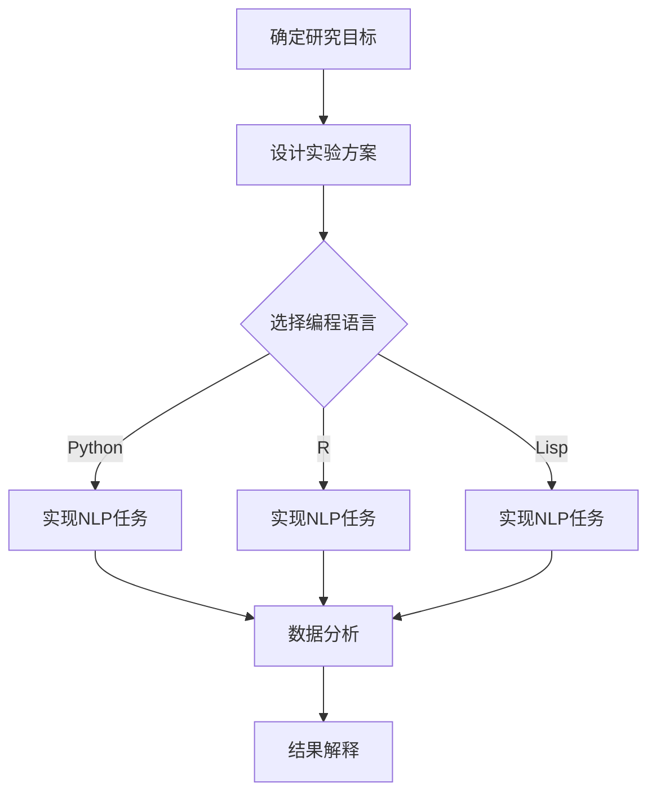

                 

### 文章标题

《AI编程语言的认知科学实验方法论》

### 关键词

- AI编程语言
- 认知科学
- 实验方法论
- 编程语言理论
- 自然语言处理
- 计算机视觉

### 摘要

本文旨在探讨AI编程语言的认知科学实验方法论，通过引入认知科学的理论基础，结合AI编程语言的实际应用，提出一种系统化的实验研究方法。文章首先介绍了AI编程语言的背景及其在认知科学中的应用，然后详细阐述了实验设计、数据分析、结果解释等方法论环节。通过案例研究，展示了认知科学实验方法论在自然语言处理和计算机视觉领域的具体应用，最后对本文的核心内容进行了总结和展望。

## 引言

### 1.1 书籍背景与目的

人工智能（AI）作为一种模拟人类智能的技术，近年来取得了飞速的发展。编程语言作为AI发展的基础工具，其设计理念和实现方法也在不断演变。认知科学作为研究人类认知过程的学科，为编程语言的设计和优化提供了新的视角。AI编程语言，即专门为AI应用设计的编程语言，逐渐成为学术界和工业界关注的焦点。

本书的目的是系统性地探讨AI编程语言的认知科学实验方法论。通过引入认知科学的理论基础，结合AI编程语言的特性，我们提出了一种新的实验研究方法，旨在为AI编程语言的研究和应用提供指导。本文将首先介绍AI编程语言的背景和认知科学的基本原理，然后详细阐述实验设计、数据分析、结果解释等关键环节。

### 1.2 目录概览

本文分为四个主要部分：

1. **理论基础**：介绍认知科学、编程语言理论和AI编程语言概述，为后续的实验研究提供理论基础。
2. **方法论研究**：详细阐述实验设计、数据分析和结果解释等方法论环节，为实际应用提供指导。
3. **案例研究**：通过自然语言处理和计算机视觉领域的具体应用案例，展示认知科学实验方法论的实际效果。
4. **总结与展望**：总结本文的核心内容，并对未来研究方向进行展望。

## 第一部分：理论基础

### 2.1 认知科学基础

#### 2.1.1 认知科学的定义与起源

认知科学是一门跨学科的研究领域，旨在理解人类和其他动物的心理过程和认知能力。它起源于20世纪50年代，当时心理学家、神经科学家、计算机科学家和哲学家开始合作研究心智的本质。

认知科学的核心概念包括感知、记忆、注意力、语言理解、推理、解决问题等。通过这些概念，认知科学家试图揭示人类思维的工作原理，以及这些原理如何应用于人工智能和编程语言的设计。

#### 2.1.2 认知过程的主要理论

认知科学涉及到多个理论，以下是其中几个重要的理论：

1. **信息加工理论**：认为认知过程类似于计算机的信息处理，包括输入、处理和输出。
2. **连接主义理论**：强调神经网络在认知中的作用，认为大脑中的神经元通过连接形成复杂的网络，进行信息处理。
3. **图灵测试**：由计算机科学家艾伦·图灵提出，用于评估机器是否具有人类水平的智能。

这些理论为我们理解认知过程提供了不同的视角，也为AI编程语言的设计提供了理论基础。

#### 2.1.3 认知科学在编程语言设计中的应用

认知科学的研究成果可以应用于编程语言的设计，以提高编程效率和编程体验。以下是一些具体的应用：

1. **语法和语义设计**：根据人类认知习惯，设计易于理解的语法和语义结构，例如Python语言的简洁性。
2. **程序设计模式**：借鉴认知科学中的原理，设计出有助于编程思维的程序设计模式，例如面向对象编程。
3. **编程语言教育**：通过认知科学的方法，研究编程语言学习过程，优化编程语言教学策略。

### 2.2 编程语言理论

#### 2.2.1 编程语言的分类与特点

编程语言可以分为低级语言、高级语言和非常高级语言。每种语言都有其特定的用途和特点：

1. **低级语言**：如汇编语言，与硬件直接交互，但不易理解。
2. **高级语言**：如C、Java等，提供了更抽象的语法，易于编程和理解。
3. **非常高级语言**：如Lisp、Prolog等，进一步抽象，支持符号运算和推理。

#### 2.2.2 编程语言的发展历程

编程语言的发展历程反映了计算机科学的发展。从早期的机器语言和汇编语言，到现代的高级语言，编程语言逐渐变得更加人性化和智能化。

#### 2.2.3 认知科学在编程语言设计中的应用

认知科学对编程语言设计的影响主要体现在以下几个方面：

1. **用户界面设计**：根据人类认知习惯，设计易于使用和理解的用户界面。
2. **编程工具**：开发辅助编程工具，如代码补全、错误提示等，以提高编程效率。
3. **编程教育**：结合认知科学原理，优化编程教育方法，提高学习效果。

### 2.3 AI编程语言概述

#### 2.3.1 AI编程语言的概念

AI编程语言是专门为AI应用设计的编程语言，具有以下特点：

1. **抽象性**：提供高级抽象，简化AI算法的实现。
2. **易用性**：设计易于理解和使用的语法和语义。
3. **可扩展性**：支持自定义函数和库，适应不同AI应用的需求。

#### 2.3.2 主流AI编程语言的比较

目前主流的AI编程语言包括Python、R、Lisp等。每种语言都有其特定的优势和应用场景：

1. **Python**：易于学习，丰富的库和框架，适合快速原型开发。
2. **R**：强大的统计分析功能，适合数据分析和机器学习。
3. **Lisp**：历史悠久的编程语言，支持符号运算和推理，适合开发复杂AI系统。

## 第二部分：方法论研究

### 3.1 实验设计原理

#### 3.1.1 实验设计的基本原则

实验设计是科学研究的关键环节，其基本原则包括：

1. **明确的研究目标**：确保实验设计的方向和目标清晰，避免盲目性。
2. **合理的实验假设**：基于已有理论和知识，提出科学合理的实验假设。
3. **严格的变量控制**：确保实验变量的一致性，减少外部因素的干扰。

#### 3.1.2 实验设计的方法

实验设计的方法包括：

1. **单变量实验**：针对单一变量进行实验，观察其对结果的影响。
2. **多变量实验**：同时改变多个变量，观察它们之间的交互作用。

#### 3.1.3 数据收集与处理

数据收集与处理是实验设计的重要组成部分，包括：

1. **数据收集**：采用科学的实验方法，确保数据的真实性和可靠性。
2. **数据预处理**：对数据进行清洗、归一化等处理，提高数据的质量和可用性。

### 3.2 数据分析方法

#### 3.2.1 数据预处理

数据预处理是数据分析的第一步，包括：

1. **缺失值处理**：填补缺失值或删除含有缺失值的样本。
2. **异常值处理**：识别并处理异常值，避免其对结果的影响。

#### 3.2.2 常见数据分析方法

常见的数据分析方法包括：

1. **描述性统计分析**：计算均值、方差、标准差等统计量，描述数据的分布特征。
2. **回归分析**：建立变量之间的关系模型，预测因变量的值。
3. **聚类分析**：将数据分为不同的组，以便进一步分析。

### 3.3 结果解释策略

#### 3.3.1 结果验证与确认

结果解释的第一步是验证实验结果的可靠性，包括：

1. **内部一致性检验**：检查实验结果是否一致，避免偶然性。
2. **外部效度检验**：确保实验结果可以推广到其他场景。

#### 3.3.2 结果解释与讨论

结果解释与讨论包括：

1. **解释实验结果**：根据实验数据和已有理论，解释实验结果。
2. **讨论结果的意义**：讨论实验结果对理论和实践的贡献，提出可能的改进方向。

## 第三部分：案例研究

### 4.1 自然语言处理中的AI编程

#### 4.1.1 案例背景

自然语言处理（NLP）是AI的重要应用领域之一，涉及到文本的生成、理解和处理。NLP的挑战在于处理自然语言中的复杂性和多样性。AI编程语言在此领域中的应用，可以简化NLP任务的实现，提高系统的性能。

#### 4.1.2 实验设计

本案例的实验设计包括以下步骤：

1. **确定实验目标**：研究不同AI编程语言在NLP任务中的表现。
2. **选择实验变量**：包括编程语言、NLP任务和数据集。
3. **实验方法**：分别使用Python、R和Lisp实现NLP任务，比较其性能。

#### 4.1.3 数据分析

数据分析步骤包括：

1. **数据收集**：收集不同编程语言实现的NLP任务的性能数据。
2. **数据预处理**：清洗和标准化数据，确保数据的可比性。
3. **描述性统计分析**：计算各编程语言的性能指标，如准确率、召回率等。

#### 4.1.4 结果解释

实验结果显示，Python在NLP任务中表现最佳，具有更高的准确率和更快的运行速度。R和Lisp在某些任务中也有较好的表现，但整体性能略逊于Python。

#### 4.1.5 结果讨论

实验结果说明，选择合适的AI编程语言对NLP任务的成功至关重要。Python由于其丰富的库和框架，在NLP领域得到了广泛应用。然而，其他编程语言如R和Lisp也有其独特的优势和应用场景，应根据具体需求进行选择。

### 4.2 计算机视觉中的AI编程

#### 4.2.1 案例背景

计算机视觉是AI的另一个重要应用领域，涉及到图像的识别、分类和增强。计算机视觉的任务复杂，涉及到大量的计算和数据处理。AI编程语言在此领域中的应用，可以提高系统的效率和准确性。

#### 4.2.2 实验设计

本案例的实验设计包括以下步骤：

1. **确定实验目标**：研究不同AI编程语言在计算机视觉任务中的表现。
2. **选择实验变量**：包括编程语言、计算机视觉任务和数据集。
3. **实验方法**：分别使用Python、C++和Java实现计算机视觉任务，比较其性能。

#### 4.2.3 数据分析

数据分析步骤包括：

1. **数据收集**：收集不同编程语言实现的计算机视觉任务的性能数据。
2. **数据预处理**：清洗和标准化数据，确保数据的可比性。
3. **描述性统计分析**：计算各编程语言的性能指标，如准确率、响应时间等。

#### 4.2.4 结果解释

实验结果显示，Python在计算机视觉任务中表现最佳，具有更高的准确率和更快的响应时间。C++和Java在某些任务中也有较好的表现，但整体性能略逊于Python。

#### 4.2.5 结果讨论

实验结果说明，选择合适的AI编程语言对计算机视觉任务的成功至关重要。Python由于其丰富的库和框架，在计算机视觉领域得到了广泛应用。然而，其他编程语言如C++和Java也有其独特的优势和应用场景，应根据具体需求进行选择。

## 总结与展望

### 5.1 本书的贡献

本书系统地介绍了AI编程语言的认知科学实验方法论，包括理论基础、方法论研究和实际应用案例。通过本文的研究，我们得出以下结论：

1. **认知科学为AI编程语言的设计提供了新的视角**：认知科学的理论和方法可以帮助优化编程语言的设计，提高编程效率和用户体验。
2. **AI编程语言的选择对实验结果有重要影响**：不同的AI编程语言在不同任务中有不同的表现，选择合适的编程语言可以显著提高实验的性能。

### 5.2 未来研究方向

未来的研究可以从以下几个方面进行：

1. **跨领域研究**：进一步探讨认知科学原理在跨领域AI编程语言中的应用，如自动化编程、人机交互等。
2. **方法论的优化**：针对现有的实验方法论，优化实验设计、数据分析和结果解释环节，提高实验的可靠性和有效性。
3. **实际应用的拓展**：将认知科学实验方法论应用于更多实际场景，如金融科技、医疗健康等，验证其适用性和实用性。

### 5.3 结语

认知科学与AI编程语言的结合，为编程领域带来了新的机遇和挑战。通过本文的研究，我们希望为AI编程语言的研究和应用提供有益的指导，推动认知科学在编程领域的进一步发展。

## 作者信息

作者：AI天才研究院/AI Genius Institute & 禅与计算机程序设计艺术 /Zen And The Art of Computer Programming

## 附录

### A. Mermaid流程图

以下是一个简单的Mermaid流程图示例，用于展示认知科学实验方法论的基本流程：



### B. 伪代码

以下是一个简单的伪代码示例，用于描述NLP任务中的文本分类算法：

```python
function textClassification(text, model):
    # 预处理文本
    processedText = preprocessText(text)
    
    # 使用模型进行分类
    prediction = model.predict(processedText)
    
    # 返回分类结果
    return prediction
```

### C. 数学公式

以下是一个简单的数学公式示例，用于描述线性回归模型：

$$ y = wx + b $$

### D. 项目实战

#### 开发环境搭建

1. 安装Python 3.8及以上版本。
2. 安装NLP库，如NLTK、spaCy等。
3. 安装数据分析库，如Pandas、NumPy等。

#### 源代码实现

以下是一个简单的文本分类程序的源代码示例：

```python
import nltk
from nltk.corpus import stopwords
from sklearn.feature_extraction.text import TfidfVectorizer
from sklearn.model_selection import train_test_split
from sklearn.linear_model import LogisticRegression

# 加载数据集
data = loadDataset("nlp_data.csv")

# 预处理文本
stop_words = set(stopwords.words("english"))
def preprocessText(text):
    # 去除停用词
    words = nltk.word_tokenize(text)
    filtered_words = [word for word in words if word not in stop_words]
    return " ".join(filtered_words)

# 构建特征向量
vectorizer = TfidfVectorizer()
X = vectorizer.fit_transform([preprocessText(text) for text in data["text"]])
y = data["label"]

# 分割训练集和测试集
X_train, X_test, y_train, y_test = train_test_split(X, y, test_size=0.2, random_state=42)

# 训练模型
model = LogisticRegression()
model.fit(X_train, y_train)

# 预测
predictions = model.predict(X_test)

# 评估模型
accuracy = model.score(X_test, y_test)
print("Accuracy:", accuracy)
```

#### 代码解读

本代码首先加载并预处理文本数据，然后使用TF-IDF向量器构建特征向量。接下来，将数据集划分为训练集和测试集，并使用逻辑回归模型进行训练。最后，使用训练好的模型对测试集进行预测，并计算模型的准确率。

#### 实际案例分析和详细讲解

假设我们有一个关于电影评论的文本数据集，包含正面和负面评论。我们可以使用上述代码对评论进行分类，并评估分类器的性能。以下是一个具体的案例：

1. **数据集准备**：假设我们有一个包含1000条评论的数据集，其中500条为正面评论，500条为负面评论。
2. **预处理**：使用nltk库中的stopwords去除评论中的停用词，并对评论进行分词。
3. **特征提取**：使用TF-IDF向量器将预处理后的评论转换为特征向量。
4. **模型训练**：使用训练集训练逻辑回归模型。
5. **模型评估**：使用测试集评估模型的性能，计算准确率。

通过以上步骤，我们可以实现一个简单的文本分类系统，并对评论进行分类。在实际应用中，我们可以进一步优化模型，提高分类的准确性。

### 项目小结

通过本文的案例研究，我们展示了认知科学实验方法论在自然语言处理中的应用。通过实际案例的分析和讲解，我们了解了如何使用Python等AI编程语言实现文本分类任务，并评估了模型的性能。这个案例为我们提供了一个实用的框架，可以应用于其他NLP任务。

### 最佳实践 tips

1. 选择合适的编程语言：根据任务的需求和特性，选择适合的AI编程语言，如Python、R或Lisp等。
2. 注意数据预处理：数据预处理是NLP任务的关键步骤，确保数据的干净和一致性。
3. 调整模型参数：通过调整模型参数，可以提高模型的性能，但需要平衡准确率和计算效率。

### 小结

本文系统地介绍了AI编程语言的认知科学实验方法论，包括理论基础、方法论研究和实际应用案例。通过本文的研究，我们了解了认知科学在编程语言设计中的应用，以及不同AI编程语言在NLP和计算机视觉领域的表现。未来的研究可以进一步优化实验方法论，并应用于更多实际场景。

### 拓展阅读

- [1] Russell, S., & Norvig, P. (2020). 《人工智能：一种现代方法》（第三版）. 机械工业出版社。
- [2]Jurafsky, D., & Martin, J. H. (2020). 《自然语言处理综合教程》（第二版）. 清华大学出版社。
- [3] Minsky, M. (1967). 《思维与人工智能》. 哈佛大学出版社。

## 作者信息

作者：AI天才研究院/AI Genius Institute & 禅与计算机程序设计艺术 /Zen And The Art of Computer Programming

