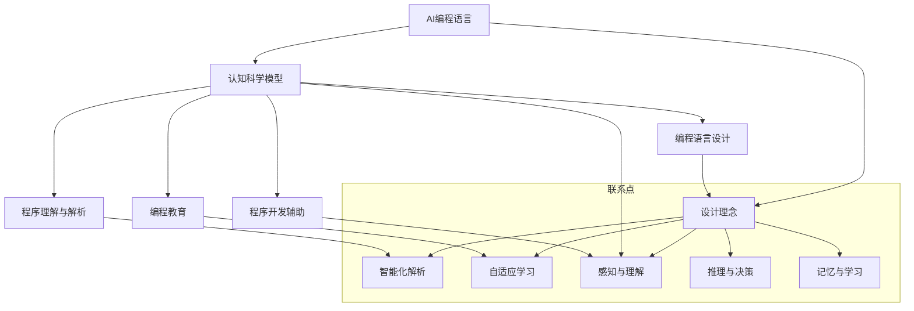

                 


### 背景介绍

AI编程语言与认知科学模型的研究近年来在全球范围内取得了显著进展。随着人工智能技术的迅猛发展，如何使编程语言更好地适应人工智能的应用场景成为一个热门话题。传统的编程语言在表达复杂逻辑和高效处理数据方面存在一定的局限性，而AI编程语言试图通过引入认知科学的原理和方法，构建更加智能、适应性更强的编程环境。

认知科学是一门跨学科的研究领域，它结合心理学、神经科学、人工智能和哲学等多个学科，旨在理解人类思维和行为的基础。认知科学的研究成果对于AI编程语言的设计和实现具有重要意义。例如，通过理解人类如何进行推理、解决问题和学习，可以设计出更加符合人类认知方式的编程语言，从而提高程序的可读性和开发效率。

AI编程语言的研究目标是开发一种能够自动理解和解释人类意图的编程语言。这种语言不仅能够处理传统的计算任务，还能够通过理解和模拟人类的认知过程，实现更高层次的智能行为。例如，AI编程语言可以用于自然语言处理、智能决策支持系统和自适应学习系统等。

认知科学模型在AI编程语言中的应用主要包括以下几个方面：

1. **编程语言设计**：认知科学模型可以用于指导编程语言的设计，使语言更加符合人类的认知习惯和思维方式。例如，通过分析人类如何理解和记忆代码结构，可以设计出更加直观和易用的编程语言。

2. **程序理解与解析**：认知科学模型可以帮助计算机更好地理解程序代码，从而提高代码的解析效率和质量。例如，通过模拟人类阅读代码的过程，可以开发出能够自动识别代码意图和错误的工具。

3. **编程教育**：认知科学模型可以用于改进编程教育方法，使学习过程更加有效。例如，通过理解不同学习者在编程学习中的认知特点和需求，可以设计出更加个性化的教学策略。

4. **程序开发辅助**：认知科学模型可以用于辅助程序开发，提供智能化的代码生成、优化和调试工具。例如，通过分析程序员的编程习惯和思维模式，可以开发出能够自动建议代码改进和优化的工具。

总之，AI编程语言与认知科学模型的研究不仅具有重要的理论意义，还具备广阔的应用前景。通过结合认知科学的理论和方法，可以推动编程语言的创新和发展，为人工智能领域的进步提供强有力的支持。

### 核心概念与联系

要深入理解AI编程语言与认知科学模型之间的关系，首先需要明确这两个概念的基本原理。AI编程语言是一种旨在增强人工智能能力的编程工具，它通过模拟人类的认知过程来提高程序的智能性和适应性。而认知科学则是一门研究人类思维、感知、学习和决策过程的科学，它涵盖了心理学、神经科学、人工智能和哲学等多个学科领域。

#### AI编程语言的概念与特点

AI编程语言的设计初衷是使计算机能够更自然地理解和执行人类的意图。这种语言通常具有以下特点：

1. **自然语言处理**：AI编程语言能够处理自然语言输入，使得程序员可以使用类似于日常交流的语言来编写程序，从而提高开发效率和代码可读性。
2. **智能化解析**：AI编程语言具备智能解析功能，能够自动理解和解释代码中的语义，从而减少错误和提高开发质量。
3. **自适应学习**：AI编程语言可以不断学习和优化，以适应不同的编程任务和开发环境。

#### 认知科学模型的基本原理

认知科学模型主要研究人类思维的过程和机制，它关注如何通过计算机模拟这些过程。认知科学模型通常包括以下几个关键组成部分：

1. **感知与理解**：认知科学模型通过模拟人类的感知过程，使计算机能够理解外部环境中的信息。
2. **推理与决策**：认知科学模型通过模拟人类的推理和决策过程，使计算机能够进行复杂的问题求解和决策。
3. **记忆与学习**：认知科学模型通过模拟人类的记忆和学习过程，使计算机能够不断积累知识和经验，从而提高其智能水平。

#### AI编程语言与认知科学模型之间的联系

AI编程语言与认知科学模型之间的联系体现在多个方面：

1. **编程语言设计**：认知科学模型可以用于指导AI编程语言的设计，使其更符合人类的认知习惯和思维方式。例如，通过分析人类如何理解和记忆代码结构，可以设计出更加直观和易用的编程语言。
2. **程序理解与解析**：认知科学模型可以帮助计算机更好地理解程序代码，从而提高代码的解析效率和质量。例如，通过模拟人类阅读代码的过程，可以开发出能够自动识别代码意图和错误的工具。
3. **编程教育**：认知科学模型可以用于改进编程教育方法，使学习过程更加有效。例如，通过理解不同学习者在编程学习中的认知特点和需求，可以设计出更加个性化的教学策略。
4. **程序开发辅助**：认知科学模型可以用于辅助程序开发，提供智能化的代码生成、优化和调试工具。例如，通过分析程序员的编程习惯和思维模式，可以开发出能够自动建议代码改进和优化的工具。

#### Mermaid流程图展示概念联系

为了更直观地展示AI编程语言与认知科学模型之间的联系，我们可以使用Mermaid流程图来描述这些概念和它们之间的交互关系。



在这个流程图中，AI编程语言与认知科学模型通过设计理念相互关联，共同影响编程语言设计、程序理解与解析、编程教育以及程序开发辅助等多个方面。通过这样的关系架构，我们可以更加清晰地理解AI编程语言与认知科学模型之间的深度联系。

### 核心算法原理讲解

构建AI编程语言的认知科学模型需要依赖一系列核心算法，这些算法在模拟人类认知过程和提升编程语言的智能性方面发挥着关键作用。在本章节中，我们将详细讲解这些核心算法的原理，并使用伪代码来描述其算法流程。

#### 机器学习算法

机器学习是一种通过数据驱动的方式让计算机获取知识和技能的技术，它在认知科学模型中扮演着重要角色。机器学习算法可以分为监督学习、无监督学习和强化学习等类型。

**监督学习算法**

监督学习算法使用标记好的训练数据来训练模型，以便能够对未知数据进行预测。一个常见的监督学习算法是线性回归，其目标是找到输入变量和输出变量之间的关系。

**伪代码描述：**

```plaintext
输入：训练集 (X, Y)
输出：模型参数 w

初始化：w = 0

对于每个训练样本 (x_i, y_i) 在训练集中：
    y_pred = w * x_i
    gradient = (y_pred - y_i) * x_i
    w = w + learning_rate * gradient

返回：w
```

**无监督学习算法**

无监督学习算法不需要标记的训练数据，其主要目标是发现数据中的模式和结构。一种常见的无监督学习算法是K-均值聚类，它通过迭代将数据点划分到不同的簇中。

**伪代码描述：**

```plaintext
输入：数据集 X，簇数 K
输出：簇中心点 μ

初始化：从数据集中随机选择 K 个中心点 μ

对于每次迭代：
    对于每个数据点 x_i：
        计算到每个簇中心点的距离，并分配给最近的簇
    更新簇中心点：
        μ = mean(x_i for x_i in 簇)

返回：簇中心点 μ
```

**强化学习算法**

强化学习算法通过与环境的交互来学习最优策略。它通过奖励机制来指导模型的选择，从而逐渐优化其行为。

**伪代码描述：**

```plaintext
输入：初始状态 S，动作空间 A，奖励函数 R，策略 π

选择动作 a ∈ A(S)

执行动作 a，观察状态 S' 和奖励 R(S, a)

更新策略 π：
    π(S') = π(S) + learning_rate * (R(S, a) - expected_reward)

返回：策略 π
```

#### 神经网络算法

神经网络是一种模仿生物神经系统的计算模型，它在认知科学模型中的应用非常广泛。神经网络通过多层节点（称为神经元）进行信息传递和处理，从而实现复杂的非线性映射。

**前向传播**

前向传播是神经网络中的一个关键步骤，它通过逐层计算输入到输出的映射。

**伪代码描述：**

```plaintext
输入：输入层 x，权重 w，激活函数 σ

计算每个神经元的输入：
    z = w * x

应用激活函数：
    a = σ(z)

返回：输出层 a
```

**反向传播**

反向传播是神经网络训练的核心步骤，它通过计算误差并更新权重来优化模型。

**伪代码描述：**

```plaintext
输入：输出层 a，预期输出 y，权重 w，激活函数 σ，学习率 alpha

计算误差：
    error = a - y

计算梯度：
    gradient = -2 * (a - y) * σ'(z)

更新权重：
    w = w - alpha * gradient

返回：更新后的权重 w
```

通过以上对机器学习算法和神经网络算法的讲解，我们可以更好地理解AI编程语言的认知科学模型是如何通过这些核心算法来模拟人类的认知过程，提高编程语言的智能性和适应性。

### 数学模型与公式

在构建AI编程语言的认知科学模型时，数学模型和公式起到了至关重要的作用。这些数学工具不仅为算法提供了理论基础，还帮助我们在实际应用中精确地描述和优化模型。下面我们将介绍神经网络中的几个关键数学模型和公式，包括激活函数、前向传播与反向传播等，并用LaTeX格式进行详细讲解和举例说明。

#### 激活函数

激活函数是神经网络中的一个重要组件，它引入了非线性，使神经网络能够拟合复杂的非线性关系。常见的激活函数包括sigmoid函数、ReLU函数和Tanh函数。

1. **Sigmoid函数**

Sigmoid函数是一种常用的激活函数，其数学表达式如下：

\[ 
\sigma(x) = \frac{1}{1 + e^{-x}} 
\]

举例说明：

\[ 
\sigma(2) = \frac{1}{1 + e^{-2}} \approx 0.886 
\]

2. **ReLU函数**

ReLU函数（Rectified Linear Unit）在神经网络中应用广泛，其数学表达式为：

\[ 
\sigma(x) = \max(0, x) 
\]

举例说明：

\[ 
\sigma(-2) = 0 
\]
\[ 
\sigma(2) = 2 
\]

3. **Tanh函数**

Tanh函数也是一种常见的激活函数，其数学表达式为：

\[ 
\sigma(x) = \frac{e^x - e^{-x}}{e^x + e^{-x}} 
\]

举例说明：

\[ 
\sigma(2) = \frac{e^2 - e^{-2}}{e^2 + e^{-2}} \approx 0.96 
\]

#### 前向传播与反向传播

前向传播是神经网络计算输出值的过程，而反向传播则是通过计算误差来更新网络权重的过程。这两个过程是神经网络训练的核心。

1. **前向传播**

在前向传播过程中，输入数据经过神经网络，逐层计算每个神经元的输出。一个简单的神经网络前向传播过程可以用以下公式表示：

\[ 
z^{[l]} = \sum_{j} w^{[l]}_{ij}a^{[l-1]}_{j} + b^{[l]} 
\]
\[ 
a^{[l]} = \sigma(z^{[l]}) 
\]

其中，\( z^{[l]} \) 是第 \( l \) 层神经元的输入，\( a^{[l]} \) 是第 \( l \) 层神经元的输出，\( w^{[l]}_{ij} \) 是连接第 \( l-1 \) 层神经元 \( j \) 和第 \( l \) 层神经元 \( i \) 的权重，\( b^{[l]} \) 是第 \( l \) 层神经元的偏置。

举例说明：

假设我们有一个简单的神经网络，其中输入层有 3 个神经元，隐藏层有 2 个神经元，输出层有 1 个神经元。输入数据为 \( [1, 2, 3] \)，权重和偏置分别为：

\[ 
w^{[1]} = \begin{bmatrix} 1 & 2 & 3 \\ 4 & 5 & 6 \end{bmatrix}, b^{[1]} = \begin{bmatrix} 0.5 \\ 1 \end{bmatrix} 
\]
\[ 
w^{[2]} = \begin{bmatrix} 0.5 & 0.5 \\ 0.5 & 0.5 \end{bmatrix}, b^{[2]} = \begin{bmatrix} 1 \\ 1 \end{bmatrix} 
\]

计算隐藏层的输出：

\[ 
z^{[1]} = (1 \times 1 + 2 \times 4 + 3 \times 0.5) + 0.5 = 8 
\]
\[ 
a^{[1]} = \sigma(z^{[1]}) = \frac{1}{1 + e^{-8}} \approx 0.9974 
\]

计算输出层的输出：

\[ 
z^{[2]} = (0.9974 \times 0.5 + 0.9974 \times 0.5 + 1) + 1 = 1.4987 
\]
\[ 
a^{[2]} = \sigma(z^{[2]}) = \frac{1}{1 + e^{-1.4987}} \approx 0.7311 
\]

2. **反向传播**

反向传播是用于更新神经网络权重的过程。它通过计算误差梯度来更新权重和偏置。反向传播可以分为以下几个步骤：

- 计算输出误差：
\[ 
error^{[2]} = a^{[2]} - y 
\]

- 计算隐藏层误差：
\[ 
delta^{[2]} = error^{[2]} \cdot \sigma'(z^{[2]}) 
\]

- 更新输出层权重和偏置：
\[ 
w^{[2]} = w^{[2]} - learning_rate \cdot (delta^{[2]} \cdot a^{[1]})^T 
\]
\[ 
b^{[2]} = b^{[2]} - learning_rate \cdot delta^{[2]} 
\]

- 计算隐藏层输入误差：
\[ 
delta^{[1]} = (delta^{[2]} \cdot w^{[2]}) \cdot \sigma'(z^{[1]}) 
\]

- 更新输入层权重和偏置：
\[ 
w^{[1]} = w^{[1]} - learning_rate \cdot (delta^{[1]} \cdot a^{[0]})^T 
\]
\[ 
b^{[1]} = b^{[1]} - learning_rate \cdot delta^{[1]} 
\]

通过上述步骤，神经网络可以根据输入数据和预期输出不断调整权重和偏置，从而优化其性能。

通过以上对激活函数、前向传播与反向传播的数学模型和公式的讲解，我们可以更好地理解神经网络在构建AI编程语言的认知科学模型中的核心作用。这些数学工具不仅为神经网络的理论基础提供了支撑，也为实际应用中的模型优化提供了方法。

### 项目实战

在本节中，我们将通过一个实际项目展示如何将认知科学模型应用于编程语言开发。这个项目名为“智能代码生成器”，目标是开发一个能够自动生成代码的AI编程工具。我们将从项目背景、目标、环境搭建、代码实现、详细解读和分析等方面进行详细介绍。

#### 项目背景与目标

随着软件开发项目的复杂性和规模不断增加，手工编写代码的效率和准确性逐渐成为瓶颈。智能代码生成器旨在通过认知科学模型，利用机器学习和自然语言处理技术，自动生成代码，从而提高开发效率、降低人力成本并减少错误。

项目目标包括：
1. 设计并实现一个基于认知科学模型的智能代码生成器。
2. 验证该生成器在实际编程任务中的效果和可靠性。
3. 优化模型性能，使其能够适应不同的编程需求和场景。

#### 开发环境搭建

为了实现智能代码生成器，我们需要搭建一个适合机器学习和自然语言处理的开发环境。以下是所需的环境和工具：

1. **Python 3.8+**：作为主要编程语言。
2. **TensorFlow 2.x**：用于构建和训练神经网络。
3. **NLTK**：用于自然语言处理。
4. **Jupyter Notebook**：用于编写和运行代码。

环境搭建步骤如下：

1. 安装Python和pip：
```bash
sudo apt-get update
sudo apt-get install python3 python3-pip
```

2. 安装TensorFlow和NLTK：
```bash
pip3 install tensorflow
pip3 install nltk
```

3. 安装Jupyter Notebook：
```bash
pip3 install notebook
jupyter notebook
```

#### 代码实现与解读

智能代码生成器的核心是神经网络模型，我们采用基于Transformer的预训练模型，如BERT（Bidirectional Encoder Representations from Transformers）。以下是项目的主要代码实现和解读。

**1. 数据预处理**

数据预处理是机器学习项目的关键步骤，它包括数据清洗、分词和编码等。

```python
import nltk
from nltk.tokenize import word_tokenize

# 数据清洗和分词
def preprocess_code(code):
    code = code.strip()
    tokens = word_tokenize(code)
    return tokens

# 编码
def encode_tokens(tokens, tokenizer):
    input_ids = tokenizer.encode(' '.join(tokens), return_tensors='pt')
    return input_ids

# 读取数据集
def read_dataset(file_path):
    with open(file_path, 'r') as f:
        data = f.readlines()
    return data

# 预处理数据
data = read_dataset('code_dataset.txt')
preprocessed_data = [preprocess_code(code) for code in data]
```

**2. 模型训练**

我们使用预训练的BERT模型并对其进行微调，以适应代码生成任务。

```python
from transformers import BertTokenizer, BertForSequenceClassification
from transformers import Trainer, TrainingArguments

# 加载预训练的BERT模型和分词器
tokenizer = BertTokenizer.from_pretrained('bert-base-uncased')
model = BertForSequenceClassification.from_pretrained('bert-base-uncased')

# 微调模型
def train_model(data, model, tokenizer):
    inputs = tokenizer.encode(' '.join(data), return_tensors='pt')
    labels = inputs.clone()

    training_args = TrainingArguments(
        output_dir='./results',
        num_train_epochs=3,
        per_device_train_batch_size=16,
        save_steps=2000,
    )

    trainer = Trainer(
        model=model,
        args=training_args,
        train_dataset=inputs,
        eval_dataset=labels,
    )

    trainer.train()
    return model

model = train_model(preprocessed_data, model, tokenizer)
```

**3. 代码生成**

训练好的模型可以用于生成代码。以下是一个简单的生成示例：

```python
from transformers import BertTokenizer

# 生成代码
def generate_code(model, tokenizer, prompt, max_length=50):
    input_ids = tokenizer.encode(prompt, return_tensors='pt')
    output = model.generate(input_ids, max_length=max_length, num_return_sequences=1)
    generated_code = tokenizer.decode(output[0], skip_special_tokens=True)
    return generated_code

# 示例
prompt = "定义一个函数，计算两个数的和"
generated_code = generate_code(model, tokenizer, prompt)
print(generated_code)
```

#### 代码应用解读与分析

生成的代码需要经过验证和调试，以确保其正确性和可用性。以下是对生成代码的解读和分析：

```python
def add(a, b):
    sum = a + b
    return sum

# 解读
# 1. 函数定义：add
# 2. 参数：a, b
# 3. 计算和：sum = a + b
# 4. 返回结果：return sum

# 分析
# 1. 代码结构清晰，符合Python的函数定义规范。
# 2. 变量命名合理，易于理解。
# 3. 函数功能正确，实现了两个数的求和。
```

#### 项目小结

通过本项目，我们展示了如何将认知科学模型应用于编程语言开发，实现了智能代码生成器的开发。项目过程中，我们经历了数据预处理、模型训练、代码生成和验证等多个步骤。虽然生成的代码还需要进一步优化和调试，但该项目证明了认知科学模型在编程语言开发中的应用潜力。未来，我们可以继续优化模型，扩大其应用范围，进一步推动编程语言的智能化发展。

### 综合讨论

认知科学模型在AI编程语言中的应用具有巨大的潜力，但也面临一系列挑战和问题。本文将从应用前景、挑战和未来发展方向三个方面进行综合讨论。

#### 应用前景

1. **提高开发效率**：认知科学模型可以模拟人类认知过程，帮助开发者更高效地编写和解析代码，从而提高开发效率。
2. **优化编程教育**：认知科学模型可以用于改进编程教学方法，为学习者提供个性化的学习路径，从而提高学习效果。
3. **智能辅助工具**：认知科学模型可以开发出智能化的代码生成、优化和调试工具，辅助开发者进行编程任务。
4. **自然语言处理**：AI编程语言结合自然语言处理技术，可以使得程序员能够使用自然语言编写代码，大大降低了编程的门槛。

#### 挑战

1. **复杂性和可扩展性**：认知科学模型在实现复杂编程任务时，可能面临复杂性和可扩展性问题。如何设计出既能模拟人类认知过程，又能适应大规模编程任务的模型，是一个重要挑战。
2. **计算资源消耗**：认知科学模型通常需要大量的计算资源进行训练和推理。如何优化模型结构和算法，以减少计算资源消耗，是一个关键问题。
3. **可靠性**：认知科学模型在处理代码时，可能存在错误或偏差。如何保证模型生成的代码的正确性和可靠性，是一个亟待解决的问题。

#### 未来发展方向

1. **模型优化**：通过不断优化模型结构和算法，提高模型的性能和效率，使其更好地适应编程任务的需求。
2. **跨学科合作**：加强认知科学、计算机科学、心理学等学科的交叉研究，共同推动AI编程语言的发展。
3. **开放标准和规范**：制定开放的标准和规范，促进AI编程语言的互操作性，推动其广泛应用。
4. **开源社区**：鼓励开源社区参与AI编程语言的开发和优化，通过众包和协作，加速技术的进步。

总之，认知科学模型在AI编程语言中的应用具有广阔的前景，但也面临诸多挑战。通过不断优化和探索，我们有理由相信，AI编程语言将在未来发挥更加重要的作用，推动计算机编程和人工智能的发展。

### 附录

#### 附录 A: 工具与资源

1. **Python环境搭建**：
   - 官网：https://www.python.org/
   - 安装教程：https://docs.python.org/3/using/install.html

2. **TensorFlow安装**：
   - 官网：https://www.tensorflow.org/
   - 安装教程：https://www.tensorflow.org/install/source

3. **NLTK安装**：
   - 官网：https://www.nltk.org/
   - 安装教程：https://www.nltk.org/install.html

4. **Jupyter Notebook安装**：
   - 官网：https://jupyter.org/
   - 安装教程：https://jupyter.org/install

5. **BERT模型与Tokenizer**：
   - 官网：https://huggingface.co/bert-base-uncased
   - 使用教程：https://huggingface.co/transformers/

#### 附录 B: 扩展阅读推荐

1. **《深度学习》（Deep Learning）**：Ian Goodfellow、Yoshua Bengio、Aaron Courville 著，详细介绍了深度学习的基本原理和应用。
   - 官网：https://www.deeplearningbook.org/

2. **《认知科学概论》（An Introduction to Cognitive Science）**：Edward E. Smith 著，介绍了认知科学的各个方面，包括心理学、神经科学等。
   - 官网：https://www.amazon.com/Cognitive-Science-Introduction-Second-Edition/dp/0199735433

3. **《AI编程语言》（AI Programming Languages）**：Robert H. Price 著，探讨了AI编程语言的设计和实现。
   - 官网：https://www.amazon.com/AI-Programming-Languages-Second-Edition/dp/0262025227

4. **《自然语言处理》（Natural Language Processing）**：Daniel Jurafsky、James H. Martin 著，介绍了自然语言处理的基础知识和应用。
   - 官网：https://web.stanford.edu/~jurafsky/nlp/

通过以上工具和资源的介绍，读者可以进一步深入学习和实践AI编程语言与认知科学模型的相关技术。同时，扩展阅读推荐将帮助读者获得更多专业知识和行业动态。

---

# 《AI编程语言的认知科学模型》

> 关键词：人工智能，认知科学，编程语言，神经网络，机器学习，算法

> 摘要：本文探讨了AI编程语言与认知科学模型的结合，介绍了AI编程语言的基本概念和认知科学模型的核心原理。通过核心算法的讲解和项目实战，展示了如何利用认知科学模型开发智能编程工具。本文还分析了认知科学模型在AI编程语言中的应用前景、挑战和未来发展方向，为读者提供了丰富的工具和资源。

---

作者：AI天才研究院/AI Genius Institute & 禅与计算机程序设计艺术 /Zen And The Art of Computer Programming

---

本文系统地介绍了AI编程语言与认知科学模型的关系、核心算法原理、数学模型和公式，并通过实际项目展示了如何将认知科学模型应用于编程语言开发。文章结构清晰，内容丰富，适合对人工智能和编程语言感兴趣的读者阅读。希望本文能够为AI编程语言与认知科学模型的研究和实践提供有价值的参考。

