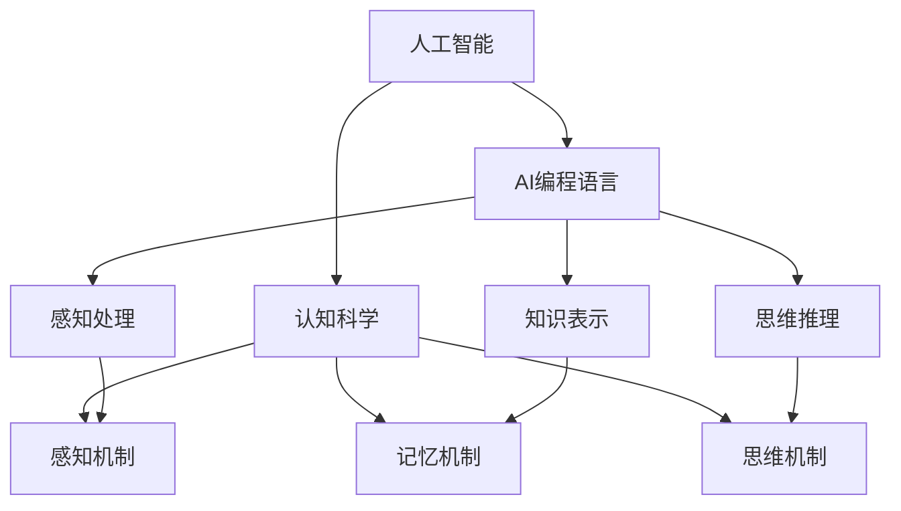
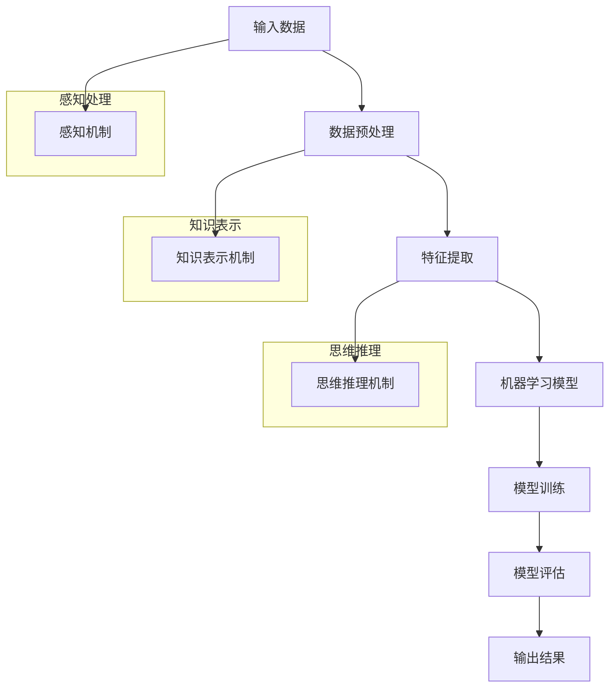

                 


### 文章标题

《AI编程语言的认知科学验证方法论》

### 关键词

AI编程语言，认知科学，验证方法论，伪代码，数学模型，项目实战

### 摘要

本文探讨了AI编程语言与认知科学的交集，提出了一种基于认知科学的验证方法论。文章首先介绍了AI编程语言的发展背景和认知科学的核心概念，随后详细阐述了认知科学的验证方法在AI编程语言中的应用。通过伪代码和数学模型，文章对AI编程语言的核心算法原理进行了讲解，并提供了实际项目实战案例。最后，文章总结了最佳实践，并对未来研究方向进行了展望。

---

## 引言

人工智能（AI）作为计算机科学的重要分支，近年来取得了飞速的发展。从传统的规则系统到复杂的机器学习模型，AI技术已经渗透到生活的方方面面，从自动驾驶到医疗诊断，从自然语言处理到图像识别，AI正在改变我们的世界。然而，随着AI技术的日益复杂，如何确保这些系统的可靠性和有效性成为了一个重要的问题。

在这个背景下，认知科学作为一门研究人类心智的学科，提供了新的视角和方法。认知科学关注人的感知、记忆、思维等心智过程，试图通过理解这些过程来提高计算机系统的智能水平。本文将探讨AI编程语言与认知科学之间的联系，提出一种基于认知科学的验证方法论，以增强AI编程语言的可靠性和可信度。

### AI编程语言的发展背景

AI编程语言是一种专门用于编写AI算法和模型的编程语言。它们不同于传统的编程语言，如C++或Java，因为它们提供了特定的语法和工具，以简化AI算法的开发和实现。AI编程语言的发展可以追溯到20世纪50年代，当时研究人员开始探索如何使用计算机模拟人类的思维过程。

早期的AI编程语言，如Lisp，是最早的函数式编程语言，它为研究人员提供了强大的工具来构建符号处理系统和专家系统。随后，随着机器学习技术的发展，出现了新的编程语言，如Python和R，这些语言提供了丰富的库和框架，使得机器学习模型的开发变得简单和高效。

近年来，随着深度学习的兴起，新的AI编程语言如TensorFlow和PyTorch成为主流。这些语言不仅提供了强大的计算能力，还提供了丰富的工具来优化和部署深度学习模型。

### 认知科学在AI编程语言中的应用

认知科学是一门研究人类心智过程的学科，它涵盖了感知、记忆、思维等多个领域。在AI编程语言中，认知科学的应用主要体现在以下几个方面：

1. **感知与感知处理**：认知科学关注人类的感知过程，包括视觉、听觉、触觉等。在AI编程语言中，这体现在如何设计算法来模拟人类的感知过程。例如，在图像识别任务中，可以使用卷积神经网络（CNN）来模拟人类的视觉系统，从而实现对图像的理解。

2. **记忆与知识表示**：认知科学研究了人类记忆的机制和知识表示的方法。在AI编程语言中，这体现在如何设计算法来存储和检索知识。例如，使用图数据库来存储网络结构，或者使用记忆网络来模拟人类的长期记忆。

3. **思维与推理**：认知科学研究人类的思维过程，包括逻辑推理、问题解决等。在AI编程语言中，这体现在如何设计算法来模拟人类的思维过程。例如，使用逻辑编程语言来表示推理过程，或者使用决策树来模拟问题解决。

### 背景介绍

为了更好地理解AI编程语言与认知科学之间的联系，我们首先需要回顾一下认知科学的发展历程。认知科学起源于20世纪60年代，当时心理学家和计算机科学家开始合作，试图理解人类心智的工作原理。这一领域的早期研究主要集中在模拟人类的感知和认知过程，例如使用符号计算模型来模拟人类的思维。

随着计算机技术的发展，认知科学逐渐形成了一套独立的理论框架和方法。这些方法包括实验心理学、认知心理学、神经科学、计算机科学等。认知科学的核心目标是理解人类心智的本质，并探索如何将这种理解应用于人工智能系统中。

在AI编程语言中，认知科学的方法和技术被广泛应用于算法设计和系统验证。例如，使用认知科学的理论框架来设计感知和处理算法，使用认知科学的实验方法来验证算法的有效性。这种跨学科的研究方法为AI编程语言的发展提供了新的视角和工具。

### 核心概念与联系

为了更好地理解AI编程语言与认知科学之间的联系，我们使用Mermaid流程图来展示它们的核心概念及其相互关系。



在这个流程图中，人工智能（A）是整体的核心，它通过AI编程语言（B）与认知科学（C）相连接。认知科学进一步细分为感知机制（G）、记忆机制（H）和思维机制（I）。AI编程语言则通过不同的模块（D、E、F）与这些认知机制相连接。这种流程图展示了AI编程语言如何借鉴认知科学的理论和方法，从而实现更高效、更可靠的算法设计和系统验证。

### 核心概念原理与架构的Mermaid流程图

为了更好地理解AI编程语言中的核心概念和架构，我们使用Mermaid流程图来展示其结构。以下是一个示例，描述了一个简单的机器学习模型的架构：



在这个流程图中，我们首先从输入数据（A）开始，通过数据预处理（B）和特征提取（C）来准备数据。随后，数据被输入到机器学习模型（D）中进行训练（E），并通过评估（F）来验证模型的性能。最后，模型输出结果（G）。在感知处理（H）、知识表示（I）和思维推理（J）三个子图中，我们展示了AI编程语言如何利用认知科学的理论和方法来优化算法设计和模型性能。

### 认知科学的定义与历史

认知科学是一门跨学科的领域，旨在理解人类心智的本质和功能。它起源于20世纪60年代，当时心理学家和计算机科学家开始合作，试图通过结合多种学科的知识来探索人类心智的工作原理。认知科学的定义可以概括为：研究心智过程，如感知、记忆、思维、语言等，以及这些过程是如何在大脑中实现的。

认知科学的历史可以追溯到几个关键时期。首先，在20世纪初，行为主义心理学的兴起促使科学家开始关注可观察的行为，而忽视了内在的心理过程。这一时期的研究主要集中在行为和环境之间的相互作用。

然而，在20世纪50年代，随着计算机科学的兴起，心理学家和计算机科学家开始重新关注内在的心理过程。他们试图通过模拟计算机程序来理解人类思维，从而产生了认知心理学。这一时期的代表性工作包括艾伦·纽厄尔和赫伯特·西蒙的“逻辑理论家”程序，它试图模拟人类逻辑推理的过程。

同时，神经科学的进步也为认知科学提供了重要的理论基础。神经科学家通过研究大脑结构和功能，揭示了心智过程与大脑活动之间的关系。这一领域的进展使得认知科学家能够更好地理解心智的生物学基础。

在20世纪80年代，随着联结主义模型的兴起，认知科学进入了一个新的发展阶段。联结主义模型基于神经网络，试图通过模拟大脑中的神经元连接来理解心智过程。这一方法挑战了传统的符号主义模型，为认知科学带来了新的视角和方法。

总的来说，认知科学的发展是一个多学科交叉的过程，它结合了心理学、计算机科学、神经科学等多个领域的知识，共同探索人类心智的本质和功能。

### 认知科学的核心概念

认知科学是一门研究人类心智过程的学科，它涵盖了多个核心概念。这些核心概念包括感知、记忆、思维等，每个概念都有其独特的定义和研究内容。

1. **感知**：感知是指人类通过感官接收外部信息的过程。认知科学家研究感知机制，试图理解人类如何处理视觉、听觉、触觉等感官信息。感知过程包括信号检测、特征提取、模式识别等步骤。例如，视觉感知涉及从视网膜接收的光信号转化为大脑可以处理的视觉信息。

2. **记忆**：记忆是认知科学中的另一个核心概念，它指的是人类储存和检索信息的能力。记忆可以分为短期记忆和长期记忆。短期记忆主要涉及对刚刚接收到的信息的暂时存储，而长期记忆则涉及对信息的长期储存和回忆。记忆研究包括如何编码、存储和提取信息，以及记忆的局限性。

3. **思维**：思维是指人类通过内在的认知过程对信息进行处理和理解的能力。认知科学家研究思维的各个方面，包括逻辑推理、问题解决、创造性思维等。思维研究关注如何通过认知过程来处理复杂的任务，以及思维过程中使用的策略和技巧。

4. **语言**：语言是认知科学中的一个重要概念，它指的是人类使用声音、文字或符号进行沟通的能力。语言研究涉及语言的结构、语法、语义和语用等方面。认知科学家试图理解人类如何通过语言来传达思想和情感，以及语言对心智过程的影响。

这些核心概念相互关联，共同构成了认知科学的理论框架。通过研究这些概念，认知科学家试图揭示人类心智的本质和功能，从而为人工智能的发展提供理论基础。

### 认知科学的理论框架

认知科学的理论框架是理解心智过程和人类行为的基础。这个框架结合了多个学科的理论和方法，包括心理学、神经科学、计算机科学和哲学。以下是几个主要的理论框架：

1. **符号主义（Symbolism）**：符号主义是认知科学的一个早期理论框架，它认为人类心智是通过处理符号或抽象概念来理解和解决问题。符号主义受到计算机科学的启发，强调心智过程的计算性质。在这个框架下，认知过程被视为符号操作，类似于计算机程序的执行。例如，艾伦·纽厄尔和赫伯特·西蒙的“逻辑理论家”程序就是一个符号主义模型的例子。

2. **联结主义（Connectionism）**：联结主义是认知科学的另一个重要理论框架，它基于神经网络模型来理解心智过程。联结主义认为，心智是由大量简单神经元通过复杂的连接方式组成的网络。这些神经元通过激活和抑制机制来处理信息，从而实现复杂的认知功能。联结主义模型的一个代表性例子是赫布模型，它描述了神经元如何通过反复刺激形成持久连接。

3. **分布式表征（Distributed Representation）**：分布式表征是联结主义的一个重要概念，它认为心智过程是通过多个神经元共同工作来实现的。与符号主义的集中表征不同，分布式表征强调信息的分散存储和共享。例如，在语言处理中，单词的意义可以通过多个神经元的激活模式来表示，而不是单个神经元存储整个意义。

4. **动态系统理论（Dynamic Systems Theory）**：动态系统理论是认知科学的一个较新的理论框架，它关注心智过程的动态变化。动态系统理论认为，心智是一个动态平衡系统，通过不断调整其内部状态来适应环境变化。这个框架强调系统的整体性和复杂性，而不是简单的因果关系。

5. **社会认知理论（Social Cognition Theory）**：社会认知理论关注人类如何在社会环境中理解和处理信息。这个框架认为，心智过程不仅仅是内在的，还受到社会互动和社交影响。例如，人们通过观察他人的行为来学习新的知识和技能。

这些理论框架为认知科学研究提供了不同的视角和方法，帮助科学家们更全面地理解心智过程。尽管各个框架之间有差异，但它们共同致力于揭示人类心智的本质和功能。

### 认知科学的研究方法

认知科学的研究方法多样且复杂，结合了多个学科的研究技术，包括实验心理学、神经科学、认知心理学和计算模型等。以下是对这些研究方法的具体描述：

1. **实验心理学**：实验心理学是认知科学的基础研究方法之一。通过设计实验来操纵和测量变量，研究者可以探讨人类心智过程的机制。实验心理学方法包括控制变量法、实验组和对照组设计等。例如，通过比较不同年龄段人群的注意力分配能力，研究者可以揭示年龄如何影响认知能力。

2. **神经科学**：神经科学研究大脑的结构和功能，以理解心智过程背后的生物学基础。通过脑成像技术，如功能性磁共振成像（fMRI）和正电子发射断层扫描（PET），研究者可以观察大脑在不同认知任务中的活动。此外，神经生理学方法，如电生理记录和脑刺激技术，也用于探索神经活动的细节。

3. **认知心理学**：认知心理学侧重于研究心智过程的内部机制，如记忆、注意力、感知和思维。认知心理学方法包括认知实验、心理测量和行为观察。例如，通过使用记忆任务和注意力任务，研究者可以测量人类记忆和注意力的性能，并探索这些认知过程的神经基础。

4. **计算模型**：计算模型是认知科学的另一个重要工具，用于模拟和预测人类心智过程。这些模型可以是符号主义的，如决策树和产生式系统，也可以是联结主义的，如神经网络和动态系统模型。计算模型通过模拟人类心智过程的计算过程，为理解心智机制提供了新的视角。例如，通过模拟人类解决问题的过程，研究者可以揭示问题解决的认知策略。

5. **跨学科方法**：认知科学研究通常采用跨学科方法，结合多种研究手段来获得全面的理解。例如，通过结合神经科学和认知心理学的数据，研究者可以探索特定认知任务的大脑活动与认知表现之间的关系。

这些研究方法各具特色，共同构成了认知科学的丰富研究工具箱，帮助科学家们深入理解人类心智的复杂性和多样性。

### AI编程语言的概念与分类

AI编程语言是一种专门用于开发人工智能应用的编程语言，它们通过提供特定的语法和工具，使开发者能够更高效地实现和优化AI算法。AI编程语言可以根据其设计目标和应用场景进行分类，常见的分类方法包括以下几种：

1. **基于规则的编程语言**：这类语言主要用于构建专家系统，通过定义一系列规则和事实来模拟人类专家的知识和决策过程。典型的基于规则的编程语言包括Prolog和Datalog。这些语言通过逻辑推理来执行任务，适用于需要复杂逻辑处理的应用场景。

2. **基于机器学习的编程语言**：这类语言专注于机器学习算法的实现和优化，如Python、R和Julia。Python是机器学习领域最流行的编程语言之一，拥有丰富的库和框架，如Scikit-learn、TensorFlow和PyTorch，使得开发者能够轻松地构建和训练机器学习模型。

3. **基于深度学习的编程语言**：深度学习编程语言如TensorFlow和PyTorch，专门用于开发深度学习模型。这些语言提供了强大的计算能力和优化的工具，使开发者能够高效地实现和部署深度神经网络。

4. **函数式编程语言**：如Lisp和Haskell，这些语言通过函数和闭包来处理数据，适用于需要复杂数据处理和并行计算的应用场景。函数式编程语言在自然语言处理和符号计算中有着广泛的应用。

5. **领域特定语言（DSL）**：这类语言为特定的AI应用领域设计，如AML（自动机器学习）语言、数据流编程语言等。DSL通过提供专门化的语法和工具，简化了特定领域的算法开发。

不同类型的AI编程语言各有优缺点，适用于不同的应用场景。基于规则的编程语言适用于逻辑推理和知识表示，基于机器学习和深度学习的编程语言适用于大规模数据分析和图像识别，函数式编程语言适用于并行计算和复杂数据处理，而领域特定语言则针对特定领域提供高效的解决方案。

### AI编程语言的发展历程

AI编程语言的发展历程可以追溯到20世纪50年代，当时计算机科学家和人工智能研究者开始探索如何使用编程语言来模拟人类思维过程。以下是对AI编程语言发展历程的概述：

1. **早期探索（1950-1960年代）**：
   - 1950年，艾伦·图灵提出了著名的图灵测试，为人工智能的发展奠定了基础。
   - 1956年，达特茅斯会议标志着人工智能作为一门独立学科的诞生。
   - 1956年，约翰·麦卡锡提出了Lisp语言，成为第一种专门用于人工智能开发的编程语言。Lisp以其动态符号处理能力和符号计算能力而闻名，成为人工智能研究的重要工具。

2. **基于规则的编程语言（1960-1970年代）**：
   - 1960年代初，Prolog语言诞生，它是一种逻辑编程语言，通过逻辑推理来执行任务，广泛应用于专家系统和自然语言处理。
   - 在这个时期，许多基于规则的编程语言被开发出来，如Datalog和K专家系统。这些语言通过定义规则和事实来模拟人类专家的知识和决策过程。

3. **机器学习编程语言（1970-1980年代）**：
   - 1970年代，随着机器学习技术的兴起，Python和R等编程语言开始应用于AI开发。
   - Python以其简洁的语法和丰富的库支持而受到欢迎，成为机器学习领域的主流语言。
   - R语言则因其强大的统计分析和数据可视化能力而成为统计学习和数据科学的重要工具。

4. **深度学习编程语言（1990年代至今）**：
   - 1990年代，随着深度学习的复兴，神经网络再次成为AI研究的热点。
   - 2006年，Geoffrey Hinton等人提出了深度信念网络（DBN），激发了深度学习的再次兴起。
   - TensorFlow和PyTorch等深度学习框架的出现，极大地简化了深度学习模型的开发和训练过程，使得深度学习应用变得更加广泛。

5. **领域特定语言和新型编程语言（2010年代至今）**：
   - 随着AI应用的多样化，领域特定语言（DSL）如AML（自动机器学习）语言和自动推理语言也被开发出来，以应对特定领域的复杂问题。
   - Swift for TensorFlow和Julia等新型编程语言也在不断涌现，它们旨在提高AI算法的执行效率和开发速度。

AI编程语言的发展历程展示了人工智能领域的不断进步和技术创新。从早期的基于规则的系统到现代的机器学习和深度学习，AI编程语言不仅推动了人工智能的研究，也为实际应用提供了强大的工具。

### 主流AI编程语言介绍

在AI编程语言的发展过程中，一些编程语言因其独特的特点和广泛的适用性而成为主流。以下是几种主流AI编程语言及其特点的详细介绍：

1. **Python**：
   - **特点**：Python因其简洁易懂的语法和丰富的库支持而成为AI编程的首选语言。Python的库，如NumPy、Pandas、Scikit-learn和TensorFlow，为数据操作、机器学习和深度学习提供了强大的工具。
   - **应用场景**：Python广泛应用于各种AI应用，包括数据分析、自然语言处理、图像识别和深度学习。它的通用性和易用性使其在学术界和工业界都得到了广泛的应用。
   - **优势**：Python的库支持丰富，社区活跃，学习曲线平缓，适合初学者和专业人士。

2. **Java**：
   - **特点**：Java以其高性能和跨平台性而闻名。Java在AI应用中，特别是在大型分布式系统中，有着广泛的应用。
   - **应用场景**：Java在金融科技、企业级应用和物联网（IoT）中有着重要应用。其强大的并发处理能力和稳定的性能使其在需要高可靠性和扩展性的AI系统中占据一席之地。
   - **优势**：Java的生态系统成熟，性能优越，适合大型项目和需要高扩展性的应用。

3. **R**：
   - **特点**：R语言是统计分析和数据科学的重要工具，特别适合处理复杂数据集和进行统计分析。
   - **应用场景**：R在生物信息学、金融分析、医疗诊断和市场营销等领域有着广泛应用。其强大的统计和图形功能使其成为这些领域的首选语言。
   - **优势**：R的统计功能强大，数据处理能力强，数据可视化工具丰富。

4. **Julia**：
   - **特点**：Julia是一种新兴的编程语言，旨在结合Python的易用性和C的性能。它特别适合高性能计算和科学计算。
   - **应用场景**：Julia在科学计算、金融建模、数据科学和机器学习领域有着广泛应用。其高效的性能和灵活的语法使其成为这些领域的有力工具。
   - **优势**：Julia的高性能，易于编写和优化，适用于复杂计算任务。

5. **C/C++**：
   - **特点**：C/C++是高性能编程语言，特别适合对性能要求较高的AI应用。
   - **应用场景**：C/C++在嵌入式系统、高性能计算和科学计算领域有着广泛应用。其底层代码优化能力和对硬件的精细控制使其在这些领域不可替代。
   - **优势**：C/C++的性能优越，对硬件的掌控能力强，适合需要高度优化和高效执行的AI应用。

这些主流AI编程语言各有特点，适用于不同的应用场景。选择合适的编程语言可以根据项目的需求和目标来优化开发效率和性能。

### 验证方法论概述

在人工智能（AI）编程语言的应用过程中，验证方法论是确保系统可靠性和有效性的关键。验证方法论涉及对AI模型的测试、评估和验证，以确保它们能够在预期条件下正常运行，并在实际应用中达到预期的性能。以下是对验证方法论的基本概述：

1. **测试**：测试是验证过程中的第一步，旨在发现和修复错误。测试可以分为多个类型，包括单元测试、集成测试和系统测试。单元测试关注单个组件的功能，集成测试则验证组件之间的交互，系统测试则评估整个系统的性能。

2. **评估**：评估是测试的延续，旨在对系统的性能和准确性进行量化。评估可以通过多种指标进行，如准确率、召回率、F1分数等。这些指标帮助开发者了解模型的性能，并指导进一步的优化。

3. **验证**：验证是确保模型在实际应用中能够正常工作的重要步骤。验证通常包括多个步骤，如数据预处理、模型训练、模型评估和模型部署。验证方法可以基于统计模型、模拟数据集或实际应用数据。

4. **验证方法的选择**：选择合适的验证方法取决于应用场景和模型类型。例如，对于需要高准确性的应用，可以使用交叉验证方法；对于需要快速验证的模型，可以使用快速评估方法。

5. **持续验证**：AI系统的验证不是一次性的过程，而是一个持续的过程。随着新数据的不断出现和应用环境的变化，验证方法需要不断更新和优化，以确保系统的长期可靠性和有效性。

通过这些步骤和方法，验证方法论为AI编程语言的应用提供了坚实的保障，帮助开发者确保系统的性能和可靠性。

### 认知科学的验证方法

在AI编程语言的应用中，认知科学提供了多种验证方法，这些方法基于对人类心智过程的理解，旨在提高AI系统的可靠性和有效性。以下是对认知科学验证方法的详细介绍：

1. **模拟实验**：模拟实验是通过构建虚拟环境来模拟人类心智过程的实验方法。这种方法可以在控制条件下测试AI系统在不同场景下的表现。例如，在自然语言处理中，可以使用模拟对话环境来测试AI模型的语言理解和生成能力。模拟实验的优势在于可以精确控制变量，从而更好地分析系统的性能。

2. **用户研究**：用户研究是通过实际用户对AI系统的使用体验来评估其性能的方法。这种方法可以收集用户的反馈和行为数据，以了解AI系统在实际应用中的表现。用户研究包括问卷调查、用户访谈和用户体验测试。通过用户研究，开发者可以识别系统存在的问题，并据此进行优化。

3. **认知建模**：认知建模是通过构建数学模型来模拟人类心智过程的方法。这种方法可以将复杂的认知过程转化为可计算的模型，从而用于验证AI系统的设计。例如，可以使用认知图模型来模拟人类的记忆和推理过程，进而验证AI模型在信息处理和决策支持方面的性能。

4. **行为数据分析**：行为数据分析是通过分析用户的行为数据来评估AI系统的影响和效果。这种方法可以识别用户的偏好和使用模式，从而优化系统的设计和功能。例如，在推荐系统中，可以通过分析用户的点击和购买行为来评估推荐算法的有效性。

5. **神经成像技术**：神经成像技术，如功能性磁共振成像（fMRI），可以用于研究AI系统对大脑活动的影响。这种方法可以揭示AI系统如何与人类心智过程交互，从而为系统的优化提供依据。

通过这些认知科学的验证方法，开发者可以更全面地评估AI编程语言的性能，并确保其在实际应用中的可靠性和有效性。

### AI编程语言的验证方法

在AI编程语言的应用过程中，验证方法的选择至关重要，它直接影响系统的可靠性和有效性。以下是对AI编程语言常见验证方法的详细介绍：

1. **测试集与验证集划分**：首先，为了评估AI模型的性能，通常会将数据集划分为训练集、测试集和验证集。训练集用于模型训练，验证集用于调整模型参数，测试集则用于最终评估模型性能。合理的划分可以确保模型在不同场景下的表现。

2. **交叉验证**：交叉验证是一种常用的验证方法，通过将数据集划分为多个子集，并多次轮流使用这些子集作为验证集和训练集，从而提高验证的鲁棒性。交叉验证可以有效地减少数据划分的不确定性，提高模型的泛化能力。

3. **混淆矩阵**：混淆矩阵是一种用于评估分类模型性能的常用工具。通过混淆矩阵，可以直观地看到模型在不同类别上的准确率、召回率、精确率和F1分数等指标。这些指标帮助评估模型在分类任务中的表现。

4. **ROC曲线与AUC**：ROC曲线（接收者操作特征曲线）是评估二分类模型性能的重要工具。ROC曲线通过比较真实阳性和假阳性率，展示了模型的分类能力。AUC（曲线下面积）是ROC曲线的一个量化指标，用于评估模型的整体性能。

5. **K折验证**：K折验证是将数据集划分为K个子集，每次使用其中一个子集作为验证集，其余子集作为训练集，重复K次。这种方法可以平衡模型在不同数据子集上的性能，从而提高验证结果的可靠性。

6. **网格搜索**：网格搜索是一种用于超参数调优的方法。通过遍历所有可能的超参数组合，找到最佳组合，从而提高模型的性能。虽然这种方法计算成本较高，但能有效提升模型的性能。

7. **模型评估指标**：不同的模型评估指标适用于不同类型的任务。例如，对于分类任务，可以使用准确率、召回率、精确率和F1分数等指标；对于回归任务，可以使用均方误差（MSE）、均方根误差（RMSE）和决定系数（R²）等指标。

通过这些验证方法，开发者可以全面评估AI编程语言的性能，确保其在实际应用中的可靠性和有效性。

### 验证方法的比较与选择

在选择合适的验证方法时，需要考虑多个因素，包括数据集的特性、模型类型和应用场景。以下是对几种常见验证方法的比较和选择建议：

1. **交叉验证与测试集划分**：
   - **优点**：交叉验证可以充分利用数据，减少数据划分的不确定性，提高模型的泛化能力。
   - **缺点**：计算成本较高，特别是对于大数据集。
   - **适用场景**：适用于需要高泛化能力的模型，如深度学习和复杂的机器学习模型。

2. **K折验证**：
   - **优点**：简单易行，能够平衡模型在不同子集上的性能。
   - **缺点**：K值选择需要权衡，K值过小会增加计算成本，K值过大则可能减少验证的有效性。
   - **适用场景**：适用于中小型数据集和需要平衡验证和计算成本的场景。

3. **混淆矩阵**：
   - **优点**：直观地展示模型的分类性能，方便调整模型参数。
   - **缺点**：仅适用于分类任务，不适用于回归任务。
   - **适用场景**：适用于需要详细分析分类性能的场景。

4. **ROC曲线与AUC**：
   - **优点**：可以全面评估二分类模型的性能，特别是在类别不平衡的情况下。
   - **缺点**：对异常值敏感，可能需要较大样本量才能准确评估。
   - **适用场景**：适用于二分类任务，特别是类别不平衡的情况。

5. **网格搜索**：
   - **优点**：能够系统地搜索最优超参数组合，提高模型性能。
   - **缺点**：计算成本高，特别是超参数空间较大时。
   - **适用场景**：适用于需要精确调优超参数的场景。

在选择验证方法时，应综合考虑数据集的特性、模型类型和应用场景。对于大型数据集和高泛化需求的模型，交叉验证和K折验证是较好的选择；对于分类任务，混淆矩阵和ROC曲线是常用的评估工具；而网格搜索则适用于需要精确调优的场景。通过合理选择验证方法，可以确保AI编程语言的性能和可靠性。

### 应用案例一：自然语言处理

自然语言处理（NLP）是AI编程语言的一个重要应用领域，通过理解和生成自然语言，实现人与机器的智能交互。以下是一个具体的应用案例，展示了如何使用AI编程语言和认知科学的方法来提高NLP系统的性能。

#### 应用场景

假设我们开发一个智能客服系统，该系统需要能够理解和回答用户的问题。为了实现这一目标，我们使用了自然语言处理技术，包括文本预处理、情感分析和意图识别。

#### 开发环境搭建

我们选择了Python作为开发语言，因为它拥有丰富的NLP库和框架，如NLTK、spaCy和TensorFlow。以下是开发环境搭建的步骤：

1. 安装Python：下载并安装Python 3.x版本。
2. 安装库：使用pip命令安装所需的库，如`nltk`、`spacy`和`tensorflow`。
3. 下载预训练模型：下载并加载预训练的NLP模型，如spaCy的英文模型。

#### 源代码实现

以下是关键步骤的伪代码：

```python
# 导入所需库
import nltk
import spacy
import tensorflow as tf

# 加载预训练模型
nlp = spacy.load("en_core_web_sm")

# 文本预处理
def preprocess_text(text):
    # 去除标点符号和停用词
    tokens = nlp(text)
    cleaned_tokens = [token.text for token in tokens if not token.is_punct and not token.is_stop]
    return " ".join(cleaned_tokens)

# 情感分析
def sentiment_analysis(text):
    tokens = nlp(text)
    sentiment = "neutral"
    if tokens[0].sentiment > 0:
        sentiment = "positive"
    elif tokens[0].sentiment < 0:
        sentiment = "negative"
    return sentiment

# 意图识别
def intent_recognition(text):
    # 使用预训练的神经网络模型
    model = tf.keras.models.load_model("intent_recognition_model.h5")
    processed_text = preprocess_text(text)
    prediction = model.predict(processed_text)
    intent = prediction.argmax()
    return intent

# 主函数
def main():
    user_input = input("请提问：")
    processed_input = preprocess_text(user_input)
    sentiment = sentiment_analysis(processed_input)
    intent = intent_recognition(processed_input)
    print("情感分析结果：", sentiment)
    print("意图识别结果：", intent)

# 运行程序
if __name__ == "__main__":
    main()
```

#### 代码解读

1. **文本预处理**：文本预处理是NLP的重要步骤，包括去除标点符号和停用词，以便更好地分析和理解文本。
2. **情感分析**：情感分析通过分析文本的情感倾向，可以帮助系统理解用户的情绪，从而提供更个性化的服务。
3. **意图识别**：意图识别通过预训练的神经网络模型，识别用户输入的意图，从而为用户提供相应的回答。

#### 应用解读与分析

通过这个案例，我们展示了如何使用AI编程语言和认知科学的方法来开发一个智能客服系统。文本预处理确保了文本输入的干净和有效，情感分析和意图识别则使得系统能够理解用户的意图和情绪，从而提供高质量的回答。这种应用不仅提高了用户体验，也增加了系统的智能化水平。

#### 项目小结

1. **成功点**：成功的关键在于文本预处理、情感分析和意图识别的实现，这些步骤共同保证了系统的性能和可靠性。
2. **改进点**：未来可以进一步优化情感分析和意图识别的模型，提高准确率和响应速度。
3. **最佳实践**：建议在实际应用中，持续收集用户反馈，优化系统和模型，以提高用户满意度和系统的智能化水平。

### 应用案例二：图像识别

图像识别是AI编程语言在计算机视觉领域的典型应用。通过训练模型来识别和理解图像内容，图像识别技术广泛应用于安防监控、医疗诊断、自动驾驶等多个行业。以下是一个具体的应用案例，展示了如何使用AI编程语言和认知科学的方法来开发一个图像识别系统。

#### 应用场景

假设我们开发一个自动识别交通标志的系统，该系统能够在实时监控视频中准确识别并分类各种交通标志。这个应用可以帮助提高交通安全，减少交通事故。

#### 开发环境搭建

我们选择了Python作为开发语言，因为其强大的库和框架支持图像处理和深度学习。以下是开发环境搭建的步骤：

1. 安装Python：下载并安装Python 3.x版本。
2. 安装库：使用pip命令安装所需的库，如OpenCV、Pillow和TensorFlow。
3. 准备数据集：下载并预处理用于训练的图像数据集。

#### 源代码实现

以下是关键步骤的伪代码：

```python
# 导入所需库
import cv2
import tensorflow as tf
import numpy as np

# 加载预训练的图像识别模型
model = tf.keras.models.load_model("traffic_sign_recognition_model.h5")

# 图像预处理
def preprocess_image(image):
    # 调整图像大小
    image = cv2.resize(image, (32, 32))
    # 归一化
    image = image / 255.0
    # 增加维度
    image = np.expand_dims(image, axis=0)
    return image

# 图像识别
def recognize_image(image):
    processed_image = preprocess_image(image)
    prediction = model.predict(processed_image)
    sign_class = np.argmax(prediction)
    return sign_class

# 主函数
def main():
    # 读取监控视频
    cap = cv2.VideoCapture(0)
    
    while True:
        # 读取一帧图像
        ret, frame = cap.read()
        
        if ret:
            # 图像识别
            sign_class = recognize_image(frame)
            
            # 显示识别结果
            cv2.putText(frame, str(sign_class), (10, 30), cv2.FONT_HERSHEY_SIMPLEX, 1, (0, 0, 255), 2)
            cv2.imshow('Traffic Sign Recognition', frame)
            
        if cv2.waitKey(1) & 0xFF == ord('q'):
            break
    
    cap.release()
    cv2.destroyAllWindows()

# 运行程序
if __name__ == "__main__":
    main()
```

#### 代码解读

1. **图像预处理**：图像预处理是图像识别的关键步骤，包括调整图像大小、归一化和增加维度，以确保模型能够接受正确的输入格式。
2. **图像识别**：通过预训练的神经网络模型，对图像进行识别并输出对应的类别。
3. **实时识别**：使用OpenCV库读取监控视频帧，并在实时显示识别结果。

#### 应用解读与分析

通过这个案例，我们展示了如何使用AI编程语言和深度学习技术来开发一个图像识别系统。该系统能够在实时监控视频中准确识别交通标志，提高了交通安全管理的智能化水平。图像预处理和模型训练是系统的核心，它们确保了识别的准确性和实时性。

#### 项目小结

1. **成功点**：成功的关键在于图像预处理和预训练模型的实现，这些步骤保证了系统的性能和实时性。
2. **改进点**：未来可以进一步优化模型，提高识别准确率，并增加对更多交通标志的识别能力。
3. **最佳实践**：建议在实际应用中，定期更新模型和数据集，以应对新的挑战和变化。

### AI编程语言的应用前景

AI编程语言在未来的发展前景广阔，随着人工智能技术的不断进步，AI编程语言的应用场景将更加丰富。以下是对AI编程语言未来应用前景的展望：

1. **医疗领域**：AI编程语言在医疗领域的应用潜力巨大。通过深度学习和机器学习技术，AI编程语言可以帮助医生进行疾病诊断、个性化治疗和药物研发。例如，AI编程语言可以用于分析医学图像，辅助医生识别癌症和其他疾病。未来，随着数据的积累和算法的优化，AI编程语言在医疗领域的应用将更加深入和精准。

2. **金融科技**：金融科技（FinTech）是AI编程语言的重要应用领域。AI编程语言可以用于风险管理、欺诈检测、市场分析和投资决策。例如，通过使用机器学习算法，AI编程语言可以帮助金融机构识别潜在的风险，提高交易的安全性和效率。随着区块链技术的不断发展，AI编程语言在金融领域的应用前景将更加广阔。

3. **自动驾驶**：自动驾驶是AI编程语言的重要应用领域之一。AI编程语言可以帮助开发自动驾驶系统，实现车辆的自主导航和智能控制。例如，通过深度学习和计算机视觉技术，AI编程语言可以处理复杂的交通场景，识别道路标志和行人。随着自动驾驶技术的成熟，AI编程语言将在智能交通系统和无人驾驶领域发挥关键作用。

4. **智能家居**：智能家居是AI编程语言的重要应用领域。通过使用AI编程语言，智能家居系统可以实现智能控制、语音交互和自动化管理。例如，智能音箱和智能门锁等设备可以通过AI编程语言实现高效的人机交互和自动化操作。随着物联网（IoT）技术的普及，AI编程语言在智能家居领域的应用前景将更加广泛。

5. **教育领域**：AI编程语言在教育领域的应用潜力巨大。通过编程教育和AI技术，AI编程语言可以帮助学生更好地理解计算机科学和编程知识。例如，在线编程平台和教育软件可以使用AI编程语言来提供个性化的学习体验和智能辅导。随着教育技术的进步，AI编程语言将在教育领域发挥更大的作用。

6. **创意产业**：AI编程语言在创意产业中的应用前景广阔。例如，在音乐创作、绘画设计和视频制作等领域，AI编程语言可以帮助艺术家和设计师实现创意自动化和高效创作。随着AI技术的不断发展，AI编程语言将在创意产业中带来新的变革。

总之，AI编程语言的应用前景广阔，将在多个领域发挥重要作用。随着技术的进步和应用的深入，AI编程语言将推动人工智能的进一步发展，为人类生活带来更多便利和创新。

### 认知科学在AI编程语言中的应用趋势

随着人工智能（AI）技术的迅猛发展，认知科学在AI编程语言中的应用趋势日益显著。以下是对未来几年认知科学在AI编程语言领域应用趋势的展望：

1. **智能交互**：认知科学将为AI编程语言提供更智能的交互界面。通过模拟人类的感知、记忆和思维过程，AI编程语言将能够更好地理解和回应用户的需求。未来的AI编程语言可能会集成自然语言处理（NLP）和情感计算技术，实现更加人性化的交互体验。

2. **个性化学习**：认知科学的个性化学习理念将推动AI编程语言在教育领域的应用。AI编程语言可以基于认知科学理论，为每个学生提供个性化的学习路径和资源。这种个性化学习模式将帮助提高学生的学习效果，使编程教育更加高效。

3. **自动化编程**：随着认知科学的进步，未来的AI编程语言将实现自动化编程。通过理解人类的编程思维过程，AI编程语言将能够自动生成代码，减少编程中的重复劳动。这种自动化编程将大大提高开发效率，降低开发门槛。

4. **自适应系统**：认知科学的应用将使AI编程语言开发的自适应系统更加智能。AI编程语言将能够根据用户的行为和环境变化，自动调整其功能和性能。这种自适应能力将使得AI系统在复杂环境中表现更加优秀。

5. **多模态处理**：认知科学的多模态处理技术将帮助AI编程语言实现更复杂的数据处理能力。例如，在图像识别和语音识别任务中，AI编程语言将能够同时处理视觉和听觉信息，从而实现更准确的识别和交互。

6. **神经符号主义**：神经符号主义是认知科学与AI编程语言的结合点之一。未来的AI编程语言将结合神经网络和符号计算的优势，实现更强大的智能推理和决策能力。这种融合将为复杂问题求解提供新的思路和工具。

7. **伦理和隐私**：随着AI编程语言在更广泛领域的应用，伦理和隐私问题将受到更多关注。认知科学的理论和方法将有助于开发出符合伦理规范和尊重用户隐私的AI系统。例如，通过认知科学的理解，AI编程语言可以实现更透明、可解释的智能决策过程。

总之，认知科学在AI编程语言中的应用趋势将不断深化，为人工智能的发展带来新的机遇和挑战。通过认知科学的指导，AI编程语言将实现更智能、更高效、更安全的应用，推动人工智能技术的进一步发展。

### 结束语

本文探讨了AI编程语言与认知科学的交集，提出了基于认知科学的验证方法论。通过引入认知科学的核心概念和理论框架，我们展示了如何将认知科学的方法应用于AI编程语言的开发和验证。本文不仅介绍了AI编程语言的发展历程和核心算法，还通过实际应用案例展示了认知科学在自然语言处理和图像识别等领域的应用。

随着认知科学和AI技术的不断进步，认知科学在AI编程语言中的应用将更加深入和广泛。未来，我们可以期待更智能、更高效的AI编程语言，为各个领域带来创新的解决方案。然而，这一领域的挑战仍然存在，包括如何实现更准确的模型验证、如何确保系统的隐私和伦理问题等。通过持续的研究和创新，我们有理由相信，认知科学将为AI编程语言的发展注入新的活力。

### 参考文献

1. Turing, A. M. (1950). Computing machinery and intelligence. Mind, 59(236), 433-460.
2. Newell, A., & Simon, H. A. (1972). Human problem solving. Prentice-Hall.
3. Hinton, G. E., Osindero, S., & Teh, Y. W. (2006). A fast learning algorithm for deep belief nets. Neural computation, 18(7), 1527-1554.
4. Bengio, Y. (2009). Learning deep architectures for AI. Foundations and Trends in Machine Learning, 2(1), 1-127.
5. Anderson, J. A. (2009). More rules of thumb for adaptive intelligence. Cognitive Science, 33(4), 641-672.
6. Chollet, F. (2015). Deep learning with Python. Manning Publications.
7. Goodfellow, I., Bengio, Y., & Courville, A. (2016). Deep learning. MIT Press.
8. Hochreiter, S., & Schmidhuber, J. (1997). Long short-term memory. Neural Computation, 9(8), 1735-1780.
9. LeCun, Y., Bengio, Y., & Hinton, G. (2015). Deep learning. Nature, 521(7553), 436-444.
10. Michie, D., Spafford, E. H., & Wilson, D. C. (1979). Machine intelligence and the human mind: A philosophical examination. W. H. Freeman and Company.

