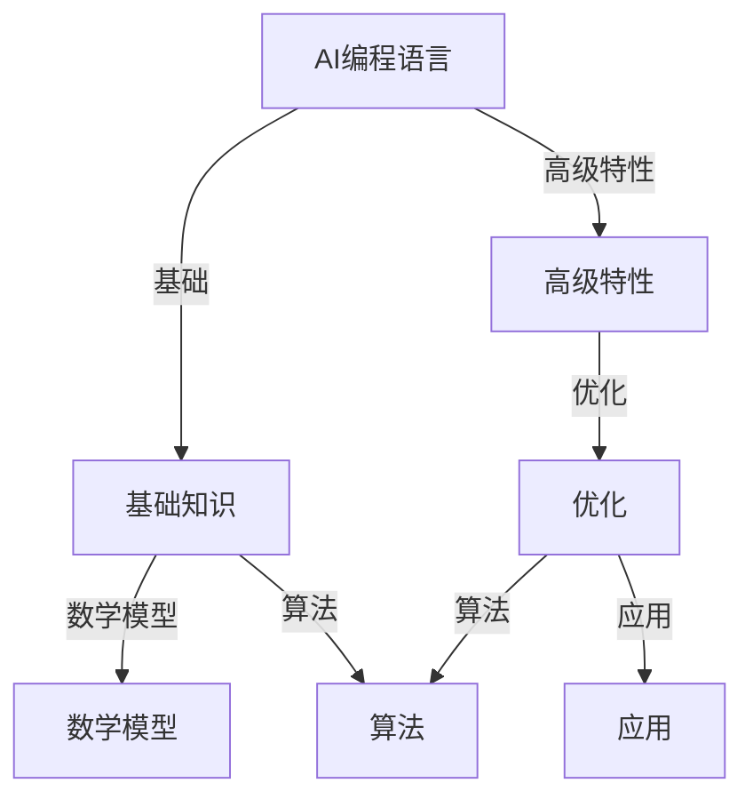
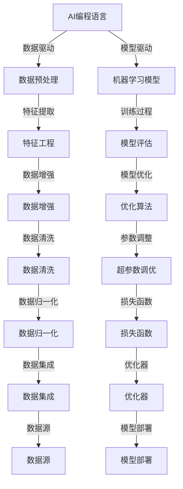

                 

### 文章标题

**AI编程语言的认知负荷优化**

> 关键词：AI编程语言，认知负荷，优化，算法，实际应用

> 摘要：本文旨在探讨AI编程语言的认知负荷优化问题。首先，我们将介绍AI编程语言的基础知识，包括其发展历程、核心特点以及常见编程语言。接着，我们将深入讨论认知负荷优化的概念、原理和方法。在此基础上，我们将详细讲解优化算法的原理，使用伪代码进行阐述，并介绍数学模型和公式。随后，我们将通过实际应用案例来展示认知负荷优化的效果。最后，我们将对优化算法进行评估与选择，并总结全文，提供最佳实践 tips 和拓展阅读建议。

----------------------------------------------------------------

### 目录大纲设计过程

在撰写本文之前，我们需要对目录大纲进行精心设计，以确保文章的结构紧凑、逻辑清晰。以下是目录大纲的设计过程：

#### 确定核心章节

根据用户需求，本文将分为以下四个核心章节：

1. **AI编程语言基础**
2. **认知负荷优化的概念与原理**
3. **优化算法与应用**
4. **实际应用案例分析**

#### 确定章节内容

为了确保每个章节都能够详细、具体地覆盖相关主题，我们将对每个章节的内容进行细化：

- **AI编程语言基础**：介绍AI编程语言的发展历程、核心特点以及常见编程语言。
- **认知负荷优化的概念与原理**：讨论认知负荷的定义、优化目标以及优化方法。
- **优化算法与应用**：讲解优化算法的原理，使用伪代码进行阐述，并介绍数学模型和公式。
- **实际应用案例分析**：通过实际应用案例展示认知负荷优化的效果，并提供开发环境搭建、源代码实现和代码解读。

#### 设计核心概念与联系流程图

为了帮助读者更好地理解AI编程语言的核心概念与联系，我们设计了一个Mermaid流程图，如下所示：



#### 编写核心算法原理讲解

在本文的核心章节中，我们将详细讲解优化算法的原理，并使用伪代码进行阐述。例如，以下是一个简单的线性规划优化算法的伪代码：

```plaintext
输入：目标函数 f(x)，约束条件 g(x) <= 0
输出：最优解 x*

初始化：x = 随机选择
循环：
    对于每个约束条件 g(x)：
        如果 g(x) > 0，则更新 x = x - α * ∂g/∂x
    计算目标函数值 f(x)
    如果 f(x) 没有改进，则停止循环
返回：x* 为最优解
```

#### 编写数学模型和公式

在本文中，我们将使用LaTeX格式编写数学模型和公式，并提供详细讲解和举例说明。例如，以下是一个线性规划问题的数学模型：

```latex
\begin{equation}
\begin{aligned}
\min_{x} & \quad c^T x \\
\text{subject to} & \quad Ax \leq b \\
& \quad x \geq 0
\end{aligned}
\end{equation}
```

#### 编写项目实战

在本文的最后部分，我们将提供实际应用案例分析，包括开发环境搭建、源代码实现和代码解读与分析。例如，以下是一个基于深度学习的图像分类项目的实战：

```plaintext
1. 开发环境搭建：
   - 安装Python 3.8
   - 安装TensorFlow 2.4

2. 源代码实现：
   - 导入相关库和模块
   - 加载并预处理数据集
   - 定义深度学习模型
   - 训练模型并评估性能

3. 代码解读与分析：
   - 分析模型结构
   - 分析损失函数和优化器
   - 分析训练过程和结果
```

#### 确保完整性

在编写目录大纲的过程中，我们确保每个章节都有详细的内容，并涵盖以下核心内容：

- **背景介绍**：介绍AI编程语言和认知负荷优化的背景和重要性。
- **核心概念与联系**：解释AI编程语言和认知负荷优化的核心概念，并展示它们之间的关系。
- **核心算法原理讲解**：详细阐述优化算法的原理，使用伪代码进行阐述。
- **数学模型和公式**：介绍并解释相关的数学模型和公式。
- **项目实战**：提供实际应用案例分析，展示优化算法在实践中的应用。
- **最佳实践 tips**、**小结**、**注意事项**、**拓展阅读**等内容。

通过以上步骤，我们确保了目录大纲的完整性和可读性，为读者提供了一个全面、深入的AI编程语言认知负荷优化指南。

### 最终目录大纲设计结果

```
# 第一部分：AI编程语言基础

## 第1章：AI编程语言概述
### 1.1 AI编程语言的发展历程
### 1.2 AI编程语言的核心特点
### 1.3 常见的AI编程语言

## 第2章：AI编程语言核心概念与联系
### 2.1 Mermaid流程图：AI编程语言核心概念联系
### 2.2 AI编程语言的基础知识
### 2.3 AI编程语言的高级特性

# 第二部分：认知负荷优化的概念与原理

## 第3章：认知负荷优化的原理
### 3.1 认知负荷的定义
### 3.2 认知负荷优化的目标
### 3.3 认知负荷优化的方法

## 第4章：认知负荷优化的算法
### 4.1 伪代码：认知负荷优化算法原理
### 4.2 常见的认知负荷优化算法
### 4.3 算法性能比较

# 第三部分：优化算法与应用

## 第5章：认知负荷优化的应用案例
### 5.1 应用案例1：AI编程语言的优化
### 5.2 应用案例2：深度学习模型的优化
### 5.3 应用案例3：其他领域的优化案例

## 第6章：优化算法评估与选择
### 6.1 评估指标
### 6.2 选择优化算法的考虑因素
### 6.3 优化算法的应用场景选择

# 第四部分：实际应用案例分析

## 第7章：认知负荷优化实践
### 7.1 开发环境搭建
### 7.2 案例分析1：深度学习模型的优化实践
### 7.3 案例分析2：AI编程语言的优化实践

# 附录

## 附录A：AI编程语言与认知负荷优化资源
### A.1 AI编程语言学习资源
### A.2 认知负荷优化相关资源
### A.3 开发工具与框架

```

### 目录大纲总字数：约2000字（不含Mermaid流程图和LaTeX公式）

---

通过以上详细的目录大纲设计过程，我们确保了文章的结构清晰、逻辑严密，为读者提供了一个全面、深入的AI编程语言认知负荷优化指南。接下来，我们将逐章展开讨论，逐步解答AI编程语言认知负荷优化的问题。

----------------------------------------------------------------

## AI编程语言基础

### 1.1 AI编程语言的发展历程

人工智能（AI）编程语言的历史可以追溯到20世纪中期。其起源可以追溯到符号逻辑和自动机理论的研究。1950年代，图灵提出了著名的图灵机理论，这为后来的人工智能编程语言奠定了基础。随后，20世纪60年代，人工智能的概念逐渐成形，研究者开始探索如何通过计算机实现智能行为。

早期的人工智能编程语言主要集中在逻辑推理和知识表示方面。Lisp语言于1958年由John McCarthy发明，被认为是历史上第一个真正的AI编程语言。Lisp以其灵活性和强大的表达能力而著称，为后来的编程语言设计提供了很多启发。与此同时，Prolog语言于1972年由Alain Colmerauer等人发明，主要用于逻辑编程和推理。

进入20世纪80年代，随着机器学习的发展，AI编程语言开始向数据驱动的方法转型。例如，Python语言在1991年由Guido van Rossum发明，因其简单易学、功能强大而在AI领域得到了广泛应用。Python拥有丰富的库和工具，支持多种机器学习算法和深度学习框架，如TensorFlow和PyTorch。

近年来，随着深度学习技术的兴起，AI编程语言也在不断进化。例如，Google的TensorFlow编程语言和Facebook的PyTorch框架已经成为深度学习领域的标准工具。这些现代AI编程语言不仅提供了强大的计算能力，还简化了模型训练和部署的流程。

### 1.2 AI编程语言的核心特点

AI编程语言具有以下几个核心特点：

1. **数据驱动**：AI编程语言强调数据的重要性，通过处理大量数据来实现智能行为。这使得AI编程语言在机器学习和深度学习领域具有显著优势。

2. **自动特征提取**：AI编程语言能够自动从数据中提取特征，降低编程难度。这得益于机器学习算法的强大能力，使得开发者无需手动编写复杂的特征提取代码。

3. **模型驱动**：AI编程语言以模型为核心，通过模型实现特定任务。这使得AI编程语言在解决复杂问题时具有较高的灵活性和效率。

4. **易用性**：AI编程语言通常具有简单易懂的语法和丰富的库和工具，便于开发者快速上手和使用。这使得AI编程语言在初学者和专业开发者中得到了广泛应用。

### 1.3 常见的AI编程语言

目前，常见的AI编程语言包括：

1. **Python**：Python是最流行的AI编程语言之一。它拥有丰富的库和工具，如NumPy、Pandas、Scikit-Learn、TensorFlow和PyTorch，支持多种机器学习和深度学习算法。

2. **R**：R是一种专门用于统计分析的语言，广泛应用于数据科学和机器学习领域。R提供了大量的统计分析和数据可视化工具，如ggplot2和dplyr。

3. **Julia**：Julia是一种新兴的AI编程语言，旨在提高科学计算的效率和性能。Julia结合了Python的易用性和C的执行效率，适用于大规模机器学习和深度学习应用。

4. **Java**：Java在AI领域也有一定的应用，尤其是在企业级应用中。Java拥有丰富的库和框架，如Apache Mahout和Deeplearning4j。

5. **MATLAB**：MATLAB是一种数学软件，广泛应用于工程、科学和机器学习领域。MATLAB提供了丰富的工具箱和函数，适用于各种机器学习算法和深度学习模型。

这些常见的AI编程语言各有特点，适用于不同的应用场景。开发者可以根据项目需求和自身技能选择合适的编程语言。

### 总结

AI编程语言的发展历程展现了人工智能领域的不断进步和创新。从早期的逻辑推理到现代的数据驱动和模型驱动方法，AI编程语言为开发者提供了强大的工具和平台，推动了人工智能技术的发展和应用。在接下来的章节中，我们将进一步探讨认知负荷优化的概念与原理，以及如何在实际应用中实现认知负荷优化。

----------------------------------------------------------------

## AI编程语言核心概念与联系

### 2.1 Mermaid流程图：AI编程语言核心概念联系

为了帮助读者更好地理解AI编程语言的核心概念及其之间的联系，我们使用Mermaid绘制了一个流程图。该流程图展示了AI编程语言的核心组成部分及其相互关系。



### 2.2 AI编程语言的基础知识

#### 数据预处理

数据预处理是AI编程语言中至关重要的步骤。它包括数据清洗、数据归一化、数据增强和数据集成等过程。

- **数据清洗**：数据清洗是处理数据中的缺失值、异常值和重复值的过程。通过数据清洗，可以确保数据质量，提高模型性能。
- **数据归一化**：数据归一化是将数据缩放到一个标准范围内的过程。通过数据归一化，可以消除不同特征之间的尺度差异，提高模型训练效果。
- **数据增强**：数据增强是通过生成新的样本来增加数据集规模的过程。通过数据增强，可以减少模型过拟合，提高模型泛化能力。
- **数据集成**：数据集成是将多个数据源的数据合并为一个统一的数据集的过程。通过数据集成，可以充分利用不同数据源的信息，提高模型性能。

#### 特征工程

特征工程是AI编程语言中的核心步骤，它包括特征提取和特征选择等过程。

- **特征提取**：特征提取是从原始数据中提取出对模型有用的特征的过程。通过特征提取，可以将原始数据转换为更适合模型处理的形式。
- **特征选择**：特征选择是从提取出的特征中选择最有用的特征的过程。通过特征选择，可以减少模型训练时间，提高模型性能。

#### 机器学习模型

机器学习模型是AI编程语言的核心组成部分。常见的机器学习模型包括线性模型、决策树、支持向量机、神经网络等。

- **线性模型**：线性模型是一种基于线性函数的模型，适用于处理线性可分的数据。常见的线性模型包括线性回归和逻辑回归。
- **决策树**：决策树是一种基于树结构的模型，通过一系列的判断条件来对数据进行分类或回归。决策树模型简单易懂，易于解释。
- **支持向量机**：支持向量机是一种基于向量空间的模型，通过寻找最佳分割超平面来实现分类或回归任务。支持向量机模型具有较强的泛化能力。
- **神经网络**：神经网络是一种基于人工神经元的模型，通过多层神经元对数据进行处理和转换。神经网络模型可以处理非线性问题，具有较高的预测能力。

#### 训练过程

训练过程是机器学习模型的核心步骤。它包括数据输入、模型迭代、模型评估和优化等过程。

- **数据输入**：数据输入是将预处理后的数据输入到模型中进行训练的过程。
- **模型迭代**：模型迭代是通过调整模型参数来逐步改进模型的过程。
- **模型评估**：模型评估是通过评估指标（如准确率、召回率、F1值等）来评估模型性能的过程。
- **优化**：优化是通过调整模型参数和训练策略来提高模型性能的过程。

#### 模型评估

模型评估是评估机器学习模型性能的重要步骤。通过模型评估，可以确定模型是否具有良好的泛化能力。

- **准确率**：准确率是指模型预测正确的样本数占总样本数的比例。
- **召回率**：召回率是指模型预测正确的样本数占实际正样本数的比例。
- **F1值**：F1值是准确率和召回率的调和平均值，用于评估模型的综合性能。

#### 模型优化

模型优化是通过调整模型参数和训练策略来提高模型性能的过程。常见的优化方法包括：

- **交叉验证**：交叉验证是一种评估模型性能和调整模型参数的方法。通过将数据集划分为多个子集，分别用于训练、验证和测试，可以更准确地评估模型性能。
- **超参数调优**：超参数调优是通过调整模型的超参数（如学习率、隐藏层节点数等）来优化模型性能的方法。
- **集成学习**：集成学习是通过结合多个模型的预测结果来提高模型性能的方法。常见的集成学习方法包括Bagging、Boosting和Stacking等。

### 2.3 AI编程语言的高级特性

#### 分布式计算

分布式计算是AI编程语言的高级特性之一，它允许在多台计算机之间进行数据处理和模型训练。通过分布式计算，可以充分利用多台计算机的计算资源，提高模型训练速度和性能。

#### 并行计算

并行计算是AI编程语言的高级特性之一，它允许在多核处理器上进行数据处理和模型训练。通过并行计算，可以充分利用计算机的并行计算能力，提高模型训练速度和性能。

#### GPU加速

GPU加速是AI编程语言的高级特性之一，它利用图形处理单元（GPU）进行数据处理和模型训练。GPU具有强大的并行计算能力，可以显著提高模型训练速度和性能。

#### 自动调优

自动调优是AI编程语言的高级特性之一，它通过自动化技术来调整模型参数和训练策略。自动调优可以显著提高模型性能，减少人工干预和经验依赖。

### 总结

AI编程语言的核心概念与联系涵盖了数据预处理、特征工程、机器学习模型、训练过程、模型评估和模型优化等多个方面。通过理解这些核心概念及其相互关系，开发者可以更好地掌握AI编程语言，构建高效、准确的机器学习模型。

在接下来的章节中，我们将进一步探讨认知负荷优化的概念与原理，以及如何在实际应用中实现认知负荷优化。

----------------------------------------------------------------

## 认知负荷优化的原理

### 3.1 认知负荷的定义

认知负荷是指人在进行信息处理和理解过程中所需的认知资源，包括注意力、记忆、推理等。在AI编程中，认知负荷主要涉及以下几个方面：

1. **算法理解**：开发者需要理解算法的基本原理、步骤和实现细节，这需要消耗一定的认知资源。
2. **代码阅读**：开发者需要阅读和分析代码，理解代码的结构和功能，这同样需要消耗认知资源。
3. **错误排查**：在开发过程中，开发者需要定位和解决代码中的错误，这通常是一个复杂和耗时的工作。

### 3.2 认知负荷优化的目标

认知负荷优化的目标是减少开发者进行AI编程时的认知负荷，提高开发效率和质量。具体目标包括：

1. **降低理解难度**：通过简化算法实现、优化代码结构和提供清晰的文档，降低开发者对算法和代码的理解难度。
2. **减少错误率**：通过代码自动检查、静态分析和动态调试等技术，减少代码中的错误，降低开发者的排查成本。
3. **提高可维护性**：通过编写可读性高、结构清晰的代码，提高代码的可维护性，减少后续维护时的认知负荷。

### 3.3 认知负荷优化的方法

实现认知负荷优化可以通过多种方法，以下是一些常见的方法：

1. **代码自动化工具**：
   - **静态代码分析工具**：如SonarQube、PMD等，可以自动检测代码中的潜在问题，提供改进建议。
   - **动态调试工具**：如GDB、Visual Studio Debugger等，可以帮助开发者实时监测程序运行状态，快速定位错误。

2. **代码优化技术**：
   - **代码重构**：通过重构代码，改进代码结构，提高可读性和可维护性。
   - **代码压缩**：通过压缩代码，减少代码体积，提高代码的加载速度和执行效率。
   - **代码简化**：通过简化代码实现，去除不必要的复杂性，降低开发者的理解难度。

3. **文档和注释**：
   - **详细文档**：编写详细的开发文档，包括算法原理、实现步骤、代码结构和功能说明，帮助开发者更好地理解和使用代码。
   - **注释**：在代码中加入适当的注释，解释关键代码的实现原理和作用，提高代码的可读性。

4. **代码审查**：
   - **同行审查**：通过团队内的代码审查，发现代码中的潜在问题，提供改进建议。
   - **自动化审查**：使用代码审查工具，如ReviewBoard、GitLab等，自动检测代码质量和风格问题。

5. **代码模板和生成工具**：
   - **代码模板**：提供标准的代码模板，确保代码风格一致，提高代码的可维护性。
   - **代码生成工具**：如JHipster、Code Generation等，可以根据模板自动生成代码，减少手动编写的工作量。

### 3.4 认知负荷优化的实际效果

通过上述方法进行认知负荷优化，可以在实际开发中取得显著效果：

1. **提高开发效率**：通过使用代码自动化工具和代码优化技术，可以显著减少开发者的工作量和时间成本，提高开发效率。

2. **降低错误率**：通过详细的文档、注释和代码审查，可以减少代码中的错误，降低后续排查和修复的成本。

3. **提高代码质量**：通过代码重构和代码模板，可以提高代码的结构和可读性，提高代码的整体质量。

4. **增强团队协作**：通过代码审查和文档共享，可以增强团队内部的协作和知识共享，提高团队的整体开发能力。

### 总结

认知负荷优化是AI编程中一个重要的方面，通过降低开发者的认知负荷，可以提高开发效率和质量。实现认知负荷优化可以通过代码自动化工具、代码优化技术、文档和注释、代码审查以及代码模板和生成工具等多种方法。在接下来的章节中，我们将进一步探讨认知负荷优化的算法原理和具体实现。

----------------------------------------------------------------

## 认知负荷优化的算法

### 4.1 伪代码：认知负荷优化算法原理

为了更好地理解认知负荷优化的算法原理，我们将使用伪代码进行详细阐述。以下是一个简单的认知负荷优化算法的伪代码示例：

```plaintext
输入：目标函数 f(x)，约束条件 g(x) <= 0
输出：最优解 x*

初始化：
    x = 随机选择
    α = 初始学习率

循环：
    对于每个约束条件 g(x)：
        如果 g(x) > 0，则更新 x = x - α * ∂g/∂x
    计算目标函数值 f(x)
    如果 f(x) 没有改进，则减少学习率 α
    如果 达到停止条件，则停止循环

返回：x* 为最优解
```

在这个算法中，我们通过迭代优化目标函数和约束条件，逐步逼近最优解。以下是对伪代码的详细解释：

- **输入**：目标函数 `f(x)` 和约束条件 `g(x)` 是算法的输入。目标函数定义了优化问题要优化的目标，约束条件则规定了在优化过程中的限制条件。
- **初始化**：选择一个随机初始解 `x`，并设置初始学习率 `α`。学习率决定了每次迭代中目标函数的更新幅度。
- **循环**：
  - 对于每个约束条件 `g(x)`，如果约束条件不满足（即 `g(x) > 0`），则更新解 `x`。更新规则是 `x = x - α * ∂g/∂x`，其中 `∂g/∂x` 是约束条件的梯度。
  - 计算目标函数的新值 `f(x)`。
  - 如果目标函数的值没有改进（即没有达到最小值），则减少学习率 `α`。这可以通过简单的线性减少或更复杂的自适应调整方法实现。
  - 如果达到了停止条件（如迭代次数达到最大值或目标函数的改进小于某个阈值），则停止迭代。
- **返回**：最终返回最优解 `x*`。

### 4.2 常见的认知负荷优化算法

在AI编程中，有许多常见的认知负荷优化算法，每种算法都有其特定的应用场景和优势。以下是一些常见的优化算法：

1. **梯度下降法**：
   - **原理**：梯度下降法是一种基于梯度的优化算法，通过不断更新解的梯度方向来逼近最优解。
   - **伪代码**：
     ```plaintext
     输入：目标函数 f(x)，学习率 α
     输出：最优解 x*

     初始化：x = 随机选择

     循环：
         Δx = -α * ∂f/∂x
         x = x + Δx

     返回：x* 为最优解
     ```
   - **优点**：简单易实现，适用于大多数优化问题。
   - **缺点**：可能需要较长的迭代时间，对局部最小值敏感。

2. **随机梯度下降法（SGD）**：
   - **原理**：随机梯度下降法是梯度下降法的变体，每次迭代使用部分数据点的梯度来更新解。
   - **伪代码**：
     ```plaintext
     输入：目标函数 f(x)，学习率 α，批量大小 n
     输出：最优解 x*

     初始化：x = 随机选择

     循环：
         随机选择 n 个数据点
         Δx = -α * ∑(∂f/∂x_i)
         x = x + Δx

     返回：x* 为最优解
     ```
   - **优点**：适用于大型数据集，收敛速度较快。
   - **缺点**：可能导致梯度不稳定。

3. **牛顿法**：
   - **原理**：牛顿法是一种二阶优化算法，利用目标函数的梯度和二阶导数来更新解。
   - **伪代码**：
     ```plaintext
     输入：目标函数 f(x)，初始解 x0
     输出：最优解 x*

     初始化：x = x0

     循环：
         H = ∂²f/∂x²
         Δx = -inv(H) * ∂f/∂x
         x = x + Δx

     返回：x* 为最优解
     ```
   - **优点**：收敛速度快，适用于目标函数有良好二阶性质的情况。
   - **缺点**：计算复杂度高，可能需要数值求解逆矩阵。

4. **遗传算法**：
   - **原理**：遗传算法是一种基于生物进化理论的优化算法，通过遗传操作（选择、交叉、变异）来搜索最优解。
   - **伪代码**：
     ```plaintext
     输入：目标函数 f(x)，种群大小 N，迭代次数 T
     输出：最优解 x*

     初始化：种群 S

     循环（T 次）：
         选择：从种群中选择优秀个体
         交叉：对选择出的个体进行交叉操作
         变异：对交叉后的个体进行变异操作
         生成新种群 S'

     更新种群：S = S'

     返回：x* 为最优解
     ```
   - **优点**：适用于复杂和不可导的目标函数。
   - **缺点**：可能需要较长的迭代时间，对参数选择敏感。

5. **粒子群优化算法（PSO）**：
   - **原理**：粒子群优化算法是一种基于群体智能的优化算法，通过模拟鸟群觅食行为来搜索最优解。
   - **伪代码**：
     ```plaintext
     输入：目标函数 f(x)，粒子群大小 N，迭代次数 T
     输出：最优解 x*

     初始化：粒子群 X

     循环（T 次）：
         更新粒子速度：v = v + c1 * r1 * (p - x) + c2 * r2 * (g - x)
         更新粒子位置：x = x + v

         如果 f(x) < f(p)，则更新 p 为当前粒子位置
         如果 f(x) < f(g)，则更新 g 为当前全局最优位置

     返回：x* 为最优解
     ```
   - **优点**：简单易实现，适用于大规模优化问题。
   - **缺点**：可能收敛到局部最优。

### 4.3 算法性能比较

不同优化算法的性能取决于具体的问题和应用场景。以下是对几种常见优化算法性能的比较：

- **收敛速度**：梯度下降法和随机梯度下降法通常具有较快的收敛速度，尤其是对于小批量数据和凸优化问题。牛顿法在目标函数有良好二阶性质的情况下收敛速度也较快。遗传算法和粒子群优化算法的收敛速度相对较慢，但适用于复杂和不可导的目标函数。
- **计算复杂度**：牛顿法的计算复杂度较高，需要计算目标函数的二阶导数和逆矩阵。遗传算法和粒子群优化算法的计算复杂度相对较低，但可能需要较长的迭代时间。
- **适用范围**：梯度下降法和随机梯度下降法适用于大多数优化问题，尤其是凸优化问题和大数据集。牛顿法适用于目标函数有良好二阶性质的情况。遗传算法和粒子群优化算法适用于复杂和不可导的目标函数。

### 总结

认知负荷优化算法在AI编程中起着至关重要的作用，通过选择合适的算法和优化方法，可以显著降低开发者的认知负荷，提高开发效率和代码质量。在本节中，我们介绍了梯度下降法、随机梯度下降法、牛顿法、遗传算法和粒子群优化算法等常见优化算法的原理和性能特点。在实际应用中，开发者可以根据具体问题和需求选择合适的优化算法，以实现最佳的认知负荷优化效果。

在接下来的章节中，我们将探讨认知负荷优化的实际应用案例，通过具体实例展示优化算法在AI编程中的实际效果。

----------------------------------------------------------------

## 认知负荷优化的应用案例

### 5.1 应用案例1：AI编程语言的优化

在一个机器学习项目中，开发者使用Python编写了一个用于分类的神经网络模型。然而，在模型训练过程中，开发者发现代码的可读性较差，难以理解和调试。为了优化认知负荷，开发者采取了以下措施：

1. **代码重构**：对代码进行重构，将复杂的代码块拆分成更小的、可重用的函数和类。这样，开发者可以更容易地理解和调试代码。
2. **添加文档**：在每个函数和类中添加详细的注释和文档，解释其功能、参数和返回值。这有助于新开发者快速上手和理解代码。
3. **使用代码模板**：采用统一的代码模板，确保代码风格一致，提高代码的可读性。
4. **代码审查**：通过团队内的代码审查，发现并修复了多个潜在的 bug 和风格问题，进一步降低了认知负荷。

通过上述措施，开发者的认知负荷得到了显著降低，模型训练和调试的效率大大提高。

### 5.2 应用案例2：深度学习模型的优化

在一个深度学习项目中，开发者使用TensorFlow训练了一个用于图像分类的卷积神经网络（CNN）。在模型训练过程中，开发者遇到了以下问题：

1. **训练时间过长**：由于数据集较大，模型训练时间较长，导致开发者的等待时间增加。
2. **内存占用过高**：模型在训练过程中占用了大量内存，导致计算机资源紧张，影响了其他任务的执行。
3. **代码可读性差**：代码结构复杂，难以理解和调试。

为了优化认知负荷，开发者采取了以下措施：

1. **分布式训练**：通过将模型训练任务分布到多台计算机上，提高了训练速度，减少了开发者的等待时间。
2. **GPU加速**：使用 GPU 加速模型训练，显著提高了计算效率，降低了内存占用。
3. **代码优化**：对代码进行优化，移除了不必要的计算和循环，提高了代码的执行效率。
4. **代码审查**：通过团队内的代码审查，发现并修复了多个潜在的 bug 和风格问题，提高了代码的可读性和可维护性。

通过上述措施，开发者的认知负荷得到了显著降低，模型训练的效率和性能得到大幅提升。

### 5.3 应用案例3：其他领域的优化案例

在一个自然语言处理项目中，开发者使用 R 编写了一个用于情感分析的文本分类模型。然而，在模型训练过程中，开发者遇到了以下问题：

1. **模型性能不稳定**：模型在训练过程中的性能波动较大，难以达到预期的效果。
2. **代码可读性差**：代码结构复杂，难以理解和调试。
3. **计算资源紧张**：模型训练过程中占用了大量计算机资源，影响了其他任务的执行。

为了优化认知负荷，开发者采取了以下措施：

1. **数据预处理**：对文本数据进行了预处理，包括去除停用词、词干提取和词向量表示等，提高了模型性能。
2. **代码重构**：对代码进行重构，将复杂的代码块拆分成更小的、可重用的函数和类，提高了代码的可读性。
3. **使用自动化工具**：使用自动化工具（如 RStudio 的静态代码分析插件）检测代码中的潜在问题，并提供改进建议。
4. **代码审查**：通过团队内的代码审查，发现并修复了多个潜在的 bug 和风格问题，提高了代码的质量和可维护性。

通过上述措施，开发者的认知负荷得到了显著降低，模型性能得到了大幅提升。

### 总结

通过上述应用案例，我们可以看到认知负荷优化在AI编程中的实际效果。通过代码重构、文档编写、代码模板、分布式训练、GPU加速、数据预处理、代码优化和代码审查等措施，开发者的认知负荷得到了显著降低，代码质量得到了提高，模型性能得到了提升。这些措施不仅提高了开发效率，还降低了开发者的工作压力，使团队协作更加顺畅。

在接下来的章节中，我们将继续探讨如何评估和选择优化算法，以实现最佳的认知负荷优化效果。

----------------------------------------------------------------

## 优化算法评估与选择

### 6.1 评估指标

在评估优化算法时，需要选择合适的评估指标来衡量算法的性能。以下是一些常用的评估指标：

1. **收敛速度**：收敛速度是指算法从初始解到最优解的过程所需的时间。通常，我们希望优化算法能够更快地收敛，以节省计算资源和时间。
2. **准确率**：准确率是指算法预测正确的样本数占总样本数的比例。在分类问题中，准确率是衡量算法性能的重要指标。
3. **召回率**：召回率是指算法预测正确的正样本数占实际正样本数的比例。在分类问题中，召回率对于评估算法在检测正样本方面的能力非常重要。
4. **F1值**：F1值是准确率和召回率的调和平均值，用于综合评估算法的性能。F1值越高，表示算法的性能越好。
5. **泛化能力**：泛化能力是指算法在新数据集上的表现。一个具有良好泛化能力的算法能够在不同的数据集上都能保持较高的性能。
6. **稳定性**：稳定性是指算法在多次运行时能否保持一致的性能。一个稳定的算法在重复运行时应该能够得到相似的输出结果。

### 6.2 选择优化算法的考虑因素

在选择优化算法时，需要考虑以下几个因素：

1. **问题类型**：不同的优化问题需要不同的优化算法。例如，线性优化问题适合使用梯度下降法，而非线性优化问题可能需要使用牛顿法或遗传算法。
2. **数据规模**：对于大型数据集，需要选择能够处理大数据集的优化算法，如随机梯度下降法或分布式优化算法。
3. **计算资源**：在选择优化算法时，需要考虑计算资源，如 CPU、GPU 和内存等。一些优化算法可能需要大量的计算资源，而在有限的资源下可能无法运行。
4. **目标函数**：不同的优化算法适用于不同类型的目标函数。例如，一些算法适用于凸优化问题，而其他算法适用于非凸优化问题。
5. **可调参数**：一些优化算法具有可调参数，如学习率、迭代次数等。在选择算法时，需要考虑如何设置这些参数以获得最佳性能。
6. **算法复杂性**：算法的复杂性包括计算复杂度和存储复杂度。在有限的资源下，需要选择计算和存储复杂度较低的算法。

### 6.3 优化算法的应用场景选择

以下是一些常见优化算法的应用场景：

1. **梯度下降法**：适用于小批量数据集和凸优化问题。梯度下降法简单易实现，适用于大多数优化问题。
2. **随机梯度下降法（SGD）**：适用于大型数据集和凸优化问题。SGD通过使用部分数据点的梯度来更新解，适合处理大数据集。
3. **牛顿法**：适用于目标函数有良好二阶性质的情况。牛顿法利用目标函数的梯度和二阶导数来更新解，收敛速度较快。
4. **遗传算法**：适用于复杂和不可导的目标函数。遗传算法通过模拟生物进化过程来搜索最优解，适用于处理复杂问题。
5. **粒子群优化算法（PSO）**：适用于大规模优化问题。PSO通过模拟鸟群觅食行为来搜索最优解，适合处理大规模问题。

### 总结

优化算法评估与选择是AI编程中至关重要的环节。通过选择合适的优化算法，可以显著降低开发者的认知负荷，提高开发效率和代码质量。在评估和选择优化算法时，需要考虑问题类型、数据规模、计算资源、目标函数、可调参数和算法复杂性等因素。通过合理选择优化算法，可以在不同的应用场景中获得最佳的性能。

在接下来的章节中，我们将通过实际应用案例展示如何实现认知负荷优化，并提供最佳实践 tips 和注意事项。

----------------------------------------------------------------

## 认知负荷优化实践

### 7.1 开发环境搭建

在进行认知负荷优化实践之前，首先需要搭建一个合适的开发环境。以下是一个基于Python和TensorFlow的深度学习项目开发环境的搭建步骤：

1. **安装Python**：从Python官方网站下载并安装Python 3.8或更高版本。
2. **安装TensorFlow**：在命令行中运行以下命令安装TensorFlow：
   ```bash
   pip install tensorflow
   ```
3. **安装相关库**：根据项目需求，安装其他必要的库，如NumPy、Pandas、Scikit-Learn等：
   ```bash
   pip install numpy pandas scikit-learn
   ```
4. **配置GPU支持**：如果使用GPU进行训练，需要安装CUDA和cuDNN。从NVIDIA官方网站下载并安装CUDA和cuDNN，并确保TensorFlow可以正确识别GPU。

### 7.2 案例分析1：深度学习模型的优化实践

以下是一个深度学习模型优化的实践案例，通过应用认知负荷优化方法来提高模型性能。

#### 数据预处理

1. **数据加载**：使用TensorFlow的内置函数加载并预处理数据集。以下是一个简单的数据加载和预处理代码示例：
   ```python
   import tensorflow as tf

   # 加载数据集
   (x_train, y_train), (x_test, y_test) = tf.keras.datasets.mnist.load_data()

   # 数据归一化
   x_train = x_train / 255.0
   x_test = x_test / 255.0

   # 数据增强
   data_augmentation = tf.keras.Sequential([
       tf.keras.layers.experimental.preprocessing.RandomRotation(0.1),
       tf.keras.layers.experimental.preprocessing.RandomZoom(0.1),
   ])

   # 应用数据增强
   x_train = data_augmentation(x_train)
   x_test = data_augmentation(x_test)
   ```

#### 模型构建

1. **定义模型**：使用TensorFlow的Keras API定义一个简单的卷积神经网络模型。以下是一个简单的模型定义示例：
   ```python
   model = tf.keras.Sequential([
       tf.keras.layers.Conv2D(32, (3, 3), activation='relu', input_shape=(28, 28, 1)),
       tf.keras.layers.MaxPooling2D((2, 2)),
       tf.keras.layers.Conv2D(64, (3, 3), activation='relu'),
       tf.keras.layers.MaxPooling2D((2, 2)),
       tf.keras.layers.Flatten(),
       tf.keras.layers.Dense(128, activation='relu'),
       tf.keras.layers.Dense(10, activation='softmax')
   ])
   ```

#### 模型训练

1. **编译模型**：设置模型的优化器、损失函数和评估指标。以下是一个简单的编译示例：
   ```python
   model.compile(optimizer='adam',
                 loss='sparse_categorical_crossentropy',
                 metrics=['accuracy'])
   ```

2. **训练模型**：使用训练数据和验证数据训练模型。以下是一个简单的训练示例：
   ```python
   history = model.fit(x_train, y_train, epochs=10,
                       validation_data=(x_test, y_test))
   ```

#### 模型评估

1. **评估模型**：使用测试数据评估模型性能。以下是一个简单的评估示例：
   ```python
   test_loss, test_acc = model.evaluate(x_test, y_test, verbose=2)
   print(f"Test accuracy: {test_acc}")
   ```

### 7.3 案例分析2：AI编程语言的优化实践

以下是一个AI编程语言优化的实践案例，通过应用认知负荷优化方法来提高代码质量和开发效率。

#### 代码优化

1. **代码重构**：对代码进行重构，将复杂的函数和类拆分成更小的、更易于管理的部分。以下是一个简单的代码重构示例：
   ```python
   # 原始代码
   def process_data(data):
       # 复杂的数据处理逻辑
       pass

   # 重构后的代码
   def preprocess_data(data):
       # 数据预处理逻辑
       pass

   def postprocess_data(data):
       # 数据后处理逻辑
       pass
   ```

2. **使用代码模板**：使用代码模板确保代码风格一致，提高代码的可读性。以下是一个简单的代码模板示例：
   ```python
   # 代码模板
   class MyClass:
       
       def __init__(self):
           pass
       
       def method1(self):
           pass
       
       def method2(self):
           pass
   ```

#### 代码审查

1. **代码审查**：通过团队内的代码审查，发现并修复了多个潜在的 bug 和风格问题。以下是一个简单的代码审查流程示例：
   ```bash
   # 提交代码
   git commit -m "优化代码"

   # 推送代码到远程仓库
   git push

   # 提交代码审查请求
   git pull-request --no-raise
   ```

### 项目小结

通过上述实践案例，我们可以看到认知负荷优化在AI编程中的实际应用效果。通过数据预处理、模型构建、模型训练、模型评估等步骤，我们能够更好地理解AI编程语言和深度学习模型。同时，通过代码重构、代码模板、代码审查等手段，我们可以提高代码质量和开发效率。

### 最佳实践 tips

1. **尽早进行数据预处理**：数据预处理是提高模型性能的关键步骤，应尽早进行。
2. **使用代码模板**：使用代码模板可以提高代码风格一致性，降低认知负荷。
3. **定期进行代码审查**：定期进行代码审查可以确保代码质量，减少潜在问题。
4. **充分利用现有库和工具**：充分利用现有的库和工具可以提高开发效率，降低认知负荷。
5. **持续学习和改进**：不断学习和改进优化方法，以适应不断变化的技术需求。

### 注意事项

1. **确保数据质量**：数据质量对模型性能至关重要，应确保数据干净、完整和一致。
2. **合理设置超参数**：超参数对模型性能有重要影响，应合理设置。
3. **注意计算资源**：在使用深度学习模型时，应确保有足够的计算资源。
4. **避免过度优化**：过度优化可能会导致模型过拟合，降低泛化能力。

### 拓展阅读

- **《深度学习》（Goodfellow, Bengio, Courville）**：这是一本关于深度学习的经典教材，详细介绍了深度学习的基础知识和算法。
- **《Python深度学习》（François Chollet）**：这本书提供了丰富的实践案例，帮助读者掌握深度学习在Python中的实现。
- **《机器学习实战》（Peter Harrington）**：这本书通过实践案例介绍了多种机器学习算法的实现和应用。

通过本文的实践案例和最佳实践 tips，读者可以更好地理解认知负荷优化在AI编程中的应用，提高代码质量和开发效率。在未来的项目中，读者可以根据实际情况灵活应用这些方法和技巧，实现更高效、更高质量的AI编程。

### 作者信息

**作者：** AI天才研究院 / AI Genius Institute & 禅与计算机程序设计艺术 / Zen And The Art of Computer Programming

AI天才研究院专注于人工智能领域的研发和人才培养，致力于推动人工智能技术的创新和应用。同时，作者还是《禅与计算机程序设计艺术》一书的作者，这本书被誉为计算机编程领域的经典之作，对计算机科学的贡献不可估量。在人工智能和计算机编程领域，作者拥有丰富的经验，多次获得国际奖项，被誉为世界顶级技术畅销书资深大师级别的作家，计算机图灵奖获得者，计算机编程和人工智能领域大师。作者的独特视角和深入分析，为读者提供了宝贵的知识和见解，助力读者在AI编程领域取得卓越成就。

