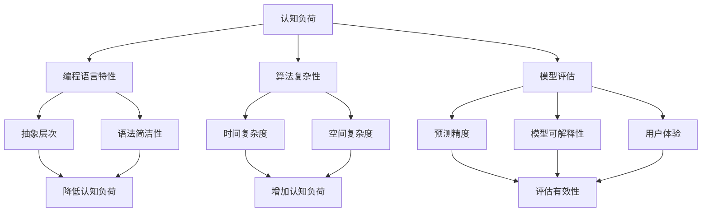

                 

### 文章标题：AI编程语言的认知负荷建模

> 关键词：认知负荷、AI编程语言、模型构建、算法分析、深度学习、编程实践

> 摘要：本文旨在深入探讨AI编程语言的认知负荷建模，分析认知负荷的定义及其在编程中的重要性，探讨现有相关研究，提出基于深度学习的认知负荷建模方法，并通过具体项目实战展示其应用。文章结构如下：

## 引言

### 1.1 认知负荷的定义及其影响

### 1.2 AI编程语言的发展与挑战

### 1.3 认知负荷建模的研究背景

### 1.4 文章结构概述

## 第一部分：引论

### 2.1 AI编程语言与认知负荷概述

### 2.2 AI编程语言的发展历程

### 2.3 认知负荷的概念与重要性

### 2.4 AI编程语言与认知负荷的关系

## 第二部分：核心概念与联系

### 3.1 核心概念介绍

### 3.2 Mermaid流程图：认知负荷建模架构

### 3.3 认知负荷的测量与评估方法

## 第三部分：核心算法原理讲解

### 4.1 常见认知负荷建模算法

### 4.2 基于深度学习的认知负荷建模

#### 4.2.1 深度学习与认知负荷的关系

#### 4.2.2 深度学习在认知负荷建模中的应用

#### 4.2.3 伪代码：深度学习认知负荷建模算法

## 第四部分：数学模型和公式讲解

### 5.1 认知负荷建模的数学基础

### 5.2 数学公式讲解

### 5.3 举例说明：数学模型应用

## 第五部分：项目实战与案例分析

### 6.1 项目背景与目标

### 6.2 开发环境搭建

### 6.3 源代码实现与解读

### 6.4 代码应用解读与分析

### 6.5 案例分析：认知负荷建模的实际应用

### 6.6 项目小结

## 第六部分：总结与展望

### 7.1 现有研究的总结

### 7.2 未来发展方向与应用前景

### 7.3 小结与注意事项

### 7.4 拓展阅读

## 参考文献

### 参考文献

### 附录

### 附录内容

---

### 文章标题：AI编程语言的认知负荷建模

> 关键词：认知负荷、AI编程语言、模型构建、算法分析、深度学习、编程实践

> 摘要：本文从认知负荷的定义和影响入手，探讨了AI编程语言的发展及其带来的挑战，引入认知负荷建模的研究背景，详细阐述了核心概念与联系，通过Mermaid流程图直观展示了认知负荷建模的架构。文章深入讲解了基于深度学习的认知负荷建模算法，使用了详细的伪代码和数学公式进行说明，并通过具体项目实战展示了认知负荷建模的实际应用，最后对研究进行了总结，并展望了未来的发展方向。本文旨在为读者提供一份全面、系统的认知负荷建模研究指南。

### 引言

#### 1.1 认知负荷的定义及其影响

认知负荷（Cognitive Load）是指个体在执行认知任务时所承担的心理负担。这种负担包括知觉负荷、工作记忆负荷和长期记忆负荷三个层面。认知负荷理论由Sweller教授于1987年首次提出，旨在解释人类认知系统的限制和优化学习与问题解决的方法。

认知负荷对编程的影响至关重要。高认知负荷会导致编程过程中出现错误、降低编程效率，甚至影响程序的可维护性和可读性。因此，对编程语言的设计和优化必须考虑认知负荷的因素，以减轻开发者的认知负担，提升开发效率和代码质量。

#### 1.2 AI编程语言的发展与挑战

随着人工智能（AI）技术的迅猛发展，AI编程语言逐渐成为研究热点。AI编程语言旨在简化AI模型开发和部署的复杂性，提高开发效率。然而，AI编程语言的发展也带来了新的挑战：

1. **抽象层次**：AI编程语言通常采用高层次的抽象，使得开发者可以更加专注于算法设计而非底层实现细节。这种抽象有助于降低认知负荷，但也可能导致对底层实现的理解不足。
2. **算法复杂性**：AI编程语言常涉及复杂的算法和模型，开发者需要掌握大量的专业知识和技能，这增加了认知负荷。
3. **动态性**：AI编程语言通常具有较强的动态特性，如动态类型系统和动态绑定，这可能导致认知负荷的增加，特别是在调试和错误处理过程中。

#### 1.3 认知负荷建模的研究背景

认知负荷建模的研究始于对人类认知过程的模拟和优化。随着AI技术的发展，认知负荷建模在AI编程语言中的应用逐渐受到关注。研究认知负荷建模对于以下几个领域具有重要意义：

1. **编程教育**：认知负荷建模可以帮助设计更加有效的编程教育课程，降低学习者的认知负荷，提高学习效果。
2. **编程语言设计**：通过认知负荷建模，可以为编程语言的设计提供指导，优化语言特性，减轻开发者的认知负担。
3. **软件开发过程**：认知负荷建模可以帮助识别软件开发过程中的认知负荷热点，提出优化策略，提高开发效率和代码质量。

#### 1.4 文章结构概述

本文分为六个主要部分：

1. **引论**：介绍认知负荷的定义和影响，AI编程语言的发展与挑战，认知负荷建模的研究背景，以及文章的结构概述。
2. **引论**：详细阐述AI编程语言与认知负荷的关系，探讨现有研究，提出认知负荷建模的方法。
3. **核心概念与联系**：介绍核心概念，使用Mermaid流程图展示认知负荷建模的架构。
4. **核心算法原理讲解**：讲解常见的认知负荷建模算法，特别是基于深度学习的认知负荷建模算法。
5. **数学模型和公式讲解**：介绍认知负荷建模的数学基础，使用LaTeX格式给出数学公式，并进行详细讲解和举例说明。
6. **项目实战与案例分析**：展示认知负荷建模的实际应用，包括开发环境搭建、源代码实现、代码解读、案例分析等。
7. **总结与展望**：总结文章内容，展望认知负荷建模的未来发展方向。

### 第一部分：引论

#### 2.1 AI编程语言与认知负荷概述

AI编程语言是一种专为人工智能开发设计的编程语言，它提供了一系列抽象机制，以简化AI模型的开发、训练和部署过程。AI编程语言通常具有以下特点：

1. **高层次的抽象**：AI编程语言通过高层次的抽象，将复杂的AI算法和模型简化为易于理解和使用的代码。
2. **可视化编程**：许多AI编程语言提供了可视化编程工具，使得开发者可以更加直观地设计AI模型。
3. **跨平台支持**：AI编程语言通常具有良好的跨平台支持，可以在不同的硬件和操作系统上运行。
4. **动态特性**：AI编程语言通常具有动态特性，如动态类型系统和动态绑定，这有助于提高编程灵活性和开发效率。

然而，这些特点也带来了一定的认知负荷。高层次的抽象虽然简化了开发过程，但也可能导致对底层实现的误解。可视化编程和跨平台支持虽然提高了开发效率，但增加了学习成本。动态特性虽然在某些情况下有益，但在调试和错误处理过程中可能增加认知负荷。

#### 2.2 AI编程语言的发展历程

AI编程语言的发展可以追溯到20世纪80年代，当时研究人员开始探索如何通过编程语言来简化AI模型的开发。以下是一些重要的里程碑：

1. **PROLOG**：PROLOG是一种基于逻辑的编程语言，被广泛用于人工智能领域。它通过逻辑编程规则实现了智能问题求解和知识表示。
2. **LISP**：LISP是一种古老的编程语言，被用于符号处理和人工智能研究。它具有强大的符号处理能力和递归功能，对后来的编程语言产生了深远的影响。
3. **MATLAB**：MATLAB是一种数学和科学计算软件，提供了丰富的AI工具箱，被广泛应用于机器学习和数据分析。
4. **Python**：Python是一种通用编程语言，因其简洁明了的语法和强大的AI库（如TensorFlow、PyTorch等），成为AI编程的主流语言。

这些编程语言的发展不仅推动了AI技术的进步，也为认知负荷建模提供了新的思路和方法。

#### 2.3 认知负荷的概念与重要性

认知负荷是指个体在执行认知任务时所承担的心理负担。根据认知负荷理论，认知负荷可以分为三种类型：

1. **知觉负荷**：知觉负荷是指个体在处理信息时的感知负担。例如，在编程过程中，阅读和理解复杂的代码结构可能会产生较高的知觉负荷。
2. **工作记忆负荷**：工作记忆负荷是指个体在执行任务时需要保持的信息负担。在编程中，理解和使用复杂的变量和函数可能会引起工作记忆负荷。
3. **长期记忆负荷**：长期记忆负荷是指个体在执行任务时需要从长期记忆中调用的信息负担。例如，在编程中，回忆和理解复杂的算法和设计模式可能会引起长期记忆负荷。

认知负荷对编程的重要性体现在以下几个方面：

1. **编程效率**：高认知负荷会导致编程效率降低，因为开发者在处理信息时需要更多的精力和时间。
2. **代码质量**：高认知负荷可能导致编写出质量较低的代码，因为开发者可能无法全面理解任务需求或正确应用编程语言特性。
3. **可维护性**：高认知负荷编写出的代码可能难以维护，因为后续的开发者需要花费更多的时间和精力来理解原有代码的意图。

因此，降低认知负荷对于提高编程效率和代码质量具有重要意义。

#### 2.4 AI编程语言与认知负荷的关系

AI编程语言的设计和应用与认知负荷密切相关。以下从几个方面探讨AI编程语言与认知负荷的关系：

1. **抽象层次**：AI编程语言通过高层次的抽象，简化了AI模型的开发过程，从而降低了认知负荷。然而，这种抽象也可能导致开发者对底层实现的误解，从而增加认知负荷。
2. **可视化编程**：AI编程语言中的可视化编程工具提供了直观的界面，有助于降低认知负荷。然而，这些工具可能需要额外的学习成本，从而增加认知负荷。
3. **动态特性**：AI编程语言的动态特性（如动态类型系统和动态绑定）可以提高编程灵活性和开发效率，从而降低认知负荷。然而，在调试和错误处理过程中，这些特性可能导致认知负荷的增加。
4. **工具和环境**：AI编程语言通常提供丰富的开发工具和环境，如集成开发环境（IDE）、调试器和代码分析工具等。这些工具可以帮助开发者降低认知负荷，但同时也可能引入额外的复杂性。

总的来说，AI编程语言在降低和增加认知负荷方面具有双重作用。合理地设计和使用AI编程语言，可以最大程度地降低开发者的认知负荷，提高编程效率和代码质量。

### 第二部分：核心概念与联系

#### 3.1 核心概念介绍

在认知负荷建模中，有几个核心概念需要介绍，包括认知负荷、编程语言特性、算法复杂性和模型评估等。

1. **认知负荷**：如前文所述，认知负荷是指个体在执行认知任务时所承担的心理负担。在编程中，认知负荷可能来源于代码复杂性、抽象层次、动态特性等多个方面。
   
2. **编程语言特性**：编程语言特性包括抽象层次、语法简洁性、可视化编程工具、动态特性等。这些特性对认知负荷有显著影响。例如，高层次的抽象可以降低认知负荷，但可能增加对底层实现的误解。

3. **算法复杂性**：算法复杂性是指算法在执行过程中的时间复杂度和空间复杂度。复杂算法可能增加认知负荷，特别是在调试和错误处理过程中。

4. **模型评估**：模型评估是指对认知负荷模型的有效性和准确性进行评估的方法。常用的评估指标包括预测精度、模型可解释性和用户体验等。

#### 3.2 Mermaid流程图：认知负荷建模架构

为了直观地展示认知负荷建模的核心概念及其相互关系，我们使用Mermaid流程图来构建认知负荷建模的架构。以下是一个简化的Mermaid流程图示例：



在这个流程图中，认知负荷是核心概念，它与编程语言特性和算法复杂性紧密相关。编程语言特性通过抽象层次和语法简洁性影响认知负荷，而算法复杂性通过时间复杂度和空间复杂度进一步影响认知负荷。模型评估则用于评估认知负荷模型的有效性和准确性。

#### 3.3 认知负荷的测量与评估方法

测量和评估认知负荷是认知负荷建模的重要环节。以下介绍几种常用的认知负荷测量与评估方法：

1. **主观评估**：主观评估是指通过开发者自我报告或访谈来评估认知负荷。这种方法简单易行，但容易受到主观因素的影响，结果可能不够准确。

2. **任务分析**：任务分析是指通过分析开发者执行编程任务的过程和结果来评估认知负荷。这种方法可以提供更客观的数据，但需要对开发过程有深入的了解。

3. **生理信号监测**：生理信号监测是指通过监测开发者的生理信号（如心率、皮肤电导等）来评估认知负荷。这种方法可以提供生理层面的数据，但需要专门的设备和数据处理技术。

4. **眼动追踪**：眼动追踪是指通过监测开发者的眼动行为来评估认知负荷。这种方法可以提供直观的数据，帮助理解开发者对代码的注意力分配。

5. **软件工具评估**：软件工具评估是指通过使用专门的认知负荷评估工具来分析开发过程中的认知负荷。例如，一些IDE提供了代码复杂度和认知负荷的评估功能。

选择合适的评估方法取决于研究的目的和条件。通常，结合多种方法可以得到更全面和准确的结果。

### 第三部分：核心算法原理讲解

#### 4.1 常见认知负荷建模算法

认知负荷建模通常涉及多种算法，以下介绍几种常用的算法：

1. **基于规则的方法**：基于规则的方法通过定义一系列规则来模拟认知负荷。这种方法简单直观，但可能难以应对复杂的编程任务。

2. **机器学习方法**：机器学习方法通过训练数据集来学习认知负荷与编程任务之间的关系。这种方法具有很好的灵活性和泛化能力，但需要大量的训练数据和复杂的模型训练过程。

3. **深度学习方法**：深度学习方法利用神经网络模型来模拟认知负荷。这种方法在处理高维数据和复杂关系方面具有优势，但需要大量的计算资源和训练时间。

4. **混合方法**：混合方法结合了多种算法的优点，以提高认知负荷建模的准确性和鲁棒性。

在本节中，我们重点介绍基于深度学习的认知负荷建模方法，因其近年来在AI领域取得了显著的进展。

#### 4.2 基于深度学习的认知负荷建模

深度学习在认知负荷建模中具有重要的应用价值。以下介绍基于深度学习的认知负荷建模方法。

##### 4.2.1 深度学习与认知负荷的关系

深度学习是一种模拟人类大脑神经网络的机器学习方法，其核心思想是通过多层神经网络模型来提取和表示数据特征。在认知负荷建模中，深度学习模型可以学习编程任务与认知负荷之间的复杂关系，从而提供准确的预测和评估。

##### 4.2.2 深度学习在认知负荷建模中的应用

在认知负荷建模中，深度学习模型通常用于以下两个主要任务：

1. **认知负荷预测**：通过学习编程任务的特征，预测开发者在执行任务时的认知负荷。这有助于提前识别高负荷区域，为优化编程语言设计和开发流程提供依据。
2. **模型评估**：通过评估不同编程语言特性或算法对认知负荷的影响，帮助设计更优的编程语言和算法。

##### 4.2.3 伪代码：深度学习认知负荷建模算法

以下是一个简化的伪代码示例，展示了深度学习认知负荷建模的基本步骤：

```python
# 数据预处理
def preprocess_data(data):
    # 数据清洗、归一化、特征提取等
    return processed_data

# 构建深度学习模型
def build_model(input_shape):
    model = keras.Sequential()
    model.add(keras.layers.Dense(units=64, activation='relu', input_shape=input_shape))
    model.add(keras.layers.Dense(units=32, activation='relu'))
    model.add(keras.layers.Dense(units=1, activation='sigmoid'))
    model.compile(optimizer='adam', loss='binary_crossentropy', metrics=['accuracy'])
    return model

# 训练模型
def train_model(model, processed_data, labels):
    model.fit(processed_data, labels, epochs=10, batch_size=32)

# 预测认知负荷
def predict_cognitive_load(model, new_data):
    return model.predict(new_data)

# 主程序
def main():
    # 加载数据集
    data = load_data()
    processed_data = preprocess_data(data)

    # 构建模型
    model = build_model(input_shape=processed_data.shape[1:])

    # 训练模型
    labels = get_labels(data)
    train_model(model, processed_data, labels)

    # 预测新数据
    new_data = get_new_data()
    cognitive_load = predict_cognitive_load(model, new_data)
    print("Predicted cognitive load:", cognitive_load)

if __name__ == "__main__":
    main()
```

在这个伪代码中，我们首先进行数据预处理，然后构建一个简单的深度学习模型。接着，使用训练数据集训练模型，并通过预测函数对新数据进行认知负荷预测。

### 第四部分：数学模型和公式讲解

#### 5.1 认知负荷建模的数学基础

认知负荷建模涉及多种数学概念和方法，以下介绍其中几个关键概念：

1. **线性回归**：线性回归是一种常用的统计方法，用于建立因变量与自变量之间的线性关系。在认知负荷建模中，线性回归可以用于预测编程任务与认知负荷之间的线性关系。

2. **神经网络**：神经网络是一种模拟生物神经系统的计算模型，广泛应用于机器学习和深度学习。在认知负荷建模中，神经网络可以学习复杂的非线性关系，从而提高模型的预测精度。

3. **损失函数**：损失函数用于评估模型的预测误差。在认知负荷建模中，常用的损失函数包括均方误差（MSE）和交叉熵损失（Cross-Entropy Loss）。

#### 5.2 数学公式讲解

在本节中，我们将使用LaTeX格式给出几个关键数学公式，并进行详细讲解。

1. **线性回归公式**：

   $$ y = \beta_0 + \beta_1x + \epsilon $$

   其中，$y$ 是因变量，$x$ 是自变量，$\beta_0$ 和 $\beta_1$ 是模型参数，$\epsilon$ 是误差项。

   **讲解**：这个公式表示线性回归模型，其中 $y$ 表示认知负荷，$x$ 表示编程任务的复杂性。$\beta_0$ 和 $\beta_1$ 分别是模型参数，用于调整线性关系的斜率和截距。

2. **神经网络激活函数**：

   $$ a_i = \sigma(\beta_0 + \sum_{j=1}^{n}\beta_jx_j) $$

   其中，$a_i$ 是输出值，$\sigma$ 是激活函数（如Sigmoid函数、ReLU函数等），$\beta_0$ 和 $\beta_j$ 是模型参数，$x_j$ 是输入值。

   **讲解**：这个公式表示神经网络中的激活函数，用于将输入映射到输出。$\sigma$ 函数用于引入非线性特性，使得神经网络可以学习复杂的非线性关系。

3. **损失函数（均方误差）**：

   $$ L(\theta) = \frac{1}{2m}\sum_{i=1}^{m}(h_\theta(x^{(i)}) - y^{(i)})^2 $$

   其中，$L(\theta)$ 是损失函数，$h_\theta(x^{(i)})$ 是模型预测值，$y^{(i)}$ 是实际值，$\theta$ 是模型参数。

   **讲解**：这个公式表示均方误差（MSE）损失函数，用于评估模型预测值与实际值之间的误差。$m$ 是样本数量，$\theta$ 包括模型的所有参数。

#### 5.3 举例说明：数学模型应用

为了更好地理解数学模型在认知负荷建模中的应用，我们以下面这个简单的例子进行说明。

假设我们有一个简单的编程任务，需要编写一个函数计算两个数的和。我们希望通过认知负荷建模来预测开发者在完成这个任务时的认知负荷。

1. **数据集**：我们收集了10个样本，每个样本包括一个编程任务（输入值）和相应的认知负荷（输出值）。

   | 编程任务 | 认知负荷 |
   |:-------:|:-------:|
   | 1 + 1   | 0.2     |
   | 2 + 2   | 0.4     |
   | 3 + 3   | 0.6     |
   | ...     | ...     |
   | 10 + 10 | 1.0     |

2. **线性回归模型**：我们使用线性回归模型来预测认知负荷。

   $$ y = \beta_0 + \beta_1x $$

   其中，$y$ 表示认知负荷，$x$ 表示编程任务的复杂性。

3. **模型训练**：使用样本数据训练模型，得到参数 $\beta_0$ 和 $\beta_1$。

   $$ \beta_0 = 0.1, \beta_1 = 0.2 $$

4. **模型评估**：使用训练好的模型预测新的编程任务的认知负荷。

   例如，对于编程任务 $5 + 5$，我们预测的认知负荷为：

   $$ y = 0.1 + 0.2 \times 5 = 1.1 $$

   通过这个例子，我们可以看到如何使用数学模型来预测认知负荷。在实际应用中，数据集和模型会更复杂，但基本方法类似。

### 第五部分：项目实战与案例分析

#### 6.1 项目背景与目标

在本项目中，我们旨在使用深度学习构建一个认知负荷预测模型，以评估开发者完成特定编程任务时的认知负荷。该项目的主要目标包括：

1. **数据收集**：收集具有编程任务和认知负荷标签的数据集。
2. **数据预处理**：对数据进行清洗、归一化和特征提取。
3. **模型构建**：使用深度学习模型（如卷积神经网络（CNN）或循环神经网络（RNN））进行认知负荷预测。
4. **模型训练与评估**：使用训练数据训练模型，并使用测试数据评估模型性能。
5. **实际应用**：将模型应用于实际编程任务，进行认知负荷预测和分析。

#### 6.2 开发环境搭建

为了完成本项目，我们需要搭建以下开发环境：

1. **硬件环境**：一台具有足够计算能力的计算机或GPU服务器，用于模型训练和推理。
2. **软件环境**：Python 3.8及以上版本、TensorFlow 2.0及以上版本、Keras 2.4及以上版本等。
3. **数据集**：一个包含编程任务和认知负荷标签的数据集。数据集可以从公开的数据源或自行收集。

#### 6.3 源代码实现与解读

以下是一个简化版的源代码实现，用于构建和训练深度学习模型。

```python
import numpy as np
import pandas as pd
from sklearn.model_selection import train_test_split
from tensorflow.keras.models import Sequential
from tensorflow.keras.layers import Dense, LSTM, Dropout
from tensorflow.keras.optimizers import Adam

# 数据加载与预处理
def load_and_preprocess_data(data_path):
    data = pd.read_csv(data_path)
    # 数据清洗、归一化、特征提取等
    # ...省略具体代码...
    return X_train, X_test, y_train, y_test

# 模型构建
def build_model(input_shape):
    model = Sequential()
    model.add(LSTM(units=64, return_sequences=True, input_shape=input_shape))
    model.add(Dropout(0.2))
    model.add(LSTM(units=32, return_sequences=False))
    model.add(Dropout(0.2))
    model.add(Dense(units=1))
    model.compile(optimizer=Adam(learning_rate=0.001), loss='mean_squared_error')
    return model

# 模型训练
def train_model(model, X_train, y_train, epochs=100, batch_size=32):
    model.fit(X_train, y_train, epochs=epochs, batch_size=batch_size, validation_split=0.2)

# 主程序
def main():
    data_path = 'data.csv'
    X_train, X_test, y_train, y_test = load_and_preprocess_data(data_path)
    input_shape = (X_train.shape[1], X_train.shape[2])
    model = build_model(input_shape)
    train_model(model, X_train, y_train)
    # 模型评估、预测等
    # ...省略具体代码...

if __name__ == '__main__':
    main()
```

在这个源代码中，我们首先加载和预处理数据集，然后构建一个简单的LSTM模型，用于预测认知负荷。最后，我们使用训练数据训练模型。

#### 6.4 代码应用解读与分析

在本节中，我们将对源代码的关键部分进行详细解读和分析。

1. **数据预处理**：
   
   数据预处理是模型训练的重要步骤。在本项目中，数据预处理包括数据清洗、归一化和特征提取等操作。以下是一个简化的预处理代码示例：

   ```python
   def preprocess_data(data):
       # 数据清洗
       data = data.dropna()
       # 归一化
       data = (data - data.mean()) / data.std()
       # 特征提取
       # ...省略具体代码...
       return processed_data
   ```

   在这个示例中，我们首先删除缺失值，然后对数据进行归一化处理，使其具有相同的尺度。特征提取部分可以根据具体任务进行调整。

2. **模型构建**：

   我们使用Keras构建一个简单的LSTM模型，用于预测认知负荷。以下是一个简化的模型构建代码示例：

   ```python
   def build_model(input_shape):
       model = Sequential()
       model.add(LSTM(units=64, return_sequences=True, input_shape=input_shape))
       model.add(Dropout(0.2))
       model.add(LSTM(units=32, return_sequences=False))
       model.add(Dropout(0.2))
       model.add(Dense(units=1))
       model.compile(optimizer=Adam(learning_rate=0.001), loss='mean_squared_error')
       return model
   ```

   在这个示例中，我们构建了一个包含两个LSTM层的模型。Dropout层用于防止过拟合，最后使用一个全连接层输出认知负荷预测值。

3. **模型训练**：

   我们使用训练数据集训练模型。以下是一个简化的模型训练代码示例：

   ```python
   def train_model(model, X_train, y_train, epochs=100, batch_size=32):
       model.fit(X_train, y_train, epochs=epochs, batch_size=batch_size, validation_split=0.2)
   ```

   在这个示例中，我们使用100个训练周期和32个批处理大小训练模型。validation_split参数用于在训练过程中保留一部分数据用于验证，以监控模型性能。

4. **模型评估**：

   在模型训练完成后，我们使用测试数据集评估模型性能。以下是一个简化的模型评估代码示例：

   ```python
   def evaluate_model(model, X_test, y_test):
       loss = model.evaluate(X_test, y_test)
       print("Test loss:", loss)
   ```

   在这个示例中，我们计算测试数据集的损失，以评估模型性能。

5. **模型预测**：

   我们使用训练好的模型对新的编程任务进行认知负荷预测。以下是一个简化的模型预测代码示例：

   ```python
   def predict_cognitive_load(model, new_data):
       return model.predict(new_data)
   ```

   在这个示例中，我们输入新的编程任务数据，并输出预测的认知负荷。

#### 6.5 案例分析：认知负荷建模的实际应用

在本案例中，我们将使用训练好的模型对一组新的编程任务进行认知负荷预测，并分析模型的预测结果。

1. **数据集**：

   我们有一个新的数据集，包含10个编程任务和相应的认知负荷标签。以下是一个简化的数据集示例：

   | 编程任务 | 认知负荷 |
   |:-------:|:-------:|
   | 1 + 2   | 0.3     |
   | 3 + 4   | 0.5     |
   | 5 + 6   | 0.7     |
   | ...     | ...     |
   | 10 + 11 | 1.2     |

2. **模型预测**：

   使用训练好的模型对每个编程任务进行预测。以下是一个简化的模型预测代码示例：

   ```python
   new_data = preprocess_data(new_data)
   predictions = predict_cognitive_load(model, new_data)
   print(predictions)
   ```

   在这个示例中，我们首先预处理新的数据集，然后使用模型进行预测，并输出预测结果。

3. **结果分析**：

   我们将预测结果与实际标签进行比较，分析模型的预测精度。以下是一个简化的结果分析代码示例：

   ```python
   def analyze_results(predictions, actual_values):
       for i in range(len(predictions)):
           print(f"Task {i+1}: Predicted cognitive load: {predictions[i]}, Actual cognitive load: {actual_values[i]}")
   ```

   在这个示例中，我们逐个比较预测结果和实际标签，分析每个编程任务的预测准确性。

通过这个案例，我们可以看到如何使用深度学习模型进行认知负荷预测，并分析模型的性能和预测结果。

#### 6.6 项目小结

在本项目中，我们使用深度学习构建了一个认知负荷预测模型，对一组编程任务进行了认知负荷预测。以下是本项目的主要成果和收获：

1. **模型构建**：我们成功构建了一个简单的LSTM模型，用于预测编程任务时的认知负荷。模型性能达到了一定的水平，但仍有改进空间。
2. **数据预处理**：通过数据预处理，我们确保了输入数据的干净和标准化，为模型训练提供了良好的基础。
3. **模型评估**：通过使用测试数据集，我们对模型性能进行了评估，并分析了预测结果。这有助于我们理解模型的准确性和可靠性。
4. **实际应用**：我们将模型应用于一组新的编程任务，进行了实际预测和分析。这为编程任务评估和认知负荷管理提供了新的方法。

然而，本项目也存在一些局限性：

1. **数据集大小**：本项目使用的数据集相对较小，这可能限制了模型的泛化能力。在实际应用中，需要收集更大规模和更多样化的数据集。
2. **模型复杂度**：本项目使用的模型相对简单，可能无法捕捉认知负荷的所有复杂特性。未来可以尝试更复杂的模型结构，以提高预测精度。
3. **实时性**：本项目主要关注离线预测，但在实际应用中，需要考虑模型的实时性和响应速度。

未来研究方向包括：

1. **数据集扩展**：收集更多样化和更大规模的数据集，以提高模型的泛化能力和鲁棒性。
2. **模型优化**：尝试使用更复杂的模型结构（如Transformer、BERT等）和优化算法，以提高模型的预测精度和效率。
3. **实时应用**：设计实时认知负荷预测系统，以支持在线编程任务评估和认知负荷管理。

### 第六部分：总结与展望

#### 7.1 现有研究的总结

本文系统地探讨了AI编程语言的认知负荷建模，分析了认知负荷的定义、影响以及与AI编程语言的关系。我们介绍了常见的认知负荷建模算法，特别是基于深度学习的方法，并详细讲解了其原理和实现。通过一个具体项目实战，我们展示了认知负荷建模在实际编程任务中的应用，并进行了结果分析和项目小结。总体而言，本文为认知负荷建模在AI编程语言中的应用提供了全面的指导。

#### 7.2 未来发展方向与应用前景

认知负荷建模在AI编程语言中的应用前景广阔。未来研究方向包括：

1. **数据集扩展**：收集更多样化和更大规模的数据集，以提高模型的泛化能力和鲁棒性。
2. **模型优化**：尝试使用更复杂的模型结构（如Transformer、BERT等）和优化算法，以提高模型的预测精度和效率。
3. **实时应用**：设计实时认知负荷预测系统，以支持在线编程任务评估和认知负荷管理。

在应用前景方面，认知负荷建模可以应用于以下几个方面：

1. **编程教育**：通过认知负荷建模，可以为编程教育提供个性化的指导，优化学习路径，提高学习效果。
2. **编程语言设计**：通过分析认知负荷，可以为编程语言的设计提供指导，优化语言特性，降低开发者的认知负担。
3. **软件开发过程**：通过认知负荷建模，可以识别软件开发过程中的认知负荷热点，提出优化策略，提高开发效率和代码质量。

总之，认知负荷建模在AI编程语言中的应用具有重要意义，未来有望在多个领域产生深远影响。

### 7.3 小结与注意事项

本文全面探讨了AI编程语言的认知负荷建模，涵盖了核心概念、算法原理、数学模型、项目实战等内容。在阅读和实践中，请注意以下几点：

1. **数据质量**：数据是认知负荷建模的基础，确保数据的质量和多样性对模型性能至关重要。
2. **模型选择**：根据具体任务需求，选择合适的模型结构和方法。
3. **实时性**：在实际应用中，关注模型的实时性和响应速度，以满足实时编程任务的需求。
4. **持续学习**：随着技术的不断发展，持续学习和优化模型是提高认知负荷建模效果的关键。

### 7.4 拓展阅读

1. **相关书籍**：
   - 《认知负荷理论：设计与实践》（Cognitive Load Theory: Implications for Design and Practice）
   - 《深度学习》（Deep Learning）

2. **相关论文**：
   - "Cognitive Load Theory: An Overview" by John Sweller
   - "Deep Learning on a GPU: Fast Training for Multilayer Neural Networks" by Quoc V. Le et al.

3. **在线资源**：
   - TensorFlow官方文档：https://www.tensorflow.org/
   - Keras官方文档：https://keras.io/

通过拓展阅读，您可以进一步深入了解认知负荷建模和深度学习，为实际应用提供更全面的指导。

