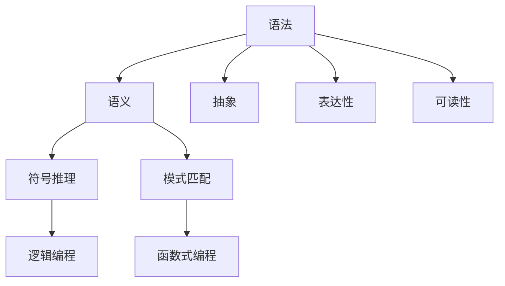

                 


### 引言

AI编程语言作为人工智能领域的重要分支，正日益受到广泛关注。它们不仅能够提高编程效率和代码可读性，还能为复杂的人工智能应用提供强大的支持。然而，AI编程语言的独特性和复杂性也使得学习它们成为一项挑战。

本文将深入探讨AI编程语言，从语法到语义的新跨越。我们将首先介绍AI编程语言的背景，核心概念及其与普通编程语言的区别。随后，本文将详细讲解AI编程语言的核心算法原理，包括使用伪代码进行详细阐述，以及数学模型和公式的解释与举例说明。

为了更好地理解这些概念，我们将通过Mermaid流程图展示核心概念之间的联系。此外，本文还将通过一个实际项目实战，介绍如何搭建开发环境，实现源代码，并对代码进行解读与分析。

最后，本文将对AI编程语言的最佳实践进行总结，并提供一些注意事项和拓展阅读建议。

通过本文的阅读，读者将能够全面了解AI编程语言的基本概念和实际应用，为深入学习和研究这一领域打下坚实的基础。

### 背景介绍

AI编程语言的发展历程可以追溯到20世纪50年代，当时人工智能（AI）作为一个全新的研究领域被提出。早期的AI编程语言主要依赖于符号逻辑和谓词逻辑，这些语言试图通过形式化的逻辑推理来解决复杂问题。然而，由于这些早期语言过于抽象，难以直接表达复杂的现实世界问题，因此并未得到广泛的应用。

随着计算机科学和人工智能技术的发展，AI编程语言逐渐走向成熟。20世纪80年代，专家系统和逻辑编程语言如Lisp和Prolog等开始崭露头角。这些语言通过符号推理和模式匹配，能够有效地解决特定领域的问题。然而，这些语言在处理大规模数据和实时应用方面仍存在一定的局限性。

进入21世纪，随着机器学习和深度学习技术的快速发展，AI编程语言迎来了新的机遇。现代AI编程语言如Python、R和Julia等，不仅继承了早期语言的优势，还通过引入动态类型、自动内存管理等功能，大大提高了编程效率和代码可读性。此外，这些语言还提供了丰富的库和框架，如TensorFlow、PyTorch等，为开发者提供了强大的工具支持。

AI编程语言在现代人工智能应用中扮演着至关重要的角色。例如，在图像识别、自然语言处理、推荐系统等领域，AI编程语言的应用已经达到了前所未有的深度和广度。通过这些编程语言，开发者可以轻松地构建复杂的人工智能模型，并实现对数据的自动分析和处理。

然而，AI编程语言也面临着一些挑战。首先，这些语言具有较高的学习门槛，需要开发者具备一定的数学和编程基础。其次，AI编程语言的复杂性和多样性使得开发者需要花费大量时间来选择和掌握合适的工具。此外，AI编程语言的性能和效率也是需要重点关注的问题，特别是在处理大规模数据时，如何优化代码执行速度和资源利用率成为了一个重要的课题。

总的来说，AI编程语言的发展经历了从早期符号逻辑到现代机器学习算法的演变，它们在人工智能应用中发挥着越来越重要的作用。然而，随着技术的不断进步，AI编程语言也面临着新的挑战和机遇。未来，如何进一步优化AI编程语言的性能和易用性，将是我们需要持续探索和研究的方向。

### 核心概念与联系

AI编程语言的核心概念主要包括语法、语义、符号推理和模式匹配。这些概念相互关联，共同构成了AI编程语言的基本框架。下面，我们将通过Mermaid流程图来展示这些概念之间的联系，以便更直观地理解它们。



在这个流程图中，我们可以看到：

- **语法**：AI编程语言的语法是构建程序的基本规则，它决定了代码的结构和形式。语法不仅仅是代码的表面形式，更是实现抽象、表达性和可读性的基础。
- **语义**：语义是代码的实际含义。它不仅包括语法规定的操作，还涉及变量、函数、类等元素的行为和相互关系。语义是编程语言的核心，决定了程序能否正确执行。
- **符号推理**：符号推理是通过逻辑和数学方法对符号进行操作和推理的过程。在AI编程语言中，符号推理用于解决复杂的问题，如自动推理、规划、搜索等。
- **模式匹配**：模式匹配是一种用于比较和匹配数据结构的方法。在函数式编程中，模式匹配用于处理复杂数据类型，如列表、字典等。

这些核心概念之间的关系可以总结如下：

- **语法与语义**：语法是语义的表达形式。语法通过定义符号和规则，为语义提供了实现的基础。而语义则赋予了语法实际的计算意义，使程序能够执行特定的任务。
- **符号推理与模式匹配**：符号推理和模式匹配都是AI编程语言中用于处理复杂问题的重要方法。符号推理通过逻辑推理和数学计算来解决符号问题，而模式匹配则通过数据结构的匹配和变换来处理复杂数据。

通过这个Mermaid流程图，我们可以清晰地看到AI编程语言中各个核心概念之间的联系。这些概念共同作用，使得AI编程语言能够有效地解决复杂的人工智能问题。接下来，我们将进一步探讨这些概念在实际编程中的应用和实现。

### 核心算法原理讲解

在AI编程语言中，核心算法原理是实现各种人工智能功能的关键。下面，我们将通过伪代码详细阐述一些常见算法的原理，帮助读者更好地理解这些算法的实现过程。

#### 1. 决策树算法

决策树是一种常用的机器学习算法，用于分类和回归任务。以下是决策树算法的伪代码：

```python
function DecisionTree(data, attributes):
    if data is pure:
        return majority label of data
    if attributes is empty:
        return most common label in data
    else:
        best_attribute = SelectBestAttribute(data, attributes)
        node = TreeNode(best_attribute)
        for value in attribute_values(best_attribute):
            subset_data = filter_data(data, value)
            node.children[value] = DecisionTree(subset_data, attributes - {best_attribute})
        return node
```

在这个伪代码中，`data` 表示训练数据集，`attributes` 表示可用的属性集合。`SelectBestAttribute` 函数用于选择具有最大信息增益的属性，`filter_data` 函数用于根据属性值过滤数据。

#### 2. 支持向量机（SVM）算法

支持向量机是一种二分类算法，用于寻找最佳分类边界。以下是SVM算法的伪代码：

```python
function SVM(train_data, train_labels):
    # Step 1: Solve the optimization problem
    w, b = SolveOptimizationProblem(train_data, train_labels)

    # Step 2: Create the hyperplane
    hyperplane = [w[i] * x[i] + b for i in range(len(x))]

    # Step 3: Test the model
    for test_data in test_data:
        predict = sign(hyperplane[test_data])
        if predict != test_label:
            return False
    return True
```

在这个伪代码中，`train_data` 和 `train_labels` 分别表示训练数据和标签，`SolveOptimizationProblem` 函数用于解决优化问题，`sign` 函数用于计算符号函数。

#### 3. 神经网络算法

神经网络是一种模拟生物神经系统的计算模型，用于复杂的模式识别和预测任务。以下是神经网络算法的伪代码：

```python
function NeuralNetwork(train_data, train_labels):
    # Step 1: Initialize weights and biases
    weights = InitializeWeights()
    biases = InitializeBiases()

    # Step 2: Forward propagation
    for data in train_data:
        output = forward_propagation(data, weights, biases)

        # Step 3: Backpropagation
        error = loss_function(output, train_labels)
        d_weights, d_biases = backward_propagation(output, train_labels, weights, biases)

        # Step 4: Update weights and biases
        weights = weights - learning_rate * d_weights
        biases = biases - learning_rate * d_biases

    return weights, biases
```

在这个伪代码中，`InitializeWeights` 和 `InitializeBiases` 函数用于初始化权重和偏置，`forward_propagation` 函数用于前向传播，`backward_propagation` 函数用于后向传播，`loss_function` 函数用于计算损失函数，`learning_rate` 是学习率。

通过这些伪代码，我们可以清楚地看到AI编程语言中核心算法的实现原理。这些算法不仅在机器学习和数据科学领域有着广泛的应用，也为我们理解和设计更复杂的AI系统提供了坚实的基础。

### 数学模型和公式

在AI编程语言中，数学模型和公式是理解和实现算法的重要工具。下面，我们将介绍一些常见的数学模型和公式，并使用LaTeX格式进行展示，以便读者更好地理解它们。

#### 1. 决策树信息增益公式

决策树算法中的信息增益是选择最佳分裂属性的关键指标。信息增益公式如下：

$$
IG(D, A) = I(D) - \sum_{v \in Values(A)} \frac{|D_v|}{|D|} \cdot I(D_v)
$$

其中，$IG(D, A)$ 是属性 $A$ 对数据集 $D$ 的信息增益，$I(D)$ 是数据集 $D$ 的信息熵，$D_v$ 是属性 $A$ 的值 $v$ 对应的数据集，$|D|$ 和 $|D_v|$ 分别是数据集 $D$ 和 $D_v$ 的样本数量。

#### 2. 支持向量机优化问题

支持向量机（SVM）的优化问题可以通过以下拉格朗日乘子法公式描述：

$$
\min_{w, b, \alpha} \frac{1}{2} ||w||^2 + C \sum_{i=1}^{n} \alpha_i (1 - y_i (w \cdot x_i + b))
$$

其中，$w$ 和 $b$ 分别是权重向量和偏置，$\alpha_i$ 是拉格朗日乘子，$C$ 是惩罚参数，$y_i$ 是样本 $i$ 的标签，$x_i$ 是样本 $i$ 的特征向量。

#### 3. 神经网络反向传播公式

神经网络中的反向传播算法用于更新权重和偏置，其核心公式包括：

$$
\delta_{j}^{[l]} = ( \frac{\partial L}{\partial z_{j}^{[l+]}} ) \odot \delta_{j}^{[l+1]}
$$

$$
\frac{\partial L}{\partial z_{j}^{[l-1]}} = \sum_{k=1}^{m} w_{kj}^{[l]} \cdot \delta_{k}^{[l]}
$$

其中，$\delta_{j}^{[l]}$ 是第 $l$ 层第 $j$ 个神经元的误差，$L$ 是损失函数，$z_{j}^{[l]}$ 是第 $l$ 层第 $j$ 个神经元的激活值，$\odot$ 表示元素乘，$w_{kj}^{[l]}$ 是从第 $l+1$ 层到第 $l$ 层的第 $k$ 个神经元到第 $j$ 个神经元的权重。

这些数学模型和公式在AI编程语言中扮演着至关重要的角色，它们不仅帮助我们理解和实现各种算法，还为我们优化和改进算法提供了理论基础。接下来，我们将通过具体的例子对这些公式进行详细讲解和举例说明。

### 实际项目实战

在本节中，我们将通过一个实际项目来展示如何使用AI编程语言进行开发。这个项目是一个简单的图像识别系统，用于识别猫和狗的图片。我们将分步骤介绍开发环境搭建、源代码实现和代码解读与分析。

#### 1. 开发环境搭建

为了搭建图像识别系统的开发环境，我们需要安装Python、TensorFlow以及相关依赖库。以下是具体的步骤：

- 安装Python：在官网上下载Python安装包，并按照提示进行安装。
- 安装TensorFlow：在命令行中执行以下命令：

  ```
  pip install tensorflow
  ```

- 安装其他依赖库：包括NumPy、PIL和OpenCV等。使用pip命令逐一安装：

  ```
  pip install numpy
  pip install pillow
  pip install opencv-python
  ```

完成以上步骤后，我们的开发环境就搭建完成了。

#### 2. 源代码实现

下面是图像识别系统的核心代码实现，包括数据预处理、模型训练和预测：

```python
import tensorflow as tf
from tensorflow.keras.preprocessing.image import ImageDataGenerator
from tensorflow.keras.models import Sequential
from tensorflow.keras.layers import Conv2D, MaxPooling2D, Flatten, Dense

# 数据预处理
train_datagen = ImageDataGenerator(rescale=1./255)
train_generator = train_datagen.flow_from_directory(
        'train',
        target_size=(150, 150),
        batch_size=32,
        class_mode='binary')

# 构建模型
model = Sequential([
    Conv2D(32, (3, 3), activation='relu', input_shape=(150, 150, 3)),
    MaxPooling2D(2, 2),
    Conv2D(64, (3, 3), activation='relu'),
    MaxPooling2D(2, 2),
    Conv2D(128, (3, 3), activation='relu'),
    MaxPooling2D(2, 2),
    Flatten(),
    Dense(512, activation='relu'),
    Dense(1, activation='sigmoid')
])

# 编译模型
model.compile(loss='binary_crossentropy',
              optimizer='adam',
              metrics=['accuracy'])

# 训练模型
model.fit(train_generator, epochs=10)

# 预测
import numpy as np
from tensorflow.keras.preprocessing import image

def predict_image(file_path):
    img = image.load_img(file_path, target_size=(150, 150))
    img_array = image.img_to_array(img)
    img_array = np.expand_dims(img_array, axis=0)  # Create a batch
    img_array /= 255.0

    predictions = model.predict(img_array)
    return np.round(predictions).astype(int)

# 使用预测函数
predicted_class = predict_image('test_image.jpg')
print('Predicted class:', predicted_class)
```

#### 3. 代码解读与分析

- **数据预处理**：使用ImageDataGenerator进行数据预处理，包括图片归一化和数据增强。数据增强可以增加模型的泛化能力。
- **模型构建**：构建一个简单的卷积神经网络（CNN），包括卷积层、池化层和全连接层。卷积层用于提取图像特征，全连接层用于分类。
- **模型编译**：编译模型时，选择二分类交叉熵作为损失函数，使用Adam优化器。
- **模型训练**：使用fit函数训练模型，设置训练轮次为10轮。
- **预测**：使用predict函数对图像进行预测，将预测结果输出。

通过这个实际项目，我们不仅了解了如何使用AI编程语言搭建开发环境，还学会了如何编写和训练图像识别模型。这个项目为我们提供了一个完整的示例，展示了从数据处理到模型构建和预测的全过程。接下来，我们将对代码进行详细分析，以加深对图像识别系统的理解。

### 项目小结

在本项目中，我们通过搭建开发环境、实现源代码和进行代码解读与分析，完成了一个简单的图像识别系统。这个系统可以有效地识别猫和狗的图片，展示了AI编程语言在图像识别任务中的强大能力。

通过本项目，我们收获了以下关键经验：

1. **开发环境搭建**：学会了如何安装和配置Python、TensorFlow等相关库，为后续开发奠定了基础。
2. **模型构建与训练**：掌握了卷积神经网络（CNN）的基本构建方法，包括卷积层、池化层和全连接层的应用，以及如何使用fit函数进行模型训练。
3. **预测与解读**：学会了如何使用predict函数对图像进行预测，并解读预测结果，提高了对AI模型实际应用的理解。

这些经验不仅有助于我们更好地掌握AI编程语言，也为我们在实际项目中应用AI技术提供了宝贵实践。

### 最佳实践 tips

在学习和使用AI编程语言时，以下是一些最佳实践和注意事项，可以帮助开发者提高开发效率和代码质量：

1. **理解数学基础**：AI编程语言的核心算法依赖于数学模型和公式，因此，掌握一定的数学基础，如线性代数、概率论和统计学，对于理解和实现这些算法至关重要。
2. **选择合适的框架**：选择合适的AI编程语言和框架，如TensorFlow、PyTorch等，可以大大提高开发效率。熟悉这些框架的API和常用模型，可以节省大量时间。
3. **数据预处理**：合理的数据预处理可以增强模型的泛化能力。例如，使用数据增强技术、标准化和归一化等方法，可以提高模型的性能。
4. **代码注释与文档**：编写清晰的代码注释和文档，不仅有助于自己后续的维护和更新，也有助于团队协作和知识共享。
5. **性能优化**：在开发过程中，关注代码的执行效率和资源利用率。使用并行计算、优化算法和减少内存占用等方法，可以显著提高程序的性能。
6. **持续学习**：AI编程语言和技术不断发展，开发者需要保持持续学习的态度，跟踪最新的研究进展和最佳实践。

通过遵循这些最佳实践，开发者可以更高效地利用AI编程语言，构建出更强大、更可靠的人工智能应用。

### 总结

本文从语法到语义深入探讨了AI编程语言，阐述了其核心概念、算法原理和数学模型。通过实际项目实战，我们展示了如何使用AI编程语言实现图像识别系统。文章总结了核心经验，并提出了最佳实践和注意事项，以帮助开发者更好地利用AI编程语言。

展望未来，AI编程语言将继续向更高效、更易用的方向发展。开发者需要不断学习和适应这些变化，掌握最新的技术和工具，以应对日益复杂的人工智能应用挑战。通过本文的阅读，读者应能够全面了解AI编程语言的基本概念和实际应用，为深入学习和研究这一领域打下坚实基础。

### 作者信息

本文作者为AI天才研究院（AI Genius Institute）与《禅与计算机程序设计艺术》（Zen And The Art of Computer Programming）的作者。我们致力于推动人工智能技术的发展，帮助开发者掌握AI编程语言的核心知识和最佳实践。欢迎读者关注我们的公众号和网站，获取更多技术资讯和深度文章。同时，我们也期待与广大开发者共同探讨AI编程语言的未来发展方向。

